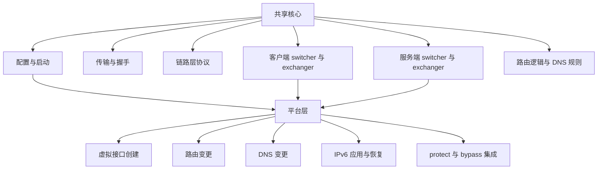
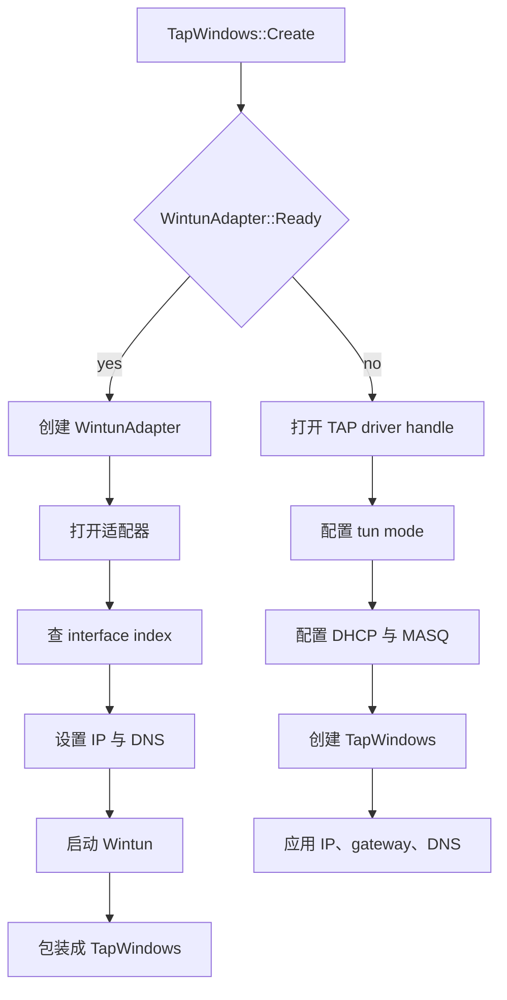
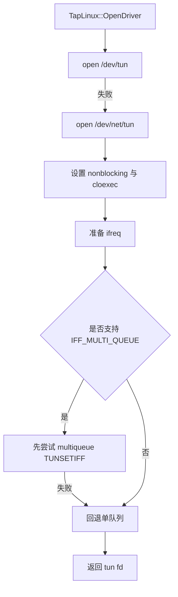
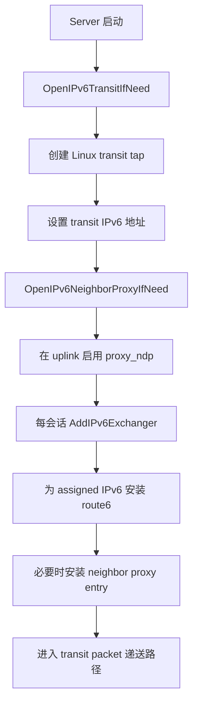
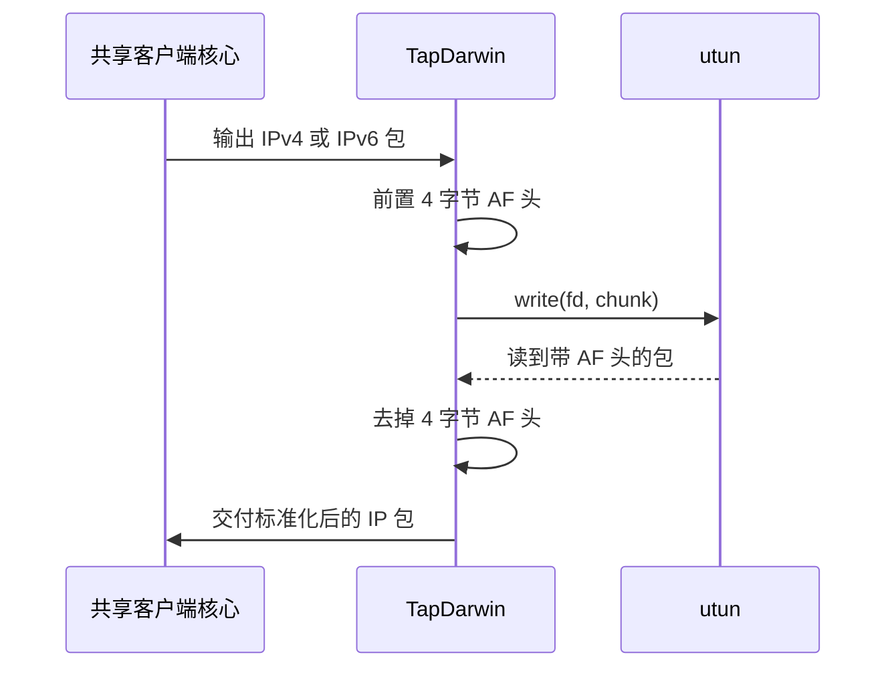
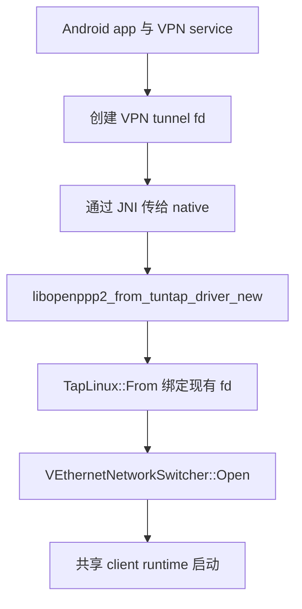
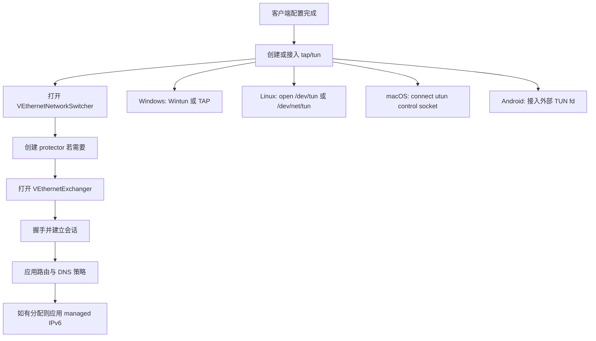

# 平台集成

[English Version](PLATFORMS.md)

## 范围

本文解释 OPENPPP2 如何把一套共享的协议与运行时核心，落到几种差异非常大的宿主网络模型上。本文不是为了泛泛地说“项目支持 Windows、Linux、macOS、Android”，而是要基于代码解释：每个平台真实做了什么，哪些逻辑是共享的，哪些逻辑是平台特化的，这些差异为什么存在，以及它们在部署和运维上的真实边界是什么。

本文主要基于以下源码路径：

- `main.cpp`
- `ppp/app/client/VEthernetNetworkSwitcher.cpp`
- `ppp/app/server/VirtualEthernetSwitcher.cpp`
- `windows/ppp/tap/TapWindows.cpp`
- `windows/ppp/win32/network/NetworkInterface.cpp`
- `windows/ppp/win32/network/Win32NetworkRouter.cpp`
- `windows/ppp/ipv6/WIN32_IPv6Auxiliary.cpp`
- `linux/ppp/tap/TapLinux.cpp`
- `linux/ppp/net/ProtectorNetwork.cpp`
- `linux/ppp/ipv6/LINUX_IPv6Auxiliary.cpp`
- `darwin/ppp/tap/TapDarwin.cpp`
- `darwin/ppp/tun/utun.cpp`
- `darwin/ppp/ipv6/DARWIN_IPv6Auxiliary.cpp`
- `android/libopenppp2.cpp`
- `android/CMakeLists.txt`
- 根目录 `CMakeLists.txt`
- `build_windows.bat`
- `build-openppp2-by-builds.sh`
- `build-openppp2-by-cross.sh`

## 为什么平台代码被保留为显式实现

OPENPPP2 并没有尝试用一个很薄的伪统一抽象，把所有平台差异完全藏起来。这是有意为之。网络基础设施软件最终一定会依赖宿主机的真实行为，包括：

- 虚拟网卡如何创建
- 进程是自己创建网卡，还是接收一个已经打开的 fd
- IPv4/IPv6 地址如何落到接口上
- DNS 是通过系统 API、WMI、resolver 文件还是 shell 工具修改
- 路由如何插入、替换、保护、恢复
- socket 能否被 protect，避免控制流量走回隧道自身
- 服务端 IPv6 data plane 是否在该平台上真正落地

因此，代码库选择保留共享核心和平台集成层的清晰分层：

- 共享核心负责协议、会话、runtime、MUX、mapping、static packet、DNS 规则、client/server 协作
- 平台层负责虚拟接口、路由、DNS、protect、IPv6 接口配置等与宿主系统紧耦合的事情

这一点也体现在构建系统里。根 `CMakeLists.txt` 会在 configure 阶段选择平台源集：

- Windows 编译 `windows/*.cpp`
- macOS 编译 `darwin/*.cpp`
- Linux 编译 `linux/*.cpp`

Android 则根本不是用根 CLI 工程构建，而是走独立的 `android/CMakeLists.txt`，输出共享库 `openppp2`，并复用 Linux 网络实现与 JNI glue。

## 共享核心与平台层的边界

共享核心负责那些不依赖具体操作系统的内容：

- 配置加载与规范化
- client/server 模式选择
- handshake 与 transmission 构造
- 链路层协议分发
- static packet 打包与解包
- MUX 会话管理
- mapping、NAT、DNS 规则匹配、tunnel 内 datagram 流程
- `VEthernetNetworkSwitcher` 与 `VirtualEthernetSwitcher` 的上层编排

平台层负责那些必须依赖宿主机行为的事情：

- 创建或接入虚拟接口
- 和内核虚拟接口收发报文
- 安装与删除路由
- 应用与恢复 DNS
- 设置 MTU、地址、gateway
- socket protect / anti-recursion
- 服务端 IPv6 transit 这类真正依赖 OS data plane 的功能

## 构建阶段的平台选择

根 `CMakeLists.txt` 并不是把所有平台实现都编进去，再在运行时判断。它是在构建阶段就选择平台代码。

Windows：

- 配置 MSVC 相关编译选项
- 依赖 vcpkg 提供 Boost、OpenSSL、jemalloc
- 编译 `windows/*.cpp`

Darwin：

- 直接强制使用 C++17
- 编译 `darwin/*.cpp`
- 复用 common/unix 源集

Linux：

- 编译 `linux/*.cpp`
- 复用 common/unix 源集

Android：

- 走独立 `android/CMakeLists.txt`
- 输出 `ADD_LIBRARY(... SHARED ...)`
- 复用 Linux 源码与 `android/libopenppp2.cpp`

这说明 OPENPPP2 的“跨平台”不是一个单可执行程序包打天下，而是每个平台都由不同的宿主集成树来塑形。

## Windows

### 运行时定位

Windows 是当前代码库里 API 集成最重的客户端平台。它不是简单地打开一个 tun-like 设备，再靠 shell 命令改系统路由，而是接入了多套 Windows 特有机制：

- Wintun
- TAP-Windows 回退路径
- 基于 WMI 的网卡配置
- 基于 IP Helper 的路由管理
- Windows DNS cache flush
- 可选 system HTTP proxy 与 QUIC 相关策略处理
- Windows 特有的 PaperAirplane 客户端路径

### 虚拟接口模型

核心入口在 `windows/ppp/tap/TapWindows.cpp`。

`TapWindows::Create(...)` 会先验证地址与 lease time，然后走两条不同路径中的一条。

第一条路径是 Wintun。若 `WintunAdapter::Ready()` 返回 true，则代码会创建 `WintunAdapter`，打开适配器，按 friendly name 查找 interface index，应用接口配置，启动 Wintun ring buffer，然后再把它包装成 `TapWindows`。

第二条路径是 TAP-Windows fallback。若 Wintun 不可用，代码会打开 `\\.\Global\<component>.tap` 设备句柄，把 TAP 驱动配置成 tun 模式，配置 DHCP/MASQ 行为，推送 DHCP option，最后再单独把宿主接口地址和 DNS 配好。

因此，“Windows 支持”在实现上并不是单一路径，而是：

- 优先路径：Wintun
- 兼容路径：TAP-Windows

### 地址与 DNS 应用方式

Windows 的接口配置逻辑分散在 `TapWindows.cpp` 与 `NetworkInterface.cpp`。

`TapWindows::SetAddresses(...)` 会验证 IPv4 输入，如果 gateway 非法，则只设置 IP 和 mask；如果 gateway 合法，则先设置 IP/mask，再设置 default gateway。

DNS 通过 `TapWindows::SetDnsAddresses(...)` 下沉到 `ppp::win32::network::SetDnsAddresses(...)`。

而在 `windows/ppp/win32/network/NetworkInterface.cpp` 中，这些动作并不是通过 shell，而是通过 WMI 查询 `Win32_NetworkAdapterConfiguration` 对象，并对匹配的 `InterfaceIndex` 执行配置方法。

这和 Linux/macOS 的实现模型完全不同。Windows 更像是“通过系统管理接口修改网络配置”，而不是“直接发 shell 命令或 raw route message”。

### 路由管理

Windows 路由的核心辅助类在 `windows/ppp/win32/network/Win32NetworkRouter.cpp`。

它调用的核心 API 包括：

- `GetBestRoute`
- `GetBestInterface`
- `GetIpForwardTable`
- `CreateIpForwardEntry`
- `DeleteIpForwardEntry`

`Router::Add(...)` 会推导 gateway 对应最佳接口，纠正 metric，读取 `GetIpInterfaceEntry(...)` 返回的 interface metric，然后构造 `MIB_IPFORWARDROW`。删除逻辑则会遍历现有路由表，按 destination、mask、gateway 和可选 interface index 匹配删除。

因此，客户端在 `VEthernetNetworkSwitcher` 里进行路由引流时，在 Windows 上并不是调 `route.exe`，而是直接通过系统 route table API 修改路由。

### DNS Cache Flush 与收尾动作

Windows 还具有一个 Unix 侧没有完全同形的行为：resolver cache flush。`TapWindows::DnsFlushResolverCache()` 最终调用 `Dnsapi.dll` 里的 `DnsFlushResolverCache`。

这一点在 Windows IPv6 helper 中也有体现。它表明 Windows DNS 配置变化后，项目显式试图让系统 resolver 尽快感知变更，而不是仅仅依赖系统自己 eventual consistency。

### Windows 客户端额外行为

`VEthernetNetworkSwitcher.cpp` 中还有一些 Windows 特化逻辑，不仅仅是虚拟接口本身。

在 hosted-network 模式下，Windows 客户端可能执行：

- 设置接口 DNS
- flush resolver cache
- 删除或保护 default route
- 在配置允许时启用 PaperAirplane controller

配置默认值里 `client.paper_airplane.tcp` 也是 Windows 特化。说明这不是纯粹的 tunnel 概念，而是客户端与 Windows 宿主栈交互的一部分。

此外，`windows/ppp/net/proxies/HttpProxy.cpp` 里还有与系统代理和 Chromium 系浏览器 QUIC 策略相关的处理逻辑。也就是说，在 Windows 上，OPENPPP2 的系统副作用可能不仅限于虚拟网卡和路由，还包括：

- DNS
- route
- 可选 HTTP proxy
- 可选 QUIC 偏好设置

### Windows IPv6 集成

Windows 的 IPv6 客户端 apply/restore 并不是走 Linux/Darwin 那套 helper，而是有自己的 `WIN32_IPv6Auxiliary.cpp`。从已读代码与 grep 结果可知，它会通过 `SetDnsAddressesV6(...)` 修改 IPv6 DNS，并在修改后 flush Windows resolver。

从架构角度说，Windows IPv6 客户端赋值不是简单“给 tunnel 加个 IPv6 地址”，而是一个带 DNS 变更与回滚语义的 Windows 宿主配置流程。

### Windows 的强项与边界

Windows 的强项在于：

- 原生路由与网卡 API 集成
- Wintun/TAP 双路径兼容策略
- 系统 DNS 修改与 cache flush 集成
- 适合桌面客户端运行时

但 Windows 也更“重状态”、更“侵入系统”。许多行为需要通过 WMI/IP Helper 或系统代理/浏览器策略层生效，因此它更适合作为桌面 client 平台，而不是当前仓库里最强的基础设施 server 平台。

## Linux

### 运行时定位

Linux 是当前仓库中最偏基础设施宿主的平台。它承载了最完整的一组能力：

- 直接 TUN 操作
- 路由管理
- protect 模式
- 服务端 IPv6 transit data plane
- IPv6 neighbor proxy
- multiqueue 集成

这也是为什么服务端 IPv6 深入分析最后总会落到 Linux 源码上。

### 虚拟接口模型

核心入口在 `linux/ppp/tap/TapLinux.cpp`。

`TapLinux::OpenDriver(...)` 会先尝试打开 `/dev/tun`，失败后再尝试 `/dev/net/tun`。随后它尝试以 `IFF_TUN | IFF_NO_PI` 创建 TUN 设备；如果系统支持，则先尝试 `IFF_MULTI_QUEUE`，失败再回退到单队列。

其流程大致是：

- 打开 tun 设备节点
- 设置 nonblocking 与 cloexec
- 构造 `ifreq`
- 若支持 multiqueue 则优先尝试 multiqueue
- 调用 `TUNSETIFF`
- 必要时回退到单队列

这是一条典型的 Linux kernel device path，没有 Windows 风格的管理 API。

### IPv4 地址与路由管理

Linux 采用 ioctl 与 shell helper 混合的方式。

`TapLinux::SetIPAddress(...)` 通过 socket ioctl 执行：

- `SIOCSIFADDR`
- `SIOCSIFNETMASK`

而路由修改则大量通过 shell 命令实现。代码会生成 `route` 或 `ip` 命令，再通过 `system(...)` 执行。为了避免接口名和地址拼接带来明显注入风险，代码中加入了 `IsSafeShellToken(...)` 对 token 做字符级限制。

这意味着 Linux 上的行为不仅依赖内核，还依赖宿主机是否提供相应的 `ip`、`route`、`sysctl` 等工具，以及当前进程是否有权限使用它们。

### Linux 上的 IPv6

Linux 是 IPv6 集成最完整的平台。

`TapLinux.cpp` 提供了一组关键 helper：

- `SetIPv6Address(...)`
- `DeleteIPv6Address(...)`
- `AddRoute6(...)`
- `DeleteRoute6(...)`
- `EnableIPv6NeighborProxy(...)`
- `QueryIPv6NeighborProxy(...)`
- `DisableIPv6NeighborProxy(...)`
- `AddIPv6NeighborProxy(...)`
- `DeleteIPv6NeighborProxy(...)`

这些 helper 最终依赖：

- `ip -6 addr ...`
- `ip -6 route ...`
- `sysctl net.ipv6.conf.<if>.proxy_ndp`
- `ip -6 neigh ... proxy ...`

客户端侧 `LINUX_IPv6Auxiliary.cpp` 则负责保存原始 default route 与 DNS 状态，应用新的 IPv6 地址、default route、subnet route，并在失败或会话变更时恢复原始配置。

### Linux 服务端 IPv6 Transit

Linux 平台最重要的独有价值体现在服务端 IPv6 data plane。

`VirtualEthernetSwitcher.cpp` 中的实现链路包括：

- `OpenIPv6TransitIfNeed()`
- 创建 Linux transit tap/tun
- 给 transit 接口设置 IPv6 地址
- 对每个会话用 `TapLinux::AddRoute6(...)` 安装 route
- 在 uplink 上启用和刷新 neighbor proxy
- 会话销毁时删除 route 与 proxy entry

因此，文档中不能把“服务端 IPv6 overlay 转发”写成一个抽象能力，而必须说明：**当前最完整的真实实现是 Linux 平台上的 host integration**。

### Protect 模式

Linux 还承载了项目显式的 socket protect 机制，在 `linux/ppp/net/ProtectorNetwork.cpp` 中实现。

这个组件的目标，是防止控制连接、转发连接或者本地代理连接被错误地再次导回隧道自身。它支持两种思路：

- Unix-domain fd 传递模型，即 `sendfd/recvfd`
- Android 场景下 JNI reverse-call 模型，即 Java `protect(int sockfd)`

普通 Linux 客户端场景中，`VEthernetNetworkSwitcher` 会基于底层网卡名创建 `ProtectorNetwork`，再让多种 client-side 连接继承它，从而确保这些 socket 仍留在真实网络上，不被 tunnel recursion 吃掉。

这说明：

- route steering 决定哪些目的流量进入 overlay
- protect mode 决定哪些本地控制 socket 绝不能进入 overlay

两者相关，但不是同一件事。

### Linux 的强项与边界

Linux 是最强的平台，尤其适合：

- 基础设施部署
- server 运行
- 完整 IPv6 transit 与 neighbor-proxy
- 更深的 socket protect 控制
- multiqueue TUN 集成

但 Linux 也对宿主环境要求更高。许多行为假设：

- `ip`、`route`、`sysctl` 可用
- 进程有足够权限操作网络
- 内核与工具链支持预期特性

## macOS

### 运行时定位

macOS 既不是 Windows 风格的管理 API 环境，也不是 Linux 风格的 `/dev/net/tun` 环境。因此 OPENPPP2 专门维护了 Darwin 路径，而不是强行复用 Linux TUN 代码。

核心文件包括：

- `TapDarwin.cpp`
- `utun.cpp`
- `DARWIN_IPv6Auxiliary.cpp`

### `utun` 模型

macOS 使用 `utun`，它通过 PF_SYSTEM control socket 打开，而不是通过 Linux 式设备节点。

`darwin/ppp/tun/utun.cpp` 展示了完整流程：

- `socket(PF_SYSTEM, SOCK_DGRAM, SYSPROTO_CONTROL)`
- 用 `CTLIOCGINFO` 解析 `UTUN_CONTROL_NAME`
- 构造 `sockaddr_ctl`
- `connect(...)`
- 设置 cloexec 与 nonblocking

然后 `utun_open(int utunnum, uint32_t ip, uint32_t gw, uint32_t mask)` 再通过 `ifconfig` 设置 MTU 与地址。

这再次说明，平台代码无法被一个“统一 tun 抽象”彻底取代，因为 Darwin 打开虚拟接口的方式和 Linux、Windows 本质不同。

### 接口命名行为

`TapDarwin::Create(...)` 还体现了一个 Darwin 特性：配置给出的接口名并不像 Linux 那样有绝对决定权。代码会优先尝试指定的 utun 编号，失败后循环尝试其他 `utun%d`。拿到句柄后，再通过 `UTUN_OPT_IFNAME` 从 socket 里取出真实接口名。

也就是说，在 macOS 上，接口身份最终是从已打开的 utun handle 中“发现”的，而不是仅凭配置字符串“假定”的。

### 报文 I/O 差异

`TapDarwin::OnInput(...)` 中有一个 Darwin 特有逻辑：macOS `utun` 收到的报文前面有 4 字节地址族头，用来标记 `AF_INET` 或 `AF_INET6`。代码会先剥掉这 4 字节，再交给共享 tap 逻辑。

反过来，`TapDarwin::Output(...)` 在写出时也会先在包前加一个 4 字节 address family 头，再写入 utun fd。

这意味着共享 runtime 实际上并不直接面对 Darwin 内核 framing，`TapDarwin` 起到了标准化适配的作用。

### 路由管理

macOS 的 route mutation 并不是用 Linux `ip route`，而是在 `utun.cpp` 里构造 raw route message，通过 `AF_ROUTE` socket 发送。`utun_add_route(...)`、`utun_del_route(...)` 最终都落到 `utun_ctl_add_or_delete_route_sys_abi(...)`。

因此，客户端的 RIB/FIB 决策是共享的，但真正把路由装进系统的方式，是 Darwin 原生的 route socket 路径。

### Darwin 上的 IPv6 与 DNS

`DARWIN_IPv6Auxiliary.cpp` 展示了 Darwin IPv6 apply/restore 的完整语义：

- 用 `route -n get -inet6 default` 读取当前 default route
- 用 `route -n add` / `route -n change` 处理 IPv6 route
- 用 `ifconfig ... inet6 ... alias` 给接口加地址
- 用 Unix resolver helper 保存和恢复 DNS 配置

它不是简单地“给 utun 配 IPv6”。它是一个成组的 apply/restore 流程：

- 设置 IPv6 地址
- 设置 default route
- 设置 subnet route
- 修改 resolver/DNS
- 失败或状态变化时恢复旧路由和旧 DNS

### macOS 的强项与边界

macOS 支持是真实存在的，但在当前仓库里，它更偏客户端平台，而不是最完整的 server 基础设施平台。

强项：

- 真正的 utun 集成
- 基于 route socket 的 IPv4 路由变更
- Darwin 专用 IPv6 apply/restore 流程

边界：

- 不是当前最强的 server IPv6 transit 平台
- IPv6 仍部分依赖 shell 工具与系统行为
- 依赖 utun 编号、ifconfig、route 等 Darwin 语义细节

## Android

### 运行时定位

Android 不是普通的 CLI 平台，而是“应用宿主中的引擎目标”。

`android/CMakeLists.txt` 会构建共享库 `openppp2`，其中包含：

- common 核心源码
- common/unix 源码
- Linux 平台源码
- `android/libopenppp2.cpp`

所以 Android 复用了 Linux 侧网络实现，但并没有照搬 Linux 进程自己创建 tun 设备的模型。

### 外部 TUN FD 模型

Android 最关键的事实体现在 `android/libopenppp2.cpp`。

Java 侧会把一个已经创建好的 VPN TUN fd 和接口参数传给 native。`libopenppp2_from_tuntap_driver_new(...)` 读取 `network_interface->VTun`，把它解释为一个已打开 fd，然后调用：

- `TapLinux::From(context, dev, tun, ip, gw, mask, promisc, hosted_network)`

因此 Android 不是像普通 Linux CLI 那样走 `TapLinux::OpenDriver(...)` 去打开 `/dev/tun`。它是把共享 runtime 挂接到 Android VPN host 已经拥有的 TUN fd 上。

这和桌面平台的差异非常大。

### JNI Protect 集成

Android 还改变了 protect 的实现方式。

`ProtectorNetwork.cpp` 中包含 Android 专用 JNI reverse-call。native 会查找 `LIBOPENPPP2_CLASSNAME` 指定的 Java class，获取静态方法 `protect(int)`，并在需要时调用它，请求 Android VPN framework 不要把该 socket 再导回 VPN。

`android/libopenppp2.cpp` 在 client switcher 打开成功后，会调用 `protector->JoinJNI(context, env)`，把 protect 服务绑定到运行 VPN 逻辑的 JNI 上下文。

这不是附加优化，而是 Android 避免 tunnel recursion 的关键实现路径。

### Android 执行模型

JNI 导出函数并不只是提供配置 getter/setter。`run(...)` 这条主路径会：

- 创建独立 `boost::asio::io_context`
- 构造 client switcher
- 绑定外部传入的 TUN fd
- 将 protector 与 JNI 关联
- 回调 Java 层
- 阻塞直到 shutdown

这说明在 Android 上，C++ runtime 不是一个独立启动的 CLI 程序，而是被 Java/Kotlin 宿主线程生命周期包裹的引擎。

### Android 构建模型

`android/CMakeLists.txt` 很明确地反映了这一点：

- 输出是 shared library
- Linux 与 Unix 源码被复用
- OpenSSL 与 Boost 从 Android ABI 专用路径链接
- 输出落到 `bin/android/${ANDROID_ABI}`

因此，Android 支持不是第四套桌面应用，而是一套独立的嵌入式交付方式。

### Android 的强项与边界

强项：

- 真正的引擎嵌入模型
- 外部 VPN fd 接入
- JNI protect 流程
- 复用共享客户端 runtime，而不是维护一套独立协议栈

边界：

- 依赖 Android app host 创建和持有 VPN tunnel
- 不是独立 CLI 目标
- 实际行为一部分在 Java/Kotlin host，一部分在 native runtime

## 跨平台客户端生命周期对比

客户端运行时的大框架是共享的，但在 switcher 需要真实虚拟接口和真实宿主变更的那一刻，各平台入口开始明显分叉。

上层协议和运行时在此之上大体共享，但系统后果并不共享。

## Protect、Bypass 与递归规避

平台特化代码反复出现的一个原因，就是要避免 tunnel recursion。客户端常常需要同时做到：

- 大部分流量进 overlay
- remote endpoint 仍能从真实网络直达
- 控制连接不能再被导回 overlay
- DNS server 或 bypass 目标仍保留在底层网络上

Windows 上，这与 native route API 和接口状态联动。

Linux 上，这与 route insertion 和 `ProtectorNetwork` 联动。

Android 上，这与 JNI `protect(...)` 联动。

macOS 上，这依赖 Darwin route 变更与接口路由行为。

这也是为什么路由逻辑与 protect 逻辑在代码中紧密相关，但又并不相同。

## DNS 变更上的平台差异

DNS 是最能说明“平台支持并不等价”的部分之一。

Windows：

- 通过 Windows 管理路径给接口设置 DNS
- 可以显式 flush resolver cache
- IPv6 DNS 有单独 helper

Linux：

- 主要通过 Unix resolver 配置 helper 修改
- 行为受宿主 resolver 机制影响
- 客户端会保存并恢复之前的 resolver 状态

macOS：

- 也主要通过 Unix-side resolver helper 修改
- 与 Darwin IPv6 apply/restore 流程绑定

Android：

- native runtime 仍保留 DNS 规则与本地 DNS 行为
- 但系统层 VPN/DNS 所有权还受到 Android VPN host 影响

如果运维文档忽略这些差异，就会掩盖很多真实故障模式。

## 服务端行为的平台差异

服务端 runtime 的结构虽然是跨平台的，但并不是所有平台都同等完整地落地了所有能力。

最重要的例子就是 IPv6 transit 与 neighbor-proxy。深度实现路径是 Linux-centric 的，集中在 `VirtualEthernetSwitcher.cpp` 与 `TapLinux.cpp`。这意味着：

- server 核心结构是共享的
- 但最强、最完整的 IPv6 server data plane 是 Linux 平台实现

因此，如果部署目标包含“完整 server-side IPv6 overlay 转发”，按照当前源码，应把 Linux 当作参考平台。

## 各平台构建与交付模型

### Windows 构建

`build_windows.bat` 展示了当前推荐的 Windows workflow。

关键事实：

- 构建类型是 `Debug` 或 `Release`
- 目标架构是 `x86`、`x64` 或 `all`
- 使用 Ninja 生成器
- 通过 `vcvarsall.bat` 准备 Visual Studio 环境
- 需要 vcpkg toolchain 才能完成依赖发现
- 输出到 `bin\Debug\<arch>` 或 `bin\Release\<arch>`

这说明 Windows 构建并不是随便拉起一个 CMake 就行，而是有完整的依赖与工具链前提。

### Linux / Unix 构建

根 `CMakeLists.txt` 本身支持正常 Unix 构建。另外还有 `build-openppp2-by-builds.sh`，它会遍历 `builds/*` 里的定制 `CMakeLists.txt`，替换根 `CMakeLists.txt`，构建，定位产物 `ppp`，然后打 zip 包。

这个脚本更像打包自动化，而不是普通开发 workflow，但它反映出：项目预期存在多种构建配置和多种交付变体。

### 交叉构建脚本

`build-openppp2-by-cross.sh` 会安装大量交叉编译器，并构建多种 Linux 架构：

- `aarch64`
- `armv7l`
- `mipsel`
- `ppc64el`
- `riscv64`
- `s390x`
- `amd64`

这说明 OPENPPP2 的目标并不是单一工作站环境，而是明确预期多架构 Linux 部署。

### Android 构建

Android 单独构建成 shared library，并按 ABI 链接对应 OpenSSL 与 Boost。这是一种“库交付”，不是“独立可执行程序交付”。

## 平台改动后的验证重点

如果修改了平台集成代码，验证应当围绕该平台的真实职责来做。

Windows 应验证：

- Wintun 路径仍可打开
- 若无 Wintun，TAP fallback 仍可工作
- interface index 查找仍正确
- IPv4/IPv6 DNS 真正落到目标网卡上
- route add/delete 仍通过 IP Helper 正确生效
- resolver cache flush 与 rollback 仍在预期时机执行
- 可选 proxy/QUIC 副作用仍被正确控制

Linux 应验证：

- `/dev/tun` 或 `/dev/net/tun` 打开仍成功
- multiqueue 回退逻辑仍正常
- route add/delete 在宿主工具存在时正常
- protect 模式仍能避免控制 socket 走回隧道
- 客户端 IPv6 apply/restore 端到端可用
- 服务端 IPv6 transit 与 neighbor-proxy 在真实内核上仍可工作

macOS 应验证：

- utun 创建仍成功
- 实际分配到的 utun 名称能被正确发现
- 4 字节 AF 头的入站与出站处理仍正确
- route socket 路由修改仍生效
- Darwin IPv6 apply/restore 与 DNS rollback 仍正确

Android 应验证：

- Java/Kotlin host 传入的 VPN TUN fd 有效
- native runtime 能正确接入该 fd
- JNI `protect(int)` 在 VPN service 模型下仍成功
- start/stop 生命周期仍和 host app 线程模型一致

## 工程结论

OPENPPP2 的平台故事不是附录，而是整个工程特征的重要组成部分。

共享核心给了它统一的协议、统一的运行时和统一的 session model。平台层则让这些抽象真正落在宿主网络上。但它们落地后的系统行为差异很大：

- Windows 更偏 API-heavy、桌面客户端导向
- Linux 是最强的基础设施与 server 平台
- macOS 有真实可用的 utun 与 Darwin route 路径
- Android 是一个围绕外部 VPN fd 与 JNI protect 构建的嵌入式引擎目标

这才是对源码最贴近的解读方式。OPENPPP2 确实是跨平台的，但它不是靠把所有平台压成一个虚假的最小公分母来实现跨平台，而是靠共享核心加真实平台集成来实现跨平台。

## 相关文档

- [`CLIENT_ARCHITECTURE_CN.md`](CLIENT_ARCHITECTURE_CN.md)
- [`SERVER_ARCHITECTURE_CN.md`](SERVER_ARCHITECTURE_CN.md)
- [`ROUTING_AND_DNS_CN.md`](ROUTING_AND_DNS_CN.md)
- [`DEPLOYMENT_CN.md`](DEPLOYMENT_CN.md)
- [`OPERATIONS_CN.md`](OPERATIONS_CN.md)
- [`SOURCE_READING_GUIDE_CN.md`](SOURCE_READING_GUIDE_CN.md)
