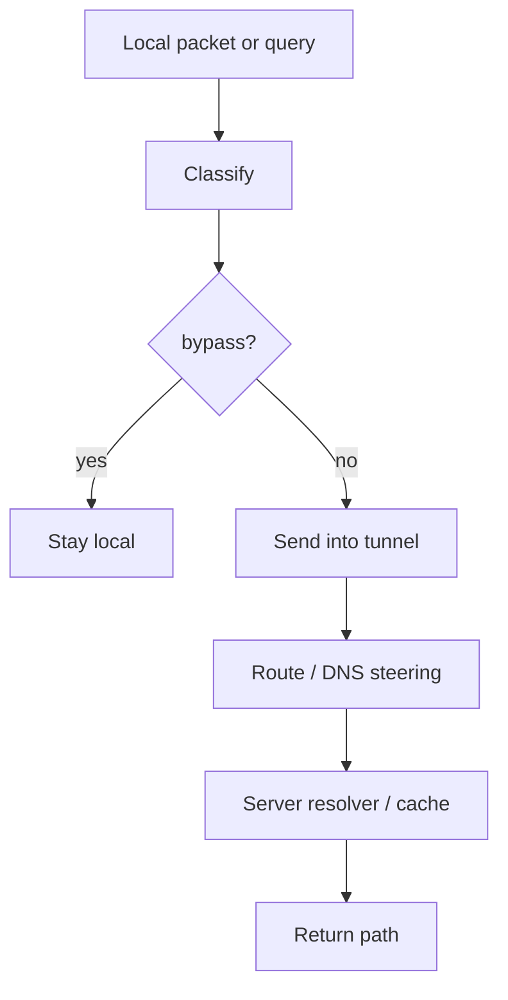

# Routing And DNS

[中文版本](ROUTING_AND_DNS_CN.md)

## Scope

This document explains the real routing and DNS steering model used by OPENPPP2. In the code, these are not separate concerns. They form one traffic-classification system on the client, with continued DNS handling on the server.

Main anchors:

- `ppp/app/client/VEthernetNetworkSwitcher.*`
- `ppp/app/client/dns/Rule.*`
- `ppp/app/server/VirtualEthernetExchanger.*`
- `ppp/app/server/VirtualEthernetDatagramPort.*`
- `ppp/app/server/VirtualEthernetNamespaceCache.*`

## Core Idea

The client decides what goes local, what goes to the tunnel, and which DNS servers must remain reachable. The server continues the DNS path by answering from cache, redirecting to a configured resolver, or forwarding normally.

## Client-Side Ownership

`VEthernetNetworkSwitcher` owns the client-side route and DNS state. Its important pieces include:

- `rib_` for route information
- `fib_` for forwarding lookups
- `ribs_` for loaded IP-list sources
- `vbgp_` for remote route sources
- `dns_rules_` for DNS rules
- `dns_serverss_` for DNS server route assignments
- route add/delete behavior
- default-route protection

## Route Construction

The client builds routes from multiple sources:

- the virtual adapter subnet
- bypass IP-list content
- explicit IP-list files or URLs
- tunnel server reachability routes
- DNS server reachability routes

Important methods include:

- `AddAllRoute(...)`
- `AddLoadIPList(...)`
- `LoadAllIPListWithFilePaths(...)`
- `AddRemoteEndPointToIPList(...)`
- `AddRoute()` / `DeleteRoute()`
- `AddRouteWithDnsServers()` / `DeleteRouteWithDnsServers()`
- `ProtectDefaultRoute()`

## DNS Rules

Client DNS rules decide which resolver should be used for a domain or domain pattern. The code keeps the resolver decision tied to route reachability, because a resolver is only useful if the path to it is actually available.

## Server-Side DNS Path

On the server side, DNS handling continues through:

- `VirtualEthernetExchanger::SendPacketToDestination(...)`
- `VirtualEthernetExchanger::RedirectDnsQuery(...)`
- `VirtualEthernetDatagramPort::NamespaceQuery(...)`
- `VirtualEthernetNamespaceCache`

Server DNS can therefore be:

- answered from cache
- redirected to a configured upstream resolver
- forwarded normally when no special rule applies

## Operational Meaning

Routing and DNS are not separate knobs. A routing decision can determine whether a DNS resolver is reachable, and a DNS rule can depend on the routing state that was built by the client.

## Path Model

## DNS Rule Shape

The rule layer is intentionally tied to client path state. A rule is only useful if the resolver is reachable, and the resolver is only safe to use if the chosen path is correct.

That means routing and DNS are policy coordination, not isolated toggles.

## What To Watch For In Code

- route entries are not just static tables; they are built from host, tunnel, and bypass inputs
- DNS servers are treated like reachability-sensitive endpoints
- server-side DNS behavior depends on namespace cache and datagram port state
- IPv6 transit and static echo can alter what “reachable” means

## Related Documents

- `CONFIGURATION.md`
- `CLIENT_ARCHITECTURE.md`
- `SERVER_ARCHITECTURE.md`
- `LINKLAYER_PROTOCOL.md`
