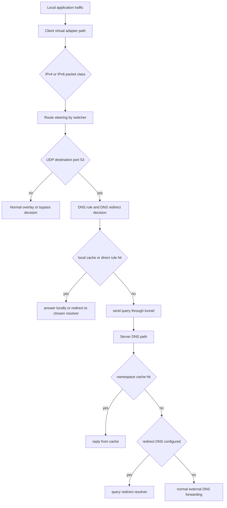
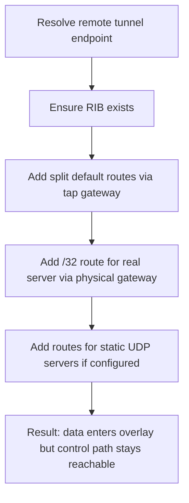
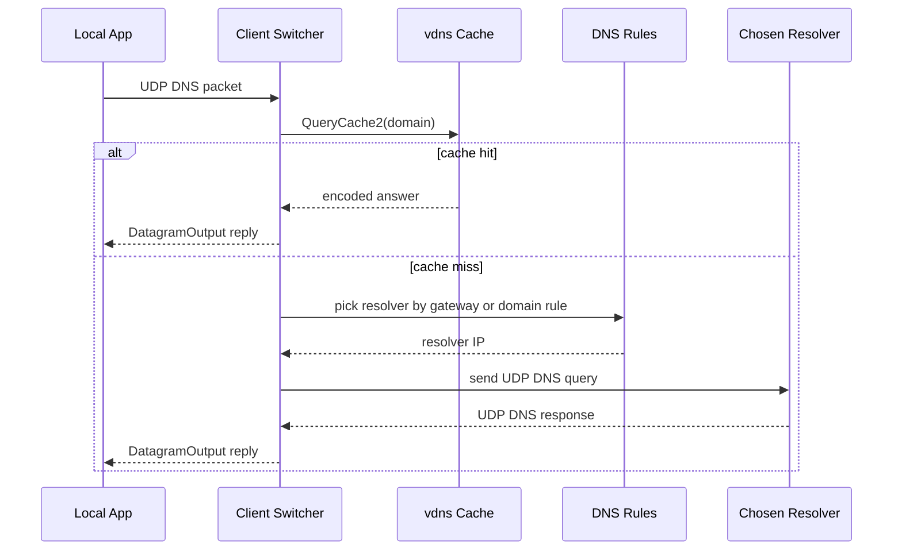
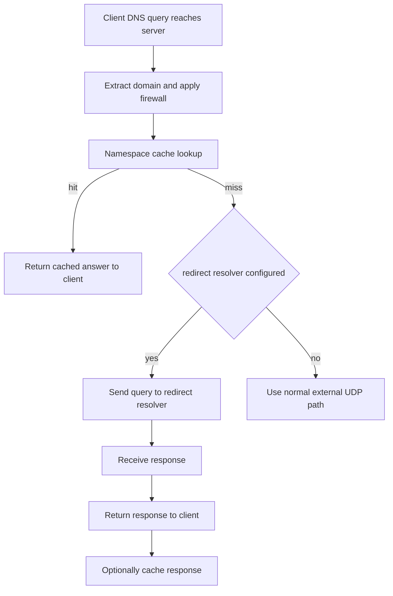

# Routing And DNS

[中文版本](ROUTING_AND_DNS_CN.md)

This document explains how route steering and DNS steering actually work in the OPENPPP2 runtime. It is based on the code paths in the client and server, especially:

- `ppp/app/client/VEthernetNetworkSwitcher.cpp`
- `ppp/app/client/dns/Rule.cpp`
- `ppp/app/server/VirtualEthernetExchanger.cpp`
- `ppp/app/server/VirtualEthernetDatagramPort.cpp`
- `ppp/app/server/VirtualEthernetNamespaceCache.cpp`

The key point is simple: in OPENPPP2, routing and DNS are not two unrelated features. They are one combined traffic-classification system.

## Why They Are Coupled

Many overlay systems fail operationally when route policy and DNS policy are documented separately. OPENPPP2 does not really allow that separation.

The client decides which traffic should stay local, which traffic should be forced into the overlay, and which DNS resolvers themselves should be reachable through the physical NIC versus through the virtual side. The server then continues that policy by optionally answering DNS from cache, redirecting DNS to a configured resolver, or forwarding to the real network.

So the effective classification model is:

- destination prefix decides some traffic
- destination hostname decides some traffic
- DNS server reachability itself requires explicit route handling

That is why this topic deserves a dedicated implementation document.

## Runtime Ownership

Most route ownership lives on the client.

That is visible in `VEthernetNetworkSwitcher`, which owns:

- the route information table `rib_`
- the forwarding information table `fib_`
- loaded IP-list sources in `ribs_`
- optional remote route sources in `vbgp_`
- DNS rule sets in `dns_ruless_`
- cached DNS server route sets in `dns_serverss_`
- default-route protection behavior
- route installation and cleanup against the operating system

Most server-side ownership is about DNS handling after traffic already reached the server.

That is visible in:

- `VirtualEthernetExchanger::SendPacketToDestination(...)`
- `VirtualEthernetExchanger::RedirectDnsQuery(...)`
- `VirtualEthernetDatagramPort::NamespaceQuery(...)`
- `VirtualEthernetNamespaceCache`

## High-Level Classification Model

The route and DNS decision flow can be summarized like this.

## Client Route Construction

The client constructs route policy in multiple stages.

The main assembly points are:

- `AddAllRoute(...)`
- `AddLoadIPList(...)`
- `LoadAllIPListWithFilePaths(...)`
- `AddRemoteEndPointToIPList(...)`
- `AddRoute()`
- `DeleteRoute()`
- `AddRouteWithDnsServers()`
- `DeleteRouteWithDnsServers()`
- `ProtectDefaultRoute()`

This is important because OPENPPP2 does not have only one route table source. It merges several sources into a final operating-system-visible route state.

## Route Sources

The code supports several route sources.

First, the virtual adapter subnet itself is always a route source. In `AddAllRoute(...)`, the client computes the adapter subnet from the tap address and mask and inserts that subnet into the route information table with the tap gateway as next hop.

Second, bypass IP-list content can be added. On Android and iPhone style managed route mode, `AddAllRoute(...)` can import a bypass IP-list string directly into the RIB using loopback as the synthetic next hop. That is a signal used later by bypass checks rather than a literal external gateway.

Third, explicit IP-list files can be registered through `AddLoadIPList(...)`. That method normalizes the file path, verifies either that the file exists or that a `vbgp` URL is valid, rejects duplicate registrations, stores an optional next-hop gateway, and on Linux can remember a gateway-to-interface-name mapping.

Fourth, if a route source also has a verified URL, `AddLoadIPList(...)` stores it into `vbgp_`. That is the source-level evidence that OPENPPP2 supports file-driven route policy with optional remote refresh rather than requiring a fully live route controller.

Fifth, the tunnel server endpoint itself is treated specially. `AddRemoteEndPointToIPList(...)` ensures the client can still reach the server through the physical network while other traffic is diverted into the overlay.

## IP-List Loading

`LoadAllIPListWithFilePaths(...)` is the point where the deferred IP-list registrations become a usable `rib_`.

The method clears the current `rib_` and `fib_`, derives a default next hop from the physical gateway, then loads every registered IP-list file into a fresh `RouteInformationTable` using either:

- the per-list next hop stored earlier
- or the default physical next hop

Only if at least one route is successfully added does the method keep the new `rib_`.

This tells us two things.

First, route-list registration and route-list realization are intentionally separate phases.

Second, empty or invalid route sources are not treated as success.

## Remote Server Reachability Protection

One of the most important route behaviors is in `AddRemoteEndPointToIPList(...)`.

This method does more than add a single host route.

It first resolves the remote server endpoint from the exchanger, including proxy-forwarded forms when forwarding is enabled.

It then ensures the route information table exists and inserts three broad catch-all entries pointing at the tap gateway:

- `0.0.0.0/0`
- `0.0.0.0/1`
- `128.0.0.0/1`

That split default-route pattern is a classic way to steer most IPv4 traffic into the overlay without relying only on one conventional default route entry.

After that, the function adds a `/32` route for the actual tunnel server endpoint through the physical gateway passed into the function. This is the mechanism that prevents the overlay control path from routing back into itself.

The method also handles configured static UDP server endpoints. For each static server string, it parses the endpoint, adds a physical `/32` route where needed, and optionally feeds the endpoint set into the UDP aggregator.

So route protection for the tunnel server is not a side detail. It is part of client survival.

## Route Installation Into The OS

The client does not stop at building an internal route table. It writes routes into the operating system.

That happens through `AddRoute()` and is reversed by `DeleteRoute()`.

The platform behavior differs.

On Windows, the client deletes conflicting default gateway routes, adds all routes from `rib_`, and later restores previous default routes during teardown.

On macOS, the client may remove existing default routes when not in promiscuous mode, add all routes from `rib_`, and later restore the original defaults.

On Linux, the client can discover all default routes, delete them when appropriate, install every route from `rib_` on the chosen interface name, and then restore the saved default routes during cleanup.

In all cases, the route install path is closely tied to tunnel lifecycle. The client does not treat route changes as permanent static system configuration.

## Default Route Protection

`ProtectDefaultRoute()` exists because route installation is not always stable once third-party software and drivers are involved.

The implementation starts a dedicated protection thread. Every second, while the client remains active and routes are marked as installed, it checks whether conditions are still valid and then attempts to remove disallowed default routes again.

This is especially telling on Windows, but the behavior is not only about one OS. Architecturally it means OPENPPP2 assumes that route state can drift and that the client may need to reassert the intended route model continuously.

This is an infrastructure mindset, not a one-shot installer mindset.

## DNS Server Route Pinning

One of the most important implementation details is `AddRouteWithDnsServers()`.

The client does not only install routes for application destinations. It also installs routes for resolver IPs themselves.

The method builds two DNS server sets:

- DNS servers that should be reached through the virtual adapter side
- DNS servers that should be reached through the underlying physical NIC side

It gathers addresses from:

- the TUN or TAP interface DNS list
- the underlying NIC DNS list
- DNS rule targets loaded from `dns_ruless_`

It filters invalid, loopback, multicast, unspecified, and same-subnet cases, de-duplicates the two sets, then installs `/32` routes for each resolver IP.

Resolvers in the first set are routed through the tap gateway.

Resolvers in the second set are routed through the physical gateway.

That is the clearest evidence that DNS routing is a first-class part of OPENPPP2 route design. The code explicitly pins resolver reachability so that DNS policy remains coherent after the overlay alters default routing.

`DeleteRouteWithDnsServers()` later removes those resolver-specific routes and clears the cached sets.

## Bypass Decision Semantics

The client also needs a way to decide whether a destination should be considered bypass traffic at runtime.

`IsBypassIpAddress(...)` is platform-dependent.

On Android, it uses the forwarding table to compare the selected next hop against the tap gateway.

On Windows, it queries the best interface for the IP and compares that interface against the tunnel interface index.

On Unix-like systems, it compares the best interface IP against the tap IP.

The important point is that bypass is not decided only by configuration text. It is decided against live OS routing state.

## Client DNS Rule Model

Client DNS rules are loaded by `LoadAllDnsRules(...)`, which delegates to `ppp/app/client/dns/Rule.cpp`.

That parser supports three host-matching styles:

- relative domain matching
- exact host matching through `full:`
- regex matching through `regexp:`

Each rule line is split on `/` and at minimum contains:

- host expression
- resolver address

An optional third segment influences the `Nic` flag. The runtime later uses that flag when deciding whether the resolver IP should be routed through the physical NIC side or the virtual side.

The matching order is explicit:

1. exact `full:` host match
2. regex match
3. relative domain match via `Firewall::IsSameNetworkDomains(...)`

This means DNS rule semantics are deterministic and layered, not a loose collection of pattern tests.

## Client-Side DNS Redirect

The client DNS redirect path begins in `VEthernetNetworkSwitcher::OnUdpPacketInput(...)`, but the real work happens in `RedirectDnsServer(...)`.

That path does all of the following.

First, it decodes the DNS message and rejects malformed packets.

Second, it checks the local `vdns` cache with `QueryCache2(...)`. If a cached answer exists, it re-encodes the DNS response and immediately emits it back into the local data path through `DatagramOutput(...)` without contacting any upstream resolver.

Third, if the DNS packet was sent to the virtual gateway, the client chooses the first configured virtual DNS server as the upstream target.

Fourth, otherwise it resolves the DNS rule for the queried domain and chooses the rule's configured resolver address, unless that resolver equals the current destination and would cause pointless recursion.

Fifth, it opens a UDP socket, optionally applies Linux protect-mode binding when the chosen resolver is considered bypass traffic, sends the DNS request, arms a timeout, waits for the reply, and then returns the reply through `DatagramOutput(...)`.

That means client DNS redirect is not just “send DNS somewhere else”. It is:

- domain-aware
- cache-aware
- route-aware
- protect-mode-aware
- tied back into the same local packet reinjection path as other UDP traffic

## Client DNS Cache Reinjection

`DatagramOutput(...)` is the local egress point for reinjecting a UDP reply back toward the virtual adapter.

When the `caching` flag is true and the destination port is DNS, the method also stores the DNS packet in the local `vdns` cache through `vdns::AddCache(...)` before converting the UDP frame back into an IP packet and emitting it.

So on the client side, DNS caching is not isolated from packet reinjection. The packet path and cache path meet in the same function.

## Server DNS Path

Once DNS traffic reaches the server, the central decision function is `VirtualEthernetExchanger::SendPacketToDestination(...)`.

When the destination port is 53, the server:

1. extracts the queried domain
2. logs the DNS request
3. applies firewall domain checks
4. tries a namespace-cache lookup through `VirtualEthernetDatagramPort::NamespaceQuery(...)`
5. if cache did not answer, tries redirect DNS through `RedirectDnsQuery(...)`
6. if neither path handled the query, falls back to the normal UDP datagram port path

This is a layered DNS decision stack, not just a normal UDP send with extra logging.

## Namespace Cache Design

The server-side namespace cache is implemented by `VirtualEthernetNamespaceCache`.

Its design is simple and effective.

Each entry key is built from:

- query type
- query class
- domain

The key format is assembled as `TYPE:<type>|CLASS:<class>|DOMAIN:<domain>`.

Each cached entry stores:

- the encoded DNS response bytes
- response length
- expiration time based on configured TTL

Internally the cache uses a hash table plus a linked list. `Update()` expires entries from the head while they are older than the current tick. `Get()` returns the cached response and rewrites the DNS transaction id to match the current request.

That last part is essential. Without rewriting the transaction id, cache replay would not behave like a correct DNS reply.

## How Server Cache Lookup Works

The static method `VirtualEthernetDatagramPort::NamespaceQuery(...)` is used in two different ways.

The first form takes a raw DNS response packet and stores it into the namespace cache. That is used when the server later receives a DNS answer from a real upstream path or from a redirect path.

The second form takes a domain, query type, and query class and attempts to answer the current client request from the cache. If a cached entry exists, it sends the answer back to the client either:

- through `DoSendTo(...)` on the normal tunnel path
- or through `VirtualEthernetDatagramPortStatic::Output(...)` on the static path

So the namespace cache is shared by the normal UDP path and the static UDP path.

## Server DNS Redirect

If the cache does not answer and `configuration->udp.dns.redirect` is configured, the server calls `RedirectDnsQuery(...)`.

That function either:

- uses a pre-parsed redirect endpoint from the switcher
- or resolves the configured redirect hostname asynchronously

Then `INTERNAL_RedirectDnsQuery(...)` opens a UDP socket, sends the DNS packet to the redirect resolver, waits asynchronously for the response with a timeout, and returns the response to the client.

The return path depends on context.

If the query came from static transit, the response is emitted through `VirtualEthernetDatagramPortStatic::Output(...)`.

Otherwise the response is emitted through `DoSendTo(...)` on the normal tunnel path.

If DNS caching is enabled, the server also stores the returned answer into the namespace cache after forwarding it.

This means redirect DNS is not only a forwarding decision. It is also one of the producers that populate the shared namespace cache.

## Normal DNS Responses Also Feed The Cache

The namespace cache is not filled only by the redirect path.

`VirtualEthernetDatagramPort` and `VirtualEthernetDatagramPortStatic` both include logic to push received DNS responses into the namespace cache when `udp.dns.cache` is enabled.

So the cache can be populated from:

- normal external DNS forwarding
- redirect DNS forwarding
- static-path DNS forwarding

This broadens the usefulness of the cache and reduces repeated resolution work across sessions.

## Operational Consequences

Several practical consequences follow from this implementation.

First, the client route model is not only about prefixes. It is also about keeping control-plane addresses and resolver addresses reachable on the correct side of the overlay boundary.

Second, split routing is not one feature. It is the combined result of IP-list sources, remote-endpoint pinning, default-route manipulation, runtime bypass checks, and DNS resolver route pinning.

Third, DNS handling is intentionally policy-aware on both sides. The client may resolve locally or redirect according to rules. The server may answer from cache, redirect to a configured resolver, or forward normally.

Fourth, cache behavior is part of the data plane. DNS cache hits are emitted back through the same tunnel or static mechanisms used for live replies.

Fifth, route correctness is considered an ongoing runtime condition. The default-route protector shows that OPENPPP2 expects route drift and defends against it.

## Reading Order

If you want to keep reading the source after this document, the most useful order is:

1. `VEthernetNetworkSwitcher::AddLoadIPList(...)`
2. `VEthernetNetworkSwitcher::LoadAllIPListWithFilePaths(...)`
3. `VEthernetNetworkSwitcher::AddRemoteEndPointToIPList(...)`
4. `VEthernetNetworkSwitcher::AddRoute()` and `DeleteRoute()`
5. `VEthernetNetworkSwitcher::AddRouteWithDnsServers()`
6. `VEthernetNetworkSwitcher::ProtectDefaultRoute()`
7. `ppp/app/client/dns/Rule.cpp`
8. `VEthernetNetworkSwitcher::RedirectDnsServer(...)`
9. `VirtualEthernetExchanger::SendPacketToDestination(...)`
10. `VirtualEthernetNamespaceCache.cpp`

## Bottom Line

In OPENPPP2, routing and DNS form one control surface.

Routes decide where traffic is eligible to go. DNS rules decide which resolver path should answer for which names. Resolver IPs then receive their own pinned routes so that the DNS policy survives route diversion. On the server, cache and redirect logic continue that policy instead of treating DNS as ordinary UDP. That is why OPENPPP2 behaves like a policy-aware overlay edge rather than like a simple encrypted pipe.
