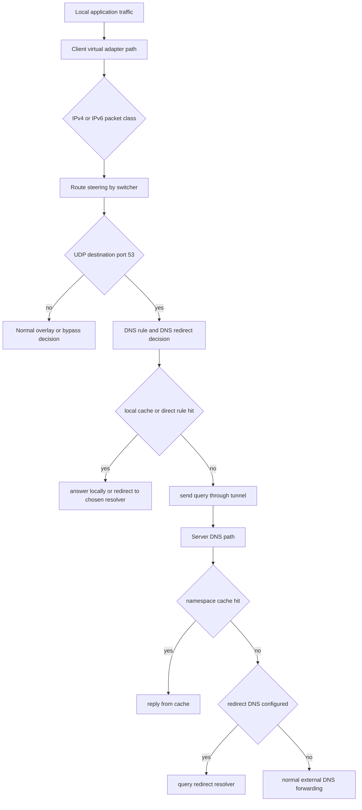
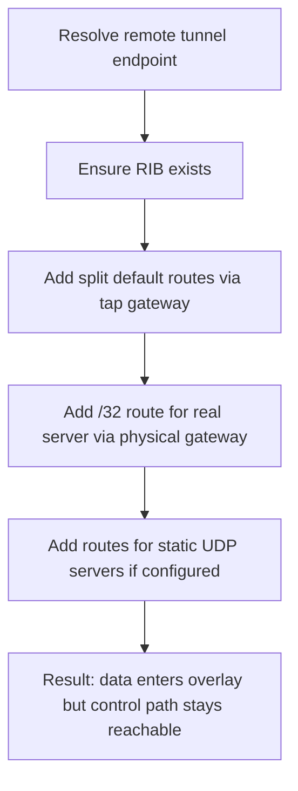
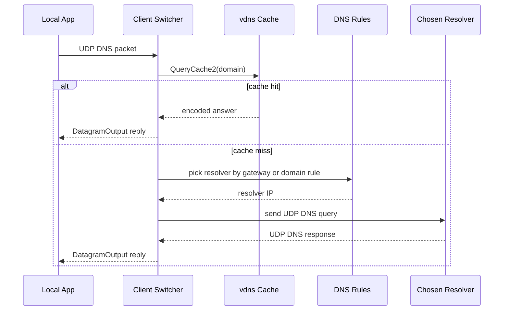
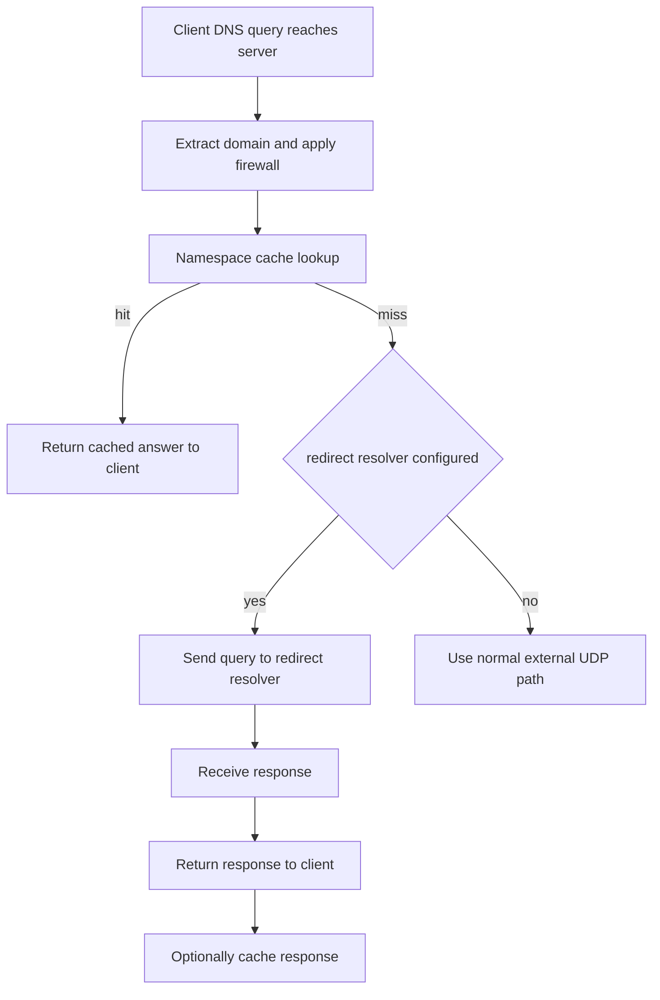

# Routing And DNS

[中文版本](ROUTING_AND_DNS_CN.md)

This document explains in comprehensive detail how route steering and DNS steering actually work in the OPENPPP2 runtime system. It is based on the real code paths implemented in both the client and server components, specifically examining:

- `ppp/app/client/VEthernetNetworkSwitcher.cpp` - The central client network switching logic
- `ppp/app/client/dns/Rule.cpp` - DNS rule parsing and matching implementation
- `ppp/app/server/VirtualEthernetExchanger.cpp` - Server-side packet exchange logic
- `ppp/app/server/VirtualEthernetDatagramPort.cpp` - Server UDP datagram handling
- `ppp/app/server/VirtualEthernetNamespaceCache.cpp` - Server-side DNS cache implementation

The fundamental key point is elegantly simple yet architecturally significant: in OPENPPP2, routing and DNS are not two unrelated or loosely coupled features. They constitute one unified, integrated traffic-classification system where each component explicitly depends on the other to function correctly.

## Why They Must Be Understood Together

Many overlay network systems make a critical operational error in their documentation: they treat route policy and DNS policy as completely separate concerns. This separation creates conceptual and implementation gaps that lead to operational failures in production environments. OPENPPP2's implementation does not permit this artificial separation because the system architecture intrinsically ties these two concerns together.

The client is responsible for making granular decisions about:

- Which network traffic should remain local and exit through the physical network interface directly
- Which network traffic should be forced into the encrypted overlay tunnel
- Which DNS resolvers themselves should be reachable through the physical NIC versus through the virtual tunnel side
- How DNS queries should be handled based on the destination domain and configured rules

The server then continues enforcing and extending that same policy by:

- Optionally answering DNS queries directly from its cache to reduce latency
- Redirecting DNS queries to a specifically configured resolver when configured
- Forwarding DNS queries to the real external internet when neither cache nor redirect applies
- Maintaining namespace-aware DNS caches for commonly requested domains

This creates a three-layer classification model that works together:

- Destination IP prefixes determine which traffic class a packet belongs to
- Destination hostnames (for DNS traffic) determine which resolver should answer
- DNS server reachability itself requires explicit route handling to ensure the policy can actually be enforced

This integrated approach is why this topic deserves dedicated implementation documentation that treats both concerns as a unified system.

## Runtime Ownership Model

The ownership of routing and DNS functions is deliberately asymmetric between client and server, reflecting their different roles in the overall system architecture.

### Client-Side Ownership

Most route ownership and control resides on the client side of the connection. This design decision ensures that the client has full control over which traffic leaves the local device and through which path, giving users fine-grained control over their network traffic patterns.

The client ownership is clearly visible in `VEthernetNetworkSwitcher`, which maintains the following key data structures and state:

- **Route Information Table (`rib_`)**: The core routing table that stores all route entries managed by the client, including both system routes and client-specific overrides
- **Forwarding Information Table (`fib_`)**: A fast-lookup table used for determining next-hop information for packets matching specific routes
- **Loaded IP-list Sources (`ribs_`)**: A collection of registered IP-list sources that can be dynamically loaded to provide bypass or routing rules
- **Optional Remote Route Sources (`vbgp_`)**: Storage for remote route sources that can be fetched from URLs for dynamic updates
- **DNS Rule Sets (`dns_ruless_`)**: The loaded DNS rules that determine resolver selection for specific domains
- **Cached DNS Server Route Sets (`dns_serverss_`)**: Previously computed DNS server routing assignments that are reused across sessions
- **Default Route Protection Behavior**: Active protection that continuously monitors and maintains the intended default routing state
- **Route Installation and Cleanup**: The ability to add and remove routes from the operating system's routing table

The client also owns the decision of which DNS resolver to use for which domain, and maintains a local DNS cache to avoid unnecessary upstream queries.

### Server-Side Ownership

Most server-side ownership focuses on DNS handling after traffic has already reached the server. The server does not actively manage routing decisions in the same way the client does, but instead handles the continuation of DNS policy enforcement.

The server-side ownership is visible through several key entry points:

- **`VirtualEthernetExchanger::SendPacketToDestination(...)`**: The main entry point for processing DNS packets on the server side, orchestrating cache lookup and redirect decisions
- **`VirtualEthernetExchanger::RedirectDnsQuery(...)`**: The function that handles DNS redirection to configured upstream resolvers
- **`VirtualEthernetDatagramPort::NamespaceQuery(...)`**: The namespace-aware cache lookup and storage function
- **`VirtualEthernetNamespaceCache`**: The actual cache implementation storing DNS responses keyed by domain, type, and class

## High-Level Classification Model

The complete route and DNS decision flow can be visualized as a layered decision tree implemented throughout the client and server codebase.

This diagram demonstrates that every DNS packet undergoes multiple decision layers, not simply being forwarded to an upstream resolver without consideration. The system considers cache state, configured rules, network topology, and policy requirements at each step.

## Client Route Construction

The client constructs route policy through multiple distinct stages, not through a single monolithic function. This staged approach allows for incremental addition of route sources and proper handling of dependencies between different route types.

The main assembly points for route construction are:

- **`AddAllRoute(...)`**: Adds the base virtual adapter subnet route plus any automatic route sources like bypass IP-list content
- **`AddLoadIPList(...)`**: Registers an IP-list file as a route source, either from a local file or remote URL
- **`LoadAllIPListWithFilePaths(...)`**: Actually loads all registered IP-list files into internal routing tables
- **`AddRemoteEndPointToIPList(...)`**: Adds special protection routes to ensure tunnel server reachability through the physical network
- **`AddRoute()`**: Installs routes from the internal routing table into the operating system's actual routing table
- **`DeleteRoute()`**: Removes previously installed routes from the operating system's routing table
- **`AddRouteWithDnsServers()`**: Installs explicit routes for DNS resolver IPs to ensure resolver reachability
- **`DeleteRouteWithDnsServers()`**: Removes DNS resolver-specific routes during cleanup
- **`ProtectDefaultRoute()`**: Starts a background thread to continuously monitor and protect default route state

This staged approach is critically important because OPENPPP2 does not rely on only one route table source. Instead, it merges several distinct sources into a final operating-system-visible route state, allowing for flexible configuration and dynamic updates.

## Route Sources

The codebase supports multiple distinct route sources that are combined to form the final routing policy. Understanding these sources is essential to understanding how OPENPPP2 makes routing decisions.

### Source 1: Virtual Adapter Subnet

The virtual adapter subnet itself is always a route source. In `AddAllRoute(...)`, the client computes the adapter subnet from the configured TAP address and network mask, then inserts that subnet into the route information table with the TAP gateway as the next hop.

This ensures that traffic destined for the virtual network itself is properly routed through the local virtual adapter, creating the foundation for the overlay network.

### Source 2: Bypass IP-List Content

Bypass IP-list content can be used as a route source. In Android and iPhone-style managed route mode, where the VPN system takes full control of routing, `AddAllRoute(...)` can import a bypass IP-list string directly into the RIB (Route Information Base) using loopback as a synthetic next hop.

The use of loopback as the next hop is significant: it is not a literal external gateway but rather a semantic marker used by subsequent bypass checks to identify traffic that should be excluded from the overlay and use the regular network path.

### Source 3: Explicit IP-List Files

Explicit IP-list files can be registered through `AddLoadIPList(...)`. This method performs several critical operations:

1. **Path Normalization**: Converts the provided file path to a canonical form for consistent handling
2. **Validaton**: Verifies either that the file exists on the local system or that a `vbgp` (virtual BGP) URL is valid and accessible
3. **Duplicate Prevention**: Rejects duplicate registrations that would create ambiguous routing rules
4. **Next-Hop Storage**: Stores an optional next-hop gateway associated with this specific IP-list
5. **Interface Mapping**: On Linux systems, can remember a gateway-to-interface-name mapping for advanced routing scenarios

This enables the flexible "file-driven routing policy" model that OPENPPP2 uses, where routing rules can be defined in external files rather than hardcoded in the application.

### Source 4: Remote Route Sources with URLs

If a route source also has a verified URL, `AddLoadIPList(...)` stores it into `vbgp_`. This design allows OPENPPP2 to support file-driven route policy with optional remote refresh capabilities, rather than requiring a fully live route controller to be running at all times.

The remote source can be updated on-demand or on a schedule, providing operational flexibility while maintaining the file-based configuration model.

### Source 5: Tunnel Server Endpoint

The tunnel server endpoint itself is treated as a special route source. `AddRemoteEndPointToIPList(...)` ensures that the client can still reach the server through the physical network while other traffic is being diverted into the overlay.

This is a critical survival requirement: without explicit routes ensuring the tunnel server itself remains reachable through the physical network, the client would lose its connection to the server, causing the overlay to fail.

## IP-List Loading

`LoadAllIPListWithFilePaths(...)` is the pivotal function where deferred IP-list registrations become an actual usable route information base (RIB).

The method performs the following sequence of operations:

1. **Table Clearing**: Clears the current `rib_` and `fib_` tables to prepare for fresh loading
2. **Default Next Hop Derivation**: Derives a default next hop from the physical network gateway configuration
3. **File Iteration**: Loads every registered IP-list file into a fresh `RouteInformationTable` instance
4. **Next Hop Selection**: Uses either the per-list next hop stored earlier or the default physical next hop as a fallback

The method only preserves the new `rib_` if at least one route is successfully added. Empty or invalid route sources are explicitly rejected, not silently ignored.

This design choice reveals two important architectural principles:

1. **Separation of Concerns**: Route-list registration and route-list realization are intentionally separate phases, allowing for validation and preparation before final commitment
2. **Fail-Fast Behavior**: Empty or invalid route sources are not treated as success, providing clear feedback about configuration problems

## Remote Server Reachability Protection

One of the most important route behaviors in the entire system is implemented in `AddRemoteEndPointToIPList(...)`. This function is critical because without it, the client would lose the ability to reach the tunnel server once other traffic is diverted into the overlay.

This method performs more operations than simply adding a single host route for the server:

### Step 1: Endpoint Resolution

First, the method resolves the remote server endpoint from the exchanger, including considering proxy-forwarded forms when forwarding is enabled. This ensures the actual network location of the server is correctly identified.

### Step 2: Route Table Initialization

Then, the function ensures the route information table exists, creating it if necessary.

### Step 3: Split Default Route Insertion

The function inserts three broad catch-all entries that direct traffic toward the TAP gateway:

- `0.0.0.0/0` - The traditional default route (though technically redundant with the split routes below)
- `0.0.0.0/1` - Covers the lower half of the IPv4 address space (0.0.0.0 through 127.255.255.255)
- `128.0.0.0/1` - Covers the upper half of the IPv4 address space (128.0.0.0 through 255.255.255.255)

This split default-route pattern is a classic technique that steers the vast majority of IPv4 traffic into the overlay without depending on a single traditional default route entry. This approach prevents conflicts with existing default routes and provides more granular control.

### Step 4: Server-Specific Route

After installing the split default routes, the function adds a `/32` route for the actual tunnel server endpoint through the physical gateway that was passed into the function. This is the specific mechanism that prevents the overlay control path from inadvertently routing back into itself.

### Step 5: Static UDP Server Routes

The method also handles configured static UDP server endpoints. For each static server string, it parses the endpoint, adds a physical `/32` route where needed, and optionally feeds the endpoint set into the UDP aggregator for load balancing.

The protection of tunnel server reachability is not a peripheral detail—it is a fundamental requirement for client survival and system operation.

## Route Installation Into The Operating System

The client does not stop at building an internal route table. It writes these routes into the operating system's actual routing tables so that the kernel can use them for packet forwarding decisions.

This route installation happens through `AddRoute()`, and is reversed by `DeleteRoute()` during cleanup operations.

### Platform-Specific Behavior

The behavior differs significantly between operating systems:

**Windows Behavior**: The client deletes any conflicting default gateway routes, adds all routes from `rib_` to the system routing table, and later restores any previous default routes during teardown. This ensures that the VPN can gain control of routing without permanently altering the system's baseline configuration.

**macOS Behavior**: The client may remove existing default routes when not in promiscuous mode, adds all routes from `rib_`, and later restores the original default routes during cleanup. The promiscuous mode option allows for co-existence with existing routing configurations.

**Linux Behavior**: The client can discover all existing default routes, delete them when appropriate for the selected operation mode, install every route from `rib_` on the chosen interface name, and then restore the saved default routes during cleanup. Linux provides the most flexibility but also requires the most careful handling.

In all cases, the route installation path is tightly coupled to the tunnel lifecycle. The client does not treat route changes as permanent static system configuration—routes are managed as transient resources associated with the tunnel session.

## Default Route Protection

`ProtectDefaultRoute()` exists because route installation is not always stable once third-party software and drivers are involved in the networking stack. Many VPN clients, virtualization software, and network drivers modify routing tables, and conflicts can cause unintended route behavior.

The implementation starts a dedicated protection thread that runs continuously. Every second, while the client remains active and routes are marked as installed, the thread:

1. Checks whether conditions are still valid (the interfaces are up, the tunnel is active, etc.)
2. Attempts to remove any default routes that should not be present
3. Logs any corrections that were made for operational awareness

This behavior is particularly noticeable on Windows, where third-party software frequently modifies routing tables, but the architectural principle applies across all platforms. OPENPPP2 explicitly assumes that route state can drift and that the client may need to continuously reassert the intended route model.

This represents an "infrastructure mindset" rather than a "one-shot installer mindset"—the system treats route correctness as an ongoing operational requirement rather than a one-time configuration event.

## DNS Server Route Pinning

One of the most distinctive and important implementation details in OPENPPP2 is the explicit handling of DNS resolver reachability through `AddRouteWithDnsServers()`.

The client does not only install routes for application traffic destinations—it also installs explicit routes for the DNS resolver IP addresses themselves. This step is essential because without it, the DNS policy configuration would become ineffective once the overlay changes the default routing behavior.

The method constructs two distinct DNS server sets:

- **Virtual-Side Resolvers**: DNS servers that should be reached through the virtual adapter (TAP/TUN) side of the tunnel
- **Physical-Side Resolvers**: DNS servers that should be reached through the underlying physical NIC side

These addresses are gathered from multiple sources:

- The DNS server list configured on the TUN or TAP interface
- The DNS server list from the underlying physical NIC
- DNS rule target addresses loaded from `dns_ruless_`

The method then filters out problematic addresses, removing:

- Invalid addresses
- Loopback addresses (127.x.x.x)
- Multicast addresses (224.x.x.x - 255.x.x.x)
- Unspecified addresses (0.0.0.0)
- Addresses on the same subnet as the local interface (which don't require explicit routes)

After filtering, the method de-duplicates the two sets and installs `/32` routes for each remaining resolver IP:

- Resolvers in the first set are routed through the TAP gateway (into the overlay)
- Resolvers in the second set are routed through the physical gateway (direct internet)

This is the clearest architectural evidence that DNS routing is a first-class citizen in OPENPPP2's route design philosophy. The code explicitly pins resolver reachability so that DNS policy remains coherent after the overlay alters default routing behavior.

`DeleteRouteWithDnsServers()` removes these resolver-specific routes during cleanup, restoring the routing table to its previous state.

## Bypass Decision Semantics

The client also needs a runtime mechanism to decide whether a specific destination IP address should be considered "bypass traffic" that uses the regular physical network instead of the overlay.

`IsBypassIpAddress(...)` implements this decision with platform-specific logic:

**Android Implementation**: Uses the forwarding table to compare the selected next hop for the destination IP against the TAP gateway address. If the next hop matches the TAP gateway, the traffic will use the overlay; otherwise, it bypasses the overlay.

**Windows Implementation**: Queries the system's best interface for the destination IP, then compares that interface against the tunnel interface index. This uses the Windows routing API to determine the actual interface that would be used.

**Unix-like System Implementation**: Compares the best interface IP (the first hop IP) against the TAP IP address, determining whether the route goes through the virtual interface.

The key architectural point is that bypass decisions are not determined solely by configuration text—they are made against the live operating system routing state, which provides accurate information about the current network topology.

## Client DNS Rule Model

Client DNS rules are loaded by `LoadAllDnsRules(...)`, which delegates the actual parsing work to `ppp/app/client/dns/Rule.cpp`.

The parser supports three distinct host-matching styles:

1. **Relative Domain Matching**: Matches the query domain against configured suffixes without requiring a full domain name. For example, a rule for "example.com" would match "www.example.com", "api.example.com", etc.

2. **Exact Host Matching**: Uses the `full:` prefix to specify an exact hostname match. For example, `full:api.example.com` would only match queries for exactly "api.example.com", not subdomains.

3. **Regex Matching**: Uses the `regexp:` prefix to specify a regular expression pattern. This provides maximum flexibility for complex domain matching rules.

### Rule Structure

Each rule line is split on the `/` delimiter and must contain at minimum:

- The host expression (domain, hostname pattern, or regex)
- The resolver address (the DNS server IP that should answer queries for matching domains)

An optional third segment specifies the `Nic` flag, which determines whether the resolver IP should be routed through the physical NIC side or the virtual side. The flag uses values like "0" for virtual side or "1" for physical side, allowing the DNS rule to control not just which resolver is used but also which network path reaches that resolver.

### Matching Order

The matching order is explicitly defined and deterministic:

1. Exact `full:` host match (checked first, most specific)
2. Regex pattern match (checked second)
3. Relative domain match via `Firewall::IsSameNetworkDomains(...)` (checked last, most general)

This means DNS rule semantics are deterministic and layered, not a loose collection of pattern tests that might produce different results depending on the order of configuration.

## Client-Side DNS Redirect

The client DNS redirect path begins at `VEthernetNetworkSwitcher::OnUdpPacketInput(...)` where incoming UDP packets are initially processed, but the core logic resides in `RedirectDnsServer(...)`.

This path performs the following sequential operations:

### Step 1: Packet Validation

First, it decodes the DNS message from the UDP payload and rejects any malformed packets that cannot be parsed. This prevents corrupted or malicious packets from being processed.

### Step 2: Cache Check

Second, it checks the local `vdns` cache using `QueryCache2(...)`. If a cached answer exists, it re-encodes the DNS response and immediately emits it back into the local data path through `DatagramOutput(...)` without ever contacting any upstream resolver. This provides instant responses for repeated queries.

### Step 3: Resolver Selection for Virtual Gateway

Third, if the DNS packet was sent to the virtual gateway (the DNS server configured on the TAP/TUN interface), the client chooses the first configured virtual DNS server as the upstream target, selecting from the virtual-side resolver set.

### Step 4: Domain-Based Resolver Selection

Fourth, if the query was not directed at the virtual gateway, the client resolves the appropriate DNS rule for the queried domain and chooses the rule's configured resolver address—unless that resolver equals the current destination address, in which case it would cause pointless recursion and is rejected.

### Step 5: Upstream Query Execution

Fifth, it opens a UDP socket to the selected resolver, optionally applies Linux protect-mode binding when the chosen resolver is considered bypass traffic (meaning it should use the physical network instead of the overlay), sends the DNS request, arms a timeout timer, waits for the reply, and then returns the reply through `DatagramOutput(...)`.

This means client DNS redirect is not simply "send DNS somewhere else"—it is simultaneously:

- **Domain-Aware**: DNS rules determine which resolver to use based on the queried domain
- **Cache-Aware**: The local cache is checked before any upstream query is made
- **Route-Aware**: The system considers the routing state when deciding how to reach the resolver
- **Protect-Mode-Aware**: Linux-specific protection rules can be applied to socket bindings
- **Unified with Local Packet Flow**: Results are tied back into the same local packet reinjection path used for other UDP traffic

## Client DNS Cache Reinjection

`DatagramOutput(...)` is the local egress point for reinjecting a UDP reply back toward the virtual adapter, completing the local data path.

When the `caching` flag is true and the destination port is DNS (port 53), the method also stores the DNS packet in the local `vdns` cache through `vdns::AddCache(...)` before converting the UDP frame back into an IP packet and emitting it.

This means on the client side, DNS caching is not isolated from packet reinjection—the packet path and cache path converge in the same function, ensuring consistency between what is returned to the application and what is stored for future queries.

## Server DNS Path

Once DNS traffic reaches the server through the overlay tunnel, the central decision function is `VirtualEthernetExchanger::SendPacketToDestination(...)`.

When the destination port is detected as 53 (DNS), the server performs a layered decision sequence:

1. **Domain Extraction**: Extracts the queried domain from the DNS packet
2. **Logging**: Logs the DNS request for operational visibility and debugging
3. **Firewall Check**: Applies any configured firewall domain checks
4. **Cache Lookup**: Attempts a namespace-cache lookup through `VirtualEthernetDatagramPort::NamespaceQuery(...)`
5. **Redirect Attempt**: If the cache did not answer, tries redirect DNS through `RedirectDnsQuery(...)`
6. **Fallback**: If neither path handled the query, falls back to the normal UDP datagram port path for external forwarding

This is a deliberately layered DNS decision stack, not merely a normal UDP send with additional logging. The server prioritizes cached responses, then configured redirects, and only falls back to external forwarding as a last resort.

## Namespace Cache Design

The server-side namespace cache is implemented by `VirtualEthernetNamespaceCache`, providing a shared DNS response cache for all clients.

The cache design is simple but effective:

### Key Structure

Each entry key is built from three components:

- **Query Type**: The DNS query type (A, AAAA, MX, TXT, etc.)
- **Query Class**: The DNS query class (typically IN for Internet)
- **Domain**: The queried domain name

These components are concatenated into a single string with the format: `TYPE:<type>|CLASS:<class>|DOMAIN:<domain>`

### Entry Storage

Each cached entry stores:

- The encoded DNS response bytes (the full DNS message as received from upstream)
- The response length (for efficient memory handling)
- The expiration time (calculated based on the TTL value in the DNS response and configured minimum TTLs)

### Internal Implementation

Internally the cache uses a hash table (for fast key-based lookup) plus a linked list (for efficient expiration management). The `Update()` function expires entries from the head of the list while they are older than the current system tick. The `Get()` function returns the cached response while also rewriting the DNS transaction ID to match the current request—that is essential for the cache to behave like a correct DNS server, as clients expect the transaction ID to match their query.

## How Server Cache Lookup Works

The static method `VirtualEthernetDatagramPort::NamespaceQuery(...)` is used in two different ways that reflect its dual purpose:

### Storage Form

The first form accepts a raw DNS response packet and stores it into the namespace cache. This is used when the server receives a DNS answer from a real upstream resolver path, from a redirect path, or from any other DNS source. This allows the cache to accumulate responses over time.

### Lookup Form

The second form accepts a domain, query type, and query class and attempts to answer the current client request from the cache. If a cached entry exists, it sends the answer back to the client through one of two paths:

- Through `DoSendTo(...)` on the normal tunnel path
- Or through `VirtualEthernetDatagramPortStatic::Output(...)` on the static path for static transit configurations

The namespace cache is intentionally shared between the normal UDP path and the static UDP path, maximizing cache hit probability across different traffic patterns.

## Server DNS Redirect

If the cache lookup does not return an answer and `configuration->udp.dns.redirect` is configured, the server calls `RedirectDnsQuery(...)` to forward the query to a configured alternative resolver.

This function either:

- Uses a pre-parsed redirect endpoint that was already resolved and cached by the switcher
- Or resolves the configured redirect hostname asynchronously using DNS lookup

Then `INTERNAL_RedirectDnsQuery(...)` opens a UDP socket, sends the DNS packet to the redirect resolver, waits asynchronously for the response with a timeout protection to prevent hanging, and returns the response to the client.

The return path depends on the context of the original request:

- If the original query came from static transit, the response is emitted through `VirtualEthernetDatagramPortStatic::Output(...)`
- Otherwise, the response is emitted through `DoSendTo(...)` on the normal tunnel path

If DNS caching is enabled, the server also stores the returned answer into the namespace cache after forwarding it to the client, enabling future requests to be served from cache.

This means redirect DNS is not merely a forwarding decision—it is also one of the producers that populate the shared namespace cache, contributing to the overall cache hit rate.

## Normal DNS Responses Also Feed The Cache

The namespace cache is not only populated by the explicit redirect path.

Both `VirtualEthernetDatagramPort` and `VirtualEthernetDatagramPortStatic` include logic to detect incoming DNS responses and, when `udp.dns.cache` is enabled in the configuration, automatically store them into the namespace cache.

Therefore, the cache can be populated from multiple sources:

- **Normal External DNS Forwarding**: When the server forwards a query to an upstream resolver and receives a response
- **Redirect DNS Forwarding**: When the server redirects a query to a configured resolver and receives a response
- **Static-Path DNS Forwarding**: When the server handles DNS through a static transit configuration

This broadens the usefulness of the cache and reduces repeated resolution work across sessions, improving overall system efficiency and reducing latency for commonly requested domains.

## Operational Consequences

Several practical operational consequences directly follow from this integrated implementation:

### Consequence 1: Route Model Complexity

The client route model is not only about IP prefixes. It explicitly includes requirements for keeping control-plane addresses (the tunnel server itself) and resolver addresses reachable on the correct side of the overlay boundary. DNS policy cannot work without proper routing to reach the chosen resolvers.

### Consequence 2: Split Routing is Multi-Factor

Split routing is not a single feature—it is the combined result of multiple interacting mechanisms:

- IP-list sources providing destination-based routing rules
- Remote-endpoint pinning ensuring tunnel server reachability
- Default-route manipulation directing traffic into the overlay
- Runtime bypass checks determining per-packet path selection
- DNS resolver route pinning maintaining resolver availability

All of these must work together correctly for the system to function as intended.

### Consequence 3: Both Sides Implement Policy-Aware DNS

DNS handling is intentionally policy-aware on both sides of the connection:

- **Client-Side**: May resolve locally from cache, redirect according to configured rules, or forward to upstream resolvers
- **Server-Side**: May answer from cache, redirect to a configured resolver, or forward normally to external DNS

This ensures consistent policy enforcement throughout the entire request path.

### Consequence 4: Cache is Part of the Data Plane

Cache behavior is integrated into the data plane, not treated as a separate management function. DNS cache hits are emitted back through the same tunnel or static mechanisms used for live replies, ensuring consistent packet handling regardless of whether the response came from cache or upstream.

### Consequence 5: Route Correctness is Continuous

Route correctness is considered an ongoing runtime condition, not a one-time configuration event. The default-route protector thread demonstrates that OPENPPP2 expects route drift to occur and actively defends against it, maintaining the intended routing state continuously.

## Recommended Source Reading Order

If you want to continue exploring the source code after this document, the most useful reading order is:

1. `VEthernetNetworkSwitcher::AddLoadIPList(...)` - Understanding route source registration
2. `VEthernetNetworkSwitcher::LoadAllIPListWithFilePaths(...)` - Understanding route table construction
3. `VEthernetNetworkSwitcher::AddRemoteEndPointToIPList(...)` - Understanding tunnel server protection
4. `VEthernetNetworkSwitcher::AddRoute()` and `DeleteRoute()` - Understanding OS route installation
5. `VEthernetNetworkSwitcher::AddRouteWithDnsServers()` - Understanding DNS resolver routing
6. `VEthernetNetworkSwitcher::ProtectDefaultRoute()` - Understanding continuous route maintenance
7. `ppp/app/client/dns/Rule.cpp` - Understanding DNS rule parsing and matching
8. `VEthernetNetworkSwitcher::RedirectDnsServer(...)` - Understanding client-side DNS handling
9. `VirtualEthernetExchanger::SendPacketToDestination(...)` - Understanding server-side DNS orchestration
10. `VirtualEthernetNamespaceCache.cpp` - Understanding server-side DNS caching

## Conclusion

In OPENPPP2, routing and DNS form a single unified control surface that works together to implement policy-based traffic steering.

The fundamental relationship is:

- **Routes** decide where network traffic is eligible to travel (which network path is used for which destination)
- **DNS Rules** decide which resolver path should answer requests for which domain names
- **Resolver Routes** are then pinned explicitly so that the chosen DNS policy remains enforceable after route diversion changes the default network path
- **Server-Side Logic** continues that policy enforcement by caching and redirecting DNS responses, rather than treating DNS as ordinary UDP traffic

This integrated design is what makes OPENPPP2 behave like a policy-aware overlay edge node rather than simply an encrypted tunnel pipe—it actively participates in DNS policy enforcement while maintaining full control over network traffic paths.

The combined routing and DNS system ensures that:

- Users can define granular policies about which traffic uses which path
- DNS resolutions follow those same policies consistently
- Both client and server enforce the policies throughout the entire request lifecycle
- The system maintains routing correctness as an ongoing operational requirement