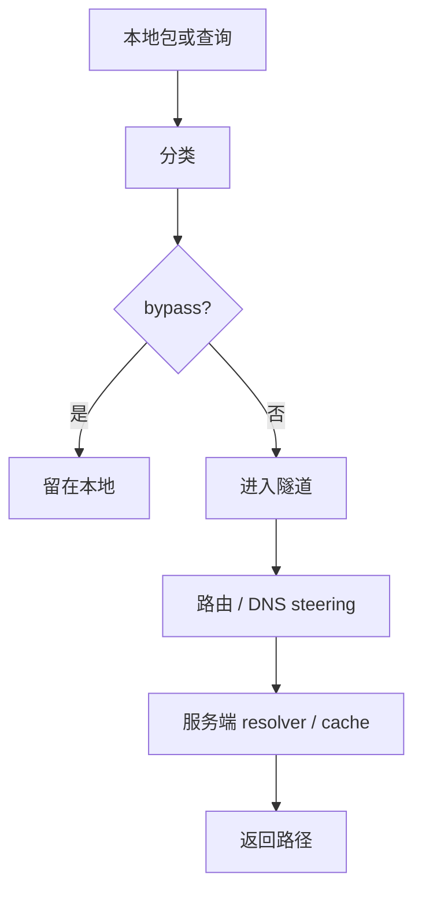

# 路由与 DNS

[English Version](ROUTING_AND_DNS.md)

## 范围

本文解释 OPENPPP2 真实的路由与 DNS 整形模型。在代码里，这两者不是分开的两个功能，而是客户端上的统一流量分类系统，以及服务端继续延伸的 DNS 处理路径。

主要锚点：

- `ppp/app/client/VEthernetNetworkSwitcher.*`
- `ppp/app/client/dns/Rule.*`
- `ppp/app/server/VirtualEthernetExchanger.*`
- `ppp/app/server/VirtualEthernetDatagramPort.*`
- `ppp/app/server/VirtualEthernetNamespaceCache.*`

## 核心思想

客户端决定哪些流量留在本地、哪些流量进入隧道，以及哪些 DNS 服务器本身必须保持可达。服务端则继续 DNS 路径，可能从缓存回答、转发到指定 resolver，或者正常转发。

## 客户端所有权

`VEthernetNetworkSwitcher` 负责客户端侧路由和 DNS 状态。关键成员包括：

- `rib_` 路由信息表
- `fib_` 转发表
- `ribs_` 已加载的 IP-list 来源
- `vbgp_` 远程路由来源
- `dns_ruless_` DNS 规则
- `dns_serverss_` DNS 服务器路由分配
- 路由增删逻辑
- 默认路由保护

## 路由构造

客户端的路由来源包括：

- 虚拟网卡子网
- bypass IP-list 内容
- 显式 IP-list 文件或 URL
- 隧道服务端可达性路由
- DNS 服务器可达性路由

重要方法包括：

- `AddAllRoute(...)`
- `AddLoadIPList(...)`
- `LoadAllIPListWithFilePaths(...)`
- `AddRemoteEndPointToIPList(...)`
- `AddRoute()` / `DeleteRoute()`
- `AddRouteWithDnsServers()` / `DeleteRouteWithDnsServers()`
- `ProtectDefaultRoute()`

## DNS 规则

客户端 DNS 规则决定某个域名或域名模式应该使用哪个 resolver。代码把 resolver 选择和路由可达性绑在一起，因为 resolver 可用的前提是到它的路径真的存在。

## 服务端 DNS 路径

服务端的 DNS 处理继续通过：

- `VirtualEthernetExchanger::SendPacketToDestination(...)`
- `VirtualEthernetExchanger::RedirectDnsQuery(...)`
- `VirtualEthernetDatagramPort::NamespaceQuery(...)`
- `VirtualEthernetNamespaceCache`

因此服务端 DNS 可以：

- 从缓存直接回答
- 转发到配置的上游 resolver
- 在没有特殊规则时正常转发

## 运维含义

路由和 DNS 不是两个独立旋钮。路由决定 DNS resolver 是否可达，DNS 规则又依赖客户端已经建立好的路由状态。

## 路径模型

## DNS 规则形态

规则层是明确跟客户端路径状态绑定的。规则只有在 resolver 可达时才有意义，而 resolver 只有在路径正确时才安全。

所以路由和 DNS 本质上是 policy coordination，而不是两个独立开关。

## 读源码时要看什么

- 路由项不是静态表，它来自宿主、隧道和 bypass 的组合输入
- DNS 服务器被当成可达性敏感端点
- 服务端 DNS 行为取决于 namespace cache 和 datagram port 状态
- IPv6 transit 和 static echo 会改变“可达”的含义

## 相关文档

- `CONFIGURATION_CN.md`
- `CLIENT_ARCHITECTURE_CN.md`
- `SERVER_ARCHITECTURE_CN.md`
- `LINKLAYER_PROTOCOL_CN.md`
