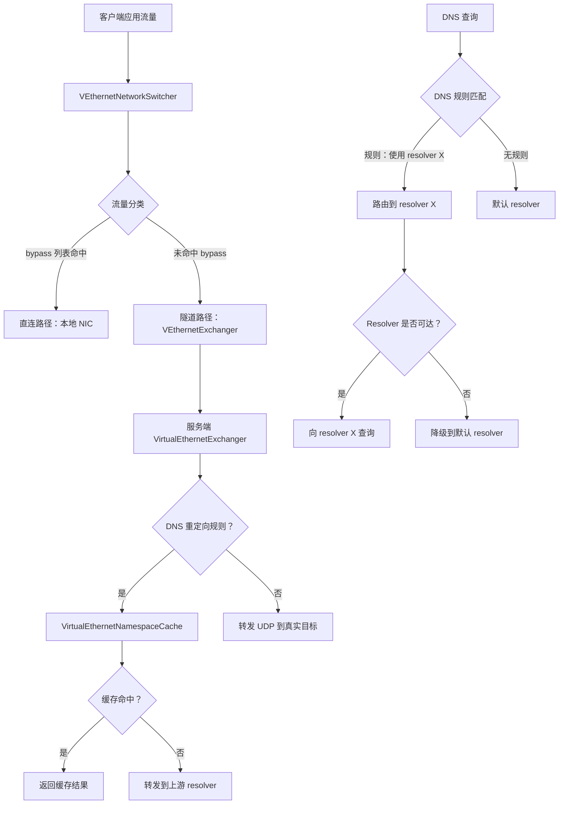
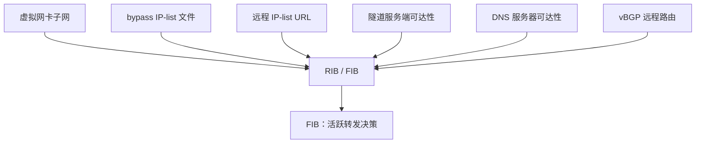
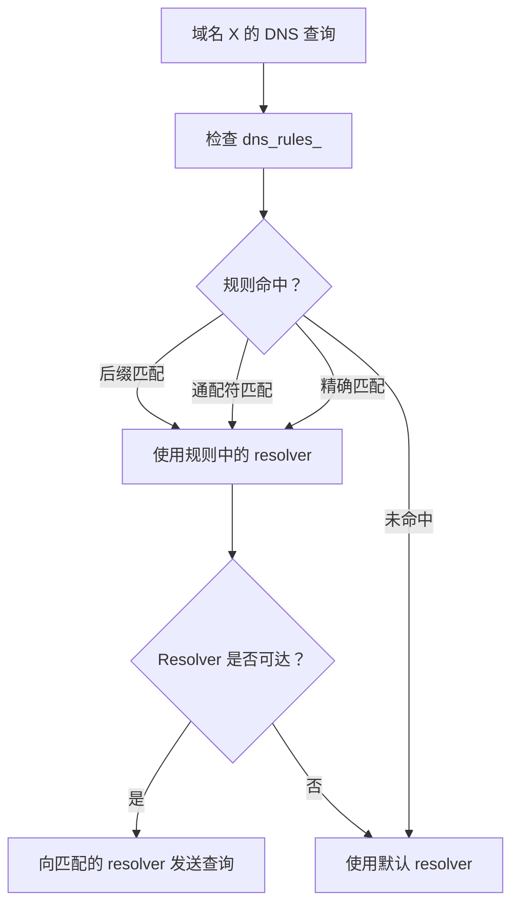
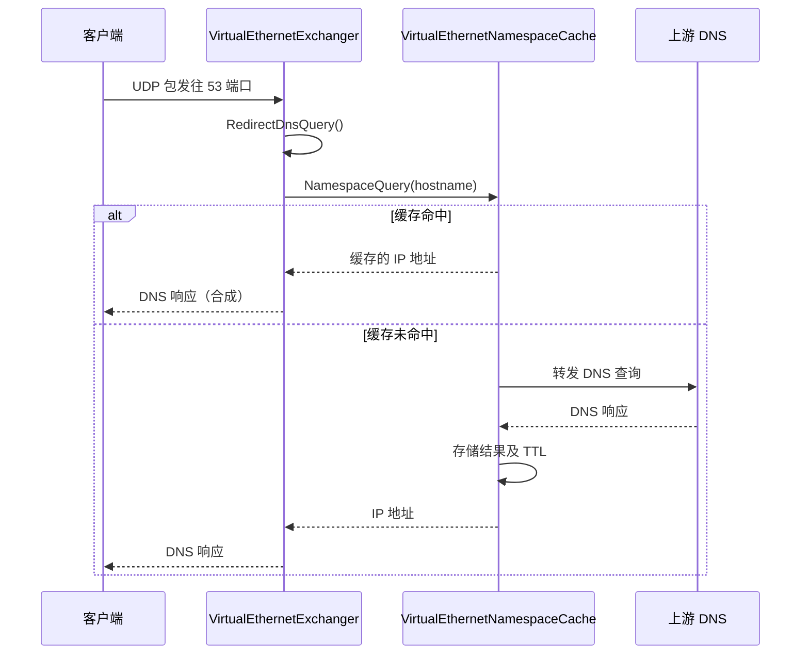
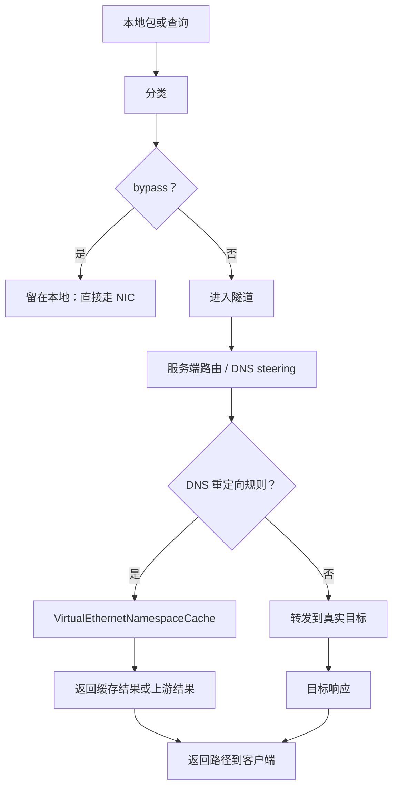
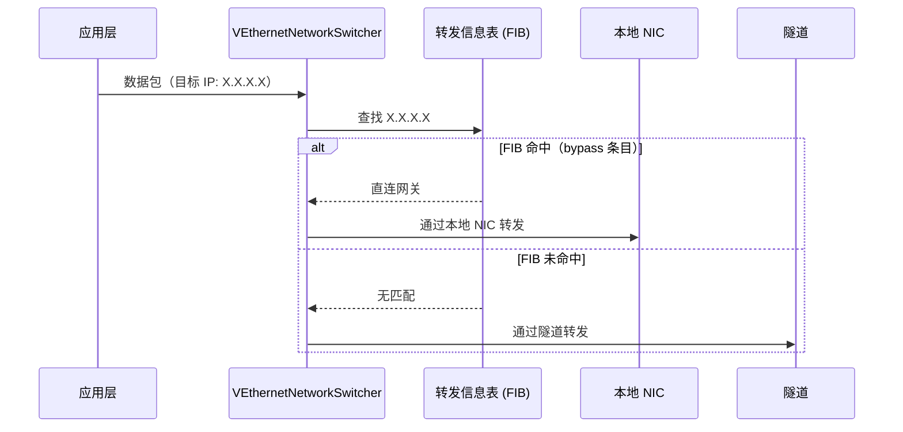
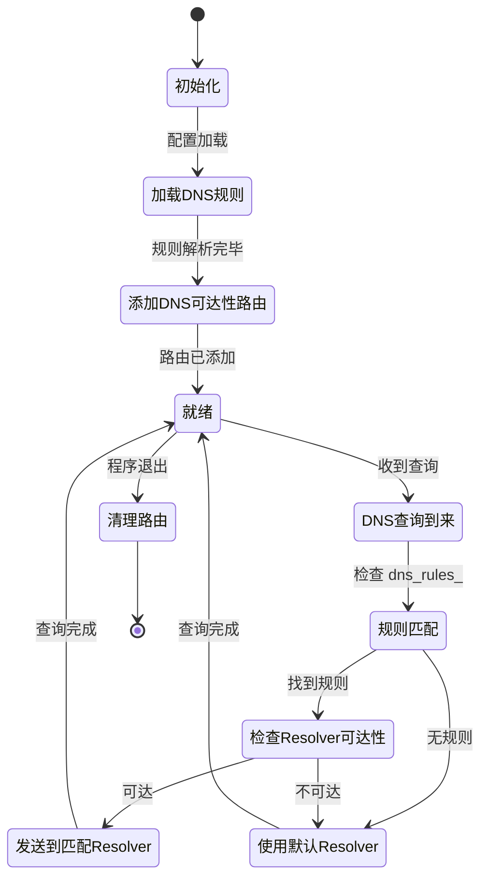

# 路由与 DNS

[English Version](ROUTING_AND_DNS.md)

## 范围

本文解释 OPENPPP2 真实的路由与 DNS 整形模型。在代码里，这两者不是分开的两个功能，而是客户端上的统一流量分类系统，以及服务端继续延伸的 DNS 处理路径。

主要锚点：

- `ppp/app/client/VEthernetNetworkSwitcher.*`
- `ppp/app/client/dns/Rule.*`
- `ppp/app/server/VirtualEthernetExchanger.*`
- `ppp/app/server/VirtualEthernetDatagramPort.*`
- `ppp/app/server/VirtualEthernetNamespaceCache.*`

---

## 架构总览



---

## 核心思想

客户端决定哪些流量留在本地、哪些流量进入隧道，以及哪些 DNS 服务器本身必须保持可达。
服务端则继续 DNS 路径，可能从缓存回答、转发到指定 resolver，或者正常转发。

---

## 客户端所有权

`VEthernetNetworkSwitcher` 负责客户端侧路由和 DNS 状态。

### 路由信息表

| 字段 | 说明 |
|------|------|
| `rib_` | 路由信息表——所有已知路由 |
| `fib_` | 转发信息表——活跃查找表 |
| `ribs_` | 已加载的 IP-list 来源（文件、URL） |
| `vbgp_` | 远程路由来源（vBGP） |

### DNS 状态

| 字段 | 说明 |
|------|------|
| `dns_rules_` | DNS 规则（域名 → resolver 映射） |
| `dns_serverss_` | DNS 服务器路由分配 |

源文件：`ppp/app/client/VEthernetNetworkSwitcher.h`

---

## 路由构造

客户端的路由来源：



### 关键方法

```cpp
/**
 * @brief 从所有已配置来源添加路由。
 * @param y  异步 IP-list 加载的 yield 上下文。
 * @return   所有路由成功应用时返回 true。
 */
bool AddAllRoute(YieldContext& y) noexcept;

/**
 * @brief 从 IP-list 来源加载并添加路由。
 * @param path_or_url  IP-list 文件路径或 HTTP/HTTPS URL。
 * @return             已添加的路由数量。
 */
int AddLoadIPList(const ppp::string& path_or_url) noexcept;

/**
 * @brief 从多个文件路径加载 IP-list。
 * @param paths  文件路径列表。
 * @return       总共加载的路由数量。
 */
int LoadAllIPListWithFilePaths(const ppp::vector<ppp::string>& paths) noexcept;

/**
 * @brief 为远程端点添加可达性路由。
 * @param endpoint  远程端点（服务端或 DNS 服务器）。
 * @return          路由添加成功时返回 true。
 */
bool AddRemoteEndPointToIPList(const IPEndPoint& endpoint) noexcept;

/**
 * @brief 向 OS 路由表添加一条路由。
 * @param network    网络地址。
 * @param mask       子网掩码。
 * @param gateway    网关地址。
 * @return           成功时返回 true。
 */
bool AddRoute(UInt32 network, UInt32 mask, UInt32 gateway) noexcept;

/**
 * @brief 保护默认路由不被隧道覆写。
 * @return 默认路由保护成功时返回 true。
 */
bool ProtectDefaultRoute() noexcept;
```

源文件：`ppp/app/client/VEthernetNetworkSwitcher.h`

---

## DNS 规则

客户端 DNS 规则决定某个域名或域名模式应该使用哪个 resolver。

### 规则匹配流程



resolver 决策与路由可达性绑定：
规则只有在到 resolver 的路径真实可达时才有意义。

### DNS 规则配置格式

```json
"dns-rules": [
  "rules://path/to/dns-rules.txt"
]
```

规则文件使用域名后缀 / 通配符条目，每条映射到一个 resolver 地址。

源文件：`ppp/app/client/dns/Rule.h`

---

## DNS 服务器路由分配

DNS 服务器被当作可达性敏感端点处理。

当客户端配置了某个 DNS 服务器：
1. 通过物理 NIC（不经隧道）为该 DNS 服务器添加直连路由。
2. 这确保对该服务器的 DNS 查询始终可达，不受默认路由变更的影响。

```cpp
/**
 * @brief 添加路由以使 DNS 服务器直连可达。
 * @return 所有 DNS 服务器路由添加成功时返回 true。
 */
bool AddRouteWithDnsServers() noexcept;

/**
 * @brief 删除 DNS 服务器可达性路由。
 * @return 路由删除成功时返回 true。
 */
bool DeleteRouteWithDnsServers() noexcept;
```

---

## 服务端 DNS 路径

服务端侧 DNS 处理：



### 服务端 DNS API

```cpp
/**
 * @brief 通过 namespace cache 重定向 DNS 查询。
 * @param y          Yield 上下文。
 * @param src        源端点（客户端）。
 * @param dns_data   原始 DNS 查询包。
 * @param length     DNS 包长度。
 * @return           查询已处理时返回 true。
 */
bool RedirectDnsQuery(YieldContext& y,
                      const IPEndPoint& src,
                      const Byte* dns_data,
                      int length) noexcept;
```

源文件：`ppp/app/server/VirtualEthernetExchanger.h`

### Namespace Cache

`VirtualEthernetNamespaceCache` 维护基于 TTL 的 DNS 缓存：

```cpp
/**
 * @brief 在 namespace cache 中查询主机名。
 * @param y         Yield 上下文。
 * @param hostname  要解析的主机名。
 * @return          解析得到的 IP 地址，失败时返回 IPEndPoint::None。
 */
IPEndPoint Query(YieldContext& y, const ppp::string& hostname) noexcept;

/**
 * @brief 向缓存插入一个已解析的条目。
 * @param hostname  已解析的主机名。
 * @param address   IP 地址结果。
 * @param ttl       生存时间（秒）。
 */
void Insert(const ppp::string& hostname, const IPEndPoint& address, int ttl) noexcept;
```

源文件：`ppp/app/server/VirtualEthernetNamespaceCache.h`

---

## 路径模型



---

## IP-list 来源

OPENPPP2 支持从多种来源加载 IP bypass 列表：

| 来源类型 | 示例 | 说明 |
|---------|------|------|
| 本地文件 | `/etc/openppp2/bypass.txt` | 纯文本文件，每行一条 CIDR |
| HTTP URL | `http://example.com/bypass.txt` | 启动时获取 |
| HTTPS URL | `https://cdn.example.com/bypass.txt` | 启动时 TLS 获取 |
| VIRR 刷新 | 配置 `virr.update-interval` | 周期性自动刷新 |

### VIRR 配置示例

```json
"virr": {
    "update-interval": 86400,
    "url": "https://example.com/bypass-list.txt"
}
```

bypass 列表刷新时，路由表随之更新。

---

## vBGP 远程路由

vBGP 子系统允许从远程 BGP 风格来源加载路由信息：

```json
"vbgp": {
    "update-interval": 3600,
    "url": "https://example.com/bgp-routes.txt"
}
```

vBGP 路由会合并到客户端 RIB 中。

---

## 路由与 DNS 的协调关系

路由和 DNS 不是两个独立的旋钮，而是统一的流量分类策略：

| 关注点 | 关联方式 |
|--------|---------|
| bypass 列表 | 决定哪些目标绕过隧道 |
| DNS 规则 | 决定每个域名使用哪个 resolver |
| Resolver 可达性 | Resolver 路由确保 resolver 在默认路由被重定向后仍然可达 |
| 服务端 DNS 缓存 | 减少重复的上游 DNS 查询 |
| IPv6 transit | 可能改变 IPv6 目标的"可达"含义 |
| Static echo | 可以提供绕过 DNS 决策的独立路径 |

---

## 配置参考

| 配置键 | 默认值 | 说明 |
|--------|--------|------|
| `client.dns-rules` | `[]` | DNS 规则文件路径或 URL |
| `client.bypass` | `[]` | IP bypass 列表文件路径或 URL |
| `geo-rules.enabled` | `false` | 从本地文本 GeoIP/GeoSite 输入生成额外的 bypass 和 DNS-rule 文件 |
| `geo-rules.geoip-dat` | `GeoIP.dat` | GeoIP dat 本地缓存路径；会下载并按配置国家解析 |
| `geo-rules.geosite-dat` | `GeoSite.dat` | GeoSite dat 本地缓存路径；会下载并按配置国家解析 |
| `geo-rules.geoip-download-url` | `""` | 可选 HTTP/HTTPS URL，用于下载/更新 `geoip-dat` |
| `geo-rules.geosite-download-url` | `""` | 可选 HTTP/HTTPS URL，用于下载/更新 `geosite-dat` |
| `geo-rules.geoip` | `[]` | 本地文本 CIDR 来源文件路径或路径数组 |
| `geo-rules.geosite` | `[]` | 本地文本域名来源文件路径或路径数组 |
| `geo-rules.append-bypass` | `[]` | 在 GeoIP CIDR 后追加的内联 CIDR 或本地 CIDR 文件 |
| `geo-rules.append-dns-rules` | `[]` | 在 GeoSite 规则后追加的内联 DNS 规则/域名或 `rules://` 本地文件 |
| `virr.update-interval` | `86400` | bypass 列表刷新间隔（秒） |
| `virr.url` | `""` | 周期性刷新的 bypass 列表 URL |
| `vbgp.update-interval` | `3600` | vBGP 路由刷新间隔（秒） |
| `vbgp.url` | `""` | vBGP 路由来源 URL |
| `server.dns` | 系统默认 | 服务端查询用的上游 DNS 服务器 |

---

## 错误码参考

路由和 DNS 相关的 `ppp::diagnostics::ErrorCode` 值：

| ErrorCode | 说明 |
|-----------|------|
| `RouteAddFailed` | 向 OS 路由表添加路由失败 |
| `RouteDeleteFailed` | 删除路由失败 |
| `DnsConfigFailed` | DNS 配置失败 |
| `DnsResolverUnreachable` | 配置的 DNS resolver 不可达 |
| `IPListLoadFailed` | 加载 IP bypass 列表失败 |
| `DefaultRouteProtectionFailed` | 保护默认路由失败 |
| `VirtualAdapterSubnetConflict` | 虚拟网卡子网与 bypass 列表冲突 |

---

## 使用示例

### 配置分流 bypass 列表

```json
{
  "client": {
    "bypass": [
      "/etc/openppp2/china-cidr.txt",
      "https://raw.githubusercontent.com/user/repo/main/bypass.txt"
    ]
  }
}
```

### 配置基于域名的 DNS 规则

```json
{
  "client": {
    "dns-rules": [
      "rules:///etc/openppp2/dns-rules.txt"
    ]
  }
}
```

DNS 规则文件格式示例：

```
# 将这些域名路由到本地 DNS 服务器
.example.com 192.168.1.1
.localnet.com 192.168.1.1

# 将这些路由到特定上游
.google.com 8.8.8.8
.cloudflare.com 1.1.1.1
```

### 生成 GeoIP / GeoSite 分流规则

`geo-rules` 是可选配置，默认关闭。开启后，OPENPPP2 会读取本地文本 GeoIP/GeoSite 输入，写出生成的 bypass 和 DNS-rule 文件，然后把这些文件追加接入现有路由/DNS 加载路径。它不会替换 `client.bypass` 或 `client.dns-rules`。

```json
{
  "geo-rules": {
    "enabled": true,
    "country": "cn",
    "geoip-dat": "/var/lib/openppp2/GeoIP.dat",
    "geosite-dat": "/var/lib/openppp2/GeoSite.dat",
    "geoip-download-url": "https://testingcf.jsdelivr.net/gh/MetaCubeX/meta-rules-dat@release/geoip.dat",
    "geosite-download-url": "https://testingcf.jsdelivr.net/gh/MetaCubeX/meta-rules-dat@release/geosite.dat",
    "geoip": [
      "/etc/openppp2/geoip-cn.txt"
    ],
    "geosite": [
      "/etc/openppp2/geosite-cn.txt"
    ],
    "dns-provider-domestic": "doh.pub",
    "dns-provider-foreign": "cloudflare",
    "output-bypass": "/var/lib/openppp2/generated/bypass-cn.txt",
    "output-dns-rules": "/var/lib/openppp2/generated/dns-rules-cn.txt",
    "append-bypass": [
      "10.0.0.0/8",
      "/etc/openppp2/custom-bypass.txt"
    ],
    "append-dns-rules": [
      "example.cn /doh.pub/nic",
      "internal.example.cn",
      "rules:///etc/openppp2/custom-dns-rules.txt"
    ]
  },
  "dns": {
    "servers": {
      "domestic": "doh.pub",
      "foreign": "cloudflare"
    }
  }
}
```

当前支持的输入格式刻意保持简单：

```text
# geoip-cn.txt：每行一个 CIDR
1.0.1.0/24
1.0.2.0/23
2408:8000::/20
```

```text
# geosite-cn.txt：每行一个域名或匹配表达式
baidu.com
.qq.com
domain:taobao.com
suffix:jd.com
full:example.cn
regexp:^.*\.example\.cn$
```

注意事项：

- `geoip-download-url` 和 `geosite-download-url` 会在启动时把 dat 文件下载到 `geoip-dat` 和 `geosite-dat`。
- 下载后的二进制 `geoip.dat` / `geosite.dat` 会按 `geo-rules.country` 自动解析生成规则；本地文本 `geoip` / `geosite` 输入和 append 列表会继续合并。
- 解析器也兼容 snake_case 写法（`geoip_dat`、`geosite_dat`、`geoip_download_url`、`geosite_download_url`），但文档推荐 kebab-case。
- `geoip` 和 `geosite` 当前仅支持本地文本文件；这些字段暂不支持 URL 来源。
- 生成的 DNS 规则使用 `/<dns-provider-domestic>/nic`；未配置时依次 fallback 到 `dns.servers.domestic` 和 `doh.pub`。
- `dns-provider-foreign` 已解析并预留给未来非 CN 或 `geolocation-!cn` 生成，但当前生成器不消费它。
- `append-bypass` 在 GeoIP CIDR 后合并，可包含内联 CIDR 或本地 CIDR 文件。
- `append-dns-rules` 在 GeoSite 规则后合并，可包含完整规则、用国内 provider 归一化的普通域名，或 `rules://` 本地文件。
- Android/iOS 客户端当前不运行生成器，因此不会影响已有移动端 DNS 规则注入路径。

### VIRR 定期刷新 bypass 列表示例

```json
{
  "virr": {
    "update-interval": 3600,
    "url": "https://cdn.example.com/bypass-latest.txt"
  }
}
```

### vBGP 远程路由示例

```json
{
  "vbgp": {
    "update-interval": 7200,
    "url": "https://cdn.example.com/bgp-routes.txt"
  }
}
```

---

## 路由决策流程



---

## DNS 路由分配状态机



---

## 读源码时要看什么

- 路由项不是静态表，它来自宿主、隧道和 bypass 的组合输入
- DNS 服务器被当成可达性敏感端点——它们有自己专属的路由条目
- 服务端 DNS 行为取决于 namespace cache 和 datagram port 状态
- IPv6 transit 和 static echo 会改变"可达"的含义
- bypass 列表和 DNS 规则是独立刷新的，两者应该保持一致

---

## 相关文档

- [`CONFIGURATION_CN.md`](CONFIGURATION_CN.md)
- [`CLIENT_ARCHITECTURE_CN.md`](CLIENT_ARCHITECTURE_CN.md)
- [`SERVER_ARCHITECTURE_CN.md`](SERVER_ARCHITECTURE_CN.md)
- [`LINKLAYER_PROTOCOL_CN.md`](LINKLAYER_PROTOCOL_CN.md)
- [`DEPLOYMENT_CN.md`](DEPLOYMENT_CN.md)
