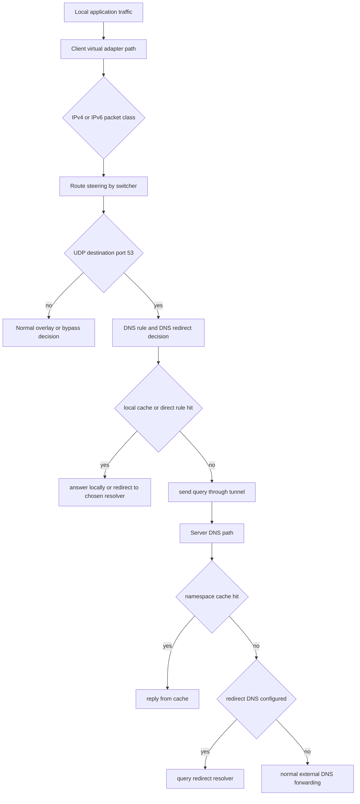
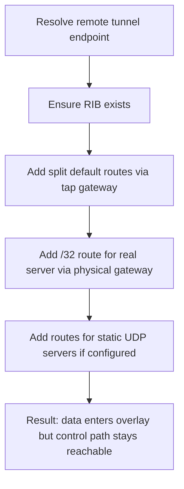
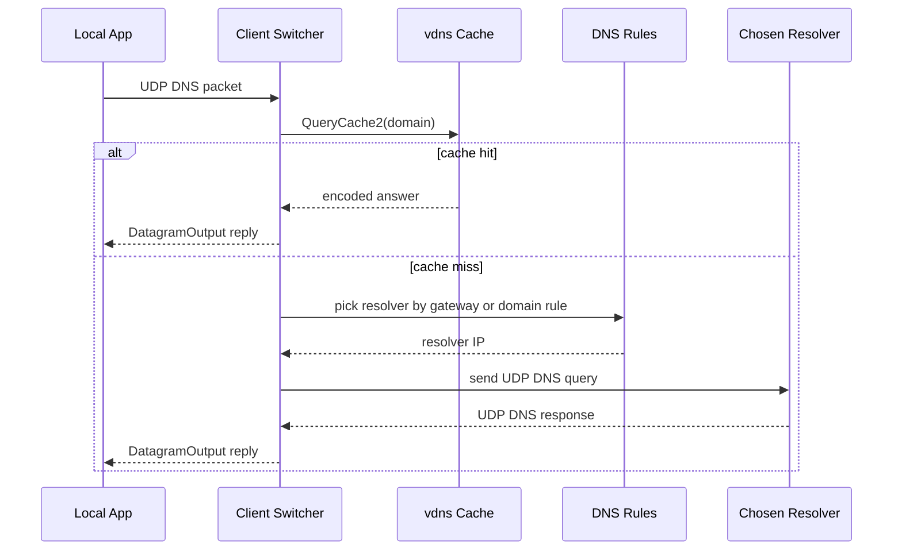
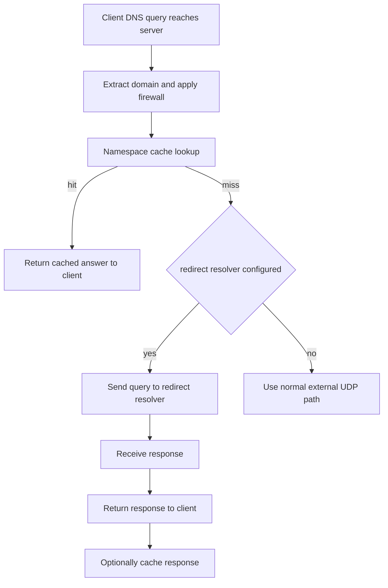

# 路由与 DNS

[English Version](ROUTING_AND_DNS.md)

本文档解释 OPENPPP2 里路由分流与 DNS 分流在运行时到底如何协同工作。内容基于以下真实实现路径：

- `ppp/app/client/VEthernetNetworkSwitcher.cpp`
- `ppp/app/client/dns/Rule.cpp`
- `ppp/app/server/VirtualEthernetExchanger.cpp`
- `ppp/app/server/VirtualEthernetDatagramPort.cpp`
- `ppp/app/server/VirtualEthernetNamespaceCache.cpp`

核心结论很简单：在 OPENPPP2 中，路由与 DNS 不是两个彼此独立的小功能，而是一整套统一的流量分类系统。

## 为什么它们必须放在一起理解

很多 overlay 系统在文档上容易犯一个错误：把 route policy 和 DNS policy 完全分开。OPENPPP2 的实现并不支持这种理解方式。

客户端负责决定：

- 哪些流量应该留在本地
- 哪些流量应该进入 overlay
- 哪些 DNS 服务器自己应该走物理 NIC
- 哪些 DNS 服务器自己应该走虚拟侧

而服务端继续延续这套策略：

- 可以直接从 cache 回 DNS
- 可以把 DNS 转发到指定 redirect resolver
- 也可以按普通真实网络 UDP 转发

因此最终的分类模型其实是三层叠加：

- 目标前缀决定一部分流量
- 目标域名决定一部分流量
- DNS 服务器自身的可达路径还要额外单独处理

这也是为什么本主题必须单独成文。

## 运行时所有权

大部分路由控制权在客户端。

这可以从 `VEthernetNetworkSwitcher` 的成员职责看出来，它持有：

- 路由信息表 `rib_`
- 转发表 `fib_`
- 已注册的 IP-list 来源 `ribs_`
- 可选远程路由来源 `vbgp_`
- DNS 规则集 `dns_ruless_`
- DNS 服务器路由缓存集合 `dns_serverss_`
- 默认路由保护逻辑
- 对操作系统进行 route add 和 route delete 的能力

服务端这边更多负责“DNS 到达服务端之后怎么处理”。

关键入口包括：

- `VirtualEthernetExchanger::SendPacketToDestination(...)`
- `VirtualEthernetExchanger::RedirectDnsQuery(...)`
- `VirtualEthernetDatagramPort::NamespaceQuery(...)`
- `VirtualEthernetNamespaceCache`

## 高层分类模型

整个路由与 DNS 决策路径可以概括为：

## 客户端如何构造路由

客户端不是只有一个地方在“加路由”。它实际上分多个阶段构造路由策略。

关键函数包括：

- `AddAllRoute(...)`
- `AddLoadIPList(...)`
- `LoadAllIPListWithFilePaths(...)`
- `AddRemoteEndPointToIPList(...)`
- `AddRoute()`
- `DeleteRoute()`
- `AddRouteWithDnsServers()`
- `DeleteRouteWithDnsServers()`
- `ProtectDefaultRoute()`

这很重要，因为 OPENPPP2 不是只有一种 route source，而是把多个来源合并成最终写入操作系统的路由状态。

## 路由来源

代码支持多种路由来源。

第一，虚拟网卡子网本身一定是路由来源。在 `AddAllRoute(...)` 中，客户端会根据 tap 的地址与 mask 计算子网，然后把该子网用 tap gateway 作为 next hop 写入 RIB。

第二，bypass IP-list 也是路由来源。在 Android 和 iPhone 一类由 VPN 自己接管路由表的模式下，`AddAllRoute(...)` 可以直接把 bypass IP-list 字符串导入 RIB，并使用 loopback 作为一种合成 next hop。这里的 loopback 不是字面意义上的外部网关，而是后续 bypass 判断逻辑使用的语义标记。

第三，可以通过 `AddLoadIPList(...)` 注册显式 IP-list 文件。这个函数会规范化路径，检查文件是否存在，或者检查 `vbgp` URL 是否有效，拒绝重复注册，保存可选 next hop，并在 Linux 上额外记录 gateway 到 interface name 的映射。

第四，如果这个 route source 同时带有合法 URL，则 `AddLoadIPList(...)` 还会把它记入 `vbgp_`。这正是代码层面证明：OPENPPP2 支持“文件驱动路由策略 + 可选远程刷新”的模式，而不是只能依赖一个实时控制器。

第五，隧道服务端自身 endpoint 也是特殊 route source。`AddRemoteEndPointToIPList(...)` 的任务就是保证：即使大部分流量被引入 overlay，客户端也仍然能通过物理网络到达 tunnel server。

## IP-List 的加载方式

`LoadAllIPListWithFilePaths(...)` 是把前面注册好的 IP-list 真正落地成 `rib_` 的地方。

这个函数会先清空当前 `rib_` 和 `fib_`，再根据物理 gateway 推导默认 next hop，然后遍历所有已注册 IP-list 文件，把它们加载进新的 `RouteInformationTable`。每份列表要么使用注册时带的 next hop，要么回落到默认物理 next hop。

只有在至少成功加入一条 route 的情况下，这个新的 `rib_` 才会被保留。

这里能看出两个设计点。

第一，route source 的注册和 route table 的真正生成是两个阶段。

第二，空列表或无效列表不会被当成成功。

## 保护隧道服务端可达性

`AddRemoteEndPointToIPList(...)` 是最关键的路由保护函数之一。

它并不只是“给服务端加一条 host route”。

这个函数会先通过 exchanger 解析真实远端 endpoint。如果当前启用了 forwarding，还会考虑 proxy-forwarded 后的 endpoint 形式。

之后确保 `rib_` 存在，并插入三条很关键的 catch-all 分流路由，全部指向 tap gateway：

- `0.0.0.0/0`
- `0.0.0.0/1`
- `128.0.0.0/1`

这种 split default-route 写法，本质上是把绝大部分 IPv4 数据流量导向 overlay，而不只依赖单条传统 default route。

然后函数再把 tunnel server 自身的实际 IP 地址，以 `/32` route 的形式，经由传入的物理 gateway 写入 `rib_`。这正是“避免控制流量重新被路由回隧道自身”的核心机制。

该函数还会处理 static UDP server 列表。对每个 static server endpoint，它会解析地址，必要时也为其加入物理 `/32` 路由，并在启用 aggregator 时把这些 endpoint 一起交给聚合器。

所以对 tunnel server 可达性的保护，不是边角逻辑，而是客户端存活的基础条件。

## 路由如何写进操作系统

客户端并不满足于只维护内部 RIB。它会把这些路由真正写进操作系统。

这件事由 `AddRoute()` 完成，之后由 `DeleteRoute()` 反向清理。

不同平台行为不同。

Windows 上，客户端会删除冲突默认路由，再把 `rib_` 全量写入系统，退出时再恢复原来的默认路由。

macOS 上，在非 promisc 模式下可能先删除旧默认路由，再安装 `rib_`，退出时再恢复原始默认路由。

Linux 上，客户端可以先发现所有默认路由，在合适条件下删除它们，再把 `rib_` 写到选定 interface name 上，并在退出时恢复保存过的默认路由。

三边的共同点是：路由安装和 tunnel 生命周期强绑定，不被当作永久静态系统配置。

## 默认路由保护

`ProtectDefaultRoute()` 的存在本身就很说明问题。

OPENPPP2 不假设“加完路由以后系统状态永远不变”。它会启动一个专门的保护线程。只要客户端仍然存活且 route 已安装，每秒就检查一次条件是否仍然成立，然后尝试再次删除那些不该出现的默认路由。

这个逻辑在 Windows 上尤为明显，但它所体现的工程理念不只属于某个 OS：OPENPPP2 把 route correctness 当成需要持续维护的运行时条件，而不是一次性安装动作。

## DNS 服务器路由钉住

最值得注意的实现细节之一，是 `AddRouteWithDnsServers()`。

客户端不仅为应用流量安装路由，也会为 resolver IP 自身安装路由。

这个函数会构造两组 DNS server 集合：

- 一组应该经由虚拟网卡侧到达
- 一组应该经由底层物理 NIC 到达

这些地址来源于：

- TUN 或 TAP 适配器当前 DNS 列表
- 底层 NIC 当前 DNS 列表
- 从 `dns_ruless_` 加载出来的 DNS rule target

函数会过滤无效、loopback、multicast、unspecified 以及“与本地子网同段不需要额外路由”的情况，再对两组去重，最后为每个 resolver IP 安装 `/32` 路由。

第一组 resolver 走 tap gateway。

第二组 resolver 走物理 gateway。

这正是代码层面最清楚的证据：DNS 路由本身就是 OPENPPP2 路由设计的一等公民。只有把 resolver 的可达路径也钉住，overlay 改写默认路由后 DNS policy 才不会失真。

`DeleteRouteWithDnsServers()` 在 teardown 时把这些 resolver-specific route 再全部删除，并清空缓存集合。

## Bypass 的实际判定方式

客户端运行时还需要动态判断某个 IP 是否应被视为 bypass。

`IsBypassIpAddress(...)` 的实现是平台相关的。

Android 上，它根据 forwarding table 看该 IP 的 next hop 是否等于 tap gateway。

Windows 上，它查询系统 best interface，然后比较这个 interface 是否就是 tunnel interface。

Unix 类系统上，它会比较 best interface IP 是否等于 tap IP。

因此 bypass 不是单纯由配置文本决定的，而是结合操作系统实时路由状态决定的。

## 客户端 DNS 规则模型

客户端 DNS 规则由 `LoadAllDnsRules(...)` 加载，具体解析在 `ppp/app/client/dns/Rule.cpp`。

解析器支持三种 host 匹配风格：

- 相对域名匹配
- 通过 `full:` 前缀指定的精确匹配
- 通过 `regexp:` 前缀指定的正则匹配

每一行规则至少需要两段：

- host expression
- resolver address

可选第三段会影响 `Nic` 标志。运行时随后根据这个标志，决定该 resolver IP 应该被放进“物理 NIC 可达集合”还是“虚拟侧可达集合”。

规则匹配顺序是明确的：

1. `full:` 精确匹配
2. regex 匹配
3. 相对域名匹配，通过 `Firewall::IsSameNetworkDomains(...)`

这意味着 DNS 规则不是松散叠加的一堆 pattern，而是有确定优先级的。

## 客户端侧 DNS Redirect

客户端 DNS redirect 从 `VEthernetNetworkSwitcher::OnUdpPacketInput(...)` 进入，但真正的核心逻辑在 `RedirectDnsServer(...)`。

这条路径会做下面这些事。

第一，先解码 DNS message，拒绝格式错误的包。

第二，先查本地 `vdns` cache 的 `QueryCache2(...)`。如果命中，则直接重新编码 DNS answer，并通过 `DatagramOutput(...)` 注回本地数据路径，完全不访问上游 resolver。

第三，如果这个 DNS 包原本是发给虚拟 gateway 的，则客户端选用当前 `vdns` server 列表里的第一个地址作为上游目标。

第四，否则根据查询域名匹配 DNS rule，选择 rule 指定的 resolver address。但如果 rule 的 resolver 正好等于当前目标地址，则拒绝，避免无意义递归。

第五，打开 UDP socket，必要时在 Linux 下结合 `IsBypassIpAddress(...)` 和 `ProtectorNetwork` 对 socket 做保护绑定，把 DNS 请求发出去，启动超时定时器，等待响应，再把响应通过 `DatagramOutput(...)` 回送本地。

所以客户端 DNS redirect 绝不是简单的“换个 DNS 发出去”，而是同时具备：

- 域名感知
- 本地缓存感知
- 路由感知
- protect-mode 感知
- 与本地 UDP reinjection 路径统一

## 客户端 DNS 缓存如何回灌

`DatagramOutput(...)` 是客户端把 UDP reply 重新注回虚拟网卡路径的出口。

当 `caching` 标志为真，且目标端口是 DNS 时，该函数还会先通过 `vdns::AddCache(...)` 把 DNS packet 写入本地 cache，再把 UDP frame 转回 IP packet 并输出。

所以客户端 DNS cache 并不是脱离数据平面的独立系统，而是在同一个 reinjection 出口与数据路径汇合。

## 服务端 DNS 路径

一旦 DNS 流量到达服务端，核心决策函数就是 `VirtualEthernetExchanger::SendPacketToDestination(...)`。

当目标端口是 53 时，服务端会依次做：

1. 提取查询域名
2. 记录 DNS 日志
3. 执行 firewall domain 检查
4. 通过 `VirtualEthernetDatagramPort::NamespaceQuery(...)` 先查 namespace cache
5. 如果 cache 没处理，再尝试 `RedirectDnsQuery(...)`
6. 如果仍未处理，才走普通 UDP datagram port 转发

因此这不是“普通 UDP send 加一点日志”的路径，而是一条分层决策栈。

## Namespace Cache 的设计

服务端 namespace cache 由 `VirtualEthernetNamespaceCache` 实现。

它的设计并不复杂，但很有效。

每个 cache key 由三部分构成：

- query type
- query class
- domain

拼接格式是 `TYPE:<type>|CLASS:<class>|DOMAIN:<domain>`。

每个 entry 保存：

- 编码后的 DNS response bytes
- response length
- 基于 TTL 计算出的过期时间

内部结构是 hash table 加 linked list。`Update()` 会从链表头开始清理过期项。`Get()` 取出缓存响应时，还会把 DNS transaction id 改写成当前请求的 id。

这一点非常关键。如果不重写 trans id，cache replay 就不是一个行为正确的 DNS 响应。

## 服务端 Cache Lookup 如何工作

`VirtualEthernetDatagramPort::NamespaceQuery(...)` 实际上有两种用法。

第一种接受一个原始 DNS response packet，并把它写入 namespace cache。这个分支用于服务端后来从真实上游或 redirect path 收到 DNS answer 时，把结果缓存起来。

第二种接受 domain、query type、query class，并尝试直接用 cache 回答当前客户端请求。如果命中，就把答案通过以下任一路径送回客户端：

- 普通 tunnel 路径上的 `DoSendTo(...)`
- static path 上的 `VirtualEthernetDatagramPortStatic::Output(...)`

因此 namespace cache 是 normal UDP path 和 static UDP path 共用的。

## 服务端 DNS Redirect

如果 cache 没命中，且配置了 `configuration->udp.dns.redirect`，服务端就会进入 `RedirectDnsQuery(...)`。

这个函数要么直接使用 switcher 已经解析好的 redirect endpoint，要么异步解析配置里的 redirect hostname。

随后 `INTERNAL_RedirectDnsQuery(...)` 会打开 UDP socket，把 DNS packet 发给 redirect resolver，异步等待响应并带超时保护，拿到响应后再发回客户端。

返回客户端的路径取决于上下文。

如果请求来自 static transit，则通过 `VirtualEthernetDatagramPortStatic::Output(...)` 返回。

否则通过普通 tunnel 上的 `DoSendTo(...)` 返回。

如果启用了 DNS cache，服务端在转发响应后还会把该 answer 再写入 namespace cache。

因此 redirect DNS 不只是一次转发决策，它还是 shared namespace cache 的一个生产者。

## 普通 DNS 响应也会进入 Cache

namespace cache 并不只由 redirect path 填充。

`VirtualEthernetDatagramPort` 和 `VirtualEthernetDatagramPortStatic` 都包含逻辑：当收到 DNS response，且 `udp.dns.cache` 开启时，把它写进 namespace cache。

因此 cache 的数据来源可能是：

- 普通外部 DNS 转发
- redirect DNS 转发
- static-path DNS 转发

这让 cache 不只服务某一条路径，而是对整个服务端 DNS 体系都有效。

## 运维层面的直接后果

从这套实现可以直接得到几个结论。

第一，客户端 route model 不只是前缀匹配，还包括“控制面地址必须走正确一侧”“resolver 地址自身必须走正确一侧”。

第二，split routing 不是单一功能，而是由 IP-list、remote-endpoint pinning、default-route 改写、运行时 bypass 判定、resolver route pinning 共同形成的结果。

第三，DNS 在客户端和服务端两边都是强策略感知的。客户端可按规则本地解决或重定向，服务端可从 cache 直接回答、转发到 redirect resolver，或按普通外部网络转发。

第四，cache 本身就是数据平面的一部分。DNS cache hit 最终也是通过 normal tunnel 或 static channel 回给客户端。

第五，route correctness 被当成持续运行时条件，而不是一次性安装动作。默认路由保护线程已经足够说明这一点。

## 建议源码阅读顺序

如果要继续顺着源码读，最有效的顺序是：

1. `VEthernetNetworkSwitcher::AddLoadIPList(...)`
2. `VEthernetNetworkSwitcher::LoadAllIPListWithFilePaths(...)`
3. `VEthernetNetworkSwitcher::AddRemoteEndPointToIPList(...)`
4. `VEthernetNetworkSwitcher::AddRoute()` 与 `DeleteRoute()`
5. `VEthernetNetworkSwitcher::AddRouteWithDnsServers()`
6. `VEthernetNetworkSwitcher::ProtectDefaultRoute()`
7. `ppp/app/client/dns/Rule.cpp`
8. `VEthernetNetworkSwitcher::RedirectDnsServer(...)`
9. `VirtualEthernetExchanger::SendPacketToDestination(...)`
10. `VirtualEthernetNamespaceCache.cpp`

## 结论

在 OPENPPP2 中，路由与 DNS 实际上构成了一块统一控制面。

路由决定流量有没有资格走某条路径，DNS 规则决定某个名字应由哪条解析路径回答，而 resolver IP 自身又会被单独加路由，保证 DNS policy 在 route diversion 之后仍然成立。服务端再继续用 cache 和 redirect 逻辑延续这套策略，而不是把 DNS 当成普通 UDP。这正是 OPENPPP2 看起来更像一个策略感知的 overlay 边缘节点，而不是一根简单加密管道的原因。
