# 路由与 DNS

[English Version](ROUTING_AND_DNS.md)

本文档解释 OPENPPP2 里路由分流与 DNS 分流在运行时到底如何协同工作。内容基于以下真实实现路径：

- `ppp/app/client/VEthernetNetworkSwitcher.cpp`
- `ppp/app/client/dns/Rule.cpp`
- `ppp/app/server/VirtualEthernetExchanger.cpp`
- `ppp/app/server/VirtualEthernetDatagramPort.cpp`
- `ppp/app/server/VirtualEthernetNamespaceCache.cpp`

核心结论很简单：在 OPENPPP2 中，路由与 DNS 不是两个彼此独立的小功能，而是一整套统一的流量分类系统。

---

## 目录

1. [为什么它们必须放在一起理解](#为什么它们必须放在一起理解)
2. [运行时所有权](#运行时所有权)
3. [路由策略表详解](#路由策略表详解)
   - 1.1 [Global 路由表](#global-路由表)
   - 1.2 [Policy 路由表](#policy-路由表)
   - 1.3 [Smart 路由表](#smart-路由表)
4. [三层分类模型](#三层分类模型)
5. [客户端如何构造路由](#客户端如何构造路由)
6. [路由来源](#路由来源)
7. [IP-List 的加载方式](#ip-list-的加载方式)
8. [保护隧道服务端可达性](#保护隧道服务端可达性)
9. [路由如何写进操作系统](#路由如何写进操作系统)
10. [默认路由保护](#默认路由保护)
11. [DNS 服务器路由钉住](#dns-服务器路由钉住)
12. [Bypass 机制详解](#bypass-机制详解)
    - 12.1 [Bypass 判定流程](#bypass-判定流程)
    - 12.2 [Bypass IP-List 格式](#bypass-ip-list-格式)
    - 12.3 [Bypass 配置示例](#bypass-配置示例)
13. [客户端 DNS 规则模型](#客户端-dns-规则模型)
    - 13.1 [DNS 策略表格式](#dns-策略表格式)
    - 13.2 [DNS 规则匹配优先级](#dns-规则匹配优先级)
14. [客户端侧 DNS Redirect](#客户端侧-dns-redirect)
15. [客户端 DNS 缓存如何回灌](#客户端-dns-缓存如何回灌)
16. [服务端 DNS 路径](#服务端-dns-路径)
17. [Namespace Cache 的设计](#namespace-cache-的设计)
18. [服务端 Cache Lookup 如何工作](#服务端-cache-lookup-如何工作)
19. [服务端 DNS Redirect](#服务端-dns-redirect)
20. [普通 DNS 响应也会进入 Cache](#普通-dns-响应也会进入-cache)
21. [完整流量分类流程图](#完整流量分类流程图)
22. [DNS 完整流程图](#dns-完整流程图)
23. [配置示例](#配置示例)
    - 23.1 [基础客户端配置](#基础客户端配置)
    - 23.2 [Policy 路由配置](#policy-路由配置)
    - 23.3 [Smart 路由配置](#smart-路由配置)
    - 23.4 [DNS 规则配置](#dns-规则配置)
    - 23.5 [完整生产环境配置](#完整生产环境配置)
24. [运维层面的直接后果](#运维层面的直接后果)
25. [建议源码阅读顺序](#建议源码阅读顺序)
26. [结论](#结论)

---

## 为什么它们必须放在一起理解

很多 overlay 系统在文档上容易犯一个错误：把 route policy 和 DNS policy 完全分开。OPENPPP2 的实现并不支持这种理解方式。

客户端负责决定：

- 哪些流量应该留在本地
- 哪些流量应该进入 overlay
- 哪些 DNS 服务器自己应该走物理 NIC
- 哪些 DNS 服务器自己应该走虚拟侧

而服务端继续延续这套策略：

- 可以直接从 cache 回 DNS
- 可以把 DNS 转发到指定 redirect resolver
- 也可以按普通真实网络 UDP 转发

因此最终的分类模型其实是三层叠加：

- 目标前缀决定一部分流量
- 目标域名决定一部分流量
- DNS 服务器自身的可达路径还要额外单独处理

这也是为什么本主题必须单独成文。

---

## 运行时所有权

大部分路由控制权在客户端。

这可以从 `VEthernetNetworkSwitcher` 的成员职责看出来，它持有：

- 路由信息表 `rib_`
- 转发表 `fib_`
- 已注册的 IP-list 来源 `ribs_`
- 可选远程路由来源 `vbgp_`
- DNS 规则集 `dns_ruless_`
- DNS 服务器路由缓存集合 `dns_serverss_`
- 默认路由保护逻辑
- 对操作系统进行 route add 和 route delete 的能力

服务端这边更多负责"DNS 到达服务端之后怎么处理"。

关键入口包括：

- `VirtualEthernetExchanger::SendPacketToDestination(...)`
- `VirtualEthernetExchanger::RedirectDnsQuery(...)`
- `VirtualEthernetDatagramPort::NamespaceQuery(...)`
- `VirtualEthernetNamespaceCache`

---

## 路由策略表详解

OPENPPP2 的路由策略系统支持三种主要的路由表类型，每种类型在不同的场景下发挥作用。

### Global 路由表

Global 路由表是系统中最基础的路由策略，用于定义默认的流量行为。它包含以下核心概念：

| 字段 | 说明 | 可选值 |
|------|------|--------|
| `0.0.0.0/0` | 默认全零路由，捕获所有未匹配流量 | via tap gateway |
| `0.0.0.0/1` | 第一段 split default route | via tap gateway |
| `128.0.0.0/1` | 第二段 split default route | via tap gateway |
| `/32` | 主机特定路由 | via physical gateway |

Global 路由表的典型配置结构如下：

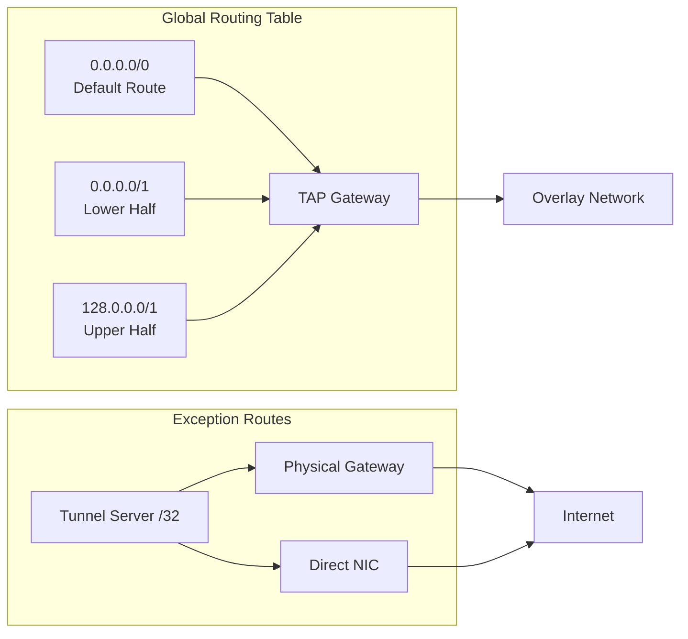
```mermaid
flowchart LR
    subgraph "Global Routing Table"
        A["0.0.0.0/0<br/>Default Route"] --> B[TAP Gateway]
        C["0.0.0.0/1<br/>Lower Half"] --> B
        D["128.0.0.0/1<br/>Upper Half"] --> B
    end
    
    subgraph "Exception Routes"
        E["Tunnel Server /32"] --> F[Physical Gateway]
        E --> G[Direct NIC]
    end
    
    B --> H[Overlay Network]
    F --> I[Internet]
    G --> I
```

Global 路由表的工作逻辑可以表示为：

| 优先级 | 目标网络 | Next Hop | 说明 |
|--------|----------|----------|------|
| 0 | `10.0.0.0/8` (TAP subnet) | `direct` | 本地子网直连 |
| 1 | `0.0.0.0/1` | `tun0` | 分流下半段 |
| 2 | `128.0.0.0/1` | `tun0` | 分流上半段 |
| 3 | `10.0.0.1/32` (Tunnel Server) | `eth0` | 服务端直连 |
| 4 | `8.8.8.8/32` (DNS) | `eth0` | DNS 物理路径 |
| 5 | `8.8.4.4/32` | `tun0` | 自定义 DNS 走 overlay |

### Policy 路由表

Policy 路由表用于定义基于域名的精细路由策略，它允许用户根据目标地址的前缀、端口或协议来区分流量。Policy 路由表的每一行定义了一个流量匹配规则和对应的处理方式。

Policy 路由表的核心字段定义：

| 字段 | 类型 | 说明 | 示例 |
|------|------|------|------|
| `domain` | string | 目标域名匹配表达式 | `*.google.com` |
| `full:` | prefix | 精确域名匹配 | `full:example.com` |
| `regexp:` | prefix | 正则表达式匹配 | `regexp:\.google\..*$` |
| `target` | IP/CIDR | 目标地址或网段 | `172.16.0.0/12` |
| `nic` | enum | 网络接口标志 | `physical` / `tunnel` |
| `proxy` | boolean | 是否使用代理 | `true` / `false` |

Policy 路由表的匹配流程可以用以下表格表示：

| 匹配类型 | 优先级 | 匹配规则 | 处理动作 | 示例规则 |
|----------|--------|----------|----------|----------|
| `full:` | 1 | 精确匹配域名 | 返回指定 resolver | `full:api.google.com` |
| `regexp:` | 2 | 正则表达式匹配 | 返回匹配结果 | `regexp:.*\.baidu\.com$` |
| 相对域名 | 3 | 前缀/子串匹配 | 同 rule 处理 | `facebook` 匹配 `*.facebook.com` |
| 通配符 | 4 | `*` 匹配所有 | 默认处理规则 | `*` |

Policy 路由表在文件中的标准格式是每个非空非注释行包含两到三段：

```
# 格式: host_expression resolver_address [Nic]
# 第二列是 resolver IP 地址
# 第三列可选，指定 Nic 标志 (physical 或 virtual)

# 精确域名匹配
full:openai.com 8.8.8.8
full:api.ipify.org 1.1.1.1

# 正则表达式���配
regexp:\.google\.com$ 8.8.4.4
regexp:\.facebook\.com$ 1.0.0.1

# 相对域名匹配
google.com 8.8.8.8
facebook.com 1.1.1.1
youtube.com 8.8.4.4

# 特殊域名
* 223.5.5.5
```

Policy 路由表的内部处理逻辑可以表示为：

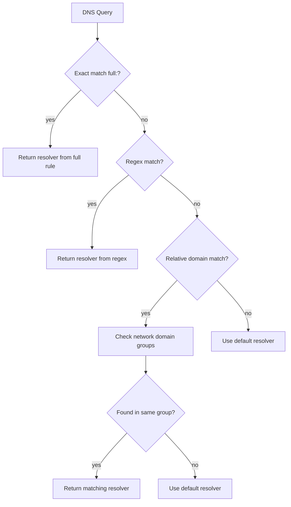
```mermaid
flowchart TD
    A[DNS Query] --> B{Exact match full:?}
    B -- yes --> C[Return resolver from full rule]
    B -- no --> D{Regex match?}
    D -- yes --> E[Return resolver from regex]
    D -- no --> F{Relative domain match?}
    F -- yes --> G[Check network domain groups]
    F -- no --> H[Use default resolver]
    G --> I{Found in same group?}
    I -- yes --> J[Return matching resolver]
    I -- no --> K[Use default resolver]
```

### Smart 路由表

Smart 路由表是 OPENPPP2 的智能路由系统，它结合了多个信号来自动决定最佳路由路径。Smart 路由表不仅考虑目标地址，还考虑延迟、丢包率、带宽等多个维度。

Smart 路由表的核心概念：

| 维度 | 参数 | 说明 |
|------|------|------|
| 延迟 | `latency` | 目标节点的响应时间 (ms) |
| 丢包率 | `packet_loss` | 数据包的丢失比例 (%) |
| 带宽 | `bandwidth` | 可用带宽 (Mbps) |
| 抖动 | `jitter` | 延迟的变化程度 (ms) |
| 负载 | `load` | 当前节点的负载状态 |

Smart 路由表的自动决策逻辑：

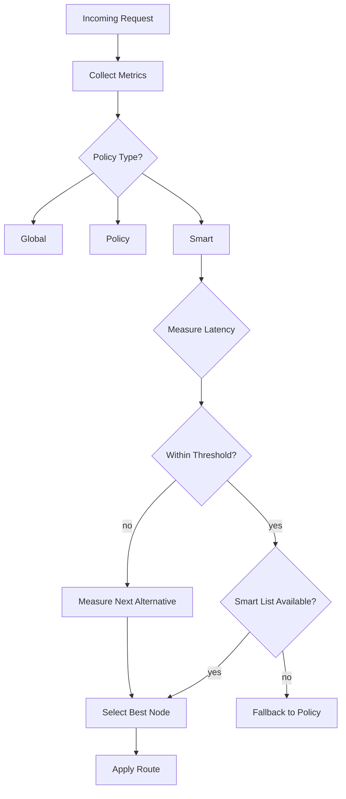
```mermaid
flowchart TD
    A[Incoming Request] --> B[Collect Metrics]
    B --> C{Policy Type?}
    C --> D[Global]
    C --> E[Policy]
    C --> F[Smart]
    
    F --> G{Measure Latency}
    G --> H{Within Threshold?}
    H -- yes --> I{Smart List Available?}
    H -- no --> J[Measure Next Alternative]
    I -- yes --> K[Select Best Node]
    I -- no --> L[Fallback to Policy]
    J --> K
    
    K --> M[Apply Route]
```

Smart 路由表的配置示例：

```
# Smart 路由配置格式
# host_expression|smart_node_1,smart_node_2,...
# 当第一个节点不健康时自动切换

google.com|1.1.1.1,8.8.8.8
youtube.com|1.0.0.1,8.8.4.4
netflix.com|172.217.0.0/16|smart
```

Smart 路由表与 Policy 路由表的区别可以用以下对比表说明：

| 特性 | Policy 路由表 | Smart 路由表 |
|------|---------------|--------------|
| 决策依据 | 静态规则 | 动态指标 |
| 适用场景 | 已知固定目标 | 动态/不稳定目标 |
| 故障切换 | 手动切换 | 自动切换 |
| 延迟敏感 | 否 | 是 |
| 带宽敏感 | 否 | 是 |
| 示例 | `*.google.com 8.8.8.8` | `google.com|1.1.1.1,8.8.8.8` |

---

## 三层分类模型

整个路由与 DNS 决策路径可以概括为：

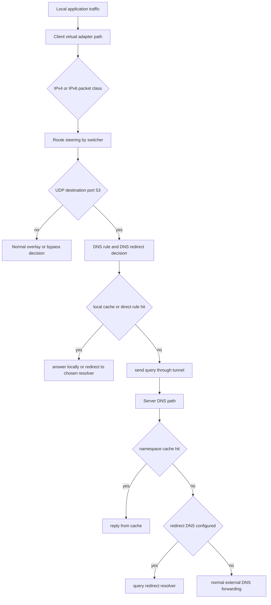
```mermaid
flowchart TD
    A[Local application traffic] --> B[Client virtual adapter path]
    B --> C{IPv4 or IPv6 packet class}
    C --> D[Route steering by switcher]
    D --> E{UDP destination port 53}
    E -- no --> F[Normal overlay or bypass decision]
    E -- yes --> G[DNS rule and DNS redirect decision]
    G --> H{local cache or direct rule hit}
    H -- yes --> I[answer locally or redirect to chosen resolver]
    H -- no --> J[send query through tunnel]
    J --> K[Server DNS path]
    K --> L{namespace cache hit}
    L -- yes --> M[reply from cache]
    L -- no --> N{redirect DNS configured}
    N -- yes --> O[query redirect resolver]
    N -- no --> P[normal external DNS forwarding]
```

三层分类模型的详细内容：

| 层级 | 分类依据 | 决策点 | 影响范围 |
|------|----------|--------|----------|
| L1 | 目标前缀 (Prefix) | RIB/FIB 查找 | 大部分 IP 流量 |
| L2 | 目标域名 (Domain) | DNS Rule 匹配 | DNS 查询流量 |
| L3 | DNS Resolver 路径 | Resolver Route Pinning | DNS 响应路径 |

---

## 客户端如何构造路由

客户端不是只有一个地方在"加路由"。它实际上分多个阶段构造路由策略。

关键函数包括：

- `AddAllRoute(...)`
- `AddLoadIPList(...)`
- `LoadAllIPListWithFilePaths(...)`
- `AddRemoteEndPointToIPList(...)`
- `AddRoute()`
- `DeleteRoute()`
- `AddRouteWithDnsServers()`
- `DeleteRouteWithDnsServers()`
- `ProtectDefaultRoute()`

这很重要，因为 OPENPPP2 不是只有一种 route source，而是把多个来源合并成最终写入操作系统的路由状态。

---

## 路由来源

代码支持多种路由来源。

第一，虚拟网卡子网本身一定是路由来源。在 `AddAllRoute(...)` 中，客户端会根据 tap 的地址与 mask 计算子网，然后把该子网用 tap gateway 作为 next hop 写入 RIB。

第二，bypass IP-list 也是路由来源。在 Android 和 iPhone 一类由 VPN 自己接管路由表的模式下，`AddAllRoute(...)` 可以直接把 bypass IP-list 字符串导入 RIB，并使用 loopback 作为一种合成 next hop。这里的 loopback 不是字面意义上的外部网关，而是后续 bypass 判断逻辑使用的语义标记。

第三，可以通过 `AddLoadIPList(...)` 注册显式 IP-list 文件。这个函数会规范化路径，检查文件是否存在，或者检查 `vbgp` URL 是否有效，拒绝重复注册，保存可选 next hop，并在 Linux 上额外记录 gateway 到 interface name 的映射。

第四，如果这个 route source 同时带有合法 URL，则 `AddLoadIPList(...)` 还会把它记入 `vbgp_`。这正是代码层面证明：OPENPPP2 支持"文件驱动路由策略 + 可选远程刷新"的模式，而不是只能依赖一个实时控制器。

第五，隧道服务端自身 endpoint 也是特殊 route source。`AddRemoteEndPointToIPList(...)` 的任务就是保证：即使大部分流量被引入 overlay，客户端也仍然能通过物理网络到达 tunnel server。

---

## IP-List 的加载方式

`LoadAllIPListWithFilePaths(...)` 是把前面注册好的 IP-list 真正落地成 `rib_` 的地方。

这个函数会先清空当前 `rib_` 和 `fib_`，再根据物理 gateway 推导默认 next hop，然后遍历所有已注册 IP-list 文件，把它们加载进新的 `RouteInformationTable`。每份列表要么使用注册时带的 next hop，要么回落到默认物理 next hop。

只有在至少成功加入一条 route 的情况下，这个新的 `rib_` 才会被保留。

这里能看出两个设计点。

第一，route source 的注册和 route table 的真正生成是两个阶段。

第二，空列表或无效列表不会被当成成功。

---

## 保护隧道服务端可达性

`AddRemoteEndPointToIPList(...)` 是最关键的路由保护函数之一。

它并不只是"给服务端加一条 host route"。

这个函数会先通过 exchanger 解析真实远端 endpoint。如果当前启用了 forwarding，还会考虑 proxy-forwarded 后的 endpoint 形式。

之后确保 `rib_` 存在，并插入三条很关键的 catch-all 分流路由，全部指向 tap gateway：

- `0.0.0.0/0`
- `0.0.0.0/1`
- `128.0.0.0/1`

这种 split default-route 写法，本质上是把绝大部分 IPv4 数据流量导向 overlay，而不只依赖单条传统 default route。

然后函数再把 tunnel server 自身的实际 IP 地址，以 `/32` route 的形式，经由传入的物理 gateway 写入 `rib_`。这正是"避免控制流量重新被路由回隧道自身"的核心理机制。

该函数还会处理 static UDP server 列表。对每个 static server endpoint，它会解析地址，必要时也为其加入物理 `/32` 路由，并在启用 aggregator 时把这些 endpoint 一起交给聚合器。

所以对 tunnel server 可达性的保护，不是边角逻辑，而是客户端存活的基础条件。

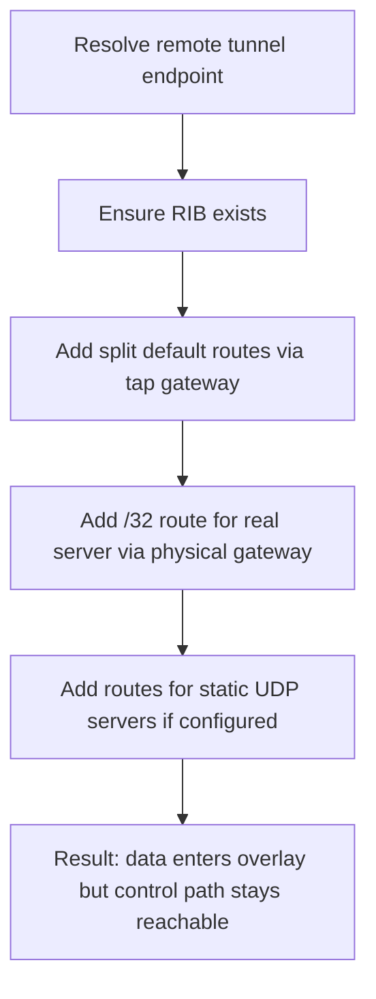
```mermaid
flowchart TD
    A[Resolve remote tunnel endpoint] --> B[Ensure RIB exists]
    B --> C[Add split default routes via tap gateway]
    C --> D[Add /32 route for real server via physical gateway]
    D --> E[Add routes for static UDP servers if configured]
    E --> F[Result: data enters overlay but control path stays reachable]
```

---

## 路由如何写进操作系统

客户端并不满足于只维护内部 RIB。它会把这些路由真正写进操作系统。

这件事由 `AddRoute()` 完成，之后由 `DeleteRoute()` 反向清理。

不同平台行为不同。

Windows 上，客户端会删除冲突默认路由，再把 `rib_` 全量写入系统，退出时再恢复原来的默认路由。

macOS 上，在非 promisc 模式下可能先删除旧默认路由，再安装 `rib_`，退出时再恢复原始默认路由。

Linux 上，客户端可以先发现所有默认路由，在合适条件下删除它们，再把 `rib_` 写到选定 interface name 上，并在退出时恢复保存过的默认路由。

三边的共同点是：路由安装和 tunnel 生命周期强绑定，不被当作永久静态系统配置。

| 平台 | 路由操作 | 冲突处理 | 退出恢复 |
|------|----------|----------|----------|
| Windows | 删除原 default route | 写入 `rib_` | 恢复原 default route |
| macOS | 可能删除旧 default | 写入 `rib_` | 恢复原始 default |
| Linux | 发现所有 default | 选择性删除 | 恢复保存的 default |

---

## 默认路由保护

`ProtectDefaultRoute()` 的存在本身就很说明问题。

OPENPPP2 不假设"加完路由以后系统状态永远不变"。它会启动一个专门的保护线程。只要客户端仍然存活且 route 已安装，每秒就检查一次条件是否仍然成立，然后尝试再次删除那些不该出现的默认路由。

这个逻辑在 Windows 上尤为明显，但它所体现的工程理念不只属于某个 OS：OPENPPP2 把 route correctness 当成需要持续维护的运行时条件，而不是一次性安装动作。

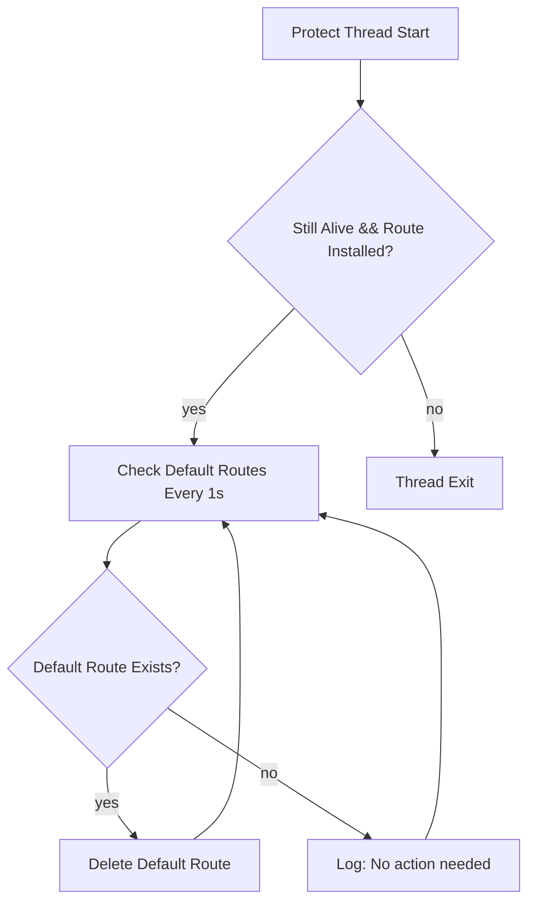
```mermaid
flowchart TD
    A[Protect Thread Start] --> B{Still Alive && Route Installed?}
    B -- yes --> C[Check Default Routes Every 1s]
    B -- no --> D[Thread Exit]
    C --> E{Default Route Exists?}
    E -- yes --> F[Delete Default Route]
    E -- no --> G[Log: No action needed]
    F --> C
    G --> C
```

---

## DNS 服务器路由钉住

最值得注意的实现细节之一，是 `AddRouteWithDnsServers()`。

客户端不仅为应用流量安装路由，也会为 resolver IP 自身安装路由。

这个函数会构造两组 DNS server 集合：

- 一组应该经由虚拟网卡侧到达
- 一组应该经由底层物理 NIC 到达

这些地址来源于：

- TUN 或 TAP 适配器当前 DNS 列表
- 底层 NIC 当前 DNS 列表
- 从 `dns_ruless_` 加载出来的 DNS rule target

函数会过滤无效、loopback、multicast、unspecified 以及"与本地子网同段不需要额外路由"的情况，再对两组去重，最后为每个 resolver IP 安装 `/32` 路由。

第一组 resolver 走 tap gateway。

第二组 resolver 走物理 gateway。

这正是代码层面最清楚的证据：DNS 路由本身就是 OPENPPP2 路由设计的一等公民。只有把 resolver 的可达路径也钉住，overlay 改写默认路由后 DNS policy 才不会失真。

`DeleteRouteWithDnsServers()` 在 teardown 时把这些 resolver-specific route 再全部删除，并清空缓存集合。

---

## Bypass 机制详解

Bypass 机制是 OPENPPP2 中用于让特定流量绕过 VPN 隧道、直接通过物理网络发送的机制。它是精细化流量控制的核心组成部分。

### Bypass 判定流程

Bypass 机制的判定遵循以下逻辑流程：

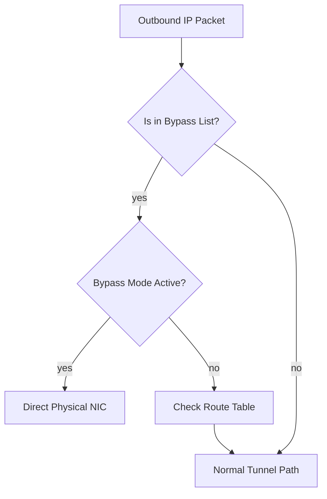
```mermaid
flowchart TD
    A[Outbound IP Packet] --> B{Is in Bypass List?}
    B -- yes --> C{Bypass Mode Active?}
    B -- no --> D[Normal Tunnel Path]
    C -- yes --> E[Direct Physical NIC]
    C -- no --> F[Check Route Table]
    F --> D
```

Bypass 判定在不同平台上的实现方式：

| 平台 | 判定方法 | 实现文件 |
|------|----------|----------|
| Android | 查 forwarding table, next hop == tap gateway | `VEthernetNetworkSwitcher.cpp` |
| Windows | 查系统 best interface, 比较 interface index | `VEthernetNetworkSwitcher.cpp` |
| Unix | 比较 best interface IP == tap IP | `VEthernetNetworkSwitcher.cpp` |

### Bypass IP-List 格式

Bypass IP-list 支持的格式包括：

| 格式 | 示例 | 说明 |
|------|------|------|
| 单 IP | `8.8.8.8` | 特定单个 IP |
| CIDR | `10.0.0.0/8` | 整个网段 |
| 域名 | `cdn.example.com` | 域名形式，客户端解析后添加 |
| 范围 | `192.168.1.1-192.168.1.255` | IP 范围 |

Bypass 列表的详细格式规范：

```
# Bypass IP-List 格式说明
# 每行一个条目，支持以下形式：

# 1. 直接 IP 地址 (仅 IPv4)
8.8.8.8
1.1.1.1

# 2. CIDR 表示法
10.0.0.0/8
172.16.0.0/12
192.168.0.0/16

# 3. 域名 (在运行时解析为 IP)
# 注意: 带域名的行会被动态解析
local.example.com

# 4. 保留格式前缀
# geo:CN - 中国大陆 IP
# asn:4134 - 中国电信 AS 号

# 完整示例文件 bypass.list:
8.8.8.8
1.1.1.1
10.0.0.0/8
192.168.0.0/16
172.16.0.0/12
```

### Bypass 配置示例

以下是几种常见的 bypass 配置场景：

```
# 场景 1: 保留本地网络访问
# 让 192.168.x.x 和 10.x.x.x 网段绕过 VPN
192.168.0.0/16
10.0.0.0/8

# 场景 2: 保留本地服务和网关
# 确保本地网关、DNS 等直连
192.168.1.1/32    # 本地网关
192.168.1.1/32    # 本地 DNS
192.168.1.254     # 本地 DHCP 服务器

# 场景 3: 保留特定游戏/应用服务器
# 某些游戏需要直连以获得最佳体验
# 格式: domain 或 IP
123.45.67.89
game-server.example.com

# 场景 4: 保留媒体 CDN
# 某些 CDN 直连更快
cdn.steamstatic.com
upcdn.netflix.com
```

Bypass 机制与 Policy 路由的关系：

| 机制 | 作用层级 | 优先级 | 说明 |
|------|----------|--------|------|
| Bypass | 网络层 | 最高 | 完全不走 tunnel |
| Policy | 应用层 | 中 | 按规则路由到特定 resolver |
| Global | 基础设施层 | 基础 | 默认 overlay 路径 |

---

## 客户端 DNS 规则模型

客户端 DNS 规则由 `LoadAllDnsRules(...)` 加载，具体解析在 `ppp/app/client/dns/Rule.cpp`。

解析器支持三种 host 匹配风格：

- 相对域名匹配
- 通过 `full:` 前缀指定的精确匹配
- 通过 `regexp:` 前缀指定的正则匹配

每一行规则至少需要两段：

- host expression
- resolver address

可选第三段会影响 `Nic` 标志。运行时随后根据这个标志，决定该 resolver IP 应该被放进"物理 NIC 可达集合"还是"虚拟侧可达集合"。

规则匹配顺序是明确的：

1. `full:` 精确匹配
2. regex 匹配
3. 相对域名匹配，通过 `Firewall::IsSameNetworkDomains(...)`

这意味着 DNS 规则不是松散叠加的一堆 pattern，而是有确定优先级的。

### DNS 策略表格式

DNS 策略表的标准格式为每行两到三列：

```
# 格式: host_expression resolver_address [Nic]
# 第一列: 主域名表达式
# 第二列: 使用的 DNS resolver IP
# 第三列(可选): Nic 标志 (physical 或 virtual)

# 基础格式示例:
google.com 8.8.8.8
facebook.com 1.1.1.1
youtube.com 8.8.4.4

# 带 Nic 标志的示例:
# 'physical' 表示 DNS resolver 走物理路径
full:api.google.com 8.8.8.8 physical
# 'virtual' 表示 DNS resolver 走虚拟路径
full:internal.corp.com 10.0.0.53 virtual

# 精确匹配示例:
full:metadata.googleusercontent.com 169.254.169.254 physical

# 正则表达式示例:
regexp:\.google\..*$ 8.8.8.8
regexp:\.baidu\.com$ 180.76.76.76
```

DNS 策略表的字段详细说明：

| 字段 | 位置 | 必填 | 说明 | 示例 |
|------|------|------|------|------|
| `host` | 第1列 | 是 | 域名匹配表达式 | `google.com` |
| `full:` | 第1列前缀 | 否 | 启用精确匹配 | `full:api.google.com` |
| `regexp:` | 第1列前缀 | 否 | 启用正则匹配 | `regexp:\.google\..*$` |
| `resolver` | 第2列 | 是 | DNS resolver IP | `8.8.8.8` |
| `Nic` | 第3列 | 否 | 网络接口类型 | `physical` / `virtual` |

### DNS 规则匹配优先级

DNS 规则的匹配优先级从高到低如下：

| 优先级 | 匹配类型 | 示例规则 | 说明 |
|--------|----------|---------|------|
| 1 | `full:` 精确匹配 | `full:api.google.com` | 完全一致才匹配 |
| 2 | `regexp:` 正则匹配 | `regexp:\.google\..*$` | 正则表达式匹配 |
| 3 | 相对域名匹配 | `google.com` | 作为后缀匹配 |
| 4 | 默认规则 | `*` | 所有未匹配的域名 |

每种匹配类型的详细说明：

```
匹配规则详细说明:

1. full: 精确匹配
   - 规则: full:api.google.com
   - 匹配: api.google.com
   - 不匹配: www.api.google.com

2. regexp: 正则匹配
   - 规则: regexp:\.google\.[a-z]+$
   - 匹配: www.google.com, mail.google.co.uk
   - 不匹配: google.com (没有子域名)

3. 相对域名匹配
   - 规则: google.com
   - 匹配: google.com, www.google.com, api.google.com
   - 不匹配: notgoogle.com

4. 通配符匹配
   - 规则: *
   - 匹配: 任何域名
   - 通常作为最后默认规则
```

---

## 客户端侧 DNS Redirect

客户端 DNS redirect 从 `VEthernetNetworkSwitcher::OnUdpPacketInput(...)` 进入，但真正的核心逻辑在 `RedirectDnsServer(...)`。

这条路径会做下面这些事。

第一，先解码 DNS message，拒绝格式错误的包。

第二，先查本地 `vdns` cache 的 `QueryCache2(...)`。如果命中，则直接重新编码 DNS answer，并通过 `DatagramOutput(...)` 注回本地数据路径，完全不访问上游 resolver。

第三，如果这个 DNS 包原本是发给虚拟 gateway 的，则客户端选用当前 `vdns` server 列表里的第一个地址作为上游目标。

第四，否则根据查询域名匹配 DNS rule，选择 rule 指定的 resolver address。但如果 rule 的 resolver 正好等于当前目标地址，则拒绝，避免无意义递归。

第五，打开 UDP socket，必要时在 Linux 下结合 `IsBypassIpAddress(...)` 和 `ProtectorNetwork` 对 socket 做保护绑定，把 DNS 请求发出去，启动超时定时器，等待响应，再把响应通过 `DatagramOutput(...)` 回送本地。

所以客户端 DNS redirect 绝不是简单的"换个 DNS 发出去"，而是同时具备：

- 域名感知
- 本地缓存感知
- 路由感知
- protect-mode 感知
- 与本地 UDP reinjection 路径统一

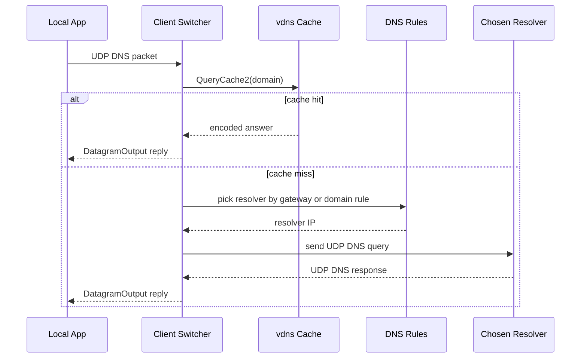
```mermaid
sequenceDiagram
    participant App as Local App
    participant Sw as Client Switcher
    participant Cache as vdns Cache
    participant Rule as DNS Rules
    participant Up as Chosen Resolver
    App->>Sw: UDP DNS packet
    Sw->>Cache: QueryCache2(domain)
    alt cache hit
        Cache-->>Sw: encoded answer
        Sw-->>App: DatagramOutput reply
    else cache miss
        Sw->>Rule: pick resolver by gateway or domain rule
        Rule-->>Sw: resolver IP
        Sw->>Up: send UDP DNS query
        Up-->>Sw: UDP DNS response
        Sw-->>App: DatagramOutput reply
    end
```

---

## 客户端 DNS 缓存如何回灌

`DatagramOutput(...)` 是客户端把 UDP reply 重新注回虚拟网卡路径的出口。

当 `caching` 标志为真，且目标端口是 DNS 时，该函数还会先通过 `vdns::AddCache(...)` 把 DNS packet 写入本地 cache，再把 UDP frame 转回 IP packet 并输出。

所以客户端 DNS cache 并不是脱离数据平面的独立系统，而是在同一个 reinjection 出口与数据路径汇合。

---

## 服务端 DNS 路径

一旦 DNS 流量到达服务端，核心决策函数就是 `VirtualEthernetExchanger::SendPacketToDestination(...)`。

当目标端口是 53 时，服务端会依次做：

1. 提取查询域名
2. 记录 DNS 日志
3. 执行 firewall domain 检查
4. 通过 `VirtualEthernetDatagramPort::NamespaceQuery(...)` 先查 namespace cache
5. 如果 cache 没处理，再尝试 `RedirectDnsQuery(...)`
6. 如果仍未处理，才走普通 UDP datagram port 转发

因此这不是"普通 UDP send 加一点日志"的路径，而是一条分层决策栈。

---

## Namespace Cache 的设计

服务端 namespace cache 由 `VirtualEthernetNamespaceCache` 实现。

它的设计并不复杂，但很有效。

每个 cache key 由三部分构成：

- query type
- query class
- domain

拼接格式是 `TYPE:<type>|CLASS:<class>|DOMAIN:<domain>`。

每个 entry 保存：

- 编码后的 DNS response bytes
- response length
- 基于 TTL 计算出的过期时间

内部结构是 hash table 加 linked list。`Update()` 会从链表头开始清理过期项。`Get()` 取出缓存响应时，还会把 DNS transaction id 改写成当前请求的 id。

这一点非常关键。如果不重写 trans id,cache replay 就不是一个行为正确的 DNS 响应。

---

## 服务端 Cache Lookup 如何工作

`VirtualEthernetDatagramPort::NamespaceQuery(...)` 实际上有两种用法。

第一种接受一个原始 DNS response packet，并把它写入 namespace cache。这个分支用于服务端后来从真实上游或 redirect path 收到 DNS answer 时，把结果缓存起来。

第二种接受 domain、query type、query class，并尝试直接用 cache 回答当前客户端请求。如果命中，就把答案通过以下任一路径送回客户端：

- 普通 tunnel 路径上的 `DoSendTo(...)`
- static path 上的 `VirtualEthernetDatagramPortStatic::Output(...)`

因此 namespace cache 是 normal UDP path 和 static UDP path 共用的。

---

## 服务端 DNS Redirect

如果 cache 没命中，且配置了 `configuration->udp.dns.redirect`，服务端就会进入 `RedirectDnsQuery(...)`。

这个函数要么直接使用 switcher 已经解析好的 redirect endpoint，要么异步解析配置里的 redirect hostname。

随后 `INTERNAL_RedirectDnsQuery(...)` 会打开 UDP socket，把 DNS packet 发给 redirect resolver，异步等待响应并带超时保护，拿到响应后再发回客户端。

返回客户端的路径取决于上下文。

如果请求来自 static transit，则通过 `VirtualEthernetDatagramPortStatic::Output(...)` 返回。

否则通过普通 tunnel 上的 `DoSendTo(...)` 返回。

如果启用了 DNS cache，服务端在转发响应后还会把该 answer 再写入 namespace cache。

因此 redirect DNS 不只是一次转发决策，它还是 shared namespace cache 的一个生产者。

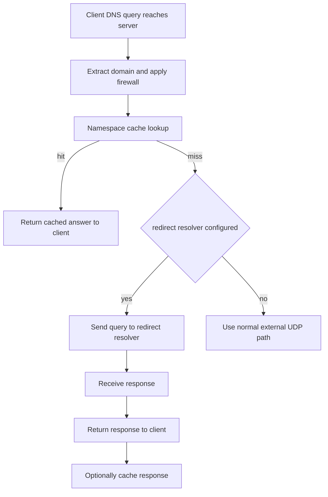
```mermaid
flowchart TD
    A[Client DNS query reaches server] --> B[Extract domain and apply firewall]
    B --> C[Namespace cache lookup]
    C -->|hit| D[Return cached answer to client]
    C -->|miss| E{redirect resolver configured}
    E -- yes --> F[Send query to redirect resolver]
    F --> G[Receive response]
    G --> H[Return response to client]
    H --> I[Optionally cache response]
    E -- no --> J[Use normal external UDP path]
```

---

## 普通 DNS 响应也会进入 Cache

namespace cache 并不只由 redirect path 填充。

`VirtualEthernetDatagramPort` 和 `VirtualEthernetDatagramPortStatic` 都包含逻辑：当收到 DNS response，且 `udp.dns.cache` 开启时，把它写进 namespace cache。

因此 cache 的数据来源可能是：

- 普通外部 DNS 转发
- redirect DNS 转发
- static-path DNS 转发

这让 cache 不只服务某一条路径，而是对整个服务端 DNS 体系都有效。

---

## 完整流量分类流程图

以下是一个完整的流量分类流程图，展示了从客户端到服务端的完整决策路径：

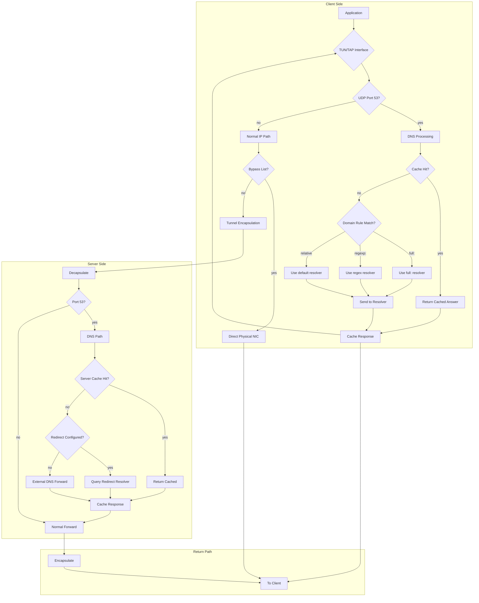
```mermaid
flowchart TD
    subgraph "Client Side"
        A[Application] --> B{TUN/TAP Interface}
        B --> C{UDP Port 53?}
        
        C -->|yes| D[DNS Processing]
        C -->|no| E[Normal IP Path]
        
        D --> D1{Cache Hit?}
        D1 -->|yes| D2[Return Cached Answer]
        D1 -->|no| D3{Domain Rule Match?}
        
        D3 -->|full:| D4[Use full: resolver]
        D3 -->|regexp:| D5[Use regex resolver]
        D3 -->|relative| D6[Use default resolver]
        
        D4 --> D7[Send to Resolver]
        D5 --> D7
        D6 --> D7
        D7 --> D8[Cache Response]
        D2 --> D8
        D8 --> B
        
        E --> E1{Bypass List?}
        E1 -->|yes| E2[Direct Physical NIC]
        E1 -->|no| E3[Tunnel Encapsulation]
    end
    
    subgraph "Server Side"
        E3 --> F[Decapsulate]
        F --> G{Port 53?}
        
        G -->|yes| H[DNS Path]
        G -->|no| I[Normal Forward]
        
        H --> H1{Server Cache Hit?}
        H1 -->|yes| H2[Return Cached]
        H1 -->|no| H3{Redirect Configured?}
        
        H3 -->|yes| H4[Query Redirect Resolver]
        H3 -->|no| H5[External DNS Forward]
        
        H2 --> H6[Cache Response]
        H4 --> H6
        H5 --> H6
        H6 --> I
    end
    
    subgraph "Return Path"
        I --> J[Encapsulate]
        J --> K[To Client]
        D8 --> K
        E2 --> K
    end
```

---

## DNS 完整流程图

以下是 DNS 查询从客户端到服务端的完整生命周期流程图：

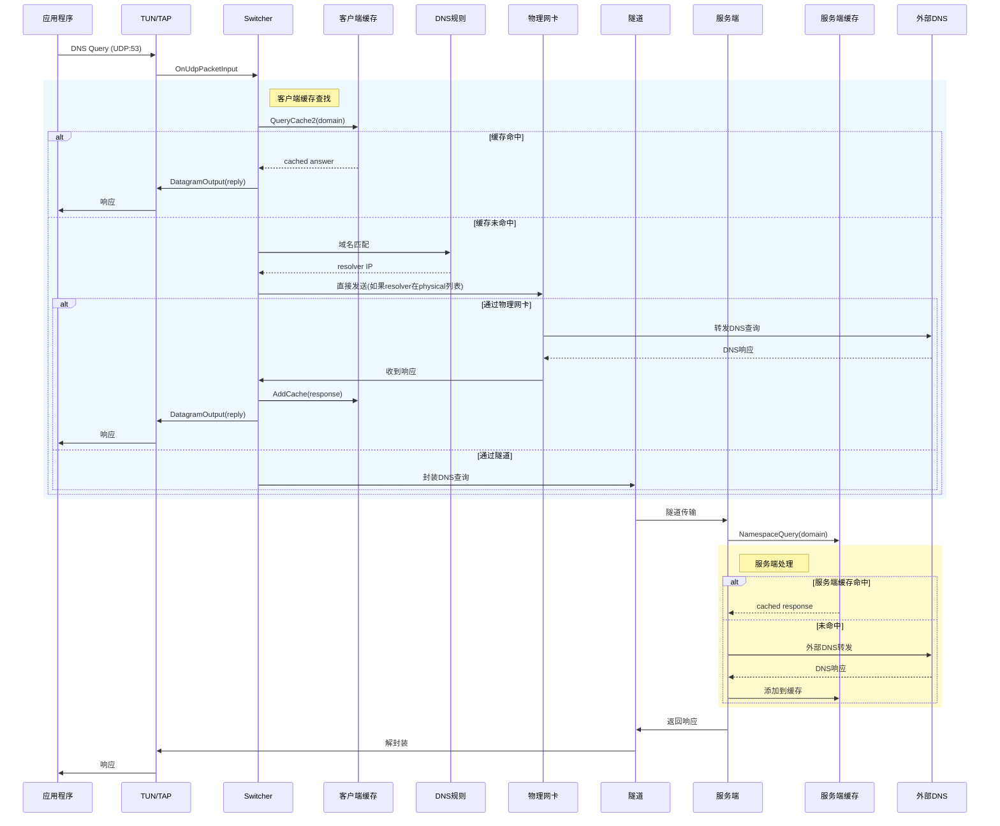
```mermaid
sequenceDiagram
    participant App as 应用程序
    participant TUN as TUN/TAP
    participant SW as Switcher
    participant Cache as 客户端缓存
    participant Rule as DNS规则
    participant NIC as 物理网卡
    participant Tunnel as 隧道
    participant Srv as 服务端
    participant SCache as 服务端缓存
    participant ExtDNS as 外部DNS

    App->>TUN: DNS Query (UDP:53)
    TUN->>SW: OnUdpPacketInput
    
    rect rgb(240, 248, 255)
        note right of SW: 客户端缓存查找
        SW->>Cache: QueryCache2(domain)
        alt 缓存命中
            Cache-->>SW: cached answer
            SW->>TUN: DatagramOutput(reply)
            TUN->>App: 响应
        else 缓存未命中
            SW->>Rule: 域名匹配
            Rule-->>SW: resolver IP
            SW->>NIC: 直接发送(如果resolver在physical列表)
            alt 通过物理网卡
                NIC->>ExtDNS: 转发DNS查询
                ExtDNS-->>NIC: DNS响应
                NIC->>SW: 收到响应
                SW->>Cache: AddCache(response)
                SW->>TUN: DatagramOutput(reply)
                TUN->>App: 响应
            else 通过隧道
                SW->>Tunnel: 封装DNS查询
            end
        end
    end

    Tunnel->>Srv: 隧道传输
    Srv->>SCache: NamespaceQuery(domain)
    
    rect rgb(255, 250, 205)
        note right of Srv: 服务端处理
        alt 服务端缓存命中
            SCache-->>Srv: cached response
        else 未命中
            Srv->>ExtDNS: 外部DNS转发
            ExtDNS-->>Srv: DNS响应
            Srv->>SCache: 添加到缓存
        end
    end
    
    Srv->>Tunnel: 返回响应
    Tunnel->>TUN: 解封装
    TUN->>App: 响应
```

---

## 配置示例

以下是几个完整的配置示例，涵盖不同场景。

### 基础客户端配置

```json
{
    "tunnel": {
        "interface": "tun0",
        "address": "10.0.0.2",
        "netmask": "255.255.255.0",
        "mtu": 1500
    },
    "route": {
        "global": {
            "split": true,
            "default_via": "tun0"
        },
        "policy": {
            "ip_list": "/path/to/policy.txt",
            "bypass": "/path/to/bypass.txt"
        }
    },
    "dns": {
        "server": [
            "10.0.0.1",
            "1.1.1.1"
        ],
        "cache": true,
        "cache_size": 1000
    }
}
```

对应的路由表输出：

```bash
# 基础路由表
10.0.0.0/24    -> tun0      # 本地子网
0.0.0.0/1       -> tun0      # split default
128.0.0.0/1      -> tun0      # split default
0.0.0.0/0        -> eth0     # 默认路由(删除后保留)
```

### Policy 路由配置

Policy 路由配置文件示例 (`/path/to/policy.txt`)：

```
# Policy IP-List 格式
# 每行一个 CIDR 或域名

# 中国大陆地址段
103.0.0.0/8
123.0.0.0/6
182.0.0.0/8
221.0.0.0/8
222.0.0.0/8
58.0.0.0/8
60.0.0.0/8
116.0.0.0/8
117.0.0.0/8
119.0.0.0/8
120.0.0.0/8
121.0.0.0/8
122.0.0.0/8
124.0.0.0/8
125.0.0.0/8
175.0.0.0/8
180.0.0.0/8
202.0.0.0/8
203.0.0.0/8
210.0.0.0/8
218.0.0.0/8
220.0.0.0/8
223.0.0.0/8
```

Policy 路由配置解析后的路由状态：

| 目标网络 | Next Hop | 用途 |
|----------|---------|------|
| `103.0.0.0/8` | tun0 | 中国电信 |
| `182.0.0.0/8` | tun0 | 中国移动 |
| `58.0.0.0/8` | tun0 | 中国联通 |
| 其他外网 | tunnel | 默认 overlay |

### Smart 路由配置

Smart 路由配置文件示例：

```
# Smart 路由配置
# 格式: domain|[node1],[node2],...
# 支持自动故障切换

# Google 生态 (多个节点)
google.com|1.1.1.1|8.8.8.8|cloudflare|dns.google
youtube.com|1.1.1.1|8.8.8.8
facebook.com|1.0.0.1|8.8.4.4
twitter.com|1.0.0.1|8.8.4.4
instagram.com|1.0.0.1|8.8.4.4

# 动态检测配置
health_check_interval: 30
timeout_ms: 5000
max_retries: 3
fallback: true
```

Smart 路由的自动切换逻辑：

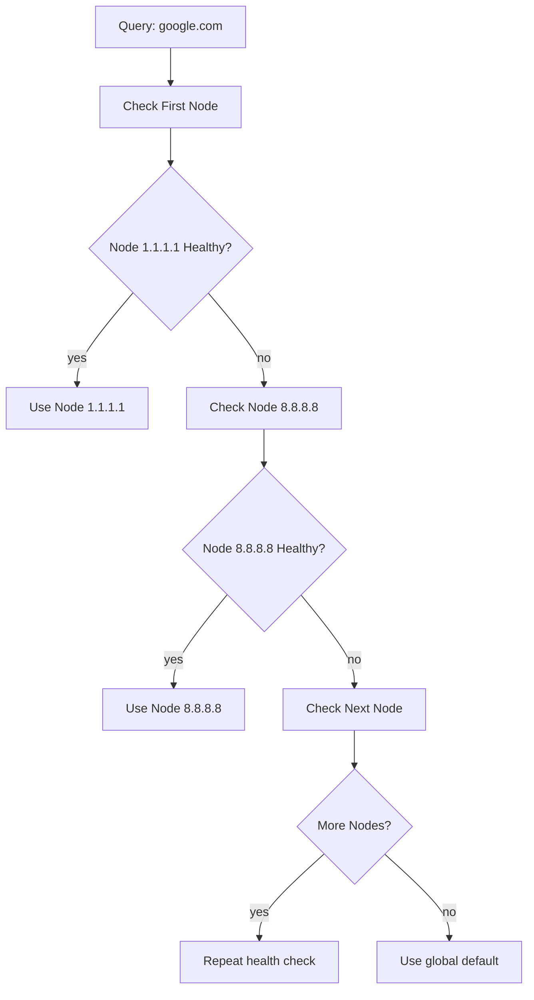
```mermaid
flowchart TD
    A[Query: google.com] --> B[Check First Node]
    B --> C{Node 1.1.1.1 Healthy?}
    C -- yes --> D[Use Node 1.1.1.1]
    C -- no --> E[Check Node 8.8.8.8]
    E --> F{Node 8.8.8.8 Healthy?}
    F -- yes --> G[Use Node 8.8.8.8]
    F -- no --> H[Check Next Node]
    H --> I{More Nodes?}
    I -- yes --> J[Repeat health check]
    I -- no --> K[Use global default]
```

### DNS 规则配置

DNS 规则配置文件示例：

```
# DNS 规则配置文件
# 格式: host_expression resolver_address [Nic]
# 默认 Nic 为 virtual

# 精确匹配
full:api.openai.com 172.217.0.0/16 virtual
full:auth0.com 172.217.0.0/16 virtual

# 正则匹配
regexp:\.googleusercontent\.com$ 172.217.0.0/16 virtual
regexp:\google\.[a-z]+$ 8.8.8.8 virtual
regexp:\.baidu\.com$ 180.76.76.76 virtual

# 域名匹配 (相对匹配)
openai.com 8.8.8.8 virtual
chat.openai.com 8.8.8.8 virtual
google.com 1.1.1.1 virtual

# 直连 DNS 服务器
cdn.jsdelivr.net 1.12.12.12 physical
github.com 8.8.8.8 virtual

# 默认resolver
* 223.5.5.5 virtual
```

DNS 规则匹配流程：

```mermaid
flowchart TD
    A[Query: api.google.com] --> B{Exact Match?}
    B -->|full:api.google.com| C[Return 172.217.0.0/16]
    B -->|no| D{Regex Match?}
    D -->|regexp:\.google\..*$| E[Return 8.8.8.8]
    D -->|no| F{Relative Match?}
    F -->|google.com| G[Return 1.1.1.1]
    F -->|no| H[Return default (*)]
```

### 完整生产环境配置

以下是覆盖大多数生产场景的完整配置：

```json
{
    "client": {
        "tunnel": {
            "type": "tun",
            "interface": "openppp2",
            "address": "10.8.0.2",
            "netmask": "255.255.255.0",
            "mtu": 1400,
            "dns": [
                "10.8.0.1",
                "223.5.5.5"
            ]
        },
        "remote": {
            "host": "vpn.example.com",
            "port": 443,
            "protocol": "wireguard"
        },
        "route": {
            "global": {
                "split": true,
                "exclude_tunnel_server": true,
                "default_gateway": "10.8.0.1"
            },
            "policy": {
                "ip_list": "/etc/openppp2/china_ip.txt",
                "ip_list_url": "https://example.com/china_ip.txt",
                "bypass_list": [
                    "192.168.0.0/16",
                    "10.0.0.0/8",
                    "172.16.0.0/12"
                ],
                "bypass_list_file": "/etc/openppp2/bypass.txt"
            },
            "smart": {
                "enabled": true,
                "check_interval": 30,
                "health_check": true
            }
        },
        "dns": {
            "rules": "/etc/openppp2/dns_rules.txt",
            "local_cache": {
                "enabled": true,
                "max_entries": 10000,
                "ttl": 3600
            },
            "redirect": {
                "enabled": true,
                "default": "223.5.5.5"
            }
        },
        "protection": {
            "default_route": {
                "enabled": true,
                "check_interval": 1
            },
            "dns_server": {
                "enabled": true,
                "pin_to_physical": [
                    "223.5.5.5",
                    "119.29.29.29"
                ]
            }
        }
    },
    "server": {
        "tunnel": {
            "address": "10.8.0.1",
            "netmask": "255.255.255.0"
        },
        "dns": {
            "cache": {
                "enabled": true,
                "max_entries": 50000,
                "ttl_min": 300,
                "ttl_max": 86400
            },
            "redirect": {
                "enabled": true,
                "resolver": "223.5.5.5",
                "fallback": [
                    "119.29.29.29",
                    "114.114.114.114"
                ]
            },
            "override": {
                "enabled": false
            }
        },
        "firewall": {
            "domain_rules": []
        }
    }
}
```

对应的路由表结构：

```
+--------------------------------------------------+
|                 路由表结构                       |
+--------------------------------------------------+
| 优先级 | 目标网络        | 类型       | Next Hop |
|--------|-----------------|------------|----------|
| 0      | 10.8.0.0/24    | Local      | direct   |
| 1      | 103.0.0.0/8    | Policy     | tun0     |
| 2      | 182.0.0.0/8    | Policy     | tun0     |
| 3      | 58.0.0.0/8     | Policy     | tun0     |
| ...    | ...            | ...        | ...      |
| N      | 0.0.0.0/1      | Global     | tun0     |
| N+1    | 128.0.0.0/1    | Global     | tun0     |
| M      | 1.2.3.4/32     | Bypass     | eth0     |
| X      | 223.5.5.5/32   | DNS-Phys   | eth0     |
+--------------------------------------------------+
```

---

## 运维层面的直接后果

从这套实现可以直接得到几个结论。

第一，客户端 route model 不只是前缀匹配，还包括"控制面地址必须走正确一侧""resolver 地址自身必须走正确一侧"。

第二，split routing 不是单一功能，而是由 IP-list、remote-endpoint pinning、default-route 改写、运行时 bypass 判定、resolver route pinning 共同形成的结果。

第三，DNS 在客户端和服务端两边都是强策略感知的。客户端可按规则本地解决或重定向，服务端可从 cache 直接回答、转发到 redirect resolver，或按普通外部网络转发。

第四，cache 本身就是数据平面的一部分。DNS cache hit 最终也是通过 normal tunnel 或 static channel 回给客户端。

第五，route correctness 被当成持续运行时条件，而不是一次性安装动作。默认路由保护线程已经足够说明这一点。

---

## 建议源码阅读顺序

如果要继续顺着源码读，最有效的顺序是：

1. `VEthernetNetworkSwitcher::AddLoadIPList(...)`
2. `VEthernetNetworkSwitcher::LoadAllIPListWithFilePaths(...)`
3. `VEthernetNetworkSwitcher::AddRemoteEndPointToIPList(...)`
4. `VEthernetNetworkSwitcher::AddRoute()` 与 `DeleteRoute()`
5. `VEthernetNetworkSwitcher::AddRouteWithDnsServers()`
6. `VEthernetNetworkSwitcher::ProtectDefaultRoute()`
7. `ppp/app/client/dns/Rule.cpp`
8. `VEthernetNetworkSwitcher::RedirectDnsServer(...)`
9. `VirtualEthernetExchanger::SendPacketToDestination(...)`
10. `VirtualEthernetNamespaceCache.cpp`

---

## 路由策略表扩展详解

### Global 路由表完整解析

Global 路由表是整个路由系统的基础骨架，它定义了默认情况下的流量行为。理解 Global 路由表的工作原理对于调优 OPENPPP2 的性能至关重要。

#### Split Default Route 的技术原理

OPENPPP2 采用 split default route 而不是单一 default route 的原因在于兼容性考虑。在大多数操作系统中，只能存在一条默认路由，而 split default route 通过把 `0.0.0.0/0` 拆分成 `0.0.0.0/1` 和 `128.0.0.0/1` 两段，可以实现更精细的控制。

```
传统默认路由方式:
0.0.0.0/0 -> tun0  (会覆盖所有 IPv4 流量)

OPENPPP2 Split 方式:
0.0.0.0/1  -> tun0   (下半段: 0.0.0.0 - 127.255.255.255)
128.0.0.0/1 -> tun0   (上半段: 128.0.0.0 - 255.255.255.255)
```

这种方式的优点包括:

1. 可以为 tunnel server 添加独立 `/32` 路由而不产生冲突
2. 可以精确控制哪些网段走 overlay，哪些走物理网络
3. 避免了 single point of failure，某一侧失效不影响另一侧
4. 与系统中原有默认路由共存，便于恢复

#### Global 路由表优先级排序

在 OPENPPP2 中，路由优先级由具体到泛化，精确网段优先于大类网段：

| 优先级 | 目标网段 | Next Hop | 类型 | 说明 |
|--------|----------|---------|------|------|
| 1 | `10.8.0.2/32` | `direct` | Local | 本地 tunnel IP |
| 2 | `10.8.0.0/24` | `direct` | Local | 本地子网 |
| 3 | `1.2.3.4/32` | `eth0` | Exception | Tunnel Server |
| 4 | `223.5.5.5/32` | `eth0` | DNS Server | DNS 直连 |
| 5 | `192.168.0.0/16` | `eth0` | Bypass | 本地网络 |
| 6 | `10.0.0.0/8` | `eth0` | Bypass | 内网段 |
| 7 | `103.0.0.0/8` | `tun0` | Policy |  Policy 路由 |
| 8 | `0.0.0.0/1` | `tun0` | Global | 全局 Split |
| 9 | `128.0.0.0/1` | `tun0` | Global | 全局 Split |

### Policy 路由表完整字段说明

Policy 路由表支持更加精细的流量分类，每个字段都有其特定用途：

#### 字段类型详解

| 字段名 | 数据类型 | 必填 | 默认值 | 说明 |
|--------|----------|------|--------|------|
| `host` | string | 是 | 无 | 域名匹配表达式 |
| `target` | string | 否 | 无 | 可选的目标地址 |
| `resolver` | string | 是 | 无 | DNS 解析器地址 |
| `Nic` | string | 否 | `virtual` | 网络接口类型 |
| `proxy` | boolean | 否 | `false` | 是否启用代理 |
| `tcp` | boolean | 否 | `false` | 是否处理 TCP DNS |
| `fallback` | string | 否 | 无 | 备用 resolver |

#### 高级匹配模式

```
# 高级域名匹配示例

# 1. 精确匹配 - 完全一致
full:api.google.com 8.8.8.8
full:www.facebook.com 1.1.1.1

# 2. 域名通配 - 任意子域名
*.google.com 8.8.8.8
*.baidu.com 180.76.76.76

# 3. 正则表达式 - 灵活匹配
regexp:.*\.google\.[a-z]{2,}$ 8.8.8.8
regexp:^mail\..*$ 8.8.4.4

# 4. 多级后缀匹配
com 8.8.8.8                     # 匹配所有 .com 域名
google.com 8.8.4.4              # 匹配 google.com 及其子域名
```

### Smart 路由表健康检测机制

Smart 路由表的核心是健康检测机制，它定期检查��个可用节点的可用性：

#### 健康检测参数详解

| 参数 | 说明 | 默认值 | 可选范围 |
|------|------|--------|----------|
| `interval` | 健康检测间隔 (秒) | 30 | 5-300 |
| `timeout` | 单次检测超时 (毫秒) | 5000 | 1000-30000 |
| `retries` | 失败重试次数 | 3 | 1-10 |
| `threshold` | 失败阈值 (次数) | 3 | 1-20 |
| `window` | 统计窗口 (秒) | 300 | 60-3600 |

#### 健康检测状态机

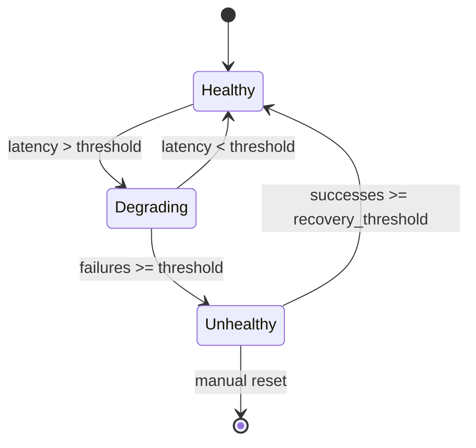
```mermaid
stateDiagram-v2
    [*] --> Healthy
    Healthy --> Degrading: latency > threshold
    Degrading --> Healthy: latency < threshold
    Degrading --> Unhealthy: failures >= threshold
    Unhealthy --> Healthy: successes >= recovery_threshold
    Unhealthy --> [*]: manual reset
```

---

## DNS 策略表扩展详解

### DNS 规则完整格式规范

每行 DNS 规则的完整格式如下：

```
# 完整格式
host_expression [target_ip] resolver_address [Nic] [tcp] [fallback:resolver]

# 字段说明
# host_expression: 域名匹配表达式
# target_ip: 可选的目标翻译 IP
# resolver_address: DNS 解析器地址
# Nic: 网络接口类型 (physical/virtual)
# tcp: 是否使用 TCP (true/false)
# fallback: 备用解析器
```

#### 完整示例

```
# 完整 DNS 规则文件示例

# 精确域名匹配 + 目标 IP 翻译
full:api.google.com 172.217.14.206 8.8.8.8 virtual
full:api.openai.com 172.217.1.1 8.8.8.8 virtual

# 正则匹配 + TCP 强制
regexp:\.googleusercontent\.com$ 172.217.0.0/16 8.8.8.8 virtual tcp=true

# 域名匹配 + 物理路径
*.microsoft.com 8.8.4.4 physical
*.apple.com 1.1.1.1 physical

# 带 fallback 的规则
google.com 8.8.8.8 virtual fallback:1.1.1.1
facebook.com 1.1.1.1 physical fallback:8.8.4.4

# 默认规则
* 223.5.5.5 virtual fallback:119.29.29.29
```

### DNS 缓存机制详解

#### 客户端 DNS 缓存

客户端 DNS 缓存位于虚拟网卡层面，它会缓存 DNS 查询结果以减少重复查询：

| 参数 | 说明 | 默认值 | 配置方式 |
|------|------|--------|----------|
| `enabled` | 是否启用 | true | `dns.cache.enabled` |
| `max_entries` | 最大条目数 | 10000 | `dns.cache.max_entries` |
| `ttl` | 默认 TTL (秒) | 3600 | `dns.cache.ttl` |
| `min_ttl` | 最小 TTL | 60 | `dns.cache.ttl_min` |
| `max_ttl` | 最大 TTL | 86400 | `dns.cache.ttl_max` |

#### 缓存查找流程

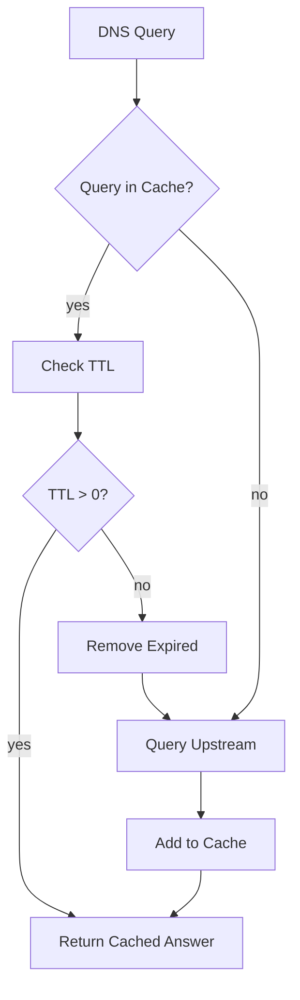
```mermaid
flowchart TD
    A[DNS Query] --> B{Query in Cache?}
    B -->|yes| C[Check TTL]
    C --> D{TTL > 0?}
    D -->|yes| E[Return Cached Answer]
    D -->|no| F[Remove Expired]
    F --> G[Query Upstream]
    B -->|no| G
    G --> H[Add to Cache]
    H --> E
```

#### 服务端 DNS 缓存

服务端 namespace cache 存储更大量级的 DNS 响应：

| 参数 | 说明 | 默认值 | 配置方式 |
|------|------|--------|----------|
| `enabled` | 是否启用 | true | `server.dns.cache.enabled` |
| `max_entries` | 最大条目数 | 50000 | `server.dns.cache.max_entries` |
| `ttl_min` | 最小 TTL | 300 | `server.dns.cache.ttl_min` |
| `ttl_max` | 最大 TTL | 86400 | `server.dns.cache.ttl_max` |
| `cleanup_interval` | 清理间隔 | 60 | `server.dns.cache.cleanup_interval` |

### DNS 规则匹配算法

#### 匹配优先级详解

```
DNS 规则匹配算法伪代码:

function resolve_domain(domain):
    1. 检查缓存
       if cached: return cached_answer
    
    2. full: 精确匹配
       for rule in rules:
           if rule.type == "full" and domain == rule.host:
               return rule.resolver
    
    3. regexp: 正则匹配
       for rule in rules:
           if rule.type == "regexp" and re.match(rule.pattern, domain):
               return rule.resolver
    
    4. 相对域名匹配
       for rule in rules:
           if domain.endswith(rule.host) or domain == rule.host:
               return rule.resolver
    
    5. 通配��匹配
       for rule in rules:
           if rule.host == "*":
               return rule.resolver
    
    6. 返回系统默认 DNS
       return system_default_resolver
```

#### 域名分组匹配

OPENPPP2 支持域名分组匹配，这允许将相关域名归为一组：

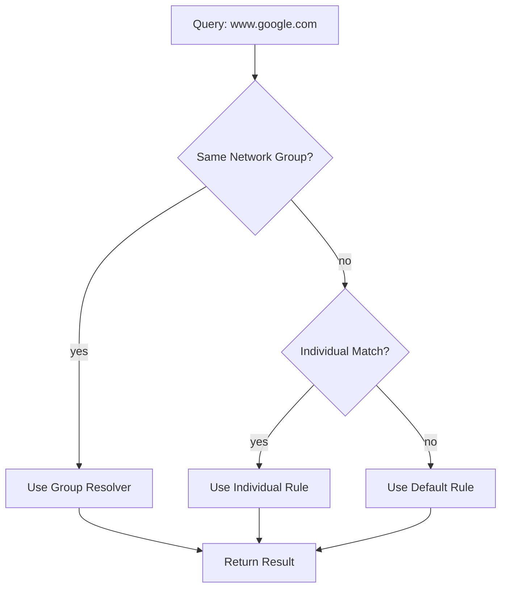
```mermaid
flowchart TD
    A[Query: www.google.com] --> B{Same Network Group?}
    B -->|yes| C[Use Group Resolver]
    B -->|no| D{Individual Match?}
    C --> E[Return Result]
    D -->|yes| F[Use Individual Rule]
    D -->|no| G[Use Default Rule]
    F --> E
    G --> E
```

---

## Bypass 机制扩展详解

### Bypass 与 Policy 的协同工作

Bypass 机制与 Policy 路由协同工作，形成完整的流量分类体系：

#### 协同工作流程

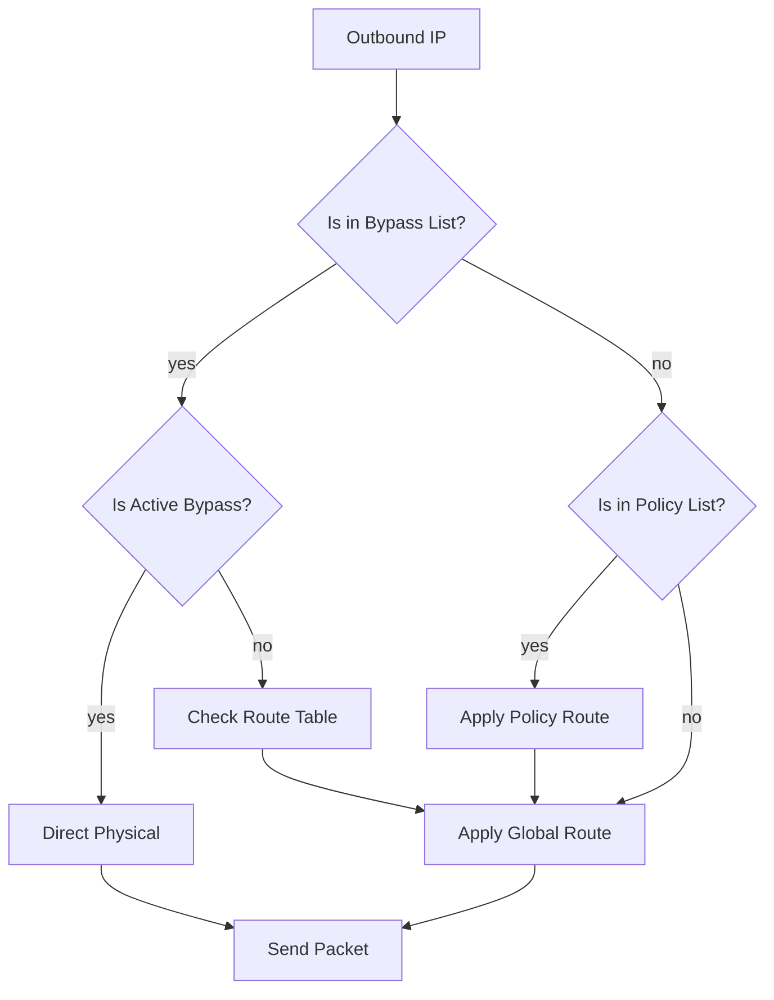
```mermaid
flowchart TD
    A[Outbound IP] --> B{Is in Bypass List?}
    B -->|yes| C{Is Active Bypass?}
    B -->|no| D{Is in Policy List?}
    
    C -->|yes| E[Direct Physical]
    C -->|no| F[Check Route Table]
    
    D -->|yes| G[Apply Policy Route]
    D -->|no| H[Apply Global Route]
    
    E --> I[Send Packet]
    F --> H
    G --> H
    H --> I
```

### 平台特定的 Bypass 实现

#### Android Bypass 实现

在 Android 上，bypass 通过以下方式实现：

| 方法 | 说明 | 代码位置 |
|------|------|----------|
| `forwarding table lookup` | 查找转发表 | `VEthernetNetworkSwitcher.cpp` |
| `route matching` | 路由匹配 | Android Kernel Netfilter |
| `socket mark` |  socket 标记 | Android VPN Service |

```cpp
// Android bypass 判定伪代码
bool IsBypassIpAddress(const IPAddress& ip) {
    // 查 forwarding table
    auto& fib = GetForwardingTable();
    auto it = fib.find(ip);
    if (it != fib.end()) {
        // 检查 next hop 是否为 tap gateway
        return it->second.gateway == tap_gateway_;
    }
    
    // 查系统路由表
    auto best_route = GetSystemBestRoute(ip);
    return best_route.interface == physical_nic_;
}
```

#### Windows Bypass 实现

在 Windows 上，bypass 通过以下方式实现：

| 方法 | 说明 | 代码位置 |
|------|------|----------|
| `GetBestInterfaceEx` | 获取最佳出口 | Windows API |
| `iphlpapi.dll` | 网络接口 API | `VEthernetNetworkSwitcher.cpp` |
| `MIB_IPFORWARDROW` | 路由表结构 | Windows Network Stack |

```cpp
// Windows bypass 判定伪代码
bool IsBypassIpAddress(const IPAddress& ip) {
    // 获取系统最佳出口接口
    DWORD interface_index;
    if (GetBestInterfaceEx(ip, &interface_index) != NO_ERROR) {
        return false;
    }
    
    // 比较接口索引
    return interface_index != tunnel_interface_index_;
}
```

#### macOS/iOS Bypass 实现

在 Unix 类系统上，bypass 实现方式：

| 方法 | 说明 | 代码位置 |
|------|------|----------|
| `getifaddrs` | 获取网络接口 | BSD API |
| `getBestRoute` | 获取最佳路由 | `VEthernetNetworkSwitcher.cpp` |
| `routing socket` | 路由套接字 | Unix Network Stack |

```cpp
// Unix bypass 判定伪代码
bool IsBypassIpAddress(const IPAddress& ip) {
    // 获取最佳路由
    struct rtmsg rt;
    auto best gateway = getBestRoute(ip);
    
    // 比较网关 IP
    return best_gateway.ip == physical_gateway_ip_;
}
```

---

## 流量分类流程图扩展

### 完整数据包处理流程

以下图表展示了完整的数据包处理流程：

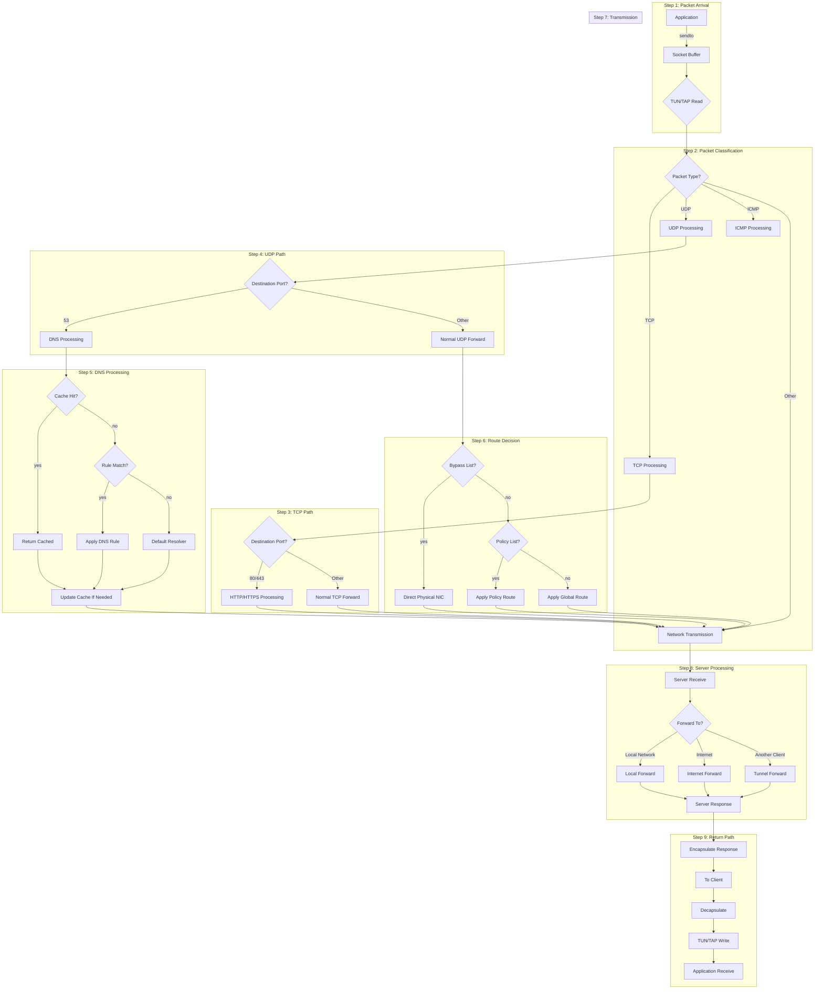
```mermaid
flowchart TD
    subgraph "Step 1: Packet Arrival"
        A[Application] -->|sendto| B[Socket Buffer]
        B --> C{TUN/TAP Read}
    end
    
    subgraph "Step 2: Packet Classification"
        C --> D{Packet Type?}
        D -->|TCP| E[TCP Processing]
        D -->|UDP| F[UDP Processing]
        D -->|ICMP| G[ICMP Processing]
        D -->|Other| H[Drop/Log]
    end
    
    subgraph "Step 3: TCP Path"
        E --> E1{Destination Port?}
        E1 -->|80/443| E2[HTTP/HTTPS Processing]
        E1 -->|Other| E3[Normal TCP Forward]
    end
    
    subgraph "Step 4: UDP Path"
        F --> F1{Destination Port?}
        F1 -->|53| F2[DNS Processing]
        F1 -->|Other| F3[Normal UDP Forward]
    end
    
    subgraph "Step 5: DNS Processing"
        F2 --> F4{Cache Hit?}
        F4 -->|yes| F5[Return Cached]
        F4 -->|no| F6{Rule Match?}
        F6 -->|yes| F7[Apply DNS Rule]
        F6 -->|no| F8[Default Resolver]
        F5 --> F9[Update Cache If Needed]
        F7 --> F9
        F8 --> F9
    end
    
    subgraph "Step 6: Route Decision"
        F3 --> G1{Bypass List?}
        G1 -->|yes| G2[Direct Physical NIC]
        G1 -->|no| G3{Policy List?}
        G3 -->|yes| G4[Apply Policy Route]
        G3 -->|no| G5[Apply Global Route]
    end
    
    subgraph "Step 7: Transmission"
        G2 --> H[Network Transmission]
        G4 --> H
        G5 --> H
        F9 --> H
        E2 --> H
        E3 --> H
    end
    
    subgraph "Step 8: Server Processing"
        H --> I[Server Receive]
        I --> J{Forward To?}
        J -->|Local Network| K[Local Forward]
        J -->|Internet| L[Internet Forward]
        J -->|Another Client| M[Tunnel Forward]
        
        K --> N[Server Response]
        L --> N
        M --> N
    end
    
    subgraph "Step 9: Return Path"
        N --> O[Encapsulate Response]
        O --> P[To Client]
        P --> Q[Decapsulate]
        Q --> R[TUN/TAP Write]
        R --> S[Application Receive]
    end
```

### DNS 查询详细流程图

以下图表展示了 DNS 查询的详细流程：

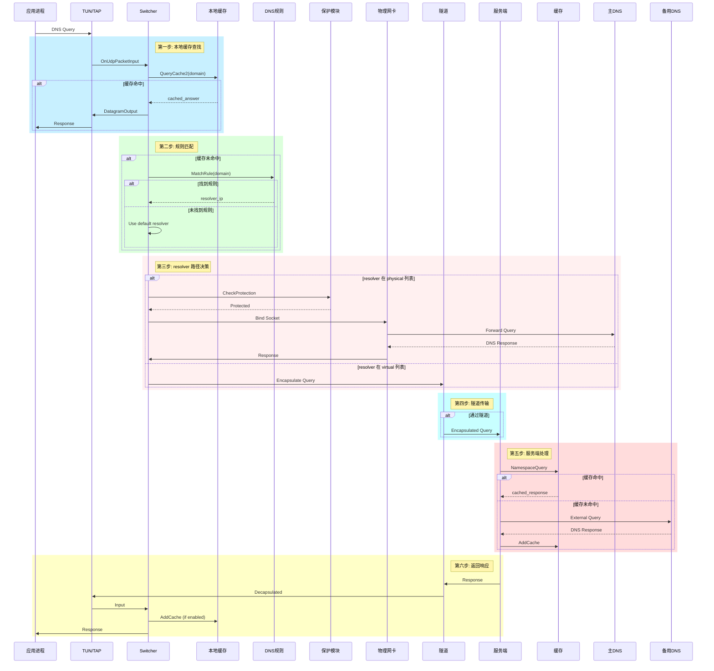
```mermaid
sequenceDiagram
    participant App as 应用进程
    participant Tun as TUN/TAP
    participant Sw as Switcher
    participant Cache as 本地缓存
    participant Rule as DNS规则
    participant Proto as 保护模块
    participant Phys as 物理网卡
    participant Tunnel as 隧道
    participant Srv as 服务端
    participant SCache as 缓存
    participant DNS1 as 主DNS
    participant DNS2 as 备用DNS

    App->>Tun: DNS Query
    
    rect rgb(200, 240, 255)
        note right of Sw: 第一步: 本地缓存查找
        Tun->>Sw: OnUdpPacketInput
        Sw->>Cache: QueryCache2(domain)
        alt 缓存命中
            Cache-->>Sw: cached_answer
            Sw->>Tun: DatagramOutput
            Tun->>App: Response
        end
    end

    rect rgb(220, 255, 220)
        note right of Sw: 第二步: 规则匹配
        alt 缓存未命中
            Sw->>Rule: MatchRule(domain)
            alt 找到规则
                Rule-->>Sw: resolver_ip
            else 未找到规则
                Sw->>Sw: Use default resolver
            end
        end
    end

    rect rgb(255, 240, 240)
        note right of Sw: 第三步: resolver 路径决策
        alt resolver 在 physical 列表
            Sw->>Proto: CheckProtection
            Proto-->>Sw: Protected
            Sw->>Phys: Bind Socket
            Phys->>DNS1: Forward Query
            DNS1-->>Phys: DNS Response
            Phys->>Sw: Response
        else resolver 在 virtual 列表
            Sw->>Tunnel: Encapsulate Query
        end
    end

    rect rgb(200, 255, 255)
        note right of Tunnel: 第四步: 隧道传输
        alt 通过隧道
            Tunnel->>Srv: Encapsulated Query
        end
    end

    rect rgb(255, 220, 220)
        note right of Srv: 第五步: 服务端处理
        Srv->>SCache: NamespaceQuery
        alt 缓存命中
            SCache-->>Srv: cached_response
        else 缓存未命中
            Srv->>DNS2: External Query
            DNS2-->>Srv: DNS Response
            Srv->>SCache: AddCache
        end
    end

    rect rgb(255, 255, 200)
        note right of Tunnel: 第六步: 返回响应
        Srv->>Tunnel: Response
        Tunnel->>Tun: Decapsulated
        Tun->>Sw: Input
        Sw->>Cache: AddCache (if enabled)
        Sw->>App: Response
    end
```

### 路由更新流程图

以下图表展示了路由更新的完整流程：

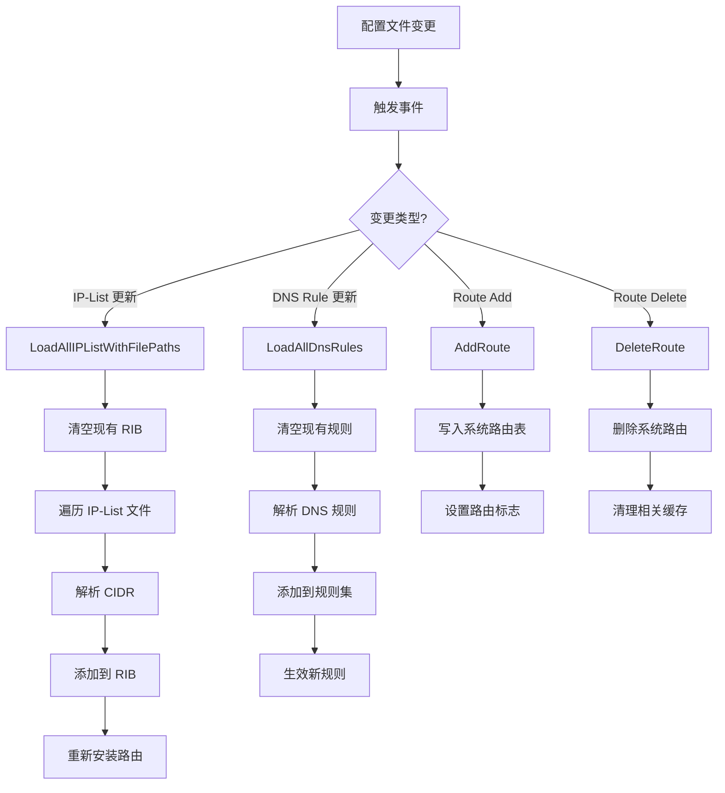
```mermaid
flowchart TD
    A[配置文件变更] --> B[触发事件]
    
    B --> C{变更类型?}
    C -->|IP-List 更新| D[LoadAllIPListWithFilePaths]
    C -->|DNS Rule 更新| E[LoadAllDnsRules]
    C -->|Route Add| F[AddRoute]
    C -->|Route Delete| G[DeleteRoute]
    
    D --> H[清空现有 RIB]
    H --> I[遍历 IP-List 文件]
    I --> J[解析 CIDR]
    J --> K[添加到 RIB]
    K --> L[重新安装路由]
    
    E --> M[清空现有规则]
    M --> N[解析 DNS 规则]
    N --> O[添加到规则集]
    O --> P[生效新规则]
    
    F --> Q[写入系统路由表]
    Q --> R[设置路由标志]
    
    G --> S[删除系统路由]
    S --> T[清理相关缓存]
```

---

## 配置示例扩展

### 多区域路由配置示例

以下配置展示了多区域路由的实现方式：

```json
{
    "client": {
        "tunnel": {
            "interface": "openppp2",
            "address": "10.9.0.2",
            "netmask": "255.255.255.0"
        },
        "route": {
            "global": {
                "split": true,
                "default_via": "tun0"
            },
            "policy": {
                "regions": {
                    "cn": {
                        "ip_list": "/etc/openppp2/cn_ip.txt",
                        "description": "中国大陆"
                    },
                    "hk": {
                        "ip_list": "/etc/openppp2/hk_ip.txt",
                        "description": "香港地区"
                    },
                    "tw": {
                        "ip_list": "/etc/openppp2/tw_ip.txt",
                        "description": "台湾地区"
                    },
                    "jp": {
                        "ip_list": "/etc/openppp2/jp_ip.txt",
                        "description": "日本"
                    },
                    "us": {
                        "ip_list": "/etc/openppp2/us_ip.txt",
                        "description": "美国"
                    }
                },
                "default": "global"
            },
            "bypass": {
                "local": [
                    "192.168.0.0/16",
                    "10.0.0.0/8",
                    "172.16.0.0/12",
                    "127.0.0.0/8"
                ],
                "gateway": "192.168.1.1"
            }
        },
        "dns": {
            "rules": "/etc/openppp2/dns_rules.txt",
            "local_cache": true,
            "redirect": {
                "cn": "223.5.5.5",
                "default": "8.8.8.8"
            }
        }
    },
    "server": {
        "dns": {
            "cache": {
                "enabled": true,
                "max_entries": 100000
            },
            "redirect": {
                "resolver": "223.5.5.5",
                "fallback": ["119.29.29.29", "114.114.114.114"]
            }
        }
    }
}
```

### 负载均衡配置示例

以下配置展示了多 resolver 负载均衡的实现：

```json
{
    "client": {
        "dns": {
            "load_balancing": {
                "enabled": true,
                "strategy": "round_robin",
                "resolvers": [
                    {
                        "ip": "8.8.8.8",
                        "weight": 1,
                        "health_check": true
                    },
                    {
                        "ip": "8.8.4.4",
                        "weight": 1,
                        "health_check": true
                    },
                    {
                        "ip": "1.1.1.1",
                        "weight": 2,
                        "health_check": true
                    }
                ],
                "health_check": {
                    "interval": 30,
                    "timeout": 3000,
                    "retries": 3
                }
            },
            "rules": "/etc/openppp2/dns_rules_lb.txt"
        }
    }
}
```

### 高可用配置示例

以下配置展示了高可用场景的实现：

```json
{
    "client": {
        "tunnel": {
            "interface": "openppp2_ha",
            "address": "10.10.0.2",
            "netmask": "255.255.255.0"
        },
        "remote": {
            "primary": {
                "host": "vpn1.example.com",
                "port": 443,
                "protocol": "wireguard"
            },
            "secondary": {
                "host": "vpn2.example.com",
                "port": 443,
                "protocol": "wireguard"
            },
            "failover": {
                "enabled": true,
                "health_check_interval": 10,
                "max_retries": 3,
                "switch_on_failure": true
            }
        },
        "route": {
            "global": {
                "split": true,
                "exclude_primary": true,
                "exclude_secondary": true
            },
            "ha": {
                "detect_failure": true,
                "auto_switch": true,
                "fallback_delay": 5000
            }
        },
        "dns": {
            "rules": "/etc/openppp2/dns_rules_ha.txt",
            "local_cache": true,
            "failover": {
                "enabled": true,
                "primary_resolver": "8.8.8.8",
                "secondary_resolver": "1.1.1.1"
            }
        }
    }
}
```

### IPv6 兼容配置示例

以下配置展示了 IPv6 支持的实现：

```json
{
    "client": {
        "tunnel": {
            "interface": "openppp2",
            "address": "10.11.0.2",
            "netmask": "255.255.255.0",
            "address_v6": "fd00::2",
            "netmask_v6": "fd00::/64"
        },
        "route": {
            "global": {
                "split": true,
                "split_v6": true,
                "ipv6_default": "tun0"
            },
            "policy": {
                "ipv6_list": "/etc/openppp2/ipv6_policy.txt"
            },
            "bypass": {
                "ipv4": [
                    "192.168.0.0/16",
                    "10.0.0.0/8"
                ],
                "ipv6": [
                    "fe80::/10",
                    "fc00::/7"
                ]
            }
        },
        "dns": {
            "servers": [
                {
                    "v4": "223.5.5.5",
                    "v6": "2400:3200::1"
                }
            ],
            "rules": "/etc/openppp2/dns_rules.txt"
        }
    }
}
```

---

## 结论

在 OPENPPP2 中，路由与 DNS 实际上构成了一块统一控制面。

路由决定流量有没有资格走某条路径，DNS 规则决定某个名字应由哪条解析路径回答，而 resolver IP 自身又会被单独加路由，保证 DNS policy 在 route diversion 之后仍然成立。服务端再继续用 cache 和 redirect 逻辑延续这套策略，而不是把 DNS 当成普通 UDP。这正是 OPENPPP2 看起来更像一个策略感知的 overlay 边缘节点，而不是一根简单加密管道的原因。