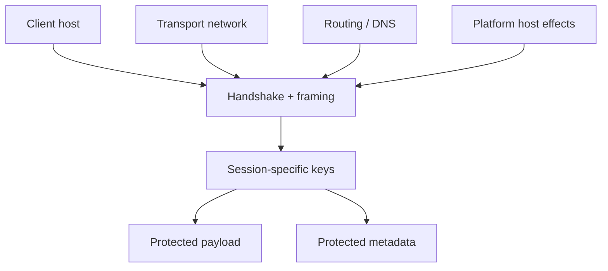

# Security Model

[中文版本](SECURITY_CN.md)

## Scope

This document explains the security posture of OPENPPP2 in code-fact terms.

## Core View

OPENPPP2 is not just an encrypted tunnel. Its defensive value comes from multiple layers:

- handshake discipline
- per-session key derivation from `ivv`
- protected framing
- static packet protection
- explicit session and policy objects
- routing and DNS steering
- platform-level host integration
- timeout and cleanup behavior

## Important Clarification: FP, Not PFS

OPENPPP2 does not implement classical PFS. It uses pre-shared keys plus per-session `ivv` to derive session-specific working keys. That gives forward-security-like separation, but it is not the same as ephemeral public-key PFS.

## Trust Boundaries

Important trust boundaries include:

- client host
- server host
- transport network
- optional management backend
- configuration file and local key storage

## Encryption Model

There are two encryption layers:

- protocol layer: `protocol-key` + `ivv`
- transport layer: `transport-key` + `ivv`

Optional flags like `masked`, `plaintext`, `delta-encode`, and `shuffle-data` affect exposure and shaping, but they are not a substitute for proper keying.

## Handshake Security

Handshake uses NOP-style prelude traffic, `session_id`, `ivv`, and key confirmation. The early phase is treated conservatively.

## Operational Security

Security also depends on:

- route and DNS control
- mapping exposure control
- timeout handling
- orderly cleanup

## What The Code Actually Proves

The code shows:

- session-specific working key derivation exists
- the system does not rely on a single framing form
- dummy traffic is used before normal traffic
- protocol and transport ciphers are distinct
- cleanup is deliberate and explicit

The code does not show formal proof of confidentiality against every adversary model, so the docs should not overclaim.

## Threat Surface View

## Why Routing And Platform Matter To Security

Security is not only cryptography. If the wrong DNS server becomes reachable, or the wrong route is protected, the tunnel's exposure changes.

Likewise, platform-specific host side effects are part of the trust boundary, not background noise.

## Related Documents

- `TRANSMISSION.md`
- `HANDSHAKE_SEQUENCE.md`
- `ARCHITECTURE.md`
