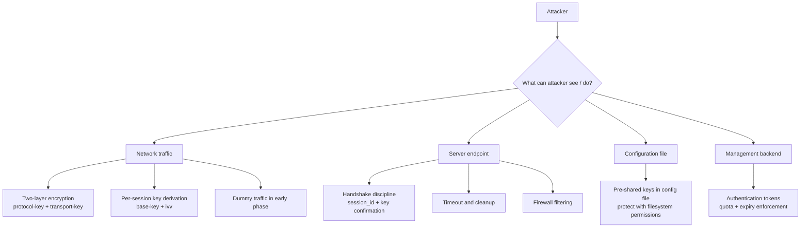
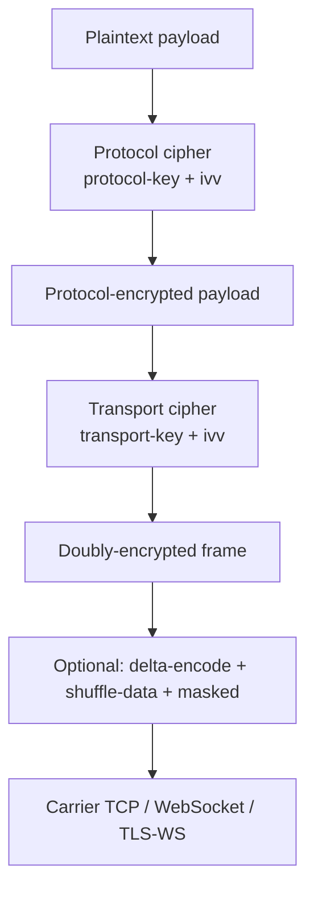
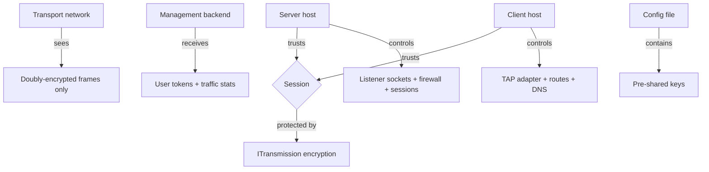
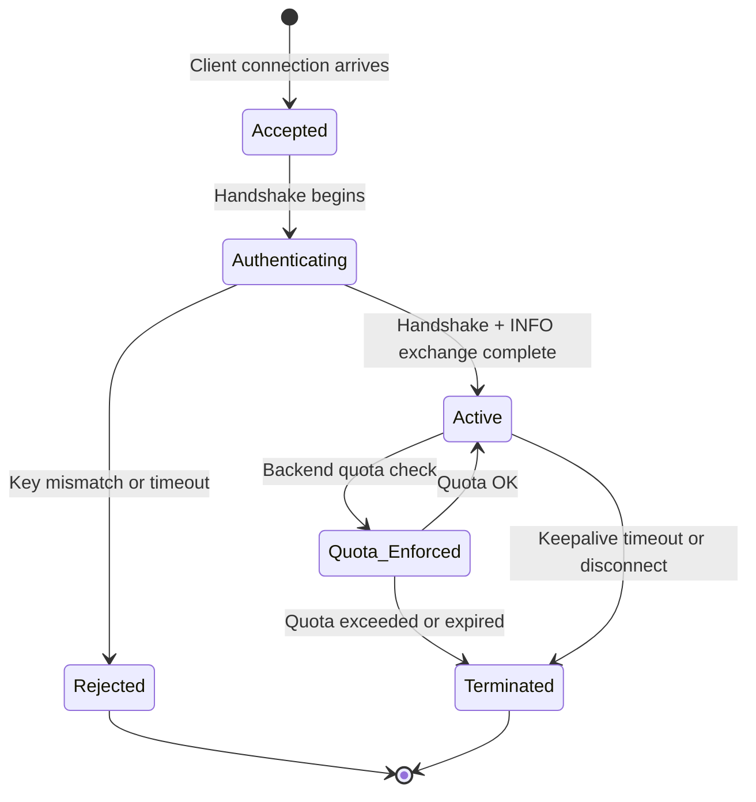
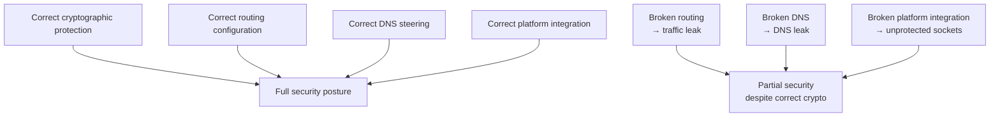
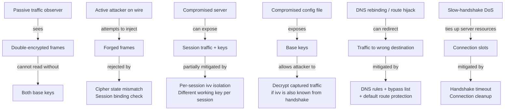

# Security Model

[中文版本](SECURITY_CN.md)

## 1. Scope

This document explains the security posture of OPENPPP2 in code-fact terms.

The goal is accuracy: the document describes what the code actually does and does not overclaim.

---

## 2. Core Security Model

OPENPPP2 is not just an encrypted tunnel. Its defensive value comes from multiple coordinated layers:



---

## 3. Important Clarification: FP, Not PFS

OPENPPP2 does not implement classical Perfect Forward Secrecy (PFS).

| Property | PFS (e.g. TLS 1.3 with DHE) | OPENPPP2 FP |
|----------|------------------------------|-------------|
| Key exchange | Ephemeral public-key exchange per session | Pre-shared key + per-connection ivv |
| Compromise impact | Past sessions safe even if long-term key compromised | Sessions using same base key are at risk if base key is compromised |
| Session isolation | Full: different DH values per session | Partial: different ivv per session, same base key |
| Implementation complexity | High (asymmetric crypto required) | Lower (symmetric + KDF) |
| Quantum resistance | Depends on chosen algorithm | Not addressed |

OPENPPP2 provides **Forward-Privacy (FP)**: per-session key isolation via `ivv`, but not against an adversary who has already captured traffic and later obtains the base key.

### Key Derivation Detail

```
Working key = KDF(base_key, ivv + nmux + session_id)

protocol_working_key  = KDF(key.kcp.protocol,  ivv + nmux + session_id)
transport_working_key = KDF(key.kcp.transport, ivv + nmux + session_id)
```

The `ivv` is a 32-bit random value generated by the client during handshake. Each connection gets a different `ivv`, so working keys differ across connections even when the base key is identical.

---

## 4. Encryption Architecture

Two independent cipher layers are applied per connection:



### 4.1 Key Parameters

| Parameter | Config key | Purpose |
|-----------|------------|---------|
| Protocol key | `key.kcp.protocol` | Protocol-layer cipher base secret |
| Transport key | `key.kcp.transport` | Transport-layer cipher base secret |
| Protocol cipher | `key.protocol` | Cipher algorithm for protocol layer (e.g. `aes-256-cfb`) |
| Transport cipher | `key.transport` | Cipher algorithm for transport layer |
| `ivv` | Negotiated per connection | Per-connection key variation seed |
| `kf`, `kh`, `kl`, `kx`, `sb` | `key.*` | Auxiliary framing and session binding key materials |

### 4.2 Optional Exposure Controls

| Flag | Config key | Effect |
|------|------------|--------|
| `masked` | `key.masked` | Additional masking layer over ciphertext |
| `plaintext` | `key.plaintext` | Disable encryption (development/testing only) |
| `delta-encode` | `key.delta-encode` | Delta encode the ciphertext bytes |
| `shuffle-data` | `key.shuffle-data` | Shuffle ciphertext byte ordering |

These flags affect traffic shaping and analysis resistance.
They are **not** a substitute for proper keying.
`plaintext = true` must **never** be used in production.

### 4.3 Why Two Cipher Layers

Separating protocol and transport cipher states serves distinct security purposes:

- **Protocol cipher** protects frame header metadata — including length information that enables traffic-shape fingerprinting attacks (packet-length histogram analysis).
- **Transport cipher** protects payload content.
- Even if one cipher is broken, the other still protects its corresponding data layer.
- The two ciphers use different base keys, derived from different configured secrets.

---

## 5. Handshake Security

The `ITransmission` handshake defends against passive traffic analysis and connection probing:

```mermaid
sequenceDiagram
    participant C as Client
    participant S as Server

    Note over C,S: Early phase — conservative Base94 framing, dummy traffic
    C->>S: NOP prelude (variable-length random dummy bytes, session_id=0)
    S->>C: NOP prelude reply

    Note over C,S: Identity phase
    S->>C: session_id (Int128, assigned by VirtualEthernetSwitcher)
    C->>S: ivv (32-bit random, per-connection key variation seed)
    S->>C: nmux (mux parameter; low bit = mux enable flag)

    Note over C,S: Both sides set handshaked_ = true
    Note over C,S: Rebuild protocol_ and transport_ ciphers using ivv + nmux + session_id
    Note over C,S: Switch to binary protected framing
```

Security properties of the handshake:

| Property | Mechanism |
|----------|-----------|
| Passive traffic analysis resistance | NOP prelude with random length and payload obscures handshake pattern |
| Session binding | `session_id` binds the logical session to this specific transport connection |
| Per-session key variation | `ivv` exchange establishes connection-specific cipher state |
| Key confirmation | `ivv` is usable only by a party that knows the base key; invalid key → cipher state mismatch → connection dropped |
| Anti-replay | `session_id` is freshly assigned per connection; replayed old sessions would fail session lookup |

### 5.1 Handshake Timeout

The handshake is bounded by a configurable timeout (`tcp.connect.timeout`).
If the handshake does not complete in time, the connection is dropped.
This limits the exposure of server resources to incomplete connections (slow-handshake DoS mitigation).

Source: `ppp/transmissions/ITransmission.h`, `ppp/app/server/VirtualEthernetSwitcher.cpp`

### 5.2 Dummy Traffic Detail

NOP prelude bytes are structured dummy traffic, not empty bytes:

- When `session_id == 0`, the packer sets the high bit of the first byte and generates a random-length random payload.
- The receiver identifies dummy packets by this high bit and discards them.
- Multiple dummy packets can be sent consecutively to vary traffic patterns.
- This prevents a passive observer from identifying the handshake by its structure or timing.

---

## 6. Trust Boundaries



| Trust boundary | Risk if compromised | Mitigation |
|----------------|---------------------|-----------|
| Client host | Route manipulation, DNS spoofing, key exposure | Filesystem ACLs on config; route protection |
| Server host | Session state compromise, key exposure | Filesystem ACLs; separate server keys per deployment |
| Transport network | Traffic capture — mitigated by double encryption | Two-layer cipher; dummy traffic; delta-encode |
| Management backend | Authentication bypass, quota manipulation | Backend uses WSS/HTTPS; backend-key authentication |
| Config file | Base key exposure — protect with filesystem ACLs | `chmod 600 appsettings.json`; never commit to VCS |

---

## 7. Session and Policy Objects

The server maintains explicit session objects (`VirtualEthernetExchanger`) per connected client.

Each session holds:
- Session identity (`Int128` session_id)
- Traffic counters (in/out bytes)
- Quota and expiry state (if managed backend is used)
- Firewall reference
- Mapping state (if FRP mappings are active)
- IPv6 lease state (if IPv6 transit is enabled)

Session objects are cleaned up explicitly when the connection ends.
Cleanup is not just resource release — it rolls back host side effects (routes, DNS entries, NDP proxy entries).

Source: `ppp/app/server/VirtualEthernetExchanger.h`

### 7.1 Session Lifecycle and Security



---

## 8. Routing and DNS as Security Controls

Routing and DNS are not merely operational concerns.
They are part of the security boundary:

| Control | Security relevance | Source |
|---------|-------------------|--------|
| Bypass IP list | Controls which destinations bypass the tunnel — misconfiguration causes traffic leak | `VEthernetNetworkSwitcher` |
| DNS steering rules | Controls which resolver is used per domain — wrong resolver can leak DNS queries | `VEthernetNetworkSwitcher` |
| Default route protection | Prevents accidental leak of tunneled traffic to physical interface | Route management logic |
| DNS server reachability routes | Ensures DNS queries go through the correct path | Route setup logic |
| Server reachability routes | Ensures tunnel control traffic takes correct path (not recursive through tunnel) | Route setup logic |

A misconfigured route can cause:
- DNS queries to leak to the wrong resolver (even with correct crypto)
- Traffic destined for the tunnel to bypass it (traffic leak)
- Server connection traffic to loop unexpectedly (connection failure)

Source: `ppp/app/client/VEthernetNetworkSwitcher.h`

---

## 9. Platform-Level Security

Platform integration affects the security boundary:

| Platform | Security-relevant integration | Risk if misconfigured |
|----------|-------------------------------|----------------------|
| Windows | Socket protection (`protect_system`), QUIC preference control, WFP filtering | Protected sockets may still leak if WFP rules are wrong |
| Linux | `iptables` / `nftables` for forwarding, `ip route` management, NDP proxy for IPv6 | Forwarding rules must be correct to prevent IP leakage |
| Android | VpnService socket protection, JNI bridge error mapping | Unprotected sockets enter tunnel recursively → connection failure |
| macOS | `pf` / `route` integration, BSD routing socket | PF rules must not interfere with tunnel traffic |

Platform side effects are part of the trust boundary, not background noise.
Incorrect platform state can undermine correct cryptographic protection.



---

## 10. Static UDP Path Security

Static UDP packets are sent outside the main `ITransmission` framing path.

Security implications:
- Static UDP uses its own key and encryption state (not the same as main session keys).
- Aggregator-mode static UDP uses multiple server endpoints — all must be trusted.
- Static UDP server list entries should be validated as legitimate server nodes.
- Static UDP is subject to UDP-layer amplification and spoofing — server-side firewall rules should restrict which source IPs can send static UDP packets.

Configuration:

```json
"udp": {
    "static": {
        "aggligator": 4,
        "servers": ["trusted-server-1:20000", "trusted-server-2:20000"]
    }
}
```

---

## 11. FRP Reverse Mapping Security

The FRP (Fast Reverse Proxy) mapping feature exposes services on the client side to the outside world through the server.

Security considerations:

1. **Exposed service reach**: A registered FRP mapping makes the client-side service reachable from the server's network — review which services are being exposed.
2. **Registration authentication**: Mapping registration should be authenticated via the management backend. Without a backend, any client with a valid session can register any port.
3. **Port range control**: Server-side firewall rules should restrict the port ranges clients are allowed to register.
4. **FRP UDP relay security**: `PacketAction_FRP_SENDTO` relays raw UDP datagrams — ensure the target service is safe to expose via UDP.

Source: `ppp/app/server/VirtualEthernetSwitcher.h`

---

## 12. Threat Model Summary



---

## 13. What The Code Actually Proves

The code proves:
- Session-specific working key derivation exists and is applied (`ivv` + `nmux` + `session_id` → working key).
- The system uses two independent cipher layers per connection (`protocol_` and `transport_` cipher slots in `ITransmission`).
- Dummy traffic is sent before normal traffic in the early handshake phase (NOP prelude).
- Protocol cipher and transport cipher are maintained separately with different base keys.
- Session cleanup is explicit and deliberate (`compare_exchange_strong` dispose pattern).
- Route and DNS state is built from multiple controlled inputs (`VEthernetNetworkSwitcher`).
- Handshake has a bounded timeout (configurable, applied in `ITransmission`).

The code does **not** prove:
- Formal confidentiality against all adversary models.
- Resistance to quantum adversaries.
- Protection against a compromised pre-shared key (base key).
- Resistance to implementation-level side-channel attacks.
- Perfect forward secrecy against an adversary who records traffic and later obtains the base key.

---

## 14. Error Code Reference

Security-related `ppp::diagnostics::ErrorCode` values:

| ErrorCode | Description | Source location |
|-----------|-------------|-----------------|
| `HandshakeFailed` | Handshake sequence execution failed | `ITransmission::HandshakeClient/Server` |
| `HandshakeTimeout` | Handshake exceeded configured timeout | `ITransmission` timeout logic |
| `AuthenticationFailed` | Authentication rejected by server or backend | `VirtualEthernetSwitcher` |
| `SessionKeyDerivationFailed` | Could not derive working key from base key + ivv | Cipher initialization |
| `ManagedServerAuthenticationFailed` | Backend rejected user authentication | `VirtualEthernetManagedServer` |
| `ManagedServerQuotaExceeded` | User quota exhausted | `VirtualEthernetManagedServer` |
| `ManagedServerUserExpired` | User subscription expired | `VirtualEthernetManagedServer` |
| `TlsNegotiationFailed` | TLS negotiation failed (WSS carrier) | `ISslWebsocketTransmission` |
| `SessionDisposed` | Session was already disposed | Dispose pattern |
| `KeepaliveTimeout` | Keepalive heartbeat timed out | `DoKeepAlived` |

---

## 15. Operational Security Checklist

**Configuration security:**
- [ ] Pre-shared keys (`key.kcp.protocol`, `key.kcp.transport`) are unique per deployment and stored with filesystem-level access control (`chmod 600 appsettings.json`).
- [ ] `plaintext` mode is `false` in production.
- [ ] `key.protocol` and `key.transport` are set to the strongest currently supported non-legacy cipher (e.g. `aes-256-cfb`); AEAD/ChaCha20-family ciphers should only be configured after target-build support is verified.
- [ ] `appsettings.json` is not committed to version control.

**Network security:**
- [ ] Bypass IP list and DNS rules reviewed for intended coverage — no unintended traffic bypass.
- [ ] Default route protection enabled to prevent tunnel traffic leaks.
- [ ] Static UDP server list contains only trusted, controlled endpoints.
- [ ] FRP mapping registrations reviewed and constrained by server-side firewall.

**Server security:**
- [ ] Management backend uses HTTPS or WSS, not plain HTTP/WS.
- [ ] Handshake timeout is set appropriately (not too long — prevents slow-handshake DoS).
- [ ] Server-side firewall rules reviewed for exposed ports (TCP/UDP listeners).
- [ ] Server log path configured and log storage has appropriate access controls.

**Platform security:**
- [ ] Linux: `iptables`/`nftables` rules reviewed; NDP proxy entries are correct for IPv6 transit.
- [ ] Windows: Wintun or TAP-Windows driver is from a trusted source; WFP rules are reviewed.
- [ ] Android: `VpnService.protect()` is called for all OPENPPP2 control sockets.
- [ ] macOS: `pf` rules do not interfere with tunnel traffic.

---

## 16. Security-Relevant Configuration Example

```json
{
    "key": {
        "kcp": {
            "protocol": "strong-random-protocol-secret-at-least-32-chars",
            "transport": "strong-random-transport-secret-at-least-32-chars"
        },
        "protocol": "aes-256-cfb",
        "transport": "aes-256-cfb",
        "masked": true,
        "plaintext": false,
        "delta-encode": true,
        "shuffle-data": true
    },
    "tcp": {
        "connect": { "timeout": 5 }
    },
    "server": {
        "backend": "wss://management.example.com:8443/",
        "backend-key": "strong-backend-auth-key"
    }
}
```

---

## 17. Legacy Cryptography Warnings

OPENPPP2 validates cipher configuration at startup in `AppConfiguration::Loaded()`.
When legacy or weak cryptographic settings are detected, the system emits
non-fatal `kWarning` error codes. **These warnings never block startup.**
Legacy algorithms remain fully functional to preserve backward compatibility
with existing deployments.

### 17.1 Warning Codes

| Error Code | Trigger Condition |
|------------|-------------------|
| `ConfigWeakKeyDefault` | `protocol_key` or `transport_key` equals the well-known default `"ppp"` |
| `ConfigWeakKeyShort` | `protocol_key` or `transport_key` is shorter than 8 bytes |
| `ConfigPlaintextEnabled` | `key.plaintext` is `true` |
| `ConfigLegacyCipherAlgorithm` | `key.protocol` or `key.transport` uses a legacy algorithm family (RC4, DES/3DES, Blowfish, CAST5, SEED, IDEA) |
| `ConfigLegacyCipherShortKey` | The cipher's key length (resolved via OpenSSL EVP) is below 128 bits |
| `ConfigLegacyKdfMd5` | Internal key derivation uses MD5 via `EVP_BytesToKey`; emitted as an informational warning whenever cipher configuration is validated (no user action possible until KDF becomes configurable) |

### 17.2 Legacy Algorithm Families

| Family | Example Names | Why Deprecated |
|--------|---------------|----------------|
| RC4 | `rc4`, `rc4-md5`, `rc4-sha` | Biased keystream; practical attacks exist |
| DES/3DES | `des-cbc`, `des-cfb`, `des-ede` | 56-bit DES key / legacy 64-bit block ciphers; brute-force and Sweet32-class risks |
| Blowfish | `bf-cbc`, `bf-cfb` | 64-bit block size; Sweet32 attack surface |
| CAST5 | `cast5-cbc`, `cast5-cfb` | 64-bit block size; deprecated |
| SEED | `seed-cbc`, `seed-cfb` | Limited adoption; no modern security review |
| IDEA | `idea-cbc`, `idea-cfb` | 64-bit block size; limited adoption |

### 17.3 Recommended Modern Configuration

For new deployments, use the strongest currently supported non-legacy ciphers
and strong unique keys:

```json
{
    "key": {
        "protocol": "aes-256-cfb",
        "protocol-key": "<random-32-byte-hex-or-passphrase>",
        "transport": "aes-256-cfb",
        "transport-key": "<different-random-32-byte-hex-or-passphrase>",
        "kf": 154543927,
        "kx": 128,
        "kl": 10,
        "kh": 12,
        "sb": 1000,
        "masked": true,
        "plaintext": false,
        "delta-encode": true,
        "shuffle-data": true
    }
}
```

**Key recommendations:**

| Aspect | Minimum | Recommended |
|--------|---------|-------------|
| Cipher algorithm | AES-128-CFB | AES-256-CFB today; AEAD such as AES-256-GCM or ChaCha20-Poly1305 after project support is verified |
| Key length | 128 bits | 256 bits |
| Passphrase length | 8 bytes | 16+ random characters |
| `plaintext` | `false` | `false` (always) |
| `masked` | `false` | `true` |
| `delta-encode` | `false` | `true` |
| `shuffle-data` | `false` | `true` |

> **Note:** The project's current defaults (`aes-128-cfb` / `aes-256-cfb`) remain
> the built-in fallback when `key.protocol` or `key.transport` is empty or
> unsupported. CFB mode is not AEAD and does not provide ciphertext integrity
> protection, but it is not flagged as a warning because it is the established
> project baseline. Migrating to AEAD (after support is verified for the target
> build) provides authentication and removes the need for the separate
> protocol-layer cipher to protect header metadata.

---

## Related Documents

- [`TRANSMISSION.md`](TRANSMISSION.md) — Cipher slot details, framing, handshake sequence
- [`HANDSHAKE_SEQUENCE.md`](HANDSHAKE_SEQUENCE.md) — Step-by-step handshake timing
- [`ARCHITECTURE.md`](ARCHITECTURE.md) — System architecture and component trust boundaries
- [`TUNNEL_DESIGN.md`](TUNNEL_DESIGN.md) — Layer-by-layer tunnel design
- [`ROUTING_AND_DNS.md`](ROUTING_AND_DNS.md) — Route and DNS security controls
- [`MANAGEMENT_BACKEND.md`](MANAGEMENT_BACKEND.md) — Backend authentication and quota enforcement
- [`EDSM_STATE_MACHINES.md`](EDSM_STATE_MACHINES.md) — Session lifecycle and dispose pattern
