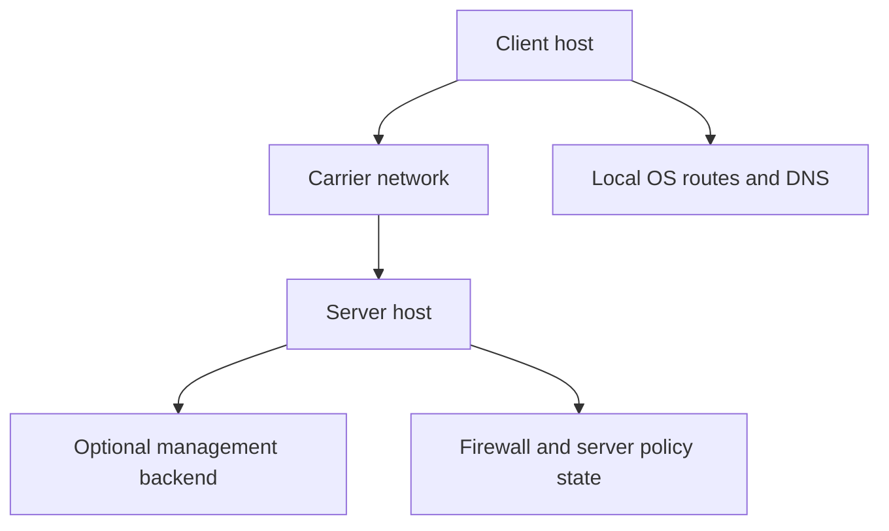
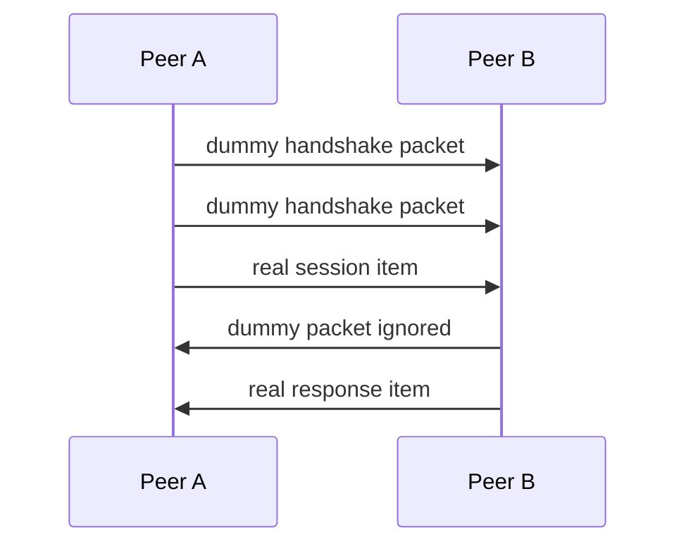

# Security Model And Defensive Interpretation

[中文版本](SECURITY_CN.md)

## Scope

This document explains the security posture of OPENPPP2 using code-grounded language. The goal is not to market the project as magically invulnerable, and not to flatten it into a generic “encrypted tunnel.” The goal is to describe what the implementation actually does, where its defensive value comes from, where its trust boundaries are, and what claims must be made carefully.

The main files behind this document are:

- `ppp/transmissions/ITransmission.cpp`
- `ppp/app/protocol/VirtualEthernetPacket.cpp`
- `ppp/configurations/AppConfiguration.cpp`
- `ppp/app/protocol/VirtualEthernetInformation.*`
- `ppp/app/server/VirtualEthernetSwitcher.*`
- `ppp/app/client/VEthernetNetworkSwitcher.*`
- platform-specific route, firewall, and adapter integration files

## Security In OPENPPP2 Is Multi-Layered

If OPENPPP2 is described only as “it encrypts traffic,” the description is incomplete and misleading.

The code’s defensive posture is composed from several layers:

- connection admission and handshake discipline
- connection-specific working-key derivation
- protected transmission framing
- static packet metadata and payload protection
- explicit session identity and policy objects
- route, DNS, mapping, and exposure control
- platform-local enforcement
- timeout and lifecycle cleanup discipline

The security center of gravity is therefore not one algorithm name. It is the composition of several subsystems.

## Trust Boundaries

The important trust boundaries are:

- client host
- server host
- carrier path between them
- optional management backend
- local operating-system networking stack
- local route and DNS policy files
- certificate, key, and backend-secret storage

A correct deployment has to treat those as separate boundaries.

This matters because a tunnel can have strong packet protection and still be insecure operationally if, for example:

- route files are wrong
- DNS rules leak traffic unintentionally
- mappings expose services carelessly
- backend secrets are stored unsafely
- platform route protection is disabled without understanding the consequence

## The First Defensive Layer: Handshake Discipline

The handshake lives around `ITransmission`.

Its job is not only “exchange a session identifier.” It also:

- injects dummy traffic through handshake NOP packets
- distinguishes real handshake items from dummy items
- exchanges the `ivv` input used for connection-specific key shaping
- carries the mux indicator through `nmux`
- enforces timeout-driven cleanup of incomplete sessions

This immediately differentiates OPENPPP2 from the mental model of “client opens socket, sends password, starts streaming.” That is not how this runtime thinks about session establishment.

## Handshake Noise And Dummy Packets

`Transmission_Handshake_Pack_SessionId(...)` can emit two packet classes:

- real session packets
- dummy packets

Dummy packets are signaled by setting the high bit on the first random byte. The receiver checks that bit and, if set, marks the packet as ignorable noise and continues reading.

This does not replace cryptography. It changes the handshake traffic form and makes the early byte exchange less literal.

From an attack-defense perspective, that means early traffic analysis is confronted with a handshake that contains deliberate non-semantic noise, not just a minimal deterministic control exchange.

## `kh`, `kl`, And Handshake Variability

The amount of NOP traffic is not constant. It is shaped by `key.kh` and `key.kl`, which are normalized by configuration loading and then used by `Transmission_Handshake_Nop(...)`.

The code derives a range by shifting `1 << kl` and `1 << kh`, then randomizes within that range, then scales the result into a practical number of actual dummy rounds.

This is one of the clearest examples of attack-defense-aware traffic shaping in the code. The handshake is not intended to have a single perfectly rigid on-wire prelude.

## Handshake Timeout Is A Security Feature

`InternalHandshakeTimeoutSet()` and `InternalHandshakeTimeoutClear()` are not just “quality of life” code. They are part of the security posture.

Why?

Because half-open ambiguous connection state is operationally dangerous. It wastes resources, complicates forensic reasoning, and opens the door to degraded behavior under load or deliberate handshake exhaustion pressure.

If the timeout fires, the runtime:

- cancels the ambiguity window
- sends final NOP traffic
- disposes the transmission

In other words, incomplete session establishment is not allowed to sit quietly forever.

## Connection-Specific Working-Key Derivation

This is one of the most important topics and one of the easiest places to overstate the code.

During handshake, the client generates `ivv` and sends it. Both sides then rebuild the protocol and transport ciphers by appending serialized `ivv` text to the configured base keys.

At a practical level, this means:

- configured keys are not used as the final repeated working keys for every connection
- each connection gets fresh derived working cipher state
- compromise of one connection’s working state does not imply that all prior and future connections literally reuse identical runtime key material

That is a real and important defensive property.

## What Can Be Claimed About Forward Security

The user explicitly asked that the docs explain forward security in depth. The right answer has to be precise.

### What the code supports saying

The code supports saying that OPENPPP2 implements:

- session-level dynamic working-key derivation
- per-connection cipher rebuilding using fresh handshake input `ivv`
- reduced long-term reuse of identical raw configured working keys

### What the code shown here does not justify saying

The code shown in the current reading set does not demonstrate a standard ephemeral public-key key agreement such as ECDHE. Because of that, the documentation must not collapse “fresh per-connection derived working key” into the stronger claim “standard public-key-agreement-based PFS” without additional proof.

The correct statement is therefore:

- OPENPPP2 has connection-specific working-key derivation
- this improves over raw static reuse
- documentation must not oversell it as a public-key-ephemeral standard-PFS construction unless additional code paths establish that separately

This kind of precision is important because infrastructure documentation loses credibility the moment it makes claims the code cannot support.

## Dual-Layer Cipher Design

OPENPPP2 maintains two distinct logical cipher slots:

- protocol cipher
- transport cipher

That allows it to protect:

- packet metadata such as frame length
- payload body

with different roles in the pipeline.

In the normal binary packet path:

1. payload may be encrypted by the transport cipher
2. payload length bytes may be encrypted by the protocol cipher
3. payload and header bytes also go through masking, shuffling, and delta transformation steps

This means the design is not just “encrypt the payload and call it done.” The metadata itself is intentionally protected and transformed.

## Length-Hiding And Framing Obfuscation

The transmission path uses a compact binary header whose contents are not left in a raw readable form.

The length field is subject to:

- optional protocol-cipher protection
- XOR masking with a header-derived key factor
- byte shuffling
- delta encoding

The static packet format also avoids exposing a bare length directly. It uses a separate header-length mapping through `Lcgmod` and per-packet keying.

This matters because many traffic analysis and parser-abuse opportunities begin with clear, predictable framing. OPENPPP2 spends real complexity budget on avoiding trivially literal framing.

## Base94 Path As A Defensive Layer

The base94 path should be understood correctly.

It is not the project’s sole security basis. But it is part of the defensive story because:

- it separates pre-handshake and plaintext framing from the later binary format
- it uses a first-packet extended header and later-packet simple header transition
- it encodes length through base94 conversion plus additional transforms
- it introduces another layer of non-literal wire format behavior early in the session

The base94 path therefore belongs in the “traffic form and framing defense” discussion.

## `masked`, `shuffle-data`, And `delta-encode`

These configuration switches influence the transmission and packet formats materially.

### `masked`

Adds rolling XOR-style masking through `masked_xor_random_next`.

### `shuffle-data`

Adds deterministic key-dependent byte reordering.

### `delta-encode`

Adds a delta encoding layer on the serialized bytes and requires inverse decoding during receipt.

None of these should be described in isolation as if they were modern authenticated encryption primitives. Their value comes from composition with the rest of the pipeline:

- cipher state
- handshake key shaping
- metadata protection
- packet-length distortion
- dummy handshake noise

## `kx` And Handshake Padding

`key.kx` influences the amount of random padding inserted into session-id handshake packets. The handshake packer appends random printable characters and separators around the integer material.

This again is not a replacement for cryptography. It is part of the project’s consistent attempt to avoid extremely literal early packet forms.

## `sb` And Buffer Skateboarding

`key.sb` belongs to the project’s broader packet-shape and buffer-shape control story.

The helper `BufferSkateboarding(int sb, int buffer_size, int max_buffer_size)` does not represent some mystical proprietary crypto algorithm. The correct explanation is simpler and more honest:

- within a configured range, buffer size can slide
- the slide is constrained by base size and maximum allowed size
- the effect is to avoid an overly rigid, always-identical buffer or packet-length behavior pattern

This belongs in the attack-defense documentation because traffic fingerprinting often benefits from extremely stable packet size behavior.

## Static Packet Format Security Story

The static packet path implemented in `VirtualEthernetPacket.cpp` has its own security-relevant behavior.

The packet contains:

- `mask_id`
- obfuscated `header_length`
- obfuscated `session_id`
- `checksum`
- pseudo source and destination addresses and ports
- payload

On pack:

- a non-zero random `mask_id` is generated
- per-packet `kf` is derived from `key.kf * mask_id`
- session id is XOR-obfuscated and byte-ordered
- checksum is computed over header and payload
- trailing header body may be encrypted by the protocol cipher
- payload may be encrypted by the transport cipher
- the `session_id` and following region is shuffled and masked
- the final serialized packet is delta-encoded

On unpack, those steps are reversed in the corresponding order.

This means static mode is not “raw UDP payload plus a session integer.” It has a fully shaped packet format with its own header and payload protection logic.

## Checksum And Validity Checks

In both the main transmission path and the static packet path, the code repeatedly validates structural expectations:

- header length must make sense
- payload length must match the read amount
- checksum must match
- destination and source address fields must be valid when protocol expectations require that
- zero or nonsensical identifiers are rejected

This is an important part of the defensive model. A large portion of robust network software security is not glamorous cryptography. It is strict structure validation and early failure on malformed state.

## Session Identity As Security State

OPENPPP2 does not treat “a connected socket” as sufficient identity. Session identity is explicit and propagated through objects such as `VirtualEthernetInformation` and related runtime structures.

That means policy decisions can be tied to typed session state instead of being scattered across ad hoc socket bookkeeping. This matters for:

- expiry enforcement
- remaining traffic accounting
- bandwidth control
- IPv6 allocation binding
- mapping and mux ownership

This is one of the project’s most infrastructure-like security traits: security is strongly coupled to explicit typed runtime state.

## Server-Side Enforcement

The server runtime, centered on `VirtualEthernetSwitcher` and related exchangers, is a major security boundary because it decides what an admitted client session can actually do.

Server-side enforcement includes:

- listener exposure control
- firewall-rule integration
- NAT and forwarding decisions
- mapping exposure behavior
- session table management
- optional management backend consultation
- IPv6 lease and identity enforcement

It is therefore wrong to think of security as ending once the transmission handshake succeeds. Handshake only gets a peer into the protected session state. The runtime still has to enforce policy after admission.

## Client-Side Enforcement

The client runtime is a security boundary too.

`VEthernetNetworkSwitcher` controls:

- which routes are steered into the overlay
- which traffic bypasses it
- which DNS queries are redirected or controlled
- whether local proxy features are exposed
- whether static mode and mux are active
- how the virtual adapter is configured on the local host

That means a client can have a perfectly strong tunnel and still behave insecurely if the route and DNS policy are wrong. In infrastructure systems, policy mistakes are security mistakes.

## Optional Management Backend: Security Benefit And Security Cost

The Go backend is optional. That is good for resilience because the data plane is not designed as a pure thin agent that becomes useless when the controller disappears.

But once enabled, the backend also becomes a new trust boundary and attack surface.

It introduces:

- backend URLs
- backend keys
- database credentials
- WebSocket control channel exposure

This is why documentation should treat backend integration as an operational security decision, not as a harmless convenience switch.

## Reverse Mapping And Exposure Control

FRP-style mapping features are powerful and therefore security-sensitive.

They effectively allow the system to publish internal services through the overlay. That means mappings must be documented as intentional service exposure, not as a background helper.

Every mapping decision should be treated like opening a firewall hole or publishing a service through a reverse proxy.

## IPv6 Security Relevance

Server-side IPv6 support, especially on Linux, introduces another set of security-relevant responsibilities:

- lease assignment
- address-to-session binding
- gateway and prefix handling
- neighbor proxy behavior
- source-address validation

The client-side checks that the transmitted IPv6 source address must match the allocated address are part of that model. OPENPPP2 does not want IPv6 identity to float loosely once assigned.

## Platform Security Differences Matter

One of the most important documentation points is that platform differences are not cosmetic.

### Windows

- system proxy interactions exist
- Wintun and TAP-Windows differ operationally
- Windows-only helper commands can change system network posture

### Linux

- route protection and interface binding are especially important
- `/dev/tun`, multiqueue, and IPv6 server behavior have their own failure modes
- Linux currently carries the richest IPv6 server-side path

### macOS

- `utun` integration changes the adapter behavior model
- the feature surface is not identical to Linux

### Android

- VPN FD injection and protect-socket mechanisms create a distinct trust model

Therefore no serious security documentation should imply that “same config means same risk” on every platform.

## Attack Surface Inventory

The practical attack surface includes:

- TCP listeners
- WS listeners
- WSS listeners and certificate handling
- local HTTP and SOCKS proxy listeners when enabled
- FRP-style reverse mapping entries
- static packet path endpoints
- backend control connection
- route rule files
- DNS rule files
- firewall rule files
- platform helper commands and privileged network manipulation logic

The broad feature set is part of the product’s power and part of its security burden.

## Secret Management

At minimum, the following should be treated as secrets:

- `protocol-key`
- `transport-key`
- `server.backend-key`
- proxy credentials in `client.server-proxy`
- `websocket.ssl.certificate-key-password`
- backend database credentials
- Redis credentials when used

None of these belong in public repositories or long-lived shared sample files with real production values.

## What OPENPPP2 Is Actually Strong At

The code suggests that OPENPPP2 is strongest when used as disciplined infrastructure software. Its strongest traits are not “one flashy cipher setting.” They are:

- explicit session state
- explicit topology and policy
- deliberate handshake shaping
- per-connection key derivation
- controlled route and DNS steering
- explicit service exposure through mappings instead of accidental exposure
- platform-local enforcement rather than blind abstraction
- timeout and cleanup discipline

That is a very infrastructure-centric security model.

## What OPENPPP2 Does Not Let You Skip

Because the project is infrastructure-like, it does not let the operator skip architectural responsibility.

You still have to decide correctly:

- which listeners should exist
- which mappings should exist
- whether the deployment is full tunnel or split tunnel
- which DNS rules are safe
- whether system proxy integration should be allowed
- whether Linux route protection should remain enabled
- whether static mode or mux are actually necessary

Security in this project is therefore as much about disciplined configuration and lifecycle ownership as it is about cryptographic transforms.

## Defensive Summary

The cleanest summary is this:

OPENPPP2’s security model is the combination of:

- handshake noise plus handshake cleanup
- connection-specific working-key derivation
- dual-layer protected framing
- packet-shape variability and metadata protection
- typed session-policy enforcement
- route, DNS, mapping, and IPv6 control
- platform-local privileged enforcement

It should be described as a security-conscious network infrastructure runtime, not as a single “stealth protocol” and not as a system whose entire security story can be reduced to one cipher label.

## Related Documents

- [`TRANSMISSION.md`](TRANSMISSION.md)
- [`HANDSHAKE_SEQUENCE.md`](HANDSHAKE_SEQUENCE.md)
- [`PACKET_FORMATS.md`](PACKET_FORMATS.md)
- [`ROUTING_AND_DNS.md`](ROUTING_AND_DNS.md)
