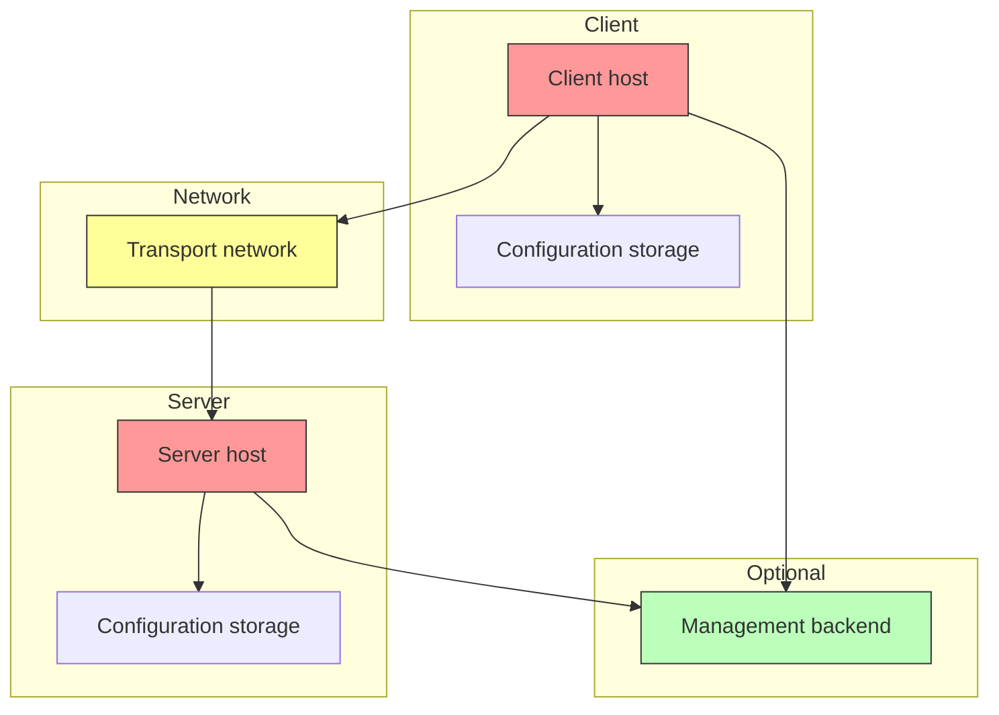
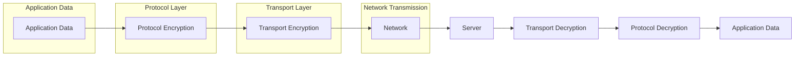
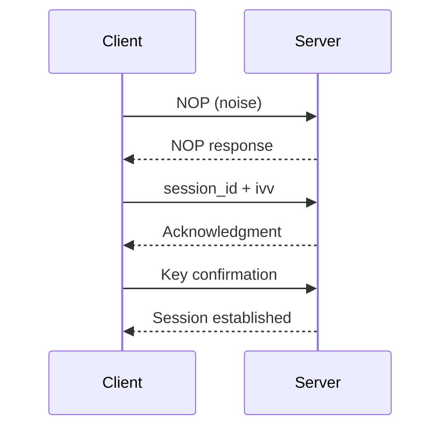
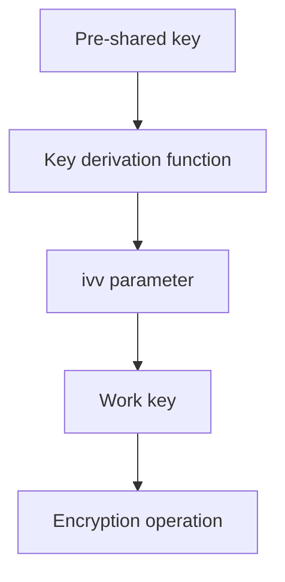

# Security Model and Defensive Interpretation

[中文版本](SECURITY_CN.md)

## Scope

This document explains the security posture of OPENPPP2 in a strictly code-fact-based manner. The goal is neither to wrap the project as a "mysterious and invincible" black box nor to flatten it to a single sentence saying "it's an encrypted tunnel". The real goal is to answer: what security-related work is actually implemented in the code, where the defensive value of these works comes from, which boundaries require trust, what can be said, and what cannot be overstated.

The main source code behind this document includes:

- `ppp/transmissions/ITransmission.cpp`
- `ppp/app/protocol/VirtualEthernetPacket.cpp`
- `ppp/configurations/AppConfiguration.cpp`
- `ppp/app/protocol/VirtualEthernetInformation.*`
- `ppp/app/server/VirtualEthernetSwitcher.*`
- `ppp/app/client/VEthernetNetworkSwitcher.*`
- Platform route, firewall, virtual adapter integration code

## OPENPPP2 Security Is Not a Single Point Capability

If only describing OPENPPP2 as "it encrypts traffic", such description is insufficient and misleading to readers.

From the code perspective, its defensive posture is multi-layered:

| Security Layer | Description |
|----------------|-------------|
| Session acceptance and handshake discipline | Strict handshake protocol and session_id validation |
| Connection-level work key derivation | Derive work keys based on pre-shared keys and ivv |
| Protected transmission framing | Encryption and framing protection |
| Static packet header and payload protection | Independent static encryption |
| Explicit session identification and policy objects | session_id and policy envelope |
| Route, DNS, mapping, exposure control | Network layer access control |
| Platform local execution points | Platform-specific security integration |
| Timeout and lifecycle cleanup discipline | Session timeout and cleanup |

Therefore, the security focus of this project is not a single algorithm name, but the overall behavior of multiple subsystems.

## ⚠️ Critical Clarification: FP, Not PFS

This is a very important clarification that must be explicitly stated:

### What Is PFS (Perfect Forward Secrecy)

**PFS (Perfect Forward Secrecy)** is a cryptographic property that requires each session to use independent keys, and the compromise of long-term keys should not lead to the compromise of historical session keys. Typical PFS implementations include:

- Diffie-Hellman (DH) key exchange
- Elliptic Curve Diffie-Hellman (ECDH)
- RSA variants using ephemeral keys

### What OPENPPP2 Implements

**OPENPPP2 does not implement PFS**, but implements **FP (Forward Security Assurance)**:

| Feature | PFS | FP (OPENPPP2) |
|---------|-----|---------------|
| Key exchange | Independent ephemeral keys per session | Pre-shared key + dynamic ivv |
| Long-term key protection | Long-term key compromise doesn't affect historical sessions | Pre-shared key + per-session ivv derivation |
| Implementation complexity | Requires DH/ECDH complex operations | Simple derivation based on pre-shared keys |
| Cryptographic basis | Discrete logarithm/elliptic curve problems | Symmetric encryption algorithms |

### How FP Mechanism Works

```mermaid
flowchart TD
    subgraph Key Derivation
        A[Pre-shared Key K] --> B[Key Derivation Function]
        B --> C[Session-specific ivv]
        C --> D[Work Key W = f(K, ivv)]
    end
    
    E[Work Key W] --> F[Data Encryption]
    F --> G[Encrypted transmission]
    
    H[Key compromise] -.->|Does not affect| D
    H -.->|Does not affect| G
    
    style H fill:#f99,stroke:#333
    style D fill:#9f9,stroke:#333
```

### Security Guarantees of FP

Although not PFS in the traditional sense, FP provides the following security guarantees:

1. **Session isolation**: Each session uses different ivv; even if the same client connects multiple times, different keys are used
2. **Historical protection**: If an attacker obtains the work key for a certain session, they still cannot decrypt previous sessions (because ivv is different)
3. **Key rotation**: Keys can be rotated by re-handshaking

### Why PFS Cannot Be Claimed

| PFS Feature | OPENPPP2 Actual Situation |
|-------------|--------------------------|
| Independent ephemeral keys per session | Uses pre-shared key + per-session different ivv |
| Long-term and short-term key separation | Pre-shared key participates in each key derivation |
| Requires public-key cryptography support | Pure symmetric cryptography implementation |

## Trust Boundaries

Understanding OPENPPP2 security requires clarifying trust boundaries:

### Trust Boundary Definitions

| Boundary | Location | Trusted Content | Risk Level |
|----------|----------|-----------------|-------------|
| Client host | Local runtime environment | OS, network stack, route configuration | High |
| Server host | Server runtime environment | OS, network stack, firewall | High |
| Transport network | Between client and server | Network operator, ISP, cloud provider | Medium |
| Management backend | Optional component | Policy distribution, identity verification | Medium |
| Local OS | Client/server | Network stack implementation | High |
| Configuration file | Local storage | Keys, certificates, backend credentials | High |



### Trust Assumptions for Each Boundary

**Client host**:
- Operating system network stack is trusted
- Local route configuration will not be maliciously modified
- Key storage is secure

**Server host**:
- Operating system is trusted
- Firewall configuration is correct
- Key storage is secure

**Transport network**:
- Network operator may monitor traffic patterns
- Potential man-in-the-middle attack risk (no certificate verification)
- Needs to rely on encryption protection

## Encryption Architecture

### Two-Layer Encryption Model

OPENPPP2 implements two layers of encryption:

| Layer | Name | Purpose | Key Source |
|-------|------|---------|-------------|
| Protocol layer | Protocol Encryption | In-tunnel data encryption | `protocol-key` + `ivv` |
| Transport layer | Transport Encryption | Transport link encryption | `transport-key` + `ivv` |



### Supported Encryption Algorithms

| Algorithm | Type | Description |
|-----------|------|-------------|
| `aes-128-cfb` | Symmetric encryption | 128-bit CFB mode |
| `aes-256-cfb` | Symmetric encryption | 256-bit CFB mode |
| `aes-128-gcm` | Symmetric encryption | 128-bit GCM mode |
| `aes-256-gcm` | Symmetric encryption | 256-bit GCM mode |
| `rc4` | Symmetric encryption | RC4 algorithm (deprecated, not recommended) |

### Optional Encryption Features

| Feature | Description | Risk |
|---------|-------------|------|
| `masked` | Traffic obfuscation | Low (increases identification difficulty) |
| `plaintext` | Plaintext transmission | **High risk** (disable) |
| `delta-encode` | Delta encoding | Low (compress data) |
| `shuffle-data` | Data randomization | Low (increases analysis difficulty) |

## Handshake Security

### Handshake Flow



### Handshake Security Measures

| Measure | Description |
|---------|-------------|
| NOP noise | Send random data before real handshake to create noise |
| session_id validation | Verify validity of session_id |
| ivv exchange | Exchange per-session unique ivv |
| Key confirmation | Verify key correctness |

### Handshake Security Analysis

**Security guarantees**:
- session_id uniqueness: Each connection generates unique session_id
- ivv dynamism: Each session uses different ivv
- Key derivation: Derive work keys from pre-shared key and ivv

**Security limitations**:
- Depends on security of pre-shared keys
- No public key certificate verification
- No Diffie-Hellman key exchange

## Static Packet Security

### Static Packet Encryption

Static packets (static datagrams) have an independent encryption path:

| Feature | Description |
|---------|-------------|
| Independent encryption | Uses independent static encryption key |
| Header protection | Packet headers are also encrypted |
| Payload protection | Payloads are encrypted |

### Static Packet Security Considerations

**Advantages**:
- Independent encryption channel from main tunnel
- Can use different encryption parameters

**Disadvantages**:
- Increased key management complexity
- Need to maintain additional key state

## Session Management Security

### session_id Management

| Feature | Description |
|---------|-------------|
| Uniqueness | Each session uses unique session_id |
| Length | Sufficient length to prevent guessing |
| Timeliness | Session expires after timeout |

### Session Timeout

| Parameter | Description | Default Value |
|-----------|-------------|---------------|
| `inactive.timeout` | Idle timeout | 60 seconds |
| `mux.inactive.timeout` | MUX idle timeout | 60 seconds |

### Session Cleanup

| Cleanup Condition | Description |
|-------------------|-------------|
| Timeout cleanup | Automatic cleanup after idle timeout |
| Active closure | Cleanup after receiving close signal |
| Exception cleanup | Cleanup on connection error |

## Network Layer Security

### Route Control

| Control Type | Description |
|--------------|-------------|
| bypass | Specified traffic bypasses tunnel |
| Policy routing | Route by rules |
| Smart routing | Automatic split routing |

### DNS Control

| Control Type | Description |
|--------------|-------------|
| DNS redirection | Redirect DNS queries |
| DNS cache | Local DNS cache |
| DNS split | Split by domain name |

### Port Mapping Control

| Control Type | Description |
|--------------|-------------|
| Mapping registration | Client registers port mapping |
| Mapping validation | Verify legitimacy of mapping requests |
| Mapping cleanup | Cleanup mappings when session ends |

## Platform Security Integration

### Windows Platform

| Security Feature | Description |
|------------------|-------------|
| LSP integration | Windows LSP layer integration |
| Firewall rules | Windows Firewall rule configuration |
| Network adapter | TUN/TAP adapter management |

### Linux Platform

| Security Feature | Description |
|------------------|-------------|
| TUN/TAP | Linux TUN/TAP device |
| Route protection | Prevent route conflicts |
| Network namespace | Support network namespace isolation |

### macOS Platform

| Security Feature | Description |
|------------------|-------------|
| utun interface | macOS utun interface |
| Permission check | Network permission check |
| Promiscuous mode | Optional promiscuous mode |

### Android Platform

| Security Feature | Description |
|------------------|-------------|
| VPN Service | Android VPN API |
| Permission handling | VPN permission request |
| Network interface | TUN interface |

## Key Management

### Key Storage

| Storage Location | Description |
|------------------|-------------|
| Configuration file | Keys in JSON configuration file |
| Environment variables | Can be passed via environment variables |
| Command line parameters | Not recommended (exposed in process list) |

### Key Derivation



### Key Rotation

| Method | Description |
|--------|-------------|
| Re-handshake | Rotate keys by re-handshaking |
| Session rebuild | Disconnect and rebuild session |

## Attack Surface Analysis

### Network Attack Surface

| Attack Type | Risk Level | Protection Measures |
|-------------|------------|---------------------|
| Man-in-the-middle | Medium | Encrypted tunnel protection |
| Traffic analysis | Low | Traffic obfuscation (optional) |
| Replay attack | Low | session_id and timestamp |
| Session hijacking | Medium | Encryption and key management |

### Local Attack Surface

| Attack Type | Risk Level | Protection Measures |
|-------------|------------|---------------------|
| Configuration leak | High | Secure key storage |
| Memory leak | Medium | Memory encryption (optional) |
| Process injection | High | Operating system security |

## Security Configuration Recommendations

### Required Configuration

| Configuration | Recommended Value | Description |
|---------------|-------------------|-------------|
| `protocol-key` | Strong random string | At least 16 characters |
| `transport-key` | Strong random string | At least 16 characters |
| `protocol` | aes-256-cfb | Recommended to use strong encryption |
| `transport` | aes-256-cfb | Recommended to use strong encryption |

### Recommended Configuration

| Configuration | Recommended Value | Description |
|---------------|-------------------|-------------|
| `masked` | true | Enable traffic obfuscation |
| `plaintext` | false | Disable plaintext transmission |
| `inactive.timeout` | 60 | Shorter idle timeout |

### Forbidden Configuration

| Configuration | Risk |
|---------------|------|
| `plaintext: true` | **Extreme risk**: All data transmitted in plaintext |
| Empty key | **High risk**: No encryption protection |
| Weak key | **High risk**: Easily cracked |

## Security-Related Code Locations

| Source File | Security-Related Content |
|-------------|--------------------------|
| `ITransmission.cpp` | Encryption, handshake, framing |
| `VirtualEthernetPacket.cpp` | Static packet encryption |
| `AppConfiguration.cpp` | Key configuration parsing |
| `VirtualEthernetInformation.*` | Policy envelope handling |
| `VirtualEthernetSwitcher.*` | Server security handling |
| `VEthernetNetworkSwitcher.*` | Client security handling |

## Summary

Understanding OPENPPP2's security model requires paying attention to the following points:

1. **FP, not PFS**: Implements Forward Security Assurance but not traditional PFS
2. **Multi-layer defense**: Security comes from the superposition of multiple subsystems
3. **Clear trust boundaries**: Need to clarify which components are trusted
4. **Correct configuration**: Security implementation depends on correct configuration
5. **Key management**: Key security is crucial
6. **Platform integration**: Each platform has its own security considerations

Understanding these principles is crucial for correctly evaluating and using OPENPPP2's security features.

## Related Documents

| Document | Description |
|----------|-------------|
| [ARCHITECTURE.md](ARCHITECTURE.md) | System Architecture Overview |
| [TRANSMISSION.md](TRANSMISSION.md) | Transmission Layer and Protected Tunnel Model |
| [HANDSHAKE_SEQUENCE.md](HANDSHAKE_SEQUENCE.md) | Handshake Sequence and Session Establishment |
| [PACKET_FORMATS.md](PACKET_FORMATS.md) | Packet Format and Wire Layout |
| [CONFIGURATION.md](CONFIGURATION.md) | Configuration Model and Key Configuration |
