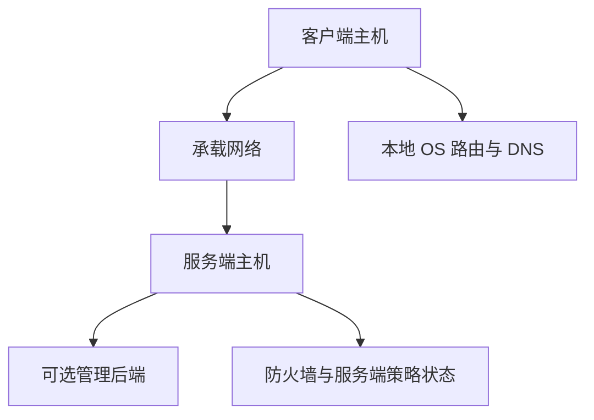
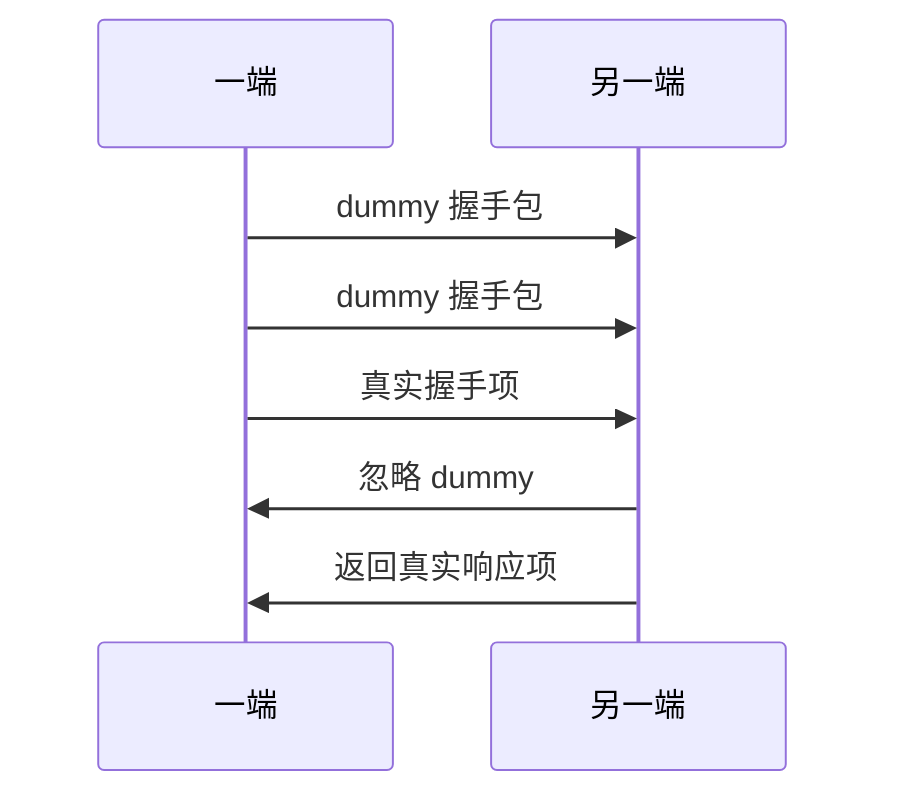

# 安全模型与防御性解读

[English Version](SECURITY.md)

## 文档范围

本文用严格基于代码事实的方式解释 OPENPPP2 的安全姿态。目标不是把项目包装成“神秘而无敌”的黑盒，也不是把它压扁成一句“这是条加密隧道”。真正的目标是回答：实现里到底做了哪些安全相关工作、这些工作的防御价值从哪里来、哪些边界需要信任、哪些话可以说、哪些话不能夸大。

本文背后的主要代码包括：

- `ppp/transmissions/ITransmission.cpp`
- `ppp/app/protocol/VirtualEthernetPacket.cpp`
- `ppp/configurations/AppConfiguration.cpp`
- `ppp/app/protocol/VirtualEthernetInformation.*`
- `ppp/app/server/VirtualEthernetSwitcher.*`
- `ppp/app/client/VEthernetNetworkSwitcher.*`
- 各平台路由、防火墙、虚拟网卡集成代码

## OPENPPP2 的安全不是单点能力

如果只把 OPENPPP2 写成“它会加密流量”，这种描述是不够的，而且会误导读者。

从代码看，它的防御姿态是多层组成的：

- 会话接纳与握手纪律
- 连接级工作密钥派生
- 受保护的传输帧化
- static packet 的头部和 payload 保护
- 显式的会话标识与策略对象
- 路由、DNS、mapping、暴露控制
- 平台本地执行点
- 超时与生命周期清理纪律

因此，这个工程的安全重心不是某一个算法名，而是多个子系统叠加后的整体行为。

## 信任边界

关键边界包括：

- 客户端主机
- 服务端主机
- 两者之间的 carrier 网络
- 可选管理后端
- 本地操作系统网络栈
- 本地路由和 DNS 策略文件
- 证书、私钥和后端密钥的存储位置

一个正确的部署必须把这些边界分开对待。

原因很简单：即使隧道本身的包保护做得很好，只要：

- route 文件写错
- DNS 规则把流量泄回本地
- mappings 随意暴露服务
- 后端密钥随意落盘或进仓库
- 平台上的路由保护被错误关闭

那么部署仍然可能是不安全的。

## 第一层防御：握手纪律

握手主要围绕 `ITransmission` 展开。

它不只是“交换一个 session id”这么简单，而是同时承担：

- 用 NOP 包注入 dummy 握手流量
- 区分真实握手项和 dummy 项
- 交换后续工作密钥整形所需的 `ivv`
- 通过 `nmux` 传递 mux 标记
- 对未完成握手执行超时清理

这点非常重要，因为它意味着 OPENPPP2 的会话建立不是“连上 socket，发个密码，开始传数据”这种模型。

## 握手噪声与 dummy 包

`Transmission_Handshake_Pack_SessionId(...)` 可以打出两类包：

- 真实握手包
- dummy 包

dummy 包的特征是首字节最高位被置 1。接收方在 `Transmission_Handshake_Unpack_SessionId(...)` 中看到这个标记后，会把它识别为可忽略噪声，然后继续读下一包。

它不是替代密码学，而是改变了握手早期流量形态，使首批字节交换不再是最小、最直白、最确定的控制流。

从攻防对抗视角看，这意味着早期流量分析面对的不是一组一一对应、过于规整的握手控制单元，而是一段带显式扰动的会话建立过程。

## `kh`、`kl` 与握手扰动规模

NOP 握手轮数不是固定常量，它由 `key.kh` 与 `key.kl` 共同影响。二者在配置加载时会被归一化，然后被 `Transmission_Handshake_Nop(...)` 用来推导握手噪声范围。

代码会先做：

- `1 << kl`
- `1 << kh`

然后在这个区间内随机取值，再缩放成实际 dummy 轮数。

这是代码中非常明确的“攻防对抗式流量扰动”特征之一。它至少说明一件事：OPENPPP2 并不希望自己的握手永远表现成完全刚性的固定前奏。

## 握手超时本身就是安全能力

`InternalHandshakeTimeoutSet()` 与 `InternalHandshakeTimeoutClear()` 不应只被看成“用户体验优化”。它们也是安全姿态的一部分。

原因在于：半开、模糊、长期滞留的握手状态，本身就会造成风险。它会：

- 消耗资源
- 增加状态清理难度
- 让排障和审计更困难
- 在高压环境下放大异常行为

当超时触发时，运行时会：

- 结束这段模糊窗口
- 再发一次 NOP
- 主动 `Dispose()`

这体现了工程的一种典型风格：不放任不明确状态无限存活。

## 连接级工作密钥派生

这是全工程最重要的安全主题之一，同时也是最容易被写夸的主题之一。

在握手中，客户端生成 `ivv` 并发送给服务端。之后双方都会把这个 `ivv` 序列化成字符串，拼接到配置中的基础 key 后面，重新创建 protocol 和 transport 两个 cipher。

在工程意义上，它意味着：

- 配置中的基础 key 不是所有连接最终直接共享的运行时工作 key
- 每个连接都会生成新的派生工作密钥状态
- 即使长期配置 key 相同，不同连接也不必完全复用相同的运行时 working state

这是真实存在、而且很重要的防御价值。

## 关于前向安全，究竟应该怎么写

用户明确要求文档必须深度说明前向安全。这里必须非常严谨。

### 代码支持我们明确写出的部分

代码支持明确写出：

- OPENPPP2 实现了会话级动态工作密钥派生
- 每次连接会通过新的 `ivv` 重建 cipher 工作状态
- 这比“所有连接直接重用原始静态工作 key”更安全

### 代码当前不能支持我们不加限定就写出的部分

在当前已阅读到的代码中，没有看到标准临时公钥协商例如 ECDHE 这类流程。因此，不能把“每连接新派生工作 key”偷换成“已经具备标准公钥协商意义下的 PFS”。

正确而克制的表达应该是：

- OPENPPP2 具备连接级动态工作密钥派生
- 这有助于降低长期静态工作密钥直接复用
- 但不能仅凭当前代码就无条件宣称具备标准临时公钥协商模型下的 PFS

这类表述的价值很大，因为基础设施文档一旦在安全表述上失去克制，就会立刻丧失可信度。

## 双层 cipher 设计

OPENPPP2 同时维护：

- protocol cipher
- transport cipher

这使它可以把：

- 帧元数据保护
- 业务负载保护

拆成两个逻辑层次。

在常规二进制路径中：

1. payload 可以先由 transport cipher 加密
2. payload length 等头部元数据可以由 protocol cipher 保护
3. 除 cipher 外，payload 和头部还会继续经过 masking、shuffle、delta 等处理

因此，正确理解不是“把 payload 一加密就完了”，而是“元数据和业务负载都被分别纳入保护管线”。

## 长度保护与帧形态扰动

传输路径里，长度头不会以赤裸的方式直接出现在固定二进制帧里。长度字段会经过：

- 可选的 protocol cipher 保护
- 与 header-derived key factor 做 XOR 掩码
- 字节重排
- delta encode

而在 static packet 路径里，header_length 也不是直接用真实值，而是走 `Lcgmod` 驱动的映射。

这点对攻防特别重要，因为大量流量分析和包格式识别，都首先利用“长度头稳定、直白、可预测”这一点。OPENPPP2 在这里投入了明显的复杂度成本来避免这种过于直接的形态。

## base94 路径也是防御层的一部分

base94 的作用必须解释清楚。

它不是整个工程安全性的唯一来源，但它属于防御故事的一部分，因为：

- 它把预握手 / plaintext 阶段和后续二进制阶段分开
- 它让第一个包和后续包的头格式不同
- 它让长度通过 base94 和额外变换表达
- 它让握手早期的线上格式不那么直白

因此，base94 属于“流量形态与帧结构防御”的一部分。

## `masked`、`shuffle-data`、`delta-encode`

这三个开关会明显影响传输与 static packet 的格式行为。

### `masked`

通过 `masked_xor_random_next` 做滚动 XOR 式掩码。

### `shuffle-data`

通过 key 相关的重排打乱字节顺序。

### `delta-encode`

为序列化字节增加 delta encode 层，并在接收端逆向恢复。

它们都不能被单独吹成“现代认证加密原语”，但它们和以下因素组合后，构成了工程的真实防御价值：

- cipher 状态
- 握手期密钥整形
- 元数据保护
- 包长扰动
- dummy 握手噪声

## `kx` 与握手期填充

`key.kx` 影响 session-id 握手包里随机填充的规模。握手 packer 会在整数串周围追加随机可打印字符和分隔符。

这不是密码学替代物，而是早期包形态扰动的一部分。

## `sb` 与 BufferSkateboarding

`key.sb` 属于工程更大范围的“包形态 / 缓冲形态动态化”控制量。

`BufferSkateboarding(int sb, int buffer_size, int max_buffer_size)` 不应被神化成不存在的专有加密算法。最准确的解释是：

- 在允许范围内，buffer size 会发生滑移
- 滑移受到基础大小和上限约束
- 结果是避免输出长期保持过于固定的一种尺寸模式

这与流量指纹对抗高度相关，因为稳定而机械的包尺寸分布经常会被利用。

## static packet format 的安全故事

`VirtualEthernetPacket.cpp` 里的 static packet path 有一套完整独立的安全相关行为。

它的包头包含：

- `mask_id`
- 混淆后的 `header_length`
- 混淆后的 `session_id`
- `checksum`
- posedo 源 / 目的地址和端口
- payload

打包时：

- 先生成非零随机 `mask_id`
- 再从 `key.kf * mask_id` 推导 per-packet `kf`
- 再对 `session_id` 做 XOR 与字节序整形
- 再计算 header + payload 的 checksum
- 再对 header body 做可选 protocol cipher
- 再对 payload 做可选 transport cipher
- 再对 `session_id` 之后的区域做 shuffle 与 masking
- 最后整体做 delta encode

解包时则按逆序一层层恢复。

这意味着 static mode 绝不是“原始 UDP 负载加一个 session id”。它本身就是一套有明显设计感的格式保护体系。

## checksum 与结构校验

不管是常规 transmission 路径还是 static packet 路径，代码都反复做结构合法性校验：

- header_length 必须合理
- payload_length 必须和读取量一致
- checksum 必须匹配
- 当协议语义要求时，地址和端口必须有效
- 零值或明显异常标识直接拒绝

这也是防御模型的一部分。很多网络系统的安全性，不在于“又多加了一种密钥”，而在于它是否持续、严格地拒绝结构不成立的输入。

## 会话标识本身就是安全状态

OPENPPP2 不把“一个已经连上的 socket”视为足够身份。会话标识被显式放进 `VirtualEthernetInformation` 等对象中，作为类型化状态存在。

这让策略可以绑定到明确的 session state，而不是散落在零碎 socket 变量上。这对以下能力很关键：

- 到期时间执行
- 剩余流量记账
- 带宽控制
- IPv6 分配绑定
- mapping 和 mux 的归属

这也是 OPENPPP2 很像基础设施软件的地方：安全和策略依附在显式、类型化的运行时状态上。

## 服务端执行点

服务端运行时，尤其是 `VirtualEthernetSwitcher` 及相关 exchanger，是一个重大安全边界，因为它决定一个已建立的受保护会话最终能做什么。

服务端执行点包括：

- 监听暴露控制
- 防火墙规则集成
- NAT 和转发策略
- 映射暴露行为
- 会话表维护
- 可选管理后端协同
- IPv6 租约与标识执行

因此，不能把安全理解成“握手成功就结束了”。握手只是把对端接入受保护状态，后续运行时仍需继续执行策略。

## 客户端执行点

客户端运行时同样是安全边界。

`VEthernetNetworkSwitcher` 控制：

- 哪些路由进入 overlay
- 哪些流量 bypass
- 哪些 DNS 查询被重定向或接管
- 是否开放本地 HTTP / SOCKS 代理
- 是否启用 static / mux 等能力
- 虚拟网卡如何在本机上落地

因此，即使隧道强度足够，route 和 DNS 策略一旦配置错误，也仍然会造成真实安全问题。在基础设施软件中，策略错误本身就是安全错误。

## 可选管理后端：增益与代价

Go backend 是可选的，这对韧性是好事，因为数据面不是一个控制器失联就彻底瘫痪的薄代理。

但一旦启用，后端也会成为新的信任边界和攻击面，引入：

- backend URL
- backend key
- 数据库凭据
- WebSocket 控制通道暴露

因此，文档必须把它写成“运维安全决策”，而不是轻描淡写的便利开关。

## 反向映射与暴露控制

FRP 风格 mapping 能力非常强，因此也非常敏感。

它本质上允许系统把内部服务经由 overlay 暴露出去。所以每一个 mapping 决策都应被视作：

- 开了一条新的服务发布路径
- 增加了一块新的可攻击面

它绝不能被写成“只是一个转发小功能”。

## IPv6 的安全相关性

服务端 IPv6，尤其是在 Linux 上的完整实现，会引入另一组安全责任：

- 租约分配
- 地址与 session 绑定
- prefix 与 gateway 管理
- neighbor proxy 行为
- IPv6 源地址校验

客户端侧对“发出的 IPv6 source 必须等于分配地址”的约束，就是这个模型的一部分。它不希望 IPv6 身份在拿到之后变成松散漂移状态。

## 平台安全差异不是装饰性的

必须特别强调：平台差异不是“只是调用不同 API”，它会实实在在影响安全姿态。

### Windows

- 存在系统代理联动路径
- Wintun 与 TAP-Windows 的运行特性不同
- Windows 专用 helper command 会改变系统网络姿态

### Linux

- route protect 与 interface bind 非常关键
- `/dev/tun`、multiqueue、IPv6 server path 都有各自风险点
- Linux 当前承载了最完整的 IPv6 服务端实现

### macOS

- `utun` 改变了虚拟网卡落地方式
- 功能面与 Linux 不完全等价

### Android

- VPN fd 注入与 protect-socket 机制决定了另一套信任模型

所以任何严肃的安全文档，都不能暗示“同一份配置在所有平台上风险完全一样”。

## 攻击面清单

实际攻击面包括：

- TCP 监听
- WS 监听
- WSS 监听与证书链管理
- 启用时的本地 HTTP / SOCKS 代理监听
- FRP 风格反向映射入口
- static packet path 端点
- backend 控制连接
- route 规则文件
- DNS 规则文件
- firewall 规则文件
- 平台特权网络操作辅助逻辑

功能面越宽，能力越强，同时攻击面越大。这是基础设施型软件的现实，不是缺点，但必须诚实说明。

## 密钥与敏感信息管理

至少以下内容必须按敏感信息管理：

- `protocol-key`
- `transport-key`
- `server.backend-key`
- `client.server-proxy` 中的凭据
- `websocket.ssl.certificate-key-password`
- backend 数据库凭据
- Redis 凭据

这些信息都不应出现在公开仓库或长期共享的样例配置里。

## OPENPPP2 真正擅长的安全方向是什么

从代码看，OPENPPP2 最强的安全特征，不是“某个特别炫的算法名字”，而是它作为基础设施软件时的整体纪律性：

- 显式会话状态
- 显式拓扑与策略
- 有意识的握手扰动
- 连接级工作密钥派生
- 路由与 DNS 的明确控制
- 通过 mapping 显式暴露服务，而不是意外暴露
- 平台本地执行，而不是假装完全抽象统一
- 超时与清理纪律

这是一种非常基础设施化的安全模型。

## OPENPPP2 不能帮你跳过什么

因为它是基础设施型工程，所以它不会替运维者跳过架构责任。你仍然必须自己做对：

- 哪些监听器真的应该开放
- 哪些 mappings 真的应该存在
- 当前是全隧道还是分流隧道
- DNS 规则是否会导致泄漏
- 系统代理联动该不该开
- Linux route protect 是否应保持启用
- static 或 mux 是否真的必要

因此，这个工程的安全很大一部分来自“纪律化配置与生命周期控制”，而不只是密码学层本身。

## 防御性总结

最准确的总结是：

OPENPPP2 的安全模型来自以下多层组合：

- 握手噪声与握手清理
- 连接级工作密钥派生
- 双层受保护帧化
- 包形态动态化与元数据保护
- 类型化会话策略执行
- route、DNS、mapping、IPv6 控制
- 平台本地特权执行点

因此，它应被描述成一套“安全意识很强的网络基础设施运行时”，而不是一条单独的“隐蔽协议”，更不是一个安全故事能被某一个 cipher label 概括完毕的系统。

## 相关文档

- [`TRANSMISSION_CN.md`](TRANSMISSION_CN.md)
- [`HANDSHAKE_SEQUENCE_CN.md`](HANDSHAKE_SEQUENCE_CN.md)
- [`PACKET_FORMATS_CN.md`](PACKET_FORMATS_CN.md)
- [`ROUTING_AND_DNS_CN.md`](ROUTING_AND_DNS_CN.md)
