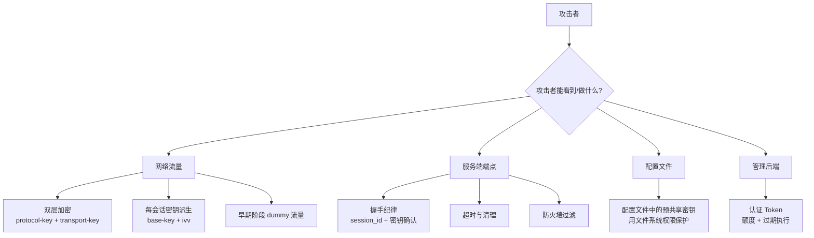
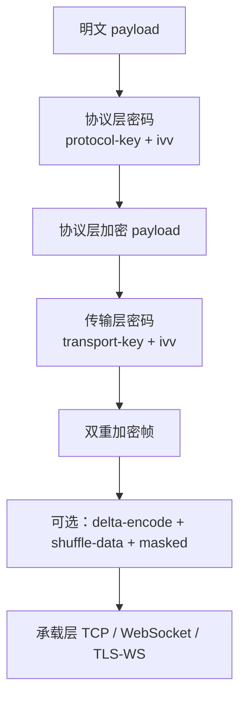
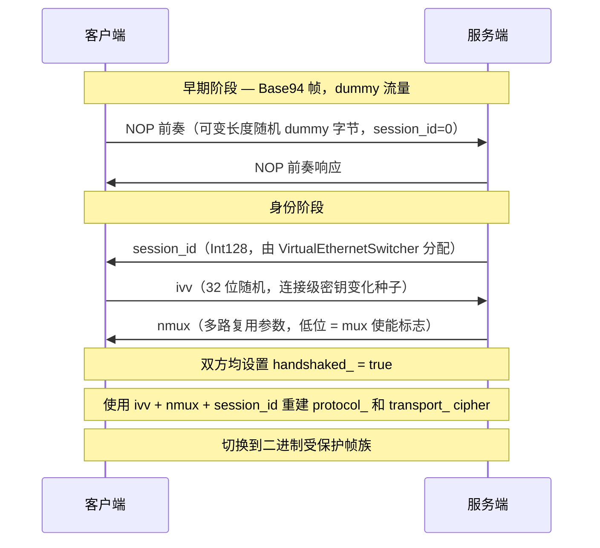
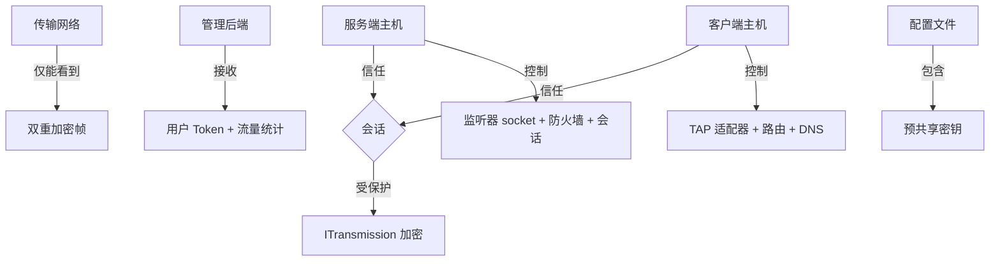
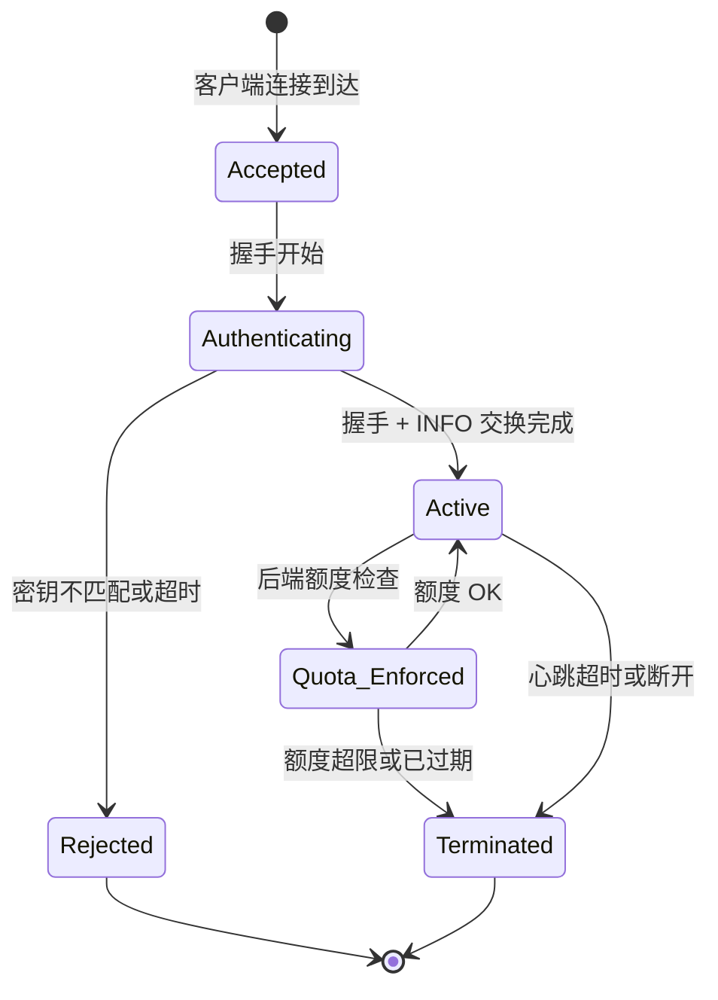
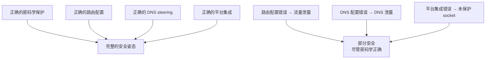
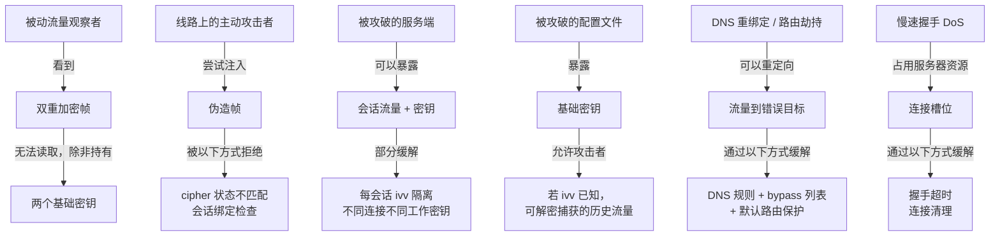

# 安全模型

[English Version](SECURITY.md)

## 1. 范围

本文用代码事实解释 OPENPPP2 的安全姿态。

目标是准确性：本文描述代码实际做了什么，不夸大任何声明。

---

## 2. 核心安全模型

OPENPPP2 不只是一个加密隧道。它的防御价值来自多个协调层次：



---

## 3. 重要澄清：FP，而不是 PFS

OPENPPP2 不实现传统意义上的完美前向保密（PFS）。

| 属性 | PFS（如带 DHE 的 TLS 1.3） | OPENPPP2 FP |
|------|---------------------------|-------------|
| 密钥交换机制 | 每会话临时公钥交换 | 预共享基础密钥 + 连接级 ivv |
| 泄露影响 | 即使长期密钥泄露，历史会话也安全 | 若基础密钥泄露，使用相同基础密钥的会话面临风险 |
| 会话隔离 | 完全隔离：每会话不同 DH 值 | 部分隔离：每会话不同 ivv，但基础密钥相同 |
| 实现复杂度 | 高（需要非对称密码） | 低（对称加密 + KDF） |
| 量子抵抗 | 取决于所选算法 | 未处理 |

OPENPPP2 提供**前向隐私（FP）**：通过 `ivv` 实现每会话密钥隔离，但不能抵御"先捕获流量、后获取基础密钥"的攻击者。

### 密钥派生细节

```
工作密钥 = KDF(基础密钥, ivv + nmux + session_id)

protocol_working_key  = KDF(key.kcp.protocol,  ivv + nmux + session_id)
transport_working_key = KDF(key.kcp.transport, ivv + nmux + session_id)
```

`ivv` 是客户端在握手期间生成的 32 位随机值。每条连接得到不同的 `ivv`，因此即使基础密钥相同，不同连接的工作密钥也不同。

---

## 4. 加密架构

每条连接应用两个独立的密码层：



### 4.1 密钥参数

| 参数 | 配置键 | 用途 |
|------|--------|------|
| 协议密钥 | `key.kcp.protocol` | 协议层密码基础密钥 |
| 传输密钥 | `key.kcp.transport` | 传输层密码基础密钥 |
| 协议密码算法 | `key.protocol` | 协议层 cipher 算法（如 `aes-256-cfb`） |
| 传输密码算法 | `key.transport` | 传输层 cipher 算法 |
| `ivv` | 每连接协商 | 连接级密钥变化种子 |
| `kf`、`kh`、`kl`、`kx`、`sb` | `key.*` | 帧化和 session binding 辅助密钥材料 |

### 4.2 可选曝光控制

| 标志 | 配置键 | 效果 |
|------|--------|------|
| `masked` | `key.masked` | 在密文上额外添加掩码层 |
| `plaintext` | `key.plaintext` | 完全禁用加密（仅开发/测试，生产必须 false） |
| `delta-encode` | `key.delta-encode` | 对密文字节进行差分编码 |
| `shuffle-data` | `key.shuffle-data` | 对 payload 字节做置换混洗 |

这些标志影响流量整形和抗分析能力，**不能**替代正确的密钥配置。

### 4.3 为什么要分两层密码

分开使用 protocol cipher 和 transport cipher 有以下安全原因：

- **协议层密码**保护帧头元数据——包括长度信息，这些信息若泄露可用于流量形态指纹识别（包长直方图攻击）。
- **传输层密码**保护 payload 内容。
- 即使某一 cipher 被破解，另一个仍保护其对应的数据层。
- 两个 cipher 使用不同的基础密钥，来自不同配置字段。

---

## 5. 握手安全

`ITransmission` 握手防御被动流量分析和连接探测：



握手的安全属性：

| 属性 | 实现机制 |
|------|---------|
| 被动流量分析抵抗 | NOP 前奏使用随机长度和内容，掩盖握手模式 |
| 会话绑定 | `session_id` 将逻辑会话绑定到特定传输连接 |
| 每会话密钥变化 | `ivv` 交换建立连接专属 cipher 状态 |
| 密钥确认 | `ivv` 只有知道基础密钥的一方才能正确使用；密钥错误 → cipher 状态不匹配 → 连接丢弃 |
| 抗重放 | `session_id` 每次连接新鲜分配；重放旧会话的 session_id 会导致查找失败 |

### 5.1 握手超时

握手受可配置超时时间限制（`tcp.connect.timeout`）。如果握手未在规定时间内完成，连接将被丢弃。这限制了服务器资源对不完整连接的暴露（缓解慢速握手 DoS 攻击）。

源文件：`ppp/transmissions/ITransmission.h`、`ppp/app/server/VirtualEthernetSwitcher.cpp`

### 5.2 Dummy 流量细节

NOP 前奏字节是结构化的 dummy 流量，不是空字节：

- 当 `session_id == 0` 时，打包器将第一个字节的高位置 1，并生成随机长度的随机 payload。
- 接收方通过这个高位 bit 识别并丢弃 dummy 包。
- 可以连续发送多个 dummy 包，以改变流量模式。
- 这使被动观察者无法通过结构或时序识别握手。

---

## 6. 信任边界



| 信任边界 | 若被攻破的风险 | 缓解措施 |
|---------|--------------|---------|
| 客户端主机 | 路由操纵、DNS 欺骗、密钥暴露 | 配置文件文件系统 ACL；路由保护 |
| 服务端主机 | 会话状态被攻破、密钥暴露 | 文件系统 ACL；每部署使用独立密钥 |
| 传输网络 | 流量捕获 | 双层 cipher；dummy 流量；delta-encode |
| 管理后端 | 认证绕过、额度操纵 | 后端使用 WSS/HTTPS；backend-key 认证 |
| 配置文件 | 基础密钥暴露 | `chmod 600 appsettings.json`；不提交到版本控制 |

---

## 7. 会话与策略对象

服务端为每个连接的客户端维护显式会话对象（`VirtualEthernetExchanger`）。

每个会话持有：
- 会话标识（`Int128` session_id）
- 流量计数器（入/出字节数）
- 额度与过期状态（如使用了管理后端）
- 防火墙引用
- 映射状态（如启用了 FRP 映射）
- IPv6 租约状态（如启用了 IPv6 transit）

会话对象在连接结束时被显式清理。清理不只是资源释放——它还回滚宿主侧副作用（路由条目、DNS 配置、NDP proxy 条目）。

源文件：`ppp/app/server/VirtualEthernetExchanger.h`

### 7.1 会话生命周期与安全



---

## 8. 路由与 DNS 作为安全控制

路由和 DNS 不只是运维问题。它们是安全边界的一部分：

| 控制 | 安全相关性 | 源文件 |
|------|-----------|--------|
| Bypass IP 列表 | 控制哪些目标绕过隧道——配置错误导致流量泄露 | `VEthernetNetworkSwitcher` |
| DNS steering 规则 | 控制每个域名使用哪个 resolver——错误的 resolver 导致 DNS 泄露 | `VEthernetNetworkSwitcher` |
| 默认路由保护 | 防止隧道流量意外泄露到物理接口 | 路由管理逻辑 |
| DNS 服务器可达性路由 | 确保 DNS 查询走正确路径 | 路由设置逻辑 |
| 服务端可达性路由 | 确保隧道控制流量走正确路径（不递归进入隧道） | 路由设置逻辑 |

路由配置错误可能导致：
- DNS 查询泄露到错误的 resolver（即使加密正确）
- 应进隧道的流量绕过它（流量泄露）
- 服务端连接流量意外循环（连接失败）

源文件：`ppp/app/client/VEthernetNetworkSwitcher.h`

---

## 9. 平台级安全

平台集成影响安全边界：

| 平台 | 安全相关的集成 | 配置错误的风险 |
|------|--------------|--------------|
| Windows | Socket 保护（`protect_system`）、QUIC 优先级控制、WFP 过滤 | WFP 规则错误时受保护 socket 仍可能泄露 |
| Linux | `iptables` / `nftables` 转发、`ip route` 管理、IPv6 NDP proxy | 转发规则错误导致 IP 泄露 |
| Android | `VpnService.protect()` socket 保护、JNI 桥错误映射 | 未保护的 socket 递归进入隧道 → 连接失败 |
| macOS | `pf` / `route` 集成、BSD 路由 socket | `pf` 规则干扰隧道流量 |

平台侧副作用是信任边界的一部分，不是背景噪声。平台状态不正确可能破坏正确的密码学保护。



---

## 10. Static UDP 路径安全

Static UDP 包在主 `ITransmission` 分帧路径之外发送。

安全影响：
- Static UDP 使用自己的密钥和加密状态（与主会话密钥不同）。
- 聚合器模式的 Static UDP 使用多个服务端端点——所有端点都必须是可信的。
- Static UDP 服务器列表中的条目应被验证为合法的服务器节点。
- Static UDP 面临 UDP 层的放大和欺骗风险——服务端防火墙规则应限制哪些源 IP 可以发送 static UDP 包。

配置：

```json
"udp": {
    "static": {
        "aggligator": 4,
        "servers": ["trusted-server-1:20000", "trusted-server-2:20000"]
    }
}
```

---

## 11. FRP 反向映射安全

FRP（快速反向代理）映射功能通过服务端将客户端侧的服务暴露给外部世界。

安全注意事项：

1. **被暴露服务的可达性**：已注册的 FRP 映射使客户端侧服务从服务端网络可达——审查哪些服务正在被暴露。
2. **注册认证**：映射注册应通过管理后端认证。没有后端时，任何持有有效会话凭证的客户端均可注册任意端口。
3. **端口范围控制**：服务端防火墙规则应限制客户端允许注册的端口范围。
4. **FRP UDP 中继安全**：`PacketAction_FRP_SENDTO` 中继原始 UDP 数据报——确保目标服务安全地通过 UDP 暴露。

源文件：`ppp/app/server/VirtualEthernetSwitcher.h`

---

## 12. 威胁模型总结



---

## 13. 代码实际证明了什么

代码**能**证明：
- 存在会话级工作密钥派生并被应用（`ivv` + `nmux` + `session_id` → 工作密钥）。
- 每条连接使用两个独立的密码层（`ITransmission` 中的 `protocol_` 和 `transport_` 槽位）。
- 握手早期阶段会发送 dummy 流量（NOP 前奏）。
- protocol cipher 和 transport cipher 分开维护，使用不同基础密钥。
- 会话清理是显式且刻意的（`compare_exchange_strong` dispose 模式）。
- 路由和 DNS 状态从多个受控输入构建（`VEthernetNetworkSwitcher`）。
- 握手有有界超时时间（可配置，在 `ITransmission` 中执行）。

代码**不能**证明：
- 对所有攻击者模型的形式化保密性。
- 抵抗量子攻击者。
- 预共享基础密钥被攻破时的保护。
- 抵抗实现级侧信道攻击。
- 对记录了流量并随后获取基础密钥的攻击者的完整前向保密。

---

## 14. 错误码参考

安全相关的 `ppp::diagnostics::ErrorCode` 值：

| ErrorCode | 描述 | 来源 |
|-----------|------|------|
| `HandshakeFailed` | 握手序列执行失败 | `ITransmission::HandshakeClient/Server` |
| `HandshakeTimeout` | 握手超过配置的超时时间 | `ITransmission` 超时逻辑 |
| `AuthenticationFailed` | 被服务端或后端拒绝认证 | `VirtualEthernetSwitcher` |
| `SessionKeyDerivationFailed` | 无法从基础密钥 + ivv 派生工作密钥 | cipher 初始化 |
| `ManagedServerAuthenticationFailed` | 后端拒绝用户认证 | `VirtualEthernetManagedServer` |
| `ManagedServerQuotaExceeded` | 用户额度耗尽 | `VirtualEthernetManagedServer` |
| `ManagedServerUserExpired` | 用户订阅已过期 | `VirtualEthernetManagedServer` |
| `TlsNegotiationFailed` | TLS 协商失败（WSS 承载） | `ISslWebsocketTransmission` |
| `SessionDisposed` | 会话已被释放 | Dispose 模式 |
| `KeepaliveTimeout` | 心跳超时 | `DoKeepAlived` |

---

## 15. 运维安全检查清单

**配置安全：**
- [ ] 预共享密钥（`key.kcp.protocol`、`key.kcp.transport`）每次部署唯一，并以文件系统级访问控制存储（`chmod 600 appsettings.json`）。
- [ ] 生产环境中 `plaintext` 为 `false`。
- [ ] `key.protocol` 和 `key.transport` 设置为强 cipher（如 `aes-256-cfb`、`chacha20`）。
- [ ] `appsettings.json` 不提交到版本控制系统。

**网络安全：**
- [ ] Bypass IP 列表和 DNS 规则审查覆盖范围——无意外流量绕过。
- [ ] 启用默认路由保护以防止隧道流量泄露。
- [ ] Static UDP 服务器列表仅包含可信、受控的端点。
- [ ] FRP 映射注册经过审查并受服务端防火墙约束。

**服务端安全：**
- [ ] 管理后端使用 HTTPS 或 WSS，而非明文 HTTP/WS。
- [ ] 握手超时设置适当（不宜过长，防止慢速握手 DoS）。
- [ ] 服务端防火墙规则审查已暴露的端口（TCP/UDP 监听器）。
- [ ] 服务端日志路径已配置，日志存储有适当的访问控制。

**平台安全：**
- [ ] Linux：`iptables`/`nftables` 规则正确；IPv6 transit 的 NDP proxy 条目正确。
- [ ] Windows：Wintun 或 TAP-Windows 驱动来自可信来源；WFP 规则已审查。
- [ ] Android：所有 OPENPPP2 控制 socket 均已调用 `VpnService.protect()`。
- [ ] macOS：`pf` 规则不干扰隧道流量。

---

## 16. 安全相关配置示例

```json
{
    "key": {
        "kcp": {
            "protocol": "strong-random-protocol-secret-at-least-32-chars",
            "transport": "strong-random-transport-secret-at-least-32-chars"
        },
        "protocol": "aes-256-cfb",
        "transport": "aes-256-cfb",
        "masked": true,
        "plaintext": false,
        "delta-encode": true,
        "shuffle-data": true
    },
    "tcp": {
        "connect": { "timeout": 5 }
    },
    "server": {
        "backend": "wss://management.example.com:8443/",
        "backend-key": "strong-backend-auth-key"
    }
}
```

---

## 17. 遗留密码学警告

OPENPPP2 在启动时于 `AppConfiguration::Loaded()` 中验证密码配置。
当检测到遗留或弱密码设置时，系统会发出非致命 `kWarning` 错误码。
**这些警告永远不会阻断启动。** 遗留算法保持完全功能，以保证现有部署的向后兼容性。

### 17.1 警告码

| 错误码 | 触发条件 |
|--------|---------|
| `ConfigWeakKeyDefault` | `protocol_key` 或 `transport_key` 等于已知默认值 `"ppp"` |
| `ConfigWeakKeyShort` | `protocol_key` 或 `transport_key` 长度小于 8 字节 |
| `ConfigPlaintextEnabled` | `key.plaintext` 为 `true` |
| `ConfigLegacyCipherAlgorithm` | `key.protocol` 或 `key.transport` 使用遗留算法族（RC4、DES/3DES、Blowfish、CAST5、SEED、IDEA） |
| `ConfigLegacyCipherShortKey` | 密码算法密钥长度（通过 OpenSSL EVP 解析）低于 128 位 |
| `ConfigLegacyKdfMd5` | 内部密钥派生使用 MD5（通过 `EVP_BytesToKey`）；密码配置验证时作为信息性警告发出，在 KDF 可配置之前无用户操作 |

### 17.2 遗留算法族

| 算法族 | 示例名称 | 废弃原因 |
|--------|---------|---------|
| RC4 | `rc4`、`rc4-md5`、`rc4-sha` | 密钥流存在偏差；已有实际攻击 |
| DES/3DES | `des-cbc`、`des-cfb`、`des-ede` | DES 为 56 位密钥，且同属 64 位分组遗留算法；存在暴力破解和 Sweet32 类风险 |
| Blowfish | `bf-cbc`、`bf-cfb` | 64 位分组；Sweet32 攻击面 |
| CAST5 | `cast5-cbc`、`cast5-cfb` | 64 位分组；已废弃 |
| SEED | `seed-cbc`、`seed-cfb` | 采用率有限；无现代安全审查 |
| IDEA | `idea-cbc`、`idea-cfb` | 64 位分组；采用率有限 |

### 17.3 推荐的现代配置

新部署应使用当前已支持的最强非遗留密码和强唯一密钥：

```json
{
    "key": {
        "protocol": "aes-256-cfb",
        "protocol-key": "<随机 32 字节十六进制或密码短语>",
        "transport": "aes-256-cfb",
        "transport-key": "<不同随机 32 字节十六进制或密码短语>",
        "kf": 154543927,
        "kx": 128,
        "kl": 10,
        "kh": 12,
        "sb": 1000,
        "masked": true,
        "plaintext": false,
        "delta-encode": true,
        "shuffle-data": true
    }
}
```

**密钥建议：**

| 方面 | 最低要求 | 推荐配置 |
|------|---------|---------|
| 密码算法 | AES-128-CFB | 当前使用 AES-256-CFB；AEAD（如 AES-256-GCM 或 ChaCha20-Poly1305）需在项目支持确认后启用 |
| 密钥长度 | 128 位 | 256 位 |
| 密码短语长度 | 8 字节 | 16+ 随机字符 |
| `plaintext` | `false` | `false`（始终） |
| `masked` | `false` | `true` |
| `delta-encode` | `false` | `true` |
| `shuffle-data` | `false` | `true` |

> **注意：** 项目当前默认值（`aes-128-cfb` / `aes-256-cfb`）在 `key.protocol` 或
> `key.transport` 为空或不被支持时仍作为内置回退值。CFB 模式不是 AEAD，
> 不提供密文完整性保护，但不会触发警告，因为它是项目既定基线。
> 在目标构建确认支持后迁移到 AEAD 可提供认证保护，并消除对单独协议层密码保护头元数据的需求。

---

## 相关文档

- [`TRANSMISSION_CN.md`](TRANSMISSION_CN.md) — cipher 槽位细节、帧化、握手序列
- [`HANDSHAKE_SEQUENCE_CN.md`](HANDSHAKE_SEQUENCE_CN.md) — 逐步握手时序
- [`ARCHITECTURE_CN.md`](ARCHITECTURE_CN.md) — 系统架构与组件信任边界
- [`TUNNEL_DESIGN_CN.md`](TUNNEL_DESIGN_CN.md) — 逐层隧道设计
- [`ROUTING_AND_DNS_CN.md`](ROUTING_AND_DNS_CN.md) — 路由与 DNS 安全控制
- [`MANAGEMENT_BACKEND_CN.md`](MANAGEMENT_BACKEND_CN.md) — 后端认证与额度执行
- [`EDSM_STATE_MACHINES_CN.md`](EDSM_STATE_MACHINES_CN.md) — 会话生命周期与 dispose 模式
