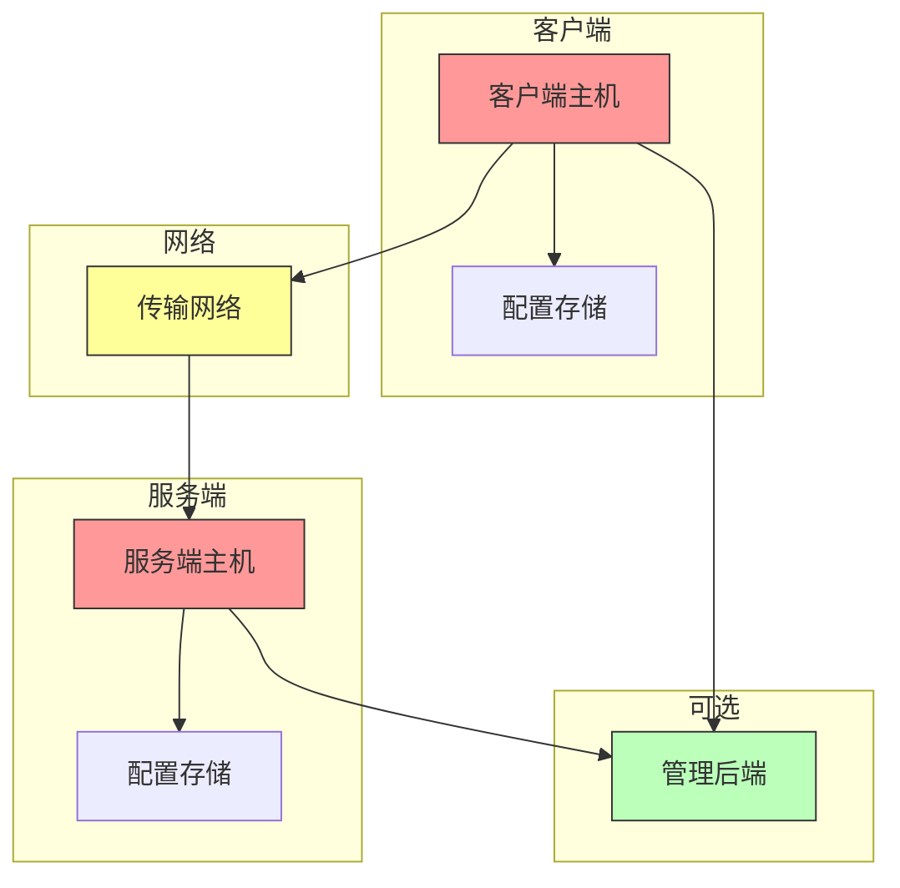
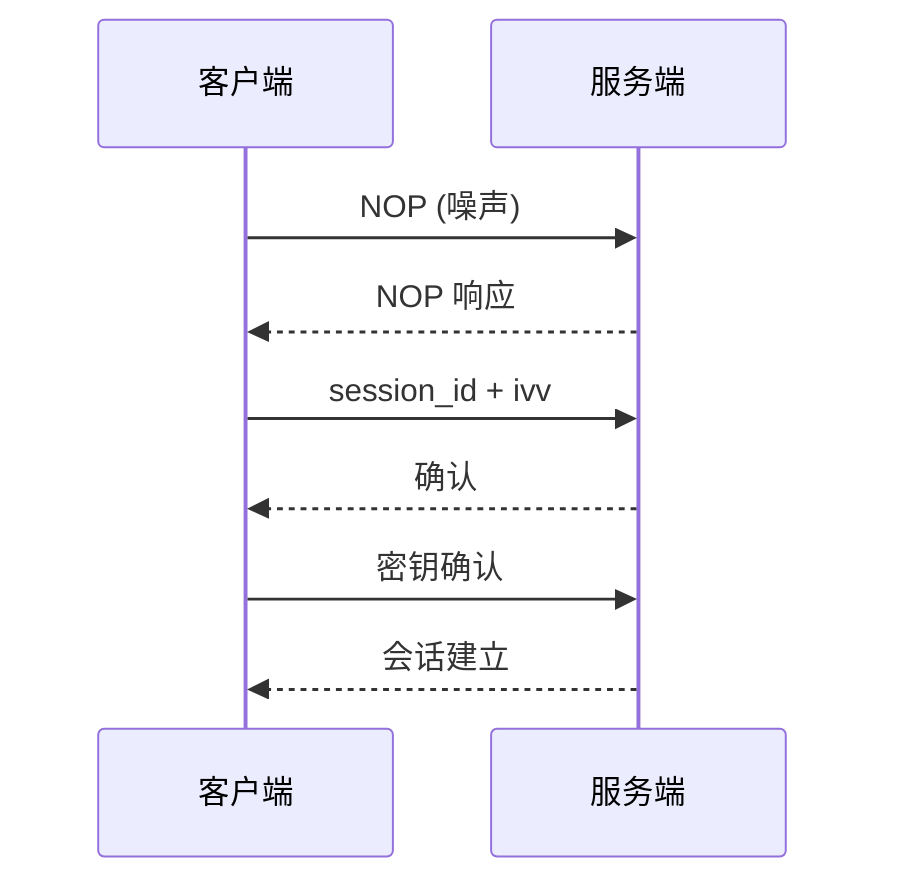
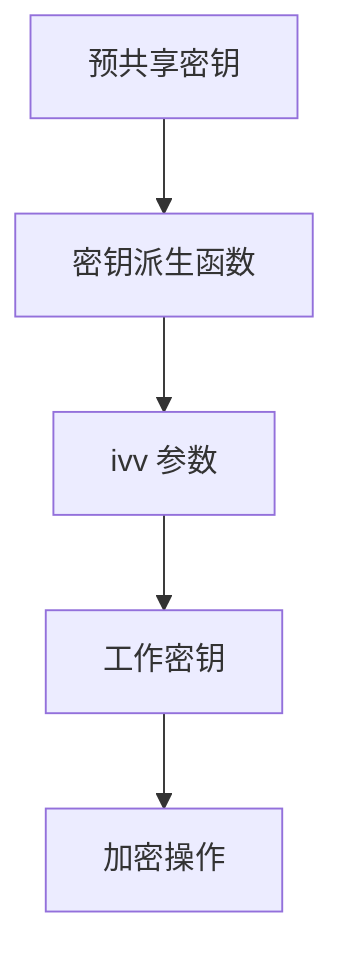

# 安全模型与防御性解读

[English Version](SECURITY.md)

## 文档范围

本文档用严格基于代码事实的方式解释 OPENPPP2 的安全姿态。目标不是把项目包装成"神秘而无敌"的黑盒，也不是把它压扁成一句"这是条加密隧道"。真正的目标是回答：实现里到底做了哪些安全相关工作、这些工作的防御价值从哪里来、哪些边界需要信任、哪些话可以说、哪些话不能夸大。

本文背后的主要源码包括：

- `ppp/transmissions/ITransmission.cpp`
- `ppp/app/protocol/VirtualEthernetPacket.cpp`
- `ppp/configurations/AppConfiguration.cpp`
- `ppp/app/protocol/VirtualEthernetInformation.*`
- `ppp/app/server/VirtualEthernetSwitcher.*`
- `ppp/app/client/VEthernetNetworkSwitcher.*`
- 各平台路由、防火墙、虚拟网卡集成代码

## OPENPPP2 的安全不是单点能力

如果只把 OPENPPP2 写成"它会加密流量"，这种描述是不够的，而且会误导读者。

从代码看，它的防御姿态是多层组成的：

| 安全层次 | 说明 |
|----------|------|
| 会话接纳与握手纪律 | 严格的握手协议和 session_id 校验 |
| 连接级工作密钥派生 | 基于预共享密钥和 ivv 派生工作密钥 |
| 受保护的传输帧化 | 加密和帧化保护 |
| static packet 的头部和 payload 保护 | 独立的 static 加密 |
| 显式的会话标识与策略对象 | session_id 和 policy envelope |
| 路由、DNS、mapping、暴露控制 | 网络层访问控制 |
| 平台本地执行点 | 各平台安全集成 |
| 超时与生命周期清理纪律 | 会话超时和清理 |

因此，这个工程的安全重心不是某一个算法名，而是多个子系统叠加后的整体行为。

## ⚠️ 关键澄清：FP 而非 PFS

这是一个非常重要的澄清，必须明确说明：

### 什么是 PFS（Perfect Forward Secrecy）

**PFS（Perfect Forward Secrecy）** 是一种密码学属性，要求每次会话使用独立的密钥，并且长期密钥的泄露不会导致历史会话密钥的泄露。典型的 PFS 实现包括：

- Diffie-Hellman (DH) 密钥交换
- Elliptic Curve Diffie-Hellman (ECDH)
- 使用临时密钥的 RSA 变体

### OPENPPP2 实现的是什么

**OPENPPP2 没有实现 PFS**，但实现了 **FP（Forward Security Assurance，前向安全保证）**：

| 特性 | PFS | FP (OPENPPP2) |
|------|-----|---------------|
| 密钥交换 | 每次会话使用独立的临时密钥 | 预共享密钥 + 动态 ivv |
| 长期密钥保护 | 长期密钥泄露不影响历史会话 | 长期密钥 + 每次会话 ivv 派生 |
| 实现复杂度 | 需要 DH/ECDH 复杂运算 | 基于预共享密钥的简单派生 |
| 密码学基础 | 离散对数/椭圆曲线难题 | 对称加密算法 |

### FP 机制的工作原理

```mermaid
flowchart TD
    subgraph 密钥派生
        A[预共享密钥 K] --> B[密钥派生函数]
        B --> C[会话特定 ivv]
        C --> D[工作密钥 W = f(K, ivv)]
    end
    
    E[工作密钥 W] --> F[数据加密]
    F --> G[密文传输]
    
    H[密钥泄露] -.->|不影响| D
    H -.->|不影响| G
    
    style H fill:#f99,stroke:#333
    style D fill:#9f9,stroke:#333
```

### FP 的安全保证

虽然不是传统意义上的 PFS，但 FP 提供了以下安全保证：

1. **会话隔离**：每次会话使用不同的 ivv，即使同一个客户端多次连接，使用的密钥也不同
2. **历史保护**：如果攻击者获取了某一时刻的工作密钥，仍然无法解密之前的会话（因为 ivv 不同）
3. **密钥轮换**：可以通过重新握手来轮换密钥

### 不能声称 PFS 的原因

| PFS 特性 | OPENPPP2 实际情况 |
|----------|-------------------|
| 每次会话使用独立临时密钥 | 使用预共享密钥 + 每次会话不同的 ivv |
| 长期密钥与短期密钥分离 | 预共享密钥参与每次密钥派生 |
| 需要公钥密码学支撑 | 纯对称密码学实现 |

## 信任边界

理解 OPENPPP2 的安全，需要明确信任边界：

### 信任边界定义

| 边界 | 位置 | 信任内容 | 风险等级 |
|------|------|----------|----------|
| 客户端主机 | 本地运行环境 | 操作系统、网络栈、路由配置 | 高 |
| 服务端主机 | 服务端运行环境 | 操作系统、网络栈、防火墙 | 高 |
| 传输网络 | 客户端与服务端之间 | 网络运营商、ISP、云服务商 | 中 |
| 管理后端 | 可选组件 | 策略下发、身份验证 | 中 |
| 本地操作系统 | 客户端/服务端 | 网络栈实现 | 高 |
| 配置文件 | 本地存储 | 密钥、证书、后端凭证 | 高 |



### 各边界的信任假设

**客户端主机**：
- 操作系统网络栈是可信的
- 本地路由配置不会被恶意修改
- 密钥存储是安全的

**服务端主机**：
- 操作系统是可信的
- 防火墙配置正确
- 密钥存储是安全的

**传输网络**：
- 网络运营商可能监控流量模式
- 可能存在中间人攻击风险（无证书验证）
- 需要依赖加密保护

## 加密架构

### 两层加密模型

OPENPPP2 实现了两层加密：

| 层次 | 名称 | 用途 | 密钥来源 |
|------|------|------|----------|
| 协议层 | Protocol Encryption | 隧道内数据加密 | `protocol-key` + `ivv` |
| 传输层 | Transport Encryption | 传输链路加密 | `transport-key` + `ivv` |


### 支持的加密算法

| 算法 | 类型 | 说明 |
|------|------|------|
| `aes-128-cfb` | 对称加密 | 128 位 CFB 模式 |
| `aes-256-cfb` | 对称加密 | 256 位 CFB 模式 |
| `aes-128-gcm` | 对称加密 | 128 位 GCM 模式 |
| `aes-256-gcm` | 对称加密 | 256 位 GCM 模式 |
| `rc4` | 对称加密 | RC4 算法（已废弃，不推荐） |

### 可选加密特性

| 特性 | 说明 | 风险 |
|------|------|------|
| `masked` | 流量混淆 | 低（增加识别难度） |
| `plaintext` | 明文传输 | **高风险**（禁用） |
| `delta-encode` | 增量编码 | 低（压缩数据） |
| `shuffle-data` | 数据随机化 | 低（增加分析难度） |

## 握手安全

### 握手流程



### 握手安全措施

| 措施 | 说明 |
|------|------|
| NOP 噪声 | 在真实握手前发送随机数据，制造前置噪声 |
| session_id 校验 | 验证 session_id 的有效性 |
| ivv 交换 | 每次会话交换独立的 ivv |
| 密钥确认 | 验证密钥正确性 |

### 握手安全性分析

**安全性保证**：
- session_id 唯一性：每次连接生成唯一的 session_id
- ivv 动态性：每次会话使用不同的 ivv
- 密钥派生：基于预共享密钥和 ivv 派生工作密钥

**安全限制**：
- 依赖预共享密钥的安全性
- 没有公钥证书验证
- 没有 Diffie-Hellman 密钥交换

## static packet 安全

### static packet 加密

static packet（静态数据报）有独立的加密路径：

| 特性 | 说明 |
|------|------|
| 独立加密 | 使用独立的 static 加密密钥 |
| 头部保护 | 对 packet 头部也进行加密 |
| 负载保护 | 对负载进行加密 |

### static packet 安全考虑

**优势**：
- 独立于主隧道的加密通道
- 可以使用不同的加密参数

**劣势**：
- 密钥管理复杂度增加
- 需要维护额外的密钥状态

## 会话管理安全

### session_id 管理

| 特性 | 说明 |
|------|------|
| 唯一性 | 每个会话使用唯一的 session_id |
| 长度 | 足够长度以防止猜测 |
| 时效性 | 会话超时后失效 |

### 会话超时

| 参数 | 说明 | 默认值 |
|------|------|--------|
| `inactive.timeout` | 空闲超时 | 60 秒 |
| `mux.inactive.timeout` | MUX 空闲超时 | 60 秒 |

### 会话清理

| 清理条件 | 说明 |
|----------|------|
| 超时清理 | 空闲超时后自动清理 |
| 主动关闭 | 收到关闭信号后清理 |
| 异常清理 | 连接错误时清理 |

## 网络层安全

### 路由控制

| 控制类型 | 说明 |
|----------|------|
| bypass | 指定流量绕过隧道 |
| 策略路由 | 按规则路由 |
| 智能路由 | 自动分流 |

### DNS 控制

| 控制类型 | 说明 |
|----------|------|
| DNS 重定向 | 重定向 DNS 查询 |
| DNS 缓存 | 本地 DNS 缓存 |
| DNS 分流 | 按域名分流 |

### 端口映射控制

| 控制类型 | 说明 |
|----------|------|
| 映射注册 | 客户端注册端口映射 |
| 映射验证 | 验证映射请求合法性 |
| 映射清理 | 会话结束时清理映射 |

## 平台安全集成

### Windows 平台

| 安全特性 | 说明 |
|----------|------|
| LSP 集成 | Windows LSP 层的集成 |
| 防火墙规则 | Windows 防火墙规则配置 |
| 网络适配器 | TUN/TAP 适配器管理 |

### Linux 平台

| 安全特性 | 说明 |
|----------|------|
| TUN/TAP | Linux TUN/TAP 设备 |
| 路由保护 | 防止路由冲突 |
| 网络命名空间 | 支持网络命名空间隔离 |

### macOS 平台

| 安全特性 | 说明 |
|----------|------|
| utun 接口 | macOS utun 接口 |
| 权限检查 | 网络权限检查 |
| 混杂模式 | 可选混杂模式 |

### Android 平台

| 安全特性 | 说明 |
|----------|------|
| VPN Service | Android VPN API |
| 权限处理 | VPN 权限请求 |
| 网络接口 | TUN 接口 |

## 密钥管理

### 密钥存储

| 存储位置 | 说明 |
|----------|------|
| 配置文件 | JSON 配置文件中的密钥 |
| 环境变量 | 可通过环境变量传入 |
| 命令行参数 | 不推荐（会暴露在进程列表） |

### 密钥派生



### 密钥轮换

| 方法 | 说明 |
|------|------|
| 重新握手 | 通过重新握手轮换密钥 |
| 会话重建 | 断开并重新建立会话 |

## 攻击面分析

### 网络攻击面

| 攻击类型 | 风险等级 | 防护措施 |
|----------|----------|----------|
| 中间人攻击 | 中 | 加密隧道保护 |
| 流量分析 | 低 | 流量混淆（可选） |
| 重放攻击 | 低 | session_id 和时间戳 |
| 会话劫持 | 中 | 加密和密钥管理 |

### 本地攻击面

| 攻击类型 | 风险等级 | 防护措施 |
|----------|----------|----------|
| 配置泄露 | 高 | 安全存储密钥 |
| 内存泄露 | 中 | 内存加密（可选） |
| 进程注入 | 高 | 操作系统安全 |

## 安全配置建议

### 必需配置

| 配置项 | 建议值 | 说明 |
|--------|--------|------|
| `protocol-key` | 强随机字符串 | 至少 16 字符 |
| `transport-key` | 强随机字符串 | 至少 16 字符 |
| `protocol` | aes-256-cfb | 推荐使用强加密 |
| `transport` | aes-256-cfb | 推荐使用强加密 |

### 建议配置

| 配置项 | 建议值 | 说明 |
|--------|--------|------|
| `masked` | true | 启用流量混淆 |
| `plaintext` | false | 禁用明文传输 |
| `inactive.timeout` | 60 | 较短的空闲超时 |

### 禁止配置

| 配置项 | 风险 |
|--------|------|
| `plaintext: true` | **极高风险**：所有数据明文传输 |
| 空密钥 | **高风险**：无加密保护 |
| 弱密钥 | **高风险**：易被破解 |

## 安全相关代码位置

| 源码文件 | 安全相关内容 |
|----------|--------------|
| `ITransmission.cpp` | 加密、握手、帧化 |
| `VirtualEthernetPacket.cpp` | static packet 加密 |
| `AppConfiguration.cpp` | 密钥配置解析 |
| `VirtualEthernetInformation.*` | 策略信封处理 |
| `VirtualEthernetSwitcher.*` | 服务端安全处理 |
| `VEthernetNetworkSwitcher.*` | 客户端安全处理 |

## 总结

理解 OPENPPP2 的安全模型需要注意以下几点：

1. **FP 而非 PFS**：实现了前向安全保证但不是传统 PFS
2. **多层防御**：安全来自多个子系统的叠加
3. **明确信任边界**：需要明确哪些组件是可信的
4. **正确配置**：安全的实现取决于正确的配置
5. **密钥管理**：密钥的安全性至关重要
6. **平台集成**：各平台有各自的安全考虑

理解这些原则对于正确评估和使用 OPENPPP2 的安全功能至关重要。

## 相关文档

| 文档 | 说明 |
|------|------|
| [ARCHITECTURE_CN.md](ARCHITECTURE_CN.md) | 系统架构总览 |
| [TRANSMISSION_CN.md](TRANSMISSION_CN.md) | 传输层与受保护隧道模型 |
| [HANDSHAKE_SEQUENCE_CN.md](HANDSHAKE_SEQUENCE_CN.md) | 握手序列与会话建立 |
| [PACKET_FORMATS_CN.md](PACKET_FORMATS_CN.md) | 包格式与线上布局 |
| [CONFIGURATION_CN.md](CONFIGURATION_CN.md) | 配置模型与密钥配置 |
