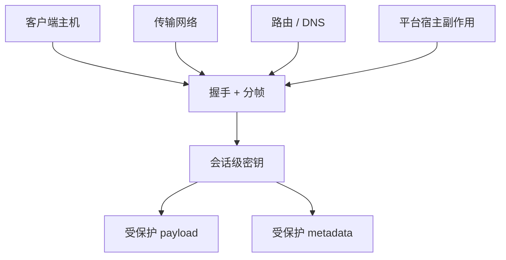

# 安全模型

[English Version](SECURITY.md)

## 范围

本文用代码事实解释 OPENPPP2 的安全姿态。

## 核心视角

OPENPPP2 不只是一个加密隧道。它的防御价值来自多个层次：

- 握手纪律
- 基于 `ivv` 的每会话密钥派生
- 受保护分帧
- static 分组保护
- 显式会话与策略对象
- 路由与 DNS steering
- 平台级宿主集成
- 超时与清理行为

## 重要澄清：FP，而不是 PFS

OPENPPP2 不实现传统意义上的 PFS。它使用预共享密钥加每会话 `ivv` 来派生会话工作密钥。它提供的是前向安全保证式的分离效果，但不等同于临时公钥交换的 PFS。

## 信任边界

重要信任边界包括：

- 客户端主机
- 服务端主机
- 传输网络
- 可选管理后端
- 配置文件和本地密钥存储

## 加密模型

有两层加密：

- 协议层：`protocol-key` + `ivv`
- 传输层：`transport-key` + `ivv`

`masked`、`plaintext`、`delta-encode`、`shuffle-data` 这些可选标志会影响暴露和形态，但不能替代正确的密钥使用。

## 握手安全

握手会使用 NOP 前奏、`session_id`、`ivv` 和密钥确认。早期阶段被有意识地当成更保守的状态处理。

## 运维安全

安全还依赖：

- route 和 DNS 控制
- mapping 暴露控制
- 超时处理
- 有序清理

## 代码实际证明了什么

代码能证明：

- 存在会话级工作密钥派生
- 系统不依赖单一分帧形式
- 早期流量会被 dummy 处理
- protocol cipher 和 transport cipher 是分开的
- 清理行为是显式的

代码不能证明“对所有攻击模型都安全”，所以文档不要夸大。

## 威胁面

## 为什么路由和平台也算安全

安全不只是密码学。如果错误 DNS 服务器可达，或者错误路由被保护，隧道暴露就会变化。

平台侧宿主副作用也是信任边界的一部分，不是噪声。

## 相关文档

- `TRANSMISSION_CN.md`
- `HANDSHAKE_SEQUENCE_CN.md`
- `ARCHITECTURE_CN.md`
