# Server Architecture

[中文版本](SERVER_ARCHITECTURE_CN.md)

## Scope

This document, based on the real C++ implementation under `ppp/app/server/`, explains in detail how the OPENPPP2 server runtime works. It does not use "simplified conceptual diagrams" but describes based on the control flow in the source code. The OPENPPP2 server is not just a process responsible for accepting sockets. It is an overlay network session switching node, forwarding edge, policy consumer, optional management backend client, optional IPv6 allocation and forwarding node, optional static UDP endpoint, and reverse mapping exposure point.

This is an important component of the virtual Ethernet infrastructure product, fundamentally different from traditional VPN servers. The server is closer to network infrastructure rather than a traditional "application server".

## Runtime Position

The most accurate way to understand the server is to view it as a multi-ingress overlay network node.

### Core Responsibilities

| Responsibility | Description | Corresponding Component |
|----------------|-------------|-------------------------|
| Accept multiple transport connections | Accept TCP, WS, WSS connections | `VirtualEthernetSwitcher` |
| Wrap connections as `ITransmission` | Convert connections to transmission objects | `VirtualEthernetSwitcher` |
| Distinguish primary session vs additional connections | Connection type determination | `VirtualEthernetSwitcher` |
| Create or replace exchanger for each session | Session management | `VirtualEthernetExchanger` |
| Forward UDP and TCP work to real network | Data forwarding | `VirtualEthernetExchanger`, `VirtualEthernetDatagramPort` |
| Pull policies from management backend | Policy consumption | `VirtualEthernetManagedServer` |
| Allocate and enforce business-level IPv6 | IPv6 management | `VirtualEthernetIPv6*` |
| Provide reverse mapping exposure capability | Port mapping | `VirtualEthernetMappingPort` |
| Maintain static UDP data plane | Static path | `VirtualEthernetDatagramPortStatic` |

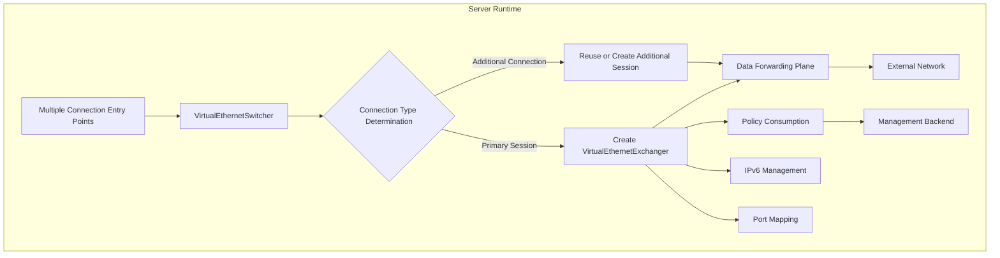

From the above responsibilities, the server is closer to network infrastructure rather than a traditional "application server".

## Core Types

The most core server-side runtime types include:

| Type | Responsibility | Source Location |
|------|---------------|------------------|
| `VirtualEthernetSwitcher` | Server environment management | `VirtualEthernetSwitcher.*` |
| `VirtualEthernetExchanger` | Session exchange management | `VirtualEthernetExchanger.*` |
| `VirtualEthernetNetworkTcpipConnection` | TCP connection management | `VirtualEthernetNetworkTcpipConnection.*` |
| `VirtualEthernetManagedServer` | Managed server | `VirtualEthernetManagedServer.*` |
| `VirtualEthernetDatagramPort` | UDP port management | `VirtualEthernetDatagramPort.*` |
| `VirtualEthernetDatagramPortStatic` | Static UDP port | `VirtualEthernetDatagramPortStatic.*` |
| `VirtualEthernetNamespaceCache` | Namespace cache | `VirtualEthernetNamespaceCache.*` |
| `VirtualEthernetMappingPort` | Mapping port | `VirtualEthernetMappingPort.*` |
| `VirtualEthernetIPv6` | IPv6 management | `VirtualEthernetIPv6.*` |

The most important boundary here is also the separation of switcher and exchanger.

### Switcher vs Exchanger Responsibilities

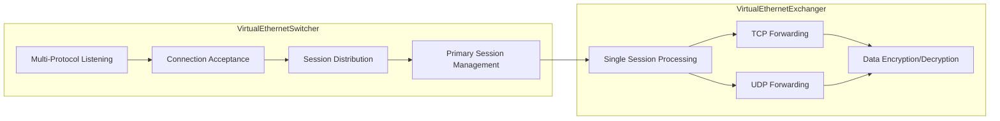

**VirtualEthernetSwitcher** is responsible for overall server environment management. It listens on multiple protocol ports, accepts connections, determines connection types (primary session or additional connection), creates and manages exchangers.

**VirtualEthernetExchanger** is responsible for single session processing. It handles TCP and UDP data forwarding, encrypts/decrypts data passing through the tunnel, maintains connection state.

## VirtualEthernetSwitcher Details

### Function Overview

`VirtualEthernetSwitcher` is the core of server environment management, responsible for:

| Function | Description |
|----------|-------------|
| Multi-protocol listening | Simultaneously listen on TCP, WebSocket, WSS, etc. |
| Connection acceptance | Accept client connections |
| Session management | Create, replace, clean up sessions |
| Primary connection determination | Determine if it's a new primary session |
| Port mapping management | Manage reverse mapping ports |
| Namespace cache | Manage namespace cache |
| IPv6 management | Manage IPv6 configuration |

### Listener Configuration

| Protocol | Default Port | Description |
|----------|---------------|-------------|
| PPP (TCP) | 20000 | Native TCP protocol |
| WebSocket | 20080 | HTTP plain WebSocket |
| WSS | 20443 | HTTPS encrypted WebSocket |
| UDP Static | Configurable | UDP static data path |

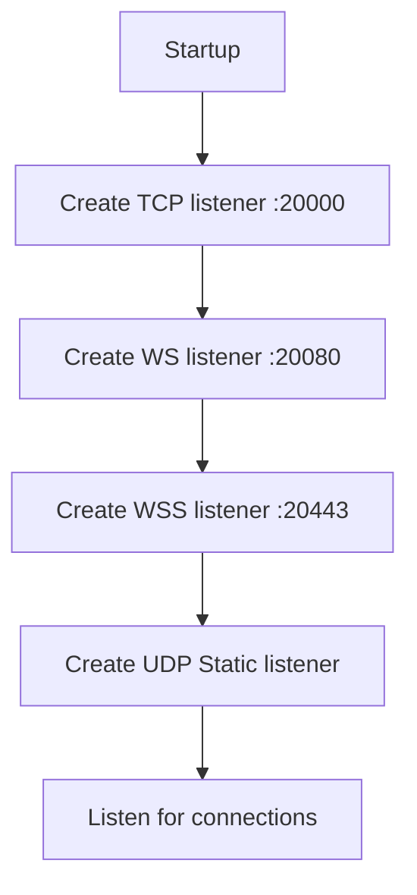

### Connection Type Determination

When accepting new connections, `VirtualEthernetSwitcher` needs to determine the connection type:

| Connection Type | Determination Basis | Handling |
|-----------------|---------------------|----------|
| New primary session | New session_id | Create new exchanger |
| Additional connection | Existing session_id | Reuse or create additional session channel |
| MUX sub-connection | MUX protocol | Hand over to MUX layer |

### Session Management

| Operation | Description |
|-----------|-------------|
| Create session | Create when new connection arrives |
| Replace session | New connection with same client_id can replace old session |
| Clean up session | Clean up when timeout or client disconnects |
| Persist | Support session state persistence (optional) |

## VirtualEthernetExchanger Details

### Function Overview

`VirtualEthernetExchanger` is the core of server session processing, responsible for:

| Function | Description |
|----------|-------------|
| Handshake processing | Complete server-side handshake |
| TCP forwarding | Forward tunnel TCP data to external network |
| UDP forwarding | Forward tunnel UDP data to external network |
| Data encryption/decryption | Encrypt/decrypt data passing through tunnel |
| Connection state maintenance | Maintain connection state and keepalive |
| Information distribution | Distribute configuration information to clients |

### Data Forwarding Flow

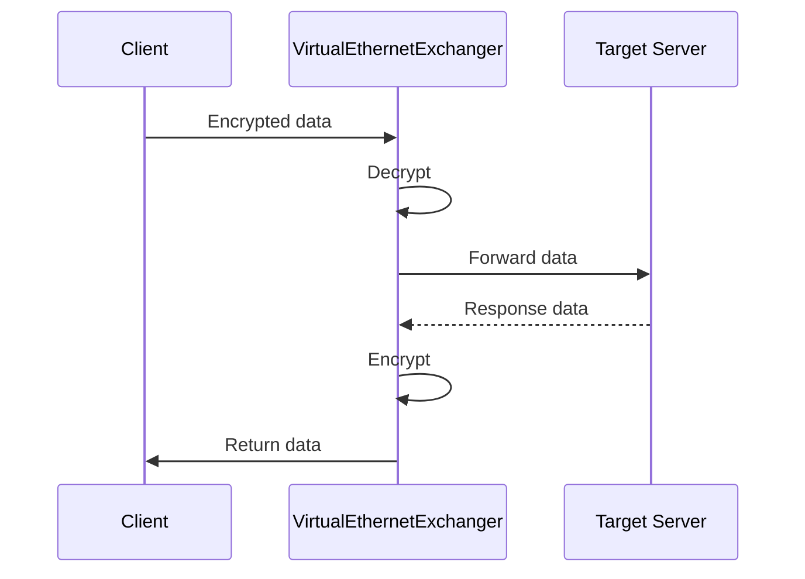

### TCP Forwarding

TCP forwarding is one of the most core server functions:

| Component | Description |
|-----------|-------------|
| `VirtualEthernetNetworkTcpipConnection` | Manage TCP connections |
| Connection pool | Reuse external connections |
| Flow control | TCP flow control |
| Keepalive | Connection keepalive |

### UDP Forwarding

UDP forwarding supports two modes:

| Mode | Description |
|------|-------------|
| Normal UDP | Standard UDP forwarding |
| Static UDP | UDP forwarding using static path |

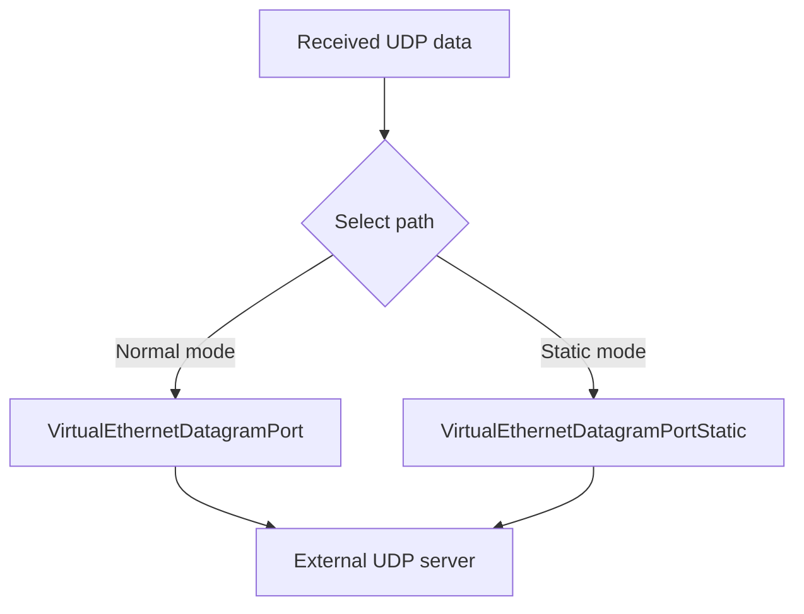

## VirtualEthernetDatagramPort Details

### Function Overview

`VirtualEthernetDatagramPort` manages UDP data forwarding:

| Function | Description |
|----------|-------------|
| UDP listening | Listen on UDP port |
| Data forwarding | Forward UDP data |
| DNS handling | Handle DNS queries |
| NAT behavior | Implement NAT behavior |

### DNS Forwarding

When client configures static DNS, the server needs to handle DNS queries:

| Configuration | Description |
|---------------|-------------|
| `dns.redirect` | DNS redirect address |
| `dns.cache` | Whether to enable DNS cache |
| `dns.ttl` | DNS cache TTL |

### Port Configuration

| Parameter | Description |
|-----------|-------------|
| `udp.listen.port` | UDP listening port |
| `udp.inactive.timeout` | Idle timeout |
| `udp.dns.timeout` | DNS query timeout |

## VirtualEthernetDatagramPortStatic Details

### Function Overview

`VirtualEthernetDatagramPortStatic` provides static UDP path service:

| Function | Description |
|----------|-------------|
| Static UDP listening | Listen on static UDP port |
| Traffic aggregation | Support multi-path UDP traffic aggregation |
| Congestion control | Congestion window management |

### Aggregator Configuration

When aggregator (aggligator) is configured:

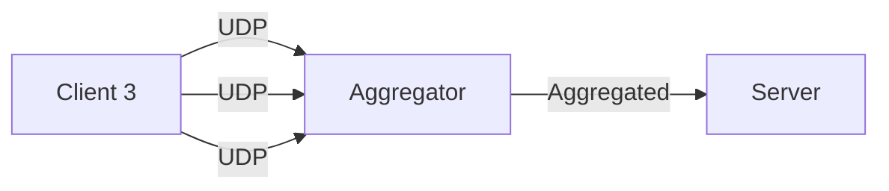

| Parameter | Description |
|-----------|-------------|
| `static.aggligator` | Aggregator count |
| `static.servers` | Aggregator server list |

## VirtualEthernetMappingPort Details

### Function Overview

`VirtualEthernetMappingPort` provides reverse mapping (port mapping) functionality:

| Function | Description |
|----------|-------------|
| Port mapping | Map server port to internal service |
| Protocol support | TCP/UDP protocol support |
| Dynamic mapping | Support dynamic port mapping |

### Mapping Workflow

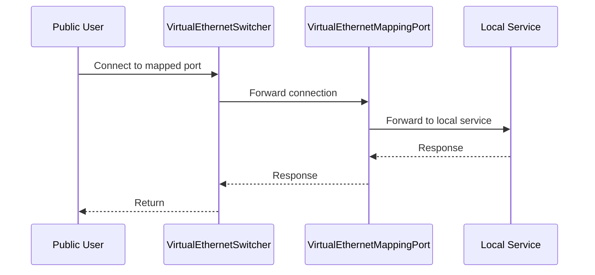

### Configuration Example

```json
{
    "mappings": [
        {
            "local-ip": "192.168.0.100",
            "local-port": 80,
            "protocol": "tcp",
            "remote-port": 8080
        }
    ]
}
```

## VirtualEthernetNamespaceCache Details

### Function Overview

`VirtualEthernetNamespaceCache` provides namespace cache functionality:

| Function | Description |
|----------|-------------|
| ARP cache | Cache ARP table entries |
| ND cache | Cache neighbor discovery table entries |
| Route cache | Cache routing table entries |

### Cache Policy

| Type | TTL | Description |
|------|-----|-------------|
| ARP | Configurable | ARP cache entries |
| ND | Configurable | IPv6 neighbor cache |
| Route | Configurable | Route cache entries |

## IPv6 Support

### IPv6 Modes

| Mode | Description |
|------|-------------|
| none | Disable IPv6 |
| NAT66 | NAT66 mode |
| GUA | Global Unicast Address |
| Forwarding | IPv6 forwarding |

### IPv6 Allocation

The server can assign IPv6 addresses to clients:

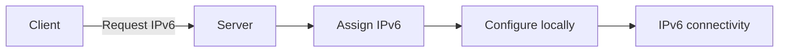

### IPv6 Forwarding

When IPv6 forwarding is enabled, the server can act as an IPv6 gateway:

| Function | Description |
|----------|-------------|
| Forwarding | Forward between client and external IPv6 network |
| NAT66 | NAT66 address translation |
| Tunnel IPv6 | Pass IPv6 traffic through tunnel |

## VirtualEthernetManagedServer Details

### Function Overview

`VirtualEthernetManagedServer` is an optional management backend client:

| Function | Description |
|----------|-------------|
| Backend connection | Connect to management backend |
| Policy pull | Pull policies from backend |
| Status report | Report status to backend |
| Authentication | Authenticate with backend |

### Configuration Parameters

| Parameter | Description |
|-----------|-------------|
| `server.backend` | Management backend URL |
| `server.backend-key` | Authentication key |

### Communication Protocol

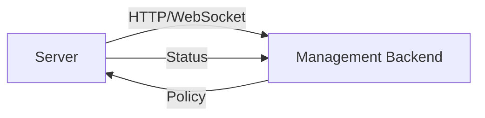

## Management Backend Integration

### Policy Types

| Policy Type | Description |
|--------------|-------------|
| Routing policy | Routing rules |
| DNS policy | DNS rules |
| Bandwidth policy | Bandwidth limit |
| Whitelist | IP whitelist |
| Blacklist | IP blacklist |

### Status Reporting

| Report Content | Frequency |
|-----------------|-----------|
| Connection count | 60 seconds |
| Traffic statistics | 10 seconds |
| Status changes | Real-time |

## Connection Management

### Connection Lifecycle

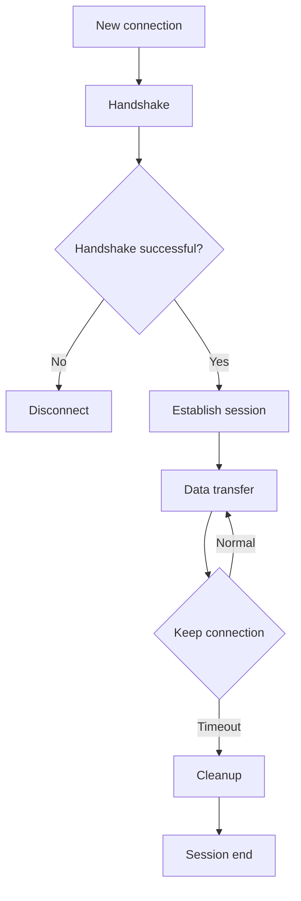

### Timeout Configuration

| Parameter | Description | Default Value |
|-----------|-------------|---------------|
| `tcp.inactive.timeout` | TCP idle timeout | 300 seconds |
| `udp.inactive.timeout` | UDP idle timeout | 72 seconds |
| `mux.inactive.timeout` | MUX idle timeout | 60 seconds |

## Firewall Integration

### Firewall Rules

The server supports firewall rule configuration:

| Function | Description |
|----------|-------------|
| Inbound rules | Control inbound connections |
| Outbound rules | Control outbound connections |
| Connection limit | Limit connection count |

### Rule Configuration

```json
{
    "firewall-rules": [
        {
            "action": "allow",
            "source": "0.0.0.0/0",
            "destination": "0.0.0.0/0",
            "port": "80,443"
        }
    ]
}
```

## Complete Data Flow Diagram

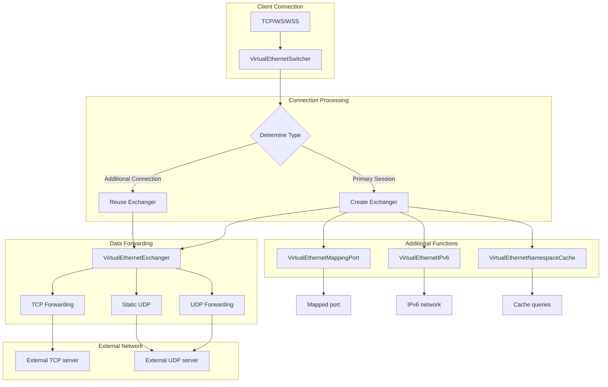

## Error Handling

### Common Errors and Handling

| Error Type | Cause | Handling |
|------------|-------|----------|
| Port occupied | Port already in use | Try backup port |
| Out of memory | System memory insufficient | Reject new connections |
| Backend communication failure | Management backend unreachable | Degrade to local operation |
| Session error | Session data error | Close session |

### Log Levels

| Level | Description |
|-------|-------------|
| ERROR | Error messages |
| WARN | Warning messages |
| INFO | General information |
| DEBUG | Debug information |

## Performance Optimization

### Performance Parameters

| Parameter | Description | Recommended Value |
|-----------|-------------|-------------------|
| `concurrent` | Concurrent thread count | CPU core count |
| `tcp.backlog` | TCP connection queue | 511 |
| `tcp.turbo` | TCP acceleration | Enable |
| `mux.congestions` | MUX congestion window | 134217728 |

### Optimization Suggestions

1. **Network optimization**: Enable TCP Turbo and Fast Open
2. **Memory optimization**: Configure vmem size
3. **Concurrency optimization**: Adjust concurrency based on CPU cores
4. **MUX optimization**: Enable MUX in high-latency scenarios

## Summary

The OPENPPP2 server is a complex network infrastructure with core architectural features:

1. **Multi-entry design**: Support TCP, WebSocket, WSS, UDP Static multiple connection methods
2. **Switcher/Exchanger separation**: Environment management separated from session management
3. **Complete data forwarding**: Support TCP, UDP, static UDP multiple forwarding paths
4. **Rich additional functions**: Support port mapping, IPv6, namespace cache
5. **Optional management backend**: Support policy pull and status reporting
6. **Flexible firewall rules**: Support fine-grained access control

Understanding these architectural features is crucial for correct deployment and server operations.

## Related Documents

| Document | Description |
|----------|-------------|
| [ARCHITECTURE.md](ARCHITECTURE.md) | System Architecture Overview |
| [CLIENT_ARCHITECTURE.md](CLIENT_ARCHITECTURE.md) | Client Runtime Architecture |
| [TRANSMISSION.md](TRANSMISSION.md) | Transmission Layer and Protected Tunnel Model |
| [LINKLAYER_PROTOCOL.md](LINKLAYER_PROTOCOL.md) | Link-layer Protocol |
| [PLATFORMS.md](PLATFORMS.md) | Platform Support and Differences |
