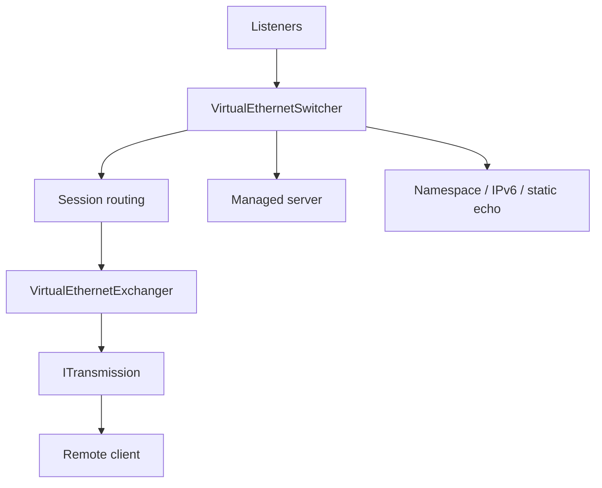
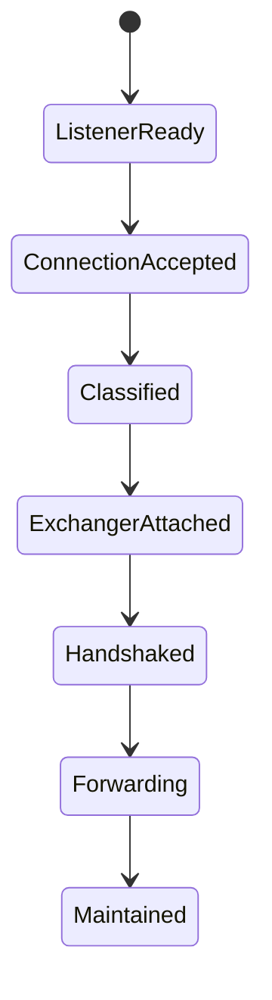

# Server Architecture

[中文版本](SERVER_ARCHITECTURE_CN.md)

## Scope

This document explains the real server runtime under `ppp/app/server/`. The server is an overlay session switch node, not a simple socket acceptor.

## Runtime Position

The server is a multi-ingress overlay node. It accepts transport connections, assigns them to session objects, forwards traffic, and optionally talks to the management backend.

## Code Anchors

The key server runtime objects are:

| Object | Role |
|---|---|
| `VirtualEthernetSwitcher` | listeners, connection acceptance, session routing, primary-session management |
| `VirtualEthernetExchanger` | single-session processing, forwarding, encryption/decryption, keepalive |
| `VirtualInternetControlMessageProtocol` / `VirtualInternetControlMessageProtocolStatic` | session-level information exchange |
| `VirtualEthernetManagedServer` | management-backend bridge |

## Server Topology

## Core Split

The main boundary is between `VirtualEthernetSwitcher` and `VirtualEthernetExchanger`.

| Type | Responsibility |
|---|---|
| `VirtualEthernetSwitcher` | Listener setup, connection acceptance, session routing, primary session management |
| `VirtualEthernetExchanger` | Single-session processing, forwarding, encryption/decryption, keepalive |

### Why the Boundary Matters

Listener setup and session processing have different lifecycles. Separating them keeps accept-time logic and forwarding-time logic from being coupled too tightly.

## Server Flow

1. Open enabled listeners
2. Accept a new connection
3. Classify it
4. Create or attach an exchanger
5. Complete handshake
6. Build the session envelope
7. Forward traffic
8. Maintain mappings, IPv6, and statistics

## `VirtualEthernetSwitcher`

This object owns the server environment:

- multi-protocol listening
- connection acceptance
- session creation and replacement
- main-session vs extra-connection decisions
- mapping and namespace-cache coordination

### What it does

It owns the server environment and decides how incoming connections are classified and attached to session objects.

## `VirtualEthernetExchanger`

This object owns one session:

- handshake processing
- TCP forwarding
- UDP forwarding
- data encryption/decryption
- connection-state maintenance
- information distribution to the client

### What it does

It owns a single session: handshake, forwarding, state maintenance, and client-facing information delivery.

## Listener Set

The server can expose different ingress types, including TCP and WebSocket-based paths. The exact set depends on configuration.

## Common Couplings

| Event | Switcher action | Exchanger action |
|---|---|---|
| startup | open listeners | no session yet |
| new connection | classify and assign | bind to session object |
| handshake success | record session state | start forwarding |
| policy update | recompute ingress | adjust session behavior |
|

## Management and Policy

The server may consult a management backend for policy, accounting, and reachability. That backend is optional; the data plane stays in the C++ process.

## Data Plane

The server handles both TCP and UDP forwarding. Static UDP is a separate path when enabled.

## Role of Configuration

`AppConfiguration` decides which listeners are enabled, whether backend integration is active, and how IPv6 and mapping behave.

## Implementation Notes

From the headers and implementation we can see the server also owns:

- firewall selection
- transmission statistics
- NAT bookkeeping
- IPv6 lease tracking
- static echo sessions
- mux setup and teardown
- managed-server upload points

That means the server is both a forwarding node and a policy coordination node.

## Related Documents

- `ARCHITECTURE.md`
- `CLIENT_ARCHITECTURE.md`
- `TUNNEL_DESIGN.md`
