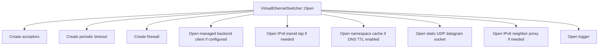
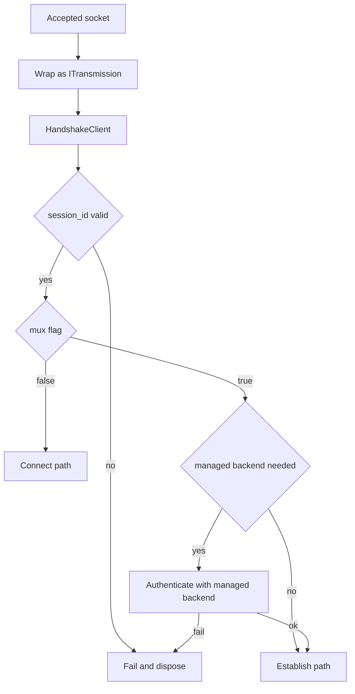
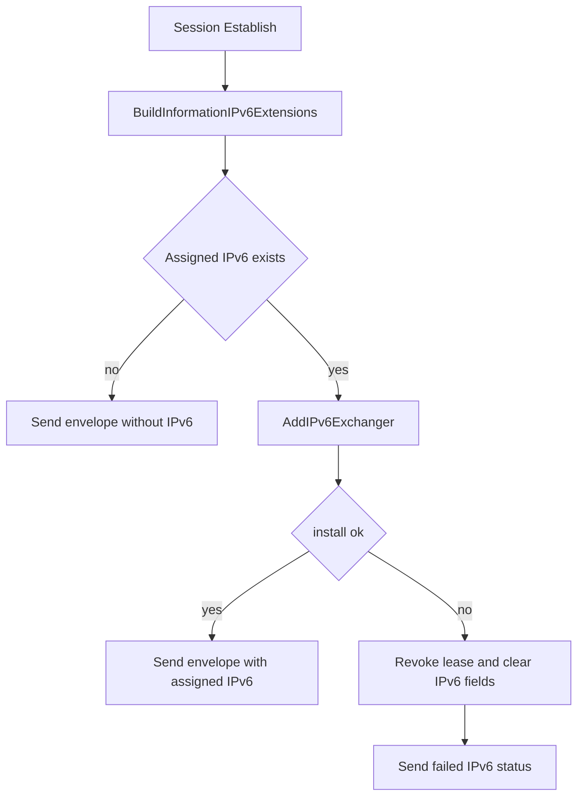
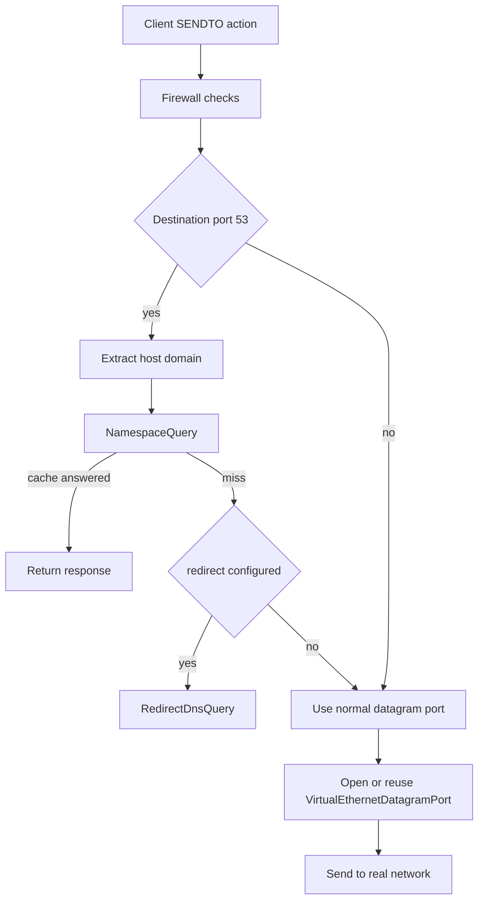
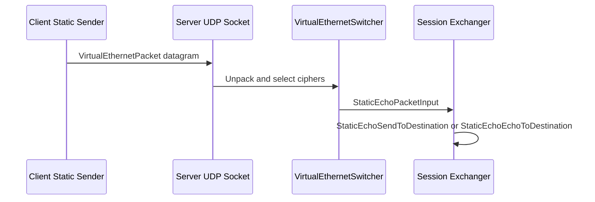

# Server Architecture

[中文版本](SERVER_ARCHITECTURE_CN.md)

This document explains the server runtime as implemented in `ppp/app/server/`. It is based on the real control flow in the C++ code, not on a simplified conceptual picture. The server is not only a listener process. It is the overlay session switch, forwarding edge, policy consumer, optional management-backend client, optional IPv6 address manager, optional static datagram endpoint, and reverse-mapping host.

The most important source files for this document are:

- `ppp/app/server/VirtualEthernetSwitcher.cpp`
- `ppp/app/server/VirtualEthernetExchanger.cpp`
- `ppp/app/server/VirtualEthernetNetworkTcpipConnection.cpp`
- `ppp/app/server/VirtualEthernetManagedServer.cpp`
- `ppp/app/server/VirtualEthernetDatagramPort*.cpp`
- `ppp/app/server/VirtualEthernetIPv6*`
- `ppp/app/server/VirtualEthernetNamespaceCache*`

## Runtime Position

The server should be understood as a multi-ingress overlay node.

It accepts transport connections, turns them into `ITransmission` objects, decides whether each one is a primary session path or an additional connection path, creates and replaces per-session exchangers, forwards UDP and TCP work into the real network, optionally resolves policy through a management backend, optionally allocates and enforces IPv6 state, exposes reverse mappings, and optionally operates a static UDP socket path in parallel with the normal stream-oriented link layer.

That is much closer to network infrastructure than to a minimal tunnel daemon.

## Core Types

The main server-side runtime types are:

- `VirtualEthernetSwitcher`
- `VirtualEthernetExchanger`
- `VirtualEthernetNetworkTcpipConnection`
- `VirtualEthernetManagedServer`
- `VirtualEthernetDatagramPort`
- `VirtualEthernetDatagramPortStatic`
- `VirtualEthernetNamespaceCache`
- IPv6 helpers owned by `VirtualEthernetSwitcher`
- `VirtualEthernetMappingPort`

The key boundary is between the switcher and each exchanger.

`VirtualEthernetSwitcher` is the global node-level owner. It owns listeners, the session map, the connection map, firewall state, namespace cache, optional management backend client, optional IPv6 transit tap, optional neighbor proxy state, and the global static UDP socket.

`VirtualEthernetExchanger` is the per-session owner. Each instance represents one client session and owns per-session forwarding state, per-session datagram ports, per-session mapping ports, MUX state, static echo allocation state, keepalive behavior, and the actual action handlers for packets and control commands coming from the client.

## Why The Name Switcher Is Accurate

The name `VirtualEthernetSwitcher` is not decorative. In code, the server really switches among several different kinds of state.

It switches:

- accepted transport connections into transmission objects
- transmissions into either main-session or extra-connection paths
- session ids into exchangers
- IPv4 NAT source addresses into owning exchangers
- IPv6 addresses into owning exchangers
- DNS requests into cache hits, redirect paths, or real network forwarding
- client mapping registrations into externally reachable listener state

This is why the server architecture reads like the design of a network node rather than the design of an application endpoint.

## Open Sequence

`VirtualEthernetSwitcher::Open(...)` initializes the global server runtime.

The method clears IPv6 tables and then performs the following creation sequence:

1. `CreateAllAcceptors()`
2. `CreateAlwaysTimeout()`
3. `CreateFirewall(firewall_rules)`
4. `OpenManagedServerIfNeed()`
5. `OpenIPv6TransitIfNeed()`
6. `OpenNamespaceCacheIfNeed()`
7. `OpenDatagramSocket()`
8. `OpenIPv6NeighborProxyIfNeed()`
9. `OpenLogger()` on success

This tells us that the server runtime is assembled from several subsystems before any accepted client connection is allowed to matter.

## Listener Model

The server can expose multiple ingress styles at once. The code supports ordinary TCP listeners, WebSocket listeners, TLS WebSocket listeners, CDN or SNI-proxy style listener categories, and a separate UDP socket for static packet mode.

This is significant architecturally. The server is not modeled as one port that accepts one transport type. It is modeled as one overlay node that can expose several front doors while converging them into the same internal session switch.

## Accept Loop

`VirtualEthernetSwitcher::Run()` walks through the configured acceptor categories and starts `Socket::AcceptLoopbackAsync(...)` for each live acceptor.

For normal listener categories, the server applies default socket options, creates an `ITransmission`, and then spawns a coroutine that calls `Run(context, transmission, y)`.

For CDN categories, the path is different. The server first builds an `sniproxy` object and performs its handshake before the connection can become useful. That proves again that ingress policy is category-specific before the session layer begins.

## Accept To Session Routing

The most important server fork happens in `VirtualEthernetSwitcher::Run(context, transmission, y)`.

The function performs `transmission->HandshakeClient(y, mux)` and obtains a `session_id` plus a boolean that indicates how the connection should be interpreted.

If `session_id == 0`, the connection is invalid and the path fails.

If `mux == false`, the connection is routed to `Connect(...)`.

If `mux == true`, the connection is routed to `Establish(...)`, either immediately or after management-backend authentication when a backend is configured and the session does not already exist.

This naming looks inverted at first glance if you only think in terms of generic multiplexing vocabulary. In this codebase, the boolean returned by the handshake is the server's signal for whether the transmission is the primary session channel or an extra connection path. The meaning is defined by the implementation, not by common protocol terminology.

## Session Establishment

`VirtualEthernetSwitcher::Establish(...)` is the primary session constructor.

The first thing it does is call `AddNewExchanger(...)`. That method constructs a new `VirtualEthernetExchanger`, opens it, swaps it into the session map, and disposes the previous exchanger for the same session if one existed. This means session replacement is a first-class behavior. A newer main session for the same id supersedes the old one.

Then `Establish(...)` resolves the information that should govern the session.

If a management backend is not configured but server IPv6 is enabled, the function creates a local fallback `VirtualEthernetInformation` with effectively unbounded limits. The debug logs call this a local bootstrap path.

If a management backend is configured and no information object is available, the server aborts establishment. In other words, when backend policy is mandatory, there is no silent fallback.

If session information exists, the server builds an `InformationEnvelope`, optionally installs IPv6 data-plane state, and sends the resulting envelope to the client. Only after that does it validate the information object and enter the session exchanger run loop.

When the run loop ends, the switcher removes the exchanger.

## Information Envelope As Session Contract

The server does not establish a session and then separately think about policy later. The `InformationEnvelope` is part of session establishment itself.

That envelope can carry:

- bandwidth constraints
- traffic quota state
- expiration state
- assigned IPv6 data
- IPv6 status flags and messages

The envelope therefore acts as the server-to-client runtime contract for the session. The client is expected to apply parts of it, not only display it.

## Extra Connection Path

`VirtualEthernetSwitcher::Connect(...)` is the non-primary connection path.

This path is used for extra connections associated with an existing session, including TCP relay work and MUX-related sub-connections. The function looks up the owning exchanger by session id, aligns traffic statistics with the owner transmission if needed, and then constructs a `VirtualEthernetNetworkTcpipConnection`.

If the transmission can shift to a scheduler, the connection run loop is migrated there. If the connection is a MUX connection and finishes successfully, it is removed from the connection map without being treated as a session failure.

The important architectural point is that additional connections are subordinate to an existing session owner. They do not become independent top-level runtime objects.

## Exchanger Responsibilities

Each `VirtualEthernetExchanger` is the server-side authority for one client session.

It owns or directly mediates:

- session action handlers such as `OnNat`, `OnSendTo`, `OnEcho`, `OnInformation`, `OnStatic`, `OnMux`
- IPv4 subnet forwarding behavior
- IPv6 source validation and peer or transit forwarding
- UDP datagram ports
- static UDP datagram ports
- reverse mapping ports
- MUX state
- keepalive validation
- optional traffic upload to the management backend

This split is a strong design choice. Node-wide resources stay in the switcher. Session-bound forwarding state stays in the exchanger.

## Defensive Reject Paths On The Server

Like the client, the server rejects actions that are illegal for the current direction.

The following server-side methods immediately return `false` with comments describing them as suspected malicious attack paths:

- `OnConnectOK(...)`
- `OnInformation(const VirtualEthernetInformation&)`
- `OnStatic(... fsid, session_id, remote_port ...)`

The server also rejects malformed information envelopes that look like server responses rather than client IPv6 requests. Specifically, `OnInformation(const InformationEnvelope&)` requires a client-side requested IPv6 address and rejects envelopes that already contain an assigned IPv6 address or a non-empty IPv6 status code.

This proves that the protocol is role-aware and direction-aware. Shared vocabulary does not imply symmetric legality.

## NAT And IPv4 Subnet Switching

`VirtualEthernetExchanger::OnNat(...)` first attempts IPv4 subnet forwarding when `server.subnet` is enabled.

That forwarding path goes through `ForwardNatPacketToDestination(...)`. The server parses the IPv4 packet, finds the owning NAT information for the source address, then attempts one of two behaviors.

If the destination is unicast, it tries to find the destination owner's NAT entry and then forwards directly to that exchanger if the destination belongs to the expected subnet.

If the destination is broadcast, it iterates the subnet and forwards to every matching peer except the source.

So the server can act as a switching point for client-to-client IPv4 traffic inside the overlay subnet. This is why `server.subnet` is more than a routing convenience flag. It controls whether the server may operate as an internal overlay L3 forwarder.

## IPv6 Session Enforcement

If IPv4 forwarding does not handle a packet and the IPv6 server path is enabled, `OnNat(...)` falls through to `ForwardIPv6PacketToDestination(...)`.

That method enforces several rules before forwarding anything.

It parses the IPv6 packet.

It loads the assigned IPv6 extensions for the current session.

It requires the source address to exactly equal the assigned IPv6 address for this session. If the source does not match, the packet is rejected and logged.

Then it decides whether the destination belongs to another overlay client or to the external IPv6 side.

If the destination belongs to another client session, the server can forward directly to that peer only when `server.subnet` is enabled.

If the destination does not belong to another client session, the server forwards the packet out through the IPv6 transit tap.

So the server is not a blind IPv6 relay. It is an identity-enforcing and topology-aware IPv6 edge.

## IPv6 Assignment And Data Plane

The IPv6 subsystem is one of the most infrastructure-like parts of the entire project.

At establishment time the switcher builds IPv6 extension data through `BuildInformationIPv6Extensions(...)`. The code path can honor client requests, static bindings, reused leases, server auto-assignment, and mode-specific constraints such as NAT66 versus GUA behavior.

After building the envelope, `Establish(...)` calls `AddIPv6Exchanger(...)` if an IPv6 address was assigned. If that installation fails, the server revokes the lease, deletes the IPv6 exchanger state, strips the IPv6 assignment fields from the envelope, and sends an explicit failed status to the client.

This is an important truth in the design: address assignment is not considered complete until the server data plane can actually support it.

## IPv6 Transit Tap

On Linux, `OpenIPv6TransitIfNeed()` can create a dedicated transit `ITap` for server-side IPv6 forwarding.

The code derives the transit address from configuration, assigns it to the tap, optionally enables multiqueue SSMT worker contexts, and installs a packet callback that routes every incoming IPv6 packet to `ReceiveIPv6TransitPacket(...)`.

That receive function is strict.

It validates packet length and IPv6 parsing.

It checks that the destination lies inside the configured prefix.

It rejects sources that are unspecified, multicast, or loopback.

It rejects sources that appear to be internal VPN addresses unless they are the transit gateway in the allowed case.

It finds the owning exchanger for the destination IPv6 address and forwards the packet back to that client by serializing it as a `NAT` action on the transmission.

This means the server owns both sides of the IPv6 bridge:

- client to transit side
- transit back to client side

## IPv6 Neighbor Proxy

In GUA mode on Linux, the server can also enable IPv6 neighbor proxy behavior.

The neighbor proxy path resolves the preferred uplink interface, ensures neighbor proxy is enabled there, replays proxy entries for all currently assigned client IPv6 addresses, and revokes sessions whose replay cannot be reinstalled successfully.

That behavior is operationally significant. The server treats neighbor-proxy correctness as part of valid IPv6 service state, not as a best-effort add-on.

## Client IPv6 Requests

Clients can send IPv6 request envelopes back to the server during an active session.

The handler is `VirtualEthernetExchanger::OnInformation(const InformationEnvelope&)`.

The method only accepts request-shaped envelopes. It rejects envelopes that already look like server responses. Then it calls `switcher_->UpdateIPv6Request(...)`, builds a fresh response envelope, and returns it through `DoInformation(...)`.

So IPv6 is not only established once. It can also be renegotiated or updated through a constrained request-response path inside the session.

## UDP Forwarding And DNS Decisions

`VirtualEthernetExchanger::SendPacketToDestination(...)` is the central UDP egress path from client to real network.

The method first interprets whether the call represents data or finalize semantics.

Then it applies firewall checks against:

- network port
- destination segment
- destination domain when the payload is DNS

If the packet is DNS, the server extracts the hostname, logs it, queries the namespace cache path, and only then considers DNS redirect behavior.

If the namespace path does not answer and redirect DNS is configured, the server uses `RedirectDnsQuery(...)` and `INTERNAL_RedirectDnsQuery(...)` to send the DNS request to the configured redirect resolver and return the result either to the normal tunnel path or to the static path depending on call context.

Only after those checks does the server create or reuse a normal UDP datagram port and forward the packet outward.

This is why server-side DNS handling is part of architecture, not just a filter feature. DNS is on the forwarding hot path.

## Static UDP Path On The Server

The server owns the other half of static mode.

`OpenDatagramSocket()` opens the global static UDP socket. `LoopbackDatagramSocket()` continuously receives datagrams, unpacks them through `VirtualEthernetPacket::Unpack(...)`, chooses the correct session-specific ciphers through `StaticEchoSelectCiphertext(...)`, and then passes the resulting packet into `StaticEchoPacketInput(...)`.

That handler resolves the owning session by allocated static context and dispatches the packet to either:

- `StaticEchoSendToDestination(...)` for UDP or IP forwarding
- `StaticEchoEchoToDestination(...)` for ICMP behavior

Per-session static allocation is created by `VirtualEthernetExchanger::StaticEcho(...)`, which calls `switcher_->StaticEchoAllocated(...)` and returns the allocated identifiers to the client through `DoStatic(...)`.

This architecture matters because static mode is not a thin overlay on top of the normal stream path. It is a separate server-side packet ingress and dispatch subsystem.

## Reverse Mapping And FRP-Style Exposure

When mapping is enabled, the client can request reverse mapping entries. The server-side handlers include:

- `OnFrpEntry(...)`
- `OnFrpSendTo(...)`
- `OnFrpConnectOK(...)`
- `OnFrpDisconnect(...)`
- `OnFrpPush(...)`

`RegisterMappingPort(...)` constructs a `VirtualEthernetMappingPort`, opens the FRP server side, inserts it into the exchanger's mapping table, and logs the bound endpoint.

The mapping ports are session-scoped. They live inside the exchanger rather than the global switcher. That makes sense because remote service exposure is attached to one client session's control plane and should disappear with that session.

## MUX On The Server

`VirtualEthernetExchanger::OnMux(...)` owns server-side MUX negotiation.

The method can clean existing MUX state, validate VLAN and connection count, create a new `vmux::vmux_net`, bind firewall and logger references, and acknowledge the result back to the client through `DoMux(...)`.

The server keeps MUX state inside the exchanger, not in the switcher. This is correct because MUX belongs to one session relationship.

The switcher, meanwhile, only owns the extra accepted transmissions that later become `VirtualEthernetNetworkTcpipConnection` instances tied back to that exchanger.

## Management Backend Split

When `server.backend` is configured, the server can authenticate or update sessions through `VirtualEthernetManagedServer`.

The important architecture decision is that the backend does not replace the C++ data plane. The data plane remains in the main process. The backend contributes session admission, policy data, and traffic accounting cooperation.

This split is visible in `Run(...)`, where a new main-session transmission may be suspended until `AuthenticationToManagedServer(...)` returns session information. It is also visible in `VirtualEthernetExchanger::UploadTrafficToManagedServer()`, where per-session traffic deltas are periodically uploaded.

So the backend is a management-plane extension, not the forwarding engine itself.

## Periodic Maintenance

The server uses periodic maintenance at both node and session level.

Node-level maintenance is created through `CreateAlwaysTimeout()` in the switcher.

Session-level maintenance happens in `VirtualEthernetExchanger::Update(...)`, which performs:

- static datagram port expiration
- traffic upload to the managed backend
- MUX maintenance
- keepalive validation
- normal datagram expiration
- mapping expiration

This division is important because it keeps node resources and session resources separate.

## Architectural Consequences

Several facts fall straight out of this code structure.

First, the server is a real session switch, not only a transport acceptor.

Second, the server data plane is multi-modal. It has a stream-oriented primary session path, extra connection paths, optional MUX sub-links, and a separate static UDP packet path.

Third, policy and forwarding are interleaved. Firewall checks, DNS cache queries, DNS redirection, mapping exposure, and IPv6 enforcement all occur directly on forwarding-critical paths.

Fourth, the server uses role-aware protocol handling. It explicitly rejects control actions that are invalid from the client side.

Fifth, IPv6 service is treated as operational state that must be backed by real data-plane installation. The server does not consider address assignment complete until routes, tap behavior, and neighbor proxy behavior are in place where required.

## Reading Order

If you want to continue reading the server source after this document, the most useful order is:

1. `VirtualEthernetSwitcher::Open(...)`
2. `VirtualEthernetSwitcher::Run()` and `Accept(...)`
3. `VirtualEthernetSwitcher::Run(context, transmission, y)`
4. `VirtualEthernetSwitcher::Establish(...)`
5. `VirtualEthernetSwitcher::Connect(...)`
6. `VirtualEthernetExchanger::OnNat(...)`
7. `VirtualEthernetExchanger::SendPacketToDestination(...)`
8. `VirtualEthernetSwitcher::BuildInformationIPv6Extensions(...)`
9. `VirtualEthernetSwitcher::OpenIPv6TransitIfNeed()` and `ReceiveIPv6TransitPacket(...)`
10. `VirtualEthernetSwitcher::OpenDatagramSocket()` and `LoopbackDatagramSocket()`

## Bottom Line

The server architecture is best understood as an overlay network node with session switching, forwarding, policy cooperation, and optional IPv6 service management built into one runtime.

It does not merely accept clients. It classifies ingress connections, creates or replaces per-session exchangers, forwards IPv4 and IPv6 traffic, enforces source identity, answers DNS through cache or redirect paths, hosts reverse mappings, maintains MUX state, and optionally drives a second static UDP data plane. That is why it must be documented as network infrastructure rather than as a simple server process.
