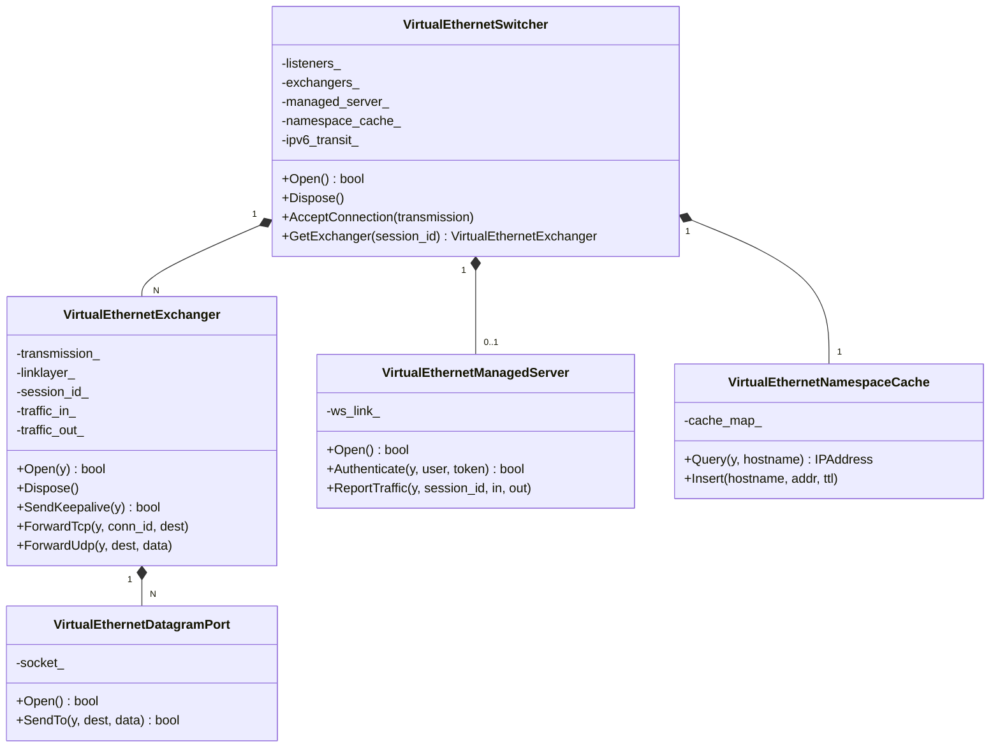
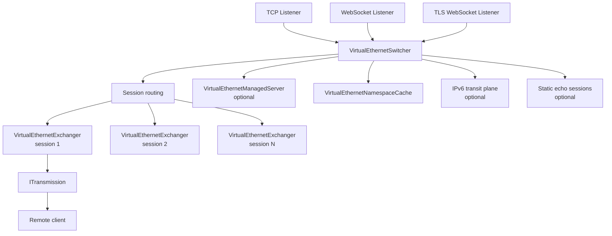
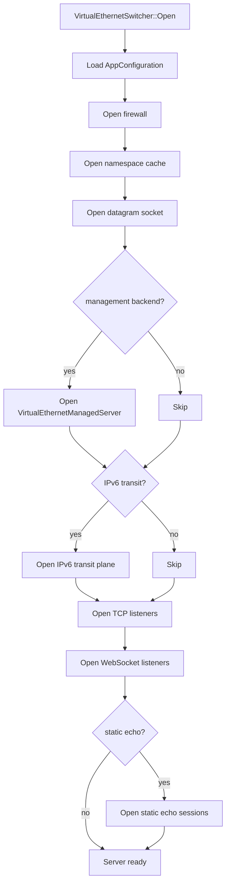
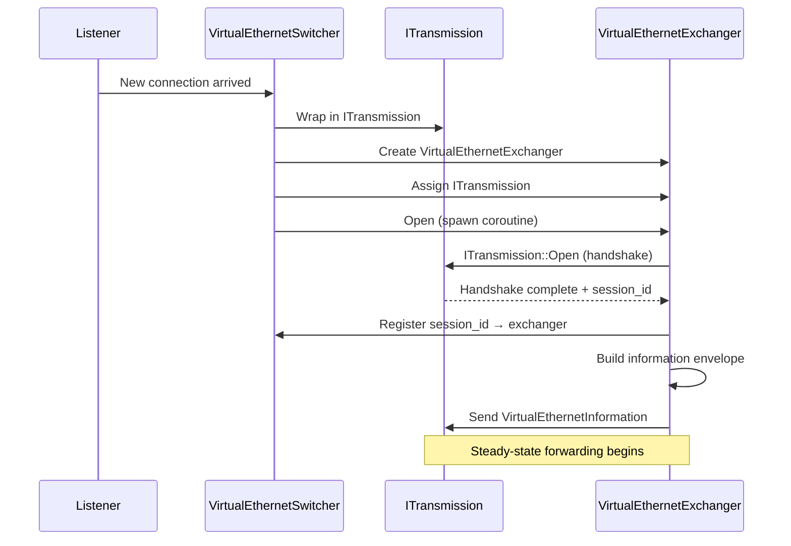

# Server Architecture

[中文版本](SERVER_ARCHITECTURE_CN.md)

## Scope

This document explains the real server runtime under `ppp/app/server/`.
The server is an overlay session switch node, not a simple socket acceptor.

---

## Runtime Position

The server is a multi-ingress overlay node that:
- accepts transport connections on multiple listener types
- assigns connections to session objects
- forwards TCP and UDP traffic on behalf of connected clients
- maintains per-session state including mappings, IPv6 leases, and statistics
- optionally communicates with a management backend for auth and accounting

---

## Server Object Map



---

## Server Topology



---

## Core Boundary: Switcher vs Exchanger

The most important architectural boundary:

| Type | Responsibility | Lifecycle |
|------|---------------|-----------|
| `VirtualEthernetSwitcher` | Listener setup, connection acceptance, session routing, resource coordination | Lives for the server lifetime |
| `VirtualEthernetExchanger` | Single session: handshake, forwarding, state, keepalive | Lives for one client connection |

This separation prevents accept-time logic from coupling to forwarding-time logic.
Adding a new transport type only requires changes to `VirtualEthernetSwitcher`.
Session-level behavior changes only require changes to `VirtualEthernetExchanger`.

---

## Server Startup Flow



Source: `ppp/app/server/VirtualEthernetSwitcher.cpp`

---

## Connection Acceptance Flow



---

## Session State Machine

```mermaid
stateDiagram-v2
    [*] --> ListenerReady
    ListenerReady --> ConnectionArrived : accept()
    ConnectionArrived --> HandshakeInProgress : ITransmission::Open
    HandshakeInProgress --> HandshakeFailed : timeout or error
    HandshakeInProgress --> SessionEstablished : handshake OK
    SessionEstablished --> InformationDelivered : SendInformation
    InformationDelivered --> Forwarding : client ACKs
    Forwarding --> KeepaliveChecking : keepalive timer
    KeepaliveChecking --> Forwarding : reply received
    KeepaliveChecking --> SessionTimedOut : no reply
    Forwarding --> SessionClosed : client disconnects
    HandshakeFailed --> [*]
    SessionTimedOut --> [*]
    SessionClosed --> [*]
```

---

## `VirtualEthernetSwitcher` Deep Dive

### What It Owns

| Resource | Description |
|----------|-------------|
| `listeners_` | TCP and WebSocket acceptors |
| `exchangers_` | Map from `session_id` to active exchanger |
| `managed_server_` | Optional management backend bridge |
| `namespace_cache_` | DNS result cache |
| `ipv6_transit_` | Optional IPv6 transit plane |
| `static_echo_sessions_` | Optional static UDP echo sessions |
| `firewall_` | Firewall policy reference |

### Primary Session vs Extra Connection

A client may open additional transport connections to the same server for mux or supplemental paths.
The switcher classifies each new connection:
- **Primary session**: no existing exchanger for this `session_id` → create new exchanger.
- **Extra connection**: existing exchanger found → attach as additional transport.

Source: `ppp/app/server/VirtualEthernetSwitcher.h`

### Key API

```cpp
/**
 * @brief Open the server and all its configured subsystems.
 * @return true if all required subsystems opened successfully.
 * @note   Sets diagnostics on failure.
 */
bool Open() noexcept;

/**
 * @brief Accept a new incoming transmission and create or attach an exchanger.
 * @param transmission  The newly accepted ITransmission.
 * @param acceptor_kind The kind of listener that accepted this connection.
 * @return true if the connection was accepted and dispatched.
 */
bool AcceptConnection(
    const std::shared_ptr<ITransmission>& transmission,
    int acceptor_kind) noexcept;

/**
 * @brief Look up an active exchanger by session_id.
 * @param session_id  The Int128 session identity.
 * @return            Shared pointer to exchanger, or empty if not found.
 */
std::shared_ptr<VirtualEthernetExchanger> GetExchanger(const Int128& session_id) noexcept;
```

---

## `VirtualEthernetExchanger` Deep Dive

### What It Owns

| Resource | Description |
|----------|-------------|
| `transmission_` | The `ITransmission` for this session |
| `linklayer_` | The `VirtualEthernetLinklayer` action handler |
| `session_id_` | The `Int128` session identity |
| `traffic_in_` | Incoming traffic counter |
| `traffic_out_` | Outgoing traffic counter |
| `tcp_connections_` | Map of active TCP flows |
| `udp_ports_` | Map of active UDP datagram ports |
| `mappings_` | FRP reverse mappings |
| `ipv6_lease_` | IPv6 address lease (if assigned) |

### Key API

```cpp
/**
 * @brief Open the exchanger and begin the session lifecycle.
 * @param y  Yield context for coroutine execution.
 * @return   true if session established and forwarding started.
 */
bool Open(YieldContext& y) noexcept;

/**
 * @brief Forward a TCP connection request on behalf of this session.
 * @param y          Yield context.
 * @param conn_id    Connection identifier (caller-assigned).
 * @param dest       Destination endpoint.
 * @return           true if TCP flow opened successfully.
 */
bool ForwardTcp(YieldContext& y, ppp::Int32 conn_id, const IPEndPoint& dest) noexcept;

/**
 * @brief Forward a UDP datagram on behalf of this session.
 * @param y          Yield context.
 * @param dest       Destination endpoint.
 * @param data       Datagram payload.
 * @param length     Length of payload.
 * @return           true if datagram sent.
 */
bool ForwardUdp(YieldContext& y, const IPEndPoint& dest,
                const Byte* data, int length) noexcept;

/**
 * @brief Send a keepalive echo to the client.
 * @param y  Yield context.
 * @return   true if echo sent. Session terminates if no reply arrives in time.
 */
bool SendKeepalive(YieldContext& y) noexcept;
```

Source: `ppp/app/server/VirtualEthernetExchanger.h`

---

## Listener Set

The server can expose multiple ingress types:

| Listener type | Config key | Protocol |
|--------------|------------|---------|
| TCP | `tcp.listen.port` | Raw TCP |
| WebSocket | `websocket.listen.ws` | HTTP WebSocket |
| TLS WebSocket | `websocket.listen.wss` | HTTPS WebSocket |
| UDP static | `udp.listen.port` | Raw UDP (static echo) |

The exact set enabled depends on configuration.
All listener types deliver connections to `VirtualEthernetSwitcher::AcceptConnection`.

---

## Management and Policy

The server may consult `VirtualEthernetManagedServer` for:
- user authentication
- quota and expiry lookup
- traffic accounting

This is optional. The data plane stays entirely in the C++ process.
If the backend is unreachable, the server falls back to locally cached policy.

---

## Data Plane

### TCP Forwarding

Per-session TCP forwarding is managed by `VirtualEthernetExchanger`:
1. Client sends `ConnectTcp` action with destination endpoint.
2. Exchanger opens a TCP socket to the destination.
3. Data flows bidirectionally over the session: `PushTcp` actions.
4. Either side can send `DisconnectTcp` to close the flow.

### UDP Forwarding

Per-session UDP is managed by `VirtualEthernetDatagramPort`:
1. Client sends `SendUdp` action with destination and payload.
2. Server creates or reuses a `VirtualEthernetDatagramPort` for this (session, source port) pair.
3. Server forwards to the real destination.
4. Replies are routed back through the `VirtualEthernetDatagramPort` to the session.

### Static UDP Path

Static UDP bypasses the per-session mechanism. It is handled as a separate listener.

---

## Role of Configuration

`AppConfiguration` controls:

| Config field | Effect |
|-------------|--------|
| `tcp.listen.port` | Enable/disable TCP listener |
| `websocket.listen.ws` | Enable/disable WebSocket listener |
| `websocket.listen.wss` | Enable/disable TLS WebSocket listener |
| `server.backend` | Enable/configure management backend URL |
| `server.firewall` | Firewall policy file path |
| `server.ipv6` | Enable IPv6 transit plane |
| `server.static` | Enable static echo sessions |

Source: `ppp/configurations/AppConfiguration.h`

---

## Implementation Notes

The server also owns:

| Feature | Description |
|---------|-------------|
| Firewall | Per-session and global access control |
| Transmission statistics | Per-session byte counters |
| NAT bookkeeping | UDP port mapping tables |
| IPv6 lease tracking | Per-client IPv6 address assignments |
| Static echo sessions | Independent UDP echo paths |
| Mux setup and teardown | Multiplexed transport configuration |
| Managed-server upload points | Traffic accounting push to backend |

The server is both a forwarding node and a policy coordination node.

---

## Error Code Reference

Server-related `ppp::diagnostics::ErrorCode` values (selection from `ErrorCodes.def`):

| ErrorCode | Description |
|-----------|-------------|
| `TunnelOpenFailed` | Could not open TCP or WebSocket listener |
| `TunnelListenFailed` | Listener accept loop failed to start |
| `SessionHandshakeFailed` | Client handshake did not complete |
| `SessionAuthFailed` | Session authentication failed |
| `SessionQuotaExceeded` | User quota exhausted |
| `KeepaliveTimeout` | Client keepalive timed out |
| `IPv6ServerPrepareFailed` | Server IPv6 environment preparation failed |
| `VEthernetManagedConnectUrlEmpty` | Managed server URL is empty |
| `VEthernetManagedPacketJsonParseFailed` | Invalid JSON frame from backend |

---

## Related Documents

- [`ARCHITECTURE.md`](ARCHITECTURE.md)
- [`CLIENT_ARCHITECTURE.md`](CLIENT_ARCHITECTURE.md)
- [`TUNNEL_DESIGN.md`](TUNNEL_DESIGN.md)
- [`TRANSMISSION_PACK_SESSIONID.md`](TRANSMISSION_PACK_SESSIONID.md)
- [`MANAGEMENT_BACKEND.md`](MANAGEMENT_BACKEND.md)
- [`CONFIGURATION.md`](CONFIGURATION.md)
