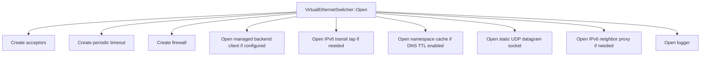
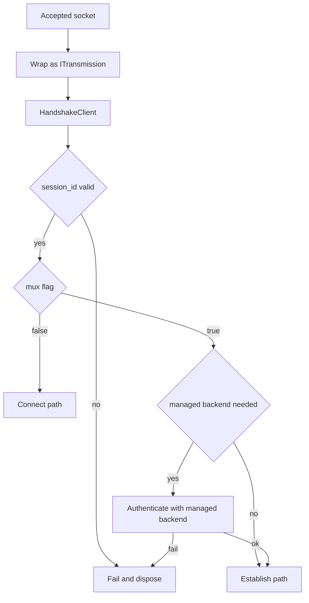
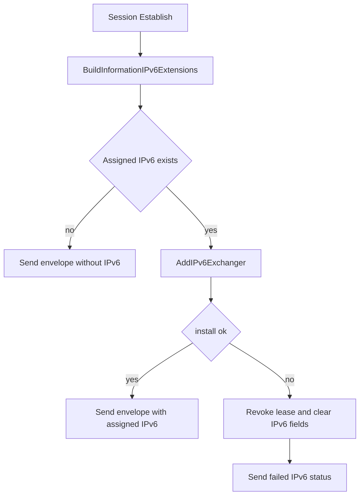
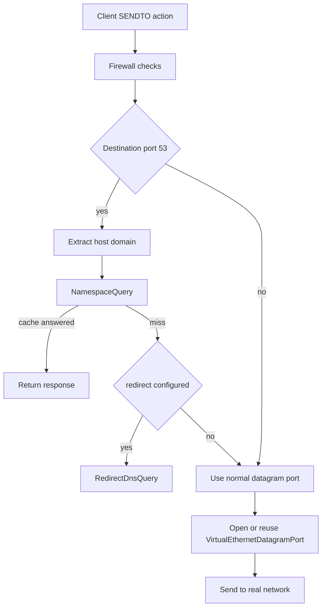
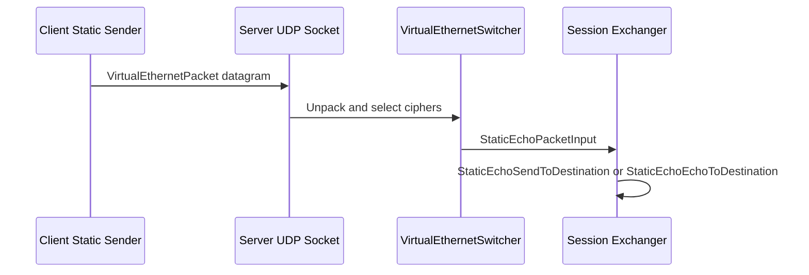

# 服务端架构

[English Version](SERVER_ARCHITECTURE.md)

本文档基于 `ppp/app/server/` 下的真实 C++ 实现，解释服务端运行时到底是如何工作的。这里不采用“简化后的概念图”，而是按照源码中的控制流来描述。OPENPPP2 服务端不是一个只负责 accept socket 的进程，而是一个覆盖网络会话交换节点、转发边缘、策略消费端、可选管理后端客户端、可选 IPv6 分配与转发节点、可选 static UDP 端点，以及反向 mapping 暴露点。

本文档主要依据以下源码文件：

- `ppp/app/server/VirtualEthernetSwitcher.cpp`
- `ppp/app/server/VirtualEthernetExchanger.cpp`
- `ppp/app/server/VirtualEthernetNetworkTcpipConnection.cpp`
- `ppp/app/server/VirtualEthernetManagedServer.cpp`
- `ppp/app/server/VirtualEthernetDatagramPort*.cpp`
- `ppp/app/server/VirtualEthernetIPv6*`
- `ppp/app/server/VirtualEthernetNamespaceCache*`

## 运行时定位

服务端最准确的理解方式，是把它看成一个多入口的 overlay 网络节点。

它要负责：

- 接收多种类型的承载连接
- 把承载连接包装成 `ITransmission`
- 判断它是主会话连接还是额外连接
- 为每个 session 创建或替换 exchanger
- 把 UDP 和 TCP 工作转发到真实网络
- 在有需要时向管理后端拉取策略
- 在有需要时分配并执行业务级 IPv6
- 提供反向 mapping 暴露能力
- 在 normal stream path 之外维护 static UDP 数据平面

从这个角度看，它更接近网络基础设施，而不是传统意义上的“应用服务器”。

## 核心类型

服务端最核心的运行时类型包括：

- `VirtualEthernetSwitcher`
- `VirtualEthernetExchanger`
- `VirtualEthernetNetworkTcpipConnection`
- `VirtualEthernetManagedServer`
- `VirtualEthernetDatagramPort`
- `VirtualEthernetDatagramPortStatic`
- `VirtualEthernetNamespaceCache`
- 由 `VirtualEthernetSwitcher` 持有的 IPv6 辅助逻辑
- `VirtualEthernetMappingPort`

这里最重要的边界，同样是 switcher 和 exchanger。

`VirtualEthernetSwitcher` 是节点级总控。它持有监听器、session 映射、连接映射、防火墙、namespace cache、可选管理后端客户端、可选 IPv6 transit tap、可选邻居代理状态，以及全局 static UDP socket。

`VirtualEthernetExchanger` 是单 session 运行时。每个 exchanger 代表一个客户端会话，持有该会话的转发状态、datagram port、mapping port、MUX 状态、static echo 状态、keepalive 维护，以及从客户端收到的链路层动作处理器。

## 为什么叫 Switcher 很准确

`VirtualEthernetSwitcher` 这个名字不是随便起的。它在代码里真的承担“交换”职责。

它会在多个维度做切换：

- 把 accept 到的承载连接切成 transmission
- 把 transmission 分流到主会话路径或额外连接路径
- 把 session id 映射到 exchanger
- 把 IPv4 NAT 源地址映射到所属 exchanger
- 把 IPv6 地址映射到所属 exchanger
- 把 DNS 请求分流到 cache、redirect 或真实网络
- 把客户端注册的 mapping 变成外部可访问监听点

因此它天然应该被理解成网络节点里的交换和调度核心，而不是单纯的 listener owner。

## Open 阶段

`VirtualEthernetSwitcher::Open(...)` 负责初始化整个全局服务端运行时。

它先清空 IPv6 相关表，再按顺序执行：

1. `CreateAllAcceptors()`
2. `CreateAlwaysTimeout()`
3. `CreateFirewall(firewall_rules)`
4. `OpenManagedServerIfNeed()`
5. `OpenIPv6TransitIfNeed()`
6. `OpenNamespaceCacheIfNeed()`
7. `OpenDatagramSocket()`
8. `OpenIPv6NeighborProxyIfNeed()`
9. 成功后 `OpenLogger()`

这个顺序本身就说明：服务端在任何客户端真正生效之前，就已经先把节点级子系统搭起来了。

## 监听模型

服务端可以同时暴露多种入口。代码支持普通 TCP、WebSocket、TLS WebSocket、CDN 或 SNI-proxy 风格 listener，以及单独的 UDP static socket。

这在架构上意义很大。因为它说明服务端不是“一个端口对应一个隧道守护进程”，而是“多个前门最终汇聚到同一内部 session switch”。

## Accept 循环

`VirtualEthernetSwitcher::Run()` 会遍历所有 acceptor category，并为每个活跃 acceptor 启动 `Socket::AcceptLoopbackAsync(...)`。

普通 listener category 上，服务端会调整 socket 选项，创建 `ITransmission`，然后在协程里调用 `Run(context, transmission, y)`。

CDN category 则不同。这里会先构造 `sniproxy` 对象，先完成那一层握手，成功后连接才有资格继续往 session 层走。这个分支证明 ingress policy 在 session 层之前就已经分类型处理。

## 从接入到会话分流

服务端最关键的一次分叉发生在 `VirtualEthernetSwitcher::Run(context, transmission, y)`。

这个函数首先执行 `transmission->HandshakeClient(y, mux)`，得到 `session_id` 以及一个布尔值，表示这条连接在服务端侧应该被如何解释。

如果 `session_id == 0`，说明连接无效，直接失败。

如果 `mux == false`，则走 `Connect(...)`。

如果 `mux == true`，则走 `Establish(...)`。当配置了管理后端且当前 session 尚不存在时，还会先去管理后端认证，再进入 establish。

从命名上看，这个 `mux` 布尔值如果脱离实现语义会有点反直觉。但在这套代码里，真正语义由实现定义：它代表“这条 transmission 是主会话通道，还是现有 session 的额外连接通道”。必须以代码为准，而不是按一般协议常识去猜。

## 主会话建立

`VirtualEthernetSwitcher::Establish(...)` 是主会话建立的核心。

它首先调用 `AddNewExchanger(...)`。这个函数会创建新的 `VirtualEthernetExchanger`，调用 `Open()`，把它写进 session map，并在同一 session 已存在旧 exchanger 时替换掉旧对象并释放旧对象。

这说明 session replace 是显式支持的。新的主会话会覆盖旧的主会话。

随后 `Establish(...)` 解析当前 session 应该使用的 `VirtualEthernetInformation`。

如果没有配置管理后端，但启用了 server IPv6，则服务端会创建一份 fallback information。代码里 debug log 把这条路径称为 local bootstrap。这意味着没有管理后端时，服务端仍然可以本地完成最基础的 session 启动。

如果配置了管理后端，但拿不到信息对象，则服务端直接中止建立。也就是说，只要后端策略是必需的，服务端就不会默默降级到本地默认行为。

当信息对象存在时，服务端会构造 `InformationEnvelope`，尝试安装 IPv6 数据平面，然后把 envelope 发给客户端。之后才进入 exchanger 的运行循环。

运行结束时，switcher 删除 exchanger。

## Information Envelope 是会话契约

服务端不是先“建立连接”，然后再“另外考虑策略”。`InformationEnvelope` 本身就是 session establish 的组成部分。

这个 envelope 可以承载：

- 带宽限制
- 流量额度状态
- 过期时间状态
- 分配的 IPv6 数据
- IPv6 状态码与状态消息

因此它实际上就是服务端发给客户端的运行时会话契约。客户端不是只用来展示它，而是要应用其中一部分内容。

## 额外连接路径

`VirtualEthernetSwitcher::Connect(...)` 负责非主会话连接。

这条路径用于附属于某个既有 session 的额外连接，包括 TCP relay 与 MUX 相关子连接。

函数会先根据 session id 找到所属 exchanger，再在需要时把统计信息与 owner transmission 对齐，然后构造 `VirtualEthernetNetworkTcpipConnection`。

如果 transmission 可以切到 scheduler，就迁移到 scheduler 跑。如果这是 MUX connection 并正常结束，它会从连接表中移除，但不会被当成主 session 故障。

这里最重要的架构事实是：额外连接永远隶属于既有 session，不会成为独立顶层实体。

## Exchanger 的职责

每个 `VirtualEthernetExchanger` 都是单 session 的服务端权威对象。

它实际持有或直接处理：

- `OnNat`、`OnSendTo`、`OnEcho`、`OnInformation`、`OnStatic`、`OnMux` 等动作
- IPv4 子网转发
- IPv6 源地址校验与 peer 或 transit 转发
- UDP datagram port
- static UDP datagram port
- 反向 mapping port
- MUX 状态
- keepalive 检查
- 向 managed backend 上传流量增量

这种拆分很好理解。节点级资源归 switcher，session 级转发状态归 exchanger。

## 服务端的防御性拒绝路径

和客户端一样，服务端也会明确拒绝某些方向不合法的动作。

以下方法会直接 `return false`，并在注释中标为 suspected malicious attack：

- `OnConnectOK(...)`
- `OnInformation(const VirtualEthernetInformation&)`
- `OnStatic(... fsid, session_id, remote_port ...)`

此外，`OnInformation(const InformationEnvelope&)` 也不会接受任意 envelope。它只接受“客户端请求 IPv6”的那类 request-shaped envelope。如果 envelope 已经带有 `AssignedIPv6Address` 或非空的 IPv6 status code，看起来像服务端响应而不是客户端请求，它就拒绝。

这说明协议并不是完全对称的。虽然动作词汇共享，但方向合法性本身就是协议约束的一部分。

## NAT 与 IPv4 子网交换

`VirtualEthernetExchanger::OnNat(...)` 会先在 `server.subnet` 开启时尝试 IPv4 子网转发。

这条路径进入 `ForwardNatPacketToDestination(...)`。服务端会解析 IPv4 报文，先找到源地址所属 NAT 信息，再尝试两类行为。

如果目标是单播，就查目标地址对应的 NAT 信息，并在目标仍属于预期子网时，把报文直接送给该目标所属 exchanger。

如果目标是广播，就遍历整个子网，把包发给所有匹配 peer，但跳过源地址自己。

因此服务端具备 overlay 内 client-to-client IPv4 转发能力。`server.subnet` 不只是一个“方便路由”的配置项，它实际决定服务端是否承担 overlay 内部 L3 forwarder 的角色。

## IPv6 会话约束

如果 IPv4 子网转发未处理该包，且启用了 IPv6 服务，`OnNat(...)` 会继续进入 `ForwardIPv6PacketToDestination(...)`。

这里首先做的是 IPv6 身份校验。

它会解析 IPv6 报文，读取当前 session 分配到的 IPv6 extensions，并要求报文源地址必须严格等于该 session 的已分配 IPv6 地址。如果不匹配，直接拒绝并写日志。

之后，服务端判断目标地址属于另一客户端还是属于外部 IPv6 世界。

如果目标属于另一客户端，只有在 `server.subnet` 开启时才允许直接 peer delivery。

如果目标不属于另一客户端，则把包送到 IPv6 transit tap 输出。

所以服务端并不是一个盲转 IPv6 relay，而是一个具备源身份约束与拓扑感知的 IPv6 overlay 边缘。

## IPv6 分配与数据平面安装

IPv6 子系统是整个工程里最“网络基础设施化”的部分之一。

session establish 时，switcher 会通过 `BuildInformationIPv6Extensions(...)` 生成 IPv6 extension。这个过程可以处理：

- client 请求地址
- static binding
- lease 复用
- 服务端自动分配
- NAT66 与 GUA 的模式差异

当 envelope 构造完成后，`Establish(...)` 会在地址有效时调用 `AddIPv6Exchanger(...)`。如果安装失败，服务端会撤销 lease、删除 IPv6 exchanger 状态、清空 envelope 中的 IPv6 字段，并给客户端返回明确的失败状态。

这说明在这套设计里，“分配了 IPv6”并不等于“IPv6 可用”。只有数据平面装配成功，分配才算成立。

## IPv6 Transit Tap

在 Linux 上，`OpenIPv6TransitIfNeed()` 可以创建一个专用 transit `ITap`，用于服务端侧 IPv6 转发。

代码会根据配置推导 transit 地址，把地址配置到 tap 上，并在需要时开启 multiqueue SSMT worker。随后把来自这个 tap 的每个 IPv6 包都回调到 `ReceiveIPv6TransitPacket(...)`。

这个接收函数非常严格：

- 校验包长和 IPv6 解析
- 检查目的地址必须位于配置前缀内
- 拒绝 unspecified、multicast、loopback 源地址
- 拒绝看起来属于 VPN 内部地址空间的源地址，除非它是被允许的 transit gateway 场景
- 根据目的 IPv6 找到所属 exchanger，再通过 `NAT` 动作把包送回客户端

所以服务端同时管理了 IPv6 的两个方向：

- client 发往 transit 侧
- transit 再回送 client 侧

## IPv6 Neighbor Proxy

在 Linux 的 GUA 模式下，服务端还可以开启 IPv6 neighbor proxy。

这条逻辑会解析首选上行接口，确保该接口上启用了 neighbor proxy，然后把当前所有已分配客户端 IPv6 地址重新 replay 到代理配置里。如果 replay 失败，对应 session 会被撤销 lease 并清理 IPv6 状态。

这在运维上非常关键，因为它表明 neighbor proxy 正确性被视为 IPv6 服务有效性的组成部分，而不是一个可有可无的小附加项。

## 客户端发起的 IPv6 请求

客户端在 session 活跃期间还可以再次向服务端发送 IPv6 请求 envelope。

处理入口是 `VirtualEthernetExchanger::OnInformation(const InformationEnvelope&)`。

这个函数只接受 request-shaped envelope，不接受已经长得像服务端响应的 envelope。验证通过后，它会调用 `switcher_->UpdateIPv6Request(...)`，构造新的 response envelope，并通过 `DoInformation(...)` 发回客户端。

这说明 IPv6 不只是建连时一次性下发，它还可以在会话内以受限 request-response 的形式更新。

## UDP 转发与 DNS 决策

`VirtualEthernetExchanger::SendPacketToDestination(...)` 是客户端到真实网络的 UDP 出口核心。

它首先判断这次调用是数据包还是 finalize 语义。

然后执行防火墙检查，覆盖：

- 目标端口
- 目标网段
- 当数据是 DNS 时的目标域名

如果当前是 DNS 包，服务端会先提取 host domain，记录日志，走 namespace cache 查询路径，之后才考虑 DNS redirect。

如果 namespace path 没有回答，且配置了 redirect DNS，则通过 `RedirectDnsQuery(...)` 和 `INTERNAL_RedirectDnsQuery(...)` 把 DNS 请求发给重定向 DNS 服务器，再把结果通过 normal tunnel 或 static path 返回给客户端。

只有在这些策略决策之后，服务端才会创建或复用普通 UDP datagram port，把流量真正发到外部网络。

这就是为什么服务端 DNS 处理属于架构核心，而不只是一个过滤功能。DNS 就在转发热路径上。

## 服务端上的 Static UDP 路径

服务端负责 static 模式的另一半。

`OpenDatagramSocket()` 打开全局 static UDP socket。`LoopbackDatagramSocket()` 持续接收 datagram，通过 `VirtualEthernetPacket::Unpack(...)` 解包，再通过 `StaticEchoSelectCiphertext(...)` 选择正确的 session-specific cipher，之后把结果交给 `StaticEchoPacketInput(...)`。

`StaticEchoPacketInput(...)` 再根据 allocated static context 找到所属 session，并分发到：

- `StaticEchoSendToDestination(...)`，用于 UDP 或 IP 转发
- `StaticEchoEchoToDestination(...)`，用于 ICMP 语义

每个 session 的 static allocation 则由 `VirtualEthernetExchanger::StaticEcho(...)` 触发，它会调用 `switcher_->StaticEchoAllocated(...)`，再通过 `DoStatic(...)` 把标识回给客户端。

因此 static 模式在服务端并不是 normal stream path 的一个小补丁，而是一整套独立的 ingress、解包、分发子系统。

## Reverse Mapping 与 FRP 风格暴露

当 mapping 启用时，客户端可以向服务端注册反向映射。服务端对应处理器包括：

- `OnFrpEntry(...)`
- `OnFrpSendTo(...)`
- `OnFrpConnectOK(...)`
- `OnFrpDisconnect(...)`
- `OnFrpPush(...)`

`RegisterMappingPort(...)` 会创建 `VirtualEthernetMappingPort`，打开 FRP 服务端监听，写入 exchanger 的 mapping 表，并记录绑定 endpoint。

这些 mapping port 都是 session 级资源，保存在 exchanger 里，而不是 switcher 里。这样设计是合理的，因为远程服务暴露本来就依附于某个客户端 session，session 消失，mapping 也应该一起消失。

## 服务端上的 MUX

`VirtualEthernetExchanger::OnMux(...)` 负责服务端侧 MUX 协商。

这里可以清理旧 MUX、校验 VLAN 和连接数、创建新的 `vmux::vmux_net`、注入 firewall 和 logger，再通过 `DoMux(...)` 把协商结果确认回客户端。

服务端的 MUX 状态放在 exchanger 里，而不是 switcher 里。这是正确的，因为 MUX 属于某个具体 session。

switcher 负责的是那些之后会被归属到该 exchanger 的额外 transmission 和 `VirtualEthernetNetworkTcpipConnection`。

## 管理后端分层

当配置了 `server.backend` 后，服务端会通过 `VirtualEthernetManagedServer` 与外部管理后端协作。

最重要的架构决策在于：管理后端并不替代 C++ 数据平面。真正的数据平面仍在当前主进程里。后端提供的是 session admission、策略信息和流量计量协作。

这一点在 `Run(...)` 中很清楚：新的主会话连接可能会先挂起，直到 `AuthenticationToManagedServer(...)` 返回信息对象。也在 `VirtualEthernetExchanger::UploadTrafficToManagedServer()` 里很清楚：session 流量增量被周期上传，但实际 forwarding 仍由本地运行时负责。

因此后端是 management plane 扩展，而不是 forwarding engine 本体。

## 周期维护

服务端同时存在节点级和 session 级维护。

节点级维护由 switcher 中的 `CreateAlwaysTimeout()` 建立。

session 级维护在 `VirtualEthernetExchanger::Update(...)` 中完成，内容包括：

- static datagram port 超时更新
- 向 managed backend 上传流量增量
- MUX 维护
- keepalive 检查
- 普通 datagram 超时更新
- mapping 超时更新

这种分层很重要，因为它保持了 node resource 和 session resource 的边界。

## 架构层面的直接结论

从这套结构可以直接得到几个事实。

第一，服务端是真正的 session switch，不只是 transport acceptor。

第二，服务端数据平面是多模态的。它同时拥有主流式会话路径、额外连接路径、可选 MUX 子链路，以及独立的 static UDP 数据平面。

第三，策略与转发深度交织。防火墙、DNS cache、DNS redirect、mapping 暴露、IPv6 身份校验，都直接发生在关键转发路径上。

第四，服务端明确执行角色感知协议处理。来自客户端的非法方向动作会被直接拒绝。

第五，IPv6 服务被当作一种必须有真实数据平面支撑的运维状态。只有路由、tap、neighbor proxy 等安装成功时，IPv6 分配才算成立。

## 建议源码阅读顺序

如果要继续阅读服务端源码，最有效的顺序是：

1. `VirtualEthernetSwitcher::Open(...)`
2. `VirtualEthernetSwitcher::Run()` 与 `Accept(...)`
3. `VirtualEthernetSwitcher::Run(context, transmission, y)`
4. `VirtualEthernetSwitcher::Establish(...)`
5. `VirtualEthernetSwitcher::Connect(...)`
6. `VirtualEthernetExchanger::OnNat(...)`
7. `VirtualEthernetExchanger::SendPacketToDestination(...)`
8. `VirtualEthernetSwitcher::BuildInformationIPv6Extensions(...)`
9. `VirtualEthernetSwitcher::OpenIPv6TransitIfNeed()` 与 `ReceiveIPv6TransitPacket(...)`
10. `VirtualEthernetSwitcher::OpenDatagramSocket()` 与 `LoopbackDatagramSocket()`

## 结论

服务端架构最准确的定位，是“具备会话交换、转发、策略协作和可选 IPv6 服务管理的一体化 overlay 网络节点”。

它不是只负责接受客户端。它会分类 ingress connection，创建或替换 per-session exchanger，转发 IPv4 和 IPv6，约束源地址身份，处理 DNS cache 与 redirect，暴露 reverse mapping，维护 MUX，并在 normal stream path 之外再维护一套 static UDP 数据平面。这正是为什么它必须被当作网络基础设施来写文档，而不能被当作简单 server process 来理解。
