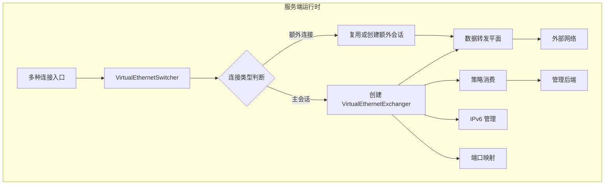
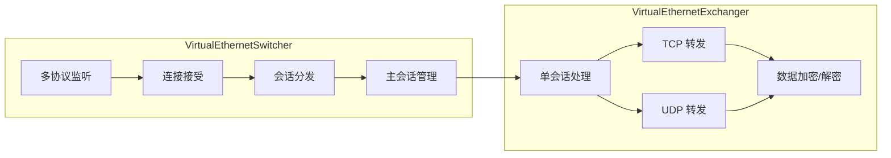
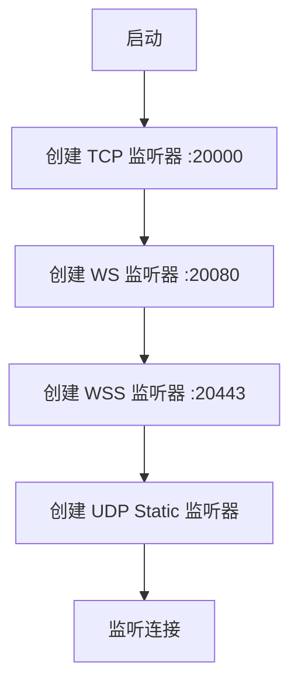
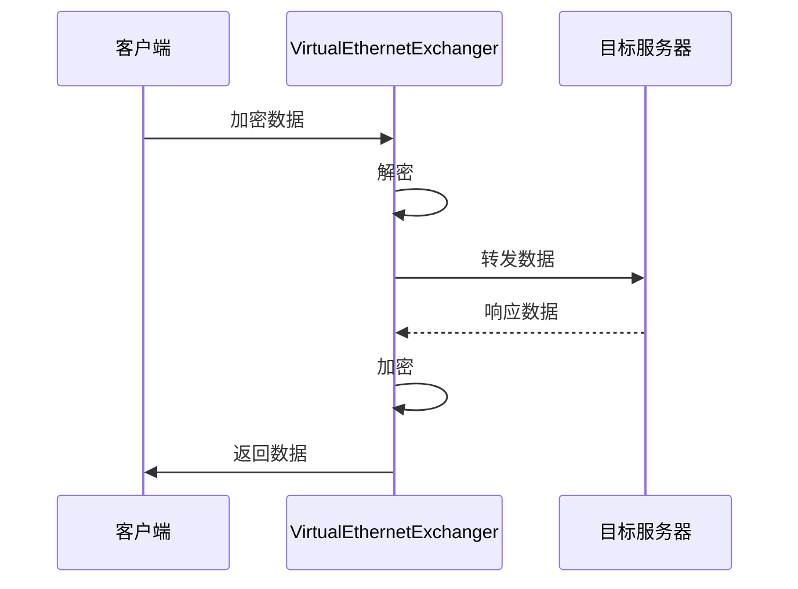
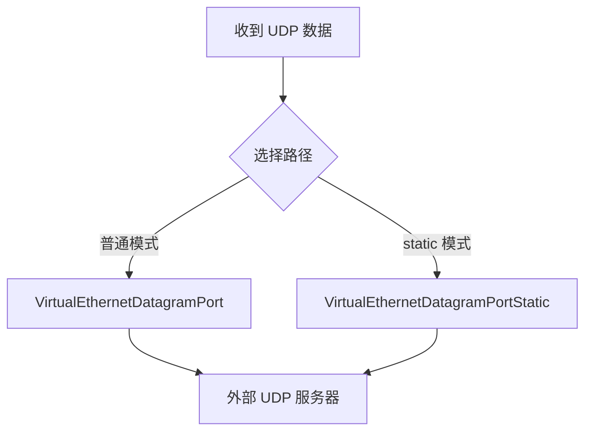
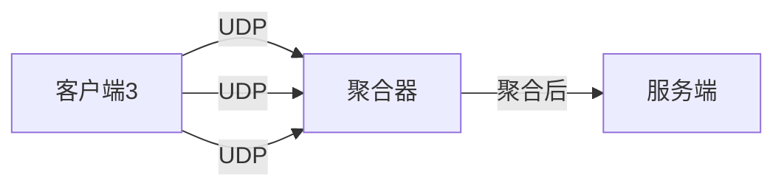
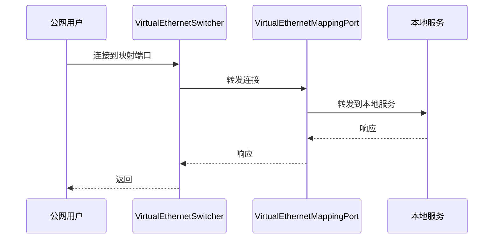
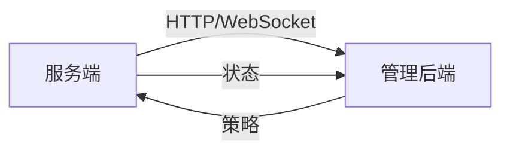
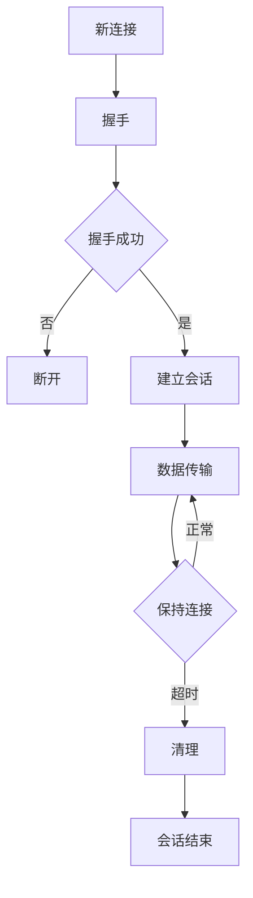
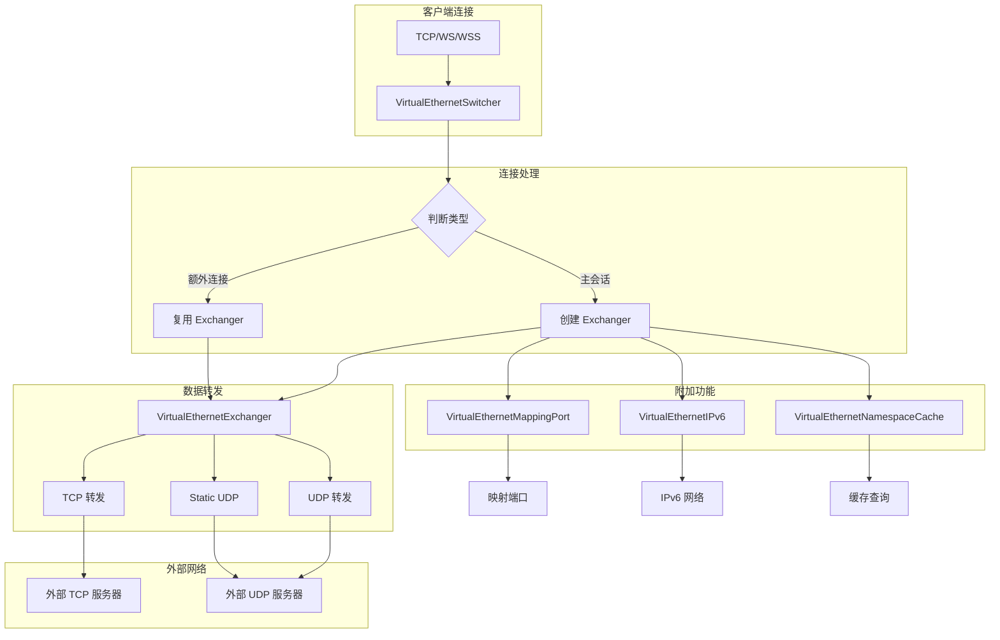

# 服务端架构

[English Version](SERVER_ARCHITECTURE.md)

## 文档范围

本文档基于 `ppp/app/server/` 下的真实 C++ 实现，详细解释 OPENPPP2 服务端运行时的工作方式。这里不采用"简化后的概念图"，而是按照源码中的控制流来描述。OPENPPP2 服务端不是一个只负责 accept socket 的进程，而是一个覆盖网络会话交换节点、转发边缘、策略消费端、可选管理后端客户端、可选 IPv6 分配与转发节点、可选 static UDP 端点，以及反向 mapping 暴露点。

这是一个虚拟以太网基础设施产品的重要组成部分，与传统 VPN 服务端有本质区别。服务端更接近网络基础设施，而不是传统意义上的"应用服务器"。

## 运行时定位

服务端最准确的理解方式，是把它看成一个多入口的 overlay 网络节点。

### 核心职责

| 职责 | 说明 | 对应组件 |
|------|------|----------|
| 接收多种类型的承载连接 | 接受 TCP、WS、WSS 连接 | `VirtualEthernetSwitcher` |
| 把承载连接包装成 `ITransmission` | 将连接转换为传输对象 | `VirtualEthernetSwitcher` |
| 判断主会话还是额外连接 | 区分连接类型 | `VirtualEthernetSwitcher` |
| 为每个 session 创建或替换 exchanger | 会话管理 | `VirtualEthernetExchanger` |
| 把 UDP 和 TCP 工作转发到真实网络 | 数据转发 | `VirtualEthernetExchanger`, `VirtualEthernetDatagramPort` |
| 向管理后端拉取策略 | 策略消费 | `VirtualEthernetManagedServer` |
| 分配并执行业务级 IPv6 | IPv6 管理 | `VirtualEthernetIPv6*` |
| 提供反向 mapping 暴露能力 | 端口映射 | `VirtualEthernetMappingPort` |
| 维护 static UDP 数据平面 | static 路径 | `VirtualEthernetDatagramPortStatic` |



从以上职责可以看出，服务端更接近网络基础设施，而不是传统意义上的"应用服务器"。

## 核心类型

服务端最核心的运行时类型包括：

| 类型 | 职责 | 源码位置 |
|------|------|----------|
| `VirtualEthernetSwitcher` | 服务端环境管理 | `VirtualEthernetSwitcher.*` |
| `VirtualEthernetExchanger` | 会话交换管理 | `VirtualEthernetExchanger.*` |
| `VirtualEthernetNetworkTcpipConnection` | TCP 连接管理 | `VirtualEthernetNetworkTcpipConnection.*` |
| `VirtualEthernetManagedServer` | 管理服务端 | `VirtualEthernetManagedServer.*` |
| `VirtualEthernetDatagramPort` | UDP 端口管理 | `VirtualEthernetDatagramPort.*` |
| `VirtualEthernetDatagramPortStatic` | static UDP 端口 | `VirtualEthernetDatagramPortStatic.*` |
| `VirtualEthernetNamespaceCache` | 命名空间缓存 | `VirtualEthernetNamespaceCache.*` |
| `VirtualEthernetMappingPort` | 映射端口 | `VirtualEthernetMappingPort.*` |
| `VirtualEthernetIPv6` | IPv6 管理 | `VirtualEthernetIPv6.*` |

这里最重要的边界，同样是 switcher 和 exchanger 的分离。

### Switcher 与 Exchanger 的职责分离



**VirtualEthernetSwitcher** 负责服务端的整体环境管理。它监听多种协议端口，接受连接，判断连接类型（主会话还是额外连接），创建和管理 exchanger。

**VirtualEthernetExchanger** 负责单个会话的处理。它处理 TCP 和 UDP 数据的转发，加密/解密数据，维护连接状态。

## VirtualEthernetSwitcher 详解

### 功能概述

`VirtualEthernetSwitcher` 是服务端环境管理的核心，负责：

| 功能 | 说明 |
|------|------|
| 多协议监听 | 同时监听 TCP、WebSocket、WSS 等多种协议 |
| 连接接受 | 接受客户端连接 |
| 会话管理 | 创建、替换、清理会话 |
| 主连接判断 | 判断是否为新的主会话 |
| 端口映射管理 | 管理反向映射端口 |
| namespace 缓存 | 管理命名空间缓存 |
| IPv6 管理 | 管理 IPv6 配置 |

### 监听器配置

| 协议 | 默认端口 | 说明 |
|------|----------|------|
| PPP (TCP) | 20000 | 原生 TCP 协议 |
| WebSocket | 20080 | HTTP 明文 WebSocket |
| WSS | 20443 | HTTPS 加密 WebSocket |
| UDP Static | 可配置 | UDP static 数据路径 |



### 连接类型判断

当接受到新连接时，`VirtualEthernetSwitcher` 需要判断这是什么类型的连接：

| 连接类型 | 判断依据 | 处理方式 |
|----------|----------|----------|
| 新主会话 | 新 session_id | 创建新的 exchanger |
| 额外连接 | 已有 session_id | 复用或创建额外会话通道 |
| MUX 子连接 | MUX 协议 | 交给 MUX 层处理 |

### 会话管理

| 操作 | 说明 |
|------|------|
| 创建会话 | 新连接到来时创建 |
| 替换会话 | 同一 client_id 的新连接可替换旧会话 |
| 清理会话 | 超时或客户端断开时清理 |
| 持久化 | 支持会话状态持久化（可选） |

## VirtualEthernetExchanger 详解

### 功能概述

`VirtualEthernetExchanger` 是服务端会话处理的核心，负责：

| 功能 | 说明 |
|------|------|
| 握手处理 | 完成服务端侧握手 |
| TCP 转发 | 将隧道内 TCP 数据转发到外部 |
| UDP 转发 | 将隧道内 UDP 数据转发到外部 |
| 数据加密/解密 | 加解密通过隧道的数据 |
| 连接状态维护 | 维护连接状态和 keepalive |
| 信息下发 | 向客户端下发配置信息 |

### 数据转发流程



### TCP 转发

TCP 转发是服务端最核心的功能之一：

| 组件 | 说明 |
|------|------|
| `VirtualEthernetNetworkTcpipConnection` | 管理 TCP 连接 |
| 连接池 | 复用外部连接 |
| 流量控制 | TCP 流量控制 |
| 保活 | 连接保活 |

### UDP 转发

UDP 转发支持两种模式：

| 模式 | 说明 |
|------|------|
| 普通 UDP | 标准的 UDP 转发 |
| Static UDP | 使用 static 路径的 UDP 转发 |



## VirtualEthernetDatagramPort 详解

### 功能概述

`VirtualEthernetDatagramPort` 管理 UDP 数据转发：

| 功能 | 说明 |
|------|------|
| UDP 监听 | 监听 UDP 端口 |
| 数据转发 | 转发 UDP 数据 |
| DNS 处理 | 处理 DNS 查询 |
| NAT 行为 | 实现 NAT 行为 |

### DNS 转发

当客户端配置了 static DNS 时，服务端需要处理 DNS 查询：

| 配置 | 说明 |
|------|------|
| `dns.redirect` | DNS 重定向地址 |
| `dns.cache` | 是否启用 DNS 缓存 |
| `dns.ttl` | DNS 缓存 TTL |

### 端口配置

| 参数 | 说明 |
|------|------|
| `udp.listen.port` | UDP 监听端口 |
| `udp.inactive.timeout` | 空闲超时 |
| `udp.dns.timeout` | DNS 查询超时 |

## VirtualEthernetDatagramPortStatic 详解

### 功能概述

`VirtualEthernetDatagramPortStatic` 提供 static UDP 路径服务：

| 功能 | 说明 |
|------|------|
| static UDP 监听 | 监听 static UDP 端口 |
| 流量聚合 | 支持多路 UDP 流量聚合 |
| 拥塞控制 | 拥塞窗口管理 |

### 聚合器配置

当配置了聚合器（aggligator）时：



| 参数 | 说明 |
|------|------|
| `static.aggligator` | 聚合器数量 |
| `static.servers` | 聚合服务器列表 |

## VirtualEthernetMappingPort 详解

### 功能概述

`VirtualEthernetMappingPort` 提供反向映射（端口映射）功能：

| 功能 | 说明 |
|------|------|
| 端口映射 | 将服务端端口映射到内部服务 |
| 协议支持 | TCP/UDP 协议支持 |
| 动态映射 | 支持动态端口映射 |

### 映射工作流程



### 配置示例

```json
{
    "mappings": [
        {
            "local-ip": "192.168.0.100",
            "local-port": 80,
            "protocol": "tcp",
            "remote-port": 8080
        }
    ]
}
```

## VirtualEthernetNamespaceCache 详解

### 功能概述

`VirtualEthernetNamespaceCache` 提供命名空间缓存功能：

| 功能 | 说明 |
|------|------|
| ARP 缓存 | 缓存 ARP 表项 |
| ND 缓存 | 缓存邻居发现表项 |
| 路由缓存 | 缓存路由表项 |

### 缓存策略

| 类型 | TTL | 说明 |
|------|-----|------|
| ARP | 可配置 | ARP 缓存条目 |
| ND | 可配置 | IPv6 邻居缓存 |
| 路由 | 可配置 | 路由缓存条目 |

## IPv6 支持

### IPv6 模式

| 模式 | 说明 |
|------|------|
| none | 不启用 IPv6 |
| NAT66 | NAT66 模式 |
| GUA | 全局单播地址 |
| 转发 | IPv6 转发 |

### IPv6 分配

服务端可以为客户端分配 IPv6 地址：


### IPv6 转发

当启用 IPv6 转发时，服务端可以充当 IPv6 网关：

| 功能 | 说明 |
|------|------|
| 转发 | 在客户端和外部 IPv6 网络间转发 |
| NAT66 | NAT66 地址转换 |
| 隧道 IPv6 | 通过隧道传递 IPv6 流量 |

## VirtualEthernetManagedServer 详解

### 功能概述

`VirtualEthernetManagedServer` 是可选的管理后端客户端：

| 功能 | 说明 |
|------|------|
| 后端连接 | 连接到管理后端 |
| 策略拉取 | 从后端拉取策略 |
| 状态上报 | 向后端上报状态 |
| 认证 | 与后端进行认证 |

### 配置参数

| 参数 | 说明 |
|------|------|
| `server.backend` | 管理后端 URL |
| `server.backend-key` | 认证密钥 |

### 通信协议



## 管理后端集成

### 策略类型

| 策略类型 | 说明 |
|----------|------|
| 路由策略 | 路由规则 |
| DNS 策略 | DNS 规则 |
| 带宽策略 | 带宽限制 |
| 白名单 | IP 白名单 |
| 黑名单 | IP 黑名单 |

### 状态上报

| 上报内容 | 频率 |
|----------|------|
| 连接数 | 60 秒 |
| 流量统计 | 10 秒 |
| 状态变化 | 实时 |

## 连接管理

### 连接生命周期



### 超时配置

| 参数 | 说明 | 默认值 |
|------|------|--------|
| `tcp.inactive.timeout` | TCP 空闲超时 | 300 秒 |
| `udp.inactive.timeout` | UDP 空闲超时 | 72 秒 |
| `mux.inactive.timeout` | MUX 空闲超时 | 60 秒 |

## 防火墙集成

### 防火墙规则

服务端支持防火墙规则配置：

| 功能 | 说明 |
|------|------|
| 入站规则 | 控制入站连接 |
| 出站规则 | 控制出站连接 |
| 连接限制 | 限制连接数 |

### 规则配置

```json
{
    "firewall-rules": [
        {
            "action": "allow",
            "source": "0.0.0.0/0",
            "destination": "0.0.0.0/0",
            "port": "80,443"
        }
    ]
}
```

## 数据流向完整图



## 错误处理

### 常见错误及处理

| 错误类型 | 原因 | 处理方式 |
|----------|------|----------|
| 端口占用 | 端口已被占用 | 尝试备用端口 |
| 内存不足 | 系统内存不足 | 拒绝新连接 |
| 后端通信失败 | 管理后端不可达 | 降级运行 |
| 会话错误 | 会话数据错误 | 关闭会话 |

### 日志级别

| 级别 | 说明 |
|------|------|
| ERROR | 错误信息 |
| WARN | 警告信息 |
| INFO | 一般信息 |
| DEBUG | 调试信息 |

## 性能优化

### 性能参数

| 参数 | 说明 | 推荐值 |
|------|------|--------|
| `concurrent` | 并发线程数 | CPU 核心数 |
| `tcp.backlog` | TCP 连接队列 | 511 |
| `tcp.turbo` | TCP 加速 | 启用 |
| `mux.congestions` | MUX 拥塞窗口 | 134217728 |

### 优化建议

1. **网络优化**：启用 TCP Turbo 和 Fast Open
2. **内存优化**：配置 vmem 大小
3. **并发优化**：根据 CPU 核心数调整并发数
4. **MUX 优化**：在高延迟场景启用 MUX

## 总结

OPENPPP2 服务端是一个复杂的网络基础设施，核心架构特点包括：

1. **多入口设计**：支持 TCP、WebSocket、WSS、UDP Static 多种连接方式
2. **Switcher/Exchanger 分离**：环境管理与会话管理分离
3. **完整的数据转发**：支持 TCP、UDP、static UDP 多种转发路径
4. **丰富的附加功能**：支持端口映射、IPv6、namespace 缓存
5. **可选管理后端**：支持策略拉取和状态上报
6. **灵活的防火墙规则**：支持细粒度的访问控制

理解这些架构特点对于正确部署和服务端运维至关重要。

## 相关文档

| 文档 | 说明 |
|------|------|
| [ARCHITECTURE_CN.md](ARCHITECTURE_CN.md) | 系统架构总览 |
| [CLIENT_ARCHITECTURE_CN.md](CLIENT_ARCHITECTURE_CN.md) | 客户端运行时架构 |
| [TRANSMISSION_CN.md](TRANSMISSION_CN.md) | 传输层与受保护隧道模型 |
| [LINKLAYER_PROTOCOL_CN.md](LINKLAYER_PROTOCOL_CN.md) | 链路层协议 |
| [PLATFORMS_CN.md](PLATFORMS_CN.md) | 平台支持与差异 |
