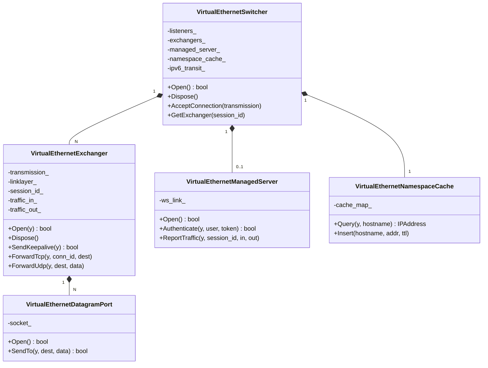
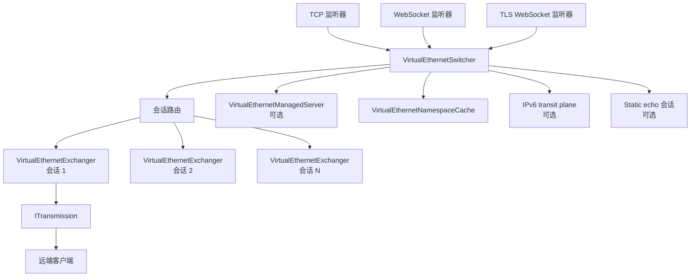
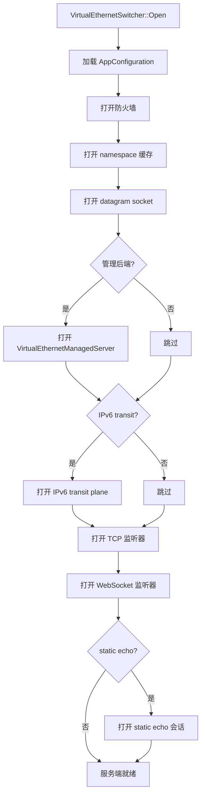
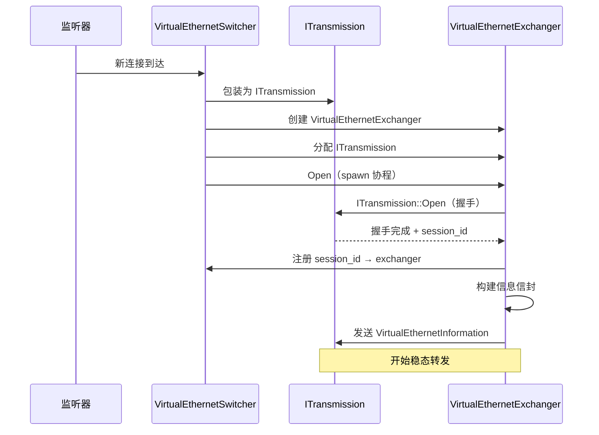

# 服务端架构

[English Version](SERVER_ARCHITECTURE.md)

## 范围

本文解释 `ppp/app/server/` 下的真实服务端运行时。
服务端是覆盖网络会话交换节点，不是简单的 socket 接收器。

---

## 运行时定位

服务端是一个多入口 overlay 节点，它：
- 在多种监听器类型上接收传输连接
- 把连接分配给会话对象
- 代表已连接的客户端转发 TCP 和 UDP 流量
- 维护每会话状态，包括映射、IPv6 租约和统计信息
- 可选地与管理后端通信以进行认证和计费

---

## 服务端对象全图



---

## 服务端拓扑



---

## 核心边界：Switcher vs Exchanger

最重要的架构边界：

| 类型 | 职责 | 生命周期 |
|------|------|---------|
| `VirtualEthernetSwitcher` | 监听器建立、连接接收、会话路由、资源协调 | 与服务端同生命周期 |
| `VirtualEthernetExchanger` | 单会话：握手、转发、状态、保活 | 一条客户端连接的生命周期 |

这种分离防止了接收时逻辑与转发时逻辑的耦合。
添加新的传输类型只需修改 `VirtualEthernetSwitcher`。
会话级行为变更只需修改 `VirtualEthernetExchanger`。

---

## 服务端启动流程



源文件：`ppp/app/server/VirtualEthernetSwitcher.cpp`

---

## 连接接收流程



---

## 会话状态机

```mermaid
stateDiagram-v2
    [*] --> 监听器就绪
    监听器就绪 --> 连接到达 : accept()
    连接到达 --> 握手进行中 : ITransmission::Open
    握手进行中 --> 握手失败 : 超时或错误
    握手进行中 --> 会话已建立 : 握手成功
    会话已建立 --> 信息已下发 : SendInformation
    信息已下发 --> 转发中 : 客户端确认
    转发中 --> 保活检查中 : 保活定时器
    保活检查中 --> 转发中 : 收到响应
    保活检查中 --> 会话超时 : 无响应
    转发中 --> 会话已关闭 : 客户端断开
    握手失败 --> [*]
    会话超时 --> [*]
    会话已关闭 --> [*]
```

---

## `VirtualEthernetSwitcher` 深度剖析

### 它持有什么

| 资源 | 描述 |
|------|------|
| `listeners_` | TCP 和 WebSocket acceptor |
| `exchangers_` | `session_id` 到活跃 exchanger 的映射 |
| `managed_server_` | 可选管理后端桥 |
| `namespace_cache_` | DNS 结果缓存 |
| `ipv6_transit_` | 可选 IPv6 transit plane |
| `static_echo_sessions_` | 可选 static UDP echo 会话 |
| `firewall_` | 防火墙策略引用 |

### 主会话 vs 附加连接

客户端可以向同一服务端打开多条传输连接，用于 mux 或补充路径。
switcher 对每条新连接进行分类：
- **主会话**：该 `session_id` 无现有 exchanger → 创建新 exchanger。
- **附加连接**：找到现有 exchanger → 作为附加传输附着。

源文件：`ppp/app/server/VirtualEthernetSwitcher.h`

### 关键 API

```cpp
/**
 * @brief 打开服务端及其所有配置的子系统。
 * @return 所有必需的子系统都成功打开时返回 true。
 * @note   失败时设置诊断信息。
 */
bool Open() noexcept;

/**
 * @brief 接收新入站传输，创建或附着 exchanger。
 * @param transmission  新接收的 ITransmission。
 * @param acceptor_kind 接收该连接的监听器类型。
 * @return true 表示连接已被接受并派发。
 */
bool AcceptConnection(
    const std::shared_ptr<ITransmission>& transmission,
    int acceptor_kind) noexcept;

/**
 * @brief 按 session_id 查找活跃 exchanger。
 * @param session_id  Int128 会话标识。
 * @return            exchanger 的 shared_ptr，未找到时为空。
 */
std::shared_ptr<VirtualEthernetExchanger> GetExchanger(const Int128& session_id) noexcept;
```

---

## `VirtualEthernetExchanger` 深度剖析

### 它持有什么

| 资源 | 描述 |
|------|------|
| `transmission_` | 该会话的 `ITransmission` |
| `linklayer_` | `VirtualEthernetLinklayer` 动作处理器 |
| `session_id_` | `Int128` 会话标识 |
| `traffic_in_` | 入流量计数器 |
| `traffic_out_` | 出流量计数器 |
| `tcp_connections_` | 活跃 TCP 流的映射 |
| `udp_ports_` | 活跃 UDP datagram port 的映射 |
| `mappings_` | FRP 反向映射 |
| `ipv6_lease_` | IPv6 地址租约（如已分配） |

### 关键 API

```cpp
/**
 * @brief 打开 exchanger 并开始会话生命周期。
 * @param y  协程执行的 yield 上下文。
 * @return   会话建立并开始转发时返回 true。
 */
bool Open(YieldContext& y) noexcept;

/**
 * @brief 代表该会话转发 TCP 连接请求。
 * @param y          Yield 上下文。
 * @param conn_id    连接标识符（调用方指定）。
 * @param dest       目标端点。
 * @return           TCP 流成功打开时返回 true。
 */
bool ForwardTcp(YieldContext& y, ppp::Int32 conn_id, const IPEndPoint& dest) noexcept;

/**
 * @brief 代表该会话转发 UDP 数据报。
 * @param y          Yield 上下文。
 * @param dest       目标端点。
 * @param data       数据报 payload。
 * @param length     payload 长度。
 * @return           数据报已发送时返回 true。
 */
bool ForwardUdp(YieldContext& y, const IPEndPoint& dest,
                const Byte* data, int length) noexcept;

/**
 * @brief 向客户端发送保活 echo。
 * @param y  Yield 上下文。
 * @return   echo 发送成功时返回 true。若未及时收到响应，会话将被终止。
 */
bool SendKeepalive(YieldContext& y) noexcept;
```

源文件：`ppp/app/server/VirtualEthernetExchanger.h`

---

## 监听器集合

服务端可以暴露多种入口类型：

| 监听器类型 | 配置键 | 协议 |
|-----------|--------|------|
| TCP | `server.listen.tcp` | 原始 TCP |
| WebSocket | `server.listen.ws` | HTTP WebSocket |
| TLS WebSocket | `server.listen.wss` | HTTPS WebSocket |
| UDP static | `server.listen.udp` | 原始 UDP（static echo） |

启用哪些类型取决于配置。
所有监听器类型都把连接投递给 `VirtualEthernetSwitcher::AcceptConnection`。

---

## 管理与策略

服务端可以查询 `VirtualEthernetManagedServer` 以获得：
- 用户认证
- 额度与过期查询
- 流量计费

这是可选的。数据面完全留在 C++ 进程内。
如果后端不可达，服务端回退到本地缓存策略。

---

## 数据面

### TCP 转发

每会话 TCP 转发由 `VirtualEthernetExchanger` 管理：
1. 客户端发送带目标端点的 `ConnectTcp` 动作。
2. exchanger 打开到目标的 TCP socket。
3. 数据通过会话双向流动：`PushTcp` 动作。
4. 任意一侧都可以发送 `DisconnectTcp` 关闭流。

### UDP 转发

每会话 UDP 由 `VirtualEthernetDatagramPort` 管理：
1. 客户端发送带目标和 payload 的 `SendUdp` 动作。
2. 服务端创建或复用该（会话、源端口）对的 `VirtualEthernetDatagramPort`。
3. 服务端转发到真实目标。
4. 响应通过 `VirtualEthernetDatagramPort` 路由回会话。

### Static UDP 路径

Static UDP 绕过每会话机制，作为独立的监听器处理。

---

## 配置的作用

`AppConfiguration` 控制：

| 配置字段 | 效果 |
|---------|------|
| `server.listen.tcp` | 启用/禁用 TCP 监听器 |
| `server.listen.ws` | 启用/禁用 WebSocket 监听器 |
| `server.listen.wss` | 启用/禁用 TLS WebSocket 监听器 |
| `server.backend` | 启用/配置管理后端 URL |
| `server.firewall` | 防火墙策略文件路径 |
| `server.ipv6` | 启用 IPv6 transit plane |
| `server.static` | 启用 static echo 会话 |

源文件：`ppp/configurations/AppConfiguration.h`

---

## 实现要点

服务端还负责：

| 功能 | 描述 |
|------|------|
| 防火墙 | 每会话和全局访问控制 |
| 传输统计 | 每会话字节计数器 |
| NAT 记账 | UDP 端口映射表 |
| IPv6 租约追踪 | 每客户端 IPv6 地址分配 |
| Static echo 会话 | 独立 UDP echo 路径 |
| Mux 建立与拆除 | 多路复用传输配置 |
| 管理后端上报点 | 流量计费推送到后端 |

因此服务端既是转发节点，也是策略协调节点。

---

## 错误码参考

服务端相关的 `ppp::diagnostics::ErrorCode` 值：

| ErrorCode | 描述 |
|-----------|------|
| `ServerListenerOpenFailed` | 无法打开 TCP 或 WebSocket 监听器 |
| `ServerFirewallOpenFailed` | 防火墙初始化失败 |
| `HandshakeFailed` | 客户端握手未完成 |
| `HandshakeTimeout` | 客户端握手超时 |
| `AuthenticationFailed` | 会话被拒绝 |
| `ManagedServerConnectionFailed` | 无法连接管理后端 |
| `ManagedServerAuthenticationFailed` | 后端拒绝用户 |
| `KeepaliveTimeout` | 客户端保活超时 |
| `SessionExpired` | 会话因策略过期 |
| `QuotaExceeded` | 会话额度耗尽 |

---

## 相关文档

- [`ARCHITECTURE_CN.md`](ARCHITECTURE_CN.md)
- [`CLIENT_ARCHITECTURE_CN.md`](CLIENT_ARCHITECTURE_CN.md)
- [`TUNNEL_DESIGN_CN.md`](TUNNEL_DESIGN_CN.md)
- [`TRANSMISSION_PACK_SESSIONID_CN.md`](TRANSMISSION_PACK_SESSIONID_CN.md)
- [`MANAGEMENT_BACKEND_CN.md`](MANAGEMENT_BACKEND_CN.md)
- [`CONFIGURATION_CN.md`](CONFIGURATION_CN.md)
