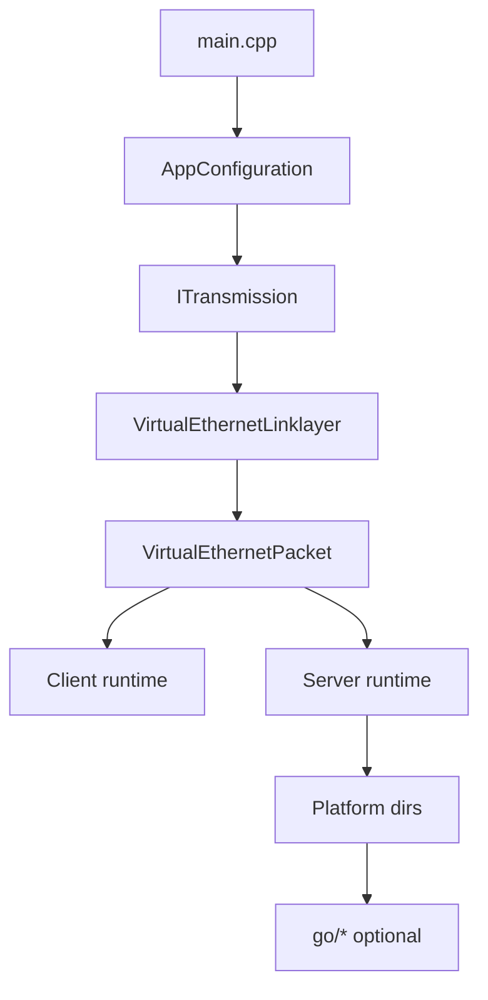
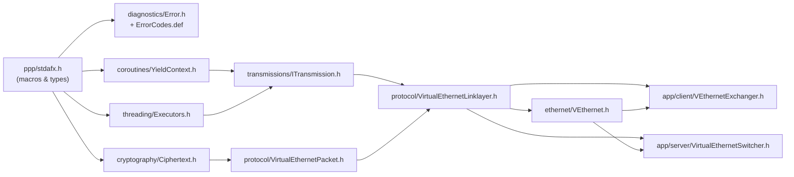

# Source Reading Guide

[中文版本](SOURCE_READING_GUIDE_CN.md)

## Goal

This guide helps engineers read OPENPPP2 in a useful order.

## Reading Order

1. `main.cpp`
2. `ppp/configurations/AppConfiguration.*`
3. `ppp/transmissions/ITransmission.*`
4. `ppp/app/protocol/VirtualEthernetLinklayer.*`
5. `ppp/app/protocol/VirtualEthernetPacket.*`
6. `ppp/app/client/*`
7. `ppp/app/server/*`
8. platform directories
9. `go/*` last



## What To Focus On

- startup and role selection
- configuration defaults and normalization
- handshake and framing
- tunnel action vocabulary
- client route and DNS steering
- server session switching and forwarding
- platform-specific host effects
- management backend only after the core runtime is clear

## Common Mistakes

- reading platform code before understanding the shared core
- confusing `ITransmission` framing with packet formats
- treating client and server exchangers as symmetric
- assuming the Go backend is the data plane

## Practical Reading Rule

If a line in the platform directory changes routes, DNS, adapter state, firewall state, or socket protection, treat it as runtime behavior, not helper code.

If a line in `ITransmission` changes handshake state or frame shape, treat it as transport policy, not plumbing.

## Related Documents

- `ARCHITECTURE.md`
- `TUNNEL_DESIGN.md`
- `CLIENT_ARCHITECTURE.md`
- `SERVER_ARCHITECTURE.md`
- `EDSM_STATE_MACHINES.md`

---

## Chapter 5: Key File-by-File Walkthrough

This chapter provides a concise description of each critical source file. Read them in the order listed for maximum coherence.

### `ppp/stdafx.h` — Foundation Macros and Type Aliases

This is the mandatory first read. Every `.cpp` file in the `ppp/` tree includes it as a precompiled header. It defines the cross-platform compatibility layer: `NULLPTR` (replacing `nullptr`/`NULL`), `elif` (replacing `else if`), platform guards (`_WIN32`, `_LINUX`, `_ANDROID`, `_MACOS`), and fixed-width integer aliases (`ppp::Byte`, `ppp::Int32`, `ppp::UInt64`, etc.). It also pulls in the `ppp::allocator<T>` that routes through jemalloc when the `JEMALLOC` macro is defined. Never use raw `nullptr`, `NULL`, or `else if` in `ppp/` files — these macros exist for portability reasons that are subtle but real. Reading `stdafx.h` before anything else prevents the confusion of encountering project-specific idioms cold.

### `ppp/diagnostics/Error.h` + `ErrorCodes.def` — Error Code System

These two files together define the project-wide error vocabulary. `Error.h` declares the `Error` enumeration and helper functions for converting error codes to human-readable strings. `ErrorCodes.def` is an X-macro file: it lists every error constant once, and `Error.h` includes it multiple times under different macro expansions to generate both the enum values and the string table without duplication. This pattern keeps the error set as a single source of truth. When a function fails, it calls `SetLastErrorCode(Error::XYZ)` and returns the sentinel value; there is no logging inside the failure path. Learn this pattern early — violating it by adding `printf` calls to failure branches will be rejected at review.

### `ppp/threading/Executors.h/.cpp` — Thread Pool and Coroutine Scheduling

`Executors` is the runtime scheduler. It wraps Boost.Asio `io_context` instances and exposes `Post`, `Dispatch`, and `Spawn` helpers that hide the strand and coroutine bookkeeping from callers. `GetTickCount()` here is the monotonic millisecond clock used project-wide for timeouts and keep-alive timing — do not use `std::chrono` directly in protocol code. The thread pool size maps to available hardware threads and is configured at startup. Understanding `Executors` is a prerequisite for reading any code that touches timers, because idle-timeout logic in `VirtualEthernetLinklayer` calls `Executors::GetTickCount()` on every packet receipt and in `DoKeepAlived`.

### `ppp/coroutines/YieldContext.h` — Coroutine Core and `nullof<>` Semantics

`YieldContext` wraps a Boost.Asio stackful coroutine yield context. It is threaded through virtually every network I/O call so that callers can `co_await`-style suspend without blocking the IO thread. The critical detail is the `nullof<YieldContext>()` pattern: it returns a reference to a zero-initialized sentinel object whose address is detectable by callees. When a callee checks `if (y)` or compares the address against NULLPTR-equivalent, it selects between coroutine-async and thread-blocking code paths. `DoKeepAlived` uses `nullof<YieldContext>()` deliberately when sending keep-alive packets outside the main coroutine. Never replace this with a real default-constructed object or a pointer — the sentinel address check is intentional design, not UB.

### `ppp/app/protocol/VirtualEthernetLinklayer.h` — Link-Layer State Machine, EDSM Center

This file is the protocol heart of the system. `VirtualEthernetLinklayer` is the base class for all client and server session objects. It defines the `PacketAction` opcode enum (17 opcodes covering TCP, UDP, FRP, MUX, NAT, LAN, ECHO, INFO, KEEPALIVED), the `AddressType` wire encoding for endpoints, and the full `Do*` / `On*` virtual method pairs. The `Do*` methods serialize outbound frames; the `On*` methods are dispatch targets for inbound frames after `PacketInput` decodes the action byte. `Run()` is the receive loop that feeds `PacketInput` in a coroutine. `DoKeepAlived()` is called by a timer to maintain link liveness. All client/server behavior is implemented by overriding `On*` in derived classes — the base class only does wire encoding/decoding and dispatch. See `EDSM_STATE_MACHINES.md` for a complete state diagram.

### `ppp/app/protocol/VirtualEthernetPacket.h` — Packet Wire Format

`VirtualEthernetPacket` is the struct that carries a decoded NAT-layer payload. It holds the inner IP protocol number, session ID, source/destination IPv4 endpoints, and the payload buffer under shared ownership. The static `Pack` methods encode an `IPFrame` or raw UDP payload into an encrypted transport buffer by calling `Ciphertext()` to obtain the session-specific cipher pair (protocol layer + transport layer). The static `Unpack` method reverses this: it decrypts, validates, and fills a `VirtualEthernetPacket`. The `Ciphertext` static method derives both cipher objects from the session GUID, FSID, and session ID — changing any of these three fields changes the key material. Read this file alongside `ppp/cryptography/Ciphertext.h` and the EVP wrapper to understand the full encryption pipeline.

### `ppp/transmissions/ITransmission.h` — Transport Carrier Abstraction

`ITransmission` is the pure-virtual interface that hides the concrete carrier — TCP, WebSocket, KCP-over-UDP, or others — from the link layer. It exposes two primitives: `Write(YieldContext&, Byte*, int)` for framed outbound data and `Read(YieldContext&, int&)` for framed inbound data. The frame boundary is enforced by the transmission implementation, not the caller. Handshake negotiation happens inside the transmission before the link layer ever sees a byte. When reading `ITransmission` implementations, distinguish between the carrier (raw socket), the protected channel (after key exchange), and the framing (length-prefix or WebSocket opcode). Confusing these three layers is the single most common mistake new contributors make.

### `ppp/ethernet/VEthernet.h` — Virtual Ethernet Device (lwIP Integration)

`VEthernet` represents a virtual NIC backed by lwIP. It has three states: `Open` (TAP device acquired, lwIP stack initialized), `Running` (IP stack active, packets flowing), and `Disposed` (all resources released). The TAP input path reads raw Ethernet frames from the OS TAP driver and injects them into lwIP. The lwIP output path takes IP frames from the stack and hands them to the session's `DoNat` or `VirtualEthernetPacket::Pack` path for tunnel encapsulation. Understanding this file requires familiarity with lwIP's `netif` callbacks and `pbuf` memory model. On Android the TAP is replaced by a VPN service fd, but the `VEthernet` interface remains the same.

### `ppp/app/client/VEthernetExchanger.h` — Client Session Core

`VEthernetExchanger` is the client's active session object. It derives from `VirtualEthernetLinklayer` and overrides the `On*` handlers to implement client-side behavior: receiving SYNOK to complete a proxied TCP connect, receiving SENDTO to inject a UDP payload into the lwIP stack, sending SYN when lwIP creates a new outbound TCP connection, and so on. It owns the `ITransmission` to the server and drives the `Run()` loop inside a coroutine spawned by `Executors`. The exchanger is created fresh for each connection to a server and is disposed when the session ends or the link-layer keep-alive expires.

### `ppp/app/server/VirtualEthernetSwitcher.h` — Server Session Core

`VirtualEthernetSwitcher` is the server's session manager. It maintains a map of active client sessions, each represented by a server-side `VirtualEthernetLinklayer` subclass. When a client sends SYN, the switcher creates a real TCP socket to the destination and relays data in both directions. When a client sends SENDTO, the switcher opens a UDP socket bound to the server's egress address and forwards the datagram. The switcher enforces per-session bandwidth QoS (from the INFO frame) and applies firewall rules before any outbound socket operation. Server-side session objects are not symmetric to client objects: the server never initiates SYN or SENDTO — it only responds.

---

## Chapter 6: Recommended Reading Order for Common Tasks

Use these paths when you have a specific goal rather than a full system survey.

### "I want to understand how data is encrypted in transit"

```
ppp/cryptography/Ciphertext.h          -- cipher interface (EVP wrapper)
ppp/app/protocol/VirtualEthernetPacket.h  -- Ciphertext() key derivation
VirtualEthernetPacket::Pack / Unpack   -- where encryption is applied
ppp/transmissions/ITransmission.h      -- transmission-layer cipher (outer)
HANDSHAKE_SEQUENCE.md                  -- key exchange before data flows
```

The two cipher layers — protocol (inner, per-session) and transport (outer, per-transmission) — are derived independently. Protocol cipher key material comes from `(guid, fsid, session_id)`; transport cipher key material is established during the handshake in `ITransmission`. Neither layer knows about the other.

### "I want to understand how a new connection is established"

```
HANDSHAKE_SEQUENCE.md                  -- overall flow narrative
ppp/transmissions/ITransmission.h      -- handshake inside the carrier
VirtualEthernetLinklayer::DoConnect    -- client sends SYN opcode
VirtualEthernetLinklayer::OnConnect    -- server receives SYN, opens socket
VirtualEthernetLinklayer::DoConnectOK  -- server sends SYNOK with error code
VirtualEthernetLinklayer::OnConnectOK  -- client learns connect result
ppp/app/client/VEthernetExchanger.h   -- client-side connect initiation
ppp/app/server/VirtualEthernetSwitcher.h  -- server-side connect handling
```

The key insight: `ITransmission` handshake completes first, then `VirtualEthernetLinklayer::Run()` begins. The SYN / SYNOK exchange happens entirely within the link-layer protocol on top of an already-protected transmission channel.

### "I want to add a new PacketAction opcode"

```
1. ppp/app/protocol/VirtualEthernetLinklayer.h
   -- Add the new enum value to PacketAction with a comment.

2. VirtualEthernetLinklayer.cpp :: PacketInput()
   -- Add a new else-if branch. Parse the wire format. Call an On* handler.

3. VirtualEthernetLinklayer.h
   -- Declare virtual Do*() and On*() methods for the new action.

4. VirtualEthernetLinklayer.cpp
   -- Implement Do*() to serialize and transmit the frame.

5. ppp/app/client/VEthernetExchanger.h/.cpp
   -- Override On*() for client-side behavior.

6. ppp/app/server/VirtualEthernetSwitcher.h/.cpp
   -- Override On*() for server-side behavior.

7. LINKLAYER_PROTOCOL.md + LINKLAYER_PROTOCOL_CN.md
   -- Document the new opcode wire format and semantics.
```

Keep opcodes in the hex range that does not collide with existing values. Assign client-initiates and server-initiates symmetrically (e.g., MUX / MUXON pattern).

### "I want to understand how IPv6 works"

```
ppp/app/protocol/VirtualEthernetLinklayer.h  -- AddressType::IPv6 encoding
VirtualEthernetLinklayer.cpp :: PacketInput  -- SENDTO / SYN IPv6 parsing
ppp/net/Ipep.h                               -- IP endpoint utilities (v4/v6)
ppp/ethernet/VEthernet.h                     -- lwIP IPv6 netif setup
docs/IPV6_FIXES.md                           -- known fixes and edge cases
ppp/app/client/VEthernetExchanger.h          -- client IPv6 route steering
```

IPv6 support is threaded through the `AddressType` enum in the link-layer wire format. An IPv6 address is encoded as 16 raw bytes in network order; a domain name that resolves to AAAA is encoded as `AddressType::Domain` and resolved asynchronously inside `PACKET_IPEndPoint<>` using `YieldContext`. The firewall applies `IsDropNetworkSegment` after resolution.

---

## Chapter 7: File Dependency Reading Map

The following diagram shows the import hierarchy across the key files. Read nodes on the left before nodes on the right.


