# 源码阅读指南

[English Version](SOURCE_READING_GUIDE.md)

## 目标

这份指南帮助工程师按有用的顺序阅读 OPENPPP2。它写于这样一个假设：你不只想知道代码做了什么，也想知道它为什么这样组织。目标是让你以最少的弯路尽快在代码库中上手。

---

## 阅读顺序

从进程根部开始，向外扩展到宿主后果。

1. `main.cpp`
2. `ppp/configurations/AppConfiguration.*`
3. `ppp/transmissions/ITransmission.*`
4. `ppp/app/protocol/VirtualEthernetLinklayer.*`
5. `ppp/app/protocol/VirtualEthernetPacket.*`
6. `ppp/app/client/*`
7. `ppp/app/server/*`
8. 平台目录（`linux/`、`windows/`、`android/`、`darwin/`）
9. 最后再看 `go/*`

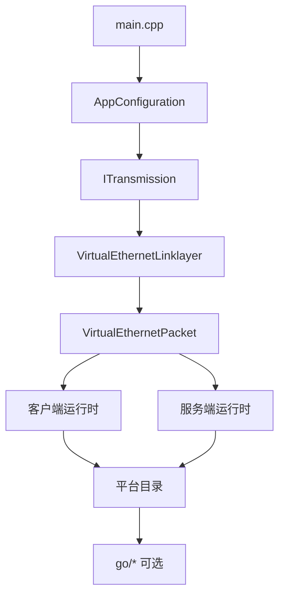

---

## 重点关注

| 区域 | 为什么重要 |
|------|------------|
| 启动与角色选择 | 决定整个会话的对象拓扑 |
| 配置默认值和规范化 | `AppConfiguration` 是架构组件，不只是解析器 |
| 握手与分帧 | 所有会话行为都依赖此先完成 |
| 隧道动作词汇 | 两端都使用的共享 opcode 集 |
| 客户端路由与 DNS steering | 宿主集成是可观测的运行时行为，不是辅助代码 |
| 服务端会话交换与转发 | 所有客户端流量都经过这里 |
| 平台特化宿主副作用 | 路由、DNS、适配器、防火墙变更是数据面的一部分 |
| 管理后端 | 核心运行时理解后再读 |

---

## 常见错误

| 错误 | 后果 |
|------|------|
| 还没理解共享核心就先看平台代码 | 没有核心上下文，平台行为看起来不知所云 |
| 把 `ITransmission` framing 和 packet format 混为一谈 | 这是两个独立的密钥层，密钥材料来源不同 |
| 把 client 和 server exchanger 当成对称实现 | 服务端从不发起 SYN 或 SENDTO；角色差异是根本性的 |
| 以为 Go 后端是 data plane | Go 后端是可选的，只涉及认证/webhook，所有数据流经 C++ |
| 在 `ppp/` 代码中使用 `nullptr` 而不是 `NULLPTR` | 违反 `stdafx.h` 约定，代码评审会拒绝 |
| 写 `else if` 而不是 `elif` | 原因相同 |
| 在失败路径调用 `printf` | 项目使用错误码传播，路径内严禁日志 |

---

## 实用规则

如果平台目录中的代码修改了路由、DNS、适配器、防火墙或者 socket 保护，就要把它当作运行时行为，而不是普通辅助函数。

如果 `ITransmission` 中的代码改变了握手状态或帧形状，就要把它当作传输策略，而不是机械的读写封装。

如果 `VirtualEthernetLinklayer` 中的函数以 `Do*` 开头，它序列化并发送帧；如果以 `On*` 开头，它是接收帧的分发目标。

---

## 相关文档

- [`ARCHITECTURE_CN.md`](ARCHITECTURE_CN.md)
- [`TUNNEL_DESIGN_CN.md`](TUNNEL_DESIGN_CN.md)
- [`CLIENT_ARCHITECTURE_CN.md`](CLIENT_ARCHITECTURE_CN.md)
- [`SERVER_ARCHITECTURE_CN.md`](SERVER_ARCHITECTURE_CN.md)
- [`EDSM_STATE_MACHINES_CN.md`](EDSM_STATE_MACHINES_CN.md)
- [`LINKLAYER_PROTOCOL_CN.md`](LINKLAYER_PROTOCOL_CN.md)
- [`HANDSHAKE_SEQUENCE_CN.md`](HANDSHAKE_SEQUENCE_CN.md)

---

## 第1章：先决条件

在阅读任何 C++ 源码之前，先理解这两条不变量：

1. **`stdafx.h` 始终是第一个 include。** `ppp/` 下的每一个 `.cpp` 都将其作为预编译头引入。它定义了其余代码使用的词汇（`NULLPTR`、`elif`、平台宏、类型别名）。没有先读 `stdafx.h` 就去读其他文件，非标准构造会让你困惑。

2. **失败路径调用 `SetLastErrorCode` 并返回哨兵值。** 内部没有 `printf`、没有 `std::cerr`、没有日志框架。错误以返回值传播。如果你在失败路径加了日志调用，评审会拒绝。

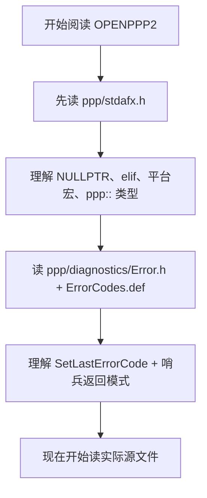

---

## 第2章：层次栈心智模型

在阅读单个文件之前，先内化层次栈。

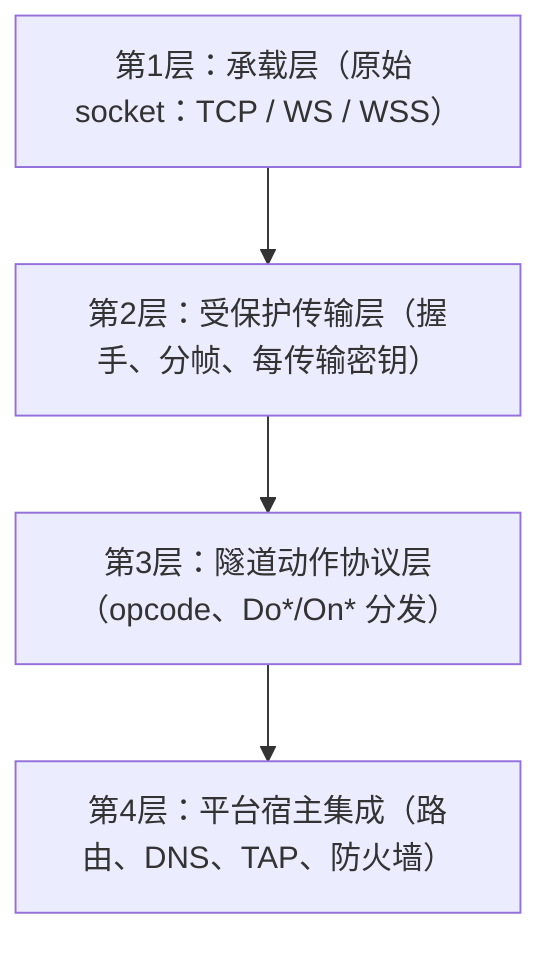

每个文件都属于其中一层。层次混淆是代码库中大多数架构误解的根本原因。

| 层 | 文件 |
|----|------|
| 承载层 | `ppp/transmissions/ITcpipTransmission.*`、`ppp/transmissions/IWebsocketTransmission.*` |
| 受保护传输层 | `ppp/transmissions/ITransmission.*`、`ppp/cryptography/Ciphertext.*` |
| 隧道动作协议层 | `ppp/app/protocol/VirtualEthernetLinklayer.*`、`VirtualEthernetPacket.*`、`VirtualEthernetInformation.*` |
| 平台宿主集成 | `linux/*`、`windows/*`、`android/*`、`darwin/*` |

---

## 第3章：并发心智模型

在阅读任何会话代码之前，先内化并发模型。

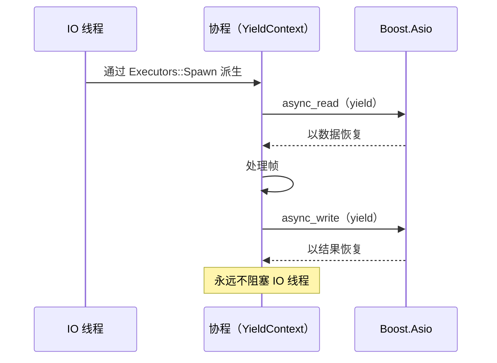

关键规则：
- IO 线程严禁阻塞。
- 阻塞工作通过 `asio::post` 提交。
- 跨线程生命周期通过 `std::shared_ptr` / `std::weak_ptr` 管理。
- 生命周期状态标志为 `std::atomic<bool>` + `compare_exchange_strong(memory_order_acq_rel)`。
- 计时器和 tick 计数使用 `Executors::GetTickCount()`，不要直接使用 `std::chrono`。

---

## 第4章：`nullof<T>` 语义

`nullof<T>()` 模式遍布代码库，大多数初次阅读者都会困惑。下面解释它的含义。

`nullof<YieldContext>()` 返回一个指向已知地址的零初始化哨兵对象的引用。被调用方检查 `if (y)` 或将地址与 NULLPTR 等效值比较，以检测这个哨兵。检测到哨兵时，切换到线程阻塞代码路径，而不是协程异步路径。

这在 `DoKeepAlived()` 中被故意使用，用于在主接收协程之外发送保活包。不要将其替换为真正的默认构造对象或指针——地址检查是有意为之的设计，而非 UB。

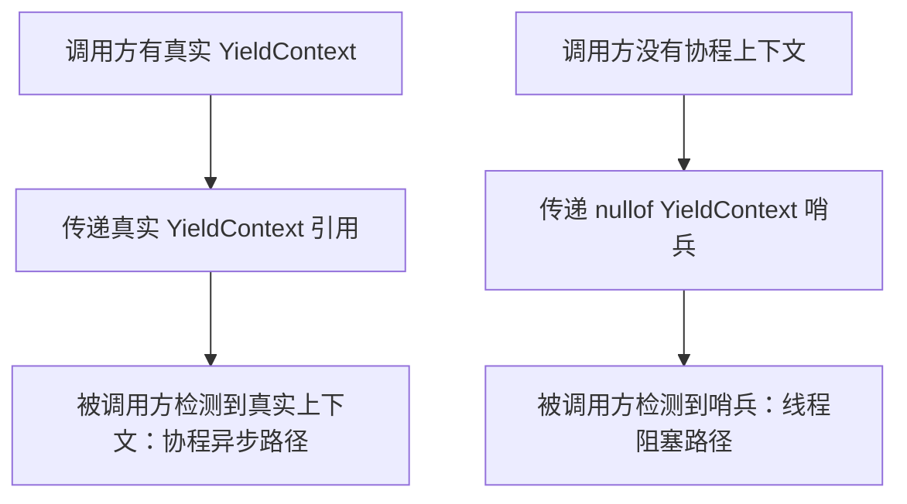

---

## 第5章：关键文件逐一解析

本章对每个核心源文件进行简明说明，按照列出顺序阅读可获得最佳连贯性。

### `ppp/stdafx.h` — 基础宏与类型别名

这是必须最先阅读的文件。`ppp/` 目录下的每一个 `.cpp` 文件都将其作为预编译头引入。它定义了跨平台兼容层：`NULLPTR`（替代 `nullptr`/`NULL`）、`elif`（替代 `else if`）、平台宏（`_WIN32`、`_LINUX`、`_ANDROID`、`_MACOS`）以及固定宽度整数别名（`ppp::Byte`、`ppp::Int32`、`ppp::UInt64` 等）。它还引入了 `ppp::allocator<T>`，在定义了 `JEMALLOC` 宏时会路由到 jemalloc 分配器。在 `ppp/` 文件中绝不能直接使用 `nullptr`、`NULL` 或 `else if`。

**关键条目：**

| 条目 | 含义 |
|------|------|
| `NULLPTR` | 在所有 `ppp/` 代码中替代 `nullptr` 或 `NULL` |
| `elif` | 在所有 `ppp/` 代码中替代 `else if` |
| `_WIN32`、`_LINUX`、`_ANDROID`、`_MACOS` | 平台宏——使用这些，不要用 `__linux__` 或 `_MSC_VER` |
| `ppp::Byte`、`ppp::Int32`、`ppp::UInt64` | 固定宽度整数别名 |
| `ppp::string`、`ppp::vector<T>` | 带 jemalloc 感知分配器的 STL 类型别名 |
| `ppp::allocator<T>` | 定义了 `JEMALLOC` 时路由到 jemalloc |

### `ppp/diagnostics/Error.h` + `ErrorCodes.def` — 错误码体系

这两个文件共同定义了整个项目的错误词汇。`Error.h` 声明了 `Error` 枚举和将错误码转换为可读字符串的辅助函数。`ErrorCodes.def` 是一个 X-macro 文件：每个错误常量只写一次，`Error.h` 在不同宏展开下多次包含它，从而同时生成枚举值和字符串表，避免重复。函数失败时调用 `SetLastErrorCode(Error::XYZ)` 并返回哨兵值，失败路径内不打印任何日志。

### `ppp/threading/Executors.h/.cpp` — 线程池与协程调度

`Executors` 是运行时调度器。它封装了 Boost.Asio `io_context` 实例，并暴露 `Post`、`Dispatch`、`Spawn` 等辅助方法。这里的 `GetTickCount()` 是全项目统一使用的单调毫秒时钟——协议代码中不要直接使用 `std::chrono`。理解 `Executors` 是阅读任何涉及定时器代码的先决条件。

### `ppp/coroutines/YieldContext.h` — 协程核心与 `nullof<>` 语义

`YieldContext` 封装了 Boost.Asio 有栈协程的 yield 上下文。它被穿透传递给几乎所有网络 I/O 调用，使调用者可以以类似 `co_await` 的方式挂起，而不阻塞 IO 线程。关键细节在于 `nullof<YieldContext>()` 模式（见第4章）。

### `ppp/app/protocol/VirtualEthernetLinklayer.h` — 链路层状态机，EDSM 核心

这个文件是系统的协议核心。`VirtualEthernetLinklayer` 是所有客户端和服务端会话对象的基类。它定义了 `PacketAction` 操作码枚举（17 个操作码）、`AddressType` wire 格式，以及完整的 `Do*`/`On*` 虚方法对。完整的状态图请参见 `EDSM_STATE_MACHINES_CN.md`。

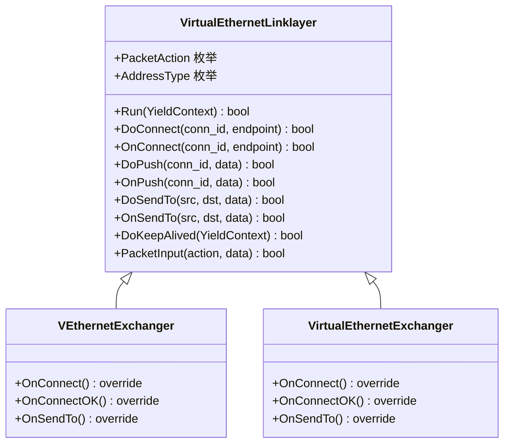

### `ppp/app/protocol/VirtualEthernetPacket.h` — 数据包 Wire 格式

`VirtualEthernetPacket` 是承载解码后 NAT 层载荷的结构体。静态 `Pack` 方法通过调用 `Ciphertext()` 获取会话专属密钥对，将载荷编码为加密传输缓冲区。静态 `Ciphertext` 方法从会话 GUID、FSID 和 session ID 派生两个密钥对象。

### `ppp/transmissions/ITransmission.h` — 传输载体抽象

`ITransmission` 是纯虚接口，向链路层隐藏了具体载体。它暴露两个原语：出站的 `Write(YieldContext&, Byte*, int)` 和入站的 `Read(YieldContext&, int&)`。阅读实现时，要区分三层：carrier（原始 socket）、protected channel（密钥交换后）、framing（长度前缀或 WebSocket opcode）。混淆这三层是新贡献者最常犯的错误。

### `ppp/ethernet/VEthernet.h` — 虚拟以太网设备（lwIP 集成）

`VEthernet` 代表一个由 lwIP 支持的虚拟网卡，有三种状态：`Open`、`Running`、`Disposed`。

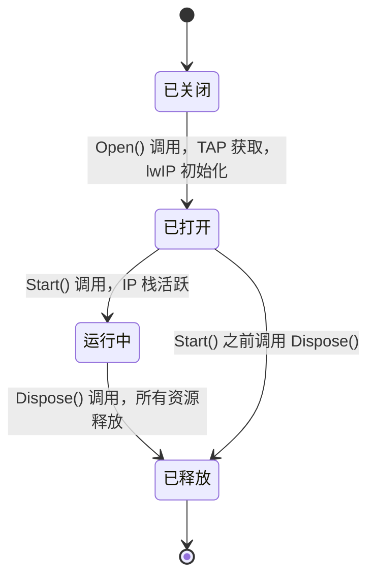

### `ppp/app/client/VEthernetExchanger.h` — 客户端会话核心

`VEthernetExchanger` 是客户端的活跃会话对象。它派生自 `VirtualEthernetLinklayer` 并重写 `On*` 处理器以实现客户端行为：收到 SYNOK 以完成代理 TCP 连接、收到 SENDTO 将 UDP 载荷注入 lwIP 栈、当 lwIP 创建新的出站 TCP 连接时发送 SYN 等。每次连接到服务器时创建一个新的 exchanger，当会话结束或链路层心跳超时时释放。

### `ppp/app/server/VirtualEthernetSwitcher.h` — 服务端会话核心

`VirtualEthernetSwitcher` 是服务端的会话管理器。它维护活跃客户端会话的映射表。当客户端发送 SYN 时，switcher 创建到目标的真实 TCP socket 并双向中继数据。switcher 执行每会话带宽 QoS 并在任何出站 socket 操作前应用防火墙规则。服务端永远不会发起 SYN 或 SENDTO——它只响应。

---

## 第6章：面向具体任务的推荐阅读路径

当你有具体目标而非全面调查系统时，使用以下路径。

### "我想理解数据是如何加密传输的"

```
ppp/cryptography/Ciphertext.h              -- 密钥接口（EVP 封装）
ppp/app/protocol/VirtualEthernetPacket.h   -- Ciphertext() 密钥派生
VirtualEthernetPacket::Pack / Unpack       -- 加密实际发生的地方
ppp/transmissions/ITransmission.h          -- 传输层密钥（外层）
HANDSHAKE_SEQUENCE_CN.md                   -- 数据流动前的密钥交换
```

两个密钥层——协议层（内层，每会话）和传输层（外层，每传输）——是独立派生的。协议层密钥材料来自 `(guid, fsid, session_id)`；传输层密钥材料在 `ITransmission` 握手期间建立。两层互不感知。

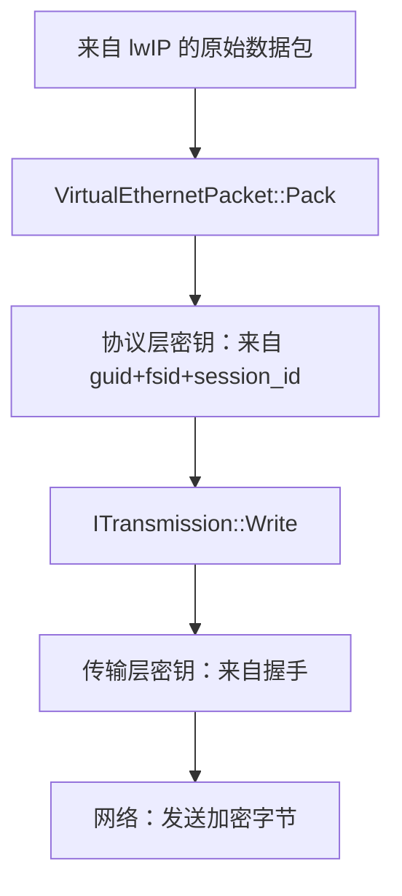

### "我想理解一个新连接如何建立"

```
HANDSHAKE_SEQUENCE_CN.md                    -- 整体流程叙述
ppp/transmissions/ITransmission.h           -- 载体内的握手
VirtualEthernetLinklayer::DoConnect         -- 客户端发送 SYN 操作码
VirtualEthernetLinklayer::OnConnect         -- 服务端收到 SYN，打开 socket
VirtualEthernetLinklayer::DoConnectOK       -- 服务端发送带错误码的 SYNOK
VirtualEthernetLinklayer::OnConnectOK       -- 客户端获悉连接结果
ppp/app/client/VEthernetExchanger.h        -- 客户端发起连接
ppp/app/server/VirtualEthernetSwitcher.h   -- 服务端处理连接
```

关键认知：`ITransmission` 握手先完成，然后 `VirtualEthernetLinklayer::Run()` 才开始。SYN / SYNOK 交换完全发生在已受保护的传输通道之上的链路层协议内。

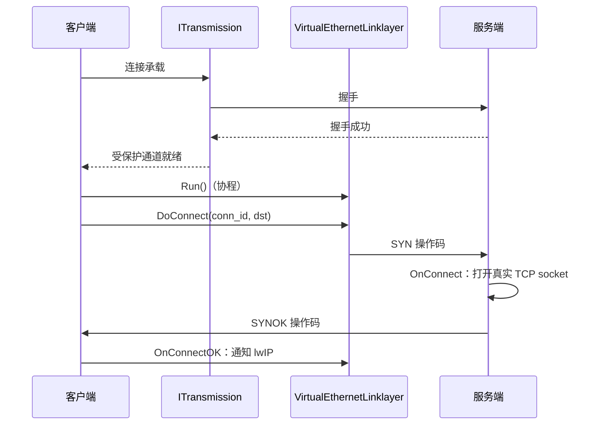

### "我想添加一个新的 PacketAction 操作码"

```
1. ppp/app/protocol/VirtualEthernetLinklayer.h
   -- 在 PacketAction 枚举中加入新值并添加注释。

2. VirtualEthernetLinklayer.cpp :: PacketInput()
   -- 添加新的 elif 分支，解析 wire 格式，调用 On* 处理器。

3. VirtualEthernetLinklayer.h
   -- 声明新操作的 virtual Do*() 和 On*() 方法。

4. VirtualEthernetLinklayer.cpp
   -- 实现 Do*() 以序列化并发送帧。

5. ppp/app/client/VEthernetExchanger.h/.cpp
   -- 重写 On*() 实现客户端行为。

6. ppp/app/server/VirtualEthernetSwitcher.h/.cpp
   -- 重写 On*() 实现服务端行为。

7. LINKLAYER_PROTOCOL.md + LINKLAYER_PROTOCOL_CN.md
   -- 记录新操作码的 wire 格式和语义。
```

操作码的十六进制值不得与已有值冲突。参照 MUX / MUXON 模式对称分配。

### "我想理解 IPv6 是如何工作的"

```
ppp/app/protocol/VirtualEthernetLinklayer.h  -- AddressType::IPv6 编码
VirtualEthernetLinklayer.cpp :: PacketInput  -- SENDTO / SYN IPv6 解析
ppp/net/Ipep.h                               -- IP 端点工具（v4/v6）
ppp/ethernet/VEthernet.h                     -- lwIP IPv6 netif 设置
docs/IPV6_FIXES.md                           -- 已知修复和边界情况
ppp/app/client/VEthernetExchanger.h          -- 客户端 IPv6 路由导向
```

### "我想理解 FRP（反向映射）系统"

```
ppp/app/protocol/VirtualEthernetLinklayer.h  -- FRP_* 操作码定义
VirtualEthernetLinklayer.cpp                 -- FRP 操作码分发
ppp/app/server/VirtualEthernetSwitcher.*     -- 服务端 FRP 条目管理
ppp/app/client/VEthernetExchanger.*          -- 客户端 FRP 连接处理
LINKLAYER_PROTOCOL_CN.md                     -- FRP 家族文档
```

FRP 系统允许客户端在服务端注册一个远程端口，服务端绑定该端口后，当外部方连接到此端口时，服务端将连接通过隧道中继回客户端的本地服务。

---

## 第7章：文件依赖阅读路径图

下图展示了关键文件之间的引用层次关系。先读左侧节点，再读右侧节点。

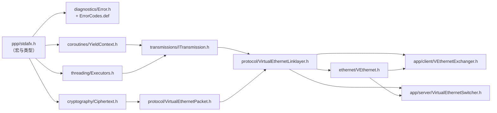

---

## 第8章：诊断与调试指南

### 理解错误码链

运行时失败时，使用错误码链诊断。模式如下：

```
深层函数中 SetLastErrorCode(Error::XYZ)
→ 哨兵返回值向上传播
→ 外层调用方检查返回值
→ 最外层读取 GetLastErrorCode()
→ 通过 Error::ToString(code) 映射为可读字符串
```

完整错误码参考见 `ERROR_CODES_CN.md`。

### 关键诊断点

| 问题 | 去哪里看 |
|------|----------|
| 握手失败 | `ITransmission` 实现、`HANDSHAKE_SEQUENCE_CN.md` |
| 连接后会话断开 | `VirtualEthernetLinklayer.cpp` 中的 `DoKeepAlived` 定时器 |
| 客户端路由未应用 | 对应 OS 的平台目录、`VEthernetNetworkSwitcher.*` |
| DNS 未重定向 | 平台 DNS 变更代码、`AppConfiguration.dns` 字段 |
| 数据包未转发 | `VirtualEthernetSwitcher` 中的防火墙检查、`IsDropNetworkSegment` |
| IPv6 分配失败 | `IPv6Auxiliary.*`、`IPV6_FIXES.md` |
| 后端认证被拒 | `VirtualEthernetManagedServer.*`、`MANAGEMENT_BACKEND_CN.md` |

### 会话状态机速查

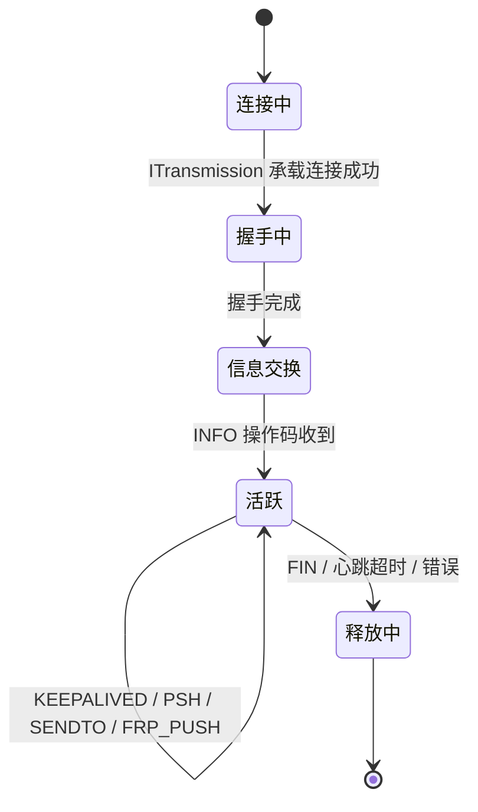

---

## 第9章：风格与约定速查

| 条目 | 规则 |
|------|------|
| 空指针 | 只用 `NULLPTR`（不用 `nullptr` 或 `NULL`） |
| 条件分支 | 只用 `elif`（不用 `else if`） |
| 比较中的常量 | 左侧：`if (0 == x)`、`if (NULLPTR == ptr)` |
| 类型别名 | `ppp::string`、`ppp::vector<T>`、`ppp::Byte`、`ppp::Int32` 等 |
| 内存分配 | `ppp::Malloc` / `ppp::Mfree`，不用裸 `new`/`delete` |
| 错误处理 | `SetLastErrorCode` + 哨兵返回，失败路径内不打日志 |
| 线程生命周期标志 | `std::atomic<bool>` + `compare_exchange_strong(memory_order_acq_rel)` |
| 平台宏 | 只用 `_WIN32`、`_LINUX`、`_ANDROID`、`_MACOS` |
| 函数异常规范 | 尽量声明 `noexcept` |
| 公共 API 文档 | Doxygen `/** @brief @param @return */` |

---

## 错误码参考

源码阅读相关的错误码（来自 `ppp/diagnostics/Error.h`）：

| ErrorCode | 说明 |
|-----------|------|
| `HandshakeFailed` | 承载握手未完成 |
| `ProtocolViolation` | 意外的 opcode 或 wire 格式 |
| `TransmissionNotReady` | 握手完成前执行了动作 |
| `SessionTimeout` | 保活定时器超时 |
| `PacketDecryptFailed` | 内层数据包解密失败 |
| `PacketEncryptFailed` | 数据包无法加密 |
| `AddressResolutionFailed` | 域名端点的 DNS 解析失败 |
| `FirewallDrop` | 数据包被本地防火墙规则丢弃 |
| `RouteInstallFailed` | 平台路由安装失败 |
| `TapDeviceOpenFailed` | 虚拟网卡设备无法打开 |
