# 源码阅读指南

[English Version](SOURCE_READING_GUIDE.md)

## 文档目标

这份指南面向想真正读懂 OPENPPP2 源码的工程师，目的是避免过早陷入平台细节而迷失整体结构。OPENPPP2 是一个复杂的跨平台虚拟以太网基础设施系统，包含配置层、传输层、协议层、客户端运行时、服务端运行时、平台特化层以及可选的 Go 管理后端。正确理解这些层次的阅读顺序，对于掌握整个系统的设计思想至关重要。

本指南将从进程入口开始，逐步深入各个核心模块，最终到达平台特化层。每一章节都会明确指出应该阅读哪些文件、这些文件的核心职责是什么、以及读者应该关注哪些关键实现细节。通过这种方式，读者可以在理解整体架构的基础上，有序地深入各个子系统的实现细节。

## 源码结构概览

在深入阅读顺序之前，首先需要了解整个源码的目录结构。OPENPPP2 的源码按照功能划分，主要分布在以下几个顶层目录中：

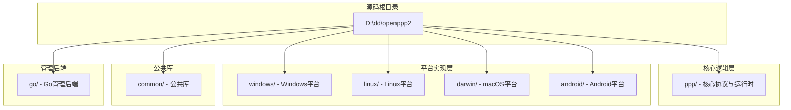

### 核心目录结构详解

下表详细说明了各个顶层目录的主要职责和包含的内容：

| 目录 | 主要职责 | 关键子目录 |
|------|----------|------------|
| `ppp/` | 核心协议逻辑与运行时实现 | configurations, transmissions, app, net, ethernet, cryptography |
| `windows/` | Windows 平台特化实现 | ppp/tap, ppp/win32/network |
| `linux/` | Linux 平台特化实现 | ppp/tap, ppp/net, ppp/ipv6 |
| `darwin/` | macOS 平台特化实现 | ppp/tun, ppp/tap, ppp/ipv6 |
| `android/` | Android 平台特化实现 | libopenppp2, MainActivity |
| `common/` | 跨平台公共库 | libtcpip, lwip, json, dnslib, aesni |
| `go/` | Go 管理后端实现 | main.go, ppp, io |

## 第一阶段：从进程入口开始

### 1.1 阅读 main.cpp

先阅读 `main.cpp` 作为整个系统的入口点。这是理解整个系统如何初始化的关键。

**文件路径**：`D:\dd\openppp2\main.cpp`

**核心职责**：
- 进程启动与权限校验
- 单实例检测与控制
- 配置加载与解析
- 网络参数解析
- 客户端/服务端角色选择
- 运行时对象创建
- 周期性维护循环
- 信号处理与资源清理

**重点关注内容**：

| 关注点 | 说明 | 相关代码行 |
|----------|------|------------|
| 模式选择 | 如何区分 client 和 server 模式 | 入口处参数解析 |
| 配置加载 | JSON 配置文件如何被读取 | 配置加载逻辑 |
| 运行时参数 | 命令行参数如何覆盖配置 | 网络参数解析 |
| 对象创建 | 各类 Switcher 和 Exchanger 如 何被实例化 | 角色分支处理 |
| 维护循环 | 周期性任务如何执行 | Tick 循环实现 |

**阅读建议**：第一次阅读时，可以先跳过平台特化的详细实现，专注于理解整体的启动流程和对象创建逻辑。注意观察主函数中 client 和 server 两条路径是如何分叉的，以及它们各自创建了��些核心对象。

### 1.2 理解进程级架构

`main.cpp` 中体现的进程级架构是理解整个系统的基础。OPENPPP2 采用单一二进制架构，通过命令行参数决定运行在客户端模式还是服务端模式。

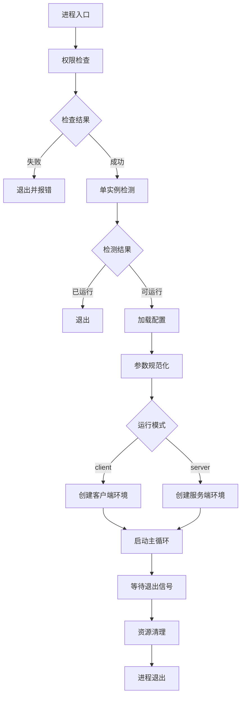

**关键类型**：`PppApplication` 类负责整个进程的生命周期管理。在阅读 main.cpp 时，需要理解这个类如何协调配置加载、对象创建和主循环执行。

## 第二阶段：理解配置模型

### 2.1 核心配置文件

再读 `ppp/configurations/AppConfiguration.h` 和 `ppp/configurations/AppConfiguration.cpp`：

**文件路径**：
- `D:\dd\openppp2\ppp\configurations\AppConfiguration.h`
- `D:\dd\openppp2\ppp\configurations\AppConfiguration.cpp`

**核心职责**：
- 定义所有运行时配置项
- 提供配置默认值
- 实现配置解析与规范化
- 支持配置覆盖机制
- 处理 IPv6 相关配置

**重点关注内容**：

| 配置组 | 说明 | 关键配置项 |
|----------|------|------------|
| `server.listen` | 服务端监听器配置 | 端口、协议、前缀 |
| `server.backend` | 管理后端连接配置 | 地址、凭证 |
| `client` | 客户端配置 | 服务器地址、协议 |
| `key` | 加密密钥配置 | 算法、密钥材料 |
| `static` | Static 模式配置 | 端口、池大小 |
| `mux` | 多路复用配置 | 子通道数、超时 |
| `dns` | DNS 配置 | 服务器、重定向规则 |
| `ipv6` | IPv6 配置 | 模式、NAT66、GUA |
| `route` | 路由配置 | 排除网络、包含网络 |

### 2.2 配置解析实现

配置系统使用了 INI 文件格式和 JSON 格式两种配置文件。理解配置如何被解析和规范化是理解整个系统行为的关键。

**关键观察点**：

1. **默认值定义**：所有配置项都有默认值，这些默认值定义了系统的默认行为
2. **配置驱动行为**：很多系统行为是通过配置控制的，而不是硬编码
3. **IPv6 规范化**：IPv6 配置有复杂的规范化逻辑，包括 NAT66 和 GUA 两种模式
4. **配置覆盖**：命令行参数可以覆盖配置文件中的值

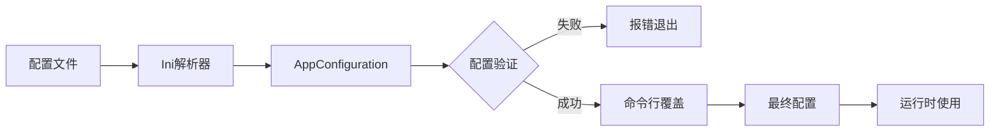

### 2.3 相关配置文件

配置系统还涉及以下辅助文件：

| 文件 | 职责 |
|------|------|
| `ppp/configurations/Ini.cpp` | INI 格式配置文件解析 |
| `ppp/auxiliary/JsonAuxiliary.cpp` | JSON 辅助工具 |
| `ppp/auxiliary/StringAuxiliary.cpp` | 字符串辅助工具 |

## 第三阶段：理解传输层

### 3.1 受保护的传输接口

再读传输层的核心接口定义：

**文件路径**：
- `D:\dd\openppp2\ppp\transmissions\ITransmission.h`
- `D:\dd\openppp2\ppp\transmissions\ITransmission.cpp`

**核心职责**：
- 定义受保护传输的抽象接口
- 实现握手协议
- 管理密钥派生
- 提供帧化读写
- 处理协议层加密
- 处理传输层加密

**重点关注内容**：

| 功能 | 说明 | 关注点 |
|------|------|------------|
| 握手序列 | 如何建立安全连接 | 占位流量、密钥交换 |
| 密钥派生 | 如何从配置密钥生成工作密钥 | ivv ���数��作用 |
| 帧化读写 | 如何封装/解封装数据 | 握手前后的格式差异 |
| 双层加密 | protocol_ 和 transport_ 的区分 | 密钥分工 |

### 3.2 承载传输实现

传输层需要支持多种承载方式：

**文件路径**：
- `D:\dd\openppp2\ppp\transmissions\ITcpipTransmission.*`
- `D:\dd\openppp2\ppp\transmissions\IWebsocketTransmission.*`
- `D:\dd\openppp2\ppp\transmissions\ISslWebsocketTransmission.*`

**承载方式对照表**：

| 传输类型 | 协议前缀 | 默认端口 | 适用场景 |
|----------|----------|----------|----------|
| 原生 TCP | `ppp://` | 20000 | 低延迟直连 |
| WebSocket | `ws://` | 80 | CDN 穿透 |
| SSL WebSocket | `wss://` | 443 | HTTPS 环境 |

**重点关注内容**：

| 功能 | 说明 |
|------|------|
| TCP 直连 | 原生 TCP socket 实现 |
| WebSocket | HTTP 升级握手 |
| SSL/TLS | 加密通道建立 |
| 帧格式 | 握手前后的帧格式变化 |

### 3.3 传输层架构图

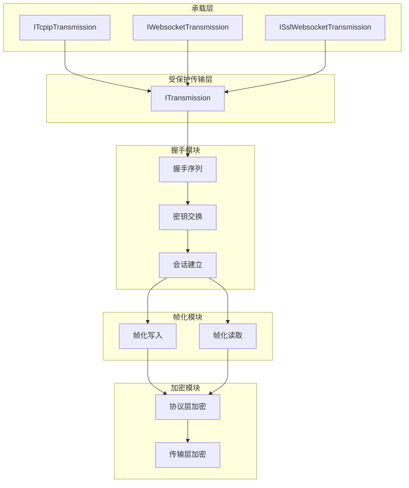

## 第四阶段：理解隧道动作协议

### 4.1 链路层协议定义

**文件路径**：
- `D:\dd\openppp2\ppp\app\protocol\VirtualEthernetLinklayer.h`
- `D:\dd\openppp2\ppp\app\protocol\VirtualEthernetLinklayer.cpp`

**核心职责**：
- 定义隧道内的动作码
- 实现控制面动作
- 实现数据面动作
- 处理信息交换
- 统一建模多种协议

**动作码分类表**：

| 动作码 | 类别 | 方向 | 说明 |
|--------|------|------|------|
| `INFO` | 会话 | 双向 | 客户端与服务端信息交换 |
| `KEEPALIVED` | 保活 | 双向 | 心跳保活消息 |
| `LAN` | 网络 | 服务端→客户端 | 局域网信息下发 |
| `NAT` | 网络 | 双向 | NAT 映射信息 |
| `SYN` | TCP | 客户端→服务端 | TCP 连接请求 |
| `SYNOK` | TCP | 服务端→客户端 | TCP 连接响应 |
| `PSH` | TCP | 双向 | TCP 数据推送 |
| `FIN` | TCP | 双向 | TCP 连接关闭 |
| `SENDTO` | UDP | 双向 | UDP 数据报中继 |
| `ECHO` | 测试 | 双向 | 回显请求 |
| `ECHOACK` | 测试 | 双向 | 回显响应 |
| `STATIC` | Static | 双向 | Static 路径协商 |
| `STATICACK` | Static | 双向 | Static 确认 |
| `MUX` | 复用 | 双向 | MUX 子通道协商 |
| `MUXON` | 复用 | 双向 | MUX 启用 |
| `MAPPING` | 映射 | 双向 | 端口映射注册 |
| `FRP_*` | 反向映射 | 客户端→服务端 | FRP 风格端口映射 |

### 4.2 信息交换协议

**文件路径**：`D:\dd\openppp2\ppp\app\protocol\VirtualEthernetInformation.*`

这个文件定义了 INFO 消息的具体内容，包括：
- 客户端能力声明
- 服务端网络信息
- IPv6 配置信息
- DNS 配置信息
- 路由信息

### 4.3 协议层架构

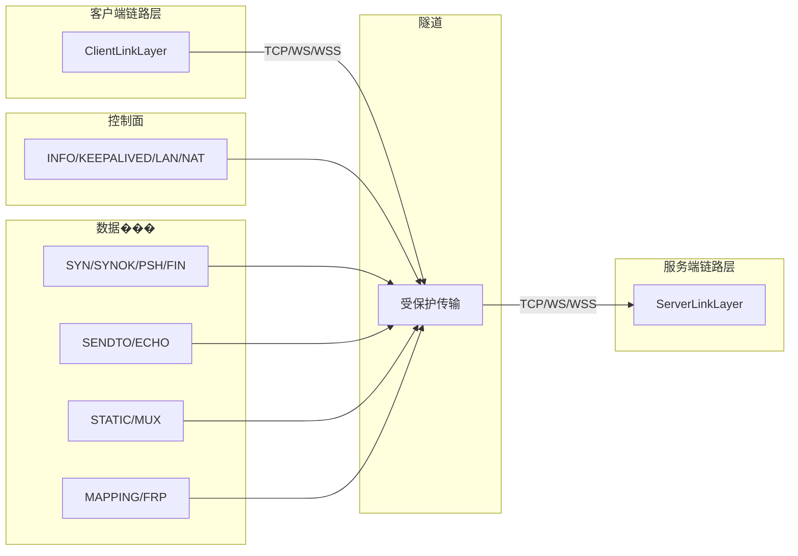

## 第五阶段：理解辅助分组格式

### 5.1 Static 分组格式

**文件路径**：
- `D:\dd\openppp2\ppp\app\protocol\VirtualEthernetPacket.h`
- `D:\dd\openppp2\ppp\app\protocol\VirtualEthernetPacket.cpp`

**核心职责**：
- 定义 Static UDP 分组格式
- 实现分组加密
- 处理校验和混淆
- 管理会话密钥

**分组格式结构**：

| 字段 | 长度 | 说明 |
|------|------|------|
| 伪源 IP | 4 字节 | 虚拟源 IP 地址 |
| 伪目的 IP | 4 字节 | 虚拟目的 IP 地址 |
| 伪源端口 | 2 字节 | 虚拟源端口 |
| 伪目的端口 | 2 字节 | 虚拟目的端口 |
| Mask | 1 字节 | 字段掩码 |
| 校验和 | 2 字节 | 校验和字段 |
| 密钥索引 | 1 字节 | 密钥选择 |
| 变换数据 | 变长 | 加密后的数据 |

### 5.2 分组格式与链路层的区别

理解为什么 Static 分组格式要单独存在：

1. **设计目标不同**：链路层处理控制动作，分组格式处理数据报文
2. **传输方式不同**：链路层走隧道，分组格式走 UDP
3. **加密粒度不同**：链路层按动作加密，分组按包加密
4. **元数据结构不同**：链路层有 opcode，分组有伪头部

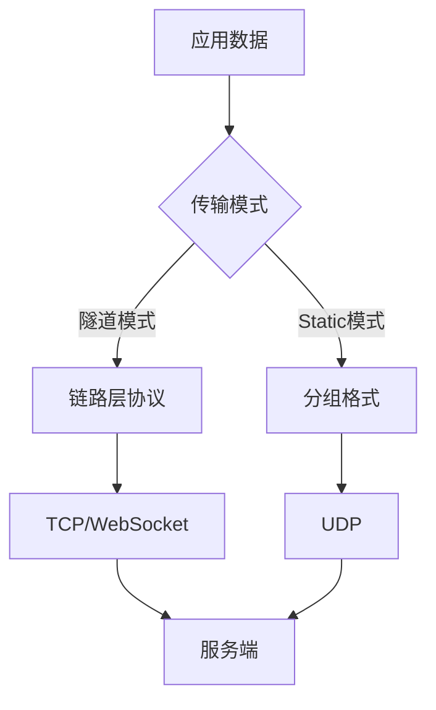

## 第六阶段：阅读客户端运行时

### 6.1 客户端核心组件

**文件路径**：
- `D:\dd\openppp2\ppp\app\client\VEthernetNetworkSwitcher.*`
- `D:\dd\openppp2\ppp\app\client\VEthernetExchanger.*`
- `D:\dd\openppp2\ppp\app\client\VEthernetNetworkTcpipStack.*`
- `D:\dd\openppp2\ppp\app\client\VEthernetNetworkTcpipConnection.*`

**核心组件对照表**：

| 组件 | 职责 | 关键文件 |
|------|------|----------|
| `VEthernetNetworkSwitcher` | TUN 接口管理、路由/DNS 控制、流量分类 | `VEthernetNetworkSwitcher.*` |
| `VEthernetExchanger` | 远端连接管理、会话维护、重连处理 | `VEthernetExchanger.*` |
| `VEthernetNetworkTcpipStack` | TCP/IP 协议栈 | `VEthernetNetworkTcpipStack.*` |
| `VEthernetNetworkTcpipConnection` | TCP 连接管理 | `VEthernetNetworkTcpipConnection.*` |

**重点关注内容**：

| 功能 | 说明 | 关注点 |
|------|------|------------|
| TUN 输入处理 | 从虚拟网卡读取数据 | 读取循环实现 |
| 路由管理 | 修改系统路由表 | 平台路由操作 |
| DNS 管理 | 修改系统 DNS | 平台 DNS 操作 |
| 本地代理 | HTTP/SOCKS 代理服务 | 代理服务器 |
| 建链与会话 | 与服务端建连 | 握手流程 |
| 重连机制 | 断线重连 | 状态机实现 |

### 6.2 UDP 客户端

**文件路径**：`D:\dd\openppp2\ppp\app\client\VEthernetDatagramPort.*`

处理 UDP 数据报的客户端实现：

| 组件 | 职责 |
|------|------|
| `VEthernetDatagramPort` | UDP 数据报端口管理 |
| `VEthernetDatagramPortStatic` | Static 模式 UDP 端口 |

### 6.3 代理客户端

如果配置了本地代理支持：

**文件路径**：
- `D:\dd\openppp2\ppp\app\client\proxys\VEthernetHttpProxySwitcher.*`
- `D:\dd\openppp2\ppp\app\client\proxys\VEthernetSocksProxySwitcher.*`

| 代理类型 | 说明 |
|----------|------|
| HTTP 代理 | HTTP CONNECT 代理 |
| SOCKS 代理 | SOCKS4/5 代理 |

### 6.4 客户端运行时架构

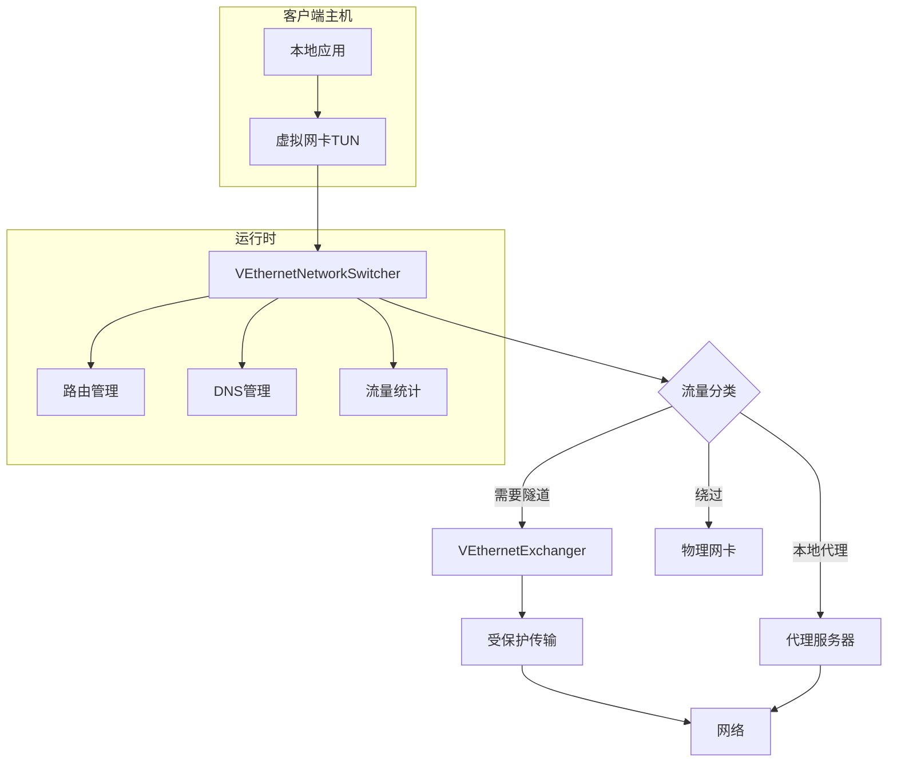

## 第七阶段：阅读服务端运行时

### 7.1 服务端核心组件

**文件路径**：
- `D:\dd\openppp2\ppp\app\server\VirtualEthernetSwitcher.*`
- `D:\dd\openppp2\ppp\app\server\VirtualEthernetExchanger.*`
- `D:\dd\openppp2\ppp\app\server\VirtualEthernetNetworkTcpipConnection.*`

**核心组件对照表**：

| 组件 | 职责 | 关键文件 |
|------|------|----------|
| `VirtualEthernetSwitcher` | 监听器管理、会话管理 | `VirtualEthernetSwitcher.*` |
| `VirtualEthernetExchanger` | 单会话处理、流量转发 | `VirtualEthernetExchanger.*` |
| `VirtualEthernetNetworkTcpipConnection` | TCP 连接管理 | `VirtualEthernetNetworkTcpipConnection.*` |
| `VirtualEthernetManagedServer` | 管理后端连接 | `VirtualEthernetManagedServer.*` |

**重点关注内容**：

| 功能 | 说明 | 关注点 |
|------|------|------------|
| 监听器建立 | 创建服务端监听器 | 端口绑定 |
| 会话接入 | 接受客户端连接 | 握手处理 |
| TCP 转发 | TCP 流量转发 | 连接管理 |
| UDP 转发 | UDP 数据报转发 | 端口管理 |
| mappings | 端口映射管理 | 映射注册 |
| static 模式 | Static UDP 服务 | UDP 端口 |
| IPv6 | IPv6 转发 | NAT66/GUA |

### 7.2 UDP 服务端

**文件路径**：
- `D:\dd\openppp2\ppp\app\server\VirtualEthernetDatagramPort.*`
- `D:\dd\openppp2\ppp\app\server\VirtualEthernetDatagramPortStatic.*`

| 组件 | 职责 |
|------|------|
| `VirtualEthernetDatagramPort` | UDP 端口管理 |
| `VirtualEthernetDatagramPortStatic` | Static 模式 UDP 端口 |

### 7.3 其他服务端组件

**���件路径**：
- `D:\dd\openppp2\ppp\app\server\VirtualEthernetMappingPort.*` - 端口映射
- `D:\dd\openppp2\ppp\app\server\VirtualEthernetNamespaceCache.*` - 命名空间缓存

### 7.4 服务端运行时架构

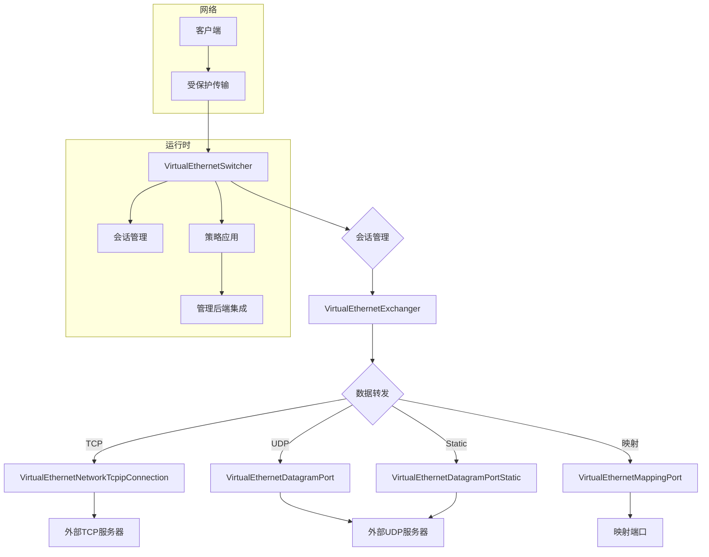

## 第八阶段：阅读平台特化层

### 8.1 平台选择

只有在核心协议理解清楚之后，才应该阅读平台特化层。不同平台的实现差异很大，但核心概念类似。

**Windows 平台**：
- 目录：`D:\dd\openppp2\windows\`
- 虚拟网卡：`ppp/tap/*`
- 网络操作：`ppp/win32/network/*`

**Linux 平台**：
- 目录：`D:\dd\openppp2\linux\`
- 虚拟网卡：`ppp/tap/*`
- 网络操作：`ppp/net/*`

**macOS 平台**：
- 目录：`D:\dd\openppp2\darwin\`
- 虚拟网卡：`ppp/tun/*`, `ppp/tap/*`
- 网络操作：`ppp/ipv6/*`

**Android 平台**：
- 目录：`D:\dd\openppp2\android\`
- 实现：`libopenppp2.cpp`

### 8.2 平台实现对照表

| 功能 | Windows | Linux | macOS | Android |
|------|---------|-------|-------|---------|
| 虚拟接口 | TAP | TUN/TAP | utun | VPNService |
| 路由操作 | 路由表 API | netlink | sysctl | 路由 API |
| DNS 操作 | 注册表 | /etc/resolv.conf | scutil | VpnService |
| socket 保护 | WFP | iptables | NKE | VpnService |
| IPv6 | 支持 | 支持 | 支持 | 部分支持 |

### 8.3 平台代码阅读重点

| 平台 | 重点文件 | 关注实现 |
|------|----------|----------|
| Windows | `windows/ppp/tap/TapWindows.*` | TAP 驱动接口、WFP 回调 |
| Linux | `linux/ppp/tap/TapLinux.*` | TUN 设备open/MTY设置 |
| macOS | `darwin/ppp/tun/utun.*` | utun 接口创建 |
| Android | `android/libopenppp2.cpp` | VpnService 实现 |

### 8.4 平台层架构图

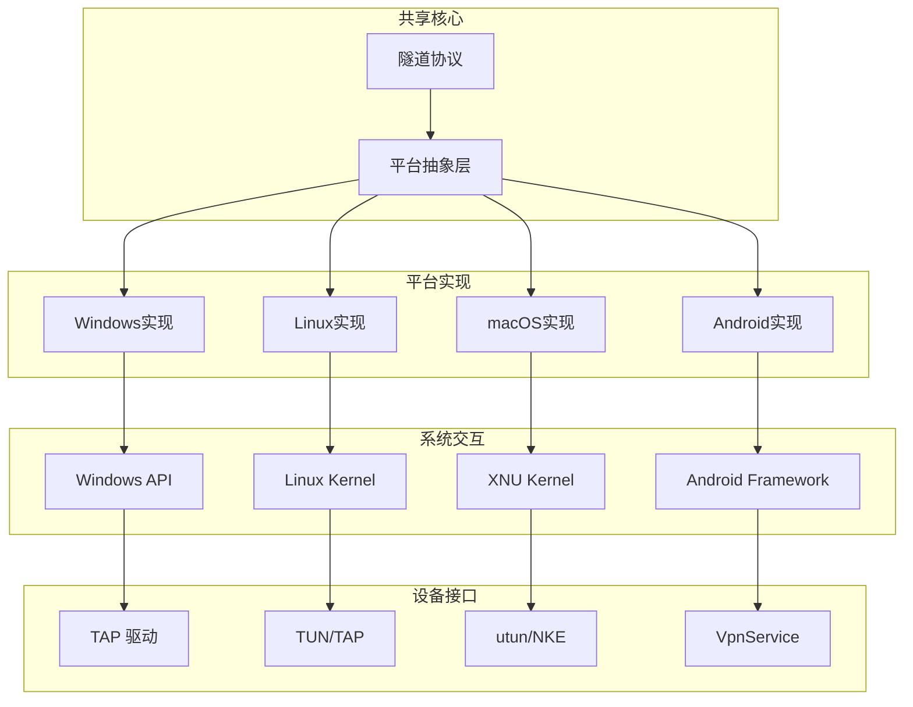

## 第九阶段：阅读 Go 管理后端

### 9.1 后端架构

最后再读 Go 后端，它是一个可选的管理组件：

**文件路径**：
- `D:\dd\openppp2\go\main.go`
- `D:\dd\openppp2\go\ppp\*`
- `D:\dd\openppp2\go\io\*`

### 9.2 后端核心功能

| 功能 | 说明 |
|------|------|
| 节点认证 | 验证客户端连接 |
| 用户管理 | 用户账户存储 |
| 流量额度 | 流量配额控制 |
| 策略下发 | 下发访问策略 |
| IPv6 分配 | 分配 IPv6 地址 |

### 9.3 C++ 与 Go 交互

C++ 服务端通过 WebSocket 与 Go 后端通信：

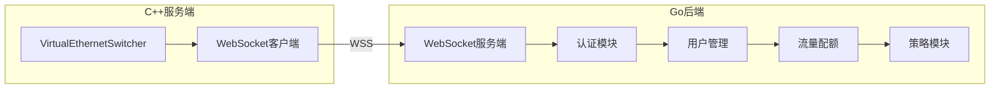

## 关键文件索引表

下表总结了各个阶段需要阅读的核心文件：

| 阶段 | 文件路径 | 核心职责 |
|------|----------|----------|
| 入口 | `main.cpp` | 进程启动、模式选择 |
| 配置 | `ppp/configurations/AppConfiguration.*` | 配置解析、默认值 |
| 传输 | `ppp/transmissions/ITransmission.*` | 受保护传输、握手 |
| 承载 | `ppp/transmissions/ITcpipTransmission.*` | TCP 连接 |
| 承载 | `ppp/transmissions/IWebsocketTransmission.*` | WebSocket |
| 协议 | `ppp/app/protocol/VirtualEthernetLinklayer.*` | 隧道动作协议 |
| 信息 | `ppp/app/protocol/VirtualEthernetInformation.*` | 信息交换 |
| 分组 | `ppp/app/protocol/VirtualEthernetPacket.*` | Static 分组格式 |
| 客户端Switcher | `ppp/app/client/VEthernetNetworkSwitcher.*` | 客户端环境管理 |
| 客户端Exchanger | `ppp/app/client/VEthernetExchanger.*` | 会话管理 |
| 客户端TCP栈 | `ppp/app/client/VEthernetNetworkTcpipStack.*` | TCP 协议栈 |
| 服务端Switcher | `ppp/app/server/VirtualEthernetSwitcher.*` | 服务端环境管理 |
| 服务端Exchanger | `ppp/app/server/VirtualEthernetExchanger.*` | 会话处理 |
| 服务端Managed | `ppp/app/server/VirtualEthernetManagedServer.*` | 后端集成 |
| Windows TAP | `windows/ppp/tap/TapWindows.*` | Windows 虚拟网卡 |
| Linux TAP | `linux/ppp/tap/TapLinux.*` | Linux 虚拟网卡 |
| macOS TUN | `darwin/ppp/tun/utun.*` | macOS 虚拟网卡 |
| Android | `android/libopenppp2.cpp` | Android VPN 实现 |
| Go 后端 | `go/main.go` | 管理后端入口 |

## 常见阅读误区

在阅读 OPENPPP2 源码时，需要避免以下几个常见误区：

### 误区一：在理解共享协议核心之前就陷入平台代码

平台代码的实现细节非常繁杂，如果在没有理解核心协议的情况下直接阅读平台代码，很容易迷失在平台特定的 API 调用中，而忽略了整体的设计思想。正确的做法是先理解 `ITransmission` 和 `VirtualEthernetLinklayer` 的抽象设计，然后再去看这些抽象在不同平台上如何实现。

### 误区二：把 ITransmission 的帧化与 VirtualEthernetPacket 混为一谈

这是两个完全不同的概念。`ITransmission` 的帧化是关于如何在 TCP/WebSocket 连接上读写数据，而 `VirtualEthernetPacket` 是关于 Static UDP 模式下如何封装单个数据报。前者对应的是有序字节流，后者对应的是独立的报文。混淆这两个概念会导致对整个协议层结构的误解。

### 误区三：把客户端 exchanger 与服务端 exchanger 当成完全无关的实现

虽然客户端和服务端的 Exchanger 在具体行为上有所不同，但它们都继承自 `VirtualEthernetLinklayer`，共享同一套 opcode 模型和动作语义。理解这种设计对于理解整个隧道协议的统一性非常重要。客户端的 Exchanger 发出的某些动作，正是服务端 Exchanger 需要响应的。

### 误区四：误以为 Go 后端是数据面

Go 后端是一个可选的管理组件，主要负责节点认证、用户管理、流量额度和策略下发。它不是数据转发平面，不参与客户端与服务端之间的实际数据传输。真正的数据转发仍然是通过 C++ 客户端和服务端之间的隧道完成的。

### 误区五：误以为路由/DNS 行为只是边角能力而不是系统核心组成部分

路由控制和 DNS 重定向是 OPENPPP2 的核心功能之一，而不是附加功能。正是因为有了这些能力，OPENPPP2 才能作为一个完整的虚拟以太网基础设施运行。没有路由和 DNS 控制的虚拟网卡只是一个孤岛，无法与真实网络通信。

## 代码组织架构图

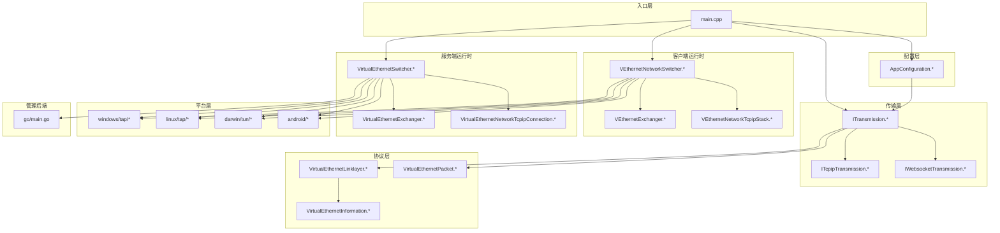

## 最佳阅读路径总结

按照以下顺序阅读源码，可以逐步深入理解整个系统：

1. **启动流程** → `main.cpp`
2. **配置系统** → `AppConfiguration.*`
3. **传输层** → `ITransmission.*` + 承载实现
4. **协议层** → `VirtualEthernetLinklayer.*`
5. **分组格式** → `VirtualEthernetPacket.*`
6. **客户端** → `VEthernetNetworkSwitcher.*` + `VEthernetExchanger.*`
7. **服务端** → `VirtualEthernetSwitcher.*` + `VirtualEthernetExchanger.*`
8. **平台** → 根据需要选择对应平台目录
9. **后端** → `go/main.go`（可选）

## 配套文档

阅读源码时，最好的配套文档包括：

| 文档 | 说明 |
|------|------|
| [`ARCHITECTURE_CN.md`](ARCHITECTURE_CN.md) | 系统架构总览 |
| [`TUNNEL_DESIGN_CN.md`](TUNNEL_DESIGN_CN.md) | 隧道设计详解 |
| [`CLIENT_ARCHITECTURE_CN.md`](CLIENT_ARCHITECTURE_CN.md) | 客户端运行时架构 |
| [`SERVER_ARCHITECTURE_CN.md`](SERVER_ARCHITECTURE_CN.md) | 服务端运行时架构 |
| [`PLATFORMS_CN.md`](PLATFORMS_CN.md) | 平台实现差异 |
| [`CONFIGURATION_CN.md`](CONFIGURATION_CN.md) | 配置模型详解 |
| [`TRANSMISSION_CN.md`](TRANSMISSION_CN.md) | 传输层详解 |
| [`LINKLAYER_PROTOCOL_CN.md`](LINKLAYER_PROTOCOL_CN.md) | 链路层协议详解 |
| [`PACKET_FORMATS_CN.md`](PACKET_FORMATS_CN.md) | 分组格式详解 |
| [`SECURITY_CN.md`](SECURITY_CN.md) | 安全模型 |
| [`HANDSHAKE_SEQUENCE_CN.md`](HANDSHAKE_SEQUENCE_CN.md) | 握手序列详解 |
| [`STARTUP_AND_LIFECYCLE_CN.md`](STARTUP_AND_LIFECYCLE_CN.md) | 启动与生命周期 |
| [`ROUTING_AND_DNS_CN.md`](ROUTING_AND_DNS_CN.md) | 路由与 DNS |
| [`MANAGEMENT_BACKEND_CN.md`](MANAGEMENT_BACKEND_CN.md) | 管理后端 |

按照这份指南有序阅读，可以避免在细节中迷失，从而真正理解 OPENPPP2 的设计思想和工程实践。