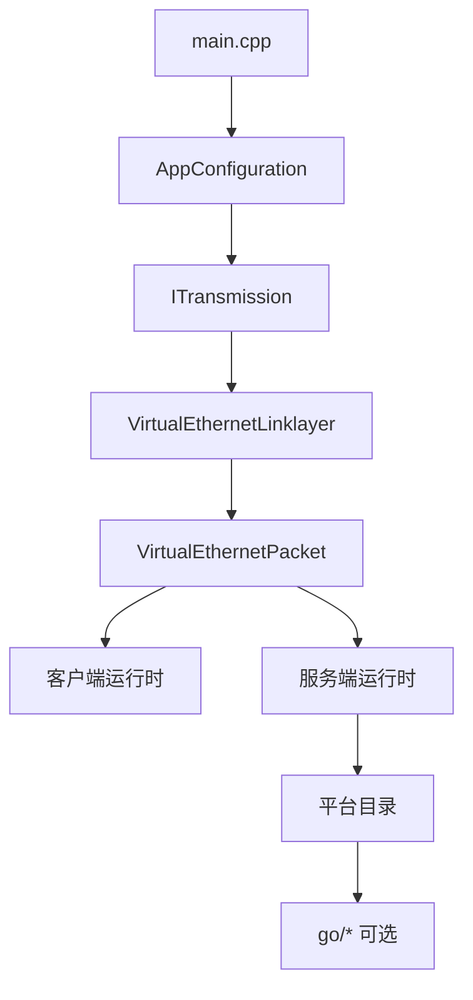
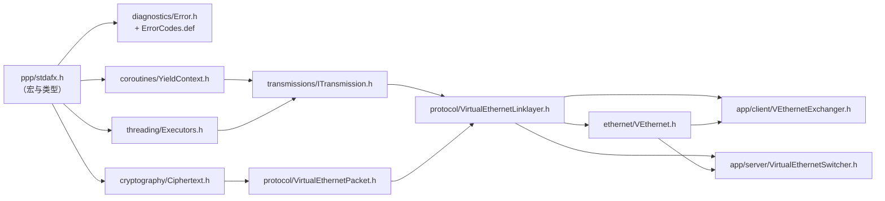

# 源码阅读指南

[English Version](SOURCE_READING_GUIDE.md)

## 目标

这份指南帮助工程师按有用的顺序阅读 OPENPPP2。

## 阅读顺序

1. `main.cpp`
2. `ppp/configurations/AppConfiguration.*`
3. `ppp/transmissions/ITransmission.*`
4. `ppp/app/protocol/VirtualEthernetLinklayer.*`
5. `ppp/app/protocol/VirtualEthernetPacket.*`
6. `ppp/app/client/*`
7. `ppp/app/server/*`
8. 各平台目录
9. 最后再看 `go/*`



## 重点关注

- 启动与角色选择
- 配置默认值和规范化
- 握手与分帧
- 隧道动作词汇
- 客户端路由与 DNS steering
- 服务端会话交换与转发
- 平台特化宿主副作用
- 管理后端要放在核心运行时读懂之后再看

## 常见错误

- 还没理解共享核心就先看平台代码
- 把 `ITransmission` 的 framing 和 packet format 混为一谈
- 把 client 和 server exchanger 当成对称实现
- 以为 Go 后端是 data plane

## 实用规则

如果平台目录中的代码修改了路由、DNS、适配器、防火墙或者 socket 保护，就要把它当作运行时行为，而不是普通辅助函数。

如果 `ITransmission` 中的代码改变了握手状态或帧形状，就要把它当作传输策略，而不是机械的读写封装。

## 相关文档

- `ARCHITECTURE_CN.md`
- `TUNNEL_DESIGN_CN.md`
- `CLIENT_ARCHITECTURE_CN.md`
- `SERVER_ARCHITECTURE_CN.md`
- `EDSM_STATE_MACHINES_CN.md`

---

## 第5章：关键文件逐一解析

本章对每个核心源文件进行简明说明，按照列出顺序阅读可获得最佳连贯性。

### `ppp/stdafx.h` — 基础宏与类型别名

这是必须最先阅读的文件。`ppp/` 目录下的每一个 `.cpp` 文件都将其作为预编译头引入。它定义了跨平台兼容层：`NULLPTR`（替代 `nullptr`/`NULL`）、`elif`（替代 `else if`）、平台宏（`_WIN32`、`_LINUX`、`_ANDROID`、`_MACOS`）以及固定宽度整数别名（`ppp::Byte`、`ppp::Int32`、`ppp::UInt64` 等）。它还引入了 `ppp::allocator<T>`，在定义了 `JEMALLOC` 宏时会路由到 jemalloc 分配器。在 `ppp/` 文件中绝不能直接使用 `nullptr`、`NULL` 或 `else if`——这些宏的存在有其微妙但真实的可移植性原因。在读其他任何代码之前先读 `stdafx.h`，可以避免遭遇项目特有写法时的困惑。

### `ppp/diagnostics/Error.h` + `ErrorCodes.def` — 错误码体系

这两个文件共同定义了整个项目的错误词汇。`Error.h` 声明了 `Error` 枚举和将错误码转换为可读字符串的辅助函数。`ErrorCodes.def` 是一个 X-macro 文件：每个错误常量只写一次，`Error.h` 在不同宏展开下多次包含它，从而同时生成枚举值和字符串表，避免重复。这种模式使错误集成为唯一可信来源。函数失败时调用 `SetLastErrorCode(Error::XYZ)` 并返回哨兵值，失败路径内不打印任何日志。尽早掌握这个模式——在失败分支添加 `printf` 调用会在代码评审时被拒绝。

### `ppp/threading/Executors.h/.cpp` — 线程池与协程调度

`Executors` 是运行时调度器。它封装了 Boost.Asio `io_context` 实例，并暴露 `Post`、`Dispatch`、`Spawn` 等辅助方法，向调用者隐藏了 strand 和协程的内部细节。这里的 `GetTickCount()` 是全项目统一使用的单调毫秒时钟，用于超时和心跳计时——协议代码中不要直接使用 `std::chrono`。线程池大小在启动时根据可用硬件线程数配置。理解 `Executors` 是阅读任何涉及定时器代码的先决条件，因为 `VirtualEthernetLinklayer` 中的空闲超时逻辑在每次收到数据包时以及 `DoKeepAlived` 中都会调用 `Executors::GetTickCount()`。

### `ppp/coroutines/YieldContext.h` — 协程核心与 `nullof<>` 语义

`YieldContext` 封装了 Boost.Asio 有栈协程的 yield 上下文。它被穿透传递给几乎所有网络 I/O 调用，使调用者可以以类似 `co_await` 的方式挂起，而不阻塞 IO 线程。关键细节在于 `nullof<YieldContext>()` 模式：它返回一个零初始化哨兵对象的引用，其地址可被被调用方检测到。当被调用方检查 `if (y)` 或将地址与 NULLPTR 等效值比较时，会在协程异步与线程阻塞两条代码路径之间选择。`DoKeepAlived` 在主协程之外发送心跳包时故意使用 `nullof<YieldContext>()`。绝不要将其替换为真正的默认构造对象或指针——哨兵地址检查是有意为之的设计，而非 UB。

### `ppp/app/protocol/VirtualEthernetLinklayer.h` — 链路层状态机，EDSM 核心

这个文件是系统的协议核心。`VirtualEthernetLinklayer` 是所有客户端和服务端会话对象的基类。它定义了 `PacketAction` 操作码枚举（17 个操作码，覆盖 TCP、UDP、FRP、MUX、NAT、LAN、ECHO、INFO、KEEPALIVED）、用于端点编码的 `AddressType` wire 格式，以及完整的 `Do*`/`On*` 虚方法对。`Do*` 方法序列化出站帧；`On*` 方法是 `PacketInput` 解码 action 字节后的分发目标。`Run()` 是在协程中驱动 `PacketInput` 的接收循环。`DoKeepAlived()` 由定时器调用以维持链路活跃。所有客户端/服务端行为通过在派生类中重写 `On*` 来实现——基类只负责 wire 编解码和分发。完整的状态图请参见 `EDSM_STATE_MACHINES_CN.md`。

### `ppp/app/protocol/VirtualEthernetPacket.h` — 数据包 Wire 格式

`VirtualEthernetPacket` 是承载解码后 NAT 层载荷的结构体。它持有内层 IP 协议号、会话 ID、源/目标 IPv4 端点以及共享所有权的载荷缓冲区。静态 `Pack` 方法通过调用 `Ciphertext()` 获取会话专属密钥对（协议层 + 传输层），将 `IPFrame` 或原始 UDP 载荷编码为加密传输缓冲区。静态 `Unpack` 方法执行逆操作：解密、校验并填充 `VirtualEthernetPacket`。静态 `Ciphertext` 方法从会话 GUID、FSID 和 session ID 派生两个密钥对象——改变这三个字段中的任何一个都会改变密钥材料。阅读这个文件时应同时参考 `ppp/cryptography/Ciphertext.h` 和 EVP 封装，以理解完整的加密流水线。

### `ppp/transmissions/ITransmission.h` — 传输载体抽象

`ITransmission` 是纯虚接口，向链路层隐藏了具体载体——TCP、WebSocket、KCP-over-UDP 等。它暴露两个原语：用于带帧出站数据的 `Write(YieldContext&, Byte*, int)` 和用于带帧入站数据的 `Read(YieldContext&, int&)`。帧边界由传输层实现强制执行，不由调用方负责。握手协商在传输层内部完成，链路层永远看不到握手字节。阅读 `ITransmission` 实现时，要区分三层：carrier（原始 socket）、protected channel（密钥交换后的通道）、framing（长度前缀或 WebSocket opcode）。混淆这三层是新贡献者最常犯的错误。

### `ppp/ethernet/VEthernet.h` — 虚拟以太网设备（lwIP 集成）

`VEthernet` 代表一个由 lwIP 支持的虚拟网卡。它有三种状态：`Open`（TAP 设备已获取、lwIP 栈已初始化）、`Running`（IP 栈活跃、数据包正在流动）、`Disposed`（所有资源已释放）。TAP 输入路径从 OS TAP 驱动读取原始以太网帧并注入 lwIP。lwIP 输出路径将 IP 帧从协议栈取出，交给会话的 `DoNat` 或 `VirtualEthernetPacket::Pack` 路径进行隧道封装。理解这个文件需要熟悉 lwIP 的 `netif` 回调和 `pbuf` 内存模型。在 Android 上 TAP 被 VPN 服务 fd 替代，但 `VEthernet` 接口保持不变。

### `ppp/app/client/VEthernetExchanger.h` — 客户端会话核心

`VEthernetExchanger` 是客户端的活跃会话对象。它派生自 `VirtualEthernetLinklayer` 并重写 `On*` 处理器以实现客户端行为：收到 SYNOK 以完成代理 TCP 连接、收到 SENDTO 将 UDP 载荷注入 lwIP 栈、当 lwIP 创建新的出站 TCP 连接时发送 SYN 等。它拥有到服务器的 `ITransmission`，并在 `Executors` 派生的协程中驱动 `Run()` 循环。每次连接到服务器时创建一个新的 exchanger，当会话结束或链路层心跳超时时释放。

### `ppp/app/server/VirtualEthernetSwitcher.h` — 服务端会话核心

`VirtualEthernetSwitcher` 是服务端的会话管理器。它维护活跃客户端会话的映射表，每个会话由服务端的 `VirtualEthernetLinklayer` 子类表示。当客户端发送 SYN 时，switcher 创建到目标的真实 TCP socket 并双向中继数据。当客户端发送 SENDTO 时，switcher 打开绑定到服务器出口地址的 UDP socket 并转发数据报。switcher 执行每会话带宽 QoS（来自 INFO 帧）并在任何出站 socket 操作前应用防火墙规则。服务端会话对象与客户端对象不对称：服务端永远不会发起 SYN 或 SENDTO——它只响应。

---

## 第6章：面向具体任务的推荐阅读路径

当你有具体目标而非全面调查系统时，使用以下路径。

### "我想理解数据是如何加密传输的"

```
ppp/cryptography/Ciphertext.h              -- 密钥接口（EVP 封装）
ppp/app/protocol/VirtualEthernetPacket.h   -- Ciphertext() 密钥派生
VirtualEthernetPacket::Pack / Unpack       -- 加密实际发生的地方
ppp/transmissions/ITransmission.h          -- 传输层密钥（外层）
HANDSHAKE_SEQUENCE_CN.md                   -- 数据流动前的密钥交换
```

两个密钥层——协议层（内层，每会话）和传输层（外层，每传输）——是独立派生的。协议层密钥材料来自 `(guid, fsid, session_id)`；传输层密钥材料在 `ITransmission` 握手期间建立。两层互不感知。

### "我想理解一个新连接如何建立"

```
HANDSHAKE_SEQUENCE_CN.md                    -- 整体流程叙述
ppp/transmissions/ITransmission.h           -- 载体内的握手
VirtualEthernetLinklayer::DoConnect         -- 客户端发送 SYN 操作码
VirtualEthernetLinklayer::OnConnect         -- 服务端收到 SYN，打开 socket
VirtualEthernetLinklayer::DoConnectOK       -- 服务端发送带错误码的 SYNOK
VirtualEthernetLinklayer::OnConnectOK       -- 客户端获悉连接结果
ppp/app/client/VEthernetExchanger.h        -- 客户端发起连接
ppp/app/server/VirtualEthernetSwitcher.h   -- 服务端处理连接
```

关键认知：`ITransmission` 握手先完成，然后 `VirtualEthernetLinklayer::Run()` 才开始。SYN / SYNOK 交换完全发生在已受保护的传输通道之上的链路层协议内。

### "我想添加一个新的 PacketAction 操作码"

```
1. ppp/app/protocol/VirtualEthernetLinklayer.h
   -- 在 PacketAction 枚举中加入新值并添加注释。

2. VirtualEthernetLinklayer.cpp :: PacketInput()
   -- 添加新的 else-if 分支，解析 wire 格式，调用 On* 处理器。

3. VirtualEthernetLinklayer.h
   -- 声明新操作的 virtual Do*() 和 On*() 方法。

4. VirtualEthernetLinklayer.cpp
   -- 实现 Do*() 以序列化并发送帧。

5. ppp/app/client/VEthernetExchanger.h/.cpp
   -- 重写 On*() 实现客户端行为。

6. ppp/app/server/VirtualEthernetSwitcher.h/.cpp
   -- 重写 On*() 实现服务端行为。

7. LINKLAYER_PROTOCOL.md + LINKLAYER_PROTOCOL_CN.md
   -- 记录新操作码的 wire 格式和语义。
```

操作码的十六进制值不得与已有值冲突。参照 MUX / MUXON 模式，对客户端发起和服务端发起的操作码进行对称分配。

### "我想理解 IPv6 是如何工作的"

```
ppp/app/protocol/VirtualEthernetLinklayer.h  -- AddressType::IPv6 编码
VirtualEthernetLinklayer.cpp :: PacketInput  -- SENDTO / SYN IPv6 解析
ppp/net/Ipep.h                               -- IP 端点工具（v4/v6）
ppp/ethernet/VEthernet.h                     -- lwIP IPv6 netif 设置
docs/IPV6_FIXES.md                           -- 已知修复和边界情况
ppp/app/client/VEthernetExchanger.h          -- 客户端 IPv6 路由导向
```

IPv6 支持通过链路层 wire 格式中的 `AddressType` 枚举串联起来。IPv6 地址以网络字节序的 16 个原始字节编码；解析为 AAAA 的域名以 `AddressType::Domain` 编码，并在 `PACKET_IPEndPoint<>` 内使用 `YieldContext` 异步解析。防火墙在解析后应用 `IsDropNetworkSegment`。

---

## 第7章：文件依赖阅读路径图

下图展示了关键文件之间的引用层次关系。先读左侧节点，再读右侧节点。


