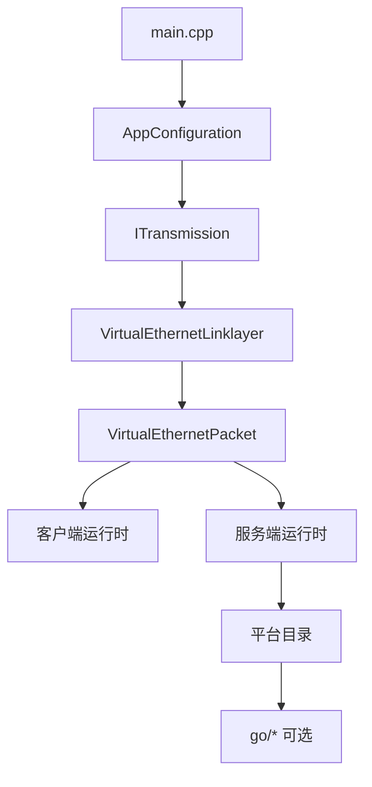

# 源码阅读指南

[English Version](SOURCE_READING_GUIDE.md)

## 目标

这份指南帮助工程师按有用的顺序阅读 OPENPPP2。

## 阅读顺序

1. `main.cpp`
2. `ppp/configurations/AppConfiguration.*`
3. `ppp/transmissions/ITransmission.*`
4. `ppp/app/protocol/VirtualEthernetLinklayer.*`
5. `ppp/app/protocol/VirtualEthernetPacket.*`
6. `ppp/app/client/*`
7. `ppp/app/server/*`
8. 各平台目录
9. 最后再看 `go/*`

## 重点关注

- 启动与角色选择
- 配置默认值和规范化
- 握手与分帧
- 隧道动作词汇
- 客户端路由与 DNS steering
- 服务端会话交换与转发
- 平台特化宿主副作用
- 管理后端要放在核心运行时读懂之后再看

## 常见错误

- 还没理解共享核心就先看平台代码
- 把 `ITransmission` 的 framing 和 packet format 混为一谈
- 把 client 和 server exchanger 当成对称实现
- 以为 Go 后端是 data plane

## 实用规则

如果平台目录中的代码修改了路由、DNS、适配器、防火墙或者 socket 保护，就要把它当作运行时行为，而不是普通辅助函数。

如果 `ITransmission` 中的代码改变了握手状态或帧形状，就要把它当作传输策略，而不是机械的读写封装。

## 相关文档

- `ARCHITECTURE_CN.md`
- `TUNNEL_DESIGN_CN.md`
- `CLIENT_ARCHITECTURE_CN.md`
- `SERVER_ARCHITECTURE_CN.md`
