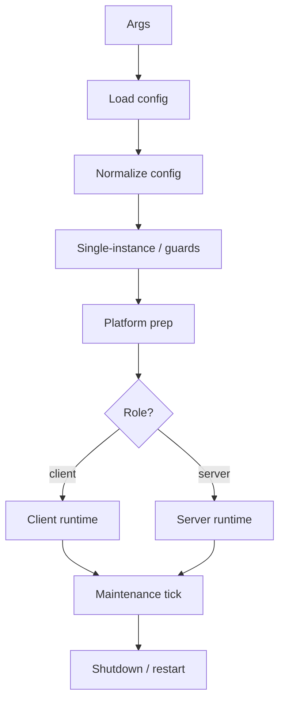
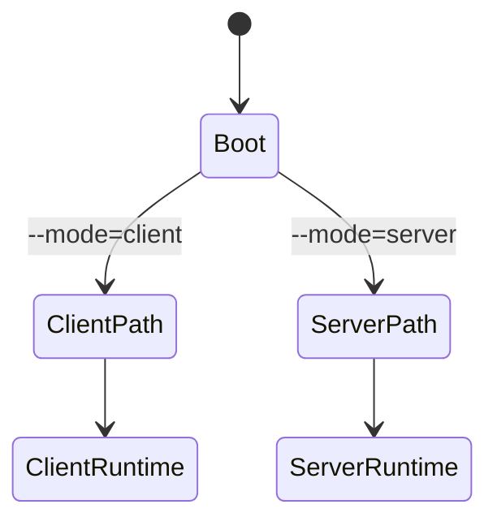

# Startup, Process Ownership, and Lifecycle Control

[中文版本](STARTUP_AND_LIFECYCLE_CN.md)

## Scope

This document explains how `ppp` starts, how process ownership is structured, how client and server diverge, and how maintenance and shutdown controls work.

## Why Startup Matters

OPENPPP2 startup is not just read-config-and-run. It has to handle privilege checks, single-instance protection, configuration loading, local host shaping, platform preparation, role selection, runtime startup, maintenance, and shutdown/restart control.

## Process Owner

`PppApplication` is the process owner. It coordinates configuration, network shaping, runtime creation, statistics, timers, and lifecycle control.

## Startup Pipeline

1. argument preparation
2. configuration loading
3. configuration normalization
4. single-instance check
5. platform preparation
6. role selection
7. runtime creation
8. tick loop
9. shutdown

## Environment Preparation

The startup phase prepares local host state before role-specific runtime begins. That includes CLI-shaped network inputs and platform-specific preparation.

This stage matters because the runtime is not purely in-process. It mutates host state such as routing, DNS, adapters, firewall behavior, and platform-specific network plumbing.

## Role Selection

The client and server branches diverge early:

- client creates the virtual adapter path and client switcher
- server creates listener state and server switcher

## Lifecycle Control

The tick loop handles periodic maintenance. Restart and shutdown are controlled at the process level, not as side effects of individual connections.

These process timers do not implement transport handshake retry or client-side SYN/ACK reinjection; those belong to the client virtual network stack path.

This is important because connection failures should not automatically collapse process ownership. The process remains the outer lifecycle boundary.

## Error Handling Registration In Startup Window

`RegisterErrorHandler` is key-based and should be finalized during startup initialization:

- use a stable key per registration site;
- passing a null handler removes the registration for that key;
- complete registration changes before multi-thread runtime branches begin.

Registration-time mutation is intentionally treated as initialization work. Runtime diagnostics dispatch is thread-safe for readers, but registration churn during active worker execution is not part of the supported contract.

See `ERROR_HANDLING_API.md` for API-level notes.

## Diagnostics Propagation Expectations Across Lifecycle

For each lifecycle stage (load, normalize, prepare, open, tick maintenance, dispose/rollback):

- failure returns should carry diagnostics codes, not only sentinel values;
- process-wide snapshot APIs are used by Console UI status surfaces;
- lifecycle troubleshooting should start from diagnostics timeline, then map to subsystem logs.

This policy keeps startup and shutdown troubleshooting deterministic even when failure originates on worker threads.

## Android Lifecycle Sync Notes

Android bridge lifecycle (`run`, `stop`, and release paths) should maintain parity with core lifecycle semantics:

- app-uninitialized and not-running states should map consistently across JNI and core diagnostics;
- release/cleanup failures should be reported with stable meanings so managed callers can react predictably.

## Ownership Model

| Level | Owner |
|---|---|
| Process | `PppApplication` |
| Environment | switchers |
| Session | exchangers |
| Connection | `ITransmission` |

## Related Documents

- `ARCHITECTURE.md`
- `CLIENT_ARCHITECTURE.md`
- `SERVER_ARCHITECTURE.md`
- `SOURCE_READING_GUIDE.md`
- `ERROR_HANDLING_API.md`
