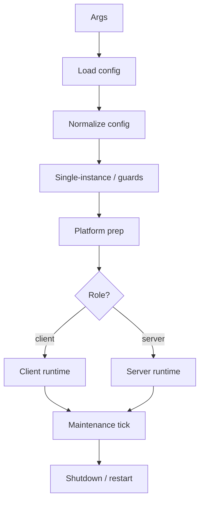
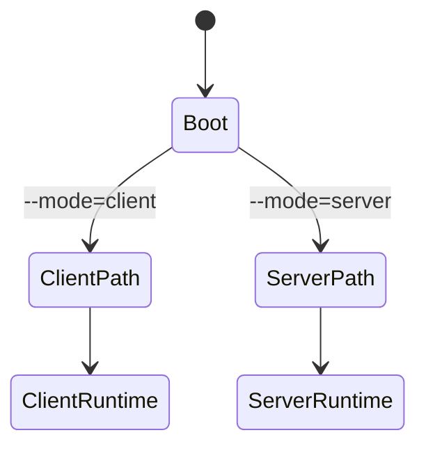
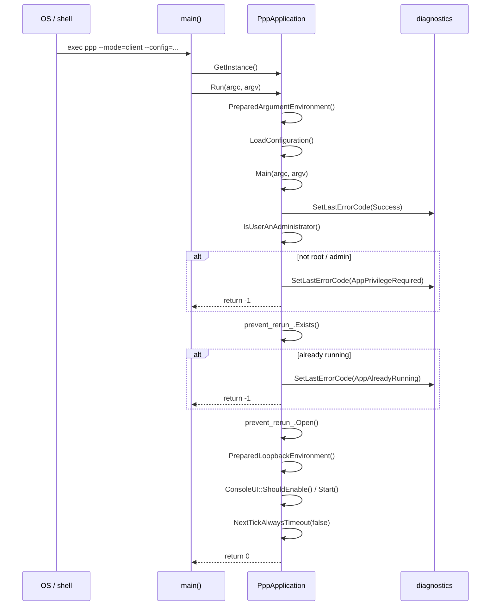
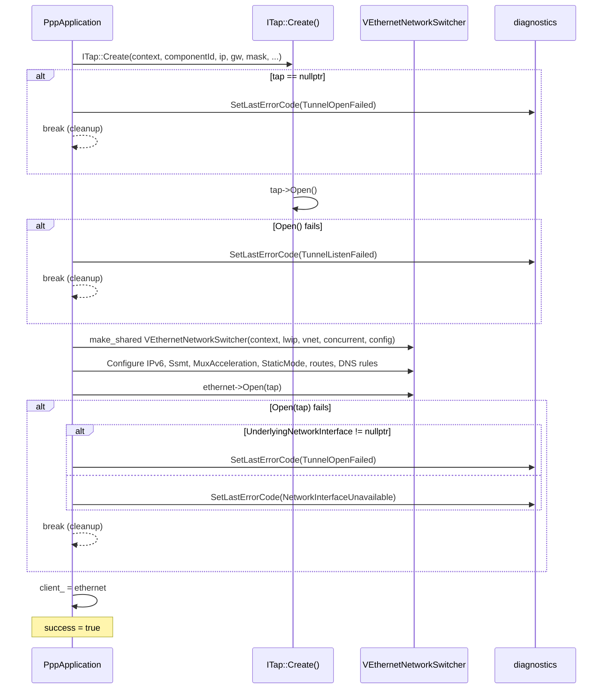
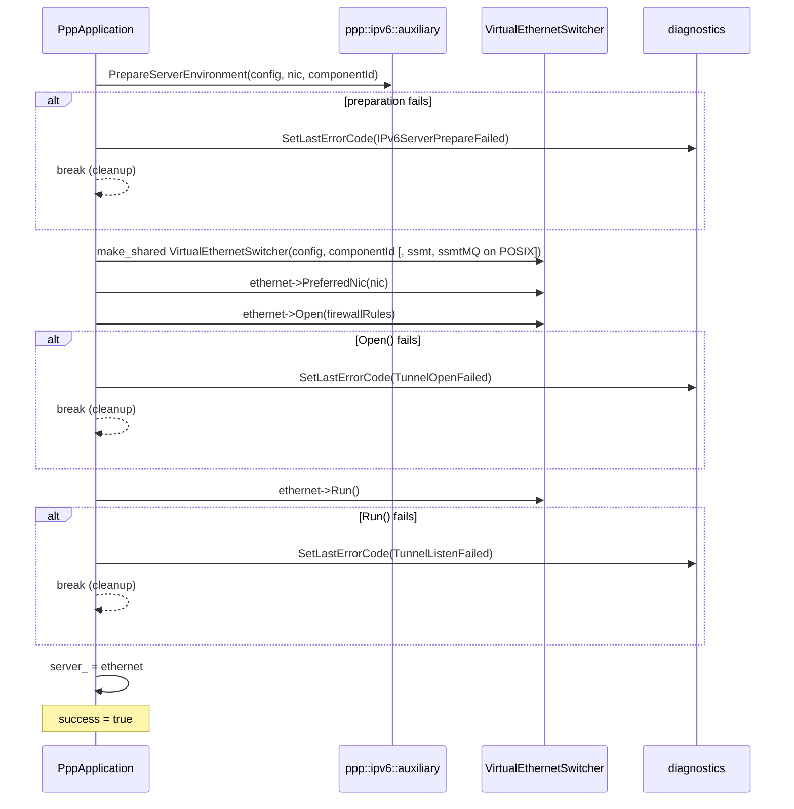
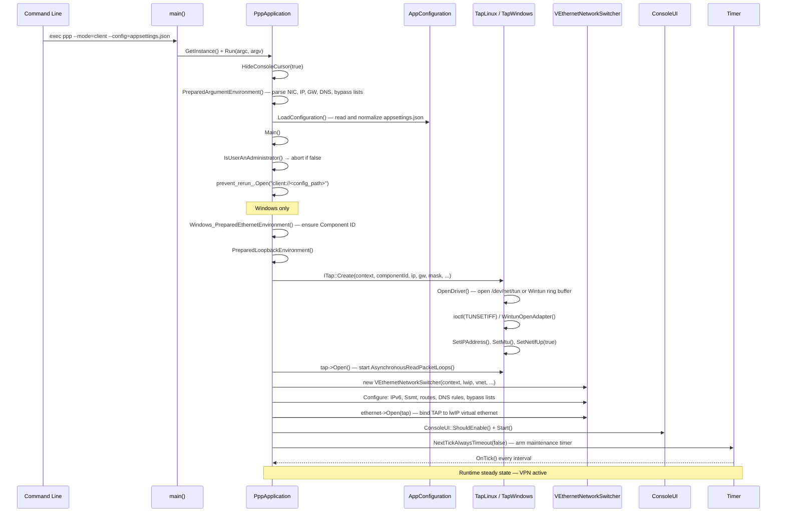
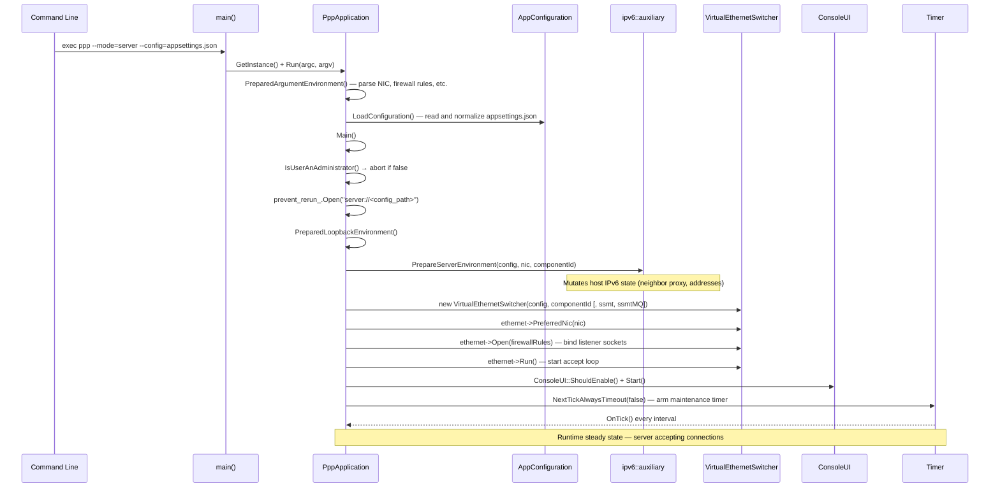

# Startup, Process Ownership, and Lifecycle Control

[中文版本](STARTUP_AND_LIFECYCLE_CN.md)

## Scope

This document explains how `ppp` starts, how process ownership is structured, how client and server diverge, and how maintenance and shutdown controls work.

## Why Startup Matters

OPENPPP2 startup is not just read-config-and-run. It has to handle privilege checks, single-instance protection, configuration loading, local host shaping, platform preparation, role selection, runtime startup, maintenance, and shutdown/restart control.

## Process Owner

`PppApplication` is the process owner. It coordinates configuration, network shaping, runtime creation, statistics, timers, and lifecycle control.

## Startup Pipeline

1. argument preparation
2. configuration loading
3. configuration normalization
4. single-instance check
5. platform preparation
6. role selection
7. runtime creation
8. tick loop
9. shutdown



## Environment Preparation

The startup phase prepares local host state before role-specific runtime begins. That includes CLI-shaped network inputs and platform-specific preparation.

This stage matters because the runtime is not purely in-process. It mutates host state such as routing, DNS, adapters, firewall behavior, and platform-specific network plumbing.

## Role Selection

The client and server branches diverge early:

- client creates the virtual adapter path and client switcher
- server creates listener state and server switcher



## Lifecycle Control

The tick loop handles periodic maintenance. Restart and shutdown are controlled at the process level, not as side effects of individual connections.

These process timers do not implement transport handshake retry or client-side SYN/ACK reinjection; those belong to the client virtual network stack path.

This is important because connection failures should not automatically collapse process ownership. The process remains the outer lifecycle boundary.

## Error Handling Registration In Startup Window

`RegisterErrorHandler` is key-based and should be finalized during startup initialization:

- use a stable key per registration site;
- passing a null handler removes the registration for that key;
- complete registration changes before multi-thread runtime branches begin.

Registration-time mutation is intentionally treated as initialization work. Runtime diagnostics dispatch is thread-safe for readers, but registration churn during active worker execution is not part of the supported contract.

See `ERROR_HANDLING_API.md` for API-level notes.

## Diagnostics Propagation Expectations Across Lifecycle

For each lifecycle stage (load, normalize, prepare, open, tick maintenance, dispose/rollback):

- failure returns should carry diagnostics codes, not only sentinel values;
- process-wide snapshot APIs are used by Console UI status surfaces;
- lifecycle troubleshooting should start from diagnostics timeline, then map to subsystem logs.

This policy keeps startup and shutdown troubleshooting deterministic even when failure originates on worker threads.

## Android Lifecycle Sync Notes

Android bridge lifecycle (`run`, `stop`, and release paths) should maintain parity with core lifecycle semantics:

- app-uninitialized and not-running states should map consistently across JNI and core diagnostics;
- release/cleanup failures should be reported with stable meanings so managed callers can react predictably.

## Ownership Model

| Level | Owner |
|---|---|
| Process | `PppApplication` |
| Environment | switchers |
| Session | exchangers |
| Connection | `ITransmission` |

---

## Detailed Initialization Flow (ApplicationInitialize.cpp)

### Entry Point Chain

The process starts at `main()` (`main.cpp`), which obtains the `PppApplication` singleton and calls `Run()`. `Run()` prepares arguments and dispatches into `Main()`, which executes the full initialization pipeline:



### Initialization Steps in `Main()`

Each step maps to a specific error code when it fails:

| Step | Guard / Action | Error Code on Failure |
|---|---|---|
| 1 | `SetLastErrorCode(Success)` — reset diagnostics | — |
| 2 | `IsUserAnAdministrator()` — privilege check | `AppPrivilegeRequired` |
| 3 | `prevent_rerun_.Exists()` — single-instance check | `AppAlreadyRunning` |
| 4 | `prevent_rerun_.Open()` — acquire lock | `AppLockAcquireFailed` |
| 5 | `Windows_PreparedEthernetEnvironment()` (Windows client only) | `NetworkInterfaceConfigureFailed` |
| 6 | `PreparedLoopbackEnvironment()` — TAP + switcher open | `AppPreflightCheckFailed` (or inner code) |
| 7 | `NextTickAlwaysTimeout(false)` — start tick timer | `RuntimeTimerStartFailed` |

### Constructor: Console and Platform Setup

`PppApplication::PppApplication()` runs before any argument processing:

- Calls `ppp::HideConsoleCursor(true)` on all platforms to hide terminal cursor during TUI rendering.
- On Windows: sets console title to `"PPP PRIVATE NETWORK™ 2"`, resizes the console buffer to 120×46 (Windows 11) or 120×47 (older), and disables the window close button via `EnabledConsoleWindowClosedButton(false)`.

### Client Initialization: `PreparedLoopbackEnvironment()` — Client Path

The client initialization is structured as a single transactional `do { ... } while (false)` block. Any failure breaks out to centralized cleanup:



Platform-specific differences in `ITap::Create()` signature:

- **Windows**: `Create(context, componentId, ip, gw, mask, leaseTimeInSeconds, hostedNetwork, dnsAddresses)`
- **POSIX (Linux/macOS/Android)**: `Create(context, componentId, ip, gw, mask, promisc, hostedNetwork, dnsAddresses)`

Linux-only client options set on `VEthernetNetworkSwitcher`:

- `Ssmt()` — multi-queue TUN multi-threading
- `SsmtMQ()` — message-queue variant of SSMT
- `ProtectMode()` — socket protection for bypass routing

### Server Initialization: `PreparedLoopbackEnvironment()` — Server Path

Server initialization differs significantly — no TAP adapter is created:



On failure, `ppp::ipv6::auxiliary::FinalizeServerEnvironment()` is always called to roll back any IPv6 host state that was mutated.

### Post-Initialization: TUI and Tick Loop

After `PreparedLoopbackEnvironment()` succeeds:

1. **TUI detection**: `ConsoleUI::ShouldEnable()` checks `isatty(stdout)`. If stdout is a pipe or redirected file, the full-screen TUI is skipped and a plain-text startup banner is printed instead.
2. **Statistics reset**: `stopwatch_.Restart()` and `transmission_statistics_.Clear()` mark the start of the runtime measurement window.
3. **Client-specific post-init** (Windows): QUIC protocol support is toggled via `HttpProxy::SetSupportExperimentalQuicProtocol()`.
4. **VIRR and VBGP flags**: read from CLI arguments (`--virr`, `--vbgp`) and stored in global atomics for use by the routing subsystem.
5. **Auto-restart / link-restart**: `--auto-restart` and `--link-restart` arguments are parsed and stored in `GLOBAL_`.
6. **Tick timer**: `NextTickAlwaysTimeout(false)` arms the periodic maintenance timer. Failure here sets `RuntimeTimerStartFailed` and calls `Dispose()` before returning.

---

## Complete Application Lifecycle State Machine

```mermaid
stateDiagram-v2
    [*] --> Constructed : PppApplication()
    Constructed --> ArgumentsPrepared : PreparedArgumentEnvironment()
    ArgumentsPrepared --> ConfigurationLoaded : LoadConfiguration()
    ConfigurationLoaded --> PrivilegeChecked : IsUserAnAdministrator()
    PrivilegeChecked --> [*] : FAIL → AppPrivilegeRequired
    PrivilegeChecked --> SingleInstanceGuarded : prevent_rerun_.Open()
    SingleInstanceGuarded --> [*] : FAIL → AppAlreadyRunning / AppLockAcquireFailed

    SingleInstanceGuarded --> ClientPreflightDone : Windows TAP driver check (client only)
    ClientPreflightDone --> [*] : FAIL → NetworkInterfaceConfigureFailed

    SingleInstanceGuarded --> LoopbackReady : PreparedLoopbackEnvironment()
    ClientPreflightDone --> LoopbackReady : PreparedLoopbackEnvironment()
    LoopbackReady --> [*] : FAIL → TunnelOpenFailed / TunnelListenFailed / NetworkInterfaceUnavailable

    LoopbackReady --> TUIStarted : ConsoleUI::Start() or plain-text fallback
    TUIStarted --> TickRunning : NextTickAlwaysTimeout(false)
    TickRunning --> [*] : FAIL → RuntimeTimerStartFailed

    TickRunning --> Running : OnTick() loop active

    Running --> Running : periodic OnTick()
    Running --> ShuttingDown : OnShutdownApplication() / signal
    Running --> Restarting : ShutdownApplication(restart=true)

    ShuttingDown --> Disposed : Dispose() + Release()
    Restarting --> Disposed : Dispose() + Release()
    Disposed --> [*]
```

### Detailed Client Startup Sequence



### Detailed Server Startup Sequence



---

## Related Documents

- `ARCHITECTURE.md`
- `CLIENT_ARCHITECTURE.md`
- `SERVER_ARCHITECTURE.md`
- `SOURCE_READING_GUIDE.md`
- `ERROR_HANDLING_API.md`
