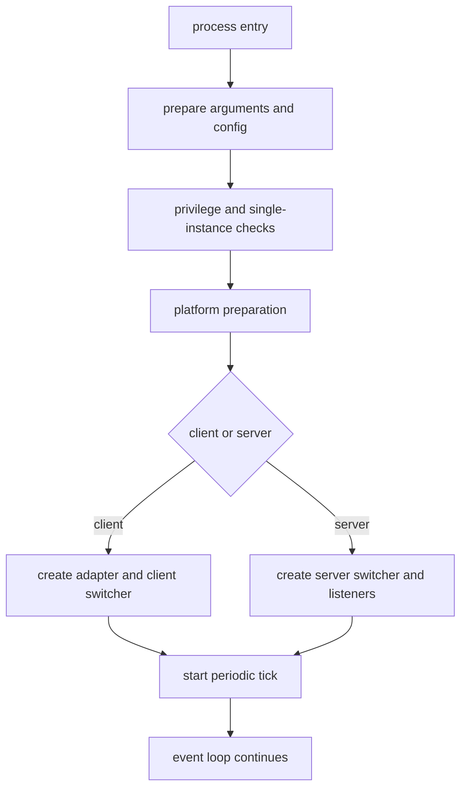
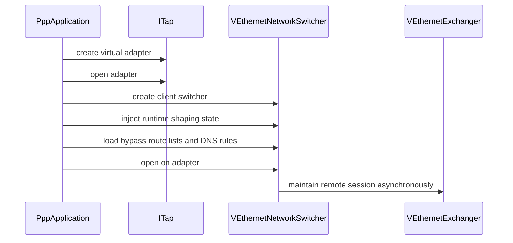
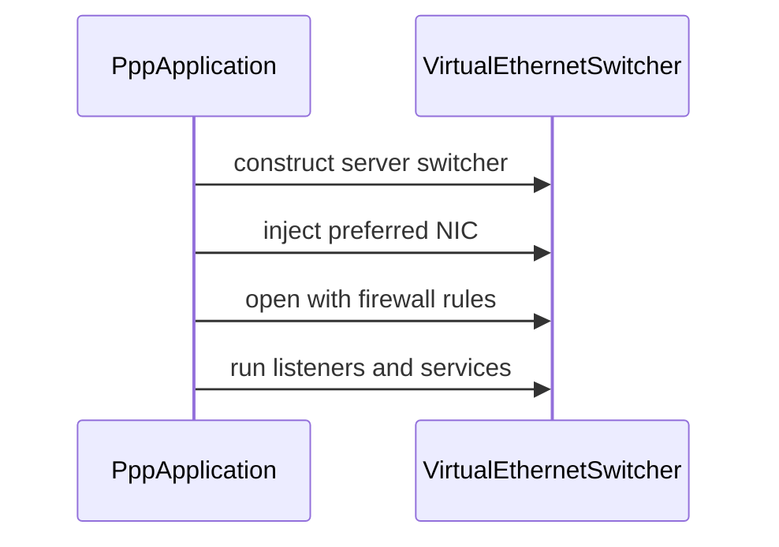
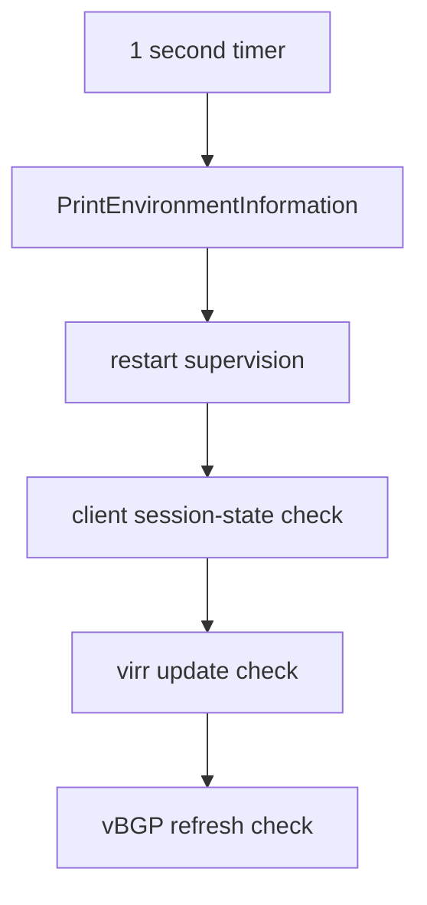

# Startup, Process Ownership, And Lifecycle Control

[中文版本](STARTUP_AND_LIFECYCLE_CN.md)

## Scope

This document explains how the `ppp` process starts, how ownership is distributed across the major runtime objects, how the client and server branches diverge, and how periodic maintenance, shutdown, and restart behavior are implemented.

The primary implementation source is `main.cpp`, with supporting behavior from the client and server switchers and the transmission subsystem.

This is one of the most important documents for readers who want to understand the project as a working system instead of as a pile of unrelated classes.

## Why Startup Matters So Much In OPENPPP2

In smaller tools, startup can often be summarized as “parse config, open socket, run event loop.” That is not enough here.

OPENPPP2 startup has to solve:

- privilege validation
- single-instance protection
- configuration loading and normalization
- local network-interface shaping through CLI
- platform-specific environment preparation
- client-side virtual adapter creation or server-side listener creation
- periodic maintenance scheduling
- restart and shutdown discipline

That means startup is not a trivial preface. It is where the system turns from source code into a coherent infrastructure node.

## `PppApplication` As The Process Owner

`PppApplication` is the top-level owner of process lifecycle. It owns or coordinates:

- loaded `AppConfiguration`
- parsed `NetworkInterface` runtime shaping object
- client runtime object or server runtime object
- transmission statistics snapshots
- tick timer lifecycle
- restart and shutdown behavior

A useful mental model is:

- `PppApplication` owns process lifecycle
- switchers own environment lifecycle
- exchangers own session lifecycle
- transmissions own connection lifecycle

If those boundaries are kept clear, the code becomes much easier to follow.

## The High-Level Startup Pipeline

The startup path is best read as a pipeline.

This is a much better frame than “the program just starts.” Every later behavior depends on this pipeline having prepared a coherent environment.

## Prepared Argument Environment

`PreparedArgumentEnvironment(...)` is the first major preparation function.

It performs several foundational steps:

1. applies socket flash TOS behavior from `--tun-flash`
2. short-circuits into help flow if help was requested
3. loads configuration from file
4. decides client versus server role
5. adjusts thread-pool settings from `configuration->concurrent`
6. parses local network-interface shaping options
7. stores configuration path, configuration object, and network interface object
8. applies DNS helper settings from configuration

This is one of the most important startup functions because it creates the process-level state that later startup code consumes.

## Why Mode Is Decided Early

The mode decision happens early because it changes too much of the later startup path to defer.

Client and server differ in:

- required local platform preparation
- adapter versus listener creation
- object construction paths
- restart and periodic-task meaning

Defaulting to server mode when mode is absent is therefore a structural design decision, not a cosmetic default.

## Thread Pool And Concurrency Preparation

After configuration loads, startup adjusts executor behavior from `configuration->concurrent`.

If concurrency is greater than one:

- max schedulers are increased
- in server mode, max threads can also be increased using the configuration’s buffer allocator

This is important because concurrency is treated as a node-level runtime property rather than as an afterthought hidden inside random subsystems.

## `NetworkInterface` As Local Launch Shaping State

The object returned by `GetNetworkInterface(...)` is not the durable configuration model. It is the launch-specific local shaping model.

It contains things such as:

- local DNS addresses
- preferred NIC and gateway
- tunnel IP, gateway, mask, and interface name
- static-mode and host-network flags
- mux and mux acceleration values
- bypass lists and DNS/firewall rule file paths
- Linux route-protection and SSMT state
- Windows lease time and HTTP proxy integration flag

This separation is elegant because it prevents long-lived node policy from being confused with “what this machine should do right now on this launch.”

## Configuration Loading In Startup Context

`LoadConfiguration(...)` does more than find a file. It also decides whether a custom `BufferswapAllocator` should be built from `vmem` settings.

The startup consequences are significant.

If a valid `vmem` block results in a valid allocator, that allocator becomes the buffer backbone for later subsystems.

This means startup is not only loading policy; it is selecting memory-behavior infrastructure too.

## Platform Preparation Before Client Or Server Branching

`PreparedLoopbackEnvironment(...)` is where startup begins to become strongly role-specific and platform-specific.

Before diving into client or server behavior, it also performs shared platform preparation such as:

- obtaining the default `io_context`
- configuring Windows firewall application rules
- Windows-specific paper-airplane or LSP related behavior for clients

That means this function is the bridge between generic startup and environment-specific runtime realization.

## Client Branch In Detail

When `client_mode_` is true, `PreparedLoopbackEnvironment(...)` enters the client branch.

The high-level client startup path is:

1. create TAP or TUN object
2. open the virtual adapter
3. construct `VEthernetNetworkSwitcher`
4. inject requested IPv6 if present
5. inject SSMT and Linux protect-mode pointers where relevant
6. inject mux, static-mode, preferred gateway, and preferred NIC values
7. load bypass IP lists
8. load route-file IP lists from configuration
9. load DNS rules
10. open the client switcher on the adapter
11. store the resulting client object into `client_`

This is one of the clearest examples of process ownership layering in the code.

- `PppApplication` owns client-start decision and cleanup
- `ITap` owns adapter lifecycle
- `VEthernetNetworkSwitcher` owns local network environment
- `VEthernetExchanger` owns remote relationship maintenance

## Why The Client Branch Loads So Much Local State

The client branch has to do more than “connect to server” because OPENPPP2 client mode is a local network environment constructor.

It must decide:

- what adapter exists locally
- what routes should be injected
- what bypass lists should be loaded
- what DNS rules should be applied
- whether local proxy or mapping behavior exists

That is why the client branch feels heavier than a typical proxy client startup path.

## Server Branch In Detail

When `client_mode_` is false, startup enters the server branch.

The high-level server path is:

1. on Linux, prepare IPv6 server environment when needed
2. construct `VirtualEthernetSwitcher`
3. inject preferred NIC
4. open the switcher with firewall rules
5. run listeners and auxiliary services
6. store the resulting server object into `server_`

This again reveals the project’s architecture.

The server is not just an accept loop. It is the overlay node’s session switch and policy center.

## Cleanup On Branch Failure

Both client and server startup branches use explicit cleanup on failure.

Client-side cleanup includes:

- resetting `client_`
- disposing the switcher if it was created
- disposing the virtual adapter if it was opened

Server-side cleanup includes:

- resetting `server_`
- disposing the switcher if it was created

This is extremely important operationally because the process mutates host networking state. A failure path that leaked half-created network objects would be unacceptable in infrastructure software.

## `Main(...)` As The Runtime Entry

After preparation, `Main(...)` performs the top-level runtime entry behavior.

It checks:

- administrative privilege
- repeat-run guard
- Windows-specific adapter preparation for the client branch
- loopback environment preparation
- statistics initialization
- client-specific QUIC and HTTP-proxy shaping
- auto-update and vBGP global state
- auto-restart and link-restart global state
- starts the periodic tick timer

This means `Main(...)` is where process preparation becomes “the node is now alive.”

## Single-Instance Guard

Before continuing into full runtime behavior, `Main(...)` builds a repeat-run name from:

- the role string prefix `client://` or `server://`
- the configuration path

It then checks and opens the prevent-rerun guard.

This is a concrete example of the runtime treating process identity as a real lifecycle concept rather than as something left to operator discipline alone.

## Windows-Specific Main-Path Behavior

On Windows, `Main(...)` includes several extra steps.

For client mode it may:

- prepare the Ethernet environment
- save existing QUIC support state
- later toggle QUIC support based on `--block-quic`
- optionally set system HTTP proxy state

This is operationally important because Windows startup is not merely “same as Linux plus another adapter API.” The Windows branch changes system-facing networking behavior more explicitly.

## Global Runtime State In `Main(...)`

`Main(...)` also sets several pieces of global state.

Examples include:

- whether `virr` automatic IP-list updates are enabled
- the `virr` argument string
- whether `vbgp` route-refresh behavior is active
- `auto_restart`
- `link_restart`

This helps explain later periodic-tick behavior. Some of the tick logic is really process policy encoded in global state rather than in the client or server switchers themselves.

## Periodic Tick Model

The lifecycle model includes a visible periodic maintenance path through:

- `OnTick(...)`
- `NextTickAlwaysTimeout(...)`
- `ClearTickAlwaysTimeout()`

The timer fires every second and then re-arms itself by scheduling the next timeout.

This is a very infrastructure-style design. Instead of scattering critical maintenance into many invisible timers, the process keeps an explicit top-level maintenance loop.

## What Happens In `OnTick(...)`

`OnTick(...)` performs a mixture of observability, housekeeping, and restart supervision.

Its main behaviors include:

- print environment information
- optimize working-set size on Windows
- enforce process auto-restart timeout
- for clients, verify that a client switcher and exchanger exist
- inspect network-state establishment
- enforce link-restart threshold
- refresh `virr` country IP-list updates when due
- refresh vBGP route lists periodically

This means `OnTick(...)` is not just a cosmetic status printer. It is a control loop.

## Auto-Restart And Link-Restart

The project contains two different restart ideas at the lifecycle layer.

### Auto restart

If `GLOBAL_.auto_restart` is set, the process compares elapsed runtime against the threshold and can restart the whole application when the threshold is exceeded.

### Link restart threshold

If the client exchanger has reconnected too many times and `GLOBAL_.link_restart` is set, the process may restart the application.

This is important because the project treats resilience as a process-level concern, not merely as a socket retry concern.

## `virr` And Route-List Refresh Lifecycle

The lifecycle model also includes route-list refresh behavior.

For `virr`:

- a next-update timestamp is tracked
- when due, the process can pull updated IP-list data

For vBGP-style route lists:

- a periodic interval is checked
- the client’s vBGP route table is traversed
- route lists may be re-downloaded
- if contents changed, the file is rewritten and the application may restart to adopt the new policy cleanly

This shows again how much OPENPPP2 is infrastructure software. Route material is not static decoration. It is part of supervised runtime policy.

## Disposal Path

`PppApplication::Dispose()` performs explicit teardown.

It:

- disposes the server switcher if present
- restores Windows QUIC behavior if needed
- clears system HTTP proxy state on Windows if the runtime set it earlier
- disposes the client switcher if present
- clears the tick timer

This matters because the process can change host networking state and should clean up after itself predictably.

## Statistics Snapshot Ownership

`GetTransmissionStatistics(...)` retrieves statistics from whichever active top-level switcher exists.

That is important because it shows where observability ownership lives.

- the process does not inspect raw sockets directly here
- it asks the currently active environment owner for transport statistics

This is another sign of coherent ownership boundaries in the runtime.

## Shutdown And Restart Requests

`ShutdownApplication(...)` posts a shutdown or restart request into the main `io_context`.

This means shutdown is coordinated inside the event-driven runtime rather than being treated as an arbitrary external kill signal only.

That is a better fit for a network process that needs to unwind internal state safely.

## Utility Commands Bypass Full Runtime Startup

Not every invocation path becomes a long-running tunnel process.

`Run(...)` checks for helper commands first, including:

- `--pull-iplist`
- Windows preferred network commands
- `--no-lsp`
- `--system-network-optimization`

If those are used, the process performs the helper action and exits without continuing into the full normal startup path.

This is one reason CLI documentation has to distinguish:

- startup-shaping switches
- one-shot utility commands

## Why Lifecycle Documentation Matters For Developers

Many confusing behaviors in OPENPPP2 become simpler once you know where they live in lifecycle ownership.

If something is about:

- reading files and choosing policy, look at configuration loading
- local environment realization, look at switchers and adapter setup
- remote relationship maintenance, look at exchangers
- packet and connection state, look at transmissions
- periodic supervision or restart, look at `OnTick(...)` and the lifecycle layer

That is the map that keeps the project from becoming mentally tangled.

## Reading Order For Source Study

To study startup and lifecycle in the best order, read:

1. `PppApplication::PreparedArgumentEnvironment(...)`
2. `PppApplication::LoadConfiguration(...)`
3. `PppApplication::GetNetworkInterface(...)`
4. `PppApplication::PreparedLoopbackEnvironment(...)`
5. `PppApplication::Main(...)`
6. `PppApplication::OnTick(...)`
7. `PppApplication::NextTickAlwaysTimeout(...)`
8. `PppApplication::Dispose()`
9. `PppApplication::ShutdownApplication(...)`

This order makes the system read like a lifecycle narrative instead of a maze.

## Final Interpretation

OPENPPP2 startup and lifecycle are best understood as a layered ownership system.

The process does not merely launch sockets. It:

- validates privilege and identity
- shapes stable policy from configuration
- shapes local runtime behavior from CLI
- realizes either a client network environment or a server policy environment
- supervises itself continuously through a tick loop
- handles restart, route refresh, and teardown explicitly

That is exactly the kind of startup discipline expected from a serious network infrastructure runtime.

## Related Documents

- [`USER_MANUAL.md`](USER_MANUAL.md)
- [`CONFIGURATION.md`](CONFIGURATION.md)
- [`CLIENT_ARCHITECTURE.md`](CLIENT_ARCHITECTURE.md)
- [`SERVER_ARCHITECTURE.md`](SERVER_ARCHITECTURE.md)
- [`TRANSMISSION.md`](TRANSMISSION.md)
