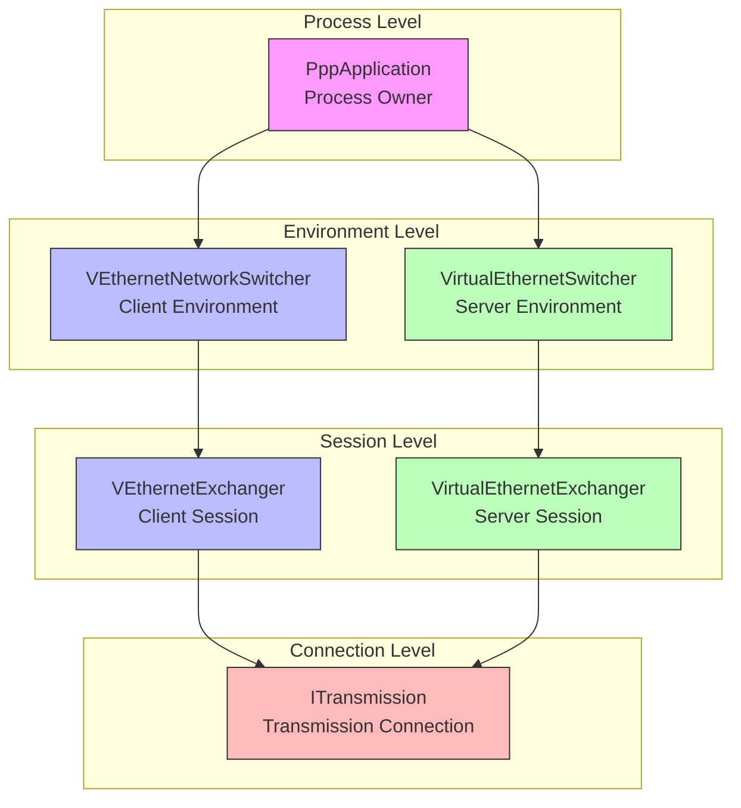
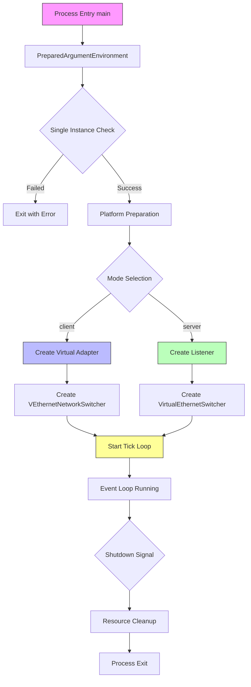
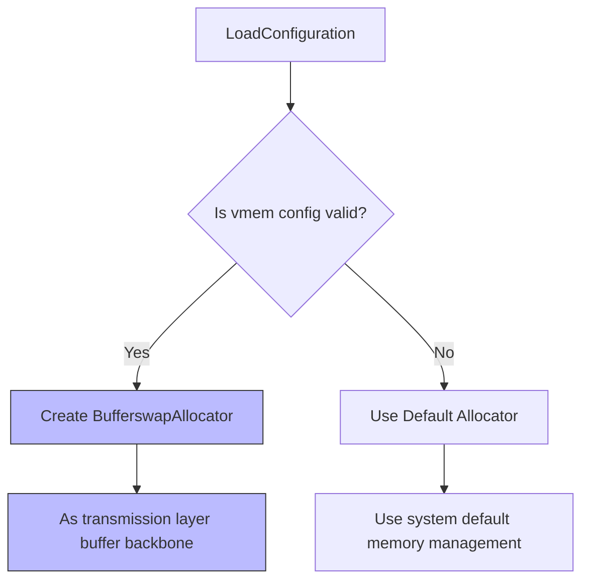
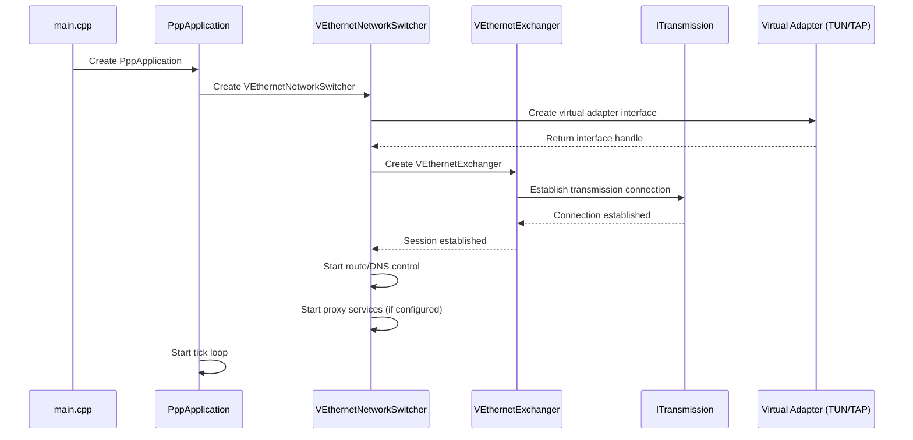
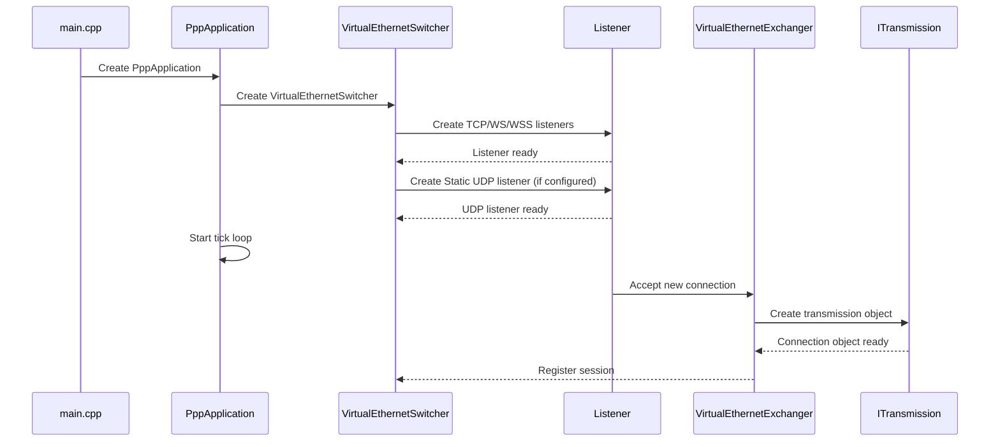
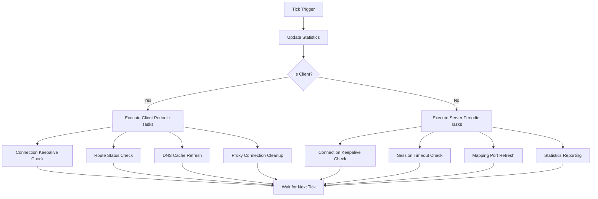
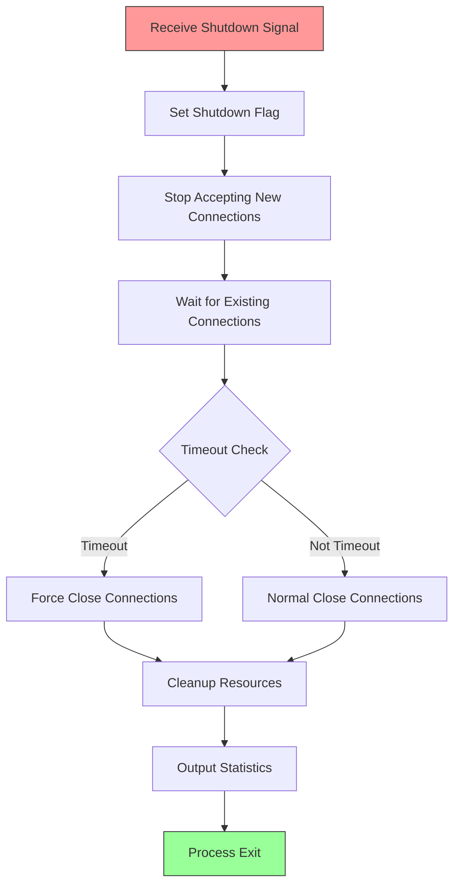

# Startup, Process Ownership, and Lifecycle Control

[中文版本](STARTUP_AND_LIFECYCLE_CN.md)

## Scope

This document explains how the `ppp` process starts, how ownership is distributed across the major runtime objects, how the client and server branches diverge, how periodic maintenance works, and how shutdown and restart controls are implemented. The primary implementation source is `main.cpp`, with supporting behavior from the client and server switchers and the transmission subsystem. This is one of the most important documents for readers who want to understand the project as a working system instead of as a pile of unrelated classes.

As a virtual Ethernet infrastructure product, OPENPPP2's startup process is far more complex than simply "read config, open socket, run event loop". It must simultaneously solve multiple dimensional problems including privilege validation, single-instance protection, configuration loading and normalization, local network-interface shaping through CLI, platform-specific environment preparation, client-side virtual adapter creation or server-side listener creation, periodic maintenance scheduling, and restart/shutdown control.

## Why Startup Matters So Much In OPENPPP2

In smaller tools, startup can often be summarized as "parse config, open socket, run event loop." That is not enough here because this is a cross-platform network infrastructure runtime.

OPENPPP2 startup has to solve the following problems:

| Startup Requirement | Description | Key Source Location |
|---------------------|-------------|---------------------|
| Privilege validation | Verify running privileges, ensure sufficient permissions to create virtual adapters or bind ports | `main.cpp` entry |
| Single-instance protection | Prevent multiple instances on the same machine causing port conflicts | `main.cpp` single instance check |
| Configuration loading and normalization | Normalize JSON config and CLI args to runtime model | `LoadConfiguration()`, `AppConfiguration.*` |
| Local network shaping | Shape local network interface through CLI parameters | `GetNetworkInterface()` |
| Platform environment preparation | Platform-specific environment preparation | `PreparedLoopbackEnvironment()` |
| Virtual adapter creation | Client needs to create virtual adapter interface | `VEthernetNetworkSwitcher.*` |
| Server listener creation | Server needs to create multi-protocol listeners | `VirtualEthernetSwitcher.*` |
| Periodic maintenance scheduling | Tick loop executes various periodic tasks | `PppApplication::tick()` |
| Restart and shutdown control | Graceful shutdown and auto-restart mechanism | `PppApplication` lifecycle management |

This means startup is not a trivial preface. It is where the system turns from source code into a coherent infrastructure node.

## `PppApplication` As The Process Owner

`PppApplication` is the top-level process lifecycle owner, the brain and coordination center of the entire runtime. It owns or coordinates the following core components:

### Primary Responsibilities

| Responsibility | Description | Corresponding Source |
|----------------|-------------|---------------------|
| Configuration management | Holds loaded `AppConfiguration` | `PppApplication::configuration_` |
| Network shaping | Holds parsed `NetworkInterface` local shaping object | `PppApplication::interface_` |
| Runtime creation | Creates client runtime or server runtime objects | `PppApplication::CreateClient()`, `CreateServer()` |
| Status snapshot | Holds transmission statistics snapshot | `PppApplication::statistics_` |
| Timer scheduling | Manages tick timer lifecycle | `PppApplication::timer_` |
| Lifecycle control | Manages restart and shutdown behavior | `PppApplication::Restart()`, `Shutdown()` |

### Mental Model

The best way to understand OPENPPP2's runtime object hierarchy is to establish a clear mental model:

| Object Level | Responsible For | Key Types |
|--------------|-----------------|-----------|
| Process level | Process lifecycle management | `PppApplication` |
| Environment level | Virtual adapter/listener lifecycle | `*Switcher` |
| Session level | Remote connection lifecycle | `*Exchanger` |
| Connection level | Transmission connection lifecycle | `ITransmission` |

This layered design makes each layer's responsibility boundaries clear and easy to maintain and extend. As long as this boundary is maintained, the code remains clear.

## High-Level Startup Pipeline

The startup path is best understood as a pipeline, with each step building on the previous one:

### Pipeline Stage Details

#### Stage 1: Argument Preparation and Configuration Loading

`PreparedArgumentEnvironment(...)` is the first important preparation function, performing the following operations:

| Step | Operation | Description |
|------|-----------|-------------|
| 1 | Set socket flash TOS | Set Type of Service based on `--tun-flash` parameter |
| 2 | Help command check | Exit early if help command is requested |
| 3 | Load configuration file | Read `appsettings.json` or specified config file |
| 4 | Mode determination | Decide client or server based on config or CLI args |
| 5 | Thread pool adjustment | Adjust executor behavior based on `configuration->concurrent` |
| 6 | Network parameter parsing | Parse local network-interface shaping parameters |
| 7 | Save state | Save config path, config object, network interface object to `PppApplication` |
| 8 | DNS helper | Set DNS helper state based on configuration |

It is important because subsequent startup behaviors depend on the process-level state established here.

#### Stage 2: Single-Instance Protection

Single-instance protection is a key mechanism to prevent port conflicts and network chaos from running multiple OPENPPP2 instances on the same machine:

| Check Method | Description |
|--------------|-------------|
| Named mutex | Use system-level named mutex to ensure only one instance runs |
| Port check | Check if default port is already in use |
| Error handling | Exit gracefully with error if existing instance detected |

#### Stage 3: Platform Preparation

`PreparedLoopbackEnvironment(...)` is the bridge from "generic startup" to "environment-level runtime landing". Before entering the client or server branch, it performs cross-branch platform preparation:

| Platform | Preparation Content |
|----------|---------------------|
| Windows | Configure firewall application rules, LSP-related preparation |
| Linux | Kernel parameter check, routing table initialization |
| macOS | Network interface initialization, permission check |
| Android | VPN Service permission handling |

#### Stage 4: Role Selection and Object Creation

Role must be determined early because too many subsequent logics depend on it. Client and server differ greatly in the following aspects:

| Dimension | Client | Server |
|-----------|--------|--------|
| Required platform preparation | Create virtual adapter | Create listener |
| Virtual object creation path | `VEthernetNetworkSwitcher` | `VirtualEthernetSwitcher` |
| Runtime object construction | `VEthernetExchanger` | `VirtualEthernetExchanger` |
| Periodic tasks | Route/DNS maintenance, proxy services | Connection management, mapping exposure |
| Restart and fault handling | Reconnection mechanism | Session recovery |

## Configuration Loading and Normalization

### Role of `LoadConfiguration`

The significance of `LoadConfiguration(...)` is not just finding a configuration file. It also decides whether to create a custom `BufferswapAllocator` based on `vmem`:

If `vmem` block is valid and the constructed allocator is valid, then subsequent transmission and packet processing paths will use it as the buffer backbone. Therefore, the startup phase not only reads strategy but also determines memory behavior infrastructure.

### Configuration Parameter Categories

OPENPPP2's configuration parameters can be divided into the following categories:

| Category | Parameter Examples | Affected Scope |
|-----------|-------------------|----------------|
| Global | `concurrent`, `cdn` | Entire runtime |
| Encryption | `key.*`, `protocol`, `transport` | Transmission layer |
| Network | `tcp.*`, `udp.*`, `mux.*` | Network connection |
| Server | `server.listen.*`, `server.backend` | Server runtime |
| Client | `client.server`, `client.guid` | Client runtime |
| Virtual Adapter | `tun-ip`, `tun-gw`, `tun-mask` | Virtual interface |
| Routing and DNS | `bypass`, `dns-rules`, `vbgp` | Routing policy |
| Static and MUX | `static.*`, `mux.*` | Data plane |

## NetworkInterface: Local Shaping State for This Startup

The object returned by `GetNetworkInterface(...)` is not a long-term configuration model. It is the "local shaping model for this startup". This design avoids mixing "long-term node strategy" with "the local environment shaping for this machine's this startup".

### Contents of NetworkInterface

| Field | Type | Description |
|-------|------|-------------|
| dns_ | string | Local DNS address |
| preferred_nic_ | string | Preferred physical adapter |
| preferred_ngw_ | string | Preferred gateway |
| tunnel_ip_ | string | Tunnel IP address |
| tunnel_gw_ | string | Tunnel gateway |
| tunnel_mask_ | string | Tunnel subnet mask |
| tunnel_name_ | string | Virtual adapter name |
| static_mode_ | bool | Whether to enable static mode |
| host_network_ | bool | Whether as preferred network |
| mux_ | int | MUX connection count |
| mux_acceleration_ | int | MUX acceleration mode |
| bypass_file_ | string | Bypass list file path |
| dns_rules_file_ | string | DNS rules file path |
| firewall_rules_file_ | string | Firewall rules file path |
| linux_route_protect_ | bool | Linux route protection |
| linux_ssmt_ | int | Linux SSMT thread count |
| windows_lease_time_ | int | Windows DHCP lease time |
| windows_http_proxy_ | bool | Windows system HTTP proxy |

## Client Startup Process

### Client Mode Startup Sequence

### Client Core Component Creation

The client creates the following core components in order during startup:

| Order | Component | Responsibility |
|-------|-----------|----------------|
| 1 | Virtual Adapter | Create TUN/TAP interface, assign IP and routes |
| 2 | VEthernetNetworkSwitcher | Manage virtual adapter, control route/DNS, traffic classification |
| 3 | VEthernetExchanger | Establish and maintain connection to server |
| 4 | Proxy Services | If HTTP/SOCKS proxy configured, start proxy services |
| 5 | Static Path | If static mode enabled, create UDP port |

### Client Key Parameters

| Parameter | Description | Default Value |
|-----------|-------------|---------------|
| `--mode=client` | Specify client mode | server |
| `--tun` | Virtual adapter name | Platform dependent |
| `--tun-ip` | Virtual adapter IP | 10.0.0.2 |
| `--tun-gw` | Virtual adapter gateway | 10.0.0.1 |
| `--tun-mask` | Subnet mask bits | 30 |
| `--server` | Server address | Required |
| `--guid` | Client unique identifier | Auto-generated |

## Server Startup Process

### Server Mode Startup Sequence

### Server Core Component Creation

The server creates the following core components in order during startup:

| Order | Component | Responsibility |
|-------|-----------|----------------|
| 1 | VirtualEthernetSwitcher | Manage server environment, accept connections |
| 2 | TCP Listener | Listen for PPP protocol connections (default 20000) |
| 3 | WS Listener | Listen for WebSocket connections (default 20080) |
| 4 | WSS Listener | Listen for WSS connections (default 20443) |
| 5 | Static UDP | If enabled, create static UDP port |
| 6 | Mapping Port | If port mapping configured, create mapping port |
| 7 | Namespace Cache | If enabled, create namespace cache |

### Server Key Parameters

| Parameter | Description | Default Value |
|-----------|-------------|---------------|
| `--mode=server` | Specify server mode | - |
| `--firewall-rules` | Firewall rules file | Optional |
| `server.listen.tcp` | TCP listener port | 20000 |
| `server.listen.ws` | WebSocket port | 20080 |
| `server.listen.wss` | WSS port | 20443 |
| `server.backend` | Management backend address | Optional |

## Tick Loop and Periodic Maintenance

### Tick Mechanism Overview

After startup completes, the system enters the tick loop to execute various periodic tasks. This is OPENPPP2's core mechanism for implementing various background maintenance:

### Client Periodic Tasks

| Task | Period | Description |
|------|--------|-------------|
| Connection keepalive | 60s | Send keepalive packets to maintain connection |
| Route status check | 30s | Check if routes need updating |
| DNS cache refresh | 60s | Refresh DNS cache |
| Proxy connection cleanup | 30s | Clean up timed-out proxy connections |
| Statistics output | 10s | Output traffic statistics |

### Server Periodic Tasks

| Task | Period | Description |
|------|--------|-------------|
| Connection keepalive | 60s | Send keepalive packets to maintain connection |
| Session timeout check | 30s | Check and clean up timed-out sessions |
| Mapping port refresh | 60s | Refresh port mapping status |
| Statistics output | 10s | Output traffic statistics |
| Backend sync | 60s | Sync status with management backend |

## Shutdown and Restart Control

### Graceful Shutdown Process

### Shutdown Flags

| Flag | Description |
|------|-------------|
| `disposed_` | Main shutdown flag |
| `closing_` | Currently closing |
| `force_shutdown_` | Force shutdown flag |

### Restart Mechanism

OPENPPP2 supports auto-restart mechanism, configurable via:

| Parameter | Description | Default Value |
|-----------|-------------|---------------|
| `--auto-restart` | Auto-restart interval (seconds) | 0 (disabled) |

When auto-restart is enabled, the system will automatically restart after the specified interval for fault recovery or config reload scenarios.

### Resource Cleanup Order

Resources are cleaned up in the following order during shutdown:

| Order | Cleanup Content |
|-------|-----------------|
| 1 | Stop tick loop |
| 2 | Close all client connections |
| 3 | Close all server listeners |
| 4 | Cleanup virtual adapter (client) |
| 5 | Cleanup route and DNS changes |
| 6 | Cleanup proxy services |
| 7 | Cleanup MUX connections |
| 8 | Free configuration memory |

## Exception Handling and Fault Recovery

### Client Exception Handling

| Exception Type | Handling |
|----------------|----------|
| Connection disconnection | Auto-reconnect with exponential backoff |
| Virtual adapter error | Attempt to recreate |
| DNS resolution failure | Use backup DNS |
| Proxy service error | Restart proxy service |

### Server Exception Handling

| Exception Type | Handling |
|----------------|----------|
| Listen port conflict | Try backup port |
| Session error | Close and cleanup session |
| Backend communication failure | Degrade to local-only operation |
| Out of memory | Reject new connections, cleanup idle sessions |

## Platform-Specific Startup Differences

### Windows Platform

| Preparation | Description |
|-------------|-------------|
| Firewall rules | Configure Windows Firewall allow rules |
| LSP preparation | PaperAirplane-related preparation |
| Network adapter | Create TAP adapter |
| DHCP lease | Configure IP lease time |

### Linux Platform

| Preparation | Description |
|-------------|-------------|
| TUN/TAP loading | Check and load tun module |
| Routing table permissions | Check routing table modification permissions |
| Network namespace | Support network namespace |
| Route protection | Optional route protection |

### macOS Platform

| Preparation | Description |
|-------------|-------------|
| utun interface | Create utun virtual interface |
| Permission check | Check network permissions |
| Promiscuous mode | Optional enable promiscuous mode |

### Android Platform

| Preparation | Description |
|-------------|-------------|
| VPN Service | Use Android VPN API |
| Permission handling | Handle VPN permission requests |
| Network interface | Create TUN interface |

## Startup Performance Considerations

### Startup Time Breakdown

| Stage | Expected Time | Optimization Suggestion |
|-------|---------------|-------------------------|
| Configuration loading | < 100ms | Keep config file small |
| Virtual adapter creation | 100-500ms | Platform dependent |
| Connection establishment | 100-2000ms | Network dependent |
| Route configuration | < 100ms | Keep route rules minimal |

### Concurrency Configuration Impact

The `concurrent` parameter has significant impact on startup performance:

| concurrent Value | Applicable Scenario | Thread Pool Configuration |
|-----------------|---------------------|---------------------------|
| 1 | Single-core environment | Single-threaded executor |
| Default (1) | Regular client | Standard thread pool |
| > 1 | Multi-core server | Multi-threaded executor |

## Summary

Understanding OPENPPP2's startup and lifecycle requires grasping the following core points:

1. **Unified entry**: One binary supports client/server roles, unified management through `PppApplication`
2. **Configuration as infrastructure**: Configuration loading not only reads files but also determines memory allocation strategy
3. **Layered object model**: Clear separation of process level, environment level, session level, and connection level
4. **Platform differences**: Different platforms have different environment preparation requirements
5. **Tick-driven**: Periodic tasks are uniformly scheduled through tick loop
6. **Graceful shutdown**: Complete resource cleanup mechanism during shutdown

Understanding these principles is crucial for correctly deploying and maintaining OPENPPP2.

## Related Documents

| Document | Description |
|----------|-------------|
| [ARCHITECTURE.md](ARCHITECTURE.md) | System Architecture Overview |
| [CLIENT_ARCHITECTURE.md](CLIENT_ARCHITECTURE.md) | Client Runtime Architecture |
| [SERVER_ARCHITECTURE.md](SERVER_ARCHITECTURE.md) | Server Runtime Architecture |
| [CONFIGURATION.md](CONFIGURATION.md) | Configuration Model and Parameter Dictionary |
| [PLATFORMS.md](PLATFORMS.md) | Platform Support and Differences |
