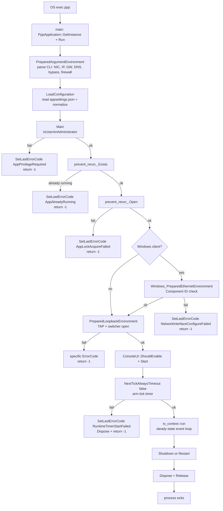
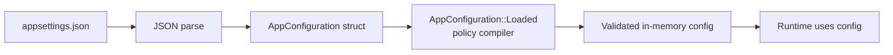
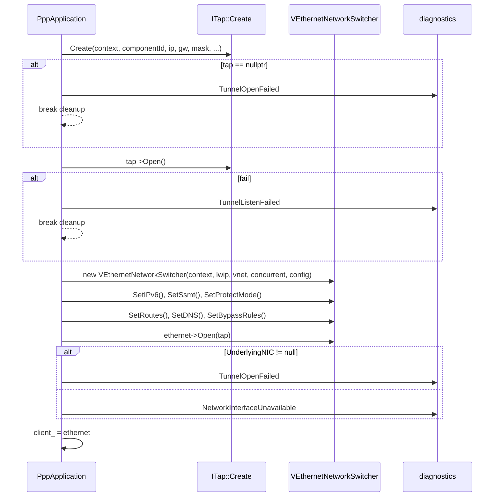
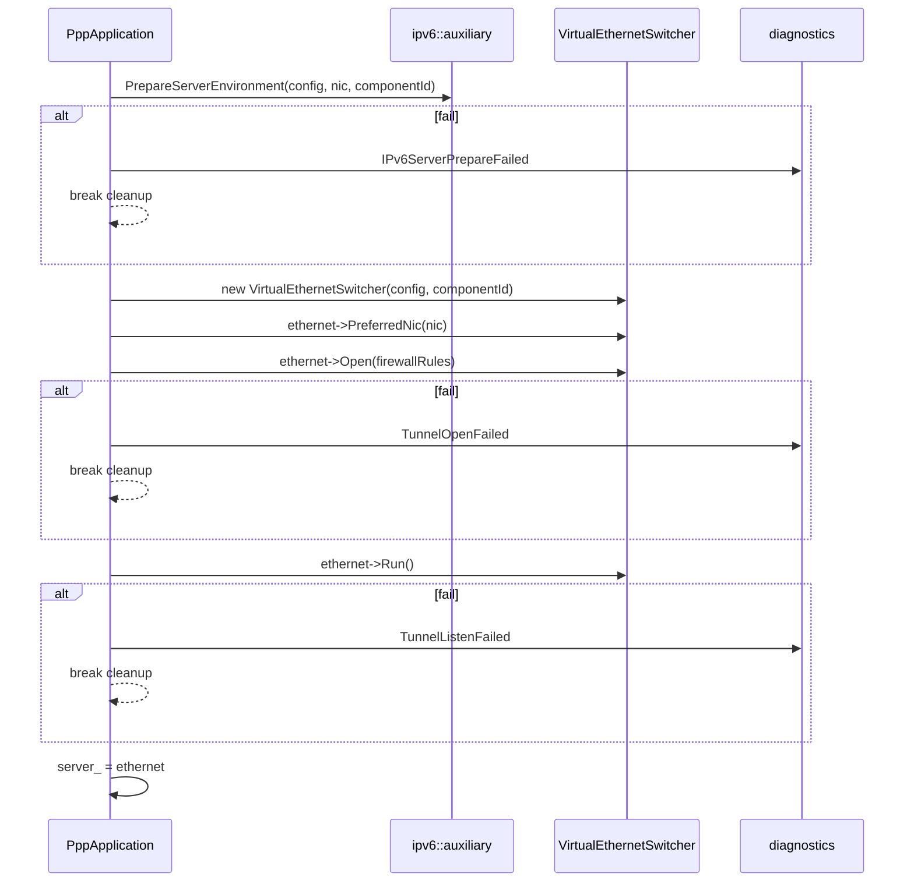
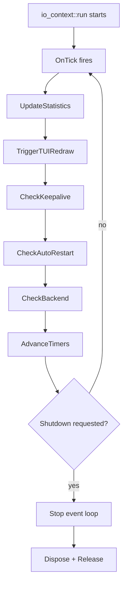
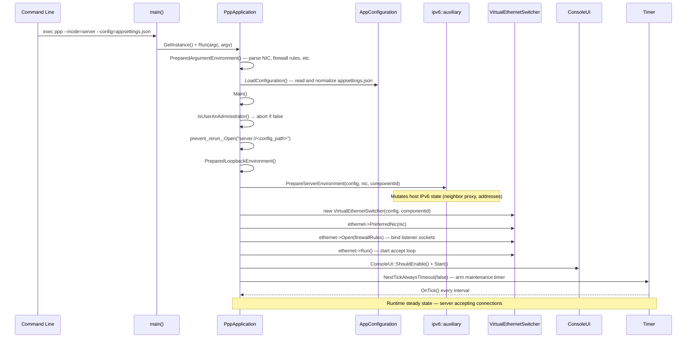
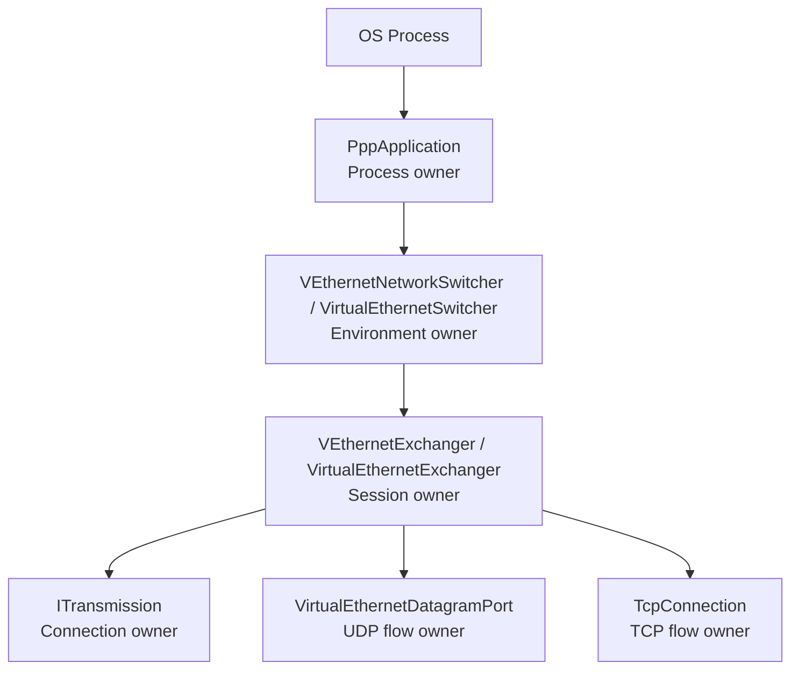
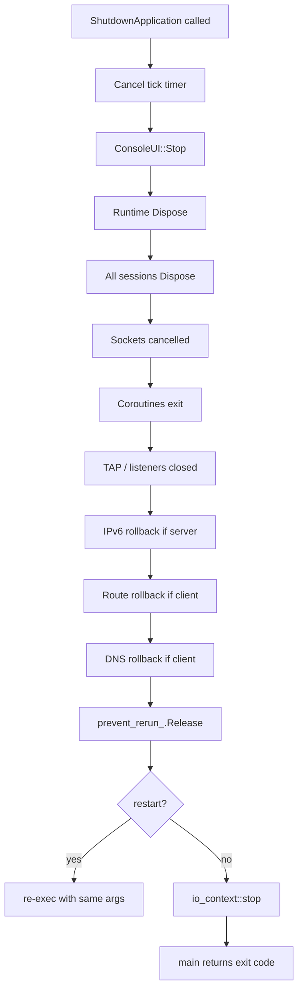

# Startup, Process Ownership, and Lifecycle Control

[中文版本](STARTUP_AND_LIFECYCLE_CN.md)

## Scope

This document explains how `ppp` starts, how process ownership is structured, how client and server diverge, and how maintenance and shutdown controls work. It covers every stage from the first OS instruction to the moment the runtime enters steady-state forwarding — and then how it shuts down cleanly.

Audience: contributors who are reading the code for the first time, operators who need to understand what the process is doing during startup, and engineers debugging startup failures using diagnostics codes.

---

## Why Startup Matters

OPENPPP2 startup is not just read-config-and-run. It has to handle:

- Privilege checks (root or Administrator required for TAP/TUN manipulation)
- Single-instance protection (prevent two servers from conflicting on the same config)
- Configuration loading and normalization (JSON → validated in-memory representation)
- Local host shaping (network interface setup, routing, DNS, firewall)
- Platform preparation (platform-specific TAP driver, Wintun rings, Android JNI)
- Role selection (client creates a TAP device; server creates a listener)
- Runtime creation (event loop threads, coroutine infrastructure, cipher objects)
- Maintenance tick loop (keepalive tracking, statistics, auto-restart checks)
- Shutdown and restart (clean resource release, routing rollback, process exit or re-exec)

Each of these is a distinct failure domain. A failure at any stage sets a `ppp::diagnostics::ErrorCode` and returns a non-zero process exit code.

---

## Process Owner

`PppApplication` is the process owner. It coordinates:

| Concern | Owned by |
|---------|---------|
| Configuration | `AppConfiguration` via `PppApplication::LoadConfiguration()` |
| Network environment | Platform-specific TAP/TUN and routing code |
| Runtime creation | `VEthernetNetworkSwitcher` (client) or `VirtualEthernetSwitcher` (server) |
| Statistics | `TransmissionStatistics` + `Stopwatch` |
| Timers | `NextTickAlwaysTimeout` tick loop |
| Lifecycle | `prevent_rerun_` lock, `ShutdownApplication()`, `Dispose()` |
| TUI | `ConsoleUI` (optional, suppressed when stdout is not a terminal) |

`PppApplication` is a singleton accessed via `PppApplication::GetInstance()`. The constructor runs before argument processing and sets up console attributes (cursor hide, window title, buffer size on Windows).

Source: `main.cpp`, `ppp/app/PppApplication.h`, `ppp/app/PppApplication.cpp`

---

## Startup Pipeline



---

## Phase 1: Argument Preparation

`PreparedArgumentEnvironment()` parses command-line arguments before any configuration file is read. CLI arguments take precedence over JSON config for most fields. The following inputs are established:

| CLI Argument | Effect |
|-------------|--------|
| `--mode=client\|server` | Role selection |
| `--config=<path>` | Path to `appsettings.json` |
| `--nic=<name>` | Override NIC name |
| `--ip=<addr>` | Override virtual IP address |
| `--gw=<addr>` | Override virtual gateway |
| `--mask=<mask>` | Override subnet mask |
| `--dns=<addr>[,<addr>]` | Override DNS server list |
| `--bypass=<cidr>[,<cidr>]` | Add bypass routes |
| `--firewall=<path>` | Firewall rule file |
| `--virr` | Enable VIRR routing flag |
| `--vbgp` | Enable VBGP routing flag |
| `--auto-restart` | Auto-restart on network failure |
| `--link-restart` | Restart on link failure |

These are stored in the `GLOBAL_` struct and in `PppApplication` instance fields. They are applied during `PreparedLoopbackEnvironment()`.

---

## Phase 2: Configuration Loading

`LoadConfiguration()` reads `appsettings.json` from the path given by `--config`. The JSON is parsed into `AppConfiguration`. Immediately after parsing, `AppConfiguration::Loaded()` runs — this is the **policy compiler** step.

`Loaded()` performs:

- Clamps numeric fields to valid ranges (e.g., connection timeout cannot be zero)
- Validates string fields (cipher names, URL formats)
- Derives computed fields (e.g., maps boolean flags to subsystem enable/disable)
- Disables invalid subsystem combinations (e.g., IPv6 transit without a valid NIC)
- Sets defaults for omitted fields

After `Loaded()`, the `AppConfiguration` object is considered final. Code that reads configuration fields after this point can rely on the invariants that `Loaded()` enforces.



Source: `ppp/configurations/AppConfiguration.h`, `ppp/configurations/AppConfiguration.cpp`

---

## Phase 3: Privilege and Instance Checks

`IsUserAnAdministrator()` performs a platform-specific privilege check:

- **Linux/macOS**: checks `getuid() == 0` (root required for TUN/TAP ioctl and routing)
- **Windows**: checks if the process token contains the Administrators SID
- **Android**: always passes (the JNI caller is responsible for ensuring permissions)

If the check fails, `AppPrivilegeRequired` is set and the process exits.

`prevent_rerun_` is a platform-specific file or mutex lock scoped to the config file path. The lock key is formed as `client://<config_path>` or `server://<config_path>`. If the lock already exists, `AppAlreadyRunning` is set and the process exits. Otherwise, the lock is acquired and held until `Dispose()`.

This prevents:
- Running two server instances on the same port simultaneously
- Running two client instances on the same TAP adapter simultaneously

---

## Phase 4: Platform and Network Environment Preparation

### Windows Client Only: `Windows_PreparedEthernetEnvironment()`

On Windows, the client TAP path requires a Component Object Model (COM) identifier to select the Wintun or TAP-Windows adapter. `Windows_PreparedEthernetEnvironment()` checks that the adapter component ID is available and, if not, creates or assigns one. Failure sets `NetworkInterfaceConfigureFailed`.

This step does not exist on other platforms.

### All Platforms: `PreparedLoopbackEnvironment()`

This is the largest initialization step. It creates the platform-specific TAP device and the entire VPN runtime.

#### Client Path (detailed)



Platform-specific `ITap::Create()` signatures:

| Platform | Extra parameters |
|---------|-----------------|
| Windows | `leaseTimeInSeconds` (Wintun adapter lease duration) |
| Linux / macOS | `promisc` (promiscuous mode flag for bridge deployments) |
| Android | Takes existing `fd` from `VpnService` rather than opening `/dev/net/tun` |

Linux-only client options applied to `VEthernetNetworkSwitcher`:

| Method | Effect |
|--------|--------|
| `Ssmt(true)` | Enable multi-queue TUN (one fd per io_context thread via `IFF_MULTI_QUEUE`) |
| `SsmtMQ(true)` | Enable message-queue variant for SSMT |
| `ProtectMode(path)` | Enable socket bypass via Unix domain socket |

#### Server Path (detailed)

The server path does not create a TAP adapter. It creates an IPv6 environment (if configured) and opens listener sockets.



On any failure, `ppp::ipv6::auxiliary::FinalizeServerEnvironment()` is called to roll back IPv6 host-side mutations (neighbor proxy entries, address assignments) before the process exits.

---

## Phase 5: TUI and Statistics Initialization

After `PreparedLoopbackEnvironment()` succeeds:

1. **TUI detection**: `ConsoleUI::ShouldEnable()` calls `isatty(STDOUT_FILENO)`. If stdout is a pipe or redirected, the full-screen TUI is suppressed and a plain-text startup banner is printed instead.
2. **TUI start**: `ConsoleUI::Start()` spawns two dedicated threads (render + input) that operate outside the Boost.Asio event loop.
3. **Statistics reset**: `stopwatch_.Restart()` and `transmission_statistics_.Clear()` mark the start of the measurement window. Statistics are accumulated from this point for display in the TUI status panels.
4. **Windows QUIC toggle** (client only): `HttpProxy::SetSupportExperimentalQuicProtocol()` enables or disables QUIC based on configuration.
5. **VIRR / VBGP flags**: Written into process-global atomics used by the routing subsystem.
6. **Auto-restart / link-restart flags**: Parsed from CLI args and stored in `GLOBAL_` for the tick loop.

---

## Phase 6: Tick Loop

`NextTickAlwaysTimeout(false)` arms the first tick timer. After this call, the process enters `io_context::run()`, which blocks the main thread until the event loop is stopped.

The tick handler `OnTick()` fires at a configured interval (typically 1–5 seconds) and performs:

| Task | Description |
|------|-------------|
| Statistics update | Refresh `TransmissionStatistics` for TUI display |
| TUI refresh trigger | Signal render thread to redraw status panels |
| Keepalive check | Check if the session is still alive (client path) |
| Auto-restart check | Evaluate link health; trigger restart if configured |
| Backend reconnect | Retry management backend connection if lost |
| Timer wheel advance | Advance any deadline timers waiting on the tick |



---

## Complete Application Lifecycle State Machine

```mermaid
stateDiagram-v2
    [*] --> Constructed : PppApplication()
    Constructed --> ArgumentsPrepared : PreparedArgumentEnvironment()
    ArgumentsPrepared --> ConfigLoaded : LoadConfiguration()
    ConfigLoaded --> PrivilegeChecked : IsUserAnAdministrator()
    PrivilegeChecked --> [*] : FAIL AppPrivilegeRequired
    PrivilegeChecked --> InstanceGuarded : prevent_rerun_.Open()
    InstanceGuarded --> [*] : FAIL AppAlreadyRunning / AppLockAcquireFailed
    InstanceGuarded --> WindowsPrep : Windows_PreparedEthernetEnvironment (Win client only)
    WindowsPrep --> [*] : FAIL NetworkInterfaceConfigureFailed
    WindowsPrep --> LoopbackReady : PreparedLoopbackEnvironment()
    InstanceGuarded --> LoopbackReady : PreparedLoopbackEnvironment() (non-Win paths)
    LoopbackReady --> [*] : FAIL TunnelOpenFailed / TunnelListenFailed / NetworkInterfaceUnavailable
    LoopbackReady --> TUIStarted : ConsoleUI::Start() or plain-text fallback
    TUIStarted --> TickRunning : NextTickAlwaysTimeout(false)
    TickRunning --> [*] : FAIL RuntimeTimerStartFailed
    TickRunning --> Running : io_context::run() active
    Running --> Running : periodic OnTick()
    Running --> ShuttingDown : ShutdownApplication(restart=false)
    Running --> Restarting : ShutdownApplication(restart=true)
    ShuttingDown --> Disposed : Dispose() + Release()
    Restarting --> Disposed : Dispose() + Release() + re-exec
    Disposed --> [*]
```

---

## Detailed Client Startup Sequence


---

## Detailed Server Startup Sequence



---

## Initialization Error Code Reference

Every failure during startup sets a `ppp::diagnostics::ErrorCode` before returning:

| Stage | Error Code | Meaning |
|-------|-----------|---------|
| Privilege check | `AppPrivilegeRequired` | Process not running as root/admin |
| Instance check | `AppAlreadyRunning` | Another instance already holds the config lock |
| Instance lock | `AppLockAcquireFailed` | Failed to acquire the process lock file |
| Windows adapter | `NetworkInterfaceConfigureFailed` | Cannot find or create Wintun/TAP component |
| TAP creation | `TunnelOpenFailed` | `ITap::Create()` returned null |
| TAP open | `TunnelListenFailed` | `ITap::Open()` failed to start read loops |
| NIC unavailable | `NetworkInterfaceUnavailable` | The named NIC does not exist |
| IPv6 prep | `IPv6ServerPrepareFailed` | Server IPv6 environment preparation failed |
| Switcher open | `TunnelOpenFailed` | `VirtualEthernetSwitcher::Open()` failed |
| Switcher run | `TunnelListenFailed` | `VirtualEthernetSwitcher::Run()` failed |
| Tick timer | `RuntimeTimerStartFailed` | Cannot arm the maintenance timer |

---

## Ownership Model



| Level | Owner | Lifecycle |
|-------|-------|-----------|
| Process | `PppApplication` | From `main()` to `exit()` |
| Environment | Switchers | From `PreparedLoopbackEnvironment()` to `Dispose()` |
| Session | Exchangers | From connection acceptance to session close |
| Transport connection | `ITransmission` | From carrier connect to carrier close |
| UDP flow | `VirtualEthernetDatagramPort` | From first datagram to timeout or session close |
| TCP flow | `TcpConnection` | From `SYN` to `FIN` |

---

## Shutdown Path

When `ShutdownApplication(restart)` is called (from signal handler, tick loop, or TUI input):

1. The tick timer is cancelled.
2. `ConsoleUI::Stop()` is called — render and input threads are joined.
3. `Dispose()` is called on the client or server runtime, which triggers a cascade:
   - All active sessions call their own `Dispose()` (atomic CAS pattern)
   - All open sockets are cancelled via `async_cancel`
   - All coroutines resume from suspension with error and exit their loops
   - TAP device is closed (client) or listeners are closed (server)
   - IPv6 host state is rolled back (server, if IPv6 was prepared)
   - Routing changes are reverted (client)
   - DNS changes are reverted (client)
4. `prevent_rerun_.Release()` frees the config lock.
5. If `restart == true`, the process re-execs itself with the same arguments.
6. Otherwise, the event loop stops and `main()` returns the exit code.



---

## Android Lifecycle Sync Notes

Android bridge lifecycle (`run`, `stop`, and release paths in `android/libopenppp2.cpp`) must maintain parity with core lifecycle semantics:

- `run()` maps to the full startup pipeline through `PreparedLoopbackEnvironment()`. Since Android provides an existing VPN file descriptor from `VpnService`, `ITap::Create()` wraps that fd rather than opening `/dev/net/tun`.
- `stop()` maps to `ShutdownApplication(false)`.
- The JNI bridge (`__LIBOPENPPP2__` macro) exports these functions for consumption by the Android Java/Kotlin layer.
- App-uninitialized and not-running states must map consistently across JNI and core diagnostics so managed callers can react predictably.
- Release/cleanup failures must be reported with stable error codes — the JNI layer propagates them back as integer return values.

Android-specific differences:

| Concern | How Android differs |
|---------|-------------------|
| TAP creation | `TapLinux::From(fd)` wraps existing VpnService fd |
| jemalloc | Android system already uses jemalloc; no additional layer added |
| Socket protection | All control sockets must be protected via `VpnService.protect()` |
| Privilege check | Skipped — VpnService permission model handles this |

---

## Error Handling Registration in Startup Window

`RegisterErrorHandler` is key-based and should be finalized during startup initialization:

- Use a stable key per registration site (e.g., `"ppp.application"`, `"ppp.client.tap"`).
- Passing a null handler removes the registration for that key.
- Complete all registration changes before multi-thread runtime branches begin.

Registration-time mutation is treated as initialization work. Runtime diagnostics dispatch is thread-safe for readers, but registration churn during active worker execution is outside the supported contract.

---

## Diagnostics Propagation Across Lifecycle

For each lifecycle stage (load, normalize, prepare, open, tick maintenance, dispose/rollback):

- Failure returns carry diagnostics codes, not only sentinel values.
- Process-wide snapshot APIs are used by the Console UI status surfaces.
- Lifecycle troubleshooting starts from the diagnostics timeline, then maps to subsystem logs.

This policy keeps startup and shutdown troubleshooting deterministic even when failure originates on worker threads.

---

## API Reference

### `PppApplication::Run`

```cpp
/**
 * @brief Entry point: prepares arguments, loads config, and runs the application.
 * @param argc  Argument count from OS.
 * @param argv  Argument vector from OS.
 * @return      0 on clean exit; non-zero error code on failure.
 * @note        Blocks until the event loop stops. Called from main().
 */
int Run(int argc, const char* argv[]) noexcept;
```

### `PppApplication::ShutdownApplication`

```cpp
/**
 * @brief Request process shutdown or restart.
 * @param restart  true to re-exec the process with the same arguments after cleanup.
 * @note           Safe to call from any thread. Posts shutdown work to the main context.
 */
void ShutdownApplication(bool restart) noexcept;
```

### `PppApplication::GetLastErrorCode`

```cpp
/**
 * @brief Retrieve the most recent process-level diagnostics code.
 * @return  The current ErrorCode value. ErrorCode::None if no error has been set.
 */
ppp::diagnostics::ErrorCode GetLastErrorCode() const noexcept;
```

---

## Common Startup Failure Patterns

### Pattern: Process exits immediately with code -1

Cause: Privilege check failed. Run as root on Linux/macOS or as Administrator on Windows.

```bash
sudo ./ppp --mode=server --config=./appsettings.json
```

### Pattern: Process exits with `AppAlreadyRunning`

Cause: Another instance is running with the same config file. Check:

```bash
pgrep -a ppp
```

If no process is found but the lock persists (e.g., after a crash), remove the lock file (platform-dependent location, typically `/tmp/ppp.<hash>` on Linux).

### Pattern: `TunnelOpenFailed` on client startup

Causes (in order of likelihood):
1. TAP/TUN driver not installed (Linux: check `modprobe tun`; Windows: Wintun not present)
2. Wrong Component ID in config (Windows)
3. Another process has the TAP adapter open
4. Insufficient permissions for TAP ioctl (confirm privilege check passed)

### Pattern: `TunnelListenFailed` on server startup

Causes:
1. Port already in use — check `ss -tlnp` (Linux) or `netstat -ano` (Windows)
2. Firewall blocking bind
3. `VirtualEthernetSwitcher::Run()` returned false (check DNS cache, listener socket creation)

---

## Usage Examples

### Starting the server in debug mode

```bash
sudo ./ppp --mode=server --config=./appsettings.json
```

### Starting the client and overriding DNS

```bash
sudo ./ppp --mode=client --config=./appsettings.json --dns=8.8.8.8,1.1.1.1
```

### Starting with auto-restart on link failure

```bash
sudo ./ppp --mode=client --config=./appsettings.json --auto-restart --link-restart
```

### Android NDK: starting via JNI

```java
// From Java/Kotlin Activity or Service
int fd = vpnInterface.getFd();
int result = LibOpenPPP2.run(configJson, fd, protectSocketCallback);
if (result != 0) {
    Log.e("PPP", "Startup failed: " + result);
}
```

---

## Related Documents

- [`ARCHITECTURE.md`](ARCHITECTURE.md) — System-level architecture overview
- [`CLIENT_ARCHITECTURE.md`](CLIENT_ARCHITECTURE.md) — Client subsystem detail
- [`SERVER_ARCHITECTURE.md`](SERVER_ARCHITECTURE.md) — Server subsystem detail
- [`SOURCE_READING_GUIDE.md`](SOURCE_READING_GUIDE.md) — Where to start reading the code
- [`ERROR_HANDLING_API.md`](ERROR_HANDLING_API.md) — Error code API reference
- [`CONFIGURATION.md`](CONFIGURATION.md) — AppConfiguration fields and Loaded() behavior
- [`CONCURRENCY_MODEL.md`](CONCURRENCY_MODEL.md) — Thread pool, io_context, and coroutine model
- [`PLATFORMS.md`](PLATFORMS.md) — Platform-specific startup differences
