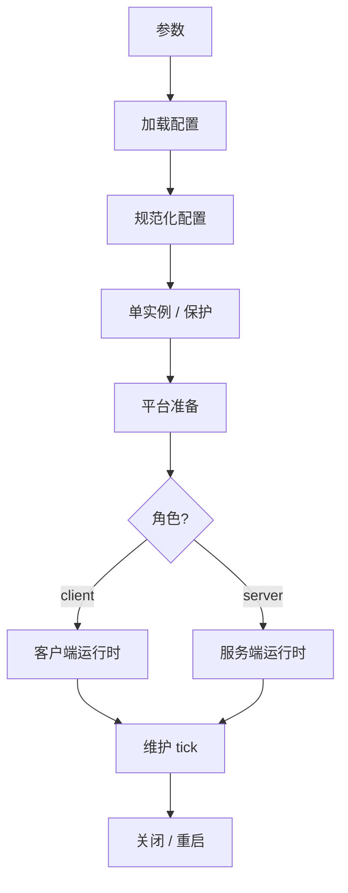
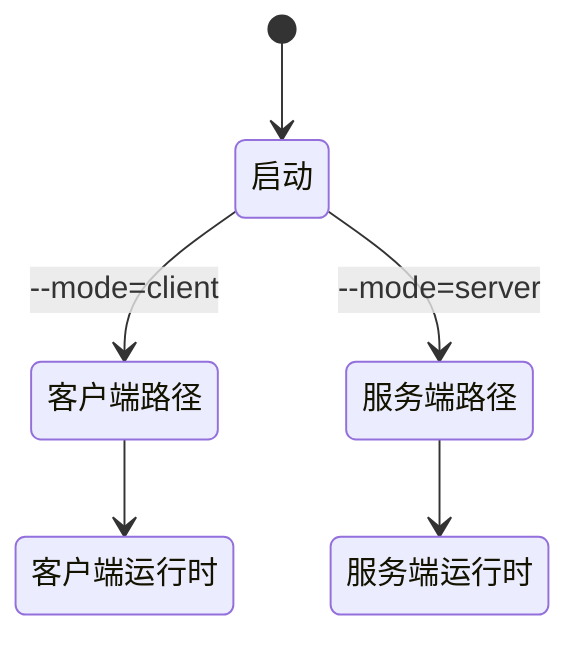

# 启动、进程所有权与生命周期控制

[English Version](STARTUP_AND_LIFECYCLE.md)

## 范围

本文解释 `ppp` 如何启动、进程所有权如何划分、client 和 server 如何分流，以及维护和关闭控制如何工作。

## 为什么启动很重要

OPENPPP2 的启动不是单纯“读配置然后跑”。它必须同时处理权限校验、单实例保护、配置加载、本地宿主整形、平台准备、角色选择、运行时启动、维护和关闭/重启控制。

## 进程所有者

`PppApplication` 是进程所有者。它协调配置、网络整形、运行时创建、统计、定时器和生命周期控制。

## 启动流水线

1. 参数准备
2. 配置加载
3. 配置规范化
4. 单实例检查
5. 平台准备
6. 角色选择
7. 运行时创建
8. tick loop
9. 关闭

## 环境准备

启动阶段会先准备本机状态，再进入角色相关运行时。这里包括 CLI 整形出的网络输入和平台特定准备。

这一步很重要，因为运行时不是纯内存逻辑。它会改变路由、DNS、适配器、防火墙以及平台特定的网络落点。

## 角色选择

client 和 server 很早就分流：

- client 创建虚拟网卡路径和 client switcher
- server 创建监听状态和 server switcher

## 生命周期控制

tick loop 负责周期性维护。重启和关闭是进程级控制，不是单个连接的副作用。

这意味着连接失败不会自动打断整个进程生命周期。进程仍然是外层边界。

## 所有权模型

| 层级 | 所有者 |
|---|---|
| 进程 | `PppApplication` |
| 环境 | switchers |
| 会话 | exchangers |
| 连接 | `ITransmission` |

## 相关文档

- `ARCHITECTURE_CN.md`
- `CLIENT_ARCHITECTURE_CN.md`
- `SERVER_ARCHITECTURE_CN.md`
- `SOURCE_READING_GUIDE_CN.md`
