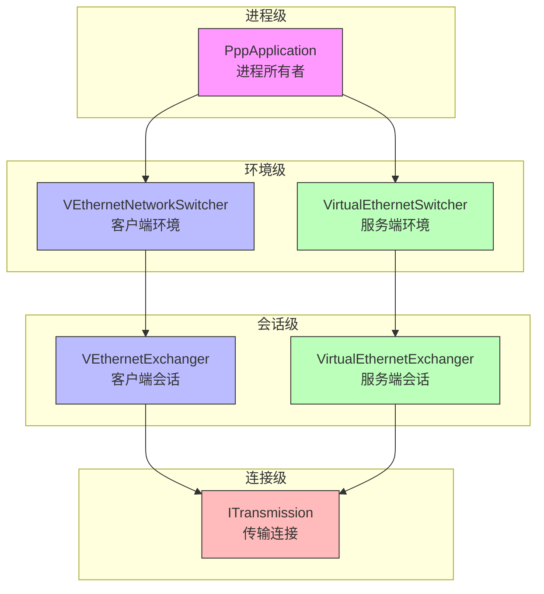
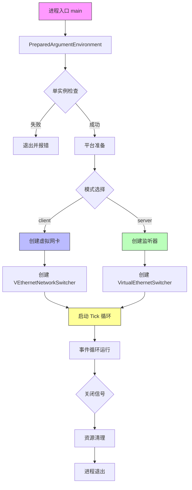
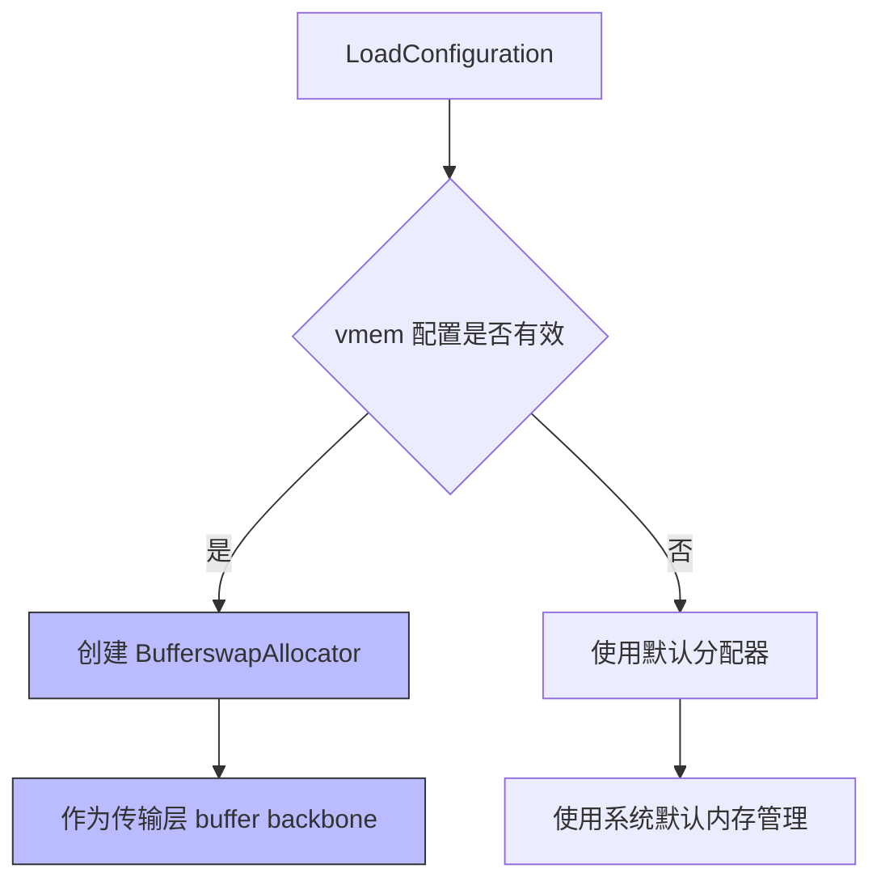
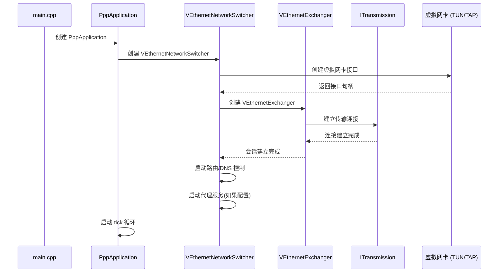
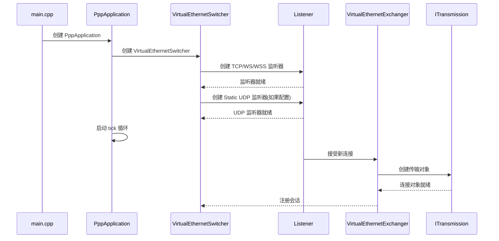
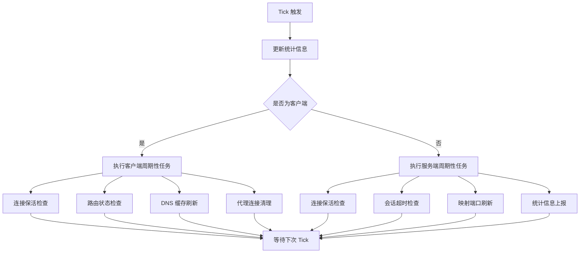
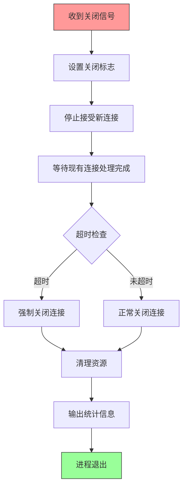

# 启动、进程所有权与生命周期控制

[English Version](STARTUP_AND_LIFECYCLE.md)

## 文档范围

本文档解释 `ppp` 进程如何启动、主要运行时对象的所有权如何划分、client 与 server 分支如何分流、周期性维护如何工作、关闭与重启控制如何实现。核心实现主要来自 `main.cpp`，配合 client/server switcher 与 transmission 子系统一起理解。如果想把这个工程当成一个真正的系统而不是一堆散乱类来理解，这份文档非常关键。

OPENPPP2 作为虚拟以太网基础设施产品，其启动过程远比简单的“读配置、开 socket、进事件循环”复杂。它需要同时解决权限校验、单实例保护、配置加载与规范化、通过 CLI 做本地 network-interface shaping、平台相关环境准备、客户端侧虚拟网卡创建或服务端侧监听器创建、周期性维护调度、重启与关闭控制等多个维度的问题。

## 为什么启动过程在 OPENPPP2 里如此重要

在很多小型工具里，启动过程可以被简化成“读配置、开 socket、进事件循环”。但在 OPENPPP2 中完全不够，因为这是一个跨平台的网络基础设施运行时。

OPENPPP2 的启动必须同时解决以下问题：

| 启动需求 | 说明 | 关键源码位置 |
|----------|------|--------------|
| 权限校验 | 验证运行权限，确保有足够权限创建虚拟网卡或绑定端口 | `main.cpp` 入口 |
| 单实例保护 | 防止同一机器上运行多个实例导致端口冲突 | `main.cpp` 单实例检测 |
| 配置加载与规范化 | 将 JSON 配置和命令行参数规范化为运行时模型 | `LoadConfiguration()`, `AppConfiguration.*` |
| 本地网络整形 | 通过 CLI 参数对本地网络接口进行整形 | `GetNetworkInterface()` |
| 平台环境准备 | 各平台特定的环境准备工作 | `PreparedLoopbackEnvironment()` |
| 虚拟网卡创建 | 客户端需要创建虚拟网卡接口 | `VEthernetNetworkSwitcher.*` |
| 服务端监听器创建 | 服务端需要创建多种协议的监听器 | `VirtualEthernetSwitcher.*` |
| 周期性维护调度 | tick 循环执行各类周期性任务 | `PppApplication::tick()` |
| 重启与关闭控制 | 优雅关闭和自动重启机制 | `PppApplication` 生命周期管理 |

这意味着启动不是一个可忽略的前言，而是把工程从“代码”真正落成“基础设施节点”的关键步骤。

## `PppApplication` 作为进程所有者

`PppApplication` 是最顶层的进程生命周期所有者，是整个运行时的大脑和协调中心。它拥有或协调以下核心组件：

### 主要职责

| 职责 | 说明 | 对应源码 |
|------|------|----------|
| 配置管理 | 持有已加载的 `AppConfiguration` | `PppApplication::configuration_` |
| 网络整形 | 持有已解析的 `NetworkInterface` 本地整形对象 | `PppApplication::interface_` |
| 运行时创建 | 创建 client runtime 或 server runtime 对象 | `PppApplication::CreateClient()`, `CreateServer()` |
| 状态快照 | 持有 transmission statistics 快照 | `PppApplication::statistics_` |
| 定时调度 | 管理 tick timer 生命周期 | `PppApplication::timer_` |
| 生命周期控制 | 管理重启与关闭行为 | `PppApplication::Restart()`, `Shutdown()` |

### 心智模型

理解 OPENPPP2 运行时对象层次结构的最好方式，是建立一个清晰的心智模型：

| 对象层级 | 负责内容 | 关键类型 |
|----------|----------|----------|
| 进程级 | 进程生命周期管理 | `PppApplication` |
| 环境级 | 虚拟网卡/监听器生命周期 | `*Switcher` |
| 会话级 | 远端连接生命周期 | `*Exchanger` |
| 连接级 | 传输连接生命周期 | `ITransmission` |

这种分层设计使得每层的职责边界清晰，便于维护和扩展。只要这条边界不丢，代码会清晰很多。

## 高层启动流水线

启动路径最好被理解成一条流水线，每个步骤都建立在前一个步骤的基础之上：

### 流水线各阶段详解

#### 第一阶段：参数准备与配置加载

`PreparedArgumentEnvironment(...)` 是第一道重要准备函数，执行以下操作：

| 步骤 | 操作 | 说明 |
|------|------|------|
| 1 | 设置 socket flash TOS | 根据 `--tun-flash` 参数设置 Type of Service |
| 2 | help 命令检查 | 如果输入的是 help 命令则提前结束 |
| 3 | 加载配置文件 | 读取 `appsettings.json` 或指定配置文件 |
| 4 | 模式决定 | 根据配置或命令行参数决定 client 或 server |
| 5 | 线程池调整 | 根据 `configuration->concurrent` 调整 executor 行为 |
| 6 | 网络参数解析 | 解析本地 network-interface shaping 参数 |
| 7 | 保存状态 | 把配置路径、配置对象、网络接口对象保存到 `PppApplication` |
| 8 | DNS helper | 根据配置设置 DNS helper 状态 |

它之所以重要，是因为后续大部分启动行为都依赖这里建立出的进程级状态。

#### 第二阶段：单实例保护

单实例保护是防止同一台机器上运行多个 OPENPPP2 实例导致端口冲突和网络混乱的关键机制：

| 检查方式 | 说明 |
|----------|------|
| 命名 mutex | 使用系统级命名 mutex 确保只有一个实例运行 |
| 端口检查 | 检查默认端口是否已被占用 |
| 错误处理 | 如果检测到已有实例，优雅退出并报错 |

#### 第三阶段：平台准备

`PreparedLoopbackEnvironment(...)` 是从“通用启动”走向“环境级运行时落地”的桥梁。在真正进入 client 或 server 分支前，它会做一些跨分支的平台准备工作：

| 平台 | 准备内容 |
|------|----------|
| Windows | 配置 firewall application rules、LSP 相关准备 |
| Linux | 内核参数检查、路由表初始化 |
| macOS | 网络接口初始化、权限检查 |
| Android | VPN Service 权限处理 |

#### 第四阶段：角色选择与对象创建

角色必须很早决定，因为后面太多逻辑都依赖它。client 和 server 在以下方面完全不同：

| 维度 | client | server |
|------|--------|--------|
| 所需平台准备 | 创建虚拟网卡 | 创建监听器 |
| 虚拟对象创建路径 | `VEthernetNetworkSwitcher` | `VirtualEthernetSwitcher` |
| 运行对象构造 | `VEthernetExchanger` | `VirtualEthernetExchanger` |
| 周期性任务 | 路由/DNS 维护、代理服务 | 连接管理、映射暴露 |
| 重启与故障处理 | 重连机制 | 会话恢复 |

## 配置加载与规范化

### `LoadConfiguration` 的作用

`LoadConfiguration(...)` 的意义不仅是找到一个配置文件。它还决定是否基于 `vmem` 创建自定义 `BufferswapAllocator`：

如果 `vmem` 块有效，且构造出的 allocator 有效，那么后续传输和包处理大量路径都会以它为 buffer backbone。因此，启动阶段不只是读策略，也在决定内存行为基础设施。

### 配置参数分类

OPENPPP2 的配置参数可以分为以下几类：

| 类别 | 参数示例 | 影响范围 |
|------|----------|----------|
| 全局配置 | `concurrent`, `cdn` | 整个运行时 |
| 加密配置 | `key.*`, `protocol`, `transport` | 传输层 |
| 网络配置 | `tcp.*`, `udp.*`, `mux.*` | 网络连接 |
| 服务端配置 | `server.listen.*`, `server.backend` | 服务端运行时 |
| 客户端配置 | `client.server`, `client.guid` | 客户端运行时 |
| 虚拟网卡 | `tun-ip`, `tun-gw`, `tun-mask` | 虚拟接口 |
| 路由与 DNS | `bypass`, `dns-rules`, `vbgp` | 路由策略 |
| Static 与 MUX | `static.*`, `mux.*` | 数据平面 |

## NetworkInterface 本次启动的本地整形状态

`GetNetworkInterface(...)` 返回的对象不是长期配置模型，它是“本次启动的本地整形模型”。这个设计避免了把“长期节点策略”和“这台机器这次启动的本地环境整形”混成一件事。

### NetworkInterface 包含的内容

| 字段 | 类型 | 说明 |
|------|------|------|
| dns_ | string | 本地 DNS 地址 |
| preferred_nic_ | string | 首选物理网卡 |
| preferred_ngw_ | string | 首选网关 |
| tunnel_ip_ | string | 隧道 IP 地址 |
| tunnel_gw_ | string | 隧道网关 |
| tunnel_mask_ | string | 隧道子网掩码 |
| tunnel_name_ | string | 虚拟网卡名称 |
| static_mode_ | bool | 是否启用 static 模式 |
| host_network_ | bool | 是否作为首选网络 |
| mux_ | int | MUX 连接数 |
| mux_acceleration_ | int | MUX 加速模式 |
| bypass_file_ | string | bypass 列表文件路径 |
| dns_rules_file_ | string | DNS 规则文件路径 |
| firewall_rules_file_ | string | 防火墙规则文件路径 |
| linux_route_protect_ | bool | Linux 路由保护 |
| linux_ssmt_ | int | Linux SSMT 线程数 |
| windows_lease_time_ | int | Windows DHCP 租约时间 |
| windows_http_proxy_ | bool | Windows 系统 HTTP 代理 |

## 客户端启动流程

### 客户端模式启动序列

### 客户端核心组件创建

客户端启动时按顺序创建以下核心组件：

| 顺序 | 组件 | 职责 |
|------|------|------|
| 1 | 虚拟网卡 | 创建 TUN/TAP 接口，分配 IP 和路由 |
| 2 | VEthernetNetworkSwitcher | 管理虚拟网卡、控制路由/DNS、流量分类 |
| 3 | VEthernetExchanger | 建立并维护与服务端的连接 |
| 4 | 代理服务 | 如果配置了 HTTP/SOCKS 代理，启动代理服务 |
| 5 | static 路径 | 如果启用了 static 模式，创建 UDP 端口 |

### 客户端关键参数

| 参数 | 说明 | 默认值 |
|------|------|--------|
| `--mode=client` | 指定运行模式为客户端 | server |
| `--tun` | 虚拟网卡名称 | 平台相关 |
| `--tun-ip` | 虚拟网卡 IP | 10.0.0.2 |
| `--tun-gw` | 虚拟网卡网关 | 10.0.0.1 |
| `--tun-mask` | 子网掩码位数 | 30 |
| `--server` | 服务器地址 | 必需 |
| `--guid` | 客户端唯一标识 | 自动生成 |

## 服务端启动流程

### 服务端模式启动序列

### 服务端核心组件创建

服务端启动时按顺序创建以下核心组件：

| 顺序 | 组件 | 职责 |
|------|------|------|
| 1 | VirtualEthernetSwitcher | 管理服务端环境、接受连接 |
| 2 | TCP Listener | 监听 PPP 协议连接 (默认 20000) |
| 3 | WS Listener | 监听 WebSocket 连接 (默认 20080) |
| 4 | WSS Listener | 监听 WSS 连接 (默认 20443) |
| 5 | Static UDP | 如果启用，创建 static UDP 端口 |
| 6 | Mapping Port | 如果配置了端口映射，创建映射端口 |
| 7 | Namespace Cache | 如果启用，创建命名空间缓存 |

### 服务端关键参数

| 参数 | 说明 | 默认值 |
|------|------|--------|
| `--mode=server` | 指定运行模式为服务端 | - |
| `--firewall-rules` | 防火墙规则文件 | 可选 |
| `server.listen.tcp` | TCP 监听端口 | 20000 |
| `server.listen.ws` | WebSocket 端口 | 20080 |
| `server.listen.wss` | WSS 端口 | 20443 |
| `server.backend` | 管理后端地址 | 可选 |

## Tick 循环与周期性维护

### Tick 机制概述

启动完成后，系统进入 tick 循环执行各类周期性任务。这是 OPENPPP2 实现各类后台维护的核心机制：

### 客户端周期性任务

| 任务 | 周期 | 说明 |
|------|------|------|
| 连接保活 | 60 秒 | 发送 keepalive 包维持连接 |
| 路由状态检查 | 30 秒 | 检查路由是否需要更新 |
| DNS 缓存刷新 | 60 秒 | 刷新 DNS 缓存 |
| 代理连接清理 | 30 秒 | 清理超时代理连接 |
| 统计信息输出 | 10 秒 | 输出流量统计 |

### 服务端周期性任务

| 任务 | 周期 | 说明 |
|------|------|------|
| 连接保活 | 60 秒 | 发送 keepalive 包维持连接 |
| 会话超时检查 | 30 秒 | 检查并清理超时会话 |
| 映射端口刷新 | 60 秒 | 刷新端口映射状态 |
| 统计信息输出 | 10 秒 | 输出流量统计 |
| 后端同步 | 60 秒 |与管理后端同步状态 |

## 关闭与重启控制

### 优雅关闭流程

### 关闭标志位

| 标志 | 说明 |
|------|------|
| `disposed_` | 主关闭标志 |
| `closing_` | 正在关闭中 |
| `force_shutdown_` | 强制关闭标志 |

### 重启机制

OPENPPP2 支持自动重启机制，可通过以下方式配置：

| 参数 | 说明 | 默认值 |
|------|------|--------|
| `--auto-restart` | 自动重启间隔（秒） | 0（禁用） |

当启用自动重启时，系统会在指定时间间隔后自动重启，用于故障恢复或配置重载场景。

### 资源清理顺序

关闭时按以下顺序清理资源：

| 顺序 | 清理内容 |
|------|----------|
| 1 | 停止 tick 循环 |
| 2 | 关闭所有客户端连接 |
| 3 | 关闭所有服务端监听器 |
| 4 | 清理虚拟网卡（客户端） |
| 5 | 清理路由和 DNS 变更 |
| 6 | 清理代理服务 |
| 7 | 清理 MUX 连接 |
| 8 | 释放配置内存 |

## 异常处理与故障恢复

### 客户端异常处理

| 异常类型 | 处理方式 |
|----------|----------|
| 连接断开 | 自动重连，指数退避 |
| 虚拟网卡错误 | 尝试重新创建 |
| DNS 解析失败 | 使用备用 DNS |
| 代理服务错误 | 重启代理服务 |

### 服务端异常处理

| 异常类型 | 处理方式 |
|----------|----------|
| 监听端口冲突 | 尝试备用端口 |
| 会话错误 | 关闭并清理会话 |
| 后端通信失败 | 降级运行，保留本地策略 |
| 内存不足 | 拒绝新连接，清理空闲会话 |

## 平台差异化启动

### Windows 平台

| 准备内容 | 说明 |
|----------|------|
| Firewall 规则 | 配置 Windows 防火墙放行规则 |
| LSP 准备 | PaperAirplane 相关准备 |
| 网络适配器 | 创建 TAP 适配器 |
| DHCP 租约 | 配置 IP 租约时间 |

### Linux 平台

| 准备内容 | 说明 |
|----------|------|
| TUN/TAP 加载 | 检查并加载 tun 模块 |
| 路由表权限 | 检查路由表修改权限 |
| 网络命名空间 | 支持网络命名空间 |
| 路由保护 | 可选的路由保护 |

### macOS 平台

| 准备内容 | 说明 |
|----------|------|
| utun 接口 | 创建 utun 虚拟接口 |
| 权限检查 | 检查网络权限 |
| 混杂模式 | 可选启用混杂模式 |

### Android 平台

| 准备内容 | 说明 |
|----------|------|
| VPN Service | 使用 Android VPN API |
| 权限处理 | 处理 VPN 权限请求 |
| 网络接口 | 创建 TUN 接口 |

## 启动性能考量

### 启动时间分解

| 阶段 | 预期时间 | 优化建议 |
|------|----------|----------|
| 配置加载 | < 100ms | 配置文件尽量小 |
| 虚拟网卡创建 | 100-500ms | 平台相关 |
| 连接建立 | 100-2000ms | 网络相关 |
| 路由配置 | < 100ms | 路由规则尽量少 |

### 并发配置影响

`concurrent` 参数对启动性能有显著影响：

| concurrent 值 | 适用场景 | 线程池配置 |
|----------------|----------|------------|
| 1 | 单核环境 | 单线程执行器 |
| 默认 (1) | 常规客户端 | 标准线程池 |
| > 1 | 多核服务器 | 多线程执行器 |

## 总结

理解 OPENPPP2 的启动和生命周期需要把握以下核心要点：

1. **统一入口**：一个二进制支持 client/server 两种角色，通过 `PppApplication` 统一管理
2. **配置即基础设施**：配置加载不只是读文件，还决定内存分配策略
3. **分层对象模型**：进程级、环境级、会话级、连接级的清晰分离
4. **平台差异**：不同平台有各自的环境准备需求
5. **Tick 驱动**：周期性任务通过 tick 循环统一调度
6. **优雅关闭**：关闭过程有完整的资源清理机制

理解这些原则对于正确部署和维护 OPENPPP2 至关重要。

## 相关文档

| 文档 | 说明 |
|------|------|
| [ARCHITECTURE_CN.md](ARCHITECTURE_CN.md) | 系统架构总览 |
| [CLIENT_ARCHITECTURE_CN.md](CLIENT_ARCHITECTURE_CN.md) | 客户端运行时架构 |
| [SERVER_ARCHITECTURE_CN.md](SERVER_ARCHITECTURE_CN.md) | 服务端运行时架构 |
| [CONFIGURATION_CN.md](CONFIGURATION_CN.md) | 配置模型与参数字典 |
| [PLATFORMS_CN.md](PLATFORMS_CN.md) | 平台支持与差异 |
