# 启动、进程所有权与生命周期控制

[English Version](STARTUP_AND_LIFECYCLE.md)

## 范围

本文解释 `ppp` 如何启动、进程所有权如何划分、client 和 server 如何分流，以及维护和关闭控制如何工作。

## 为什么启动很重要

OPENPPP2 的启动不是单纯“读配置然后跑”。它必须同时处理权限校验、单实例保护、配置加载、本地宿主整形、平台准备、角色选择、运行时启动、维护和关闭/重启控制。

## 进程所有者

`PppApplication` 是进程所有者。它协调配置、网络整形、运行时创建、统计、定时器和生命周期控制。

## 启动流水线

1. 参数准备
2. 配置加载
3. 配置规范化
4. 单实例检查
5. 平台准备
6. 角色选择
7. 运行时创建
8. tick loop
9. 关闭

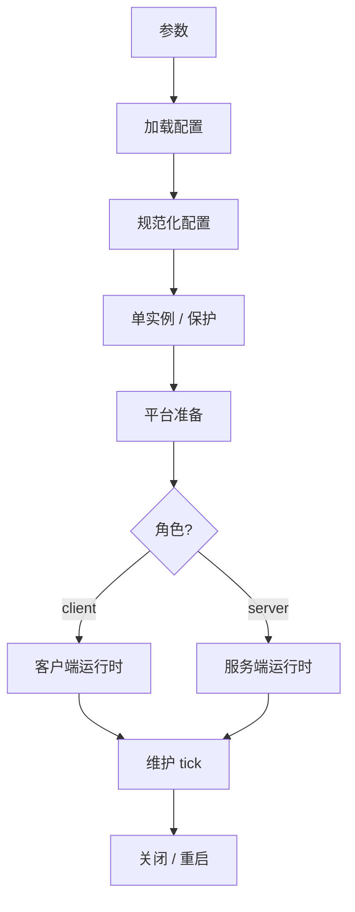

## 环境准备

启动阶段会先准备本机状态，再进入角色相关运行时。这里包括 CLI 整形出的网络输入和平台特定准备。

这一步很重要，因为运行时不是纯内存逻辑。它会改变路由、DNS、适配器、防火墙以及平台特定的网络落点。

## 角色选择

client 和 server 很早就分流：

- client 创建虚拟网卡路径和 client switcher
- server 创建监听状态和 server switcher

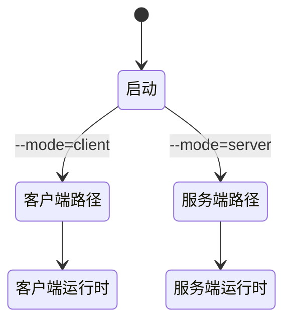

## 生命周期控制

tick loop 负责周期性维护。重启和关闭是进程级控制，不是单个连接的副作用。

这些进程级定时器不负责传输握手重试或客户端侧 SYN/ACK 重新注入；那属于客户端虚拟网络栈路径。

这意味着连接失败不会自动打断整个进程生命周期。进程仍然是外层边界。

## 启动窗口内的错误处理器注册

`RegisterErrorHandler` 现为 key-based，建议在启动初始化窗口内完成：

- 每个注册点使用稳定 key；
- 传入空 handler 表示移除该 key 的注册；
- 在多线程运行分支启动前完成所有注册变更。

注册表变更被视为初始化阶段工作。运行期诊断派发对读路径是线程安全的，但 worker 活跃时的注册抖动不属于支持契约。

API 细节见 `ERROR_HANDLING_API_CN.md`。

## 生命周期阶段的诊断传播要求

对每个生命周期阶段（加载、规范化、准备、打开、tick 维护、释放/回滚）：

- 失败返回应携带诊断码，而不只是哨兵值；
- Console UI 状态面板消费进程级诊断快照 API；
- 生命周期排障应先看诊断时间线，再映射到子系统日志。

该策略可在失败发生于 worker 线程时，仍保持启动与关闭排障的确定性。

## Android 生命周期同步说明

Android bridge 生命周期（`run`、`stop`、release 路径）应与核心生命周期语义保持一致：

- app 未初始化、未运行等状态，在 JNI 与核心诊断中保持一致映射；
- release/cleanup 失败要返回稳定语义，便于 managed 调用方可靠处理。

## 所有权模型

| 层级 | 所有者 |
|---|---|
| 进程 | `PppApplication` |
| 环境 | switchers |
| 会话 | exchangers |
| 连接 | `ITransmission` |

---

## 详细初始化流程（ApplicationInitialize.cpp）

### 入口链路

进程从 `main()`（`main.cpp`）开始，获取 `PppApplication` 单例并调用 `Run()`。`Run()` 准备参数后进入 `Main()`，执行完整初始化流水线：

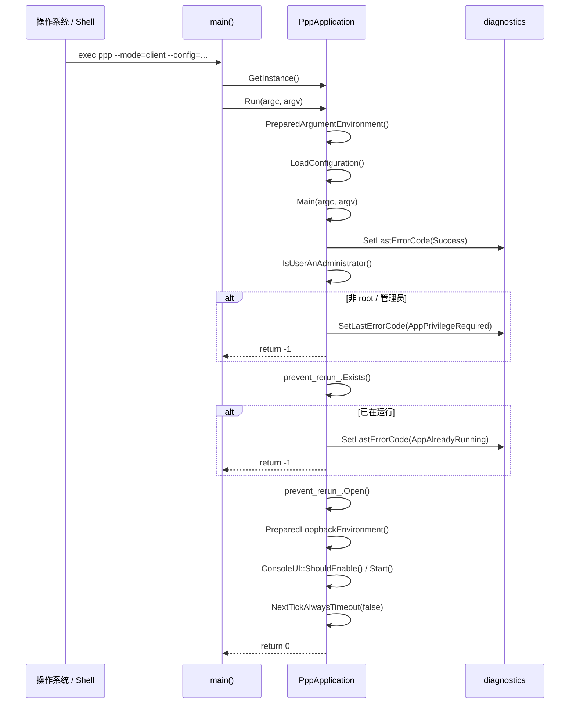

### `Main()` 各步骤与错误码

每个步骤失败时均对应具体错误码：

| 步骤 | 操作 | 失败错误码 |
|---|---|---|
| 1 | `SetLastErrorCode(Success)` — 重置诊断 | — |
| 2 | `IsUserAnAdministrator()` — 权限检查 | `AppPrivilegeRequired` |
| 3 | `prevent_rerun_.Exists()` — 单实例检查 | `AppAlreadyRunning` |
| 4 | `prevent_rerun_.Open()` — 获取锁 | `AppLockAcquireFailed` |
| 5 | `Windows_PreparedEthernetEnvironment()`（仅 Windows 客户端） | `NetworkInterfaceConfigureFailed` |
| 6 | `PreparedLoopbackEnvironment()` — TAP + Switcher 打开 | `AppPreflightCheckFailed`（或内部错误码） |
| 7 | `NextTickAlwaysTimeout(false)` — 启动 tick 定时器 | `RuntimeTimerStartFailed` |

### 构造函数：控制台与平台初始化

`PppApplication::PppApplication()` 在参数处理前执行：

- 所有平台均调用 `ppp::HideConsoleCursor(true)` 隐藏终端光标（TUI 渲染期间）。
- Windows 专属：设置控制台标题为 `"PPP PRIVATE NETWORK™ 2"`，调整缓冲区为 120×46（Windows 11）或 120×47（旧版），并通过 `EnabledConsoleWindowClosedButton(false)` 禁用关闭按钮。

### 客户端初始化：`PreparedLoopbackEnvironment()` — 客户端路径

客户端初始化采用单一事务性 `do { ... } while (false)` 块，任何失败均跳出至集中清理：

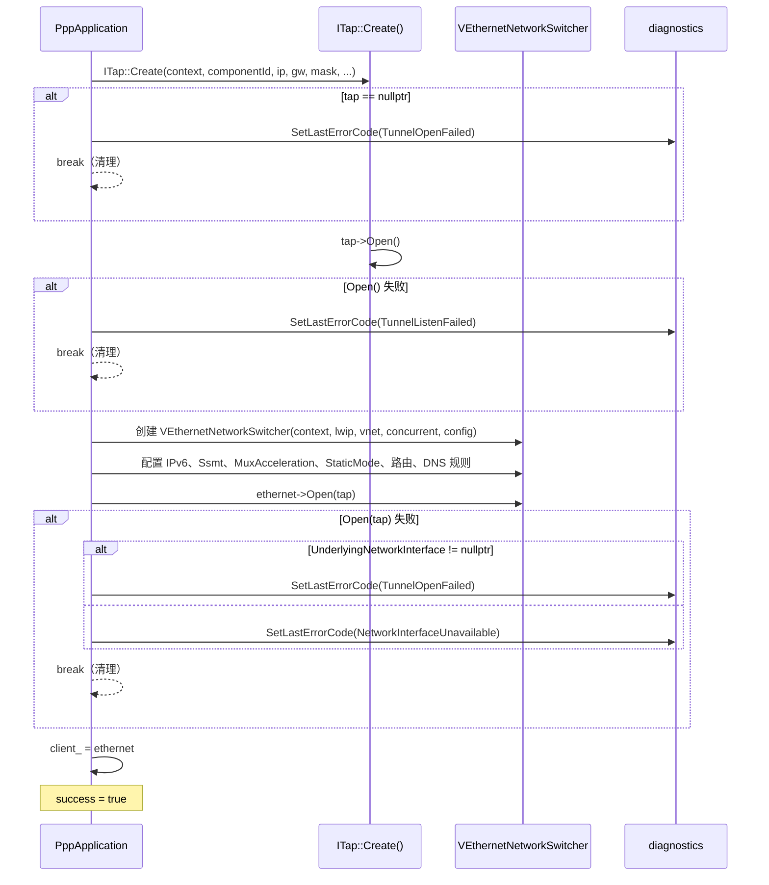

`ITap::Create()` 平台签名差异：

- **Windows**：`Create(context, componentId, ip, gw, mask, leaseTimeInSeconds, hostedNetwork, dnsAddresses)`
- **POSIX（Linux/macOS/Android）**：`Create(context, componentId, ip, gw, mask, promisc, hostedNetwork, dnsAddresses)`

Linux 专属客户端选项（设置在 `VEthernetNetworkSwitcher` 上）：

- `Ssmt()` — 多队列 TUN 多线程
- `SsmtMQ()` — SSMT 消息队列变体
- `ProtectMode()` — 绕行路由 socket 保护

### 服务端初始化：`PreparedLoopbackEnvironment()` — 服务端路径

服务端初始化与客户端显著不同——**不创建 TAP 适配器**：

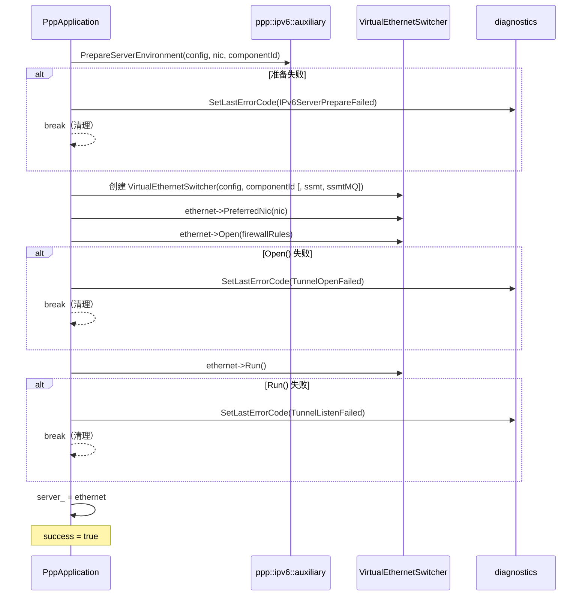

失败时，`ppp::ipv6::auxiliary::FinalizeServerEnvironment()` 始终被调用，回滚已变更的宿主 IPv6 状态。

### 初始化后：TUI 与 Tick 循环

`PreparedLoopbackEnvironment()` 成功后：

1. **TUI 检测**：`ConsoleUI::ShouldEnable()` 检查 `isatty(stdout)`；若 stdout 为管道或重定向文件，跳过全屏 TUI，改为打印纯文本启动摘要。
2. **TUI 启动**：`ConsoleUI::Start()` 尝试启动渲染线程和输入线程；若在 tty 已通过检测后仍启动失败，则退回纯文本模式，并发布 `RuntimeOptionalUiStartFailed`。
3. **统计重置**：`stopwatch_.Restart()` 和 `transmission_statistics_.Clear()` 标记运行时计量起点。
4. **QUIC 切换**（仅 Windows 客户端）：根据 `--blockQUIC` 配置调用 `HttpProxy::SetSupportExperimentalQuicProtocol()`。
5. **VIRR / VBGP 标志**：从 CLI 参数 `--virr`、`--vbgp` 读取并存入全局原子变量，供路由子系统使用。
6. **自动重启**：`--auto-restart` 和 `--link-restart` 解析并存入 `GLOBAL_`。
7. **Tick 定时器**：`NextTickAlwaysTimeout(false)` 激活周期性维护定时器；失败时设置 `RuntimeTimerStartFailed` 并调用 `Dispose()`。

---

## 应用程序完整生命周期状态图

```mermaid
stateDiagram-v2
    [*] --> 已构造 : PppApplication()
    已构造 --> 参数已准备 : PreparedArgumentEnvironment()
    参数已准备 --> 配置已加载 : LoadConfiguration()
    配置已加载 --> 权限已验证 : IsUserAnAdministrator()
    权限已验证 --> [*] : 失败 → AppPrivilegeRequired
    权限已验证 --> 单实例已保护 : prevent_rerun_.Open()
    单实例已保护 --> [*] : 失败 → AppAlreadyRunning / AppLockAcquireFailed

    单实例已保护 --> 驱动预检完成 : Windows TAP 驱动检查（仅客户端）
    驱动预检完成 --> [*] : 失败 → NetworkInterfaceConfigureFailed

    单实例已保护 --> 回环环境就绪 : PreparedLoopbackEnvironment()
    驱动预检完成 --> 回环环境就绪 : PreparedLoopbackEnvironment()
    回环环境就绪 --> [*] : 失败 → TunnelOpenFailed / TunnelListenFailed / NetworkInterfaceUnavailable

    回环环境就绪 --> TUI已启动 : ConsoleUI::Start() 或纯文本回退
    TUI已启动 --> Tick运行中 : NextTickAlwaysTimeout(false)
    Tick运行中 --> [*] : 失败 → RuntimeTimerStartFailed

    Tick运行中 --> 运行中 : OnTick() 循环激活

    运行中 --> 运行中 : 周期性 OnTick()
    运行中 --> 关闭中 : OnShutdownApplication() / 信号
    运行中 --> 重启中 : ShutdownApplication(restart=true)

    关闭中 --> 已释放 : Dispose() + Release()
    重启中 --> 已释放 : Dispose() + Release()
    已释放 --> [*]
```

### 客户端详细启动时序

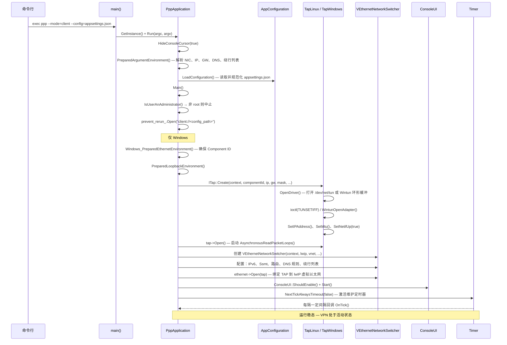

### 服务端详细启动时序

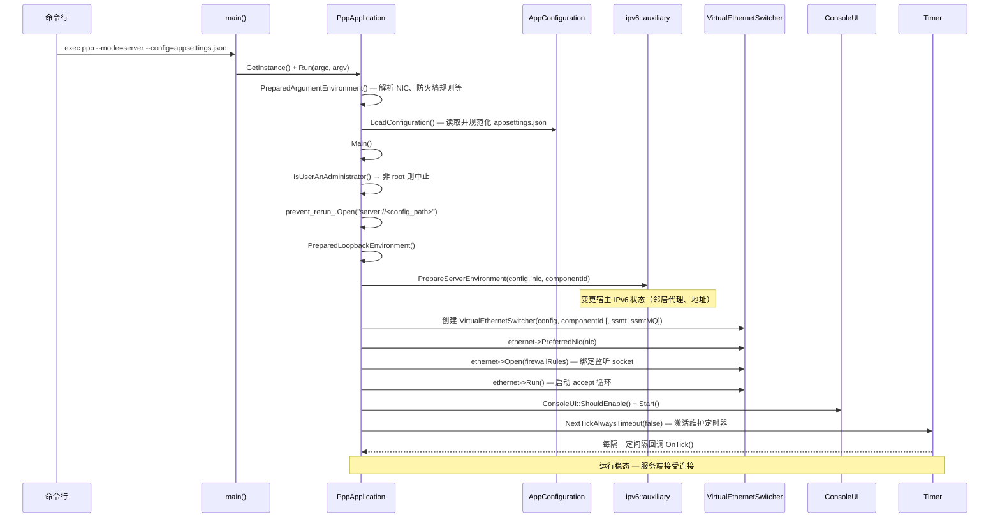

---

---

## Tick 循环详解

### NextTickAlwaysTimeout 与 OnTick

`NextTickAlwaysTimeout(bool immediately)` 启动一个 Boost.Asio `deadline_timer`，超时时间来自配置中的 `tcp.inactive.timeout`（或内部常量）。超时触发时，调用 `OnTick()`。`OnTick()` 执行以下周期性任务：

1. **统计刷新**：更新 `transmission_statistics_` 并刷新 TUI 状态面板。
2. **连接状态检查**：客户端检查与服务端的隧道连接是否存活，若丢失则触发重连逻辑。
3. **会话老化**：服务端遍历活跃 exchanger 映射，移除超时或已关闭的会话。
4. **IPv6 路由老化**：服务端检查 IPv6 租约池，过期的条目被回收。
5. **TUI 刷新**：若 `ConsoleUI` 启用，向渲染线程发布脏标志以触发 UI 重绘。
6. **再次调度**：`OnTick()` 末尾无条件调用 `NextTickAlwaysTimeout(false)` 以保证周期性调用不断链。

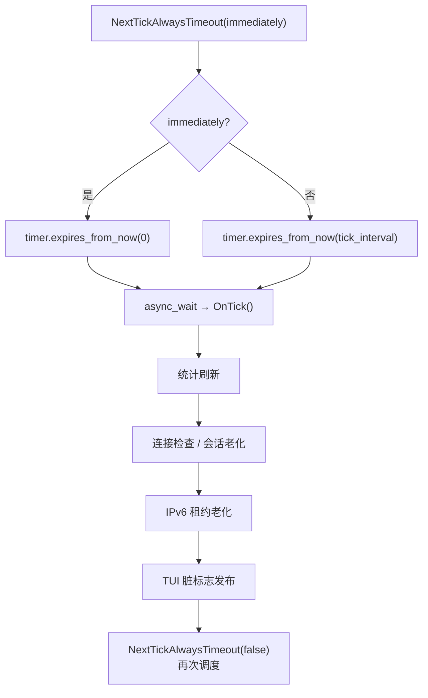

### 自动重启（--auto-restart）

`--auto-restart` 标志激活后，客户端在隧道断开时不会直接退出，而是：

1. 调用 `VEthernetNetworkSwitcher::Dispose()` 拆除当前运行时。
2. 回滚路由与 DNS 变更（Linux：清除 iptables 规则、路由表条目；Windows：删除 TAP 适配器路由）。
3. 等待 `restart_delay`（可配置，默认 3 秒）。
4. 重新执行 `PreparedLoopbackEnvironment()`，重建 TAP 和 Switcher。
5. 调用 `NextTickAlwaysTimeout(true)` 立即触发首次 tick，使重连尽快启动。

若重连次数超过 `max_restart_count`（若有），进程最终以 `AppRestartFailed` 退出。

### --link-restart（链路级重启）

`--link-restart` 与 `--auto-restart` 的区别：

| 标志 | 触发条件 | 重建范围 |
|------|---------|---------|
| `--auto-restart` | 隧道连接丢失 | 完整运行时（TAP + Switcher）|
| `--link-restart` | 底层 TCP/WS 链路断开 | 仅重建传输层（保留 Switcher）|

`--link-restart` 下，`VEthernetNetworkSwitcher` 本身不被销毁，只有 `ITransmission` 被释放并重新建立。这使重连窗口内本地虚拟网络状态（路由表、DNS、IPv6 分配）保持不变，减少重连期间的网络中断时长。

---

## 关闭与清理流程

### 正常关闭路径

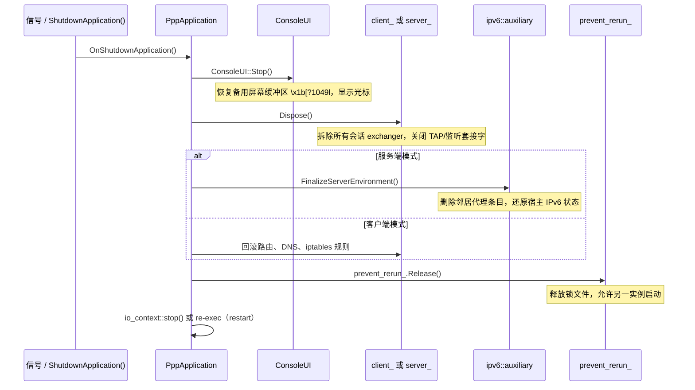

### 关闭期间的会话排空

`Dispose()` 不粗暴地中断所有协程。它设置 `disposed_` 原子标志，然后取消所有定时器和套接字。已投递在 strand 上的处理器仍会被执行（但检测到 `disposed_` 后立即返回），保证 `shared_ptr` 引用计数最终归零，确保内存正确释放而不产生悬空引用。

此"软关闭"设计是 EDSM 架构的直接结果：状态机的每个处理器入口均以 `disposed_` 检查作为守卫，从而实现优雅退出。

### 资源回滚顺序

服务端关闭时，资源回滚顺序如下（顺序重要）：

1. 停止 accept 循环（`VirtualEthernetSwitcher::Dispose()`）
2. 拆除所有 exchanger（会话级 `Dispose()`）
3. 清理 IPv6 邻居代理条目（`FinalizeServerEnvironment()`）
4. 回滚宿主 IPv6 转发规则（若本进程启用了 IPv6 转发）
5. 释放单实例锁

客户端关闭时：

1. 停止 lwIP 栈（`VEthernetNetworkSwitcher::Dispose()`）
2. 拆除 TAP 设备（`ITap::Dispose()`）
3. 回滚路由条目（删除通过 VPN 路由的条目）
4. 恢复 DNS（还原原始 DNS 服务器）
5. Linux：清除 iptables/nftables 规则
6. Windows：删除 TAP 适配器路由、恢复 QUIC 配置
7. 释放单实例锁

---

## 单实例保护

`prevent_rerun_` 是一个 `ppp::app::SingletonApplication` 对象（或平台等价实现）。它在以下路径创建锁文件或命名互斥锁：

- **客户端**：`"client://<config_path>"`
- **服务端**：`"server://<config_path>"`

锁在 `Main()` 初始化阶段通过 `prevent_rerun_.Open()` 获取，在 `Dispose()` 中通过 `prevent_rerun_.Release()` 释放。

**为何以 config 路径作为键**：允许同一机器上使用不同配置文件的多个 ppp 实例共存（例如一个使用 `appsettings.json`，另一个使用 `appsettings2.json`），同时防止意外的双启动。

---

## 平台专属启动差异

### Windows 客户端

Windows 客户端在 `PreparedArgumentEnvironment()` 后、`PreparedLoopbackEnvironment()` 前额外执行 `Windows_PreparedEthernetEnvironment()`：

- 通过 `TapWindows::ComponentId()` 或注册表查找 TAP/Wintun 网卡的 Component ID。
- 若 Component ID 缺失，尝试调用 `TapWindows::InstallDriver()` 安装驱动（需管理员权限）。
- 若安装失败，设置 `NetworkInterfaceConfigureFailed` 并中止。
- Windows 11 上控制台窗口尺寸设置为 120×46；旧版 Windows 为 120×47。

### Linux 客户端

Linux 客户端启动时支持额外的命令行选项：

| 选项 | 效果 |
|------|------|
| `--ssmt` | 启用 SSMT 多队列 TUN（`IFF_MULTI_QUEUE`，每 io_context 一个 fd）|
| `--ssmt-mq` | SSMT 消息队列变体 |
| `--protect-mode` | 启用绕行路由 socket 保护（防止 VPN 流量进入 VPN 隧道造成环路）|
| `--promisc` | 以混杂模式打开 TUN 设备 |

### Android 桥接

Android 不走 `ITap::Create()` 标准路径。`TapLinux::From(fd)` 接收来自 `VpnService.protect()` 后由 Java 层传入的 fd，直接包装为 TAP 设备，不打开 `/dev/net/tun`。

JNI 导出函数（`__LIBOPENPPP2__` 宏保护）对应的生命周期方法：

| JNI 函数 | 对应操作 |
|---------|---------|
| `Java_*_run` | `PppApplication::Run()` |
| `Java_*_stop` | `PppApplication::ShutdownApplication()` |
| `Java_*_getState` | 返回诊断码快照 |
| `Java_*_release` | `Dispose()` + 释放全局引用 |

Android 不使用 jemalloc（系统 libc 已内置 jemalloc，无需叠加）。

### macOS

macOS 使用 `TapDarwin`（utun 设备）。读写时需处理 4 字节地址族前缀：

- 读：剥去前 4 字节（地址族，网络字节序），才是真正的 IP 包。
- 写：在 IP 包前添加 4 字节地址族前缀。

这一差异在 `TapDarwin::OnInput()` 和 `TapDarwin::Output()` 中处理。macOS 上无法禁用关闭按钮，TUI 部分功能（光标隐藏可能失效）需容错处理。

---

## 故障诊断：启动失败速查

| 现象 | 最可能的错误码 | 排查方向 |
|------|-------------|---------|
| 进程立即退出，无任何输出 | `AppPrivilegeRequired` | 检查是否以 root/管理员运行 |
| "already running" 提示 | `AppAlreadyRunning` | 检查是否有同配置文件的进程在运行，或锁文件未清理 |
| TAP 设备打开失败 | `TunnelOpenFailed` | Linux：检查 `/dev/net/tun` 权限；Windows：检查 Wintun/TAP-Windows 驱动是否安装 |
| 监听失败（服务端） | `TunnelListenFailed` | 检查端口是否被占用，防火墙规则是否阻止 |
| 网卡不可用 | `NetworkInterfaceUnavailable` | 检查指定 NIC 名称是否正确，网卡是否存在 |
| IPv6 准备失败（服务端） | `IPv6ServerPrepareFailed` | 检查宿主机是否支持 IPv6，以及是否有相应内核模块 |
| tick 定时器启动失败 | `RuntimeTimerStartFailed` | 检查 io_context 是否正常，系统资源是否耗尽 |
| 网卡 Component ID 缺失（Windows）| `NetworkInterfaceConfigureFailed` | 手动安装 Wintun 或 TAP-Windows 驱动 |

---

## 进程所有权模型与生命周期边界

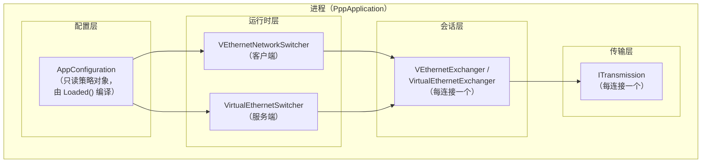

每一层的生命周期由上一层的 `Dispose()` 级联触发。`ITransmission` 的销毁触发协程恢复（携带错误），协程退出后 `shared_ptr` 引用计数归零，对象被销毁。

---

## `AppConfiguration::Loaded()` 策略编译与启动的关系

`AppConfiguration::Loaded()` 不仅是配置读取，它是一个**策略编译器**——在所有运行时对象构建之前将原始 JSON 字段转化为经过合法性验证和夹紧处理的运行时参数。启动流水线对此有强依赖：

### `Loaded()` 做什么

1. **端口夹紧**：`listen.port` 超出合法范围时夹紧至默认值 `2096`，`concurrent` 低于 1 时设为 1。
2. **带宽夹紧**：`bandwidth` 低于 0 时置零（表示不限速）。
3. **密码验证**：`key.kf`、`key.kl`、`key.kh` 超出合法枚举范围时置为默认值；`key.protocol`、`key.transport` 中的 cipher 名称若不在支持列表内，则置为空字符串（表示无加密）。
4. **超时夹紧**：`tcp.inactive.timeout`、`tcp.connect.timeout` 低于最小值时夹紧。
5. **DNS 规则加载**：若 `dns.rules` 字段有值，调用 `FirewallRule::LoadBy()` 加载规则列表；失败时设置 `ConfigDnsRuleLoadFailed`。
6. **防火墙规则加载**：同上，失败时设置 `ConfigFirewallRuleLoadFailed`。
7. **路由列表加载**：`ip.routes` 字段（可选），失败时设置 `ConfigRouteLoadFailed`。
8. **IPv6 模式验证**：检查 `ipv6.prefix`、`ipv6.gateway` 是否为合法的 IPv6 地址和前缀长度。
9. **cipher 健全检查**：若 `key.cipher_method` 指向不支持的算法，置为空（不加密），并在诊断中记录 `ConfigCipherInvalid`。

### Loaded() 失败对启动的影响

`Loaded()` 返回 `false` 时，`LoadConfiguration()` 设置对应错误码，启动流水线在 `Main()` 初期即中止：

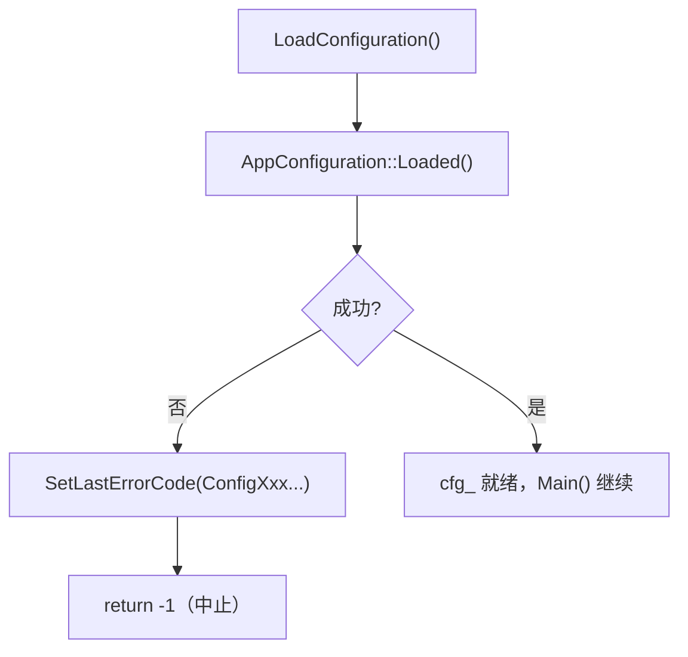

这意味着配置错误不会等到运行时才暴露，而是在参数处理阶段即被捕获。

---

## 诊断快照与 TUI 状态面板集成

进程启动后，`ConsoleUI` 每次刷新时从以下来源读取诊断信息：

| 来源 | API | 含义 |
|------|-----|------|
| 线程本地最后错误码 | `GetLastErrorCode()` | 当前线程最近的错误 |
| 全局原子发布错误码 | `GetLastErrorCodeSnapshot()` | 跨线程最近一次显著错误 |
| 错误时间戳 | `GetLastErrorTimestamp()` | 最近一次错误的毫秒时间戳 |
| 格式化字符串 | `FormatErrorString(code)` | 人类可读的描述 |

TUI 状态面板会将 `GetLastErrorCodeSnapshot()` 与 `GetLastErrorTimestamp()` 组合显示为底部状态栏的最后一行，格式类似：

```
[23:45:12.345] Last Error: ProtocolKeepAliveTimeout (0x0034)
```

这使运维人员能在不翻阅日志的情况下直观了解最近出现的问题。

---

## 配置加载失败 vs 运行时失败的区分

OPENPPP2 将失败分为两类，诊断策略不同：

**配置阶段失败**（`LoadConfiguration()` 期间）：

- 进程尚未绑定任何网络资源，无需回滚。
- `prevent_rerun_` 尚未获取，无需释放。
- 进程直接以非零退出码退出。
- 错误码范围：`ConfigXxx`、`AppXxx`。

**运行时失败**（`PreparedLoopbackEnvironment()` 之后）：

- 进程可能已获取 `prevent_rerun_` 锁。
- 可能已修改宿主路由、DNS、iptables、邻居代理。
- 必须执行完整回滚（见"资源回滚顺序"一节）。
- `prevent_rerun_.Release()` 必须在退出路径中调用。
- 错误码范围：`TunnelXxx`、`NetworkXxx`、`RuntimeXxx`、`IPv6Xxx`。

**这一区分是设计约束，不是实现细节**：任何修改启动流水线的贡献者都必须确保在正确的阶段获取和释放资源。

---

## 信号处理与优雅关闭

OPENPPP2 在初始化时注册以下平台信号处理器（通过 Boost.Asio 信号集）：

| 信号 | 平台 | 动作 |
|------|------|------|
| `SIGINT` | Linux/macOS/Android | 调用 `ShutdownApplication(restart=false)` |
| `SIGTERM` | Linux/macOS/Android | 调用 `ShutdownApplication(restart=false)` |
| `SIGHUP` | Linux/macOS | 调用 `ShutdownApplication(restart=true)`（重载配置重启）|
| `CTRL_C_EVENT` | Windows | 等同 `SIGINT` |
| `CTRL_CLOSE_EVENT` | Windows | 等同 `SIGTERM` |

信号处理器本身不执行任何复杂逻辑——它仅向默认 `io_context` 投递一个 `asio::post(ShutdownApplication)` 闭包，确保关闭流程在 IO 线程上以协程安全的方式执行。

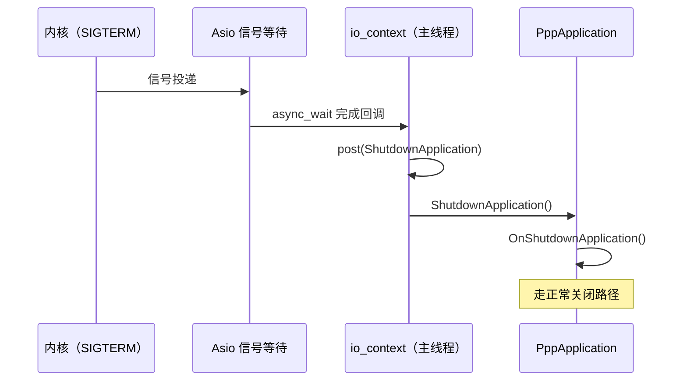

---

## 多实例场景示例

下面的示例展示同一台机器上运行两个独立的 ppp 实例：

```bash
# 实例 A：连接到服务器 A，使用配置文件 1
./ppp --mode=client --config=/etc/ppp/client-a.json

# 实例 B：连接到服务器 B，使用配置文件 2
./ppp --mode=client --config=/etc/ppp/client-b.json
```

由于锁键分别为 `"client:///etc/ppp/client-a.json"` 和 `"client:///etc/ppp/client-b.json"`，两者互不干扰。若尝试启动第三个使用 `client-a.json` 的实例，则会触发 `AppAlreadyRunning` 并退出。

服务端场景：

```bash
# 服务端 A：监听 2096 端口
./ppp --mode=server --config=/etc/ppp/server-a.json

# 服务端 B：监听 2097 端口（不同配置文件）
./ppp --mode=server --config=/etc/ppp/server-b.json
```

---

## TAP 设备生命周期与 VEthernet 绑定

TAP 设备的生命周期与 `VEthernetNetworkSwitcher` 严格绑定：

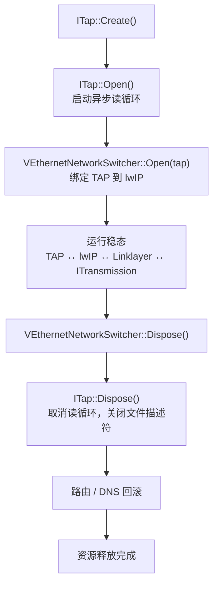

`ITap::Open()` 启动异步读循环（`AsynchronousReadPacketLoops()`），每当 TAP 文件描述符可读时，回调 `VEthernet::OnPacketInput()`。`ITap::Dispose()` 取消该循环，关闭文件描述符，并触发 lwIP 侧的拆除。

关键约束：**`ITap::Dispose()` 必须在 `VEthernetNetworkSwitcher::Dispose()` 之后调用**，以保证 lwIP 不会在 TAP 已关闭的情况下仍尝试发送数据包。

---

## 常见启动路径代码位置速查

| 操作 | 源文件 | 函数 |
|------|--------|------|
| 进程入口 | `main.cpp` | `main()` |
| 参数解析 | `ppp/app/PppApplication.cpp` | `PreparedArgumentEnvironment()` |
| 配置加载与策略编译 | `ppp/configurations/AppConfiguration.cpp` | `LoadConfiguration()` / `Loaded()` |
| 单实例锁 | `ppp/app/PppApplication.cpp` | `Main()` — `prevent_rerun_` 块 |
| Windows TAP 驱动检查 | `ppp/app/PppApplication.cpp` | `Windows_PreparedEthernetEnvironment()` |
| 客户端运行时创建 | `ppp/app/PppApplication.cpp` | `PreparedLoopbackEnvironment()` 客户端分支 |
| 服务端运行时创建 | `ppp/app/PppApplication.cpp` | `PreparedLoopbackEnvironment()` 服务端分支 |
| IPv6 服务端准备 | `ppp/ethernet/VEthernet.cpp`（或辅助文件） | `ppp::ipv6::auxiliary::PrepareServerEnvironment()` |
| Tick 定时器启动 | `ppp/app/PppApplication.cpp` | `NextTickAlwaysTimeout()` |
| 周期性维护 | `ppp/app/PppApplication.cpp` | `OnTick()` |
| 关闭触发 | `ppp/app/PppApplication.cpp` | `OnShutdownApplication()` / `ShutdownApplication()` |
| 运行时销毁与回滚 | `ppp/app/PppApplication.cpp` | `Dispose()` |
| 单实例锁释放 | `ppp/app/PppApplication.cpp` | `Dispose()` — `prevent_rerun_.Release()` |

---

## 相关文档

- [`ARCHITECTURE_CN.md`](ARCHITECTURE_CN.md) — 系统级架构概述
- [`CLIENT_ARCHITECTURE_CN.md`](CLIENT_ARCHITECTURE_CN.md) — 客户端运行时详解
- [`SERVER_ARCHITECTURE_CN.md`](SERVER_ARCHITECTURE_CN.md) — 服务端运行时详解
- [`SOURCE_READING_GUIDE_CN.md`](SOURCE_READING_GUIDE_CN.md) — 代码阅读指引
- [`ERROR_HANDLING_API_CN.md`](ERROR_HANDLING_API_CN.md) — 错误处理 API 参考
- [`CONCURRENCY_MODEL_CN.md`](CONCURRENCY_MODEL_CN.md) — 并发模型与线程池
- [`CONFIGURATION_CN.md`](CONFIGURATION_CN.md) — 配置结构与 Loaded() 策略编译
- [`TUI_DESIGN_CN.md`](TUI_DESIGN_CN.md) — 终端 UI 设计与实现
