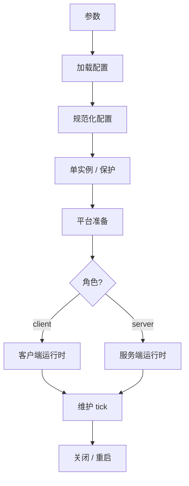
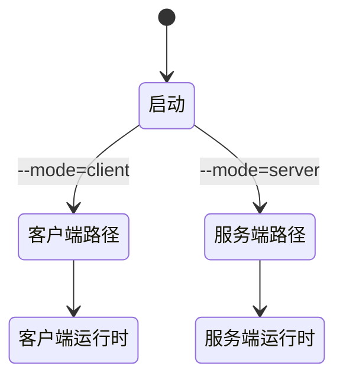
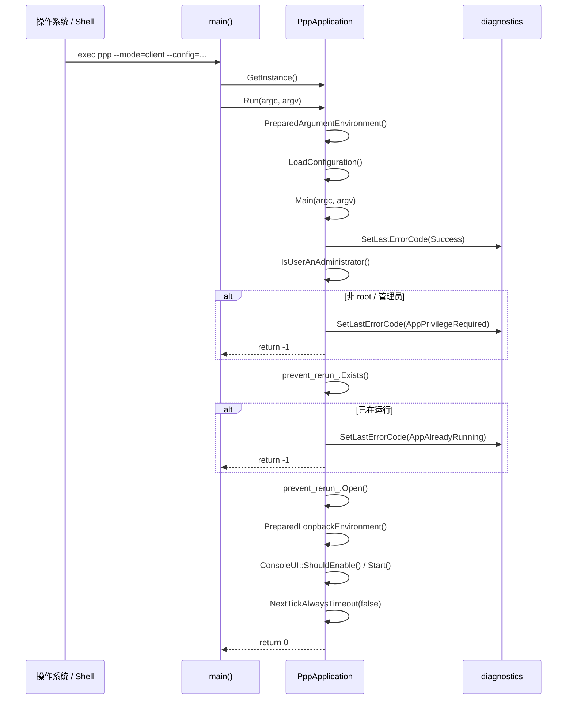
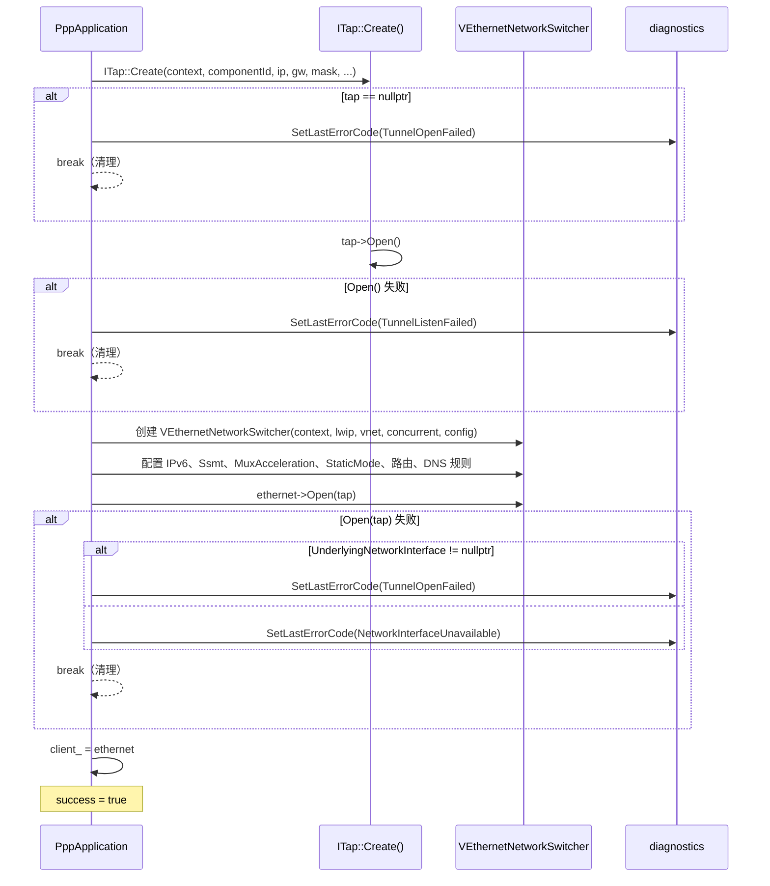
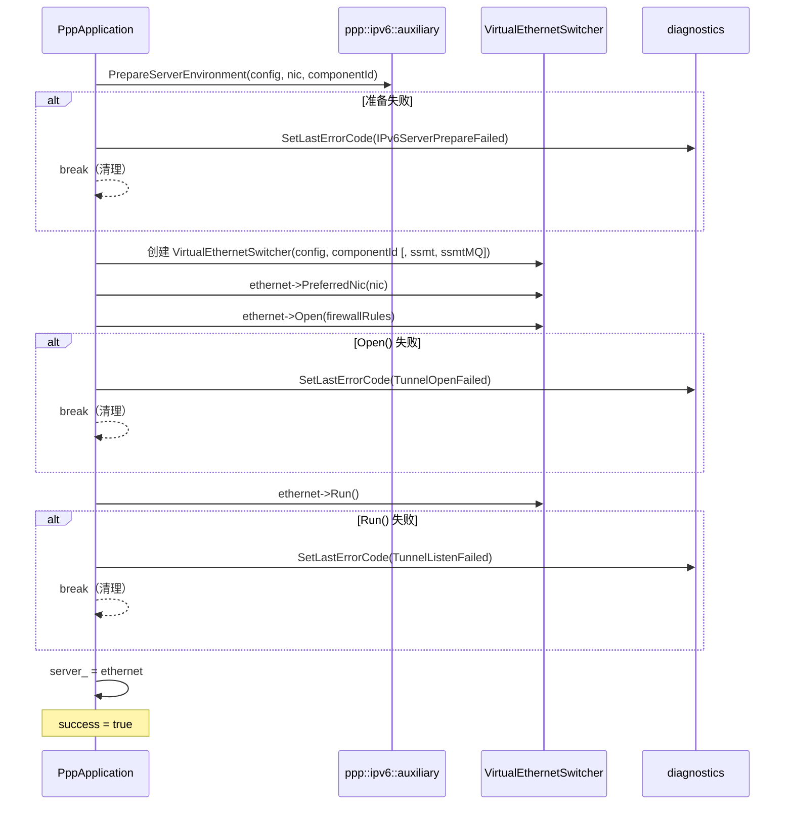
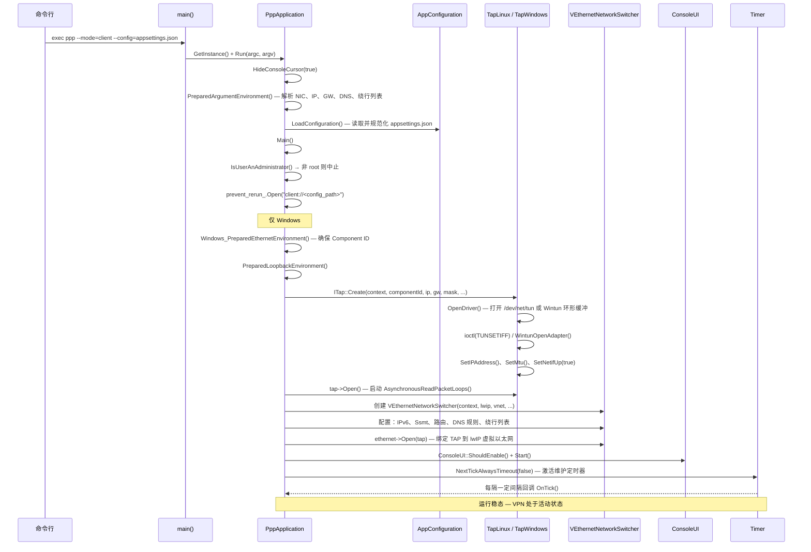
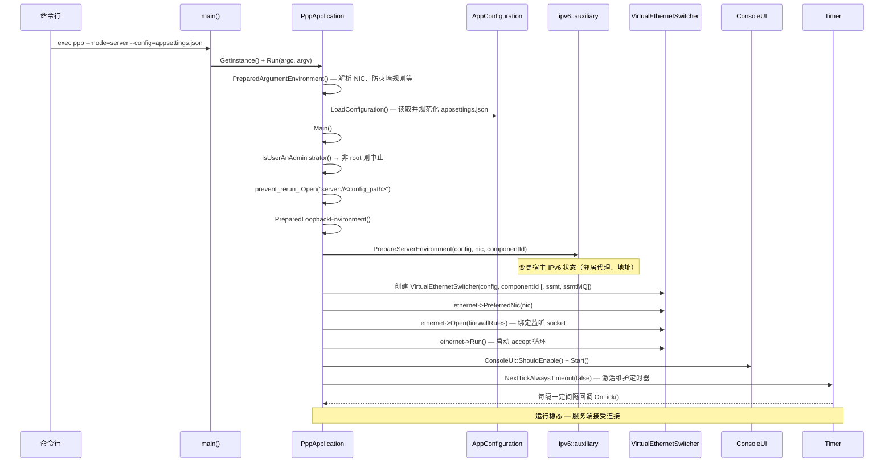

# 启动、进程所有权与生命周期控制

[English Version](STARTUP_AND_LIFECYCLE.md)

## 范围

本文解释 `ppp` 如何启动、进程所有权如何划分、client 和 server 如何分流，以及维护和关闭控制如何工作。

## 为什么启动很重要

OPENPPP2 的启动不是单纯“读配置然后跑”。它必须同时处理权限校验、单实例保护、配置加载、本地宿主整形、平台准备、角色选择、运行时启动、维护和关闭/重启控制。

## 进程所有者

`PppApplication` 是进程所有者。它协调配置、网络整形、运行时创建、统计、定时器和生命周期控制。

## 启动流水线

1. 参数准备
2. 配置加载
3. 配置规范化
4. 单实例检查
5. 平台准备
6. 角色选择
7. 运行时创建
8. tick loop
9. 关闭



## 环境准备

启动阶段会先准备本机状态，再进入角色相关运行时。这里包括 CLI 整形出的网络输入和平台特定准备。

这一步很重要，因为运行时不是纯内存逻辑。它会改变路由、DNS、适配器、防火墙以及平台特定的网络落点。

## 角色选择

client 和 server 很早就分流：

- client 创建虚拟网卡路径和 client switcher
- server 创建监听状态和 server switcher



## 生命周期控制

tick loop 负责周期性维护。重启和关闭是进程级控制，不是单个连接的副作用。

这些进程级定时器不负责传输握手重试或客户端侧 SYN/ACK 重新注入；那属于客户端虚拟网络栈路径。

这意味着连接失败不会自动打断整个进程生命周期。进程仍然是外层边界。

## 启动窗口内的错误处理器注册

`RegisterErrorHandler` 现为 key-based，建议在启动初始化窗口内完成：

- 每个注册点使用稳定 key；
- 传入空 handler 表示移除该 key 的注册；
- 在多线程运行分支启动前完成所有注册变更。

注册表变更被视为初始化阶段工作。运行期诊断派发对读路径是线程安全的，但 worker 活跃时的注册抖动不属于支持契约。

API 细节见 `ERROR_HANDLING_API_CN.md`。

## 生命周期阶段的诊断传播要求

对每个生命周期阶段（加载、规范化、准备、打开、tick 维护、释放/回滚）：

- 失败返回应携带诊断码，而不只是哨兵值；
- Console UI 状态面板消费进程级诊断快照 API；
- 生命周期排障应先看诊断时间线，再映射到子系统日志。

该策略可在失败发生于 worker 线程时，仍保持启动与关闭排障的确定性。

## Android 生命周期同步说明

Android bridge 生命周期（`run`、`stop`、release 路径）应与核心生命周期语义保持一致：

- app 未初始化、未运行等状态，在 JNI 与核心诊断中保持一致映射；
- release/cleanup 失败要返回稳定语义，便于 managed 调用方可靠处理。

## 所有权模型

| 层级 | 所有者 |
|---|---|
| 进程 | `PppApplication` |
| 环境 | switchers |
| 会话 | exchangers |
| 连接 | `ITransmission` |

---

## 详细初始化流程（ApplicationInitialize.cpp）

### 入口链路

进程从 `main()`（`main.cpp`）开始，获取 `PppApplication` 单例并调用 `Run()`。`Run()` 准备参数后进入 `Main()`，执行完整初始化流水线：



### `Main()` 各步骤与错误码

每个步骤失败时均对应具体错误码：

| 步骤 | 操作 | 失败错误码 |
|---|---|---|
| 1 | `SetLastErrorCode(Success)` — 重置诊断 | — |
| 2 | `IsUserAnAdministrator()` — 权限检查 | `AppPrivilegeRequired` |
| 3 | `prevent_rerun_.Exists()` — 单实例检查 | `AppAlreadyRunning` |
| 4 | `prevent_rerun_.Open()` — 获取锁 | `AppLockAcquireFailed` |
| 5 | `Windows_PreparedEthernetEnvironment()`（仅 Windows 客户端） | `NetworkInterfaceConfigureFailed` |
| 6 | `PreparedLoopbackEnvironment()` — TAP + Switcher 打开 | `AppPreflightCheckFailed`（或内部错误码） |
| 7 | `NextTickAlwaysTimeout(false)` — 启动 tick 定时器 | `RuntimeTimerStartFailed` |

### 构造函数：控制台与平台初始化

`PppApplication::PppApplication()` 在参数处理前执行：

- 所有平台均调用 `ppp::HideConsoleCursor(true)` 隐藏终端光标（TUI 渲染期间）。
- Windows 专属：设置控制台标题为 `"PPP PRIVATE NETWORK™ 2"`，调整缓冲区为 120×46（Windows 11）或 120×47（旧版），并通过 `EnabledConsoleWindowClosedButton(false)` 禁用关闭按钮。

### 客户端初始化：`PreparedLoopbackEnvironment()` — 客户端路径

客户端初始化采用单一事务性 `do { ... } while (false)` 块，任何失败均跳出至集中清理：



`ITap::Create()` 平台签名差异：

- **Windows**：`Create(context, componentId, ip, gw, mask, leaseTimeInSeconds, hostedNetwork, dnsAddresses)`
- **POSIX（Linux/macOS/Android）**：`Create(context, componentId, ip, gw, mask, promisc, hostedNetwork, dnsAddresses)`

Linux 专属客户端选项（设置在 `VEthernetNetworkSwitcher` 上）：

- `Ssmt()` — 多队列 TUN 多线程
- `SsmtMQ()` — SSMT 消息队列变体
- `ProtectMode()` — 绕行路由 socket 保护

### 服务端初始化：`PreparedLoopbackEnvironment()` — 服务端路径

服务端初始化与客户端显著不同——**不创建 TAP 适配器**：



失败时，`ppp::ipv6::auxiliary::FinalizeServerEnvironment()` 始终被调用，回滚已变更的宿主 IPv6 状态。

### 初始化后：TUI 与 Tick 循环

`PreparedLoopbackEnvironment()` 成功后：

1. **TUI 检测**：`ConsoleUI::ShouldEnable()` 检查 `isatty(stdout)`；若 stdout 为管道或重定向文件，跳过全屏 TUI，改为打印纯文本启动摘要。
2. **统计重置**：`stopwatch_.Restart()` 和 `transmission_statistics_.Clear()` 标记运行时计量起点。
3. **QUIC 切换**（仅 Windows 客户端）：根据 `--blockQUIC` 配置调用 `HttpProxy::SetSupportExperimentalQuicProtocol()`。
4. **VIRR / VBGP 标志**：从 CLI 参数 `--virr`、`--vbgp` 读取并存入全局原子变量，供路由子系统使用。
5. **自动重启**：`--auto-restart` 和 `--link-restart` 解析并存入 `GLOBAL_`。
6. **Tick 定时器**：`NextTickAlwaysTimeout(false)` 激活周期性维护定时器；失败时设置 `RuntimeTimerStartFailed` 并调用 `Dispose()`。

---

## 应用程序完整生命周期状态图

```mermaid
stateDiagram-v2
    [*] --> 已构造 : PppApplication()
    已构造 --> 参数已准备 : PreparedArgumentEnvironment()
    参数已准备 --> 配置已加载 : LoadConfiguration()
    配置已加载 --> 权限已验证 : IsUserAnAdministrator()
    权限已验证 --> [*] : 失败 → AppPrivilegeRequired
    权限已验证 --> 单实例已保护 : prevent_rerun_.Open()
    单实例已保护 --> [*] : 失败 → AppAlreadyRunning / AppLockAcquireFailed

    单实例已保护 --> 驱动预检完成 : Windows TAP 驱动检查（仅客户端）
    驱动预检完成 --> [*] : 失败 → NetworkInterfaceConfigureFailed

    单实例已保护 --> 回环环境就绪 : PreparedLoopbackEnvironment()
    驱动预检完成 --> 回环环境就绪 : PreparedLoopbackEnvironment()
    回环环境就绪 --> [*] : 失败 → TunnelOpenFailed / TunnelListenFailed / NetworkInterfaceUnavailable

    回环环境就绪 --> TUI已启动 : ConsoleUI::Start() 或纯文本回退
    TUI已启动 --> Tick运行中 : NextTickAlwaysTimeout(false)
    Tick运行中 --> [*] : 失败 → RuntimeTimerStartFailed

    Tick运行中 --> 运行中 : OnTick() 循环激活

    运行中 --> 运行中 : 周期性 OnTick()
    运行中 --> 关闭中 : OnShutdownApplication() / 信号
    运行中 --> 重启中 : ShutdownApplication(restart=true)

    关闭中 --> 已释放 : Dispose() + Release()
    重启中 --> 已释放 : Dispose() + Release()
    已释放 --> [*]
```

### 客户端详细启动时序



### 服务端详细启动时序



---

## 相关文档

- `ARCHITECTURE_CN.md`
- `CLIENT_ARCHITECTURE_CN.md`
- `SERVER_ARCHITECTURE_CN.md`
- `SOURCE_READING_GUIDE_CN.md`
- `ERROR_HANDLING_API_CN.md`
