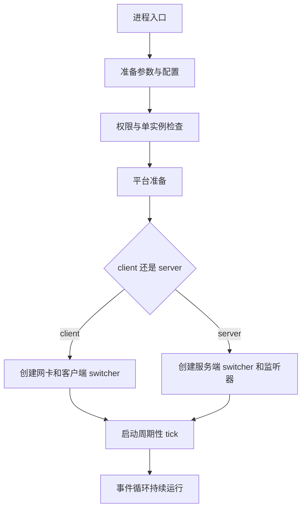
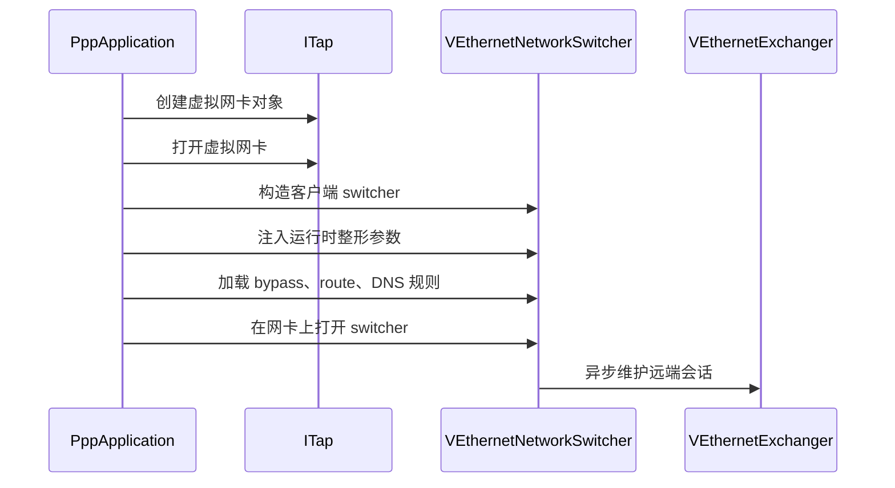
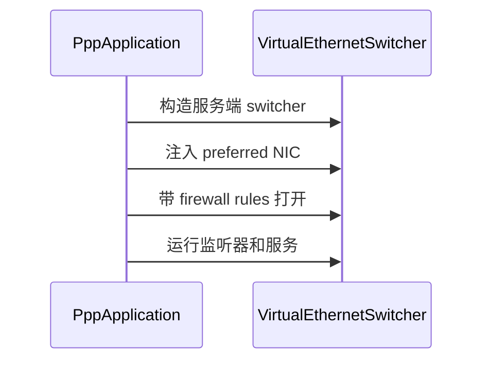
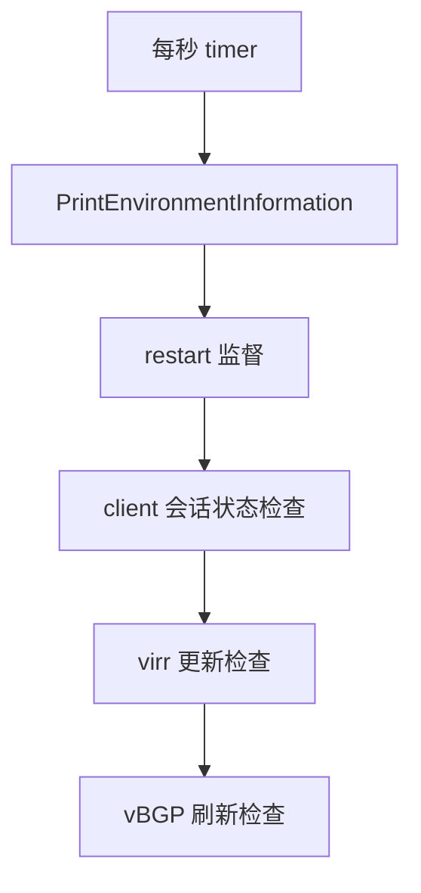

# 启动、进程所有权与生命周期控制

[English Version](STARTUP_AND_LIFECYCLE.md)

## 文档范围

本文解释 `ppp` 进程如何启动、主要运行时对象的所有权如何划分、client 与 server 分支如何分流、周期性维护如何工作、关闭与重启控制如何实现。

核心实现主要来自 `main.cpp`，再配合 client/server switcher 与 transmission 子系统一起理解。

如果想把这个工程当成一个真正的系统而不是一堆散乱类来理解，这份文档非常关键。

## 为什么启动过程在 OPENPPP2 里如此重要

在很多小型工具里，启动过程可以被简化成“读配置、开 socket、进事件循环”。但在这里完全不够。

OPENPPP2 的启动必须同时解决：

- 权限校验
- 单实例保护
- 配置加载与规范化
- 通过 CLI 做本地 network-interface shaping
- 平台相关环境准备
- 客户端侧虚拟网卡创建或服务端侧监听器创建
- 周期性维护调度
- 重启与关闭纪律

这意味着启动不是一个可忽略的前言，而是把工程从“代码”真正落成“基础设施节点”的地方。

## `PppApplication` 作为进程所有者

`PppApplication` 是最顶层的进程生命周期所有者。它拥有或协调：

- 已加载的 `AppConfiguration`
- 已解析的 `NetworkInterface` 本地整形对象
- client runtime 或 server runtime 对象
- transmission statistics 快照
- tick timer 生命周期
- 重启与关闭行为

一个很好用的心智模型是：

- `PppApplication` 负责进程生命周期
- switcher 负责环境生命周期
- exchanger 负责会话生命周期
- transmission 负责连接生命周期

只要这条边界不丢，代码会清晰很多。

## 高层启动流水线

启动路径最好被理解成一条流水线。

这比“程序启动了”更准确。后续所有行为都依赖这条流水线先把环境塑造成可运行状态。

## 参数准备环境 `PreparedArgumentEnvironment`

`PreparedArgumentEnvironment(...)` 是第一道重要准备函数。

它会做：

1. 根据 `--tun-flash` 设置 socket flash TOS
2. 如果输入的是 help 命令则提前结束
3. 加载配置文件
4. 决定当前是 client 还是 server
5. 根据 `configuration->concurrent` 调整线程池
6. 解析本地 network-interface shaping 参数
7. 把配置路径、配置对象、network interface 对象保存到 `PppApplication`
8. 根据配置设置 DNS helper 状态

它之所以重要，是因为后续大部分启动行为都依赖这里建立出的进程级状态。

## 为什么模式要这么早决定

角色必须很早决定，因为后面太多逻辑都依赖它。

client 和 server 在以下方面完全不同：

- 所需的平台准备
- 虚拟网卡与监听器的创建路径
- 运行对象构造路径
- 周期性任务的语义
- restart 与故障处理方式

因此，默认 server 模式并不是一个小细节，而是整体架构上的选择。

## 线程池与并发准备

配置加载完成后，启动路径会根据 `configuration->concurrent` 调整 executor 行为。

如果并发度大于 1：

- 会提高 max schedulers
- 在 server 模式下，还会结合 buffer allocator 提高 max threads

这说明并发在 OPENPPP2 里被当成节点级运行属性，而不是某个零散子系统里的隐藏参数。

## `NetworkInterface` 作为本次启动的本地整形状态

`GetNetworkInterface(...)` 返回的对象不是长期配置模型，它是“本次启动的本地整形模型”。

里面包括：

- 本地 DNS 地址
- preferred NIC 与 gateway
- tunnel IP、gateway、mask、interface name
- static-mode 与 host-network 相关开关
- mux 与 mux acceleration 值
- bypass 列表与 DNS/firewall 规则文件路径
- Linux 的 route-protection 与 SSMT 状态
- Windows 的 lease time 与 system HTTP proxy 行为开关

这个分离设计很漂亮，因为它避免把“长期节点策略”和“这台机器这次启动的本地环境整形”混成一件事。

## 从启动角度看配置加载

`LoadConfiguration(...)` 的意义不仅是找到一个文件。它还决定是否基于 `vmem` 创建自定义 `BufferswapAllocator`。

这个后果非常实际。

如果 `vmem` 块有效，且构造出的 allocator 有效，那么后续传输和包处理大量路径都会以它为 buffer backbone。

因此，启动阶段不只是读策略，也在决定内存行为基础设施。

## 进入 client/server 分支之前的平台准备

`PreparedLoopbackEnvironment(...)` 是从“通用启动”走向“环境级运行时落地”的桥。

在真正进入 client 或 server 分支前，它还会做一些跨分支平台准备，例如：

- 获取默认 `io_context`
- 在 Windows 上配置 firewall application rules
- 对 Windows client 做 PaperAirplane / LSP 相关准备

也就是说，这个函数把“通用启动层”和“平台落地层”接在了一起。

## client 分支详解

当 `client_mode_` 为真时，`PreparedLoopbackEnvironment(...)` 会进入 client 分支。

它的大致流程是：

1. 创建 TAP 或 TUN 对象
2. 打开虚拟网卡
3. 构造 `VEthernetNetworkSwitcher`
4. 如果传入了请求的 IPv6，则写入 switcher
5. 在非 Windows 平台写入 SSMT 和 protect-mode 指针
6. 注入 mux、static-mode、preferred gateway、preferred NIC 等运行时整形参数
7. 加载 bypass IP list
8. 根据配置中的 routes 继续加载 route-file IP list
9. 加载 DNS rules
10. 用虚拟网卡打开 client switcher
11. 把结果保存进 `client_`

这里非常清晰地体现了所有权层次：

- `PppApplication` 负责决定 client 启动和最终清理
- `ITap` 负责虚拟网卡生命周期
- `VEthernetNetworkSwitcher` 负责本地网络环境
- `VEthernetExchanger` 负责远端会话关系

## 为什么 client 分支要加载这么多本地状态

client 分支之所以比典型代理软件重，是因为它的职责不是“连出去”而已，而是要在本机上构造一个真实网络环境。

它必须决定：

- 本地到底有什么虚拟网卡
- 应该注入哪些 route
- 应该加载哪些 bypass list
- 应该应用哪些 DNS 规则
- 是否启用本地 proxy 或 mapping

因此 client 分支天然会比普通“socket client”复杂得多。

## server 分支详解

当 `client_mode_` 为假时，启动进入 server 分支。

大致流程是：

1. 如果是 Linux，则先准备 IPv6 服务端环境
2. 构造 `VirtualEthernetSwitcher`
3. 注入 preferred NIC
4. 使用 firewall rules 打开 switcher
5. 运行监听器与辅助服务
6. 把结果保存进 `server_`

这再次说明：server 不是一个 accept loop 而已，它是整个 overlay 节点的 session switch 和 policy center。

## 分支失败后的清理

无论 client 还是 server，启动分支里都实现了显式清理。

client 失败时会：

- 重置 `client_`
- 如果 switcher 已创建，则释放它
- 如果虚拟网卡已打开，则关闭它

server 失败时会：

- 重置 `server_`
- 如果 switcher 已创建，则释放它

这在运维上非常关键，因为该进程会修改宿主机网络状态。失败路径如果泄露半成品对象，就会变成灾难。

## `Main(...)` 作为真正的运行入口

准备阶段结束后，`Main(...)` 才进入顶层运行入口。

它会执行：

- 管理员权限检查
- 防重复运行锁检查
- Windows 客户端的虚拟网卡环境准备
- loopback environment 准备
- transmission statistics 初始化
- client 侧 QUIC 与 system HTTP proxy 相关行为整形
- `virr` 与 `vbgp` 的全局状态设定
- `auto_restart` 与 `link_restart` 的全局状态设定
- 启动周期性 tick timer

这意味着 `Main(...)` 是“进程终于活起来”的那个函数，而不只是一个平凡入口。

## 单实例保护

`Main(...)` 会根据：

- 角色前缀 `client://` 或 `server://`
- 配置路径

拼出 repeat-run name，然后通过 prevent-rerun guard 做检查与加锁。

这再次说明：运行时把进程身份视作真实的生命周期概念，而不是全部留给运维习惯去兜底。

## Windows 下 `Main(...)` 的特殊行为

在 Windows 上，`Main(...)` 还会多做几步。

对于 client 模式，它可能：

- 预备虚拟网卡环境
- 保存原始 QUIC 支持状态
- 后续根据 `--block-quic` 改变 QUIC 相关行为
- 按需设置系统 HTTP proxy

这在运维上很重要，因为 Windows 的启动路径并不是“Linux 同逻辑换个 API 名字”那么简单，它会更直接地影响系统级网络状态。

## `Main(...)` 里设置的全局运行状态

`Main(...)` 还会设置多项全局状态，例如：

- `virr` 是否开启自动更新
- `virr_argument` 的值
- `vbgp` 是否启用
- `auto_restart`
- `link_restart`

这也解释了后面周期性 tick 的很多行为。tick 里有一部分逻辑其实是“进程级政策”，而不是 switcher 自己决定的。

## 周期性 tick 模型

生命周期模型里有一条非常清晰的周期维护路径：

- `OnTick(...)`
- `NextTickAlwaysTimeout(...)`
- `ClearTickAlwaysTimeout()`

timer 每秒触发一次，并在回调中继续重新挂下一次 timeout。

这是一种很典型的基础设施设计。与其把关键维护逻辑散落在许多不可见 timer 里，不如保留一条显式的顶层维护循环。

## `OnTick(...)` 里到底做了什么

`OnTick(...)` 同时承担可观测性、维护与重启监督三类工作。

它主要会：

- 打印环境信息
- 在 Windows 上优化 working-set size
- 检查进程 auto-restart 定时
- 在 client 场景下确认 client switcher 和 exchanger 存在
- 检查当前 network state 是否 established
- 检查 link-restart 阈值
- 检查 `virr` IP-list 自动更新
- 检查 vBGP route list 周期更新

因此，`OnTick(...)` 绝不是一个“打印状态的小函数”，而是一条控制回路。

## auto-restart 与 link-restart

生命周期层里其实有两种不同的 restart 逻辑。

### auto restart

如果 `GLOBAL_.auto_restart` 大于零，进程会用运行时长与阈值比较，超过后直接重启整个应用。

### link restart threshold

如果 client exchanger 的重连次数超过 `GLOBAL_.link_restart`，进程也可以触发重启。

这点很重要，因为它说明工程把韧性视为进程级问题，而不仅仅是 socket retry 问题。

## `virr` 与 route-list 刷新生命周期

生命周期层还负责 route-list refresh 行为。

对于 `virr`：

- 系统维护一个 next-update 时间戳
- 到期时可拉取新的国家 IP-list

对于 vBGP 风格 route list：

- 维护一个固定刷新周期
- 遍历 client 的 vBGP route table
- 重新下载 route list
- 如果文件内容变了，则重写文件并通过重启让新策略生效

这再次体现出 OPENPPP2 是基础设施软件：route material 不是静态摆设，而是受监督的运行策略。

## 释放路径

`PppApplication::Dispose()` 实现了显式 teardown。

它会：

- 释放 server switcher
- 在 Windows 下恢复原始 QUIC 行为
- 如果本次运行改过 system HTTP proxy，则清理系统代理状态
- 释放 client switcher
- 清理 tick timer

这很重要，因为该进程会改变宿主机网络状态，必须可预测地恢复自身改动。

## statistics 快照所有权

`GetTransmissionStatistics(...)` 会从当前活跃的顶层 switcher 提取统计信息。

这很能说明“可观测性所有权”在哪里：

- 这里不会直接下探原始 socket
- 而是向当前活跃的环境所有者索取 transport statistics

这再次体现了运行时边界划分是相当清晰的。

## shutdown 与 restart 请求

`ShutdownApplication(...)` 会把 shutdown 或 restart 请求 post 到主 `io_context` 中。

这意味着关闭不是随意的异步外部暴力 kill，而是被纳入事件驱动运行时内部协调的一部分。

对于需要安全回收状态的网络进程来说，这是更合适的方式。

## utility command 会绕过完整启动

并不是所有调用路径都会进入长期运行的 tunnel process。

`Run(...)` 会优先检查一系列 helper command，例如：

- `--pull-iplist`
- Windows preferred-network 命令
- `--no-lsp`
- `--system-network-optimization`

如果命中这些命令，进程会执行对应操作并退出，不会继续走完整的正常启动路径。

这也是为什么 CLI 文档必须明确区分：

- 启动整形参数
- 一次性 helper command

## 为什么生命周期文档对开发者特别重要

OPENPPP2 里很多看似复杂的行为，一旦放进生命周期所有权模型里，就会简单很多。

如果某段逻辑是在处理：

- 读文件和决定策略，就去看配置加载层
- 本地环境落地，就看 switcher 和 adapter setup
- 远端关系维护，就看 exchanger
- 包与连接状态，就看 transmission
- 周期维护和重启监督，就看 `OnTick(...)` 与生命周期层

这张图一旦在脑子里建立起来，整个工程就不会再显得像一团线。

## 推荐的源码阅读顺序

想系统理解启动与生命周期，建议按以下顺序读：

1. `PppApplication::PreparedArgumentEnvironment(...)`
2. `PppApplication::LoadConfiguration(...)`
3. `PppApplication::GetNetworkInterface(...)`
4. `PppApplication::PreparedLoopbackEnvironment(...)`
5. `PppApplication::Main(...)`
6. `PppApplication::OnTick(...)`
7. `PppApplication::NextTickAlwaysTimeout(...)`
8. `PppApplication::Dispose()`
9. `PppApplication::ShutdownApplication(...)`

按照这个顺序，整个系统会像一条生命周期叙事一样清楚，而不是像迷宫。

## 最终理解

OPENPPP2 的启动与生命周期，最适合被理解成一套分层所有权系统。

这个进程不是“开几个 socket”那么简单，它会：

- 校验权限与进程身份
- 从配置中塑造稳定策略
- 从 CLI 中塑造本次启动的本地环境
- 选择 client 网络环境或 server 策略环境
- 通过 tick loop 持续监督自身
- 对重启、route refresh 和 teardown 做显式控制

这正是严肃网络基础设施运行时应有的启动纪律。

## 相关文档

- [`USER_MANUAL_CN.md`](USER_MANUAL_CN.md)
- [`CONFIGURATION_CN.md`](CONFIGURATION_CN.md)
- [`CLIENT_ARCHITECTURE_CN.md`](CLIENT_ARCHITECTURE_CN.md)
- [`SERVER_ARCHITECTURE_CN.md`](SERVER_ARCHITECTURE_CN.md)
- [`TRANSMISSION_CN.md`](TRANSMISSION_CN.md)
