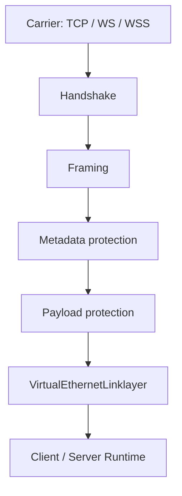
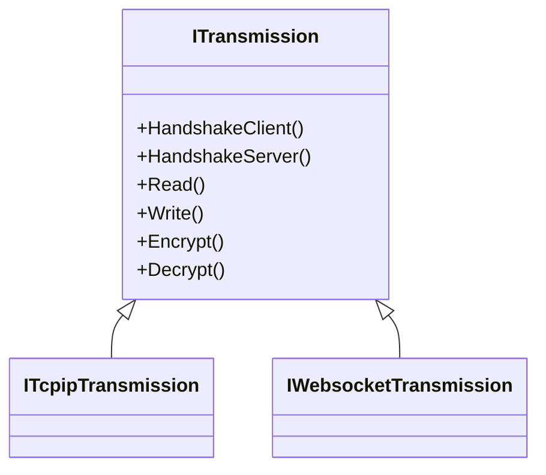
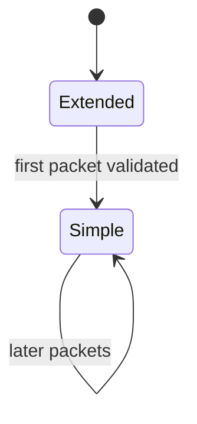
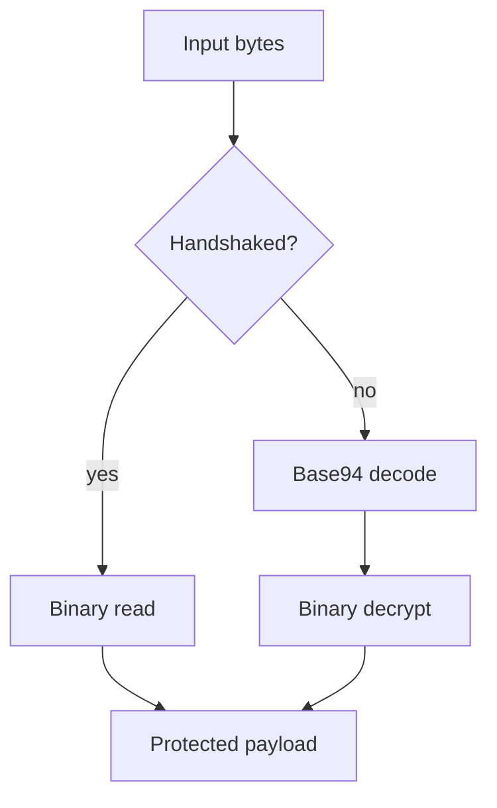
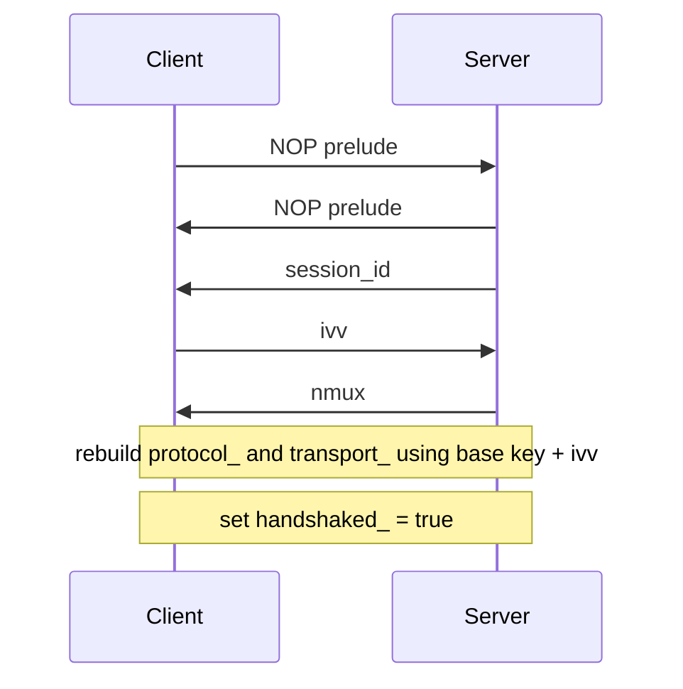

# Transport, Framing, And Protected Tunnel Model

[中文版本](TRANSMISSION_CN.md)

## Scope

This document explains the transport core of OPENPPP2 from the implementation upward. The goal is to describe what the transmission subsystem actually does and why it is more than a socket wrapper with a cipher.

The key source files are `ppp/transmissions/ITransmission.*`, `ppp/transmissions/ITcpipTransmission.*`, `ppp/transmissions/IWebsocketTransmission.*`, and the packet-consuming protocol files in `ppp/app/protocol/*`.

## What The Transmission Layer Solves

The transmission subsystem has to do several things at once:

| Requirement | Meaning |
|-------------|---------|
| Multi-carrier support | Work over TCP, WebSocket, WSS, and related carriers |
| Protected channel | Establish a protected state before normal tunnel traffic flows |
| Framing discipline | Protect packet boundaries and packet length metadata |
| Carrier independence | Keep upper-layer tunnel semantics separate from carrier type |
| Pre-handshake mode | Support base94-style pre-handshake or plaintext-compatible traffic |
| Session-specific working keys | Derive per-connection working cipher state from configured keys and handshake-time entropy |

## Layering Model

### Layer Responsibilities

| Layer | Responsibility |
|-------|----------------|
| Carrier | Socket I/O and transport selection |
| Handshake | Session setup, dummy traffic, and working-key input exchange |
| Framing | Length protection and packet boundary handling |
| Metadata protection | Header masking, shuffling, delta encoding, and cipher application |
| Payload protection | Body encryption and transform pipeline |
| Link-layer | Tunnel action semantics |

## `ITransmission`

`ITransmission` is not just an interface. It centralizes protected transport behavior:

- handshake sequencing
- timeout handling
- pre-handshake and post-handshake framing modes
- cipher object ownership
- read/write dispatch to carrier-specific implementations

## Carrier Types

### TCP

TCP is the most direct carrier path.

| Config | Meaning |
|--------|---------|
| `tcp.listen.port` | Listen port |
| `tcp.connect.timeout` | Connect timeout |
| `tcp.inactive.timeout` | Inactive timeout |
| `tcp.turbo` | Carrier-side optimization |
| `tcp.fast-open` | TCP Fast Open support |
| `tcp.backlog` | Listen backlog |

### WebSocket

WebSocket is used when HTTP-compatible transport is needed.

| Config | Meaning |
|--------|---------|
| `ws.listen.port` | Plain WebSocket listen port |
| `wss.listen.port` | Secure WebSocket listen port |
| `ws.path` | Upgrade path |
| `ws.verify-peer` | Peer certificate verification |

### WSS

WSS adds TLS at the carrier layer. That does not replace the inner OPENPPP2 transport logic. It only changes the carrier protection layer.

## Two Framing Families

OPENPPP2 has two transmission families.

### Base94 Family

Used when either of these is true:

- the handshake has not completed
- plaintext-compatible mode is enabled

It has two shapes:

- initial extended-header form
- later simple-header form

The first packet is more expensive because it establishes the initial parse state. Later packets use a simpler form.

### Binary Protected Family

Used after handshake in the normal protected path.

It uses a compact protected header plus a separately transformed payload body.

## Base94 Header Behavior

The base94 header is not a plain literal length prefix.

It uses:

- a random key byte
- a filler byte
- base94 digits derived from transformed length data
- in the first packet, an additional validation field

The packet state switches from extended to simple after the first successful parse.

## Binary Header Behavior

In the binary path, the header stores protected metadata rather than a naked length prefix.

The send-side process is roughly:

1. adjust payload length to avoid zero-length ambiguity
2. encrypt the length bytes if protocol cipher is configured
3. XOR-mask with a packet-local factor
4. shuffle bytes
5. delta-encode the final header

The receive-side process reverses those steps.

## Why The Length Is Adjusted

The code decrements the length before header protection and adds it back after decoding. That avoids zero-length ambiguity in the protected framing path.

This is a small but important normalization choice. It turns zero into an obvious error state instead of a valid packet length.

## Payload Transform Pipeline

The payload path can include:

- rolling XOR masking
- deterministic shuffling
- delta encoding
- optional transport cipher encryption

The runtime chooses conservative behavior before handshake and more normal behavior after handshake.

## Two Cipher Slots

OPENPPP2 keeps two cipher slots:

| Slot | Role |
|------|------|
| `protocol_` | Protects header metadata and protocol-facing bytes |
| `transport_` | Protects payload body bytes |

This is a meaningful architectural split. Metadata and payload are handled differently because metadata leakage matters even when payload content is protected.

## Handshake In Transmission Terms

The transmission handshake does not just authenticate a peer. It also shapes traffic and creates connection-specific working-key state.

Client side:

1. send NOP prelude
2. receive real `session_id`
3. generate fresh `ivv`
4. send `ivv`
5. receive `nmux`
6. mark `handshaked_ = true`
7. rebuild cipher state using `ivv`

Server side:

1. send NOP prelude
2. send real `session_id`
3. generate and send `nmux`
4. receive `ivv`
5. mark `handshaked_ = true`
6. rebuild cipher state using `ivv`

## Dummy Handshake Packets

The NOP prelude is not empty traffic. It is structured dummy traffic.

When `session_id == 0`, the packet packer sets the high bit of the first byte and produces a dummy payload. The receiver recognizes the dummy by that bit and ignores it.

That means the prelude looks like normal handshake traffic but carries no logical session identity.

## Connection-Specific Key Derivation

The client generates `ivv` and the server uses it to rebuild connection-specific cipher state.

The code-grounded statement is:

- OPENPPP2 derives per-connection working keys dynamically
- this reduces static key reuse across sessions

## Related Documents

- `HANDSHAKE_SEQUENCE.md`
- `PACKET_FORMATS.md`
- `TRANSMISSION_PACK_SESSIONID.md`
- this is not the same as claiming formal standard PFS from the visible code alone

## Handshake Timeout

Handshake is bounded by a timer derived from connection timeout settings.

If the timer fires, the runtime disposes the transmission and does not leave it in an indefinite handshake state.

This is a safety and operational control measure, not just a convenience.

## Why Base94 Exists

Base94 is not accidental legacy code.

It gives the system:

- a pre-handshake framing family
- a plaintext-compatible fallback path
- a distinct early-traffic shape
- compatibility for deployments that cannot use the normal protected binary form immediately

## Why `ITransmission` Matters

This file is one of the most important in the repository because it centralizes many behaviors that other systems spread across several libraries:

- handshake and timeout control
- early traffic shaping
- metadata protection
- payload protection
- carrier-independent I/O dispatch

That density is a consequence of the design, not just an implementation accident.
