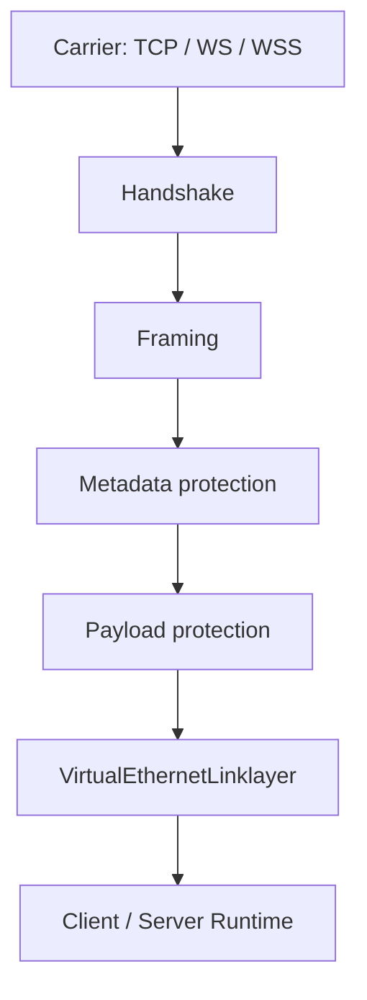
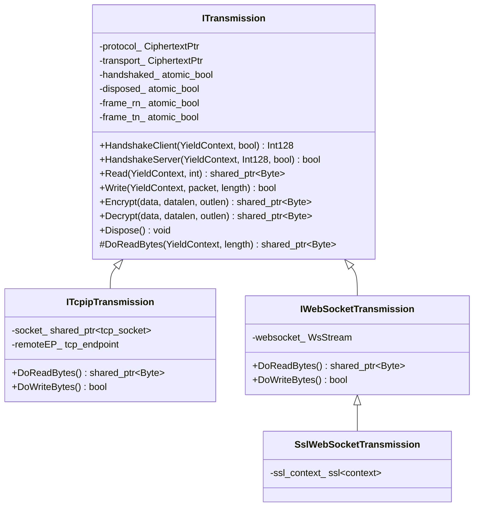
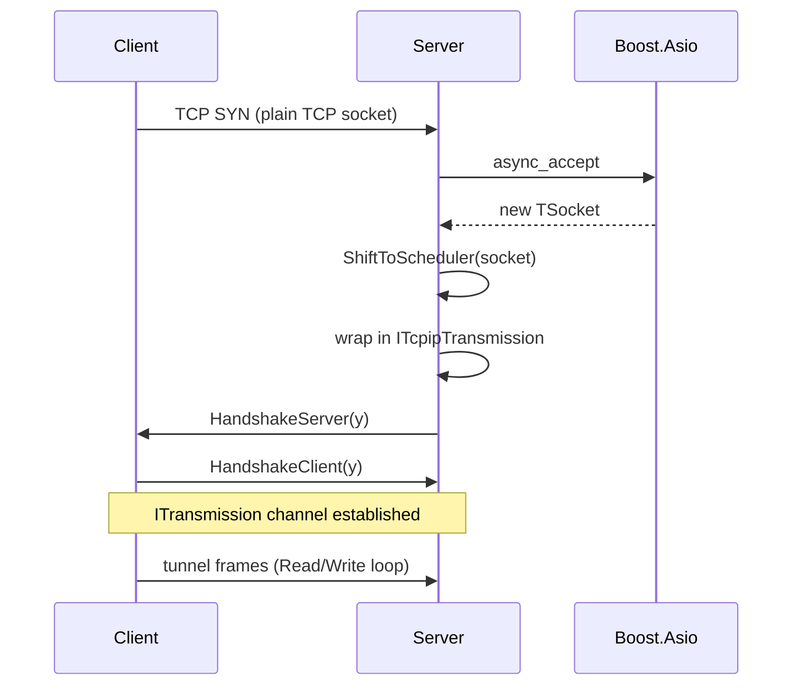
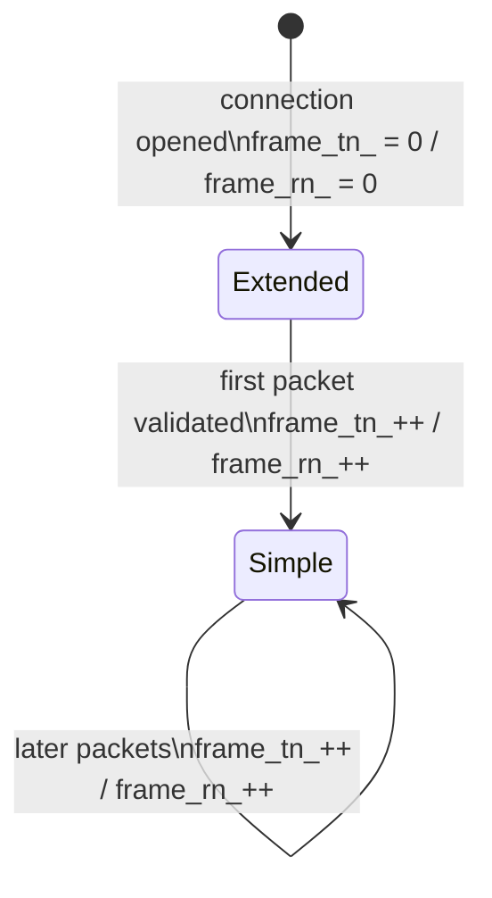
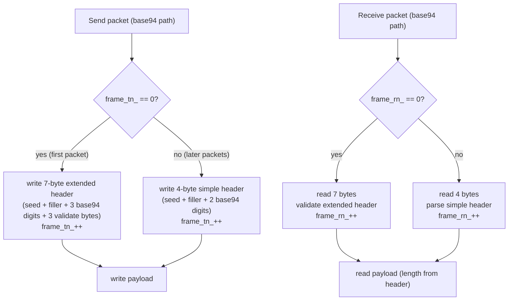
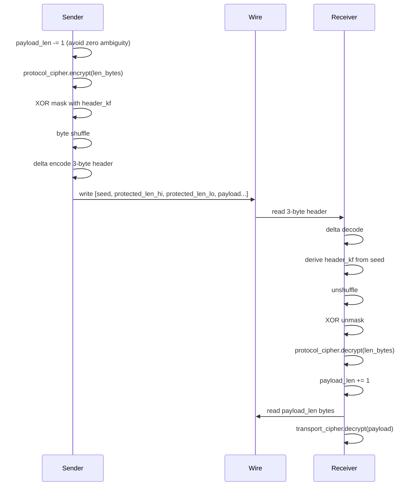
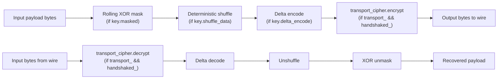
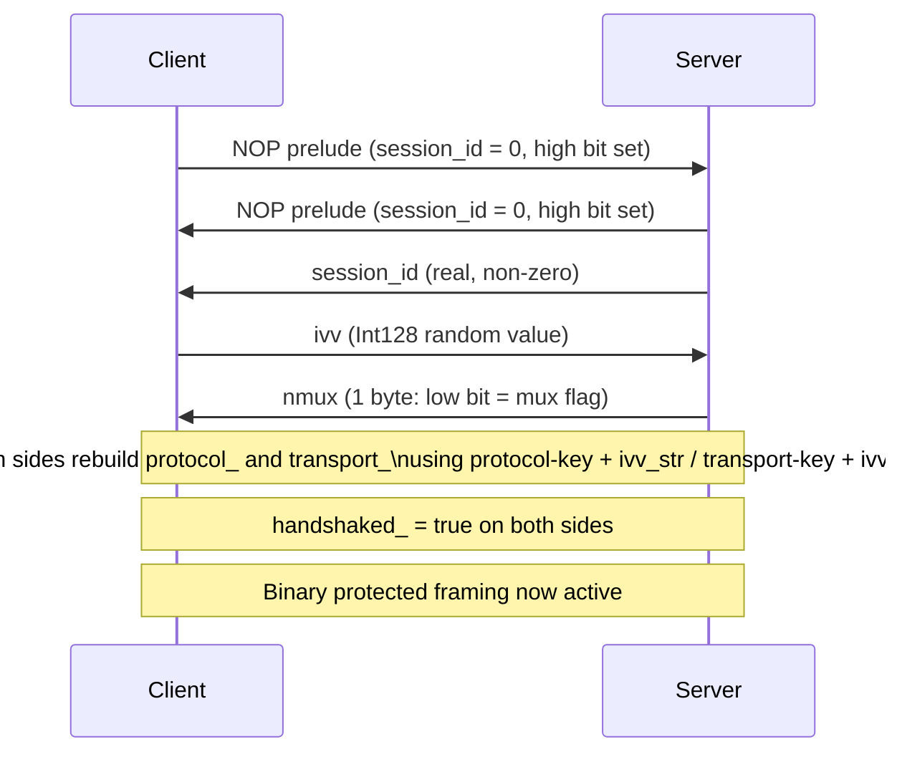
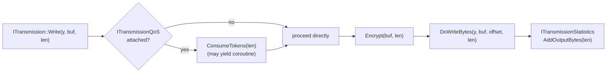

# Transport, Framing, And Protected Tunnel Model

[中文版本](TRANSMISSION_CN.md)

## Scope

This document explains the transport core of OPENPPP2 from the implementation upward. The goal is to describe what the transmission subsystem actually does and why it is more than a socket wrapper with a cipher.

The key source files are `ppp/transmissions/ITransmission.*`, `ppp/transmissions/ITcpipTransmission.*`, `ppp/transmissions/IWebsocketTransmission.*`, and the packet-consuming protocol files in `ppp/app/protocol/*`.

---

## 1. What The Transmission Layer Solves

The transmission subsystem has to do several things at once:

| Requirement | Meaning |
|-------------|---------|
| Multi-carrier support | Work over TCP, WebSocket, WSS, and related carriers |
| Protected channel | Establish a protected state before normal tunnel traffic flows |
| Framing discipline | Protect packet boundaries and packet length metadata |
| Carrier independence | Keep upper-layer tunnel semantics separate from carrier type |
| Pre-handshake mode | Support base94-style pre-handshake or plaintext-compatible traffic |
| Session-specific working keys | Derive per-connection working cipher state from configured keys and handshake-time entropy |

---

## 2. Layering Model



### Layer Responsibilities

| Layer | Responsibility |
|-------|----------------|
| Carrier | Socket I/O and transport selection |
| Handshake | Session setup, dummy traffic, and working-key input exchange |
| Framing | Length protection and packet boundary handling |
| Metadata protection | Header masking, shuffling, delta encoding, and cipher application |
| Payload protection | Body encryption and transform pipeline |
| Link-layer | Tunnel action semantics |

---

## 3. Class Hierarchy



### Key Source Anchors

| Class | File |
|-------|------|
| `ITransmission` | `ppp/transmissions/ITransmission.h` / `.cpp` |
| `ITcpipTransmission` | `ppp/transmissions/ITcpipTransmission.h` / `.cpp` |
| `IWebSocketTransmission` | `ppp/transmissions/IWebsocketTransmission.h` / `.cpp` |
| `SslWebSocketTransmission` | `ppp/transmissions/IWebsocketTransmission.h` |

---

## 4. Carrier Types

### TCP

TCP is the most direct carrier path. When `tcp.listen.port` is non-zero, a `boost::asio::ip::tcp::acceptor` binds to that port. Each accepted socket is wrapped in an `ITcpipTransmission`. No HTTP upgrade is involved; the connection starts directly with the OPENPPP2 handshake.

| Config | Meaning |
|--------|---------|
| `tcp.listen.port` | Listen port |
| `tcp.connect.timeout` | Connect timeout in seconds |
| `tcp.inactive.timeout` | Inactive (idle) session timeout |
| `tcp.turbo` | Carrier-side latency optimization (disables Nagle algorithm) |
| `tcp.fast-open` | TCP Fast Open support (Linux kernel ≥ 3.7) |
| `tcp.backlog` | Listen backlog queue depth |

#### TCP Connection Lifecycle



### WebSocket

WebSocket is used when HTTP-compatible transport is needed (e.g., for traversal of HTTP proxies or CDN nodes that only pass HTTP traffic). The carrier performs a standard HTTP Upgrade handshake before the OPENPPP2 handshake begins.

| Config | Meaning |
|--------|---------|
| `ws.listen.port` | Plain WebSocket listen port |
| `wss.listen.port` | Secure WebSocket (TLS) listen port |
| `ws.path` | HTTP Upgrade path (e.g., `/tunnel`) |
| `ws.host` | Host header value for WebSocket upgrade |
| `ws.verify-peer` | Peer certificate verification for WSS |
| `ws.ssl.certificate` | Server TLS certificate path |
| `ws.ssl.certificate-key` | Server TLS private key path |
| `ws.ssl.ca-certificate` | CA bundle for peer verification |

#### Client URI Scheme Mapping

| URI Form | Transport |
|----------|-----------|
| `ppp://host:port/` | Plain TCP |
| `ppp://ws/host:port/` | Plain WebSocket |
| `ppp://wss/host:port/` | TLS WebSocket (WSS) |

### WSS

WSS adds TLS at the carrier layer via `boost::asio::ssl::stream<TSocket>`. That does not replace the inner OPENPPP2 protocol cipher layer — it only changes the carrier protection layer. The two cipher layers are independently configurable.

---

## 5. Two Framing Families

OPENPPP2 has two transmission families depending on whether the handshake has completed.

### Base94 Family

Used when either of these is true:
- the handshake has not yet completed
- plaintext-compatible mode is enabled in configuration

The base94 family has two shapes: an initial extended-header form (used for the first packet) and a later simple-header form (used for all subsequent packets). The first packet is more expensive because it establishes the initial parse state via an extended validation field. Later packets use a simpler 4-byte header.

Control flow:



Fields controlled by frame counters `frame_tn_` (transmit) and `frame_rn_` (receive):

- When `frame_tn_ == 0`: extended header is written (4+3 bytes = 7 bytes total header).
- When `frame_tn_ > 0`: simple header is written (4 bytes total header).
- Receiver mirrors the logic using `frame_rn_`.

### Binary Protected Family

Used after handshake in the normal protected path. Uses a compact 3-byte binary header (seed byte + two protected length bytes) followed by the encrypted payload.

#### Binary Header Layout (post-handshake)

```
Byte 0:  seed (random, drives per-packet kf)
Byte 1:  protected_length_hi
Byte 2:  protected_length_lo
Byte 3…N: encrypted payload body
```

The length bytes are not a plain 16-bit integer. They undergo: protocol-cipher encryption → XOR masking with `kf`-derived factor → byte shuffling → delta encoding. The receiver reverses all five steps in opposite order.

---

## 6. Base94 Header Behavior

The base94 header is not a plain literal length prefix.

It uses:
- a random key byte (`ks`) that seeds the per-packet factor `kf`
- a filler byte derived from `kf`
- base94 digits derived from transformed length data
- in the first packet, an additional validation field (3 extra bytes)

The packet state switches from extended to simple after the first successful parse, tracked by `frame_rn_` reaching 1.



---

## 7. Binary Header Behavior

In the binary path, the header stores protected metadata rather than a naked length prefix.

### Send-Side Pipeline (5 Steps)

1. **Adjust length**: decrement payload length by 1 before header encoding. This avoids zero-length ambiguity — a zero payload length after decrement is an obvious error, not a valid empty packet.
2. **Protocol-cipher encrypt**: if `protocol_` cipher is configured, encrypt the two length bytes using the cipher's ECB-style single-block transform.
3. **XOR-mask**: derive `header_kf` from the seed byte using the same `kf` derivation as the payload. XOR the length bytes with `header_kf`-derived values.
4. **Shuffle**: swap the two length bytes according to a deterministic shuffle rule derived from `header_kf`.
5. **Delta-encode**: apply delta encoding to the final 3-byte header (seed + 2 length bytes) to prevent the header from being a static fingerprint.

### Receive-Side Pipeline (reverse 5 Steps)

1. **Delta-decode**: reverse the 3-byte delta encoding.
2. **Derive `header_kf`**: compute from the seed byte.
3. **Unshuffle**: swap bytes back.
4. **XOR-unmask**: remove the XOR masking.
5. **Protocol-cipher decrypt**: if cipher configured, decrypt the length bytes.
6. **Reconstruct length**: add 1 back to the decoded value.



---

## 8. Payload Transform Pipeline

The payload path can include multiple transforms applied in sequence:

| Transform | Controlled By | When Active |
|-----------|--------------|-------------|
| Rolling XOR masking | `key.masked` | When `masked = true` in config |
| Deterministic shuffling | `key.shuffle_data` | When `shuffle_data = true` |
| Delta encoding | `key.delta_encode` | When `delta_encode = true` |
| Transport cipher | `transport_` slot | When transport cipher configured and handshaked |

The runtime chooses conservative behavior before handshake (base94 with no transport cipher) and full protection after handshake.



---

## 9. Two Cipher Slots

OPENPPP2 keeps two independent cipher slots:

| Slot | JSON Config Key | Role | When Applied |
|------|----------------|------|-------------|
| `protocol_` | `key.protocol` + `key.protocol-key` | Protects header length metadata | On every frame header |
| `transport_` | `key.transport` + `key.transport-key` | Protects payload body bytes | On every frame payload |

This is a meaningful architectural split. Metadata and payload are handled differently because metadata leakage matters even when payload content is protected. An attacker who can observe packet lengths and patterns can infer traffic types (DNS, video, VoIP) even without decrypting the payload. Protecting the length field independently raises the bar for traffic analysis.

Both cipher objects are `ppp::cryptography::Ciphertext` instances. In the current `ITransmission.cpp` implementation, both cipher states are rebuilt during handshake using:

```
protocol_working_key  = Cipher(key.protocol-key  + ivv_str)
transport_working_key = Cipher(key.transport-key + ivv_str)
```

Where `ivv` is the client-generated per-connection entropy value exchanged during handshake. `nmux` is the server-generated multiplexing hint; it negotiates the mux flag but is not concatenated into the current cipher key strings. This means every connection uses different working keys even if the base key in `appsettings.json` is the same.

---

## 10. Handshake In Transmission Terms

The transmission handshake does not just authenticate a peer. It shapes traffic and creates connection-specific working-key state.

### Client-Side Handshake

1. Send NOP prelude (dummy traffic to obscure handshake start)
2. Receive real `session_id` from server
3. Generate fresh `ivv` (`Int128` random per-connection entropy)
4. Send `ivv` to server
5. Receive `nmux` from server (low bit = mux flag)
6. Mark `handshaked_ = true`
7. Rebuild `protocol_` and `transport_` cipher state using `ivv`

### Server-Side Handshake

1. Send NOP prelude
2. Send real `session_id` to client
3. Generate and send `nmux`
4. Receive `ivv` from client
5. Mark `handshaked_ = true`
6. Rebuild cipher state using `ivv`



---

## 11. Dummy Handshake Packets (NOP Prelude)

The NOP prelude is not empty traffic. It is structured dummy traffic designed to make the handshake look like normal tunnel data to a passive observer.

When `session_id == 0`, the packet packer:
1. Sets the high bit of the first byte (distinguishes it from real session traffic).
2. Generates a random payload of random length (up to MTU).
3. Writes the dummy bytes in base94 format.

The receiver recognizes the dummy by checking the high bit and ignores the payload content. The random length and content prevent passive observers from identifying the handshake by timing or size.

After both sides have exchanged NOP preludes, the real `session_id` exchange begins and the handshake proceeds normally.

---

## 12. Connection-Specific Key Derivation

The client generates `ivv` fresh for every new connection. Both peers use it with the configured base keys to rebuild connection-specific cipher state. This means:

- Different connections between the same client and server use different working keys.
- Compromise of one connection's working key does not expose other connections.
- Passive traffic analysis that relies on key reuse (e.g., replay attacks with static keys) is defeated.

The `nmux` low bit negotiates whether multiplexing is active. It affects post-handshake framing behavior, but the current key strings are rebuilt from `protocol-key + ivv_str` and `transport-key + ivv_str`.

---

## 13. Handshake Timeout

Handshake is bounded by a timer derived from connection timeout settings:

```
handshake_timeout = tcp.connect.timeout
```

If the timer fires before `handshaked_` is set to `true`, the runtime:
1. Calls `SetLastErrorCode(ErrorCode::SessionHandshakeFailed)`.
2. Calls `Dispose()` on the transmission.
3. Does not leave the connection in an indefinite handshake state.

This prevents resource exhaustion from half-open connections where the remote peer starts the handshake but never completes it.

---

## 14. QoS and Statistics Integration

`ITransmission` has two optional integration points for traffic management:

**`ITransmissionStatistics`** — counts bytes read and written. The switcher uses these counters to enforce per-session bandwidth quotas declared in the `INFO` frame and to populate the Console UI speed display.

**`ITransmissionQoS`** — token-bucket rate limiter. When attached, `Write()` will consume tokens before sending. If the bucket is empty, the write yields (coroutine suspension) until tokens refill. This implements the server-side bandwidth cap declared in `client.bandwidth` in the configuration.



---

## 15. Why `ITransmission` Matters

This file is one of the most important in the repository because it centralizes many behaviors that other systems spread across several libraries:

- handshake and timeout control
- early traffic shaping (NOP prelude)
- metadata protection (header transform pipeline)
- payload protection (payload transform pipeline)
- carrier-independent I/O dispatch
- QoS token-bucket integration
- statistics collection

That density is a consequence of the design, not just an implementation accident. The alternative — spreading these responsibilities across the TCP carrier, the WebSocket carrier, and the link-layer protocol — would make it much harder to ensure consistent security properties across all carrier types.

---

## 16. Practical Configuration Examples

### Minimum Secure Configuration

```json
{
  "tcp": {
    "listen": { "port": 2096 },
    "connect": { "timeout": 15 },
    "inactive": { "timeout": 300 }
  },
  "key": {
    "kf": 154,
    "kh": 181,
    "kl": 152,
    "kx": 191,
    "sb": 0,
    "protocol": "aes-128-cfb",
    "protocol-key": "YourProtocolKey",
    "transport": "aes-256-cfb",
    "transport-key": "YourTransportKey",
    "masked": true,
    "delta_encode": true,
    "shuffle_data": true
  }
}
```

### WebSocket over TLS (WSS)

```json
{
  "websocket": {
    "host": "vpn.example.com",
    "path": "/tunnel",
    "listen": {
      "ws": { "port": 0 },
      "wss": { "port": 443 }
    },
    "ssl": {
      "certificate": "/etc/ssl/certs/server.pem",
      "certificate-key": "/etc/ssl/private/server.key",
      "verify-peer": false
    }
  }
}
```

Client URI for WSS:

```
ppp://wss/vpn.example.com:443/
```

---

## Related Documents

- [`HANDSHAKE_SEQUENCE.md`](HANDSHAKE_SEQUENCE.md) — Detailed handshake exchange walkthrough
- [`PACKET_FORMATS.md`](PACKET_FORMATS.md) — Wire format for all packet types
- [`TRANSMISSION_PACK_SESSIONID.md`](TRANSMISSION_PACK_SESSIONID.md) — Session ID packaging details
- [`CONFIGURATION.md`](CONFIGURATION.md) — Full `appsettings.json` schema including transport config
- [`SECURITY.md`](SECURITY.md) — Security architecture and threat model
- [`EDSM_STATE_MACHINES.md`](EDSM_STATE_MACHINES.md) — Session state machine lifecycle
