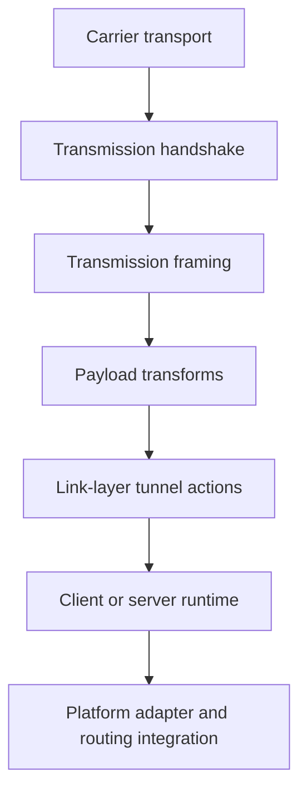
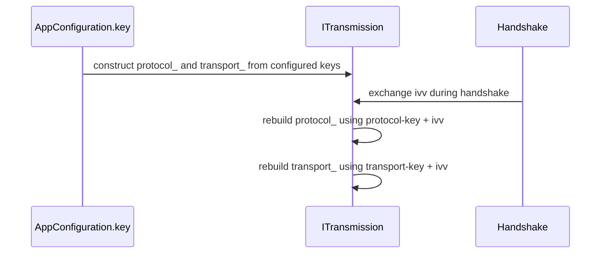
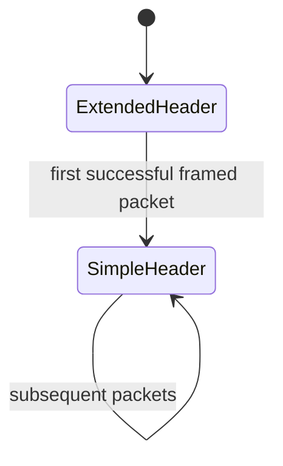
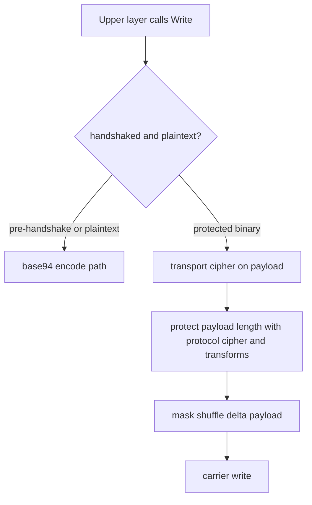
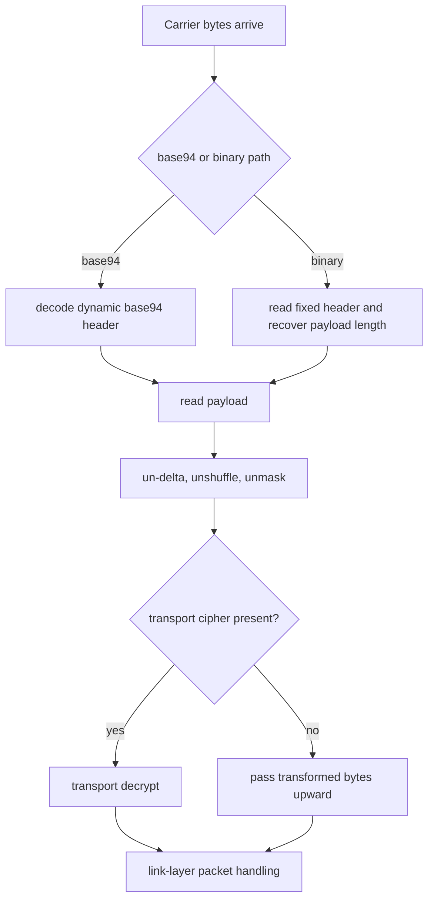

# Transport, Framing, And Protected Tunnel Model

[中文版本](TRANSMISSION_CN.md)

## Scope

This document explains the transport and framing core of OPENPPP2 from the code upward, not from product slogans downward. The intent is to let a reader understand what the transmission subsystem actually does, how it fits into the rest of the project, and why the implementation looks different from a typical “single socket plus a single crypto layer” design.

The center of gravity is:

- `ppp/transmissions/ITransmission.h`
- `ppp/transmissions/ITransmission.cpp`
- `ppp/transmissions/ITcpipTransmission.*`
- `ppp/transmissions/IWebsocketTransmission.*`
- `ppp/app/protocol/VirtualEthernetLinklayer.*`
- `ppp/app/protocol/VirtualEthernetPacket.*`

This document should be read together with:

- [`HANDSHAKE_SEQUENCE.md`](HANDSHAKE_SEQUENCE.md)
- [`PACKET_FORMATS.md`](PACKET_FORMATS.md)
- [`SECURITY.md`](SECURITY.md)
- [`STARTUP_AND_LIFECYCLE.md`](STARTUP_AND_LIFECYCLE.md)

## The Transmission Problem OPENPPP2 Is Solving

OPENPPP2 is not using the transport layer merely as a byte pipe. It needs the transmission subsystem to solve several problems at once:

- carry traffic over multiple carriers such as TCP, WS, and WSS
- establish a session-oriented protected channel before the upper virtual Ethernet logic begins normal work
- hide packet boundaries and packet length shape more aggressively than a plain length-prefixed framing scheme
- keep the upper link-layer protocol independent from the carrier type
- support both a normal post-handshake binary framing mode and a pre-handshake or plaintext-compatible base94 mode
- derive per-connection working ciphers from long-lived configured key material plus handshake-time random input

That combination explains why the code in `ITransmission.cpp` looks denser than a conventional socket wrapper.

## Layering Model

At the highest level, OPENPPP2 divides the path into several layers that have to be read separately if the system is going to make sense.



Those layers correspond roughly to:

- carrier transport: TCP, WS, WSS, and related socket I/O paths
- handshake: session admission and connection-specific key shaping
- framing: packet header encoding, length protection, safe parsing, and payload packaging
- payload transforms: masked XOR, shuffle, delta encode/decode, optional cipher application
- link-layer actions: NAT, LAN, SENDTO, ECHO, TCP relay actions, FRP-style control, static mode, MUX
- runtime integration: `VEthernetExchanger`, `VirtualEthernetExchanger`, `VEthernetNetworkSwitcher`, `VirtualEthernetSwitcher`

The most common reading mistake is to collapse all of these into one mental bucket and call the result “the protocol.” In this codebase that is not precise enough. There is a carrier, there is a protected transmission layer, there is a tunnel action protocol, and there is platform-specific network integration.

## Where `ITransmission` Sits

`ITransmission` is the protected transmission abstraction. It is not merely an interface in the abstract-object-oriented sense. It is the place where the project centralizes several concrete behaviors:

- handshake sequencing
- handshake timeout management
- post-handshake framed packet encryption and decryption
- pre-handshake or plaintext-compatible base94 framing
- dual-cipher state ownership through `protocol_` and `transport_`
- dispatch into the actual socket read/write implementation owned by transport-specific derived classes

That is why `ITransmission` is one of the most important files in the project. If a reader wants to understand how OPENPPP2 differs from a typical VPN or proxy product, `ITransmission.cpp` is one of the first places where that difference becomes visible.

## Carrier Layer Versus Protected Transmission Layer

The carrier decides how bytes move between peers. The protected transmission layer decides how OPENPPP2 turns those bytes into authenticated runtime state and later into tunnel packets.

This distinction matters because several external products mentioned by the user community often collapse these concerns differently. Some systems tightly bind their security story to one carrier style, one TLS stack posture, or one fixed record format. OPENPPP2 instead tries to keep:

- carrier flexibility below
- its own protected tunnel formatting above

That does not automatically make it stronger. It makes it architecturally different. The burden then shifts to the implementation to ensure that the upper protected layer remains coherent regardless of whether the carrier is TCP, WS, or WSS.

## Constructor-Time Cipher State

When an `ITransmission` instance is constructed, it checks whether the configuration has usable ciphertext settings. If so, it creates two cipher objects:

- `protocol_`
- `transport_`

This is visible in the constructor in `ITransmission.cpp` where the runtime builds `Ciphertext` instances from:

- `configuration->key.protocol`
- `configuration->key.protocol_key`
- `configuration->key.transport`
- `configuration->key.transport_key`

These are not yet the final connection working keys in the strongest sense the code can provide. They are the initial configured cipher state. After the handshake exchanges a fresh `ivv`, both sides rebuild these cipher objects using the configured base keys plus the handshake-time `ivv` string.

That means the lifecycle is:



This is a crucial point for the security discussion. The code absolutely does perform connection-specific working-key derivation. It does not justify claiming standard public-key-agreement PFS by itself. Those are different statements.

## Why Two Cipher Slots Exist

OPENPPP2 does not treat all bytes equally. The code distinguishes between:

- protocol-layer metadata protection
- transport payload protection

The protocol cipher is used around header metadata such as the protected length bytes. The transport cipher is used around the actual payload body. This division is what allows the implementation to say, in effect:

- packet body is one thing
- packet framing metadata is another thing

This is a recurring design pattern in the project. Similar separation appears elsewhere too, for example in the static packet format where header-body protection and payload protection are separately reasoned about.

## The Two Framing Families

There are really two transmission families in `ITransmission.cpp`.

### 1. Base94 framing family

This is used when either of these is true:

- handshake has not completed yet
- `cfg->key.plaintext` is enabled

In that mode the code routes through the `base94_encode` and `base94_decode` helpers. The packet length header is expressed through base94 digits, and the first packet uses an extended header variant before later packets switch into a simplified header mode.

### 2. Binary protected framing family

This is used after handshake in the normal protected path when the runtime is not forced into plaintext behavior. In that mode the code routes through:

- `Transmission_Header_Encrypt`
- `Transmission_Header_Decrypt`
- `Transmission_Payload_Encrypt`
- `Transmission_Payload_Decrypt`
- `Transmission_Packet_Encrypt`
- `Transmission_Packet_Decrypt`

The result is a tighter fixed-size header plus a separately protected payload.

## Why Base94 Exists At All

The base94 path is not accidental legacy code. It serves a real role in the design:

- it gives the system a pre-handshake framing family that is distinct from the post-handshake binary family
- it supports the configured plaintext mode
- it allows the runtime to shape the traffic form of early packets differently from later packets

This is part of the project’s traffic-shaping and compatibility story. It is not the same thing as modern authenticated encryption. It is a transport-format behavior that sits beside the cipher story, not instead of it.

## Base94 Length Header: First Packet Versus Later Packets

One of the more interesting details in `ITransmission.cpp` is that the base94 header is not fixed for the life of the connection.

The writer side uses `frame_tn_`.

- if `frame_tn_` is false, it emits an extended header
- once the first extended header is emitted, `frame_tn_` becomes true
- subsequent packets use the shorter simple header

The reader side mirrors this with `frame_rn_`.

- if `frame_rn_` is false, it expects the extended header form first
- once that parses and validates, it flips to the simple header parser

This means the base94 path has an intentional transition:



That behavior matters for documentation because it is one of the places where the project’s “dynamic frame word” idea is visible in actual code. The header shape is not totally static across the life of the connection.

## Reading The Base94 Encoder Carefully

The helper `base94_encode_length(...)` reveals several design choices.

First, the encoded length is not written directly. Instead it is transformed using:

- the configuration’s transmission-layer modulus from `Lcgmod(...)`
- a per-packet `kf`
- base94 digit conversion

Second, the header injects:

- a random key byte
- a filler byte
- a swap between positions `h[2]` and `h[3]`

Third, the first extended header adds a 3-byte checksum-like field derived from:

- the checksum of the 4-byte simple part
- XOR with the original payload length
- obfuscation again through the modulus mapping and base94 conversion
- `shuffle_data` over the 3-byte extension

The first packet therefore does more than just communicate a length. It also establishes a stronger parse transition into the later simplified state.

## Base94 Decoder Behavior

The base94 decoder follows the same idea in reverse.

`base94_decode_kf(...)` normalizes the first bytes and reverses the swap. Then the code chooses one of two length readers:

- `base94_decode_length_r1(...)` for the initial extended-header state
- `base94_decode_length_rn(...)` for the later simple-header state

In the initial state, the reader:

- reads the extended header
- computes a checksum over the first 4 bytes
- unshuffles the extension bytes
- decodes the extension field
- compares the derived value against the checksum XOR payload-length construction
- flips `frame_rn_` to true only after this passes

This is a very implementation-specific behavior that deserves explicit documentation because it explains why the early packet path is more expensive than later packets.

## Binary Header Protection

Once the normal protected binary framing path is in use, OPENPPP2 uses a compact fixed-size header.

The central helpers are:

- `Transmission_Header_Encrypt(...)`
- `Transmission_Header_Decrypt(...)`

The header contains three bytes before delta encoding:

- one random seed byte
- two bytes for the payload length after an internal `-1` adjustment

The logic is layered:

1. payload length is decremented by one
2. the two length bytes may be encrypted with the protocol cipher
3. the two length bytes are XOR-masked with a per-packet `header_kf`
4. those two bytes are shuffled
5. the three-byte header is delta-encoded using the global `key.kf`

In reverse, the reader:

1. delta-decodes the three-byte header
2. derives `header_kf` from `APP->key.kf ^ seed_byte`
3. unshuffles the two length bytes
4. XOR-unmasks them with `header_kf`
5. decrypts them through the protocol cipher if configured
6. reconstructs the payload length and adds the `+1` adjustment back

That is the practical meaning of “length protection” in this codebase. The length is never just sent in clear binary form once the protected path is active.

## Why The Length Is Adjusted By One

The code decrements the payload length before header protection and adds one back during decoding. The in-file comment explains the reason:

- avoid zero-length packets in the protected framing path

This is a small but useful example of the project’s general style. Edge conditions are often normalized away early so the later logic can treat zero or invalid values as obvious failure cases.

## Payload Transform Pipeline

The payload path is split into partial transforms and optional delta encoding.

The outbound partial path applies, depending on state and configuration:

- `masked_xor_random_next`
- `shuffle_data`

The full outbound payload path may then apply:

- `delta_encode`

The inbound side reverses this in the opposite order.

The important control flag is `safest`, which is defined as:

- `!transmission->handshaked_`

That means the early connection phase forces the conservative path even if the configuration might otherwise disable some transforms. In other words, before the session is fully handshaked, the implementation biases toward applying the more defensive formatting path.

## The Meaning Of `masked`, `shuffle-data`, And `delta-encode`

These configuration booleans are easy to misunderstand if they are documented too casually.

They are not interchangeable.

### `masked`

Controls whether the payload is passed through `masked_xor_random_next`, which uses a rolling XOR-style masking step derived from the packet key factor.

### `shuffle-data`

Controls whether the payload bytes are shuffled with a deterministic, key-dependent permutation.

### `delta-encode`

Controls whether the payload is delta-encoded for transmission and correspondingly delta-decoded on receipt.

The point is not that any one of these is individually a magic shield. The point is that the protected transmission layer is shaping traffic through several orthogonal transforms in addition to any configured block or stream cipher implementation.

## Handshake Overview

The full handshake is described in detail in [`HANDSHAKE_SEQUENCE.md`](HANDSHAKE_SEQUENCE.md), but the transmission document still needs the transmission-layer view.

Client side:

1. send NOP handshake packets
2. receive real `session_id`
3. generate fresh `ivv`
4. send `ivv`
5. receive `nmux`
6. mark handshaked
7. rebuild `protocol_` and `transport_` using configured keys plus `ivv`

Server side:

1. send NOP handshake packets
2. send real `session_id`
3. generate and send `nmux`
4. receive `ivv`
5. mark handshaked
6. rebuild `protocol_` and `transport_` using configured keys plus `ivv`

The bit `nmux & 1` carries the mux flag.

## Dummy Handshake Packets

The handshake subsystem has a concept of dummy packets.

In `Transmission_Handshake_Pack_SessionId(...)`:

- if `session_id` is zero, the high bit of the first random byte is set
- the rest of the payload becomes random-looking filler around a fake integer string

In `Transmission_Handshake_Unpack_SessionId(...)`:

- if the high bit is set, the packet is treated as dummy
- `eagin` is set to true
- the receiver ignores the packet and keeps reading

This is part of the handshake noise strategy. The first packets on the wire are not required to correspond one-for-one with the logical control items the peers ultimately care about.

## NOP Handshake Rounds

`Transmission_Handshake_Nop(...)` derives the number of dummy rounds from:

- `key.kl`
- `key.kh`

The code transforms them by shifting `1 << kl` and `1 << kh`, takes a random value in the range, and then scales it down by `ceil(rounds / (double)(175 << 3))`.

The purpose is not to create cryptographic strength by itself. The practical effect is to vary how much dummy traffic the peers exchange before the actual session identifiers are processed.

This is one of the key places where OPENPPP2 differs in flavor from mainstream “perform one deterministic authenticated handshake and then switch to records” systems. The project includes an explicit traffic-shaping prelude around its logical session establishment.

## Handshake Timeout Discipline

The handshake is guarded by `InternalHandshakeTimeoutSet()` and `InternalHandshakeTimeoutClear()`.

The timeout duration is derived from:

- `configuration_->tcp.connect.timeout`
- optional jitter through `configuration_->tcp.connect.nexcept`

If the timer expires, the runtime:

- spawns a coroutine
- sends final handshake NOPs
- disposes the transmission

This is a good example of the project’s operational security posture. It does not merely fail the socket read. It actively cleans up half-open handshake state and tries to avoid lingering ambiguous sessions.

## Connection-Specific Key Derivation With `ivv`

The client generates `ivv` using a GUID-derived `Int128`. Both sides then serialize that `Int128` into a string and append it to the configured base keys before recreating the ciphers.

Conceptually the derivation looks like:

```text
protocol_working_key  = protocol-key  + serialized(ivv)
transport_working_key = transport-key + serialized(ivv)
```

This means two important things are true at once.

### What can be said positively

- the working cipher state is connection-specific
- a fresh `ivv` reduces the risk that every connection uses an identical long-lived working key
- compromise analysis is better than if the runtime always reused the raw configured keys directly

### What must not be overstated

- the code shown here does not demonstrate a standard ephemeral public-key key agreement such as ECDHE
- therefore the documentation should not simply claim “modern standard PFS” without qualification

The correct code-grounded phrasing is:

- OPENPPP2 implements session-level dynamic working-key derivation
- this reduces static key reuse across connections
- this is not equivalent to claiming a public-key-agreement-based standard PFS proof model from the code shown here alone

## Relation Between `protocol_` And `transport_`

The transmission pack path shows why the two slots are both useful.

When both are present:

1. payload is encrypted by the transport cipher
2. header metadata is protected by the protocol cipher
3. payload is then additionally transformed by the payload-shaping path using the header-derived key factor

When both are not present:

1. header still goes through the framing transform path
2. payload still goes through masking, shuffling, and optional delta encoding

This tells us something important about the project’s internal philosophy: framing and traffic shaping are not treated as completely dependent on the presence of full ciphertext support.

## Packet Read And Write Lifecycle

The protected transmission write path is approximately:



The read path is approximately:



## Interaction With `VirtualEthernetLinklayer`

The transmission layer stops at “delivered bytes.” It does not know whether those bytes represent:

- a keepalive
- a LAN packet
- a NAT action
- a TCP relay segment
- an FRP mapping control message
- a MUX control message
- a static mode payload

That semantic interpretation belongs to `VirtualEthernetLinklayer` and its associated client/server runtime objects.

This separation is one of the reasons the system can add features like MUX or FRP mapping without redesigning the transmission header every time. The transmission layer only needs to deliver bytes safely and consistently.

## Interaction With Static Packet Mode

Static packet mode has its own packet format in `VirtualEthernetPacket.cpp`, but it still relies on the broader key and ciphertext model of the project.

There is a useful architectural symmetry here.

The normal transmission path uses:

- a protected length header
- payload transforms
- dual cipher slots

The static packet path uses:

- an obfuscated header length
- masked and shuffled header-plus-payload sections
- optional header-body encryption with the protocol cipher
- optional payload encryption with the transport cipher
- final delta encoding

So while the concrete layouts differ, the design instinct is similar: do not leave metadata and payload in a trivially transparent fixed form.

## The Role Of `kf`, `kh`, `kl`, `kx`, And `sb`

The transmission subsystem is shaped by the `key` block in the configuration model.

### `kf`

This is the most visible root factor in the framing code. It participates in:

- header key-factor derivation
- base94 header obfuscation
- delta encoding and decoding
- static packet per-packet factor derivation
- LCG modulus computation for header-length mapping

### `kh` and `kl`

These primarily shape the NOP handshake range. They are normalized into the safe range `0..16` by `AppConfiguration.cpp`.

### `kx`

This affects how much random padding can be injected into handshake session-id packets.

### `sb`

This is not directly exercised inside the main transmission framing functions above, but it belongs to the same traffic-shaping family. It feeds buffer skateboarding behavior elsewhere in the runtime and should be documented as part of packet-shape variability, not as part of the formal cipher definition.

## `Lcgmod` And Header-Length Mapping

The configuration computes:

- `LCGMOD_TYPE_TRANSMISSION`
- `LCGMOD_TYPE_STATIC`

Those modulus values are later used to map real lengths into obfuscated transmitted values and back again. This is how the code can say, in effect, “length exists, but the transmitted representation is not the naked raw length.”

This is not cryptographic authentication by itself. It is a packet-format transformation that makes the record shape less literal.

## Relation To Attack And Defense Discussion

From an attack-defense perspective, the transmission layer is important because it is where several defensive ideas converge:

- dummy handshake packets
- per-connection working-key derivation
- length-field protection
- early-session conservative transform path
- timeout-driven disposal of incomplete handshakes
- multiple formatting transforms beyond raw payload encryption

At the same time, discipline is necessary. Documentation must not overclaim.

The code supports saying that OPENPPP2 is doing more than “AES over a socket.” It does not support saying that every part of this stack is equivalent to a modern, formally analyzed AEAD+ephemeral-key-exchange record protocol unless the missing proof elements are shown elsewhere.

## Comparison Framing

The user asked that the docs clarify how OPENPPP2 differs from common VPN or proxy families such as Trojan, Shadowsocks, Hysteria, VMess-related stacks, or XTLS-related stacks.

The safest code-grounded way to explain the difference is not to make ranking claims. It is to state the structural distinction.

OPENPPP2 differs in that it combines, in one runtime:

- a virtual Ethernet overlay data plane
- a dual-layer protected transmission format
- client and server route and DNS policy control
- FRP-style reverse mapping
- static packet mode
- MUX sub-link management
- platform-specific adapter integration

That means its transmission layer exists inside a broader infrastructure system, not inside a narrowly scoped “one inbound one outbound proxy stream” model.

## How To Read The Code In Order

For this subsystem, the most productive reading order is:

1. `ITransmission` constructor and member fields
2. `HandshakeClient` and `HandshakeServer`
3. `InternalHandshakeClient` and `InternalHandshakeServer`
4. `Transmission_Handshake_Nop`
5. `Transmission_Handshake_Pack_SessionId` and `Transmission_Handshake_Unpack_SessionId`
6. `Transmission_Header_Encrypt` and `Transmission_Header_Decrypt`
7. `Transmission_Payload_Encrypt` and `Transmission_Payload_Decrypt`
8. `Transmission_Packet_Encrypt` and `Transmission_Packet_Decrypt`
9. base94 helpers and the `frame_tn_` / `frame_rn_` transition
10. caller paths in the client/server exchangers

If a reader follows that order, the transmission design becomes far less opaque.

## Engineering Conclusions

The transport and transmission design of OPENPPP2 is unusual not because it uses impossible new primitives, but because it composes several runtime concerns in one place:

- carrier abstraction
- handshake noise
- connection-specific key shaping
- dual-cipher framing
- metadata and payload transformation
- transition from early-session format to later-session format

That is the real reason the file feels dense. It is doing the work that many simpler systems distribute across TLS, a fixed record layer, and a smaller feature set.

## Related Documents

- [`HANDSHAKE_SEQUENCE.md`](HANDSHAKE_SEQUENCE.md)
- [`PACKET_FORMATS.md`](PACKET_FORMATS.md)
- [`SECURITY.md`](SECURITY.md)
- [`LINKLAYER_PROTOCOL.md`](LINKLAYER_PROTOCOL.md)
