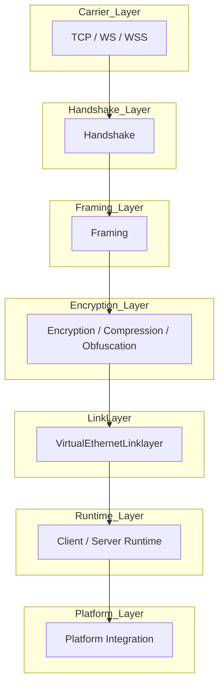
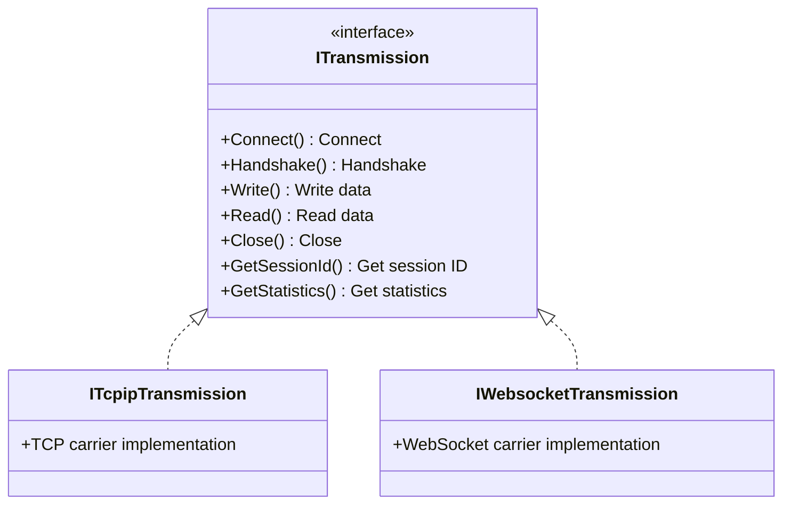
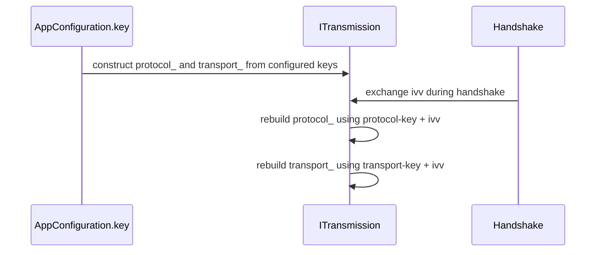
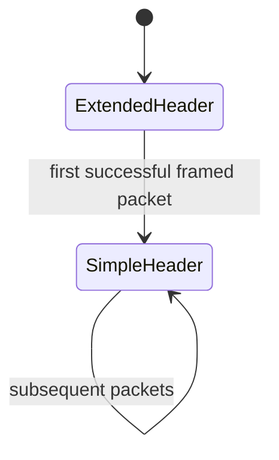
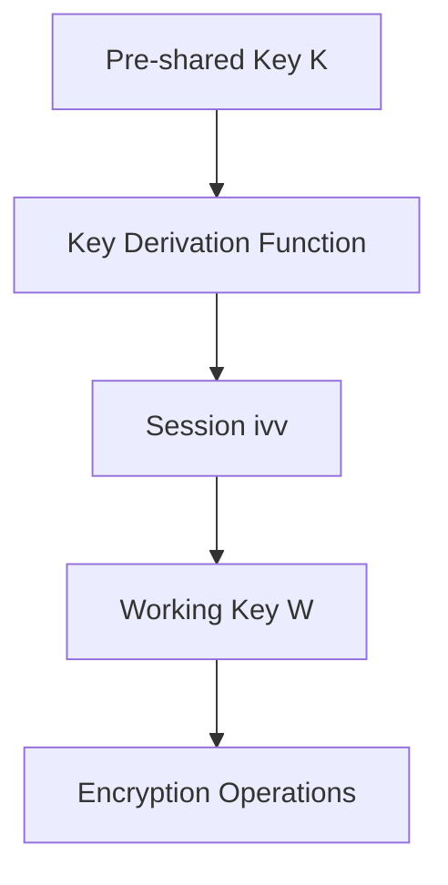
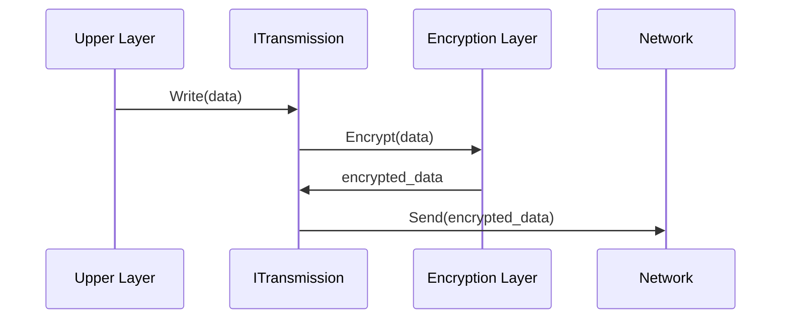
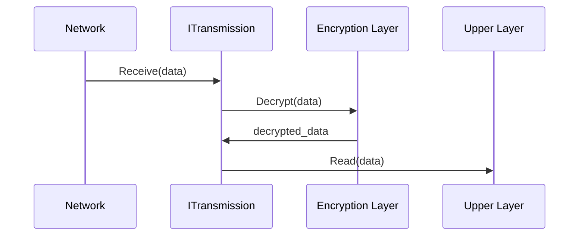
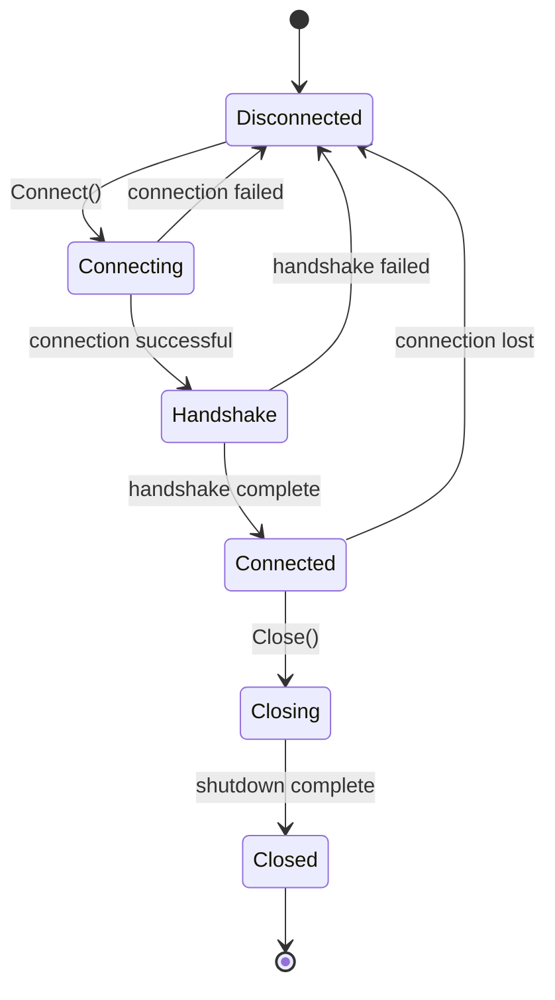
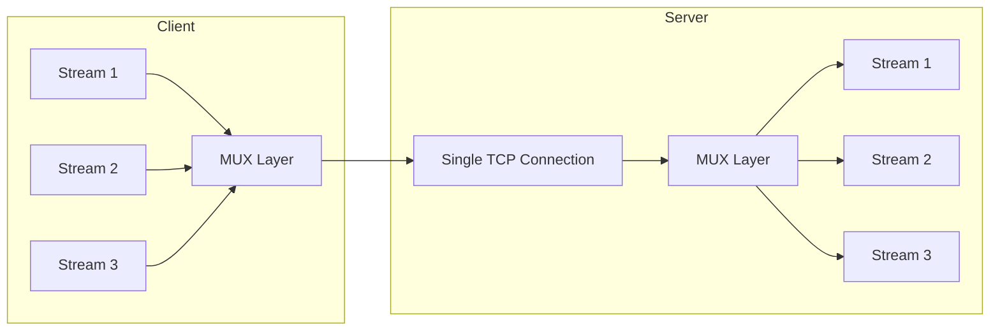
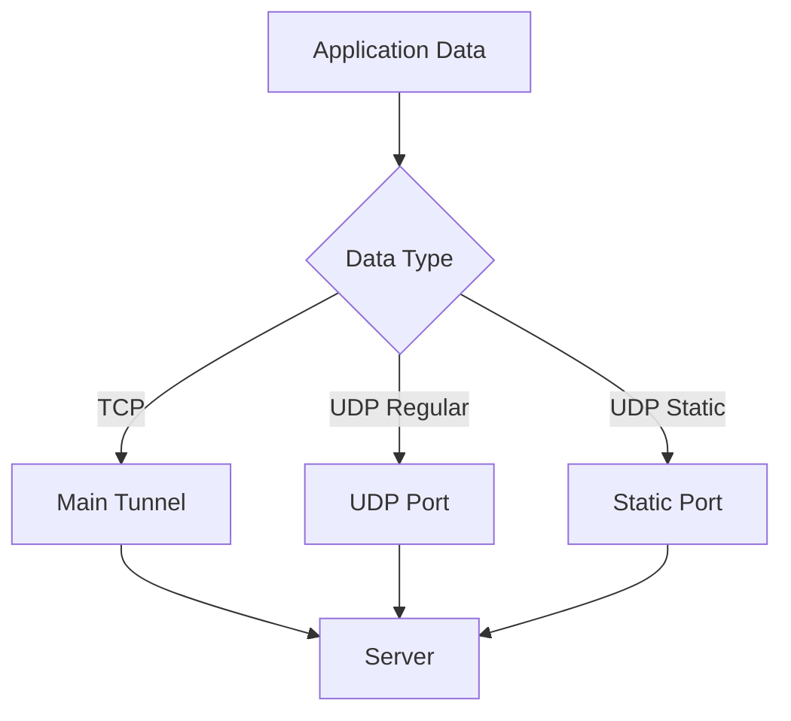

# Transport, Framing, And Protected Tunnel Model

[中文版本](TRANSMISSION_CN.md)

## Scope

This document explains the transport and framing core of OPENPPP2 from the code upward, not from product slogans downward. The intent is to let a reader understand what the transmission subsystem actually does, how it fits into the rest of the project, and why the implementation looks different from a typical "single socket plus a single crypto layer" design.

The core code entry points are:

- `ppp/transmissions/ITransmission.h`
- `ppp/transmissions/ITransmission.cpp`
- `ppp/transmissions/ITcpipTransmission.*`
- `ppp/transmissions/IWebsocketTransmission.*`
- `ppp/app/protocol/VirtualEthernetLinklayer.*`
- `ppp/app/protocol/VirtualEthernetPacket.*`

This document should be read together with:

- [HANDSHAKE_SEQUENCE.md](HANDSHAKE_SEQUENCE.md)
- [PACKET_FORMATS.md](PACKET_FORMATS.md)
- [SECURITY.md](SECURITY.md)
- [STARTUP_AND_LIFECYCLE.md](STARTUP_AND_LIFECYCLE.md)

## The Transmission Problem OPENPPP2 Is Solving

OPENPPP2 is not using the transport layer merely as a byte pipe. It needs the transmission subsystem to solve several problems at once:

| Requirement | Description |
|-------------|-------------|
| Multi-carrier support | Support TCP, WS, WSS and other carrier protocols |
| Protected channel | Establish a stateful protected channel before upper virtual Ethernet logic begins normal work |
| Strong framing | More aggressive packet boundary and packet length handling than simple length-prefixed framing |
| Carrier independence | Keep upper link-layer protocol independent of carrier type |
| Multi-mode support | Support both pre-handshake/handshake plaintext base94 framing and post-handshake binary framing |
| Key derivation | Derive per-connection working keys from long-lived configured key material plus handshake-time randomness |

That combination explains why the code in `ITransmission.cpp` looks denser than a conventional socket wrapper. The file simultaneously handles handshake sequencing, session-specific key shaping, dual-cipher state management, and multiple framing families. This is fundamentally different from the typical "one socket plus one TLS layer" approach found in many proxy and VPN implementations.

## Layering Model

To understand OPENPPP2, the system must be decomposed into distinct layers that each handle specific responsibilities:



### Layer Responsibilities

| Layer | Responsibility | Key Source Files |
|-------|---------------|------------------|
| Carrier Layer | TCP/WebSocket/WSS connection management and socket I/O | `ITcpipTransmission.*`, `IWebsocketTransmission.*` |
| Handshake Layer | Key exchange, session_id negotiation, and ivv generation | `ITransmission.cpp::Handshake`, `HandshakeClient`, `HandshakeServer` |
| Framing Layer | Data frame assembly, length-header encoding, safe parsing | `ITransmission.cpp::Write`, `Read`, base94 helpers |
| Encryption Layer | Cipher application, payload transforms, masking/shuffling/delta | `ITransmission.cpp::Encrypt`, `Decrypt` |
| Link-Layer | Tunnel control signaling, NAT, LAN, TCP relay, FRP, MUX | `VirtualEthernetLinklayer.*` |
| Runtime Layer | Client/server logic, DNS policy, routing decisions | `VEthernetExchanger.*`, `VirtualEthernetExchanger.*` |
| Platform Layer | Virtual network adapter and routing integration | Platform-specific code (Linux, Windows, macOS) |

This layered architecture ensures that each concern is handled at the appropriate abstraction level. The carrier layer knows nothing about encryption; the encryption layer knows nothing about the specific carrier being used. This separation of concerns allows the system to add new carriers (future QUIC support, for example) without modifying the protected transmission logic.

## Where ITransmission Sits

`ITransmission` is the protected transmission abstraction. It is not merely an interface in the abstract object-oriented sense. It is the place where the project centralizes several concrete behaviors:

- handshake sequencing and state management
- handshake timeout management with jitter
- post-handshake framed packet encryption and decryption using dual ciphers
- pre-handshake or plaintext-compatible base94 framing
- dual-cipher state ownership through `protocol_` and `transport_` slots
- dispatch into the actual socket read/write implementation owned by carrier-specific derived classes

That is why `ITransmission` is one of the most important files in the project. If a reader wants to understand how OPENPPP2 differs from a typical VPN or proxy product, `ITransmission.cpp` is one of the first places where that difference becomes visible. The file contains approximately 2000 lines of code that handle concerns many other systems distribute across separate libraries, TLS stacks, and fixed record layers.

## ITransmission Interface

### Core Interface Definition

`ITransmission` is the abstract interface defining all transport operations:



### Interface Methods Detail

| Method | Function | Description |
|--------|----------|------------|
| `Connect()` | Establish connection | Establishes transport-layer connection to server |
| `Handshake()`. | Perform handshake | Completes key exchange and session_id negotiation |
| `Write()` | Write data | Encrypts and sends data through carrier |
| `Read()` | Read data | Receives and decrypts data from carrier |
| `Close()` | Close connection | Shuts down transport connection gracefully |
| `GetSessionId()` | Get session ID | Returns current session's session_id |
| `GetStatistics()` | Get statistics | Returns transmission statistics |

## Carrier Layer Versus Protected Transmission Layer

The carrier decides how bytes move between peers. The protected transmission layer decides how OPENPPP2 turns those bytes into authenticated runtime state and later into tunnel packets.

This distinction matters because several external products often collapse these concerns differently. Some systems tightly bind their security story to one carrier style, one TLS stack posture, or one fixed record format. OPENPPP2 instead tries to keep:

- carrier flexibility below (TCP, WS, WSS as interchangeable carriers)
- its own protected tunnel formatting above (consistent framing regardless of carrier)

That does not automatically make it stronger. It makes it architecturally different. The burden then shifts to the implementation to ensure that the upper protected layer remains coherent regardless of whether the carrier is TCP, WS, or WSS. The project must test and verify that the framing logic works identically across all carriers.

## Transmission Types

### TCP Transmission

TCP transmission is the most basic carrier type, using native TCP connections:

| Parameter | Description | Default Value |
|-----------|-------------|---------------|
| `tcp.listen.port` | Server listen port | 20000 |
| `tcp.connect.timeout` | Connection timeout | 5 seconds |
| `tcp.inactive.timeout` | Inactive connection timeout | 300 seconds |
| `tcp.turbo` | TCP Turbo optimization | true |
| `tcp.fast-open` | TCP Fast Open (TFO) | true |
| `tcp.backlog` | Connection backlog queue | 511 |


TCP mode provides the most direct path between client and server with minimal overhead. The `tcp.turbo` option enables various kernel-level optimizations including TCP_NOPUSH and TCP_CORK combinations for reducing small packet overhead. The `tcp.fast-open` option enables TCP Fast Open, which allows data to be exchanged during the three-way handshake, reducing connection establishment latency by one RTT.

### WebSocket Transmission

WebSocket transmission supports operation in HTTP-constrained environments:

| Parameter | Description | Default Value |
|-----------|-------------|---------------|
| `ws.listen.port` | WS (unencrypted) listen port | 20080 |
| `wss.listen.port` | WSS (encrypted) listen port | 20443 |
| `ws.path` | WebSocket upgrade path | /tun |
| `ws.verify-peer` | Verify server certificate | true |


WebSocket mode is essential for environments where direct TCP connections are not available or are heavily interfered with. Many corporate proxies and firewalls allow HTTP traffic, making WebSocket a valuable fallback carrier. The upgrade mechanism follows RFC 6455 with OPENPPP2-specific subprotocol negotiation.

### WSS Encrypted Transmission

WSS (WebSocket Secure) provides encrypted WebSocket transport using TLS:

| Parameter | Description |
|-----------|-------------|
| `ssl.certificate-file` | SSL certificate file (PEM format) |
| `ssl.certificate-key-file` | SSL private key file (PEM format) |
| `ssl.ciphersuites` | Allowed cipher suites (OpenSSL format) |

WSS combines the HTTP camouflage benefits of WebSocket with TLS encryption at the carrier layer. This creates a layered defense model: the outer TLS layer protects the WebSocket traffic, while the inner OPENPPP2 encryption layers protect the tunnel payload. Even if the outer TLS is compromised, the inner payload remains protected by the dual-cipher OPENPPP2 system.

## Constructor-Time Cipher State

When an `ITransmission` instance is constructed, it checks whether the configuration has usable ciphertext settings. If so, it creates two cipher objects:

- `protocol_` - cipher for header metadata protection
- `transport_` - cipher for payload body protection

This is visible in the constructor in `ITransmission.cpp` where the runtime builds `Ciphertext` instances from:

- `configuration->key.protocol` - protocol cipher algorithm
- `configuration->key.protocol_key` - protocol cipher key material
- `configuration->key.transport` - transport cipher algorithm
- `configuration->key.transport_key` - transport cipher key material

These are not yet the final connection working keys in the strongest sense the code can provide. They are the initial configured cipher state. After the handshake exchanges a fresh `ivv`, both sides rebuild these cipher objects using the configured base keys plus the handshake-time `ivv` string.

That means the lifecycle is:



This is a crucial point for the security discussion. The code absolutely does perform connection-specific working-key derivation. It does not justify claiming standard public-key-agreement PFS by itself. Those are different statements. The distinction matters for accurate security documentation.

## Why Two Cipher Slots Exist

OPENPPP2 does not treat all bytes equally. The code distinguishes between:

- protocol-layer metadata protection (packet length, header fields)
- transport payload protection (actual tunnel data)

The protocol cipher is used around header metadata such as the protected length bytes. The transport cipher is used around the actual payload body. This division is what allows the implementation to say, in effect:

- packet body is one thing
- packet framing metadata is another thing

This is a recurring design pattern in the project. Similar separation appears elsewhere too, for example in the static packet format where header-body protection and payload protection are separately reasoned about. The design philosophy treats metadata differently from payload data because metadata leakage can reveal communication patterns even when payload content is protected.

## The Two Framing Families

There are really two transmission families in `ITransmission.cpp`:

### 1. Base94 Framing Family

This is used when either of these conditions is true:

- handshake has not completed yet
- `cfg->key.plaintext` is enabled (plaintext compatibility mode)

In that mode the code routes through the `base94_encode` and `base94_decode` helpers. The packet length header is expressed through base94 digits, and the first packet uses an extended header variant before later packets switch into a simplified header mode. This creates an intentional transition in header complexity over the lifetime of the connection.

### 2. Binary Protected Framing Family

This is used after handshake in the normal protected path when the runtime is not forced into plaintext behavior. In that mode the code routes through:

- `Transmission_Header_Encrypt(...)` - encrypt/protect length header
- `Transmission_Header_Decrypt(...)` - decrypt/verify length header
- `Transmission_Payload_Encrypt(...)` - encrypt payload
- `Transmission_Payload_Decrypt(...)` - decrypt payload
- `Transmission_Packet_Encrypt(...)` - encrypt full packet
- `Transmission_Packet_Decrypt(...)` - decrypt full packet

The result is a tighter fixed-size header plus a separately protected payload. This is the primary framing mode for established connections after successful handshake completion.

## Why Base94 Exists At All

The base94 path is not accidental legacy code. It serves a real role in the design:

- it gives the system a pre-handshake framing family that is distinct from the post-handshake binary family
- it supports the configured plaintext mode for compatibility with certain network configurations
- it allows the runtime to shape the traffic form of early packets differently from later packets
- it provides a fallback when full cipher support is not available

This is part of the project's traffic-shaping and compatibility story. It is not the same thing as modern authenticated encryption. It is a transport-format behavior that sits beside the cipher story, not instead of it. The base94 mode exists because some deployment scenarios require compatibility with systems that cannot handle full binary framing.

## Base94 Length Header: First Packet Versus Later Packets

One of the more interesting details in `ITransmission.cpp` is that the base94 header is not fixed for the life of the connection.

The writer side uses `frame_tn_`:

- if `frame_tn_` is false, it emits an extended header with additional validation fields
- once the first extended header is emitted, `frame_tn_` becomes true
- subsequent packets use the shorter simple header

The reader side mirrors this with `frame_rn_`:

- if `frame_rn_` is false, it expects the extended header form first
- once that parses and validates successfully, it flips to the simple header parser

This means the base94 path has an intentional transition:



That behavior matters for documentation because it is one of the places where the project's "dynamic frame word" idea is visible in actual code. The header shape is not totally static across the life of the connection - it starts more complex and simplifies after validation.

## Reading The Base94 Encoder Carefully

The helper `base94_encode_length(...)` reveals several design choices.

First, the encoded length is not written directly. Instead it is transformed using:

- the configuration's transmission-layer modulus from `Lcgmod(...)`
- a per-packet random factor `kf`
- base94 digit conversion (94 printable ASCII characters)

Second, the header injects:

- a random key byte for per-packet variation
- a filler byte for alignment
- a swap between positions `h[2]` and `h[3]` for byte-order obfuscation

Third, the first extended header adds a 3-byte checksum-like field derived from:

- the CRC-like checksum of the 4-byte simple part
- XOR with the original payload length
- obfuscation again through the modulus mapping and base94 conversion
- `shuffle_data` over the 3-byte extension

The first packet therefore does more than just communicate a length. It also establishes a stronger parse transition into the later simplified state. This validation ensures both sides are synchronized before switching to the lighter header format.

## Base94 Decoder Behavior

The base94 decoder follows the same idea in reverse.

`base94_decode_kf(...)` normalizes the first bytes and reverses the swap. Then the code chooses one of two length readers:

- `base94_decode_length_r1(...)` for the initial extended-header state
- `base94_decode_length_rn(...)` for the later simple-header state

In the initial state, the reader:

- reads the extended header
- computes a checksum over the first 4 bytes
- unshuffles the extension bytes
- decodes the extension field
- compares the derived value against the checksum XOR payload-length construction
- flips `frame_rn_` to true only after this passes

This is a very implementation-specific behavior that deserves explicit documentation because it explains why the early packet path is more expensive than later packets. The validation cost is intentional - it provides assurance that both parties have correctly synchronized their framing state before committing to the simplified format.

## Binary Header Protection

Once the normal protected binary framing path is in use, OPENPPP2 uses a compact fixed-size header.

The central helpers are:

- `Transmission_Header_Encrypt(...)`
- `Transmission_Header_Decrypt(...)`

The header contains three bytes before delta encoding:

- one random seed byte (for per-packet key derivation)
- two bytes for the payload length after an internal `-1` adjustment

The logic is layered:

1. payload length is decremented by one (to avoid zero-length packets)
2. the two length bytes may be encrypted with the protocol cipher
3. the two length bytes are XOR-masked with a per-packet `header_kf`
4. those two bytes are shuffled (byte-order permutation)
5. the three-byte header is delta-encoded using the global `key.kf`

In reverse, the reader:

1. delta-decodes the three-byte header
2. derives `header_kf` from `APP->key.kf ^ seed_byte`
3. unshuffles the two length bytes
4. XOR-unmasks them with `header_kf`
5. decrypts them through the protocol cipher if configured
6. reconstructs the payload length and adds the `+1` adjustment back

That is the practical meaning of "length protection" in this codebase. The length is never just sent in clear binary form once the protected path is active. This prevents traffic analysis based on packet size patterns.

## Why The Length Is Adjusted By One

The code decrements the payload length before header protection and adds one back during decoding. The in-file comment explains the reason:

- avoid zero-length packets in the protected framing path

Zero-length packets are a degenerate case that could cause parsing ambiguities. By shifting the range from [0, 65535] to [1, 65536], the code ensures that zero is never a valid payload length, making it可直接作为错误标志使用。 This is a small but useful example of the project's general style. Edge conditions are often normalized away early so the later logic can treat zero or invalid values as obvious failure cases.

## Payload Transform Pipeline

The payload path is split into partial transforms and optional delta encoding.

The outbound partial path applies, depending on state and configuration:

- `masked_xor_random_next` - rolling XOR masking
- `shuffle_data` - deterministic byte permutation

The full outbound payload path may then apply:

- `delta_encode` - differential encoding for repetitive patterns

The inbound side reverses this in the opposite order.

The important control flag is `safest`, which is defined as:

- `!transmission->handshaked_`

That means the early connection phase forces the conservative path even if the configuration might otherwise disable some transforms. In other words, before the session is fully handshaked, the implementation biases toward applying the more defensive formatting path. This ensures maximum obfuscation during the vulnerable early connection phase.

## The Meaning Of `masked`, `shuffle-data`, And `delta-encode`

These configuration booleans are easy to misunderstand if they are documented too casually.

They are not interchangeable - each serves a distinct purpose in the traffic shaping system.

### `masked`

Controls whether the payload is passed through `masked_xor_random_next`, which uses a rolling XOR-style masking step derived from the packet key factor. This creates non-deterministic output even for deterministic input.

### `shuffle-data`

Controls whether the payload bytes are shuffled with a deterministic, key-dependent permutation. This reorders bytes to break analysis based on byte position.

### `delta-encode`

Controls whether the payload is delta-encoded for transmission and correspondingly delta-decoded on receipt. This compresses repetitive patterns by transmitting differences rather than absolute values.

The point is not that any one of these is individually a magic shield. The point is that the protected transmission layer is shaping traffic through several orthogonal transforms in addition to any configured block or stream cipher implementation. Defense in depth through layered transformations.

## Encryption Layer

### Two-Layer Encryption

OPENPPP2 implements two-layer encryption at the transmission level:

| Layer | Key | Purpose |
|-------|-----|---------|
| Protocol Layer | `protocol-key` + `ivv` | Tunnel header metadata encryption |
| Transport Layer | `transport-key` + `ivv` | Transport payload body encryption |

### Supported Cipher Algorithms

| Algorithm | Key Length | Mode | Recommendation |
|-----------|------------|------|--------------|
| aes-128-cfb | 128 bits | CFB | Recommended |
| aes-256-cfb | 256 bits | CFB | Strongly Recommended |
| aes-128-gcm | 128 bits | GCM | Recommended |
| aes-256-gcm | 256 bits | GCM | Strongly Recommended |
| rc4 | Variable | RC4 | Not Recommended (Deprecated) |

### Key Derivation



The key derivation function combines the pre-shared configuration key with the session-specific `ivv` to produce unique working keys for each connection. This ensures that even if the pre-shared key is compromised, active sessions cannot be decrypted without additionally compromising the per-session `ivv`.

## Handshake Overview

The full handshake is described in detail in [HANDSHAKE_SEQUENCE.md](HANDSHAKE_SEQUENCE.md), but the transmission document still needs the transmission-layer view.

Client side:

1. send NOP handshake packets (dummy traffic)
2. receive real `session_id` from server
3. generate fresh `ivv` (128-bit random)
4. send `ivv` to server
5. receive `nmux` from server (multiplexing capability flag)
6. mark handshaked = true
7. rebuild `protocol_` and `transport_` ciphers using configured keys plus `ivv`

Server side:

1. send NOP handshake packets (dummy traffic)
2. send real `session_id` to client
3. generate and send `nmux` to client
4. receive `ivv` from client
5. mark handshaked = true
6. rebuild `protocol_` and `transport_` ciphers using configured keys plus `ivv`

The bit `nmux & 1` carries the mux flag indicating whether the connection supports MUX multiplexing.

## Dummy Handshake Packets

The handshake subsystem has a concept of dummy packets (NOP traffic).

In `Transmission_Handshake_Pack_SessionId(...)`:

- if `session_id` is zero, the high bit of the first random byte is set
- the rest of the payload becomes random-looking filler around a fake integer string

In `Transmission_Handshake_Unpack_SessionId(...)`:

- if the high bit is set, the packet is treated as dummy
- `eagin` is set to true
- the receiver ignores the packet and keeps reading

This is part of the handshake noise strategy. The first packets on the wire are not required to correspond one-for-one with the logical control items the peers ultimately care about. This creates uncertainty for observers trying to analyze the handshake.

## NOP Handshake Rounds

`Transmission_Handshake_Nop(...)` derives the number of dummy rounds from:

- `key.kl` (lower bound parameter)
- `key.kh` (upper bound parameter)

The code transforms them by shifting `1 << kl` and `1 << kh`, takes a random value in the range, and then scales it down by `ceil(rounds / (double)(175 << 3))`.

The purpose is not to create cryptographic strength by itself. The practical effect is to vary how much dummy traffic the peers exchange before the actual session identifiers are processed.

This is one of the key places where OPENPPP2 differs in flavor from mainstream "perform one deterministic authenticated handshake and then switch to records" systems. The project includes an explicit traffic-shaping prelude around its logical session establishment, making the connection appear less structured to observers.

## Handshake Timeout Discipline

The handshake is guarded by `InternalHandshakeTimeoutSet()` and `InternalHandshakeTimeoutClear()`.

The timeout duration is derived from:

- `configuration_->tcp.connect.timeout`
- optional jitter through `configuration_->tcp.connect.nexcept`

If the timer expires, the runtime:

- spawns a cleanup coroutine
- sends final handshake NOPs (graceful attempt)
- disposes the transmission object

This is a good example of the project's operational security posture. It does not merely fail the socket read. It actively cleans up half-open handshake state and tries to avoid lingering ambiguous sessions that could be used for probing attacks.

## Connection-Specific Key Derivation With `ivv`

The client generates `ivv` using a GUID-derived `Int128`. Both sides then serialize that `Int128` into a string and append it to the configured base keys before recreating the ciphers.

Conceptually the derivation looks like:

```
protocol_working_key  = protocol-key  + serialized(ivv)
transport_working_key = transport-key + serialized(ivv)
```

This means two important things are true at once.

### What can be said positively

- the working cipher state is connection-specific
- a fresh `ivv` reduces the risk that every connection uses an identical long-lived working key
- compromise analysis is better than if the runtime always reused the raw configured keys directly

### What must not be overstated

- the code shown here does not demonstrate a standard ephemeral public-key key agreement such as ECDHE
- therefore the documentation should not simply claim "modern standard PFS" without qualification

The correct code-grounded phrasing is:

- OPENPPP2 implements session-level dynamic working-key derivation
- this reduces static key reuse across connections
- this is not equivalent to claiming a public-key-agreement-based standard PFS proof model from the code shown here alone

## Packet Read And Write Lifecycle

### Write Flow



### Read Flow



## State Machine

### Connection States

| State | Description |
|-------|--------------|
| Disconnected | No connection established |
| Connecting | Currently establishing connection |
| Handshake | Performing handshake exchange |
| Connected | Fully established and handshaked |
| Closing | Graceful shutdown in progress |
| Closed | Connection terminated |



## Interaction With VirtualEthernetLinklayer

The transmission layer stops at "delivered bytes." It does not know whether those bytes represent:

- a keepalive (connection alive check)
- a LAN packet (local network traffic)
- a NAT action (NAT traversal control)
- a TCP relay segment (TCP relay protocol)
- an FRP mapping control message (reverse proxy mapping)
- a MUX control message (multiplexing protocol)
- a static mode payload (static UDP path)

That semantic interpretation belongs to `VirtualEthernetLinklayer` and its associated client/server runtime objects.

This separation is one of the reasons the system can add features like MUX or FRP mapping without redesigning the transmission header every time. The transmission layer only needs to deliver bytes safely and consistently, leaving semantic interpretation to higher layers.

## Interaction With Static Packet Mode

Static packet mode has its own packet format in `VirtualEthernetPacket.cpp`, but it still relies on the broader key and ciphertext model of the project.

There is a useful architectural symmetry here.

The normal transmission path uses:

- a protected length header
- payload transforms (masking, shuffling, delta)
- dual cipher slots (protocol + transport)

The static packet path uses:

- an obfuscated header length
- masked and shuffled header-plus-payload sections
- optional header-body encryption with the protocol cipher
- optional payload encryption with the transport cipher
- final delta encoding

So while the concrete layouts differ, the design instinct is similar: do not leave metadata and payload in a trivially transparent fixed form. Both paths apply multiple transformation layers.

## Multi-GEX (MUX)

### MUX Functionality

MUX allows multiplexing multiple data streams over a single connection:

| Parameter | Description | Default Value |
|-----------|-------------|---------------|
| `mux.connect.timeout` | MUX sub-connection timeout | 20 seconds |
| `mux.inactive.timeout` | MUX inactive timeout | 60 seconds |
| `mux.congestions` | Congestion window size | 134217728 bytes |
| `mux.keep-alived` | Keep-alive interval | [1, 20] seconds |

### MUX Data Flow



MUX provides significant efficiency gains for scenarios with many concurrent virtual connections. Instead of maintaining separate TCP connections for each tunneled stream, MUX bundles multiple streams over a single underlying transport connection, reducing connection overhead and improving throughput in high-latency environments.

## Static Path

### Static UDP

Static path provides an independent UDP data channel (typically for DNS and other latency-sensitive traffic):

| Parameter | Description | Default Value |
|-----------|-------------|---------------|
| `static.keep-alived` | Keep-alive interval | [1, 5] seconds |
| `static.dns` | DNS server functionality | true |
| `static.quic` | QUIC protocol support | true |
| `static.icmp` | ICMP echo functionality | true |
| `static.aggligator` | Aggregator count | 0 |
| `static.servers` | Static server list | [] |

### Data Path Selection



The static path allows certain traffic (typically DNS queries) to bypass the main tunnel entirely, reducing latency for time-sensitive queries while maintaining the encryption and obfuscation benefits of the main tunnel for bulk data transfer.

## Role Of Key Parameters (`kf`, `kh`, `kl`, `kx`, `sb`)

The transmission subsystem is shaped by the `key` block in the configuration model.

### `kf`

This is the most visible root factor in the framing code. It participates in:

- header key-factor derivation for per-packet variation
- base94 header obfuscation
- delta encoding and decoding
- static packet per-packet factor derivation
- LCG modulus computation for header-length mapping

### `kh` and `kl`

These primarily shape the NOP handshake range (number of dummy packets). They are normalized into the safe range `0..16` by `AppConfiguration.cpp`. The handshake noise level is directly controlled by these parameters.

### `kx`

This affects how much random padding can be injected into handshake session-id packets, increasing the variability of early traffic.

### `sb`

This is not directly exercised inside the main transmission framing functions, but it belongs to the same traffic-shaping family. It feeds buffer skateboarding behavior elsewhere in the runtime and should be documented as part of packet-shape variability, not as part of the formal cipher definition.

## Lcgmod And Header-Length Mapping

The configuration computes:

- `LCGMOD_TYPE_TRANSMISSION` - modulus for standard transmission path
- `LCGMOD_TYPE_STATIC` - modulus for static packet path

Those modulus values are later used to map real lengths into obfuscated transmitted values and back again. This is how the code can say, in effect, "length exists, but the transmitted representation is not the naked raw length."

This is not cryptographic authentication by itself. It is a packet-format transformation that makes the record shape less literal, preventing trivial traffic analysis based on packet size.

## Statistics

### Transmission Statistics

| Metric | Description |
|--------|--------------|
| bytes_sent | Total bytes sent |
| bytes_received | Total bytes received |
| packets_sent | Total packets sent |
| packets_received | Total packets received |
| errors | Error count |
| last_active | Last activity timestamp |

## Error Handling

### Common Errors

| Error | Cause | Handling |
|-------|-------|----------|
| Connection timeout | Network unreachable | Automatic reconnection |
| Handshake failure | Key mismatch or protocol error | Report error to caller |
| Encryption error | Invalid key state | Close connection |
| Frame error | Corrupted data | Terminate connection |

Errors are categorized by severity and source. Connection-level errors (timeouts, network failures) trigger automatic retry logic, while cryptographic errors and data corruption typically result in hard failure and connection termination to prevent security compromised states.

## Performance Optimization

### Optimization Parameters

| Parameter | Description | Recommended Value |
|-----------|-------------|------------------|
| `tcp.turbo` | TCP Turbo optimization | Enable |
| `tcp.fast-open` | TCP Fast Open | Enable |
| `tcp.cwnd` | Congestion window | 0 (auto-tune) |
| `tcp.rwnd` | Receive window | 0 (auto-tune) |
| `concurrent` | Concurrent threads | CPU core count |

### Optimization Recommendations

1. **Enable TCP Turbo**: Reduces small packet overhead by buffering
2. **Enable TCP Fast Open**: Eliminates one RTT from connection establishment
3. **Configure MUX**: Significantly improves efficiency on high-latency networks
4. **Tune Congestion Window**: Allow kernel auto-tuning for most scenarios
5. **Match Concurrent Threads**: Scale with available CPU cores

## Relation To Attack And Defense Discussion

From an attack-defense perspective, the transmission layer is important because it is where several defensive ideas converge:

- dummy handshake packets (handshake obfuscation)
- per-connection working-key derivation (key diversification)
- length-field protection (metadata confidentiality)
- early-session conservative transform path (defense in depth)
- timeout-driven disposal of incomplete handshakes (clean session management)
- multiple formatting transforms beyond raw payload encryption (layered defense)

At the same time, discipline is necessary. Documentation must not overclaim.

The code supports saying that OPENPPP2 is doing more than "AES over a socket." It does not support saying that every part of this stack is equivalent to a modern, formally analyzed AEAD+ephemeral-key-exchange record protocol unless the missing proof elements are shown elsewhere in the codebase.

## Comparison Framing

The documentation should clarify how OPENPPP2 differs from common VPN or proxy families such as Trojan, Shadowsocks, Hysteria, VMess-related stacks, or XTLS-related stacks.

The safest code-grounded way to explain the difference is not to make ranking claims. It is to state the structural distinction.

OPENPPP2 differs in that it combines, in one runtime:

- a virtual Ethernet overlay data plane
- a dual-layer protected transmission format (protocol + transport ciphers)
- client and server route and DNS policy control
- FRP-style reverse mapping (incoming connection relay)
- static packet mode (UDP bypass)
- MUX sub-link management (connection multiplexing)
- platform-specific adapter integration

That means its transmission layer exists inside a broader infrastructure system, not inside a narrowly scoped "one inbound one outbound proxy stream" model. It's a full virtual network solution rather than a simple proxy.

## How To Read The Code In Order

For this subsystem, the most productive reading order is:

1. `ITransmission` constructor and member fields
2. `HandshakeClient` and `HandshakeServer` classes
3. `InternalHandshakeClient` and `InternalHandshakeServer` implementations
4. `Transmission_Handshake_Nop` - dummy packet generation
5. `Transmission_Handshake_Pack_SessionId` and `Transmission_Handshake_Unpack_SessionId` - session ID handling
6. `Transmission_Header_Encrypt` and `Transmission_Header_Decrypt` - header protection
7. `Transmission_Payload_Encrypt` and `Transmission_Payload_Decrypt` - payload protection
8. `Transmission_Packet_Encrypt` and `Transmission_Packet_Decrypt` - full packet handling
9. base94 helpers and the `frame_tn_` / `frame_rn_` transition state machine
10. caller paths in the client/server exchangers (VEthernetExchanger, VirtualEthernetExchanger)

If a reader follows that order, the transmission design becomes far less opaque. The progressive complexity builds naturally from basic abstractions to full-featured transmission.

## Engineering Conclusions

The transport and transmission design of OPENPPP2 is unusual not because it uses impossible new primitives, but because it composes several runtime concerns in one place:

- carrier abstraction (TCP, WS, WSS)
- handshake noise (NOP traffic shaping)
- connection-specific key shaping (session-level key diversification)
- dual-cipher framing (protocol + transport protection)
- metadata and payload transformation (masking, shuffling, delta)
- transition from early-session format to later-session format (dynamic header complexity)

That is the real reason the file feels dense. It is doing the work that many simpler systems distribute across TLS libraries, fixed record layers, and feature-specific extensions. This integration is both the project's strength and its complexity burden.

## Related Documents

| Document | Description |
|----------|--------------|
| [HANDSHAKE_SEQUENCE.md](HANDSHAKE_SEQUENCE.md) | Handshake sequence and session establishment |
| [PACKET_FORMATS.md](PACKET_FORMATS.md) | Packet format and wire layout |
| [SECURITY.md](SECURITY.md) | Security model and key management |
| [CLIENT_ARCHITECTURE.md](CLIENT_ARCHITECTURE.md) | Client architecture |
| [SERVER_ARCHITECTURE.md](SERVER_ARCHITECTURE.md) | Server architecture |
| [LINKLAYER_PROTOCOL.md](LINKLAYER_PROTOCOL.md) | Link-layer protocol specification |