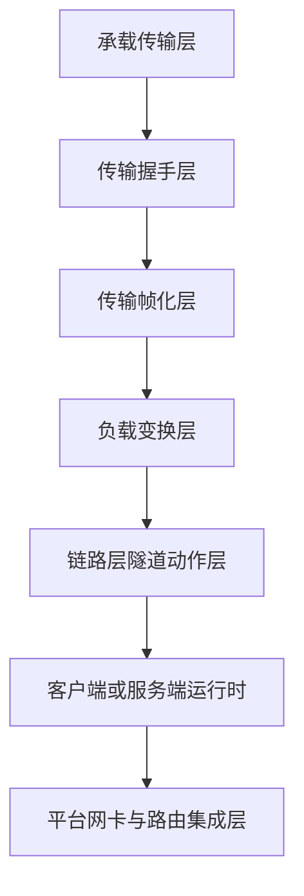
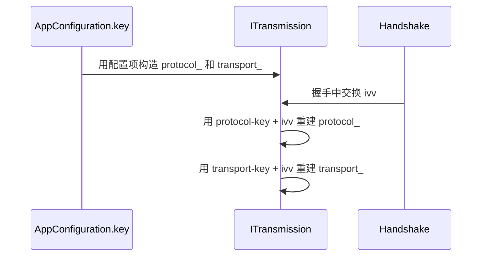
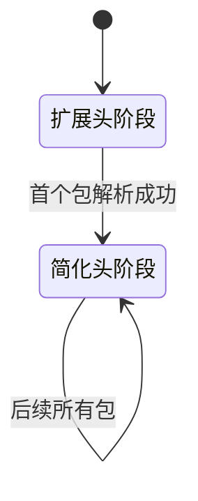
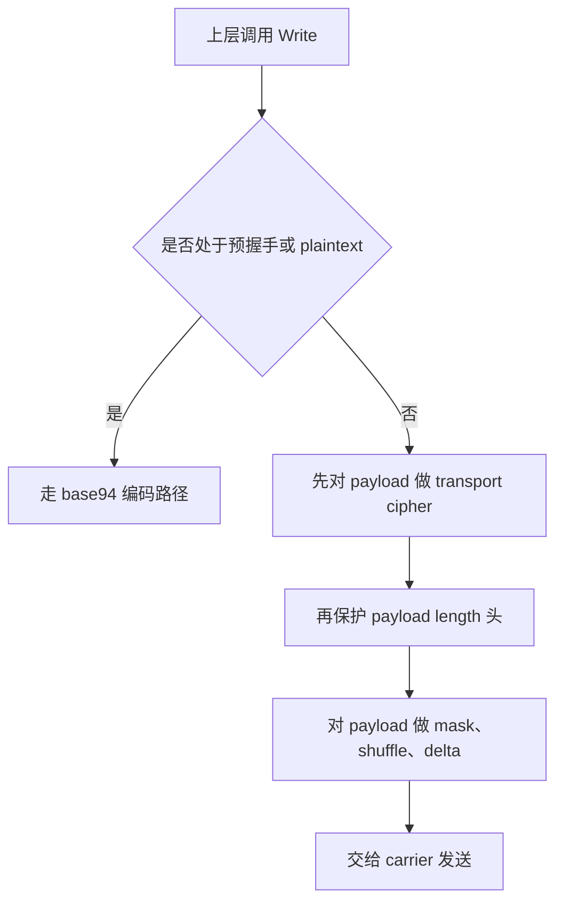
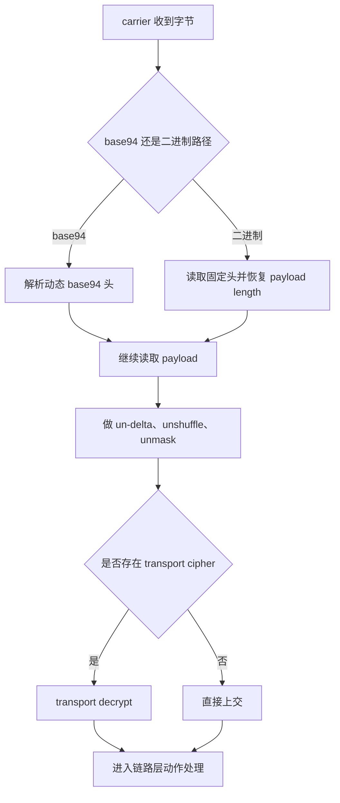

# 传输、帧化与受保护隧道模型

[English Version](TRANSMISSION.md)

## 文档范围

本文从代码实现出发，而不是从产品宣传语言出发，解释 OPENPPP2 的传输与帧化核心。目标不是笼统地说“它有一层加密”，而是让读者真正理解：这个传输子系统到底在做什么、它和整个工程如何配合、为什么实现方式和常见的“一个 socket 加一层简单加密”设计不同。

本文的核心代码入口是：

- `ppp/transmissions/ITransmission.h`
- `ppp/transmissions/ITransmission.cpp`
- `ppp/transmissions/ITcpipTransmission.*`
- `ppp/transmissions/IWebsocketTransmission.*`
- `ppp/app/protocol/VirtualEthernetLinklayer.*`
- `ppp/app/protocol/VirtualEthernetPacket.*`

建议配合以下文档一起阅读：

- [`HANDSHAKE_SEQUENCE_CN.md`](HANDSHAKE_SEQUENCE_CN.md)
- [`PACKET_FORMATS_CN.md`](PACKET_FORMATS_CN.md)
- [`SECURITY_CN.md`](SECURITY_CN.md)
- [`STARTUP_AND_LIFECYCLE_CN.md`](STARTUP_AND_LIFECYCLE_CN.md)

## OPENPPP2 想在传输层解决什么问题

OPENPPP2 不是把传输层当作一个单纯的字节管道。它要求这个子系统同时解决多个问题：

- 支持 TCP、WS、WSS 等多种承载
- 在上层虚拟以太网动作开始正常工作前，先建立一条有状态的受保护通道
- 相比简单的明文长度前缀帧，做更强的包长和帧形态处理
- 让上层链路协议尽量独立于 carrier 类型
- 同时支持预握手阶段或 plaintext 模式下的 base94 帧族
- 用长期配置密钥材料加握手期随机量，派生连接级工作密钥

正因为它在一个文件里同时承担这些工作，所以 `ITransmission.cpp` 看起来会比普通 socket 包装器复杂得多。

## 分层模型

如果要读懂 OPENPPP2，必须把几个层次拆开理解。



它们大致对应：

- 承载传输层：TCP、WS、WSS 以及对应 socket I/O
- 握手层：会话接纳、连接级密钥整形
- 帧化层：长度头保护、安全解析、负载封装
- 负载变换层：masked XOR、shuffle、delta encode/decode、可选 cipher
- 链路动作层：NAT、LAN、SENDTO、ECHO、TCP relay、FRP 控制、static、MUX
- 运行时集成层：`VEthernetExchanger`、`VirtualEthernetExchanger`、`VEthernetNetworkSwitcher`、`VirtualEthernetSwitcher`

这个工程最常见的阅读误区，就是把这些全部混在一起，统称成“协议”。这种表述太粗糙，会导致后续所有理解都变形。

## `ITransmission` 在体系中的位置

`ITransmission` 是受保护传输抽象，但它不只是一个抽象接口。它实际上集中承载了几件非常具体的行为：

- 握手编排
- 握手超时管理
- 握手后常规二进制帧的加解密
- 预握手或 plaintext 模式下的 base94 帧化
- 通过 `protocol_` 与 `transport_` 维护双 cipher 状态
- 把真正的收发落到派生类的 carrier I/O 上

因此 `ITransmission.cpp` 是这个工程最关键的文件之一。如果读者想理解 OPENPPP2 和多数主流隧道/代理软件在设计上的差异，这里必须深入阅读。

## 承载层与受保护传输层的边界

carrier 决定的是“字节如何移动”。受保护传输层决定的是“OPENPPP2 如何把这些字节变成会话、帧和后续隧道负载”。

这个边界特别重要，因为很多外部产品会把安全故事强绑定到：

- 某一种 carrier
- 某一种 TLS 记录格式
- 某一种固定包格式

而 OPENPPP2 试图保持的是：

- 下层 carrier 可以变化
- 上层受保护隧道格式保持自洽

这并不天然意味着它更强，而是意味着它的架构目标不同。这样设计的代价就是：上层传输保护层必须自己把行为定义清楚，不能完全依赖底层 carrier 替它完成所有工作。

## 构造阶段的初始密钥状态

`ITransmission` 构造时，会检查配置里是否存在可用的 ciphertext 设置。如果存在，就构造两个 cipher 对象：

- `protocol_`
- `transport_`

它们来自：

- `configuration->key.protocol`
- `configuration->key.protocol_key`
- `configuration->key.transport`
- `configuration->key.transport_key`

但要注意：这里还不是握手之后最终的连接级工作密钥状态。它只是“以配置为基础初始化”的 cipher 状态。等握手交换出新的 `ivv` 后，双方会重新创建 cipher，把 `ivv` 字符串拼接到基础密钥后面，形成连接级的工作密钥材料。

整个生命周期可以理解成：



这对安全文档非常关键。我们可以明确说它实现了连接级动态工作密钥派生，但不能把这句话直接偷换成“已经证明具备现代公钥临时协商意义上的标准 PFS”。

## 为什么要有两个 cipher 槽位

OPENPPP2 不把所有字节一锅端。它明确区分：

- 协议层元数据保护
- 传输负载保护

协议层密钥主要用于保护帧头元数据，比如长度头。传输层密钥主要用于保护真正的业务负载。这样做的意义是：

- 包头元数据和业务负载不是同一类东西
- 元数据保护可以和负载保护分开演进

这也是这个工程的一个典型风格：不是所有安全和格式化动作都堆在同一个字节块上，而是尽量分层处理。

## 两套帧族

在 `ITransmission.cpp` 里，实际上存在两套不同的传输帧族。

### 1. base94 帧族

满足以下任意条件时会走这条路径：

- 握手尚未完成
- `cfg->key.plaintext` 为真

此时数据会经过 `base94_encode` 和 `base94_decode` 逻辑。长度头不再是简单二进制，而是 base94 数字串。更重要的是，连接的第一个包和后续包不是完全同一种头格式。

### 2. 常规二进制受保护帧族

在握手完成后的正常模式下，如果没有被 plaintext 强制拉回 base94 路径，则数据走常规受保护二进制路径，核心函数是：

- `Transmission_Header_Encrypt`
- `Transmission_Header_Decrypt`
- `Transmission_Payload_Encrypt`
- `Transmission_Payload_Decrypt`
- `Transmission_Packet_Encrypt`
- `Transmission_Packet_Decrypt`

这条路径会生成一个固定长度的小头，然后对负载做独立保护与变换。

## 为什么要存在 base94

base94 不是一个历史包袱，而是有明确作用：

- 给预握手阶段提供一套不同于握手后常规二进制的帧族
- 支持 plaintext 模式
- 让早期包和后续包的帧形态可以变化

它是这个工程“流量形态控制”和“兼容性控制”能力的一部分。它不等价于现代 AEAD，也不应被错误描述成“所有安全性都来自 base94”。它是格式层行为，不是全部安全模型本身。

## base94 长度头的两阶段行为

`ITransmission.cpp` 中很有代表性的一个细节是：base94 头不是连接全程固定不变的。

发送侧用 `frame_tn_` 控制：

- 当 `frame_tn_` 为假时，发送扩展头
- 发送完第一个扩展头后，把 `frame_tn_` 置真
- 之后的包改用简化头

接收侧用 `frame_rn_` 镜像这个行为：

- 当 `frame_rn_` 为假时，按扩展头解析
- 首次扩展头校验通过后，切换到简化头模式

所以 base94 帧的真实状态迁移是：



这正是后续文档里要反复强调的“动态帧字 / 动态帧头行为”之一。它不是每个包都永远同构。

## 仔细看 base94 编码器

`base94_encode_length(...)` 暴露了几层设计思路。

第一，编码的不是“直接长度”，而是经过以下因素整形后的值：

- `Lcgmod(...)` 给出的 transmission modulus
- 当前包的 `kf`
- base94 数字变换

第二，头部里会注入：

- 随机 key byte
- filler byte
- `h[2]` 和 `h[3]` 的交换

第三，第一个扩展头还会额外携带一个 3 字节的扩展校验段，它来源于：

- 前 4 字节的 checksum
- 再与原始 payload length 做 XOR
- 然后再次做 modulus 映射和 base94 变换
- 最后对这 3 字节做 `shuffle_data`

因此第一个包不只是“传个长度”，而是顺便完成了从扩展状态切到简化状态所需的额外校验。

## base94 解码器的行为

base94 解码器是同一思路的逆过程。

`base94_decode_kf(...)` 会先把前几个字节归一化，并把交换过的位置换回来。之后根据当前状态选择：

- `base94_decode_length_r1(...)`，用于首个扩展头阶段
- `base94_decode_length_rn(...)`，用于后续简化头阶段

在扩展头阶段，接收侧会：

- 读取扩展头
- 对前 4 字节计算 checksum
- 对扩展 3 字节做 `unshuffle_data`
- 解码扩展字段
- 把扩展字段恢复出的值和 checksum XOR payload-length 的结果比对
- 只有成功后才把 `frame_rn_` 置真

这也是为什么预握手或 plaintext 早期包的处理开销会高于后续包。

## 常规二进制头部保护

握手后的常规二进制路径使用的是一套更紧凑的固定小头。

核心函数是：

- `Transmission_Header_Encrypt(...)`
- `Transmission_Header_Decrypt(...)`

在 delta encode 之前，这个头部本质上只有 3 字节：

- 一个随机 seed byte
- 两个表示 payload length 的字节

但它不是直接裸发。完整逻辑是：

1. payload length 先减一
2. 这两个长度字节如果配置了 protocol cipher，会先被 protocol cipher 处理
3. 然后再用 `header_kf` 做 XOR 掩码
4. 再对长度字节做 `shuffle_data`
5. 最后整个 3 字节头再经过 `delta_encode`

接收侧逆过程是：

1. 对 3 字节头先做 `delta_decode`
2. 用 `APP->key.kf ^ seed_byte` 恢复 `header_kf`
3. 对两个长度字节做 `unshuffle_data`
4. 再用 `header_kf` 做 XOR 解掩码
5. 如果有 protocol cipher，则继续解密长度字节
6. 恢复真实 payload length，再把之前减去的 1 加回来

这就是代码层面真正的“长度保护”。它不是把长度直接明文塞在固定头里。

## 为什么长度要先减一

代码里有一句注释非常值得注意：

- `65536 → 65535 (avoid zero-length packets)`

也就是说，长度在进入头部保护流程前会先减一，目的就是尽量避免后续出现零长度包这个边界情形。这个小细节非常符合 OPENPPP2 的实现风格：先把边界值规整掉，再让后面的解析路径尽量把零值或非法值当成明显异常处理。

## 负载变换流水线

负载路径被拆成“局部变换”和“可选 delta encode”两段。

发送侧局部变换会按状态和配置依次应用：

- `masked_xor_random_next`
- `shuffle_data`

之后完整发送路径还可能继续应用：

- `delta_encode`

接收侧则严格按逆序回退。

其中最重要的控制变量之一是 `safest`，它定义为：

- `!transmission->handshaked_`

这意味着在握手尚未完成的阶段，即使某些配置想关闭部分变换，代码仍会强制走更保守的路径。换句话说，早期连接阶段默认更“谨慎”。

## `masked`、`shuffle-data`、`delta-encode` 分别表示什么

如果文档写得太粗，这三个开关很容易被误解成“都是混淆”。实际上它们不是一回事。

### `masked`

控制是否对 payload 做 `masked_xor_random_next`。它是一种基于当前包 key factor 的滚动 XOR 式掩码处理。

### `shuffle-data`

控制是否对 payload 做密钥相关的字节重排。

### `delta-encode`

控制 payload 是否在发送前做 delta encode，在接收时做 delta decode。

因此正确理解应该是：它们提供的是不同方向的格式变换与扰动，不应被笼统地混成一句“做了混淆”。

## 握手总览

完整握手序列会在 [`HANDSHAKE_SEQUENCE_CN.md`](HANDSHAKE_SEQUENCE_CN.md) 里单独展开，但在传输文档里至少要把传输层视角说清楚。

客户端侧流程：

1. 先发 NOP 握手包
2. 接收真实 `session_id`
3. 生成新的 `ivv`
4. 发送 `ivv`
5. 接收 `nmux`
6. 标记握手成功
7. 用基础 key 加 `ivv` 重建 `protocol_` 与 `transport_`

服务端侧流程：

1. 先发 NOP 握手包
2. 发送真实 `session_id`
3. 生成并发送 `nmux`
4. 接收 `ivv`
5. 标记握手成功
6. 用基础 key 加 `ivv` 重建 `protocol_` 与 `transport_`

其中 `nmux & 1` 表示 mux 标记位。

## dummy 握手包

握手系统里有 dummy packet 的概念。

在 `Transmission_Handshake_Pack_SessionId(...)` 中：

- 如果 `session_id == 0`，首字节最高位会被置 1
- 包体则会构造成带随机填充的伪整数串

在 `Transmission_Handshake_Unpack_SessionId(...)` 中：

- 如果最高位为 1，就把它当作 dummy
- `eagin = true`
- 接收方直接跳过，继续读下一包

这说明握手期前几包在网络上并不一定一一对应真正的逻辑控制元素。它本来就包含显式的噪声与扰动。

## NOP 握手轮数

`Transmission_Handshake_Nop(...)` 会根据：

- `key.kl`
- `key.kh`

来决定 dummy 握手轮数。

代码会先做：

- `1 << kl`
- `1 << kh`

然后在区间里取随机值，再按 `ceil(rounds / (double)(175 << 3))` 缩放。

它的意义不是单独提供密码学强度，而是让真正的会话建立前先有一段可变的握手噪声阶段。

这也是 OPENPPP2 和很多“一个确定性握手然后直接进记录层”的主流协议相比，在气质上的显著差异之一。这里显式加入了流量形态扰动前奏。

## 握手超时纪律

握手受以下函数约束：

- `InternalHandshakeTimeoutSet()`
- `InternalHandshakeTimeoutClear()`

超时时间来自：

- `configuration_->tcp.connect.timeout`
- 以及 `configuration_->tcp.connect.nexcept` 带来的抖动

一旦握手超时，运行时不会只是“读失败了就算了”，而是会：

- 派生协程
- 再发送一次握手 NOP
- 然后主动 `Dispose()`

这体现了工程的一个鲜明特征：它非常强调半开握手状态的清理，而不是容忍模糊不清的残留连接。

## `ivv` 连接级工作密钥派生

客户端使用 GUID 生成新的 `Int128`，再把它作为 `ivv` 发送给服务端。握手完成后，双方都会把这个 `ivv` 序列化成字符串，拼接到基础 key 后面，重新构造 cipher。

概念上近似于：

```text
protocol_working_key  = protocol-key  + serialized(ivv)
transport_working_key = transport-key + serialized(ivv)
```

这里有两个必须同时成立的结论。

### 可以明确写出来的正面事实

- 工作密钥是连接级的，不是所有连接永远共用同一份静态工作密钥
- 新的 `ivv` 降低了长期直接复用基础 key 作为工作 key 的问题
- 比“所有连接直接重用同一把静态 key”更好

### 不能夸大的部分

- 当前展示出来的代码没有体现标准临时公钥协商，例如 ECDHE
- 因此不能不加限定地宣称达到了现代公钥临时协商意义上的标准 PFS

所以正确、谨慎、忠于代码事实的写法应该是：

- OPENPPP2 实现了会话级动态工作密钥派生
- 这可以降低长期静态工作密钥复用
- 但这不等价于直接宣称它已经具备标准公钥协商模型下的 PFS 证明语义

## `protocol_` 与 `transport_` 的协作关系

只要看一遍 `Transmission_Packet_Encrypt(...)` 就能明白这两个槽位为什么不是多余的。

当二者都存在时，发送路径是：

1. 先用 transport cipher 加密 payload
2. 再用 protocol cipher 保护头部长度信息
3. 最后再用 header 导出的 key factor 对 payload 做额外格式变换

当 cipher 不可用时，仍然会保留：

1. 头部变换路径
2. payload 的 masked、shuffle、delta 等变换路径

这说明一个很关键的实现立场：这个工程不把“帧化 / 流量形态控制”和“cipher 是否启用”完全绑定成一件事。

## 数据包读写生命周期

受保护传输层的写路径大致可以表示为：



读路径大致为：



## 它和 `VirtualEthernetLinklayer` 的关系

传输层负责把“字节安全地、稳定地、按格式交上来”。它不关心这些字节在语义上到底是：

- keepalive
- LAN 包
- NAT 动作
- TCP relay 片段
- FRP 映射控制
- MUX 控制消息
- static 模式数据

这些都属于 `VirtualEthernetLinklayer` 的语义范围。

正因为语义层和传输层分离，工程才能在不重写底层传输头格式的前提下，持续往上层加新动作，例如 MUX 或 mapping。

## 它和 static packet mode 的关系

static packet mode 在 `VirtualEthernetPacket.cpp` 里有独立包格式，但它并没有脱离整个项目的密钥和 ciphertext 体系。

实际上这两条路径存在很强的“设计对称性”。

常规 transmission 路径有：

- 长度头保护
- payload 变换
- 双 cipher 槽位

static packet 路径有：

- header length 混淆
- 对 `session_id` 之后整段做 masked 和 shuffle
- 对 header body 做可选 protocol cipher
- 对 payload 做可选 transport cipher
- 最后再做 delta encode

所以两条路径的具体字节布局不同，但背后的设计思路是高度一致的：不要让头部和 payload 长期保持过于直白、固定、可预测的裸形态。

## `kf`、`kh`、`kl`、`kx`、`sb` 在这里分别扮演什么角色

传输子系统的很多行为都来自 `key` 配置块。

### `kf`

这是整个传输格式层最显眼的根因子之一。它参与：

- header key-factor 推导
- base94 头长度混淆
- delta encode/decode
- static 包 per-packet key factor 计算
- header length 的 modulus 映射

### `kh` 和 `kl`

主要影响 NOP 握手范围，它们在 `AppConfiguration.cpp` 中被限制到 `0..16`。

### `kx`

影响握手期 session-id 包里随机填充的规模。

### `sb`

它虽然不直接出现在常规 `ITransmission` 帧化主函数里，但它属于同一家族的“包形态 / 缓冲形态动态化”控制量，会影响 `BufferSkateboarding` 一类行为，应该在安全与流量形态文档中作为整体一部分解释，而不是孤立理解。

## `Lcgmod` 与长度映射

配置阶段会计算：

- `LCGMOD_TYPE_TRANSMISSION`
- `LCGMOD_TYPE_STATIC`

这些 modulus 值稍后会被用于把真实长度映射成传输表示，再从传输表示逆映射回来。其含义是：

- 长度当然存在
- 但线上传输的不是“赤裸裸的原始长度值”

这本身不等于加密认证，但它是帧格式保护的一部分。

## 和攻防讨论的关系

从攻防对抗视角看，传输层非常关键，因为多个防御思路在这里汇合：

- dummy 握手包
- 连接级工作密钥派生
- 长度头保护
- 预握手阶段强制保守路径
- 握手超时主动清理
- 除 cipher 外还有多层格式变换

但同时必须保持纪律。文档要坚决避免夸大。

从代码可以明确看出，OPENPPP2 绝不是“一个 AES 套在 socket 上”的简单实现。可它也不能因此被不加限定地说成“等同于带临时公钥协商、带形式化分析的现代 AEAD record 协议栈”。正确写法必须以代码实际提供的能力为准。

## 如何做对外比较

用户要求说明 OPENPPP2 和 Trojan、Shadowsocks、Hysteria、VMess 系、XTLS 系等主流协议或软件的不同点。最稳妥、最忠于代码事实的写法不是去做强弱排名，而是说明结构差异。

OPENPPP2 的显著区别在于，它把以下能力放进了同一个运行时：

- 虚拟以太网 overlay 数据面
- 双层受保护传输格式
- 客户端与服务端的路由 / DNS 策略控制
- FRP 风格反向映射
- static packet path
- MUX 子链路管理
- 平台特化网卡与系统路由集成

也就是说，它的传输层不是孤立存在的“代理流量保护层”，而是服务于一个更大的基础设施运行时。

## 推荐的源码阅读顺序

如果想真正读懂这个子系统，建议按下面顺序看：

1. `ITransmission` 的构造函数和成员字段
2. `HandshakeClient` 与 `HandshakeServer`
3. `InternalHandshakeClient` 与 `InternalHandshakeServer`
4. `Transmission_Handshake_Nop`
5. `Transmission_Handshake_Pack_SessionId` 与 `Transmission_Handshake_Unpack_SessionId`
6. `Transmission_Header_Encrypt` 与 `Transmission_Header_Decrypt`
7. `Transmission_Payload_Encrypt` 与 `Transmission_Payload_Decrypt`
8. `Transmission_Packet_Encrypt` 与 `Transmission_Packet_Decrypt`
9. base94 系列辅助函数以及 `frame_tn_` / `frame_rn_` 的状态迁移
10. 再去看 client/server exchanger 如何调用这些接口

只要按这个顺序读，原本显得很“绕”的逻辑会迅速清晰很多。

## 工程结论

OPENPPP2 的传输设计之所以特殊，不是因为它发明了无法理解的新原语，而是因为它把多类职责组合在了一起：

- carrier 抽象
- 握手噪声
- 连接级密钥整形
- 双 cipher 帧化
- 元数据与 payload 变换
- 从早期帧形态向后期帧形态切换

这也是为什么 `ITransmission.cpp` 显得密度很高。很多更简单的系统把这些职责分别交给 TLS、固定记录层和更小的功能面去承担，而 OPENPPP2 在自身运行时里承担了相当大一部分。

## 相关文档

- [`HANDSHAKE_SEQUENCE_CN.md`](HANDSHAKE_SEQUENCE_CN.md)
- [`PACKET_FORMATS_CN.md`](PACKET_FORMATS_CN.md)
- [`SECURITY_CN.md`](SECURITY_CN.md)
- [`LINKLAYER_PROTOCOL_CN.md`](LINKLAYER_PROTOCOL_CN.md)
