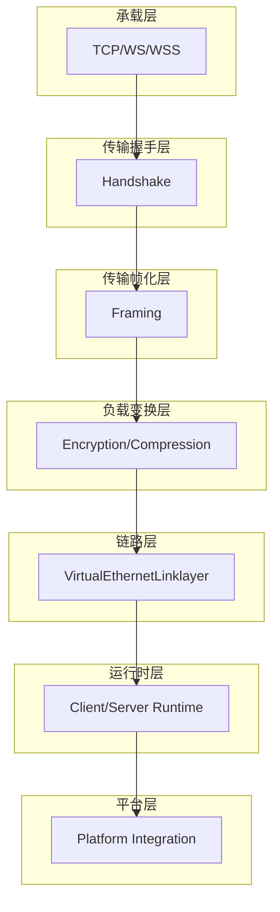
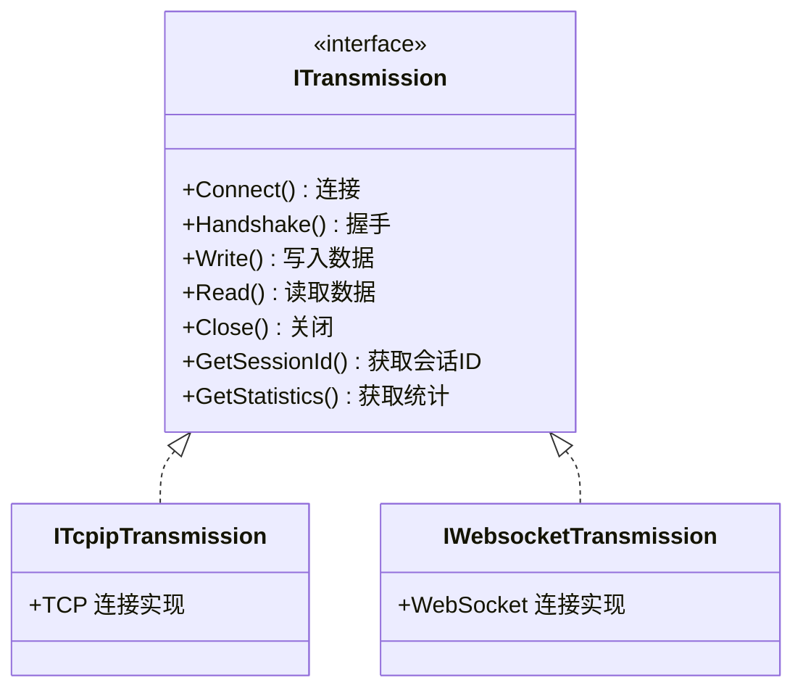
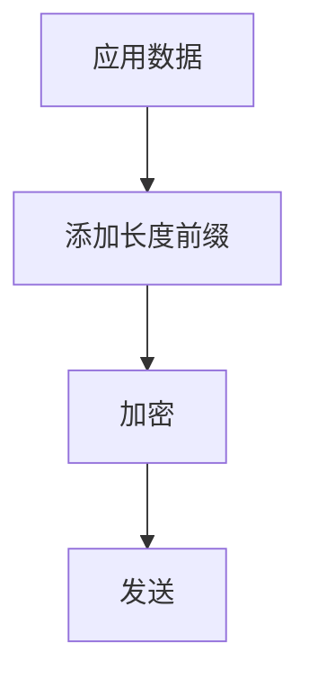
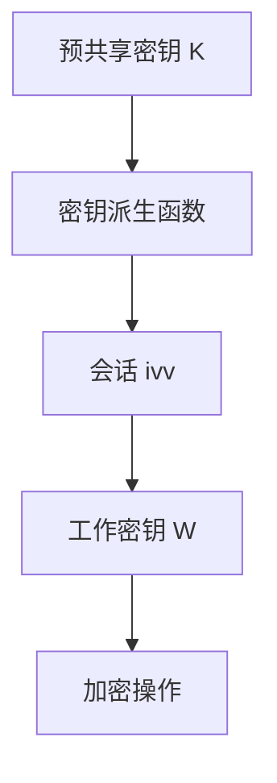
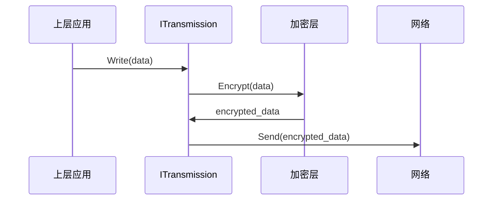
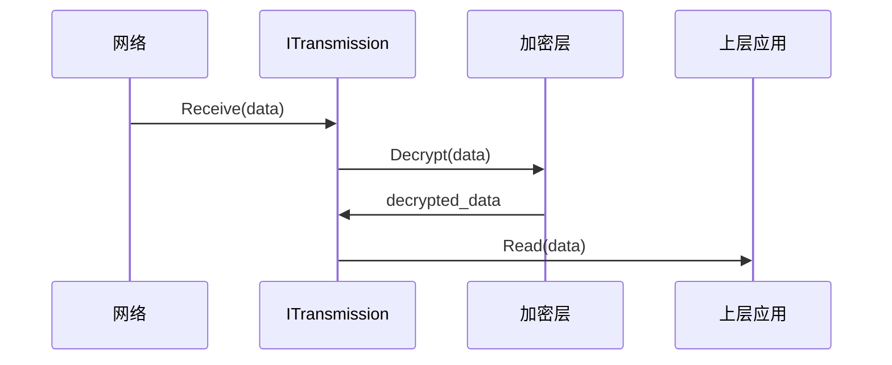
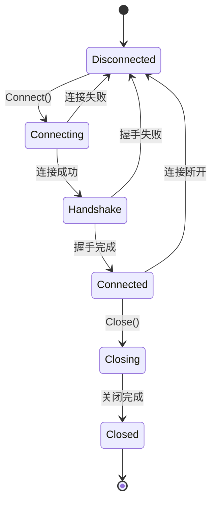
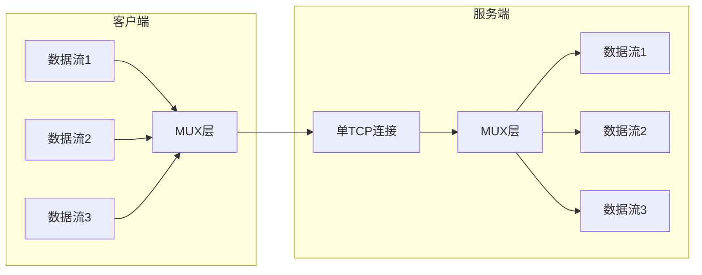
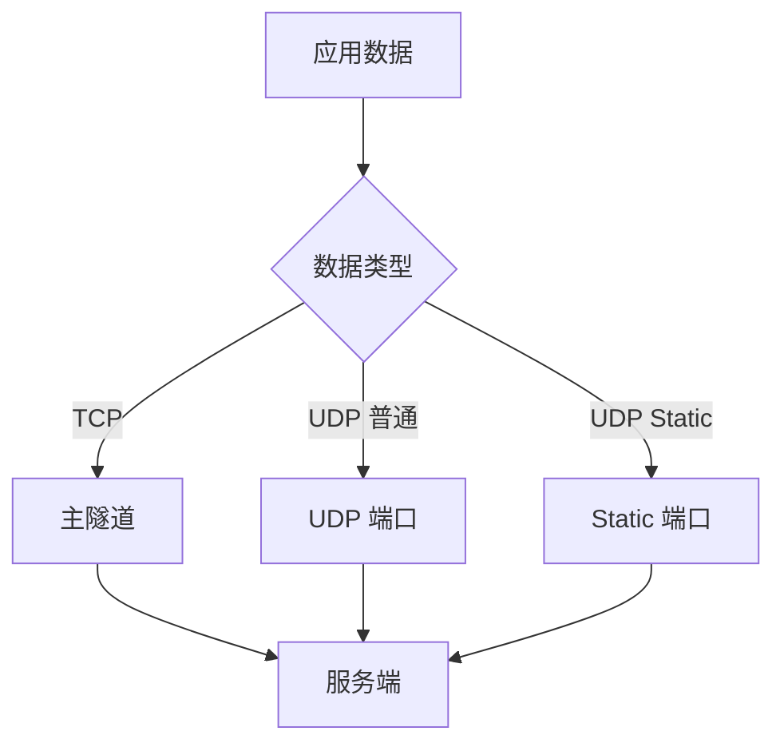

# 传输、帧化与受保护隧道模型

[English Version](TRANSMISSION.md)

## 文档范围

本文从代码实现出发，而不是从产品宣传语言出发，解释 OPENPPP2 的传输与帧化核心。目标不是笼统地说"它有一层加密"，而是让读者真正理解：这个传输子系统到底在做什么、它和整个工程如何配合、为什么实现方式和常见的"一个 socket 加一层简单加密"设计不同。

本文的核心代码入口是：

- `ppp/transmissions/ITransmission.h`
- `ppp/transmissions/ITransmission.cpp`
- `ppp/transmissions/ITcpipTransmission.*`
- `ppp/transmissions/IWebsocketTransmission.*`
- `ppp/app/protocol/VirtualEthernetLinklayer.*`
- `ppp/app/protocol/VirtualEthernetPacket.*`

建议配合以下文档一起阅读：

- [HANDSHAKE_SEQUENCE_CN.md](HANDSHAKE_SEQUENCE_CN.md)
- [PACKET_FORMATS_CN.md](PACKET_FORMATS_CN.md)
- [SECURITY_CN.md](SECURITY_CN.md)
- [STARTUP_AND_LIFECYCLE_CN.md](STARTUP_AND_LIFECYCLE_CN.md)

## OPENPPP2 想在传输层解决什么问题

OPENPPP2 不是把传输层当作一个单纯的字节管道。它要求这个子系统同时解决多个问题：

| 需求 | 说明 |
|------|------|
| 多载体支持 | 支持 TCP、WS、WSS 等多种承载协议 |
| 受保护通道 | 在上层虚拟以太网动作开始正常工作前，先建立一条有状态的受保护通道 |
| 强帧化处理 | 相比简单的明文长度前缀帧，做更强的包长和帧形态处理 |
| 载体独立性 | 让上层链路协议尽量独立于 carrier 类型 |
| 多模式支持 | 同时支持预握手阶段或 plaintext 模式下的 base94 帧族 |
| 密钥派生 | 用长期配置密钥材料加握手期随机量，派生连接级工作密钥 |

正因为它在一个文件里同时承担这些工作，所以 `ITransmission.cpp` 看起来会比普通 socket 包装器复杂得多。

## 分层模型

如果要读懂 OPENPPP2，必须把几个层次拆开理解：

### 各层职责

| 层次 | 负责内容 | 关键源码 |
|------|----------|----------|
| 承载层 | TCP/WebSocket/WSS 连接管理 | `ITcpipTransmission.*`, `IWebsocketTransmission.*` |
| 传输握手层 | 密钥交换和 session_id 协商 | `ITransmission.cpp::Handshake` |
| 传输帧化层 | 数据帧的组装和解析 | `ITransmission.cpp::Write`, `Read` |
| 负载变换层 | 加密、压缩、混淆 | `ITransmission.cpp::Encrypt`, `Decrypt` |
| 链路层 | 隧道内控制信令 | `VirtualEthernetLinklayer.*` |
| 运行时层 | 客户端/服务端逻辑 | `VEthernetExchanger.*`, `VirtualEthernetExchanger.*` |
| 平台层 | 虚拟网卡和路由集成 | 各平台相关代码 |

## ITransmission 接口

### 核心接口定义

`ITransmission` 是整个传输层的抽象接口，定义了所有传输操作：

### 接口方法详解

| 方法 | 功能 | 说明 |
|------|------|------|
| `Connect()` | 建立连接 | 建立与服务端的传输层连接 |
| `Handshake()` | 握手 | 完成密钥交换和 session_id 协商 |
| `Write()` | 写入 | 加密并发送数据 |
| `Read()` | 读取 | 接收并解密数据 |
| `Close()` | 关闭 | 关闭传输连接 |
| `GetSessionId()` | 获取会话ID | 返回当前会话的 session_id |
| `GetStatistics()` | 统计信息 | 返回传输统计 |

## 传输类型

### TCP 传输

TCP 传输是最基本的传输方式，使用原生 TCP 连接：

| 参数 | 说明 | 默认值 |
|------|------|--------|
| `tcp.listen.port` | 监听端口 | 20000 |
| `tcp.connect.timeout` | 连接超时 | 5 秒 |
| `tcp.inactive.timeout` | 空闲超时 | 300 秒 |
| `tcp.turbo` | TCP 加速 | true |
| `tcp.fast-open` | TCP Fast Open | true |
| `tcp.backlog` | 连接队列 | 511 |

### WebSocket 传输

WebSocket 传输支持在 HTTP 环境下使用：

| 参数 | 说明 | 默认值 |
|------|------|--------|
| `ws.listen.port` | WS 监听端口 | 20080 |
| `wss.listen.port` | WSS 监听端口 | 20443 |
| `ws.path` | WebSocket 路径 | /tun |
| `ws.verify-peer` | 验证证书 | true |

### WSS 加密传输

WSS（WebSocket Secure）提供加密的 WebSocket 传输：

| 参数 | 说明 |
|------|------|
| `ssl.certificate-file` | SSL 证书文件 |
| `ssl.certificate-key-file` | SSL 私钥文件 |
| `ssl.ciphersuites` | 加密套件列表 |

## 帧化机制

### 帧结构

OPENPPP2 使用自定义帧结构，包含长度前缀和负载：

| 字段 | 长度 | 说明 |
|------|------|------|
| 长度前缀 | 2-4 字节 | 负载长度 |
| 负载 | 变长 | 加密数据 |

### 帧类型

| 帧类型 | 说明 | 用途 |
|--------|------|------|
| 数据帧 | 普通数据 | 传输应用数据 |
| 控制帧 | 控制信息 | 握手、保活等 |
| 心跳帧 | keepalive | 维持连接 |

## 加密层

### 两层加密

OPENPPP2 实现了两层加密：

| 层次 | 密钥 | 说明 |
|------|------|------|
| 协议层 | `protocol-key` + `ivv` | 隧道内数据加密 |
| 传输层 | `transport-key` + `ivv` | 传输链路加密 |

### 支持的加密算法

| 算法 | 密钥长度 | 模式 | 推荐程度 |
|------|----------|------|----------|
| aes-128-cfb | 128 位 | CFB | 推荐 |
| aes-256-cfb | 256 位 | CFB | 强烈推荐 |
| aes-128-gcm | 128 位 | GCM | 推荐 |
| aes-256-gcm | 256 位 | GCM | 强烈推荐 |
| rc4 | 可变 | RC4 | 不推荐（已废弃） |

### 密钥派生

## 读写流水线

### 写入流程

### 读取流程

## 状态机

### 连接状态

| 状态 | 说明 |
|------|------|
| Disconnected | 未连接 |
| Connecting | 正在连接 |
| Handshake | 握手中 |
| Connected | 已连接 |
| Closing | 正在关闭 |
| Closed | 已关闭 |

## 多路复用 (MUX)

### MUX 功能

MUX 允许在单个连接上复用多个数据流：

| 参数 | 说明 | 默认值 |
|------|------|--------|
| `mux.connect.timeout` | 连接超时 | 20 秒 |
| `mux.inactive.timeout` | 空闲超时 | 60 秒 |
| `mux.congestions` | 拥塞窗口 | 134217728 字节 |
| `mux.keep-alived` | keepalive | [1, 20] 秒 |

### MUX 数据流

## Static 路径

### Static UDP

Static 路径提供独立的 UDP 数据通道：

| 参数 | 说明 | 默认值 |
|------|------|--------|
| `static.keep-alived` | 保活间隔 | [1, 5] 秒 |
| `static.dns` | DNS 服务 | true |
| `static.quic` | QUIC 支持 | true |
| `static.icmp` | ICMP 支持 | true |
| `static.aggligator` | 聚合器数量 | 0 |
| `static.servers` | 服务器列表 | [] |

### 数据路径选择

## 统计信息

### 传输统计

| 指标 | 说明 |
|------|------|
| bytes_sent | 发送字节数 |
| bytes_received | 接收字节数 |
| packets_sent | 发送包数 |
| packets_received | 接收包数 |
| errors | 错误数 |
| last_active | 最后活动时间 |

## 错误处理

### 常见错误

| 错误 | 原因 | 处理 |
|------|------|------|
| 连接超时 | 网络不可达 | 重连 |
| 握手失败 | 密钥错误 | 报告错误 |
| 加密错误 | 密钥问题 | 关闭连接 |
| 帧错误 | 数据损坏 | 断开连接 |

## 性能优化

### 优化参数

| 参数 | 说明 | 推荐值 |
|------|------|--------|
| `tcp.turbo` | TCP 加速 | 启用 |
| `tcp.fast-open` | TCP Fast Open | 启用 |
| `tcp.cwnd` | 拥塞窗口 | 0（自动） |
| `tcp.rwnd` | 接收窗口 | 0（自动） |
| `concurrent` | 并发线程 | CPU 核心数 |

### 优化建议

1. **启用 TCP Turbo**：减少数据传输延迟
2. **启用 TCP Fast Open**：减少连接建立时间
3. **配置 MUX**：在高延迟网络上提高效率
4. **调整拥塞窗口**：根据网络条件优化

## 相关文档

| 文档 | 说明 |
|------|------|
| [HANDSHAKE_SEQUENCE_CN.md](HANDSHAKE_SEQUENCE_CN.md) | 握手序列与会话建立 |
| [PACKET_FORMATS_CN.md](PACKET_FORMATS_CN.md) | 包格式与线上布局 |
| [SECURITY_CN.md](SECURITY_CN.md) | 安全模型与密钥管理 |
| [CLIENT_ARCHITECTURE_CN.md](CLIENT_ARCHITECTURE_CN.md) | 客户端架构 |
| [SERVER_ARCHITECTURE_CN.md](SERVER_ARCHITECTURE_CN.md) | 服务端架构 |
