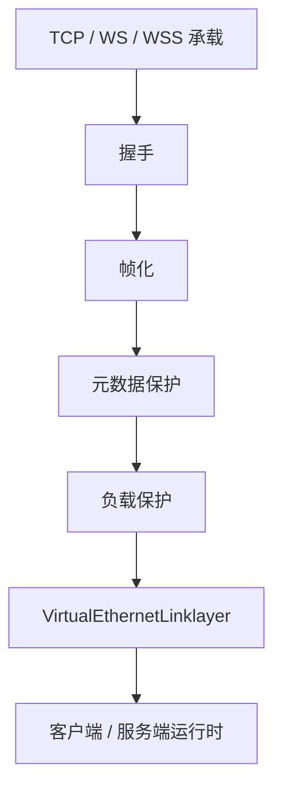
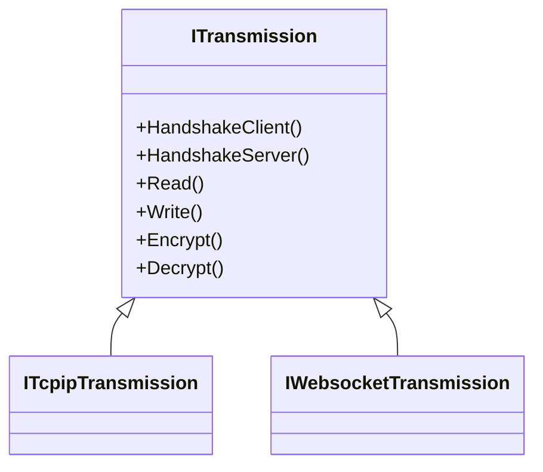
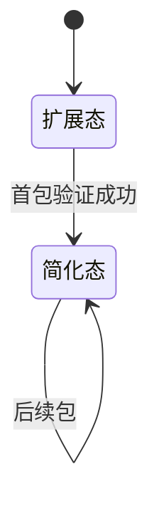
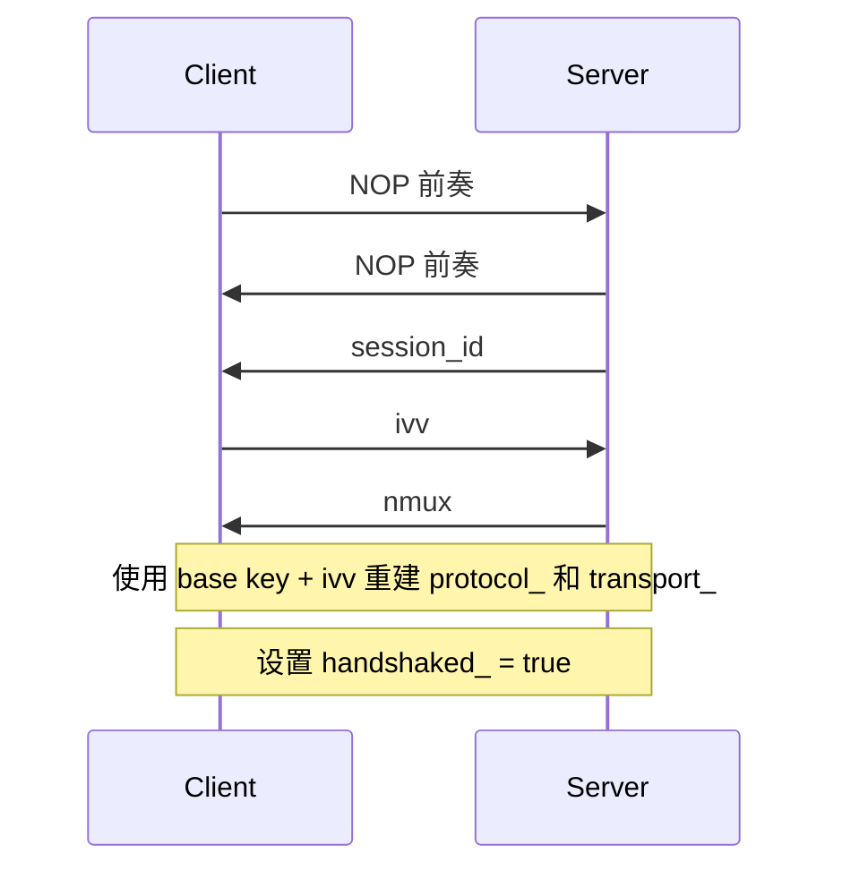

# 传输、帧化与受保护隧道模型

[English Version](TRANSMISSION.md)

## 范围

本文从代码实现出发解释 OPENPPP2 的传输核心。目标不是笼统地说“它有一层加密”，而是说明这个传输子系统到底在做什么，以及为什么它比常见的“一个 socket 加一层密文”设计更复杂。

核心源码是 `ppp/transmissions/ITransmission.*`、`ppp/transmissions/ITcpipTransmission.*`、`ppp/transmissions/IWebsocketTransmission.*`，以及 `ppp/app/protocol/*` 中消费这些字节的协议逻辑。

## 传输层解决什么

传输子系统需要同时解决多个问题：

| 需求 | 含义 |
|------|------|
| 多承载支持 | 能在 TCP、WebSocket、WSS 等承载上工作 |
| 受保护通道 | 在正常隧道流量开始前先建立受保护状态 |
| 帧化纪律 | 保护包边界和包长元数据 |
| 承载独立性 | 上层隧道语义不要被 carrier 类型绑定死 |
| 预握手模式 | 支持 base94 风格的预握手或 plaintext 兼容流量 |
| 会话级工作密钥 | 通过配置密钥与握手随机量派生每条连接的工作密钥 |

## 分层模型

### 各层职责

| 层次 | 负责内容 |
|------|----------|
| 承载层 | socket I/O 和传输选择 |
| 握手层 | 会话建立、dummy 流量、工作密钥输入交换 |
| 帧化层 | 长度保护和包边界处理 |
| 元数据保护 | 头部 masking、shuffling、delta encoding 和 cipher |
| 负载保护 | 正文加密与变换流水线 |
| 链路层 | 隧道动作语义 |

## `ITransmission`

`ITransmission` 不只是一个接口。它集中处理了受保护传输行为：

- 握手顺序
- 超时处理
- 预握手与握手后帧化模式
- cipher 对象所有权
- carrier-specific 读写分发

## 承载类型

### TCP

TCP 是最直接的承载路径。

| 配置 | 含义 |
|------|------|
| `tcp.listen.port` | 监听端口 |
| `tcp.connect.timeout` | 连接超时 |
| `tcp.inactive.timeout` | 空闲超时 |
| `tcp.turbo` | 承载侧优化 |
| `tcp.fast-open` | TCP Fast Open 支持 |
| `tcp.backlog` | 监听队列 |

### WebSocket

WebSocket 用于需要 HTTP 兼容承载的场景。

| 配置 | 含义 |
|------|------|
| `ws.listen.port` | 普通 WebSocket 监听端口 |
| `wss.listen.port` | 安全 WebSocket 监听端口 |
| `ws.path` | upgrade 路径 |
| `ws.verify-peer` | 是否验证对端证书 |

### WSS

WSS 在承载层增加 TLS。它不会替代 OPENPPP2 内层的传输逻辑，只是改变承载保护层。

## 两个帧族

OPENPPP2 的传输分成两种家族。

### Base94 家族

以下条件任一成立时使用：

- 握手尚未完成
- 启用了 plaintext 兼容模式

它又分两种形态：

- 初始扩展头形态
- 后续简化头形态

首包更重，因为它要建立初始解析状态。后续包则使用更简化的形式。

### 二进制受保护家族

握手完成后正常路径下使用。

它使用紧凑的受保护头部和单独变换的负载正文。

## Base94 头部行为

Base94 头不是简单的字面长度前缀。

它使用：

- 随机 key byte
- filler byte
- 基于变换后长度数据得到的 base94 数字
- 在首个包中还会有一个额外验证字段

首包解析成功后，包状态会从扩展头切换成简化头。

## 二进制头部行为

在二进制路径中，头部存储的是受保护元数据，而不是裸 length prefix。

发送侧大致过程：

1. 调整 payload 长度，避免零长度歧义
2. 如果配置了 protocol cipher，则对长度字节加密
3. 用包级因子做 XOR 掩码
4. 交换字节顺序
5. 对最终头部做 delta encoding

接收侧按相反顺序恢复。

## 为什么要调整长度

代码会在头部保护前把长度减一，解码后再加一。这是为了避免受保护帧路径中的零长度歧义。

这是一种很小但很重要的归一化选择。它把零变成明显的错误状态，而不是合法包长度。

## 负载变换流水线

负载路径可以包含：

- 滚动 XOR masking
- 确定性 shuffling
- delta encoding
- 可选 transport cipher 加密

运行时会在握手前使用更保守的行为，在握手后使用更常规的行为。

## 两个 cipher 槽位

OPENPPP2 保留两个 cipher 槽位：

| 槽位 | 作用 |
|------|------|
| `protocol_` | 保护头部元数据和 protocol-facing 字节 |
| `transport_` | 保护负载正文字节 |

这不是装饰性的分层。因为元数据泄露在很多情况下和正文泄露一样重要。

## 传输中的握手

传输握手并不只是认证对端，它还会制造流量形态，并生成连接级工作密钥输入。

客户端：

1. 发送 NOP 前奏
2. 接收真实 `session_id`
3. 生成新的 `ivv`
4. 发送 `ivv`
5. 接收 `nmux`
6. 设置 `handshaked_ = true`
7. 用 `ivv` 重建 cipher 状态

服务端：

1. 发送 NOP 前奏
2. 发送真实 `session_id`
3. 生成并发送 `nmux`
4. 接收 `ivv`
5. 设置 `handshaked_ = true`
6. 用 `ivv` 重建 cipher 状态

## Dummy 握手包

NOP 前奏不是空流量，而是结构化的 dummy 流量。

当 `session_id == 0` 时，打包器会把第一个字节的高位置 1，并生成 dummy payload。接收侧根据这个 bit 识别并忽略。

这意味着前奏在外观上像正常握手流量，但在逻辑上不携带真实 session 身份。

## 连接级密钥派生

客户端生成 `ivv`，服务端用它重建连接级 cipher 状态。

代码层面的准确说法是：

- OPENPPP2 进行连接级动态工作密钥派生
- 这减少了跨会话的静态密钥复用

## 相关文档

- `HANDSHAKE_SEQUENCE_CN.md`
- `PACKET_FORMATS_CN.md`
- `TRANSMISSION_PACK_SESSIONID_CN.md`
- 除非代码其他部分给出更强证明，否则不能直接把它说成标准 PFS

## 握手超时

握手受一个计时器约束，超时时间来自连接超时配置。

如果计时器先触发，运行时会销毁 transmission，不会让它无限停留在握手态。

这是安全控制，也是运维控制。

## 为什么会有 Base94

Base94 不是偶然的历史遗留。

它提供：

- 预握手帧族
- plaintext 兼容回退路径
- 早期流量的不同形态
- 某些无法立即使用正常受保护二进制形态的部署兼容性

## 为什么 `ITransmission` 很关键

这个文件是仓库里最重要的文件之一，因为它把很多别的系统会分散到多个库里处理的行为集中起来：

- 握手和超时控制
- 早期流量形态控制
- 元数据保护
- 负载保护
- 承载无关的 I/O 分发

这种密度是设计结果，不只是实现偶然。
