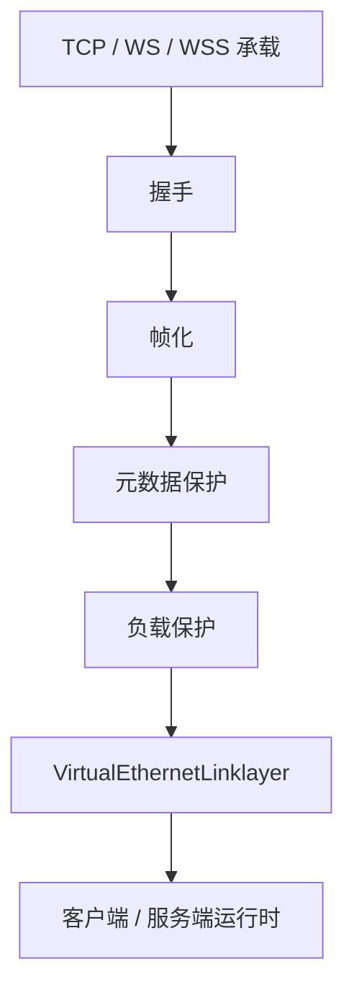
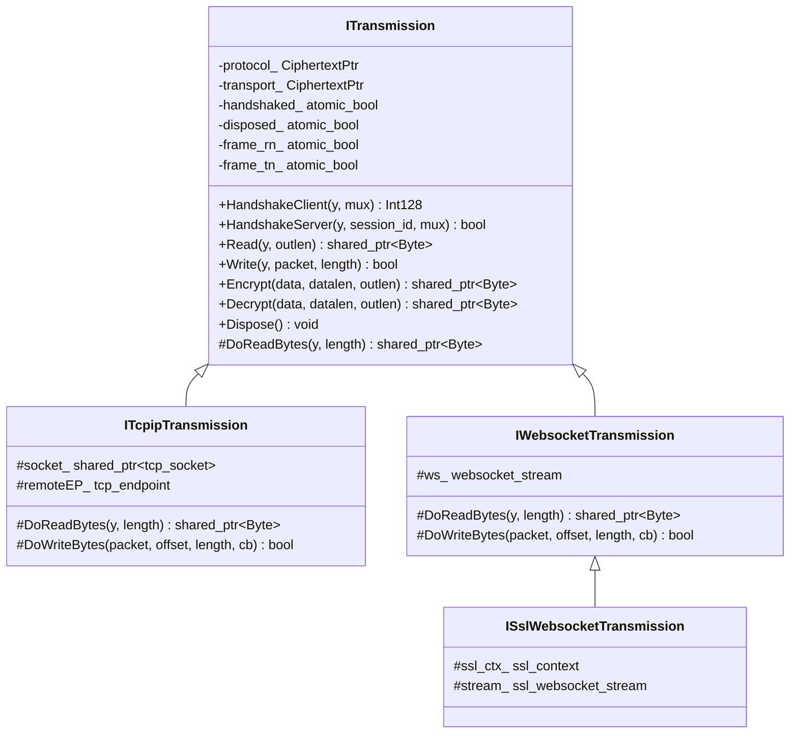
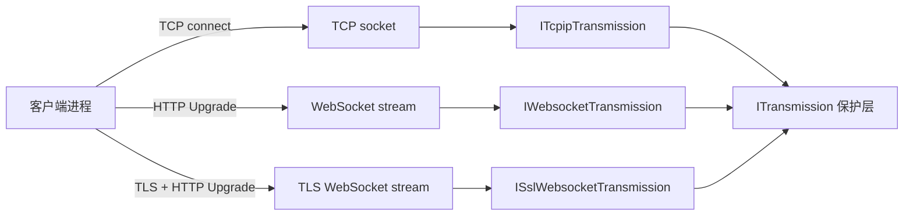
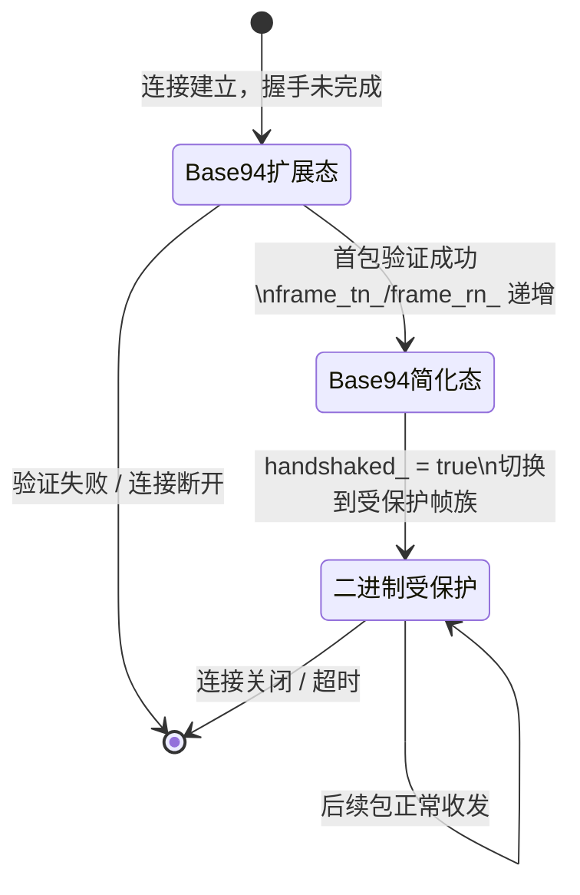
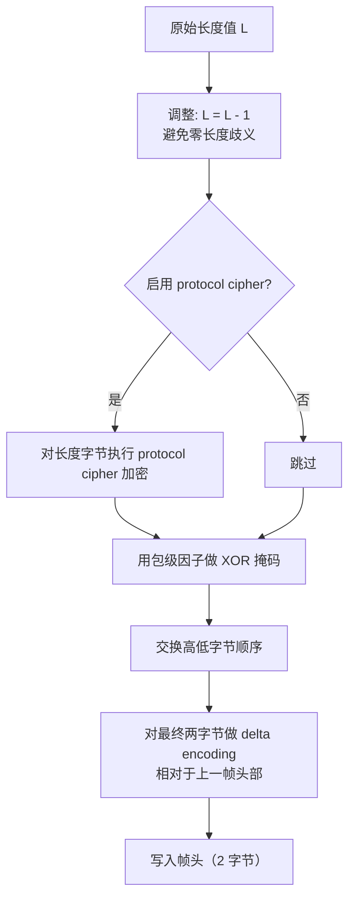
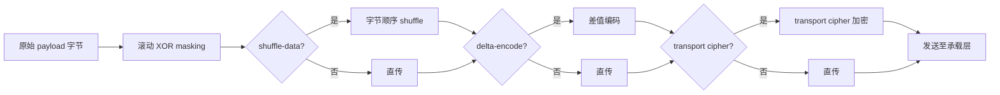
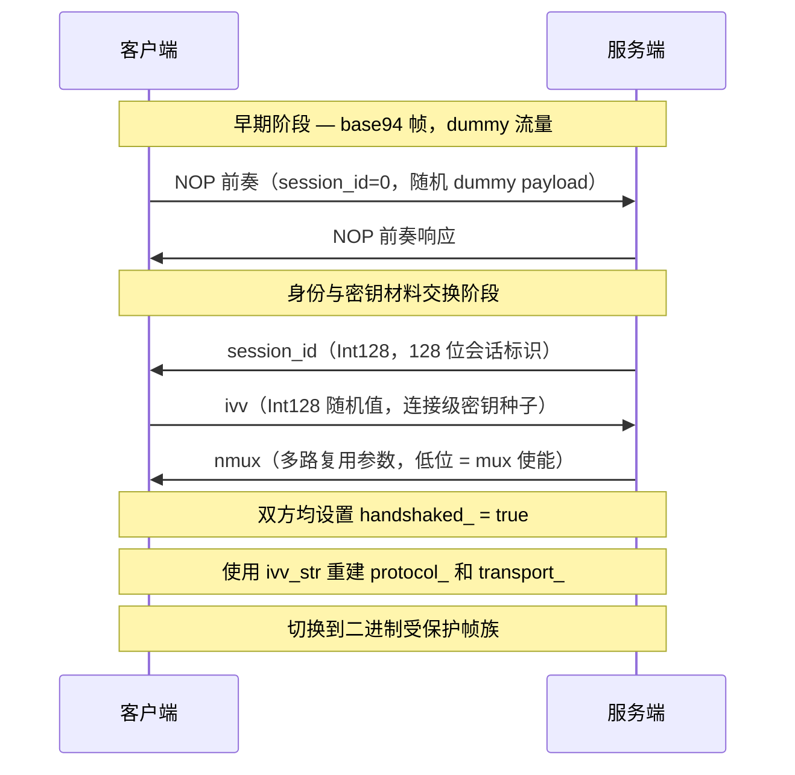
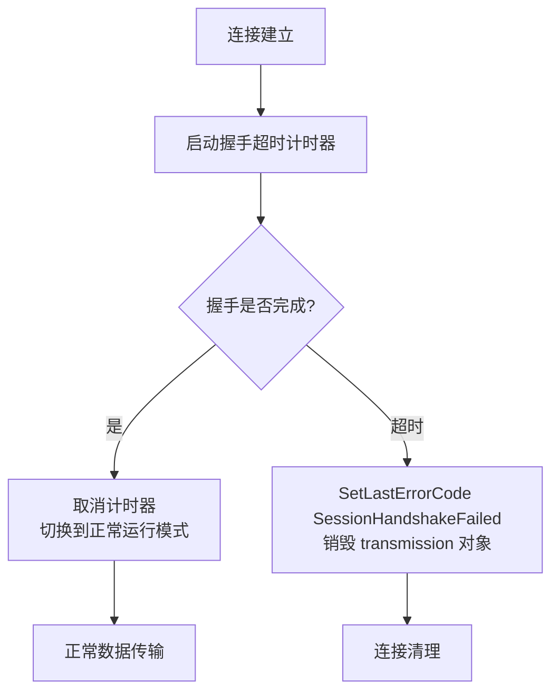
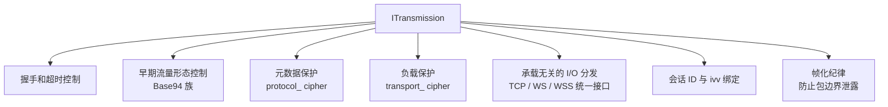
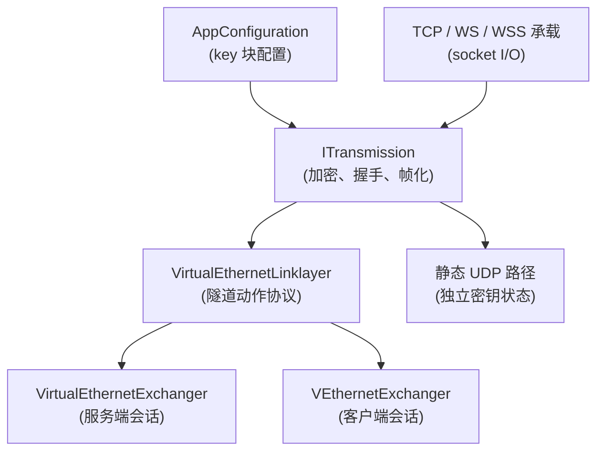

# 传输、帧化与受保护隧道模型

[English Version](TRANSMISSION.md)

## 范围

本文从代码实现出发解释 OPENPPP2 的传输核心。目标不是笼统地说"它有一层加密"，而是说明这个传输子系统到底在做什么，以及为什么它比常见的"一个 socket 加一层密文"设计更复杂。

核心源码是 `ppp/transmissions/ITransmission.*`、`ppp/transmissions/ITcpipTransmission.*`、`ppp/transmissions/IWebsocketTransmission.*`，以及 `ppp/app/protocol/*` 中消费这些字节的协议逻辑。

---

## 1. 传输层解决什么

传输子系统需要同时解决多个问题：

| 需求 | 含义 |
|------|------|
| 多承载支持 | 能在 TCP、WebSocket、WSS 等承载上工作 |
| 受保护通道 | 在正常隧道流量开始前先建立受保护状态 |
| 帧化纪律 | 保护包边界和包长元数据 |
| 承载独立性 | 上层隧道语义不要被 carrier 类型绑定死 |
| 预握手模式 | 支持 base94 风格的预握手或 plaintext 兼容流量 |
| 会话级工作密钥 | 通过配置密钥与握手随机量派生每条连接的工作密钥 |

---

## 2. 分层模型



### 各层职责

| 层次 | 负责内容 |
|------|----------|
| 承载层 | socket I/O 和传输选择 |
| 握手层 | 会话建立、dummy 流量、工作密钥输入交换 |
| 帧化层 | 长度保护和包边界处理 |
| 元数据保护 | 头部 masking、shuffling、delta encoding 和 cipher |
| 负载保护 | 正文加密与变换流水线 |
| 链路层 | 隧道动作语义 |

---

## 3. `ITransmission` 接口总览

`ITransmission` 不只是一个接口。它集中处理了受保护传输行为：

- 握手顺序
- 超时处理
- 预握手与握手后帧化模式
- cipher 对象所有权
- carrier-specific 读写分发



### 关键公开方法 API 说明

```cpp
/**
 * @brief 作为客户端执行握手序列。
 *
 * 发送 NOP 前奏，接收 session_id，发送 ivv，接收 nmux，重建 cipher 状态。
 * 成功后 handshaked_ 置为 true。
 *
 * @param y    协程 yield 上下文，握手在协程内挂起等待 I/O。
 * @param mux  输出标志，指示协商后的多路复用能力。
 * @return     协商得到的会话标识符（Int128），失败时返回零。
 * @note       仅在未握手状态下调用一次；重复调用行为未定义。
 */
virtual Int128 HandshakeClient(YieldContext& y, bool& mux) noexcept;

/**
 * @brief 作为服务端执行握手序列。
 *
 * 发送 NOP 前奏，发送 session_id，发送 nmux，接收 ivv，重建 cipher 状态。
 * 成功后 handshaked_ 置为 true。
 *
 * @param y          协程 yield 上下文。
 * @param session_id 上层提供的会话标识符。
 * @param mux        请求的多路复用行为。
 * @return           握手成功返回 true；失败时设置诊断错误码并返回 false。
 */
virtual bool HandshakeServer(YieldContext& y, const Int128& session_id, bool mux) noexcept;

/**
 * @brief 从受保护传输读取并解密一个分帧消息。
 *
 * 根据当前帧化模式（base94 或二进制受保护）读取头部，解析长度，
 * 读取负载正文，执行解密和逆变换流水线。
 *
 * @param y       协程 yield 上下文。
 * @param outlen  [out] 实际有效字节数。
 * @return        解密后的 payload 缓冲区；连接关闭或错误返回 null。
 * @note          线程安全前提：同一 transmission 实例的读操作需由 strand 串行化。
 */
virtual std::shared_ptr<Byte> Read(YieldContext& y, int& outlen) noexcept;

/**
 * @brief 向受保护传输写入一个分帧消息。
 *
 * 执行加密和变换流水线，编码帧头，将帧写入底层承载 socket。
 *
 * @param y             协程 yield 上下文。
 * @param packet        要写入的原始数据指针。
 * @param packet_length 要写入的有效字节数。
 * @return              成功返回 true；写入错误返回 false。
 * @warning             packet_length 为 0 时行为由实现定义；调用方应避免零长度写入。
 */
virtual bool Write(YieldContext& y, const void* packet, int packet_length) noexcept;
```

---

## 4. 承载类型

### 4.1 TCP 承载

TCP 是最直接的承载路径，实现在 `ppp/transmissions/ITcpipTransmission.cpp`。

| 配置键 | 含义 | 默认值 |
|--------|------|--------|
| `tcp.listen.port` | 监听端口 | `0`（禁用） |
| `tcp.connect.timeout` | 连接超时（秒） | `5` |
| `tcp.inactive.timeout` | 空闲关闭超时（秒） | `300` |
| `tcp.turbo` | 承载侧发送优化标志 | `false` |
| `tcp.fast-open` | TCP Fast Open（Linux 内核支持） | `false` |
| `tcp.backlog` | 监听队列深度 | `511` |

TCP 承载通过 Boost.Asio 的 `boost::asio::ip::tcp::socket` 实现异步读写，底层调用 `async_read` 和 `async_write` 以保证帧完整性。帧边界通过 `ITransmission` 的帧化层维护，承载自身只负责可靠字节流。

### 4.2 WebSocket 承载

WebSocket 用于需要 HTTP 兼容承载的场景，实现在 `ppp/transmissions/IWebsocketTransmission.cpp`。

| 配置键 | 含义 |
|--------|------|
| `ws.listen.port` | 普通 WebSocket 监听端口 |
| `wss.listen.port` | 安全 WebSocket 监听端口 |
| `ws.path` | HTTP Upgrade 路径 |
| `ws.host` | WebSocket Host 头 |
| `ws.verify-peer` | 是否验证对端 TLS 证书 |
| `ws.http.request.*` | 自定义 HTTP 请求头键值对 |
| `ws.http.response.*` | 自定义 HTTP 响应头键值对 |

WebSocket 承载在 HTTP Upgrade 完成后进入帧化模式。`IWebsocketTransmission` 使用 `boost::beast::websocket::stream` 实现。消息以 binary frame 发送，WebSocket ping/pong 不干预 OPENPPP2 的应用层 keepalive 逻辑。

### 4.3 WSS 承载

WSS 在承载层增加 TLS，实现在 `ppp/transmissions/ISslWebsocketTransmission.cpp`。

WSS 不替代 OPENPPP2 内层的传输保护逻辑——两者同时存在。这意味着在 WSS 路径上，payload 实际经历：
1. OPENPPP2 应用层双密码加密（protocol cipher + transport cipher）
2. TLS 层加密（承载层 TLS）

TLS 证书配置：

```json
"websocket": {
    "ssl": {
        "certificate-file": "/path/to/cert.pem",
        "certificate-key-file": "/path/to/key.pem",
        "certificate-chain-file": "/path/to/chain.pem",
        "verify-peer": false
    }
}
```



---

## 5. 两个帧族

OPENPPP2 的传输分成两种家族，由当前握手状态决定使用哪一种。

### 5.1 Base94 帧族

以下条件任一成立时使用：

- 握手尚未完成（`handshaked_ == false`）
- 启用了 plaintext 兼容模式（`key.plaintext == true`）

Base94 帧族又分两种形态：

**扩展头形态（首包）**：

| 字节位置 | 内容 |
|----------|------|
| 0 | 随机 key byte，高位可能被置位（session_id == 0 时表示 dummy 包） |
| 1 | filler byte（随机填充） |
| 2–3 | 基于 base94 编码的长度字段（2 个 base94 数字） |
| 4–6 | 首包附加验证字段（3 字节） |

**简化头形态（后续包）**：

| 字节位置 | 内容 |
|----------|------|
| 0 | 随机 key byte |
| 1 | filler byte |
| 2–3 | 基于 base94 编码的长度字段 |

首包解析成功后，帧状态从扩展态切换成简化态，由 `frame_tn_`/`frame_rn_` 计数器控制。

### 5.2 二进制受保护帧族

握手完成后正常路径下使用。使用紧凑的受保护头部和单独变换的负载正文。

| 字节位置 | 内容 |
|----------|------|
| 0–1 | 受保护的长度字段（经过 cipher、XOR masking、字节顺序交换、delta 编码） |
| 2+ | 变换后的负载（滚动 XOR + shuffling + delta encoding + 可选 transport cipher） |



---

## 6. 帧头详细行为

### 6.1 Base94 头部行为

Base94 头不是简单的字面长度前缀，它使用以下组件：

1. **随机 key byte**：每包随机生成，用于解混淆长度字节。
2. **filler byte**：随机填充，无语义意义，增加流量多样性。
3. **base94 编码长度**：长度值被编码为 base94 数字对（两个字节，每字节值域 `[0x21, 0x7E]`，避开控制字符和空格）。
4. **首包验证字段**：额外 3 字节，包含基于密钥材料的验证值，接收方据此确认对方持有正确的预共享密钥。

首包解析成功后，包状态会从扩展头切换成简化头，后续包省略验证字段。

### 6.2 二进制头部行为

在二进制路径中，头部存储的是受保护元数据，而不是裸 length prefix。

**发送侧处理步骤（共 5 步）**：



**接收侧**按完全相反顺序恢复：delta decode → 字节顺序还原 → XOR 去掩码 → cipher 解密 → 长度加一。

### 6.3 为什么要调整长度

代码会在头部保护前把长度减一，解码后再加一。这是为了避免受保护帧路径中的零长度歧义：

- 若长度字段允许为 0，则保护层处理后可能出现"合法零帧"，与连接关闭标志混淆。
- 减一操作把合法最短长度从 0 变成 0xFF...（一个很大的值），在解保护后加一恢复。零长度变成明显的错误状态。

---

## 7. 负载变换流水线

负载路径可以包含以下变换，每项均由配置标志控制：

| 变换步骤 | 配置键 | 描述 |
|----------|--------|------|
| 滚动 XOR masking | 内部实现 | 用基于位置的密钥流对字节做 XOR |
| 确定性 shuffling | `key.shuffle-data` | 按确定性置换表重排负载字节 |
| delta encoding | `key.delta-encode` | 将字节编码为相邻差值，增加流量随机性 |
| transport cipher | `key.transport-key` | 使用 transport cipher 对整个负载加密 |

运行时会在握手前使用更保守的行为（base94 路径，变换集有限），在握手后使用更完整的变换流水线（二进制保护路径）。



---

## 8. 两个 cipher 槽位

OPENPPP2 保留两个 cipher 槽位：

| 槽位 | 字段名 | 作用 |
|------|--------|------|
| `protocol_` | `ITransmission::protocol_` | 保护头部元数据和 protocol-facing 字节 |
| `transport_` | `ITransmission::transport_` | 保护负载正文字节 |

这不是装饰性的分层。元数据泄露在很多情况下和正文泄露同样危险：

- 头部元数据包含长度信息，可用于流量特征分析（包长直方图攻击）。
- 分开加密使得即使攻击者破解了一个 cipher，另一个仍然保护其对应的数据。

**密钥派生路径**：

```
protocol_working_key  = Cipher(key.protocol-key  + ivv_str)
transport_working_key = Cipher(key.transport-key + ivv_str)
```

握手完成后，两个 cipher 的内部状态使用 `ivv` 重建，确保每条连接的密钥材料唯一。

---

## 9. 传输中的握手

传输握手并不只是认证对端，它还会制造流量形态，并生成连接级工作密钥输入。

### 9.1 握手序列

**客户端侧**：

1. 发送 NOP 前奏（variable-length dummy bytes，`session_id == 0`）
2. 接收真实 `session_id`（`Int128`，128 位）
3. 生成新的随机 `ivv`（`Int128` 随机值）
4. 发送 `ivv`（经 base94 帧编码）
5. 接收 `nmux`（服务端多路复用参数，低位为 mux 使能标志）
6. 设置 `handshaked_ = true`
7. 用 `protocol-key + ivv_str` / `transport-key + ivv_str` 重建两个 cipher 状态

**服务端侧**：

1. 发送 NOP 前奏
2. 发送真实 `session_id`（由 `VirtualEthernetSwitcher` 分配）
3. 生成并发送 `nmux`
4. 接收 `ivv`
5. 设置 `handshaked_ = true`
6. 用 `protocol-key + ivv_str` / `transport-key + ivv_str` 重建两个 cipher 状态



### 9.2 Dummy 握手包细节

NOP 前奏不是空流量，而是结构化的 dummy 流量：

- 当 `session_id == 0` 时，打包器会把第一个字节的高位置 1，并生成 dummy payload（长度随机选取，内容随机填充）。
- 接收侧根据高位 bit 识别并忽略 dummy 包。
- 前奏在外观上像正常握手流量，但在逻辑上不携带真实 session 身份。
- 多个 dummy 包可连续发送，增加握手流量的不可预测性。

---

## 10. 连接级密钥派生

客户端生成 `ivv`，服务端用它重建连接级 cipher 状态。

**重要区别**：

| 属性 | 传统 PFS（如 TLS 1.3 DHE） | OPENPPP2 FP（前向隐私） |
|------|---------------------------|------------------------|
| 密钥交换机制 | 临时非对称密钥（DH/ECDH） | 预共享基础密钥 + 随机 ivv |
| 历史会话保护 | 基础密钥泄露后仍安全 | 部分：ivv 不同但基础密钥相同 |
| 实现复杂度 | 高（需要非对称密码） | 低（对称加密 + KDF） |

OPENPPP2 提供**前向隐私（FP）**，不是完整意义的 PFS：
- 每连接 `ivv` 不同，使得单独一条连接的密钥不同于其他连接。
- 但如果基础密钥泄露，且攻击者已记录了过去的流量（包括握手中的 `ivv`），则可以重建过去连接的工作密钥。

---

## 11. 握手超时与错误处理

握手受一个计时器约束，超时时间来自连接超时配置（`tcp.connect.timeout`）。



如果计时器先触发，运行时会销毁 transmission，不会让它无限停留在握手态。这是安全控制（防止慢速握手攻击），也是运维控制（防止死连接堆积）。

**错误码参考**：

| ErrorCode | 描述 |
|-----------|------|
| `SessionHandshakeFailed` | 握手序列执行失败 |
| `SessionHandshakeFailed` | 握手超过配置的超时时间 |
| `EvpInitKeyDerivationFailed` | cipher/KDF 初始化失败 |
| `TunnelReadFailed` | 分帧读取失败 |
| `TunnelWriteFailed` | 分帧写入失败 |
| `SocketConnectFailed` / `TcpConnectFailed` | 承载 TCP/WebSocket 连接失败 |
| `SslHandshakeFailed` | TLS 协商失败（WSS 承载） |

> **注**：密钥派生、传输读写、承载连接和 TLS 协商失败等旧设计名不是当前 `ErrorCodes.def` 条目；请使用上表列出的近似现有码。

---

## 12. 传输配置参考

### 12.1 完整的 TCP 配置示例

```json
{
    "tcp": {
        "listen": {
            "port": 20000,
            "nagle": false
        },
        "connect": {
            "timeout": 5
        },
        "inactive": {
            "timeout": 300
        },
        "turbo": false,
        "backlog": 511,
        "fast-open": false
    }
}
```

### 12.2 完整的 WebSocket 配置示例

```json
{
    "websocket": {
        "listen": {
            "ws": 20080,
            "wss": 20443
        },
        "host": "example.com",
        "path": "/openppp2",
        "verify-peer": false,
        "http": {
            "request": {
                "Origin": "https://example.com"
            },
            "response": {
                "Server": "nginx/1.20.0"
            }
        },
        "ssl": {
            "certificate-file": "/etc/ssl/certs/cert.pem",
            "certificate-key-file": "/etc/ssl/private/key.pem"
        }
    }
}
```

### 12.3 密钥与加密配置示例

```json
{
    "key": {
        "kcp": {
            "protocol": "base-protocol-secret-key",
            "transport": "base-transport-secret-key"
        },
        "protocol": "aes-256-cfb",
        "transport": "aes-256-cfb",
        "masked": true,
        "plaintext": false,
        "delta-encode": true,
        "shuffle-data": true
    }
}
```

---

## 13. 运行时使用示例

### 13.1 在服务端代码中获取 transmission 的当前状态

```cpp
// ppp/app/server/VirtualEthernetExchanger.cpp
auto transmission = GetTransmission();
if (NULLPTR == transmission) {
    // 会话已释放
    return false;
}

if (!transmission->IsHandshaked()) {
    // 握手尚未完成，等待握手
    return false;
}

Int128 session_id = transmission->GetSessionId();
UInt32 ivv        = transmission->GetIvv();
```

### 13.2 发送一个手动构造的消息

```cpp
// ppp/app/protocol/VirtualEthernetLinklayer.cpp
bool VirtualEthernetLinklayer::SendRawMessage(
    YieldContext&   y,
    const Byte*     data,
    int             length) noexcept
{
    auto transmission = GetTransmission();
    if (NULLPTR == transmission) {
        return false;
    }
    return transmission->Write(y, data, 0, length);
}
```

### 13.3 检查 cipher 是否已初始化

```cpp
// 在任何 Write/Read 之前确认握手完成
bool safe_to_send = (NULLPTR != transmission) && transmission->IsHandshaked();
if (!safe_to_send) {
    SetLastErrorCode(Error::HandshakeFailed);
    return false;
}
```

---

## 14. 为什么会有 Base94

Base94 不是偶然的历史遗留。它提供：

- **预握手帧族**：在握手完成前使用 base94 帧，避免在受保护二进制帧建立之前暴露长度信息。
- **plaintext 兼容回退路径**：开发和测试阶段可禁用加密，只保留 base94 帧化纪律。
- **早期流量形态控制**：base94 字节域限制在可打印 ASCII 范围，外观上与某些明文协议类似。
- **部署兼容性**：某些无法立即使用正常受保护二进制形态的部署场景（如透明代理前的初始握手）可受益于此。

---

## 15. 为什么 `ITransmission` 很关键

这个文件是仓库里最重要的文件之一，因为它把很多别的系统会分散到多个库里处理的行为集中起来：



这种密度是设计结果，不只是实现偶然。每个关注点都有明确的理由集中在这里：

1. **握手控制集中**：确保握手序列的任何变化只需修改一个文件。
2. **cipher 槽位集中**：两个 cipher 的生命周期和重建逻辑在同一处管理，避免状态分散。
3. **承载无关**：所有承载共用同一套帧化和保护逻辑，新增承载只需实现裸 I/O。
4. **超时集中**：握手超时在传输对象内部计时，不依赖外部调度器。

---

## 16. 与其他模块的关系



---

## 相关文档

- [`HANDSHAKE_SEQUENCE_CN.md`](HANDSHAKE_SEQUENCE_CN.md) — 握手序列的更详细时序说明
- [`PACKET_FORMATS_CN.md`](PACKET_FORMATS_CN.md) — 帧格式字节级说明
- [`TRANSMISSION_PACK_SESSIONID_CN.md`](TRANSMISSION_PACK_SESSIONID_CN.md) — session_id 打包方法
- [`TUNNEL_DESIGN_CN.md`](TUNNEL_DESIGN_CN.md) — 隧道分层架构总览
- [`SECURITY_CN.md`](SECURITY_CN.md) — 安全模型与威胁分析
- [`CONFIGURATION_CN.md`](CONFIGURATION_CN.md) — key 块配置说明
- [`EDSM_STATE_MACHINES_CN.md`](EDSM_STATE_MACHINES_CN.md) — 会话状态机
