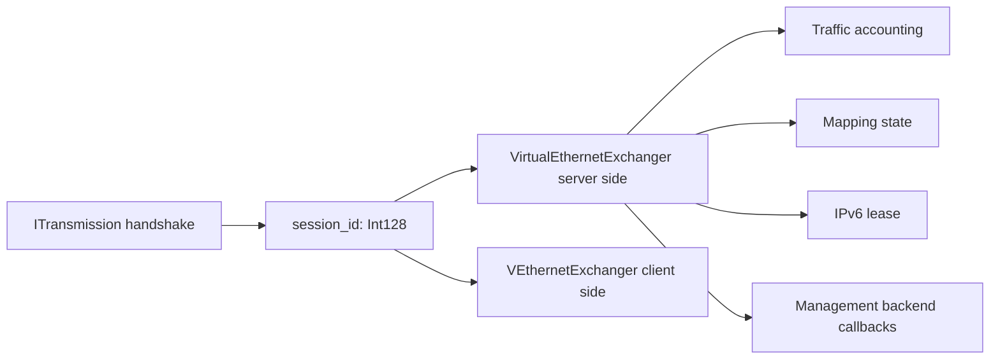
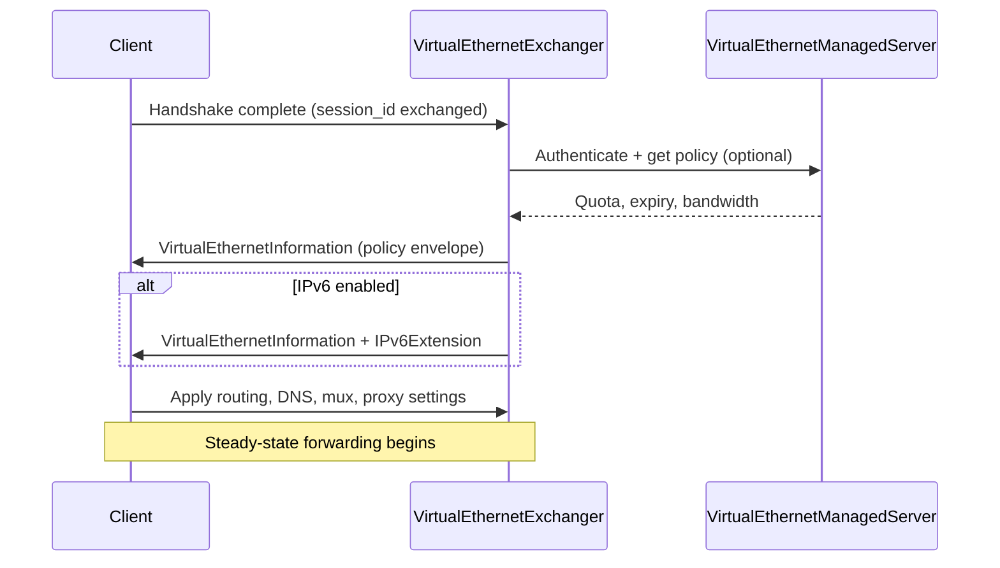
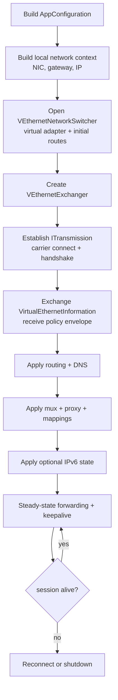
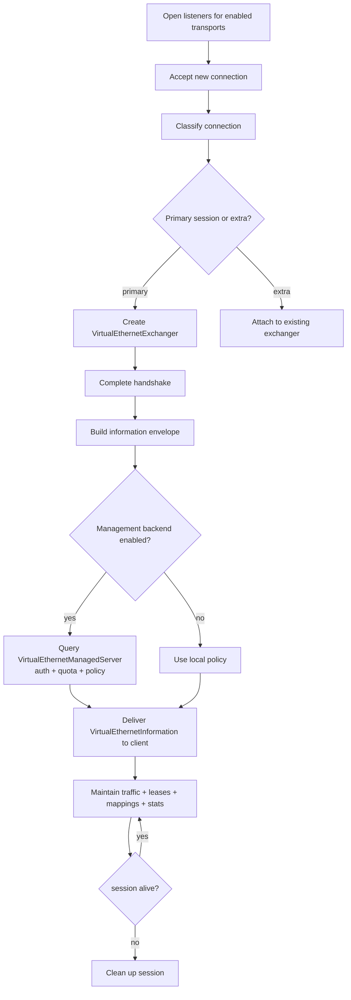
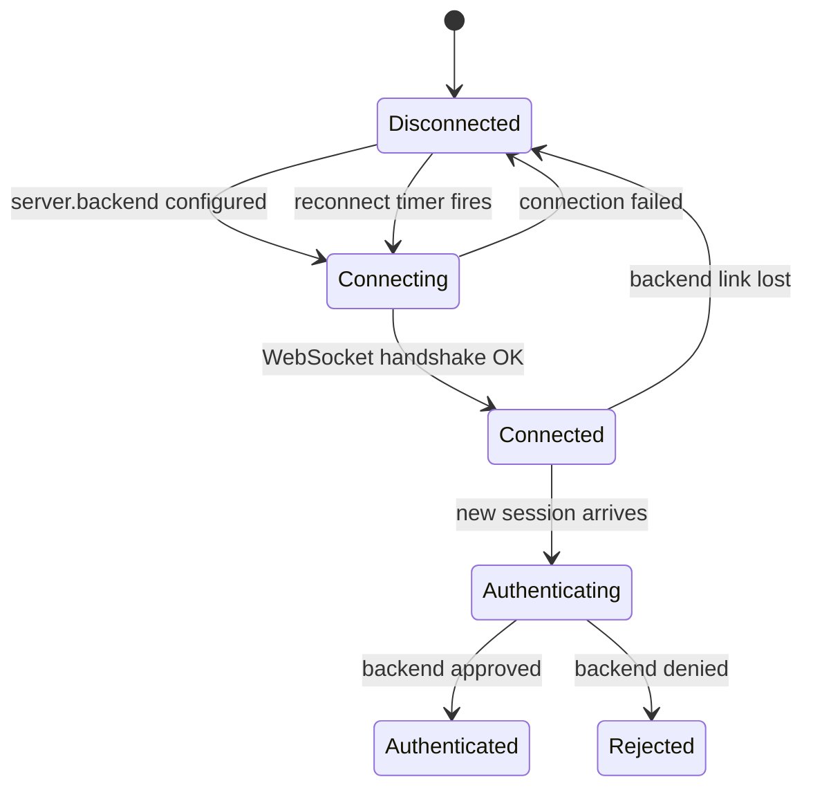
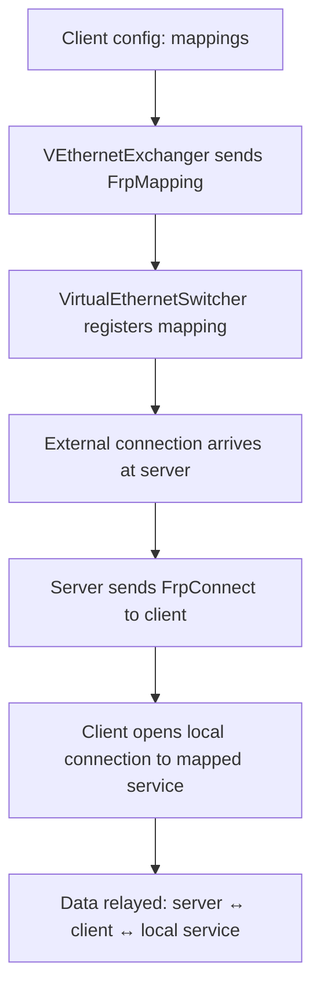

# Session And Control Plane Model

[中文版本](TRANSMISSION_PACK_SESSIONID_CN.md)

## Why This Exists

The old file name (`TRANSMISSION_PACK_SESSIONID`) is historical.
The useful topic is how OPENPPP2 carries session identity and control actions after the transport handshake is complete.

This document covers:
- how session identity is established and maintained
- what information is exchanged after handshake
- the full lifecycle of client and server flows
- quota, expiry, mappings, and failure handling

---

## Core Objects

| Object | File | Role |
|--------|------|------|
| `ITransmission` | `ppp/transmissions/ITransmission.*` | Protected transport, framing, handshake |
| `VirtualEthernetInformation` | `ppp/app/protocol/VirtualEthernetInformation.*` | Session envelope (policy + IPv6 assignment) |
| `VirtualEthernetLinklayer` | `ppp/app/protocol/VirtualEthernetLinklayer.*` | Tunnel action protocol |
| `VirtualEthernetSwitcher` | `ppp/app/server/VirtualEthernetSwitcher.*` | Server session management |
| `VEthernetExchanger` (client) | `ppp/app/client/VEthernetExchanger.*` | Client session management |
| `VirtualEthernetExchanger` (server) | `ppp/app/server/VirtualEthernetExchanger.*` | Per-session server-side handler |
| `VirtualEthernetManagedServer` | `ppp/app/server/VirtualEthernetManagedServer.*` | Optional management backend bridge |

---

## Session Identity

Session identity is centered on `Int128` (a 128-bit integer type from `ppp/stdafx.h`).



The `session_id` is used to:
- bind one logical tunnel exchange to one transport session
- track server-side exchanger state
- key into traffic accounting records
- key into mapping registration tables
- identify the session in management backend calls

---

## Information Exchange (`VirtualEthernetInformation`)

After the handshake, the server delivers a session envelope to the client.

### Envelope Fields

| Field | Type | Description |
|-------|------|-------------|
| `BandwidthQoS` | int | Bandwidth limit in Kbps (0 = unlimited) |
| `IncomingTraffic` | int64 | Incoming traffic counter (bytes) |
| `OutgoingTraffic` | int64 | Outgoing traffic counter (bytes) |
| `ExpiredTime` | int64 | Session expiry Unix timestamp (0 = no expiry) |

### IPv6 Extension Fields

The IPv6 extension adds:

| Field | Type | Description |
|-------|------|-------------|
| `Mode` | enum | Assignment mode (Static, SLAAC, DHCPv6) |
| `Address` | string | Assigned IPv6 address |
| `PrefixLength` | int | Prefix length (e.g. 64) |
| `GatewayAddress` | string | IPv6 gateway address |
| `DnsAddresses` | string[] | Assigned IPv6 DNS servers |
| `Result` | int | Assignment result code (success / failure reason) |

The same message family carries both generic policy and IPv6 provisioning.

### Information Exchange Flow



Source: `ppp/app/protocol/VirtualEthernetInformation.h`

---

## Control Actions After Handshake

After transport setup, the link layer (`VirtualEthernetLinklayer`) carries these actions:

### TCP Actions

| Action | Direction | Description |
|--------|-----------|-------------|
| `ConnectTcp` | C → S | Open TCP flow to remote destination |
| `PushTcp` | C ↔ S | Transfer TCP payload segment |
| `DisconnectTcp` | C ↔ S | Close TCP flow |

### UDP Actions

| Action | Direction | Description |
|--------|-----------|-------------|
| `SendUdp` | C ↔ S | Transfer UDP datagram |
| `StaticPath` | C ↔ S | Configure static UDP bypass path |

### Session Management Actions

| Action | Direction | Description |
|--------|-----------|-------------|
| `Information` | S → C | Deliver policy envelope |
| `Keepalive` | C ↔ S | Session liveness probe |
| `Echo` / `EchoReply` | C ↔ S | Round-trip latency measurement |
| `Mux` | C → S | Configure MUX transport |

### FRP Actions (Reverse Proxy)

| Action | Direction | Description |
|--------|-----------|-------------|
| `FrpMapping` | C → S | Register reverse mapping |
| `FrpConnect` | S → C | Notify incoming reverse connection |
| `FrpPush` | C ↔ S | Transfer data on reverse connection |
| `FrpDisconnect` | C ↔ S | Close reverse connection |
| `FrpUdpRelay` | C ↔ S | UDP relay on reverse path |

---

## Client Flow



Key client objects and files:
- `ppp/app/client/VEthernetExchanger.h` — client session exchanger
- `ppp/app/client/VEthernetNetworkSwitcher.h` — route and DNS management
- `ppp/app/client/VEthernetDatagramPort.h` — UDP forwarding

---

## Server Flow



`VirtualEthernetSwitcher` coordinates the server lifecycle.

Key server objects and files:
- `ppp/app/server/VirtualEthernetSwitcher.h` — server session coordinator
- `ppp/app/server/VirtualEthernetExchanger.h` — per-session handler
- `ppp/app/server/VirtualEthernetManagedServer.h` — management backend bridge
- `ppp/app/server/VirtualEthernetDatagramPort.h` — server UDP forwarding
- `ppp/app/server/VirtualEthernetNamespaceCache.h` — DNS namespace cache

---

## Management Plane

`VirtualEthernetManagedServer` is optional.

It links the tunnel server to an external Go management backend over WebSocket or secure WebSocket for:
- authentication (verify user credentials)
- accounting (report traffic bytes)
- reachability checks (verify backend is alive)
- reconnect handling (re-establish management link if broken)

### Management Link State Machine



Source: `ppp/app/server/VirtualEthernetManagedServer.h`

---

## Quota and Expiry

The session model has explicit hooks for quota and expiry enforcement:

| Enforcement point | Behavior |
|-------------------|---------|
| `ExpiredTime` in envelope | Server rejects or terminates session after expiry |
| `BandwidthQoS` in envelope | Server rate-limits the session |
| `IncomingTraffic` / `OutgoingTraffic` | Backend can deny renewal when quota exceeded |
| Local cache | Runtime enforces policy locally even if backend is slow |

Even with the management backend unavailable, the server can enforce the most recently cached policy.

---

## Mappings and Reverse Access

Client `mappings` configuration drives FRP-style (Fast Reverse Proxy) functionality:



This enables:
- Exposing local services to the public internet through the server
- Controlled reverse-direction access without opening client-side firewall ports

---

## API Reference

### `VirtualEthernetInformation::Serialize`

```cpp
/**
 * @brief Serialize the information envelope to a binary buffer.
 * @param buffer   Output buffer.
 * @param length   Output: number of bytes written.
 * @return         true on success.
 */
bool Serialize(ppp::vector<Byte>& buffer, int& length) noexcept;
```

### `VirtualEthernetLinklayer::SendInformation`

```cpp
/**
 * @brief Send the information envelope to the remote peer.
 * @param y        Yield context for coroutine suspension.
 * @param info     The information object to send.
 * @return         true on success.
 * @note           Called by server after handshake completes.
 */
bool SendInformation(YieldContext& y, const VirtualEthernetInformation& info) noexcept;
```

### `VirtualEthernetLinklayer::SendKeepalive`

```cpp
/**
 * @brief Send a keepalive echo to detect session liveness.
 * @param y        Yield context.
 * @return         true if echo sent successfully.
 * @note           If no reply is received within timeout, session is terminated.
 */
bool SendKeepalive(YieldContext& y) noexcept;
```

---

## Failure Model

The design expects and handles failures:

| Failure type | Handling |
|--------------|---------|
| Handshake timeout | Connection dropped; diagnostics set |
| Reconnection timeout | Session closed; client may retry |
| Keepalive timeout | Session considered dead; cleanup triggered |
| Management backend lost | Retry on timer; session continues with cached policy |
| Management authentication failed | Session rejected |

---

## Error Code Reference

Session and control plane `ppp::diagnostics::ErrorCode` values:

| ErrorCode | Description |
|-----------|-------------|
| `HandshakeFailed` | Transport handshake did not complete |
| `HandshakeTimeout` | Handshake exceeded configured timeout |
| `AuthenticationFailed` | Session rejected (no backend or backend denied) |
| `KeepaliveTimeout` | No keepalive reply within timeout |
| `SessionExpired` | Session expired per `ExpiredTime` |
| `QuotaExceeded` | Session quota exhausted |
| `ManagedServerConnectionFailed` | Backend link not established |
| `ManagedServerAuthenticationFailed` | Backend denied the user |
| `ManagedServerQuotaExceeded` | Backend reports quota exhausted |
| `FrpMappingFailed` | Reverse mapping registration failed |

---

## Usage Examples

### Checking session expiry on the server

```cpp
// ppp/app/server/VirtualEthernetExchanger.cpp
if (info.ExpiredTime > 0 && now > info.ExpiredTime) {
    SetLastError(ErrorCode::SessionExpired, false);
    Dispose();
    return;
}
```

### Sending the information envelope to a new client

```cpp
// ppp/app/server/VirtualEthernetExchanger.cpp
VirtualEthernetInformation info;
info.BandwidthQoS     = GetBandwidthLimit();
info.ExpiredTime      = GetExpiryTime();
info.IncomingTraffic  = GetIncomingBytes();
info.OutgoingTraffic  = GetOutgoingBytes();

if (!linklayer_->SendInformation(y, info)) {
    return SetLastError(ErrorCode::TransmissionWriteFailed, false);
}
```

### Registering a client-side mapping

```cpp
// ppp/app/client/VEthernetExchanger.cpp
for (auto& mapping : config_->client.mappings) {
    FrpMappingEntry entry;
    entry.remote_port = mapping.remote_port;
    entry.local_addr  = mapping.local_addr;
    entry.local_port  = mapping.local_port;
    entry.protocol    = mapping.protocol;

    linklayer_->SendFrpMapping(y, entry);
}
```

---

## Related Documents

- [`TRANSMISSION.md`](TRANSMISSION.md)
- [`ARCHITECTURE.md`](ARCHITECTURE.md)
- [`CONFIGURATION.md`](CONFIGURATION.md)
- [`SECURITY.md`](SECURITY.md)
- [`SERVER_ARCHITECTURE.md`](SERVER_ARCHITECTURE.md)
- [`CLIENT_ARCHITECTURE.md`](CLIENT_ARCHITECTURE.md)
- [`MANAGEMENT_BACKEND.md`](MANAGEMENT_BACKEND.md)
