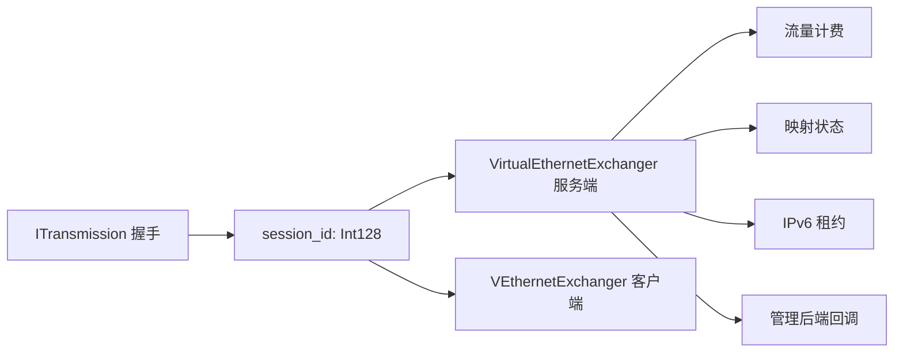
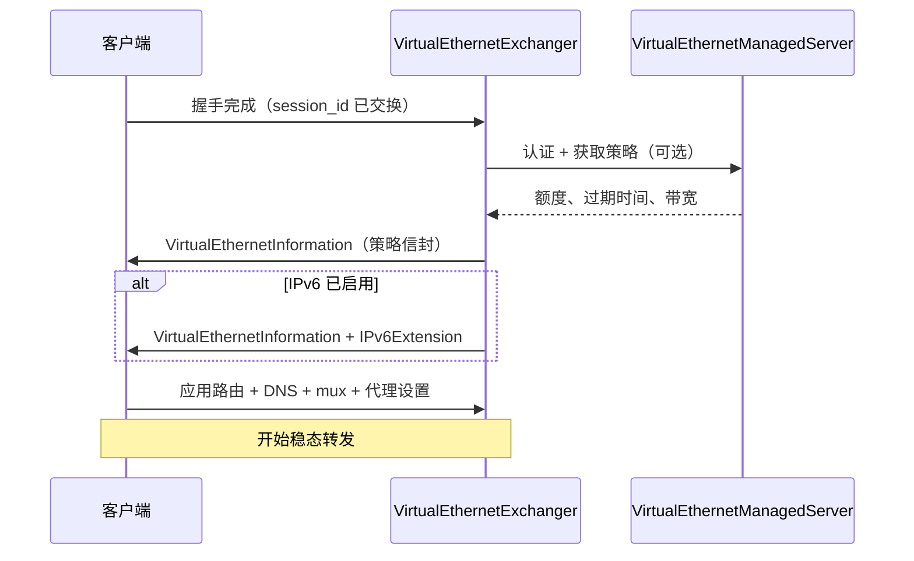
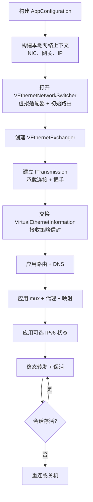
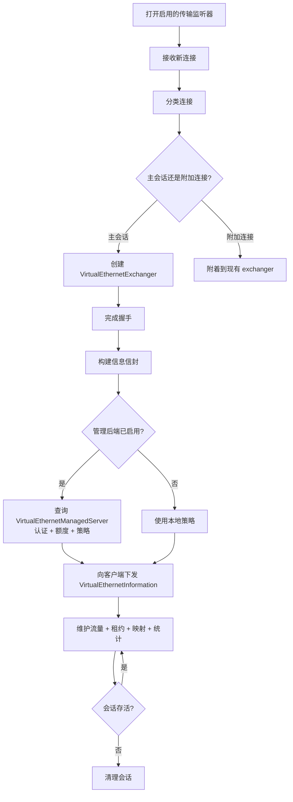
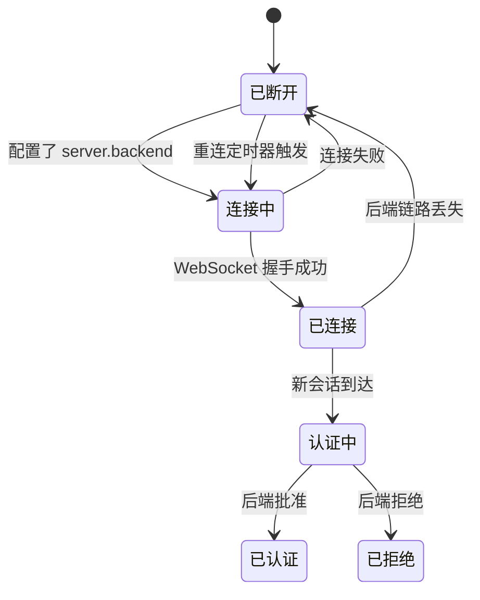
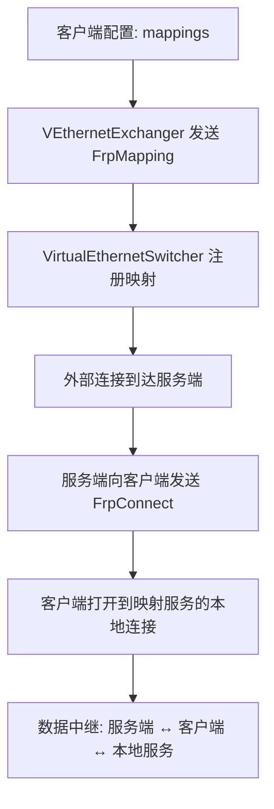

# 会话与控制面模型

[English Version](TRANSMISSION_PACK_SESSIONID.md)

## 目的

旧文件名（`TRANSMISSION_PACK_SESSIONID`）保留了历史痕迹。
真正有用的主题是：OPENPPP2 如何在握手后承载会话标识、会话信息和控制动作。

本文涵盖：
- 会话标识如何建立和维护
- 握手后交换哪些信息
- 客户端和服务端流程的完整生命周期
- 额度、过期、映射和失败处理

---

## 核心对象

| 对象 | 文件 | 角色 |
|------|------|------|
| `ITransmission` | `ppp/transmissions/ITransmission.*` | 受保护传输、分帧、握手 |
| `VirtualEthernetInformation` | `ppp/app/protocol/VirtualEthernetInformation.*` | 会话信封（策略 + IPv6 分配） |
| `VirtualEthernetLinklayer` | `ppp/app/protocol/VirtualEthernetLinklayer.*` | 隧道动作协议 |
| `VirtualEthernetSwitcher` | `ppp/app/server/VirtualEthernetSwitcher.*` | 服务端会话管理 |
| `VEthernetExchanger`（客户端） | `ppp/app/client/VEthernetExchanger.*` | 客户端会话管理 |
| `VirtualEthernetExchanger`（服务端） | `ppp/app/server/VirtualEthernetExchanger.*` | 每会话服务端处理器 |
| `VirtualEthernetManagedServer` | `ppp/app/server/VirtualEthernetManagedServer.*` | 可选管理后端桥 |

---

## 会话标识

会话标识以 `Int128`（来自 `ppp/stdafx.h` 的 128 位整数类型）为中心。



`session_id` 用于：
- 将一个逻辑隧道交换绑定到一个传输会话
- 追踪服务端 exchanger 状态
- 作为流量计费记录的键
- 作为映射注册表的键
- 在管理后端调用中标识会话

---

## 信息交换（`VirtualEthernetInformation`）

握手后，服务端向客户端下发会话信封。

### 信封字段

| 字段 | 类型 | 描述 |
|------|------|------|
| `BandwidthQoS` | int | 带宽限制（Kbps，0 表示无限制） |
| `IncomingTraffic` | int64 | 入流量计数器（字节数） |
| `OutgoingTraffic` | int64 | 出流量计数器（字节数） |
| `ExpiredTime` | int64 | 会话过期 Unix 时间戳（0 表示不过期） |

### IPv6 扩展字段

IPv6 扩展补充以下字段：

| 字段 | 类型 | 描述 |
|------|------|------|
| `Mode` | enum | 分配模式（Static、SLAAC、DHCPv6） |
| `Address` | string | 分配的 IPv6 地址 |
| `PrefixLength` | int | 前缀长度（如 64） |
| `GatewayAddress` | string | IPv6 网关地址 |
| `DnsAddresses` | string[] | 分配的 IPv6 DNS 服务器 |
| `Result` | int | 分配结果码（成功/失败原因） |

同一类消息可以同时承载通用策略和 IPv6 下发结果。

### 信息交换流程



源文件：`ppp/app/protocol/VirtualEthernetInformation.h`

---

## 握手后的控制动作

握手完成后，链路层（`VirtualEthernetLinklayer`）承载以下动作：

### TCP 动作

| 动作 | 方向 | 描述 |
|------|------|------|
| `ConnectTcp` | C → S | 打开到远端目标的 TCP 流 |
| `PushTcp` | C ↔ S | 传输 TCP payload 段 |
| `DisconnectTcp` | C ↔ S | 关闭 TCP 流 |

### UDP 动作

| 动作 | 方向 | 描述 |
|------|------|------|
| `SendUdp` | C ↔ S | 传输 UDP 数据报 |
| `StaticPath` | C ↔ S | 配置 static UDP 绕行路径 |

### 会话管理动作

| 动作 | 方向 | 描述 |
|------|------|------|
| `Information` | S → C | 下发策略信封 |
| `Keepalive` | C ↔ S | 会话活跃性探测 |
| `Echo` / `EchoReply` | C ↔ S | 往返延迟测量 |
| `Mux` | C → S | 配置 MUX 传输 |

### FRP 动作（反向代理）

| 动作 | 方向 | 描述 |
|------|------|------|
| `FrpMapping` | C → S | 注册反向映射 |
| `FrpConnect` | S → C | 通知反向连接已到达 |
| `FrpPush` | C ↔ S | 在反向连接上传输数据 |
| `FrpDisconnect` | C ↔ S | 关闭反向连接 |
| `FrpUdpRelay` | C ↔ S | 反向路径上的 UDP 中继 |

---

## 客户端流程



客户端关键对象和文件：
- `ppp/app/client/VEthernetExchanger.h` — 客户端会话 exchanger
- `ppp/app/client/VEthernetNetworkSwitcher.h` — 路由和 DNS 管理
- `ppp/app/client/VEthernetDatagramPort.h` — UDP 转发

---

## 服务端流程



`VirtualEthernetSwitcher` 负责协调服务端生命周期。

服务端关键对象和文件：
- `ppp/app/server/VirtualEthernetSwitcher.h` — 服务端会话协调器
- `ppp/app/server/VirtualEthernetExchanger.h` — 每会话处理器
- `ppp/app/server/VirtualEthernetManagedServer.h` — 管理后端桥
- `ppp/app/server/VirtualEthernetDatagramPort.h` — 服务端 UDP 转发
- `ppp/app/server/VirtualEthernetNamespaceCache.h` — DNS 命名空间缓存

---

## 管理面

`VirtualEthernetManagedServer` 是可选的。

它通过 WebSocket 或安全 WebSocket 把隧道服务端接到外部 Go 管理后端，用于：
- 认证（验证用户凭证）
- 计费（上报流量字节数）
- 可达性检查（验证后端存活）
- 重连处理（后端链路断开后重建）

### 管理链路状态机



源文件：`ppp/app/server/VirtualEthernetManagedServer.h`

---

## 额度与过期

会话模型有显式的额度和过期管控钩子：

| 管控点 | 行为 |
|--------|------|
| 信封中的 `ExpiredTime` | 服务端在过期后拒绝或终止会话 |
| 信封中的 `BandwidthQoS` | 服务端对会话进行速率限制 |
| `IncomingTraffic` / `OutgoingTraffic` | 后端可在额度超出时拒绝续期 |
| 本地缓存 | 即使后端短暂不可用，运行时也能执行最近缓存的策略 |

即使管理后端不可用，服务端也能强制执行最近缓存的策略。

---

## 映射与反向访问

客户端 `mappings` 配置驱动 FRP 风格（快速反向代理）功能：



这支持：
- 通过服务端将本地服务暴露给公网
- 不开放客户端防火墙端口的受控反向访问

---

## API 参考

### `VirtualEthernetInformation::Serialize`

```cpp
/**
 * @brief 将信息信封序列化为二进制缓冲区。
 * @param buffer   输出缓冲区。
 * @param length   输出：写入的字节数。
 * @return         成功返回 true。
 */
bool Serialize(ppp::vector<Byte>& buffer, int& length) noexcept;
```

### `VirtualEthernetLinklayer::SendInformation`

```cpp
/**
 * @brief 向远端对等方发送信息信封。
 * @param y        协程 yield 上下文。
 * @param info     要发送的信息对象。
 * @return         成功返回 true。
 * @note           由服务端在握手完成后调用。
 */
bool SendInformation(YieldContext& y, const VirtualEthernetInformation& info) noexcept;
```

### `VirtualEthernetLinklayer::SendKeepalive`

```cpp
/**
 * @brief 发送保活 echo 以检测会话活跃性。
 * @param y        Yield 上下文。
 * @return         echo 成功发送时返回 true。
 * @note           若在超时内未收到响应，会话将被终止。
 */
bool SendKeepalive(YieldContext& y) noexcept;
```

---

## 失败模型

设计里预期会失败，因此提供了以下处理：

| 失败类型 | 处理方式 |
|---------|---------|
| 握手超时 | 连接被丢弃；设置诊断信息 |
| 重连超时 | 会话关闭；客户端可以重试 |
| 保活超时 | 会话被认为已死；触发清理 |
| 管理后端丢失 | 定时重试；会话继续使用缓存策略 |
| 管理认证失败 | 会话被拒绝 |

---

## 错误码参考

会话与控制面相关的 `ppp::diagnostics::ErrorCode` 值（来自 `ppp/diagnostics/ErrorCodes.def`）：

| ErrorCode | 描述 |
|-----------|------|
| `SessionHandshakeFailed` | 传输握手未完成 |
| `SessionAuthFailed` | 会话认证失败 |
| `SessionQuotaExceeded` | 会话额度耗尽 |
| `SessionCreateFailed` | 会话创建失败 |
| `SessionOpenFailed` | 会话打开失败 |
| `SessionTransportMissing` | 会话传输缺失 |
| `KeepaliveTimeout` | 对端保活心跳超时 |
| `MappingCreateFailed` | 反向映射注册失败 |
| `VEthernetManagedAuthDuplicateSession` | 管理后端认证重复会话 |
| `VEthernetManagedConnectUrlEmpty` | 管理后端连接 URL 为空 |

---

## 使用示例

### 在服务端检查会话过期

```cpp
// ppp/app/server/VirtualEthernetExchanger.cpp
if (info.ExpiredTime > 0 && now > info.ExpiredTime) {
    SetLastError(ErrorCode::SessionDisposed, false);
    Dispose();
    return;
}
```

### 向新客户端发送信息信封

```cpp
// ppp/app/server/VirtualEthernetExchanger.cpp
VirtualEthernetInformation info;
info.BandwidthQoS     = GetBandwidthLimit();
info.ExpiredTime      = GetExpiryTime();
info.IncomingTraffic  = GetIncomingBytes();
info.OutgoingTraffic  = GetOutgoingBytes();

if (!linklayer_->SendInformation(y, info)) {
    return SetLastError(ErrorCode::TunnelWriteFailed, false);
}
```

### 注册客户端侧映射

```cpp
// ppp/app/client/VEthernetExchanger.cpp
for (auto& mapping : config_->client.mappings) {
    FrpMappingEntry entry;
    entry.remote_port = mapping.remote_port;
    entry.local_addr  = mapping.local_addr;
    entry.local_port  = mapping.local_port;
    entry.protocol    = mapping.protocol;

    linklayer_->SendFrpMapping(y, entry);
}
```

---

## 相关文档

- [`TRANSMISSION_CN.md`](TRANSMISSION_CN.md)
- [`ARCHITECTURE_CN.md`](ARCHITECTURE_CN.md)
- [`CONFIGURATION_CN.md`](CONFIGURATION_CN.md)
- [`SECURITY_CN.md`](SECURITY_CN.md)
- [`SERVER_ARCHITECTURE_CN.md`](SERVER_ARCHITECTURE_CN.md)
- [`CLIENT_ARCHITECTURE_CN.md`](CLIENT_ARCHITECTURE_CN.md)
- [`MANAGEMENT_BACKEND_CN.md`](MANAGEMENT_BACKEND_CN.md)
