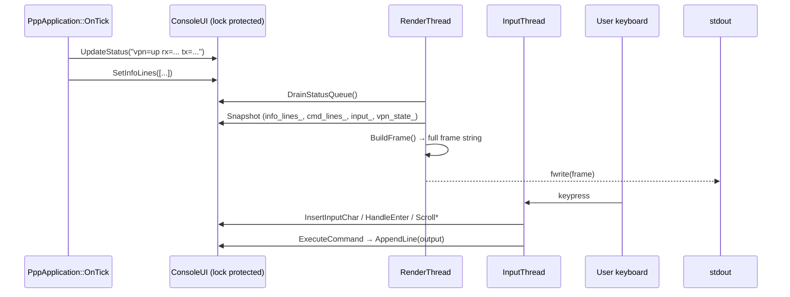
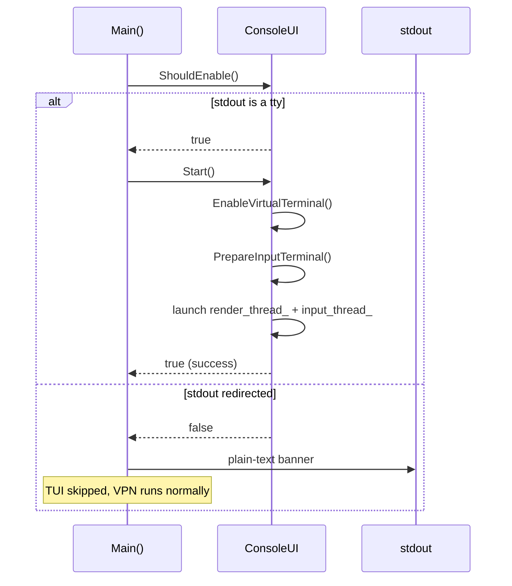

# TUI Design — PPP PRIVATE NETWORK™ 2 Console Interface

## Overview

The ConsoleUI subsystem (`ppp/app/ConsoleUI.h`, `ppp/app/ConsoleUI.cpp`) implements a
full-screen, box-drawing terminal UI that runs inside the existing application process.
It uses two dedicated threads (render and input) so that all blocking I/O stays off the
Boost.ASIO event loop.

When stdout is not connected to a real terminal (e.g. output redirected to a file or
pipe), the TUI is skipped entirely and basic startup information is printed in plain-text
format instead.

---

## Layout

```
┌──────────────────────────────────────────────────────────────────────┐  row 0
│ PageUp/PageDown: Scroll command input/output   PPP PRIVATE NETWORK™ 2│  row 1
│ Home/End       : Scroll openppp2 info                                │  row 2
│          ___  ____  _____ _   _ ____  ____  ____ ____               │  row 3
│         / _ \|  _ \| ____| \ | |  _ \|  _ \|  _ \___ \             │  row 4
│        | | | | |_) |  _| |  \| | |_) | |_) | |_) |__) |            │  row 5
│        | |_| |  __/| |___| |\  |  __/|  __/|  __// __/             │  row 6
│         \___/|_|   |_____|_| \_|_|   |_|   |_|  |_____|            │  row 7
│                                                                      │  row 8
├──────────────────────────────────────────────────────────────────────┤  row 9
│  [Info section — scrollable with Home / End]                         │
│  ...                                                                 │
├──────────────────────────────────────────────────────────────────────┤
│  [Cmd section — scrollable with PageUp / PageDown]                   │
│  ...                                                                 │
├──────────────────────────────────────────────────────────────────────┤
│  > [input or dim placeholder text]                                   │
├────────────────────────────────────┬─────────────────────────────────┤
│  Error: description (Ns ago)       │  VPN: Established  ↑x  ↓y      │
└────────────────────────────────────┴─────────────────────────────────┘
```

### Fixed rows

| Section              | Rows  |
|----------------------|-------|
| Top border           | 1     |
| Hint lines           | 2     |
| ASCII art            | 5     |
| Empty spacer         | 1     |
| Header separator     | 1     |
| **Total (header)**   | **10**|

| Section              | Rows  |
|----------------------|-------|
| Input separator      | 1     |
| Input row            | 1     |
| Status separator     | 1     |
| Status bar           | 1     |
| Bottom border        | 1     |
| **Total (footer)**   | **5** |

### Dynamic allocation

```
middle = terminal_height - 10 - 5
info_height = max(2,  (middle - 1) * 3 / 5)
cmd_height  = max(1,  middle - 1 - info_height)   # -1 for info/cmd separator
```

Minimum supported terminal size: **40 × 20**.

---

## Box-drawing character encoding

All border characters are encoded as UTF-8 3-byte sequences.  Each character
occupies exactly **one display column** on any compliant terminal.

| Symbol | Unicode | UTF-8 bytes      |
|--------|---------|------------------|
| `┌`    | U+250C  | E2 94 8C         |
| `┐`    | U+2510  | E2 94 90         |
| `└`    | U+2514  | E2 94 94         |
| `┘`    | U+2518  | E2 94 98         |
| `├`    | U+251C  | E2 94 9C         |
| `┤`    | U+2524  | E2 94 A4         |
| `┬`    | U+252C  | E2 94 AC         |
| `┴`    | U+2534  | E2 94 B4         |
| `─`    | U+2500  | E2 94 80         |
| `│`    | U+2502  | E2 94 82         |

---

## ASCII art coloring

The five-line art for "OPENPPP2" is split at display column **24**:

- Columns `[0, 24)` → dark gray ANSI `\x1b[90m` (represents **OPEN**)
- Columns `[24, end)` → bold bright-white ANSI `\x1b[1;97m` (represents **PPP2**)

Colors are only applied when `vt_enabled_` is true (VT100 processing confirmed on the
current console handle).

---

## Key bindings

| Key                | Action                                        |
|--------------------|-----------------------------------------------|
| `Home`             | Scroll info section to top (oldest content)   |
| `End`              | Scroll info section to bottom (newest)        |
| `PageUp`           | Scroll cmd section up (toward older output)   |
| `PageDown`         | Scroll cmd section down (toward newest)       |
| `Up Arrow`         | Recall previous command from history          |
| `Down Arrow`       | Recall next command / restore current input   |
| `Left Arrow`       | Move text cursor left                         |
| `Right Arrow`      | Move text cursor right                        |
| `Ctrl+A`           | Move cursor to beginning of line              |
| `Ctrl+E`           | Move cursor to end of line                    |
| `Backspace`        | Erase character before cursor                 |
| `Delete`           | Erase character at cursor                     |
| `Enter`            | Execute command                               |

---

## Built-in commands

| Command               | Alias        | Action                                         |
|-----------------------|--------------|------------------------------------------------|
| `openppp2 help`       | `help`       | Print command list to cmd output section       |
| `openppp2 restart`    | `restart`    | Graceful restart via ShutdownApplication(true) |
| `openppp2 reload`     | `reload`     | Alias for restart                              |
| `openppp2 exit`       | `exit`       | Exit via ShutdownApplication(false)            |
| `openppp2 info`       | `status`     | Copy current info snapshot to cmd output       |
| `openppp2 clear`      | `clear`      | Clear cmd output ring buffer                   |
| *(any other input)*   |              | Execute as shell command, capture output       |

### System command execution

Non-built-in commands are executed in a **detached std::thread** to avoid blocking the
input loop:

- **Windows**: `cmd /c <command> 2>&1`
- **Linux / macOS**: `<command> 2>&1`

Output lines from the subprocess are appended to `cmd_lines_` one at a time via `AppendLine()`.

---

## Refresh strategy

```
RenderLoop
  ├─ DrainStatusQueue()    — update vpn_state_text_ / speed_text_
  ├─ RenderFrame()         — build + write one complete frame
  └─ Sleep(100 ms)         — ~10 Hz update rate
```

`RenderFrame()` builds the entire frame as a single `ppp::string` in memory and emits it
with one `fwrite()` + `fflush()`.  This double-buffering approach prevents partial-frame
tearing.

When `vt_enabled_` is true:

1. `\x1b[?25l` — hide cursor before drawing
2. `\x1b[2J\x1b[H` — clear screen and home
3. Full frame content (box borders + colored art + section content)
4. `\x1b[row;col H` — move cursor to input line position
5. `\x1b[?25h` — show cursor

---

## No-tty fallback

```
ConsoleUI::ShouldEnable()
  ├─ Windows: _isatty(_fileno(stdout))
  └─ POSIX:   isatty(STDOUT_FILENO)
```

When `ShouldEnable()` returns `false`:

1. `ConsoleUI::Start()` is **not** called.
2. `PppApplication::Main()` prints a one-time plain-text banner to `stdout`:
   - Application version
   - Mode (client / server)
   - Process ID
   - Config file path
   - Working directory
3. The process continues with full VPN functionality.
4. No render thread, no input thread.

This ensures log capture via `./ppp > log.txt` or piped output works without interference.

---

## Thread safety

All mutable ConsoleUI state is protected by a single `std::mutex lock_`.  The render
thread and the input thread both acquire `lock_` for short critical sections (snapshot
copies) and then work on their local copies.

`running_` is a `std::atomic<bool>` used for lock-free thread lifecycle signaling with
`compare_exchange_strong(memory_order_acq_rel)`.

---

## Data flow



---

## Platform differences

| Platform | VT100 setup                               | Raw input mode            |
|----------|-------------------------------------------|---------------------------|
| Windows  | `SetConsoleMode(ENABLE_VIRTUAL_TERMINAL_PROCESSING)` | `_kbhit()` / `_getch()` polling |
| POSIX    | Assumed supported                         | `tcsetattr(TCSANOW, raw)` + `O_NONBLOCK` on stdin |

---

## Sequence: TUI startup


