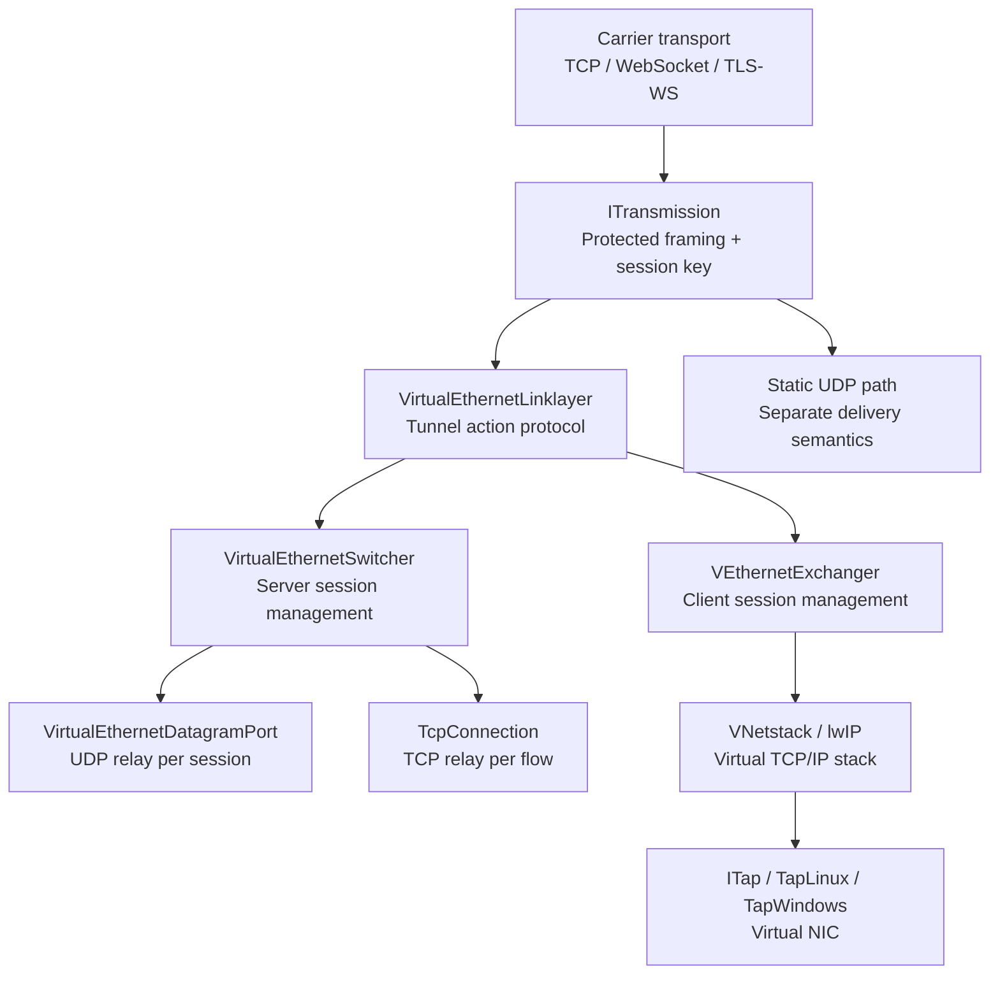
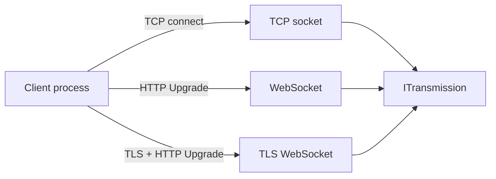
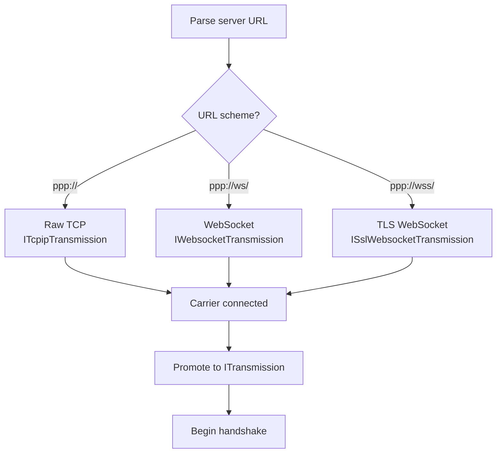
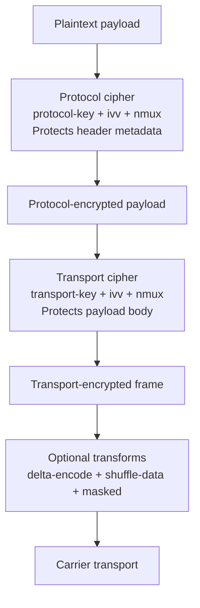
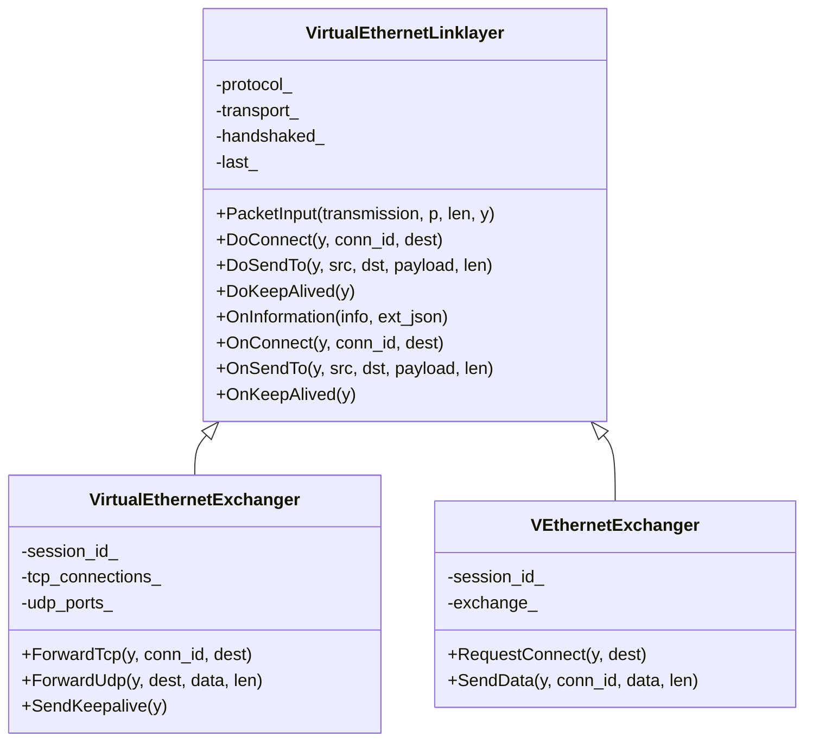
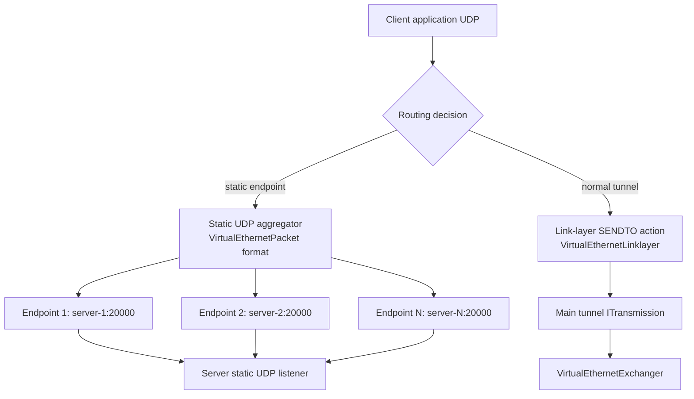
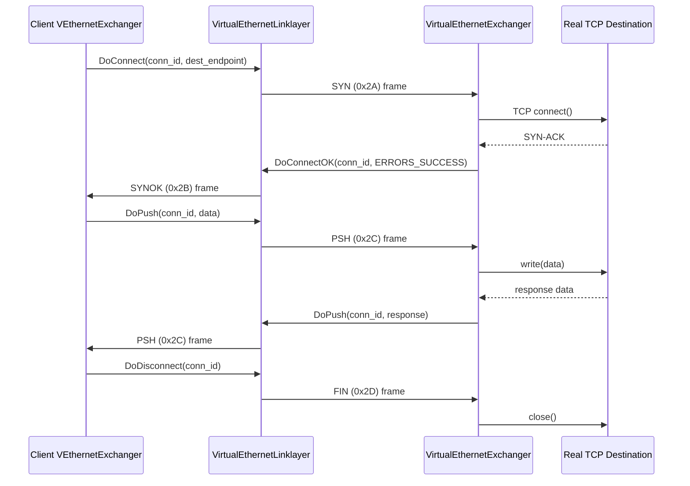
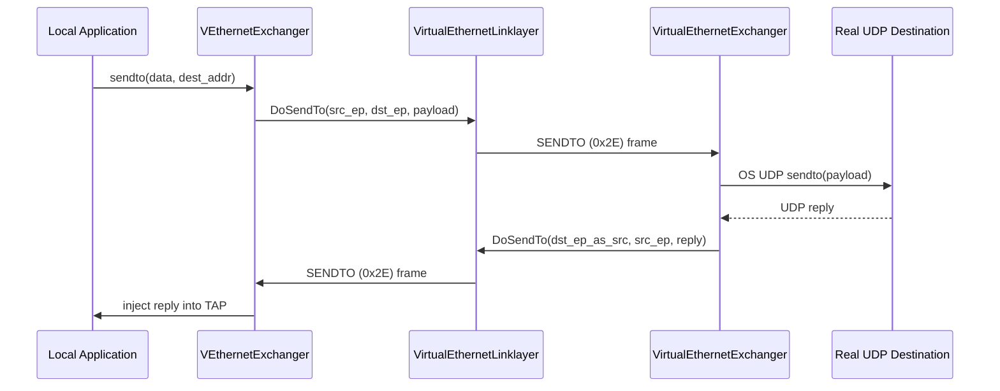
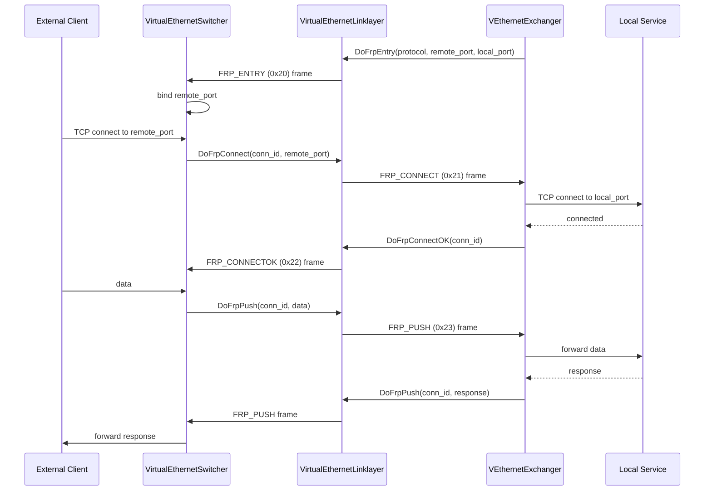

# Tunnel Design Deep Dive

[中文版本](TUNNEL_DESIGN_CN.md)

## Why This Exists

OPENPPP2 does not treat a tunnel as a single encrypted socket. The code splits the tunnel into transport carrier, protected framing, link-layer actions, and static packet handling. Understanding this split is essential for:

- Extending or modifying transport carriers (add a new one without touching crypto)
- Understanding handshake security properties
- Reasoning about packet lifecycle from TAP to remote destination
- Diagnosing per-session issues with the right mental model
- Writing correct unit tests for individual layers

---

## Layer Map



Each layer has a distinct responsibility and can be reasoned about independently.

---

## Layer 1: Carrier Transport

The outer carrier decides how bytes move between peers.

### Supported Carrier Types

| Carrier | Description | Config key |
|---------|-------------|------------|
| Raw TCP | Plain TCP socket connection | `server.listen.tcp` |
| WebSocket | HTTP upgrade to WebSocket | `server.listen.ws` |
| TLS WebSocket | TLS-backed WebSocket | `server.listen.wss` |
| WebSocket over CONNECT proxy | WebSocket through HTTP CONNECT proxy | `client.server-proxy` |

### Client URI Schemes

| URI Scheme | Meaning |
|-----------|---------|
| `ppp://host:port/` | Raw TCP carrier |
| `ppp://ws/host:port/` | WebSocket carrier |
| `ppp://wss/host:port/` | TLS WebSocket carrier |

### Carrier Responsibilities

The carrier layer is responsible for:
- Establishing the TCP or WebSocket connection (including HTTP Upgrade for WS/WSS)
- TLS negotiation for WSS (via Boost.Asio SSL)
- Delivering a reliable byte stream to the next layer
- Reporting connection errors to `ITransmission`

The carrier does **not** know about session identities, encryption keys, or link-layer actions.



### Carrier Selection Logic



### Key Source Files

- `ppp/transmissions/ITcpipTransmission.h` — TCP carrier
- `ppp/transmissions/IWebsocketTransmission.h` — WebSocket carrier
- `ppp/transmissions/ISslWebsocketTransmission.h` — TLS WebSocket carrier

---

## Layer 2: Protected Transmission (`ITransmission`)

`ITransmission` is the protection and framing layer above the raw carrier.

### Responsibilities

| Responsibility | Description |
|---------------|-------------|
| Transport handshake timeout | Limits how long the handshake phase can take |
| Handshake sequencing | Controls message order: NOP prelude → sid → ivv → nmux |
| Session identifier exchange | Establishes the `Int128` session ID |
| Per-connection `ivv` key variation | Derives session-specific working keys from base keys |
| Read/write framing | Encodes and decodes framed messages with seed + length header |
| Protocol-layer cipher state | Maintains `protocol-key` cipher context (`protocol_`) |
| Transport-layer cipher state | Maintains `transport-key` cipher context (`transport_`) |
| Statistics | Reports byte counters via `ITransmissionStatistics` |
| QoS | Consumes bandwidth tokens if `ITransmissionQoS` is attached |

### Key Derivation

The configured keys in `appsettings.json` are **base secrets**. Working keys for each connection are derived from the base secret combined with the connection-specific `ivv` and `nmux` values:

```
protocol_working_key  = KDF(key.kcp.protocol,  ivv + nmux + session_id)
transport_working_key = KDF(key.kcp.transport, ivv + nmux + session_id)
```

This provides per-session key isolation: even if one session's working key is compromised, other sessions remain protected because each has a different `ivv`.

### Two Independent Cipher Layers



Why two ciphers? The **protocol cipher** protects the frame header (length field and related metadata). An attacker who can read header metadata can perform traffic-shape fingerprinting attacks even without reading payload content. The **transport cipher** protects the actual payload. Two separate ciphers from two separate base keys means breaking one does not break the other.

### Optional Framing Transforms

| Flag | Config key | Effect |
|------|-----------|--------|
| `masked` | `key.masked` | Additional XOR masking layer on top of ciphers |
| `plaintext` | `key.plaintext` | Disable both ciphers (development/testing only; **never use in production**) |
| `delta-encode` | `key.delta-encode` | Delta-encode the ciphertext bytes; reduces entropy in repetitive patterns |
| `shuffle-data` | `key.shuffle-data` | Byte-level shuffle of payload; alters traffic fingerprint |

These flags affect traffic fingerprinting resistance. They do **not** replace proper cipher configuration.

### Pre-Handshake vs Post-Handshake Framing

The framing format changes at handshake completion:

| Phase | Header format | Cipher state |
|-------|--------------|-------------|
| Pre-handshake | Extended header (4+3 bytes), base94 encoding possible | Base key only, or plaintext |
| Post-handshake | Simple binary header (3 bytes: seed + 2 length bytes) | Working cipher (ivv + nmux derived) |

The transition is controlled by `handshaked_` (atomic bool) and `frame_tn_` / `frame_rn_` (framing state counters).

### API Reference

```cpp
/**
 * @brief Open the protected transmission and complete the handshake.
 * @param y  Yield context for coroutine suspension.
 * @return   true if handshake succeeded and session is established.
 * @note     Sets diagnostics on failure. Handshake has a configurable timeout.
 */
virtual bool Open(YieldContext& y) noexcept = 0;

/**
 * @brief Read one framed message from the protected transmission.
 * @param y       Yield context.
 * @param buffer  Output buffer.
 * @param length  Length of data read (output).
 * @return        true on success, false on error or EOF.
 * @note          Decrypts and validates the frame before returning to caller.
 */
virtual bool Read(YieldContext& y, ppp::vector<Byte>& buffer, int& length) noexcept = 0;

/**
 * @brief Write one framed message to the protected transmission.
 * @param y       Yield context.
 * @param buffer  Data to write.
 * @param offset  Start offset in buffer.
 * @param length  Number of bytes to write.
 * @return        true on success.
 * @note          Encrypts, frames, and writes atomically through the strand.
 */
virtual bool Write(YieldContext& y, const Byte* buffer, int offset, int length) noexcept = 0;

/**
 * @brief Dispose this transmission and release all resources.
 * @note  Idempotent. Safe to call from any thread. Uses atomic CAS pattern.
 */
virtual void Dispose() noexcept = 0;
```

Source: `ppp/transmissions/ITransmission.h`

---

## Transport Handshake Behavior

The handshake establishes session identity and per-connection keys. It also shapes traffic to resist passive traffic analysis.

```mermaid
sequenceDiagram
    participant Client as Client
    participant Server as Server

    Note over Client,Server: Early phase — base94 frames, dummy traffic
    Client->>Server: NOP prelude (variable length random dummy bytes, session_id=0)
    Server->>Client: NOP prelude (variable length random dummy bytes, session_id=0)

    Note over Client,Server: Identity phase
    Server->>Client: real session_id (Int128, assigned by VirtualEthernetSwitcher)
    Client->>Server: ivv (32-bit random, per-connection key variation seed)
    Server->>Client: nmux (random Int128; low bit = mux enable flag)

    Note over Client,Server: Both sides: rebuild protocol_ and transport_ ciphers
    Note over Client,Server: handshaked_ = true; working cipher state active
    Note over Client,Server: Switch to binary protected frame family
```

Handshake security properties:

| Property | Mechanism |
|---------|-----------|
| Passive traffic analysis resistance | NOP prelude uses random length and content |
| Session binding | `session_id` binds the logical session to this transport |
| Per-session key variation | `ivv` ensures each connection has distinct working keys |
| Mux state delivery | `nmux` low bit carries mux enable without a separate trivial boolean packet |
| Timeout bound | Handshake timer prevents half-open sessions from consuming server resources |
| Key confirmation | Key mismatch → cipher state mismatch → connection drop |

### Handshake Order Detail

Client:
1. Send NOP prelude
2. Receive `session_id` (loop until high bit clear = real packet)
3. Generate `ivv` (GUID-seeded random `Int128`)
4. Send `ivv`
5. Receive `nmux`
6. Set `handshaked_ = true`
7. Extract mux flag: `mux = (nmux & 1) != 0`
8. Rebuild both ciphers from `base_key + ivv + nmux`

Server:
1. Send NOP prelude
2. Send real `session_id` (assigned by switcher)
3. Generate random `nmux`; force low bit per mux config
4. Send `nmux`
5. Receive `ivv`
6. Set `handshaked_ = true`
7. Rebuild both ciphers from `base_key + ivv + nmux`

---

## Layer 3: Link-Layer Actions (`VirtualEthernetLinklayer`)

`VirtualEthernetLinklayer` defines the tunnel action vocabulary — the protocol spoken between client and server after the handshake is complete. Every operation that moves a packet, manages a flow, or changes session state is expressed as one of these actions.

### Action Opcode Table

| Opcode | Hex | Direction | Purpose |
|--------|-----|-----------|---------|
| `INFO` | `0x7E` | S→C, C→S | Session policy, quota, IPv6 assignment |
| `KEEPALIVED` | `0x7F` | C↔S | Heartbeat / liveness probe |
| `FRP_ENTRY` | `0x20` | C→S | Register reverse port mapping |
| `FRP_CONNECT` | `0x21` | S→C | Notify incoming reverse connection |
| `FRP_CONNECTOK` | `0x22` | C→S | Acknowledge reverse connection |
| `FRP_PUSH` | `0x23` | C↔S | Data on reverse connection |
| `FRP_DISCONNECT` | `0x24` | C↔S | Close reverse connection |
| `FRP_SENDTO` | `0x25` | C↔S | UDP relay on reverse path |
| `LAN` | `0x28` | C↔S | Subnet advertisement |
| `NAT` | `0x29` | C↔S | Raw IP / NAT forwarding |
| `SYN` | `0x2A` | C→S | TCP connect request |
| `SYNOK` | `0x2B` | S→C | TCP connect acknowledgment |
| `PSH` | `0x2C` | C↔S | TCP stream data |
| `FIN` | `0x2D` | C↔S | TCP close |
| `SENDTO` | `0x2E` | C↔S | UDP datagram relay |
| `ECHO` | `0x2F` | C↔S | Echo / latency probe |
| `ECHOACK` | `0x30` | C↔S | Echo acknowledgment |
| `STATIC` | `0x31` | C→S | Static path query |
| `STATICACK` | `0x32` | S→C | Static path confirmation |
| `MUX` | `0x35` | C→S | MUX channel setup request |
| `MUXON` | `0x36` | S→C | MUX channel setup acknowledgment |

### `Do*` vs `On*` Naming Convention

- **`Do*` methods**: serialize the action and send it to the remote peer. Example: `DoSendTo()` serializes a UDP datagram and writes it to `ITransmission`.
- **`On*` methods**: virtual methods invoked when a packet with the corresponding opcode is received. Example: `OnSendTo()` is called when the remote peer sends a `SENDTO` packet.

This naming convention cleanly separates send-path (outbound) from receive-path (inbound) logic throughout the codebase.

### Class Hierarchy



Source: `ppp/app/protocol/VirtualEthernetLinklayer.h`

---

## Layer 4: Static Packet Path

Static UDP is handled separately from the link-layer action path because it has:
1. Different delivery semantics (raw UDP, not framed actions)
2. Different state needs (aggregator multiplexing across multiple server endpoints)
3. Independent operation from the main tunnel session

### Static UDP Architecture



### Static Packet Wire Format

The `VirtualEthernetPacket` format used by static UDP encodes all session metadata in a self-contained packet:

| Field | Bytes | Description |
|-------|-------|-------------|
| `mask_id` | 1 | Non-zero random byte; drives per-packet key factor |
| `header_length` | 1 | Obfuscated total header length |
| `session_id` | 4 | Signed: positive = UDP family, negative = IP family (`~id`) |
| `checksum` | 2 | CRC over header + payload after transforms |
| `source_ip` | 4 | Source IPv4 address |
| `source_port` | 2 | Source UDP port |
| `destination_ip` | 4 | Destination IPv4 address |
| `destination_port` | 2 | Destination port |
| `payload` | variable | UDP data or raw IP datagram |

### Static UDP Configuration

```json
"udp": {
    "static": {
        "aggligator": 4,
        "servers": ["1.0.0.1:20000", "1.0.0.2:20000"]
    }
}
```

`aggligator` is the aggregation factor — how many parallel static UDP connections to maintain.

Source: `ppp/app/client/VEthernetNetworkSwitcher.h`

---

## Why The Split Matters

The four-layer split serves several engineering goals:

| Goal | How the split helps |
|------|---------------------|
| Carrier extensibility | New transports only need to satisfy the `ITransmission` interface |
| Security isolation | Encryption logic is contained in Layer 2, not spread across the codebase |
| Protocol extensibility | New link-layer actions can be added without touching crypto or transport |
| Static path independence | UDP aggregation can be deployed without modifying session logic |
| Testability | Each layer can be tested independently with mock implementations |
| Debugging | A bug in the cipher code cannot mask a bug in the FRP logic |

---

## Connection Lifecycle

```mermaid
stateDiagram-v2
    [*] --> CarrierConnecting : client initiates connection
    CarrierConnecting --> CarrierConnected : TCP/WS connected
    CarrierConnected --> HandshakeInProgress : ITransmission::Open
    HandshakeInProgress --> HandshakeFailed : timeout, error, or key mismatch
    HandshakeInProgress --> SessionEstablished : handshake OK
    SessionEstablished --> InformationExchanged : VirtualEthernetInformation delivered
    InformationExchanged --> Forwarding : routing, DNS, IPv6 applied
    Forwarding --> KeepaliveChecking : keepalive timer fires
    KeepaliveChecking --> Forwarding : reply received
    KeepaliveChecking --> SessionTimedOut : no reply within timeout
    Forwarding --> SessionClosed : either side initiates close
    SessionTimedOut --> [*]
    HandshakeFailed --> [*]
    SessionClosed --> [*]
```

---

## TCP Relay Flow



---

## UDP Relay Flow



---

## FRP Reverse Mapping Flow

FRP (Fast Reverse Proxy) allows clients to expose local services through the server:



---

## Error Code Reference

Tunnel-related `ppp::diagnostics::ErrorCode` values:

| ErrorCode | Description |
|-----------|-------------|
| `HandshakeFailed` | Protected transport handshake did not complete |
| `HandshakeTimeout` | Handshake exceeded the configured timeout |
| `SessionKeyDerivationFailed` | Could not derive working key from base key + ivv |
| `TransmissionReadFailed` | Framed read from `ITransmission` failed |
| `TransmissionWriteFailed` | Framed write to `ITransmission` failed |
| `CarrierConnectionFailed` | Carrier TCP/WebSocket connection failed |
| `CarrierTlsNegotiationFailed` | TLS negotiation failed (WSS carrier) |
| `LinkLayerProtocolError` | Invalid action type or malformed action frame |
| `InvalidOpcode` | Opcode byte not in recognized range |
| `OpcodeDirectionViolation` | Opcode received from disallowed direction |
| `KeepaliveTimeout` | No keepalive reply within timeout |
| `StaticPathNegotiationFailed` | STATIC/STATICACK exchange failed |
| `MuxNegotiationFailed` | MUX/MUXON exchange failed |
| `FrpEntryRegistrationFailed` | Server rejected FRP_ENTRY registration |

---

## Performance Considerations

### Zero-Copy Goals

The tunnel is designed to minimize data copies on the hot path:

| Stage | Copy cost |
|-------|-----------|
| TAP → `OnPacketInput()` | One copy: kernel fd read into user-space buffer |
| `OnPacketInput()` → `IPFrame::Parse()` | Zero-copy: `IPFrame` holds pointer into existing buffer |
| `IPFrame` → `DoSendTo()` | One copy: serialize into transmission write buffer |
| Encrypt | In-place: cipher operates on the same buffer |
| Write to socket | Zero-copy: `async_write` with scatter-gather |

The per-thread 64 KB buffer in `Executors` is the key to avoiding repeated heap allocation on the hot path. All operations within one `io_context` thread use this shared buffer without synchronization.

### Cipher Performance

AES-based ciphers with hardware AES-NI acceleration (x86/x64 with `-DENABLE_SIMD=ON`) operate at several GB/s per core, well above VPN throughput requirements. ChaCha20 is used where AES-NI is unavailable (most ARM platforms).

---

## Usage Examples

### Checking which transport carrier is active

```cpp
// ppp/app/server/VirtualEthernetExchanger.cpp
auto transmission = exchanger->GetTransmission();
if (transmission != NULLPTR) {
    auto kind = transmission->GetKind();
    // kind: TcpTransmission, WebSocketTransmission, SslWebSocketTransmission
}
```

### Sending a keepalive from the server side

```cpp
// ppp/app/server/VirtualEthernetExchanger.cpp
bool VirtualEthernetExchanger::SendKeepalive(
    const boost::asio::yield_context& y) noexcept
{
    auto linklayer = GetLinklayer();
    if (NULLPTR == linklayer) {
        return false;
    }
    return linklayer->DoKeepAlived(y);
}
```

### Handling an incoming TCP connect action

```cpp
// ppp/app/protocol/VirtualEthernetLinklayer.cpp
bool VirtualEthernetLinklayer::OnConnect(
    const boost::asio::yield_context& y,
    ppp::Int32                        connection_id,
    const IPEndPoint&                 destination) noexcept
{
    // Validate destination against firewall
    // Create outbound TCP socket
    // Register connection in session table
    // Send DoConnectOK with ERRORS_SUCCESS
    return true;
}
```

### Sending a UDP datagram through the tunnel

```cpp
// ppp/app/client/VEthernetExchanger.cpp
bool VEthernetExchanger::OnSendTo(
    const boost::asio::yield_context& y,
    const boost::asio::ip::udp::endpoint& src,
    const boost::asio::ip::udp::endpoint& dst,
    const Byte* payload,
    int         payload_length) noexcept
{
    return DoSendTo(y, src, dst, payload, payload_length);
}
```

---

## Source Reading Order

To understand the tunnel design from source, read in this order:

1. `ppp/transmissions/ITransmission.h` — framing and cipher interface
2. `ppp/transmissions/ITransmission.cpp` — handshake implementation
3. `ppp/app/protocol/VirtualEthernetLinklayer.h` — opcode enum and Do/On declarations
4. `ppp/app/protocol/VirtualEthernetLinklayer.cpp` — `PacketInput` dispatch
5. `ppp/app/protocol/VirtualEthernetInformation.h` — `INFO` envelope structure
6. `ppp/app/client/VEthernetExchanger.cpp` — client-side `On*` implementations
7. `ppp/app/server/VirtualEthernetExchanger.cpp` — server-side `On*` implementations
8. `ppp/app/server/VirtualEthernetSwitcher.cpp` — connection acceptance and session routing

---

## Related Documents

- [`TRANSMISSION.md`](TRANSMISSION.md) — ITransmission framing, cipher, and handshake in detail
- [`PACKET_FORMATS.md`](PACKET_FORMATS.md) — Wire format specifications for all frame types
- [`HANDSHAKE_SEQUENCE.md`](HANDSHAKE_SEQUENCE.md) — Step-by-step handshake sequence
- [`LINKLAYER_PROTOCOL.md`](LINKLAYER_PROTOCOL.md) — Full opcode vocabulary reference
- [`TRANSMISSION_PACK_SESSIONID.md`](TRANSMISSION_PACK_SESSIONID.md) — Session identity and control plane
- [`PACKET_LIFECYCLE.md`](PACKET_LIFECYCLE.md) — Complete packet journey from TAP to remote
- [`SECURITY.md`](SECURITY.md) — Security model and threat analysis
